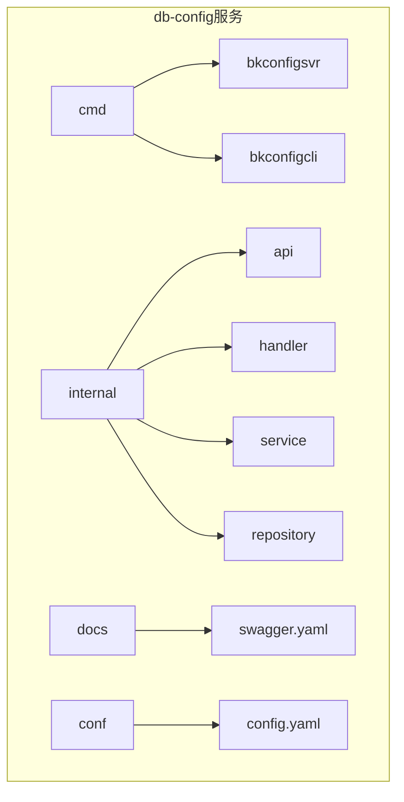
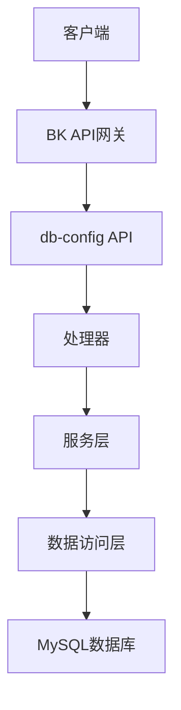
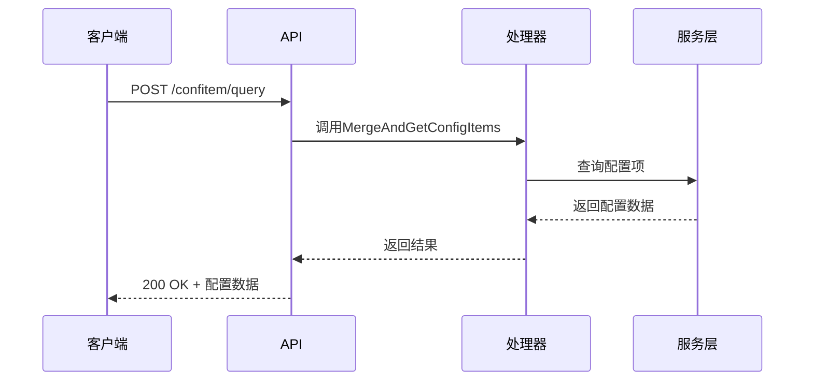
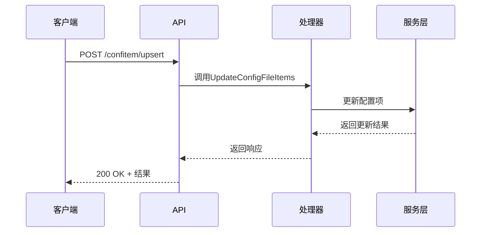
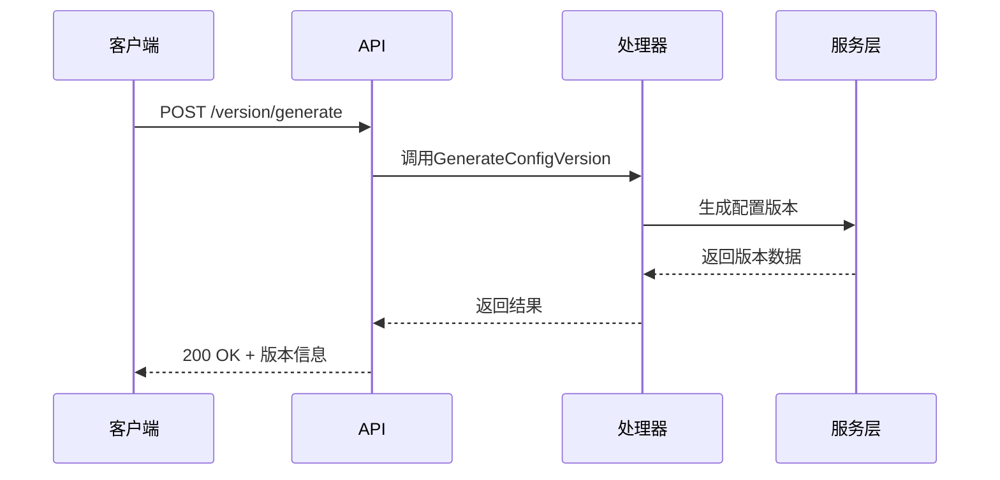
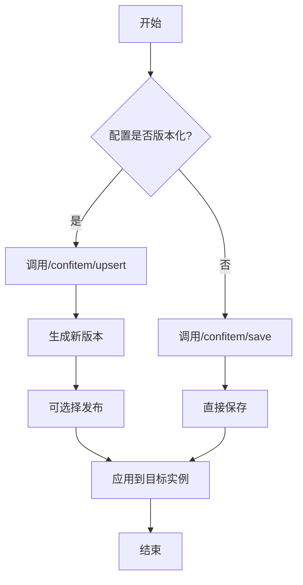
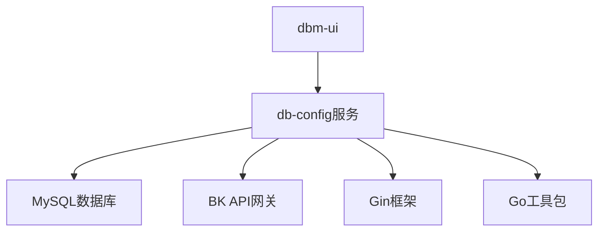

# db-config API

<cite>
**本文档引用的文件**   
- [README.md](file://dbm-services/common/db-config/README.md)
- [config_item.go](file://dbm-services/common/db-config/internal/api/config_item.go)
- [config_version.go](file://dbm-services/common/db-config/internal/api/config_version.go)
- [config_item.go](file://dbm-services/common/db-config/internal/handler/simple/config_item.go)
- [config_version.go](file://dbm-services/common/db-config/internal/handler/simple/config_version.go)
- [router.go](file://dbm-services/common/db-config/internal/router/router.go)
- [handlers.py](file://dbm-ui/backend/db_services/dbconfig/handlers.py)
- [swagger.yaml](file://dbm-services/common/db-config/docs/swagger.yaml)
</cite>

## 目录
1. [简介](#简介)
2. [项目结构](#项目结构)
3. [核心组件](#核心组件)
4. [架构概述](#架构概述)
5. [详细组件分析](#详细组件分析)
6. [依赖分析](#依赖分析)
7. [性能考虑](#性能考虑)
8. [故障排除指南](#故障排除指南)
9. [结论](#结论)
10. [附录](#附录)（如有必要）

## 简介
db-config服务是蓝鲸数据库管理系统中的核心配置管理组件，提供统一的RESTful API接口用于管理数据库配置。该服务支持配置查询、创建、更新和删除操作，实现了配置继承、版本控制和灰度发布等高级特性。API设计遵循RESTful原则，通过HTTP方法和URL路径提供对配置资源的完整CRUD操作。服务支持JSON Schema格式的请求/响应数据，并通过BK API网关进行统一认证。前端dbm-ui通过Python客户端调用这些API实现用户界面功能。

## 项目结构
db-config服务位于`dbm-services/common/db-config`目录下，采用标准的Go语言项目结构。服务包含API路由、处理器、业务逻辑和服务层，以及数据库迁移脚本和Swagger文档。核心功能分布在internal/api和internal/handler目录中，其中simple包提供了主要的配置管理功能。



**图源**
- [README.md](file://dbm-services/common/db-config/README.md)

## 核心组件
db-config服务的核心组件包括配置项管理、版本控制和继承机制。服务通过RESTful API提供对配置的完整生命周期管理，支持平台级、业务级、模块级和集群级的多层级配置。配置项可以定义数据类型、默认值、允许值范围等属性，并支持值加密存储。服务实现了配置继承机制，下级配置可以继承上级配置并进行覆盖。

**节源**
- [README.md](file://dbm-services/common/db-config/README.md)
- [config_item.go](file://dbm-services/common/db-config/internal/api/config_item.go)

## 架构概述
db-config服务采用分层架构设计，包括API层、处理器层、服务层和数据访问层。API层通过Gin框架处理HTTP请求，处理器层实现业务逻辑，服务层封装核心功能，数据访问层与MySQL数据库交互。服务通过BK API网关集成，支持统一认证和权限控制。



**图源**
- [router.go](file://dbm-services/common/db-config/internal/router/router.go)
- [config_item.go](file://dbm-services/common/db-config/internal/handler/simple/config_item.go)

## 详细组件分析

### 配置项管理分析
配置项管理是db-config服务的核心功能，提供对配置项的查询、创建、更新和删除操作。服务支持多种返回格式，包括list和map格式，满足不同场景的需求。

#### 配置项查询


**图源**
- [config_item.go](file://dbm-services/common/db-config/internal/handler/simple/config_item.go)
- [config_item.go](file://dbm-services/common/db-config/internal/api/config_item.go)

#### 配置项更新


**图源**
- [config_item.go](file://dbm-services/common/db-config/internal/handler/simple/config_item.go)
- [config_item.go](file://dbm-services/common/db-config/internal/api/config_item.go)

### 版本控制分析
版本控制功能支持配置的版本化管理，允许生成、发布和查询历史版本。

#### 配置版本生成


**图源**
- [config_version.go](file://dbm-services/common/db-config/internal/handler/simple/config_version.go)
- [config_version.go](file://dbm-services/common/db-config/internal/api/config_version.go)

#### 配置发布流程


**图源**
- [README.md](file://dbm-services/common/db-config/README.md)
- [config_item.go](file://dbm-services/common/db-config/internal/handler/simple/config_item.go)

## 依赖分析
db-config服务依赖于MySQL数据库存储配置数据，通过BK API网关进行认证和权限控制。服务与前端dbm-ui通过RESTful API交互，并依赖于Go语言生态中的Gin框架和相关工具包。



**图源**
- [go.mod](file://dbm-services/common/db-config/go.mod)
- [router.go](file://dbm-services/common/db-config/internal/router/router.go)

## 性能考虑
db-config服务通过缓存机制优化性能，使用freecache缓存配置文件定义和配置层级定义。服务在生成配置版本时实现了并发控制，通过随机延迟和存在性检查避免重复生成。对于频繁查询的配置项，建议客户端实现本地缓存以减少API调用。

## 故障排除指南
常见问题包括配置继承异常、版本发布失败和权限不足。对于配置继承问题，检查配置层级和锁定状态；对于版本发布失败，验证配置是否支持版本化；对于权限问题，确认用户具有相应的操作权限。服务提供详细的错误码和消息，帮助定位和解决问题。

**节源**
- [errno.go](file://dbm-services/common/go-pubpkg/errno/errno.go)
- [config_item.go](file://dbm-services/common/db-config/internal/handler/simple/config_item.go)

## 结论
db-config服务提供了完整的数据库配置管理解决方案，支持多层级配置继承、版本控制和灰度发布等高级特性。API设计合理，文档完善，易于集成和使用。服务架构清晰，性能优化到位，是蓝鲸数据库管理系统的核心组件之一。

## 附录

### RESTful API端点
以下是db-config服务的主要RESTful API端点：

| HTTP方法 | URL路径 | 描述 | 认证机制 |
|---------|--------|------|----------|
| POST | /bkconfig/v1/confitem/query | 查询配置项 | BK API网关 |
| POST | /bkconfig/v1/confitem/upsert | 创建/更新配置项（版本化） | BK API网关 |
| POST | /bkconfig/v1/confitem/save | 创建/更新配置项（非版本化） | BK API网关 |
| POST | /bkconfig/v1/version/generate | 生成配置文件新版本 | BK API网关 |
| POST | /bkconfig/v1/version/publish | 发布配置版本 | BK API网关 |
| GET | /bkconfig/v1/version/detail | 查询版本详细信息 | BK API网关 |
| GET | /bkconfig/v1/version/list | 查询历史版本列表 | BK API网关 |

### 错误码说明
| 错误码 | 描述 | 解决方案 |
|-------|------|----------|
| 10001 | 服务器内部错误 | 检查服务日志 |
| 10002 | 请求参数绑定错误 | 验证请求格式 |
| 10005 | 输入参数错误 | 检查参数值 |
| 30401 | 配置类型未注册 | 注册配置类型 |
| 30402 | 配置项未定义 | 定义配置项 |

### 配置继承规则
配置继承遵循以下规则：
- 平台级配置 → 业务级配置 → 模块级配置 → 集群级配置
- 下级配置继承上级配置，可进行覆盖
- 锁定的配置项不能在下级修改
- 继承时自动合并配置项

### 客户端调用示例

#### Go客户端调用
```go
// 创建HTTP客户端
client := &http.Client{}
// 构建请求
req, _ := http.NewRequest("POST", "http://api/dbconfig/v1/confitem/query", nil)
// 设置认证头
req.Header.Set("X-Bkapi-Authorization", "your-token")
// 发送请求
resp, _ := client.Do(req)
```

#### Python客户端调用
```python
import requests

# 调用配置查询API
response = requests.post(
    'http://api/dbconfig/v1/confitem/query',
    json={
        'bk_biz_id': '123',
        'namespace': 'mysql',
        'conf_type': 'dbconf',
        'conf_file': 'MySQL-5.7',
        'level_name': 'app',
        'level_value': '123',
        'format': 'map'
    },
    headers={'X-Bkapi-Authorization': 'your-token'}
)
print(response.json())
```

**节源**
- [handlers.py](file://dbm-ui/backend/db_services/dbconfig/handlers.py)
- [swagger.yaml](file://dbm-services/common/db-config/docs/swagger.yaml)