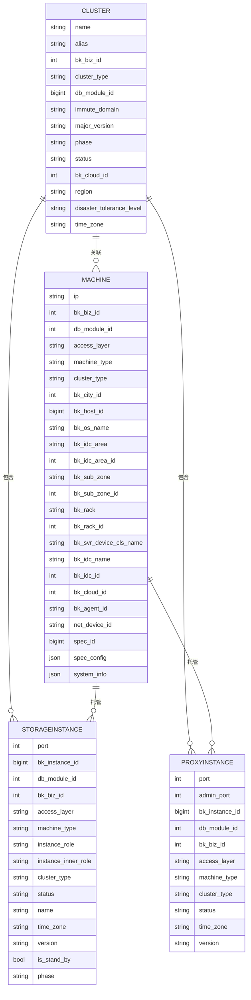
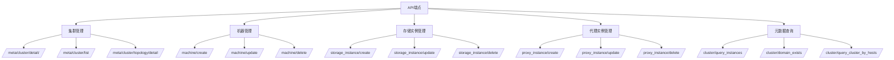

# db-meta API

<cite>
**本文档引用的文件**
- [api_type_const.go](file://dbm-services/k8s-dbs/common/constant/api_type_const.go)
- [harvest_data.go](file://dbm-services/common/dbha-v2/pkg/storage/haprobe/harvest_data.go)
- [0009_auto_20230517_1047.py](file://dbm-ui/backend/db_meta/migrations/0009_auto_20230517_1047.py)
- [urls.py](file://dbm-ui/backend/db_meta/urls.py)
- [apis.py](file://dbm-ui/backend/db_meta/api/cluster/apis.py)
- [cluster.py](file://dbm-ui/backend/db_meta/models/cluster.py)
- [machine.py](file://dbm-ui/backend/db_meta/models/machine.py)
- [storage_instance/apis.py](file://dbm-ui/backend/db_meta/api/storage_instance/apis.py)
- [proxy_instance/apis.py](file://dbm-ui/backend/db_meta/api/proxy_instance/apis.py)
</cite>

## 目录
1. [简介](#简介)
2. [元数据模型](#元数据模型)
3. [核心API端点](#核心api端点)
4. [集群管理API](#集群管理api)
5. [机器管理API](#机器管理api)
6. [存储实例管理API](#存储实例管理api)
7. [代理实例管理API](#代理实例管理api)
8. [元数据关系与约束](#元数据关系与约束)
9. [使用示例](#使用示例)
10. [上层业务支持](#上层业务支持)

## 简介
db-meta服务是蓝鲸智云DB管理系统的核心元数据管理组件，负责管理数据库集群、机器、存储实例和代理实例等核心元数据。该服务为上层业务逻辑提供统一的元数据访问接口，确保数据库资源的准确性和一致性。

**Section sources**
- [urls.py](file://dbm-ui/backend/db_meta/urls.py#L1-L77)

## 元数据模型
db-meta服务定义了四个核心元数据模型：集群（Cluster）、机器（Machine）、存储实例（StorageInstance）和代理实例（ProxyInstance）。这些模型通过关系数据库进行持久化存储，并通过API提供CRUD操作。



**Diagram sources**
- [cluster.py](file://dbm-ui/backend/db_meta/models/cluster.py#L57-L501)
- [machine.py](file://dbm-ui/backend/db_meta/models/machine.py#L34-L249)

## 核心API端点
db-meta服务提供了丰富的API端点，用于管理核心元数据。这些API端点遵循RESTful设计原则，支持标准的HTTP方法。



**Diagram sources**
- [urls.py](file://dbm-ui/backend/db_meta/urls.py#L1-L77)
- [api_type_const.go](file://dbm-services/k8s-dbs/common/constant/api_type_const.go#L136-L175)

## 集群管理API
集群管理API提供了对数据库集群的完整生命周期管理功能，包括创建、查询、更新和删除操作。

### 集群详情查询
获取指定集群的详细信息。

**端点**: `GET /meta/cluster/detail/<cluster_id>/`

**参数**:
- `cluster_id`: 集群ID

**返回值**:
```json
{
  "id": 1,
  "name": "mysql-cluster-01",
  "bk_biz_id": 100,
  "cluster_type": "TenDBHA",
  "immute_domain": "mysql-cluster-01.example.com",
  "major_version": "5.7",
  "phase": "ONLINE",
  "status": "NORMAL",
  "bk_cloud_id": 0,
  "region": "shanghai",
  "disaster_tolerance_level": "NONE",
  "time_zone": "Asia/Shanghai"
}
```

### 集群列表查询
获取符合条件的集群列表。

**端点**: `GET /meta/cluster/list/`

**参数**:
- `bk_biz_id`: 业务ID
- `cluster_type`: 集群类型
- `status`: 集群状态

**返回值**:
```json
{
  "count": 1,
  "results": [
    {
      "id": 1,
      "name": "mysql-cluster-01",
      "bk_biz_id": 100,
      "cluster_type": "TenDBHA",
      "immute_domain": "mysql-cluster-01.example.com",
      "major_version": "5.7"
    }
  ]
}
```

### 集群拓扑详情
获取集群的完整拓扑结构，包括所有关联的机器、存储实例和代理实例。

**端点**: `GET /meta/cluster/topology/detail/<cluster_id>/`

**参数**:
- `cluster_id`: 集群ID

**返回值**:
```json
{
  "cluster": {
    "id": 1,
    "name": "mysql-cluster-01",
    "immute_domain": "mysql-cluster-01.example.com"
  },
  "machines": [
    {
      "ip": "192.168.1.10",
      "bk_host_id": 1001,
      "machine_type": "BACKEND",
      "bk_idc_name": "Shanghai-IDC1"
    }
  ],
  "storage_instances": [
    {
      "ip": "192.168.1.10",
      "port": 3306,
      "instance_role": "BACKEND_MASTER",
      "status": "RUNNING"
    }
  ],
  "proxy_instances": [
    {
      "ip": "192.168.1.20",
      "port": 30000,
      "status": "RUNNING"
    }
  ]
}
```

**Section sources**
- [cluster.py](file://dbm-ui/backend/db_meta/models/cluster.py#L57-L501)
- [apis.py](file://dbm-ui/backend/db_meta/api/cluster/apis.py#L25-L131)

## 机器管理API
机器管理API提供了对物理或虚拟机器的管理功能，包括创建、更新和删除操作。

### 机器创建
创建新的机器记录。

**端点**: `POST /machine/create/`

**请求体**:
```json
{
  "ip": "192.168.1.10",
  "bk_biz_id": 100,
  "db_module_id": 200,
  "access_layer": "STORAGE",
  "machine_type": "BACKEND",
  "cluster_type": "TenDBHA",
  "bk_city_id": 1,
  "bk_host_id": 1001,
  "bk_os_name": "CentOS 7.6",
  "bk_idc_name": "Shanghai-IDC1",
  "bk_cloud_id": 0
}
```

**返回值**:
```json
{
  "ip": "192.168.1.10",
  "bk_host_id": 1001,
  "machine_type": "BACKEND",
  "status": "CREATED"
}
```

### 机器更新
更新现有机器的信息。

**端点**: `PUT /machine/update/`

**请求体**:
```json
{
  "ip": "192.168.1.10",
  "bk_cloud_id": 0,
  "updates": {
    "bk_os_name": "CentOS 7.9",
    "spec_id": 100,
    "spec_config": {
      "cpu": 8,
      "mem": 32,
      "disk": 500
    }
  }
}
```

**返回值**:
```json
{
  "ip": "192.168.1.10",
  "bk_host_id": 1001,
  "status": "UPDATED"
}
```

### 机器删除
删除指定的机器记录。

**端点**: `DELETE /machine/delete/`

**请求体**:
```json
{
  "ip": "192.168.1.10",
  "bk_cloud_id": 0
}
```

**返回值**:
```json
{
  "ip": "192.168.1.10",
  "status": "DELETED"
}
```

**Section sources**
- [machine.py](file://dbm-ui/backend/db_meta/models/machine.py#L34-L249)

## 存储实例管理API
存储实例管理API提供了对数据库存储实例的完整管理功能。

### 存储实例创建
创建新的存储实例。

**端点**: `POST /storage_instance/create/`

**请求体**:
```json
{
  "instances": [
    {
      "ip": "192.168.1.10",
      "port": 3306,
      "instance_role": "BACKEND_MASTER",
      "name": "master-01",
      "db_version": "5.7.30",
      "is_stand_by": false
    }
  ],
  "creator": "admin"
}
```

**返回值**:
```json
[
  {
    "id": 1,
    "ip": "192.168.1.10",
    "port": 3306,
    "instance_role": "BACKEND_MASTER",
    "status": "RUNNING"
  }
]
```

### 存储实例更新
更新存储实例的状态和角色。

**端点**: `PUT /storage_instance/update/`

**请求体**:
```json
{
  "instances": [
    {
      "ip": "192.168.1.10",
      "port": 3306,
      "status": "UNAVAILABLE",
      "instance_role": "BACKEND_SLAVE"
    }
  ]
}
```

**返回值**:
```json
{
  "status": "UPDATED"
}
```

### 存储实例删除
删除指定的存储实例。

**端点**: `DELETE /storage_instance/delete/`

**请求体**:
```json
{
  "instances": [
    {
      "ip": "192.168.1.10",
      "port": 3306,
      "bk_cloud_id": 0
    }
  ]
}
```

**返回值**:
```json
{
  "status": "DELETED"
}
```

**Section sources**
- [storage_instance/apis.py](file://dbm-ui/backend/db_meta/api/storage_instance/apis.py#L29-L142)

## 代理实例管理API
代理实例管理API提供了对数据库代理实例的管理功能。

### 代理实例创建
创建新的代理实例。

**端点**: `POST /proxy_instance/create/`

**请求体**:
```json
{
  "proxies": [
    {
      "ip": "192.168.1.20",
      "port": 30000,
      "version": "2.0.0"
    }
  ],
  "creator": "admin"
}
```

**返回值**:
```json
[
  {
    "id": 1,
    "ip": "192.168.1.20",
    "port": 30000,
    "admin_port": 31000,
    "status": "RUNNING"
  }
]
```

### 代理实例更新
更新代理实例的状态。

**端点**: `PUT /proxy_instance/update/`

**请求体**:
```json
{
  "proxies": [
    {
      "ip": "192.168.1.20",
      "port": 30000,
      "status": "UNAVAILABLE"
    }
  ]
}
```

**返回值**:
```json
{
  "status": "UPDATED"
}
```

### 代理实例删除
删除指定的代理实例。

**端点**: `DELETE /proxy_instance/delete/`

**请求体**:
```json
{
  "proxies": [
    {
      "ip": "192.168.1.20",
      "port": 30000,
      "bk_cloud_id": 0
    }
  ]
}
```

**返回值**:
```json
{
  "status": "DELETED"
}
```

**Section sources**
- [proxy_instance/apis.py](file://dbm-ui/backend/db_meta/api/proxy_instance/apis.py#L24-L80)

## 元数据关系与约束
db-meta服务中的元数据模型之间存在严格的关联关系和约束条件，确保数据的一致性和完整性。

```mermaid
classDiagram
class Cluster {
+string name
+string immute_domain
+int bk_biz_id
+string cluster_type
+string status
+get_partition_port() int
+tendbcluster_ctl_primary_address() string
}
class Machine {
+string ip
+bigint bk_host_id
+string machine_type
+string access_layer
+dbm_meta() dict
}
class StorageInstance {
+int port
+string instance_role
+string status
}
class ProxyInstance {
+int port
+int admin_port
+string status
}
Cluster "1" *-- "0..*" StorageInstance : 包含
Cluster "1" *-- "0..*" ProxyInstance : 包含
Machine "1" *-- "0..*" StorageInstance : 托管
Machine "1" *-- "0..*" ProxyInstance : 托管
Cluster "1" *-- "0..*" Machine : 关联
note right of Cluster
集群是管理的基本单位
包含多个存储和代理实例
end note
note right of Machine
机器是物理或虚拟主机
可以托管存储或代理实例
end note
note right of StorageInstance
存储实例是数据库服务实例
如MySQL、Redis等
end note
note right of ProxyInstance
代理实例是访问代理
如ProxySQL、Twemproxy等
end note
```

**Diagram sources**
- [cluster.py](file://dbm-ui/backend/db_meta/models/cluster.py#L57-L501)
- [machine.py](file://dbm-ui/backend/db_meta/models/machine.py#L34-L249)

## 使用示例
以下示例展示了如何使用db-meta API创建数据库集群和查询实例拓扑。

### 创建数据库集群
```python
# 1. 创建机器
machine_data = {
    "ip": "192.168.1.10",
    "bk_biz_id": 100,
    "access_layer": "STORAGE",
    "machine_type": "BACKEND",
    "cluster_type": "TenDBHA",
    "bk_host_id": 1001
}
requests.post("/machine/create/", json=machine_data)

# 2. 创建存储实例
storage_data = {
    "instances": [
        {
            "ip": "192.168.1.10",
            "port": 3306,
            "instance_role": "BACKEND_MASTER"
        }
    ],
    "creator": "admin"
}
requests.post("/storage_instance/create/", json=storage_data)

# 3. 创建代理机器
proxy_machine_data = {
    "ip": "192.168.1.20",
    "bk_biz_id": 100,
    "access_layer": "PROXY",
    "machine_type": "SINGLE_LEVEL_PROXY",
    "cluster_type": "TenDBHA",
    "bk_host_id": 1002
}
requests.post("/machine/create/", json=proxy_machine_data)

# 4. 创建代理实例
proxy_data = {
    "proxies": [
        {
            "ip": "192.168.1.20",
            "port": 30000
        }
    ],
    "creator": "admin"
}
requests.post("/proxy_instance/create/", json=proxy_data)

# 5. 创建集群
cluster_data = {
    "name": "mysql-cluster-01",
    "bk_biz_id": 100,
    "cluster_type": "TenDBHA",
    "immute_domain": "mysql-cluster-01.example.com",
    "storage_instances": [
        {"ip": "192.168.1.10", "port": 3306}
    ],
    "proxy_instances": [
        {"ip": "192.168.1.20", "port": 30000}
    ]
}
requests.post("/cluster/create/", json=cluster_data)
```

### 查询实例拓扑
```python
# 查询特定IP上的实例
response = requests.get("/cluster/query_instances/", params={"ip": "192.168.1.10"})
print(response.json())
# 输出: {"immute_domain": "mysql-cluster-01.example.com", "bk_biz_id": 100, ...}

# 查询主机上的集群信息
hosts = ["192.168.1.10", "192.168.1.20"]
response = requests.post("/cluster/query_cluster_by_hosts/", json={"hosts": hosts})
print(response.json())
# 输出: [{"cluster": "mysql-cluster-01.example.com", "ip": "192.168.1.10", ...}]

# 查询集群拓扑
response = requests.get("/meta/cluster/topology/detail/1/")
print(response.json())
# 输出: 包含集群、机器、存储实例和代理实例的完整拓扑信息
```

**Section sources**
- [apis.py](file://dbm-ui/backend/db_meta/api/cluster/apis.py#L25-L131)
- [cluster.py](file://dbm-ui/backend/db_meta/models/cluster.py#L57-L501)

## 上层业务支持
db-meta API为上层业务逻辑提供了关键的数据支持，包括：

1. **高可用管理(DBHA)**: 通过提供集群和实例的实时状态信息，支持故障检测和自动切换。
2. **权限管理**: 通过集群和实例的元数据，支持细粒度的权限控制和访问管理。
3. **监控告警**: 提供实例的拓扑关系和状态信息，支持构建完整的监控体系。
4. **备份恢复**: 基于实例的元数据信息，制定和执行备份策略。
5. **容量规划**: 通过机器和实例的规格信息，支持容量分析和资源规划。

这些API确保了上层业务能够准确地了解数据库资源的状态和关系，从而做出正确的决策和操作。

**Section sources**
- [urls.py](file://dbm-ui/backend/db_meta/urls.py#L1-L77)
- [cluster.py](file://dbm-ui/backend/db_meta/models/cluster.py#L57-L501)