# db-resource API

<cite>
**本文档引用的文件**   
- [main.go](file://main.go)
- [config.go](file://internal/config/config.go)
- [apply.go](file://internal/controller/apply/apply.go)
- [controller.go](file://internal/controller/controller.go)
- [rs_manage.go](file://internal/controller/manage/rs_manage.go)
- [rs_list.go](file://internal/controller/manage/rs_list.go)
- [rs_import.go](file://internal/controller/manage/rs_import.go)
- [rs_resource_param.go](file://internal/controller/manage/rs_resource_param.go)
- [rs_spec.go](file://internal/controller/manage/rs_spec.go)
- [TbRpDetail.go](file://internal/model/TbRpDetail.go)
- [TbRpStatusChangeLog.go](file://internal/model/TbRpStatusChangeLog.go)
- [lock.go](file://internal/lock/lock.go)
- [routers.go](file://internal/routers/routers.go)
</cite>

## 目录
1. [简介](#简介)
2. [API端点](#api端点)
3. [资源池管理](#资源池管理)
4. [实例分配](#实例分配)
5. [状态变更](#状态变更)
6. [资源锁定](#资源锁定)
7. [资源回收](#资源回收)
8. [请求/响应格式](#请求响应格式)
9. [认证方法](#认证方法)
10. [错误场景](#错误场景)
11. [资源创建和查询示例](#资源创建和查询示例)
12. [数据库实例部署流程](#数据库实例部署流程)

## 简介
db-resource服务是蓝鲸智云DB管理系统中的核心组件，负责管理数据库实例的资源池。该服务提供了完整的API接口，用于资源池管理、实例分配、状态变更、资源锁定和回收等功能。通过这些API，用户可以高效地管理和分配数据库资源，确保资源的合理利用和系统的稳定运行。

## API端点
db-resource服务提供了多个API端点，用于不同的资源管理操作。以下是主要的API端点：

- **资源申请**: `/resource/apply`
- **资源预申请**: `/resource/pre-apply`
- **确认资源申请**: `/resource/confirm/apply`
- **资源列表查询**: `/resource/list`
- **资源导入**: `/resource/import`
- **资源更新**: `/resource/update`
- **资源删除**: `/resource/delete`
- **资源参数查询**: `/resource/param/query`

**Section sources**
- [routers.go](file://internal/routers/routers.go#L25-L50)
- [apply.go](file://internal/controller/apply/apply.go#L48-L54)
- [rs_manage.go](file://internal/controller/manage/rs_manage.go#L47-L65)

## 资源池管理
资源池管理是db-resource服务的核心功能之一，包括资源的导入、更新、删除和查询。通过这些操作，用户可以动态地管理资源池中的主机资源。

### 资源导入
资源导入API允许用户将新的主机资源添加到资源池中。用户需要提供主机的基本信息，如IP地址、云区域ID、业务ID等。

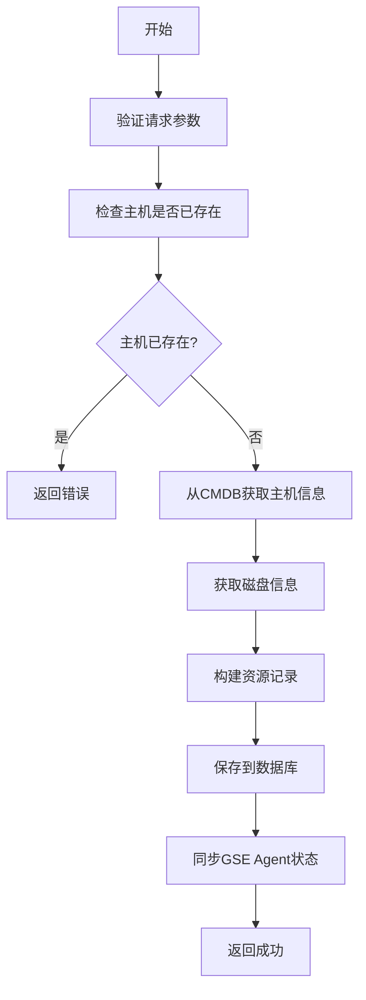

**Diagram sources**
- [rs_import.go](file://internal/controller/manage/rs_import.go#L91-L112)
- [rs_import.go](file://internal/controller/manage/rs_import.go#L148-L216)

### 资源更新
资源更新API允许用户修改资源池中主机的属性，如标签、业务ID、资源类型等。

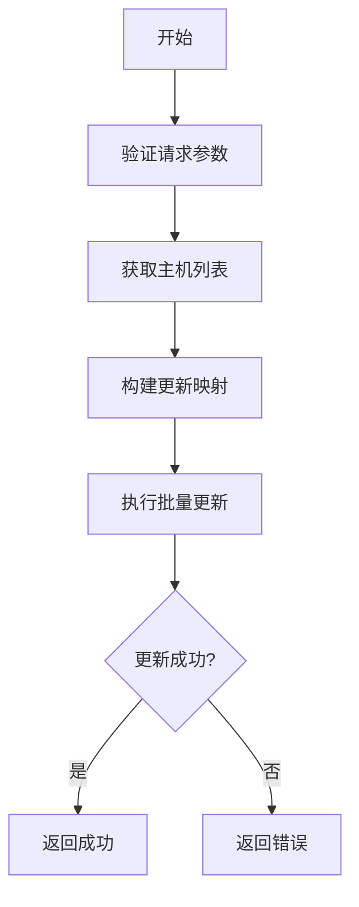

**Diagram sources**
- [rs_manage.go](file://internal/controller/manage/rs_manage.go#L100-L126)
- [rs_manage.go](file://internal/controller/manage/rs_manage.go#L204-L233)

### 资源删除
资源删除API允许用户从资源池中移除指定的主机资源。

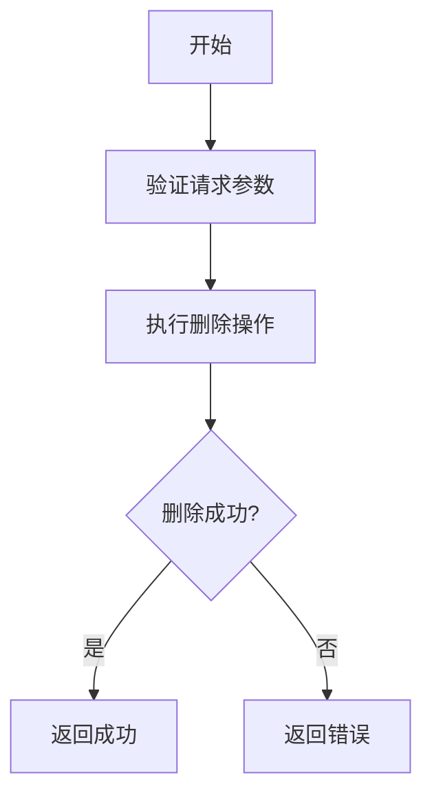

**Diagram sources**
- [rs_manage.go](file://internal/controller/manage/rs_manage.go#L74-L91)
- [rs_manage.go](file://internal/controller/manage/rs_manage.go#L80-L89)

### 资源查询
资源查询API允许用户根据各种条件查询资源池中的主机资源，如业务ID、资源类型、城市、园区等。

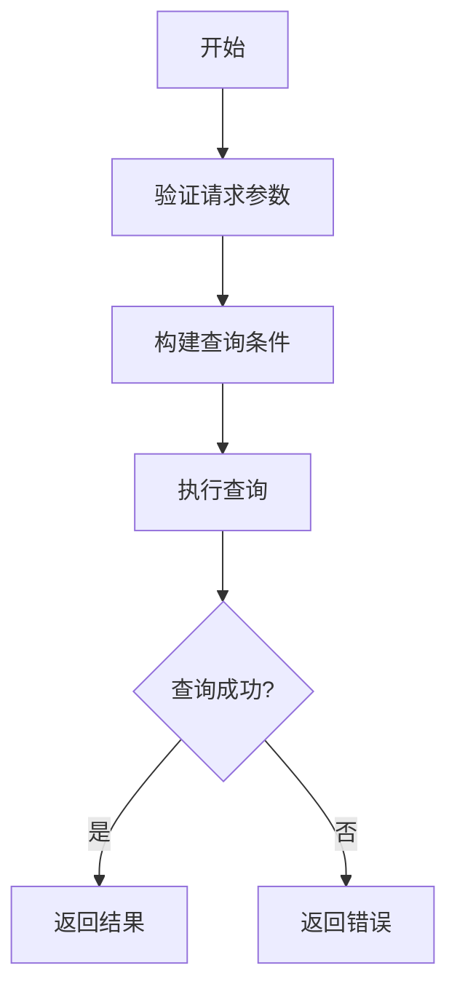

**Diagram sources**
- [rs_list.go](file://internal/controller/manage/rs_list.go#L62-L91)
- [rs_list.go](file://internal/controller/manage/rs_list.go#L194-L254)

## 实例分配
实例分配是db-resource服务的关键功能，通过资源申请和预申请API，用户可以为数据库实例分配合适的主机资源。

### 资源申请
资源申请API允许用户为数据库实例申请主机资源。用户需要提供申请的详细信息，如资源类型、数量、规格等。

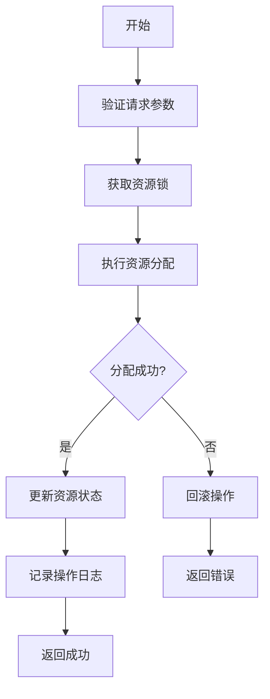

**Diagram sources**
- [apply.go](file://internal/controller/apply/apply.go#L136-L206)
- [apply.go](file://internal/controller/apply/apply.go#L151-L199)

### 资源预申请
资源预申请API允许用户预先申请主机资源，但不立即占用。用户可以在后续操作中确认占用这些资源。

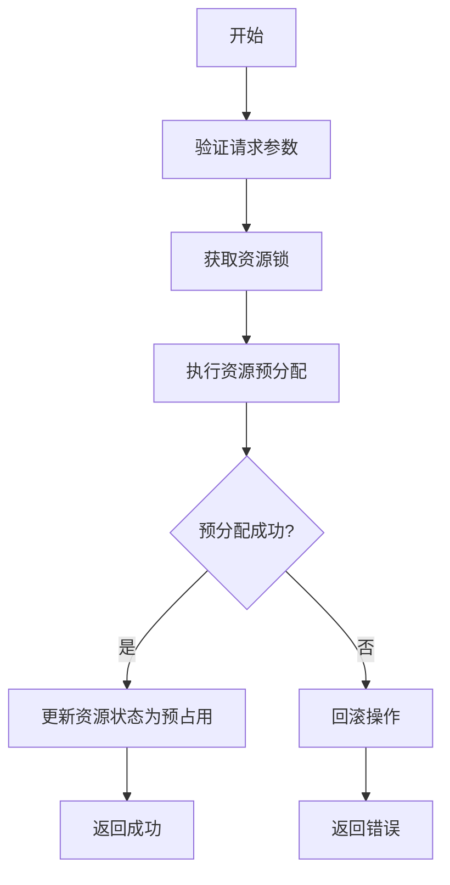

**Diagram sources**
- [apply.go](file://internal/controller/apply/apply.go#L140-L143)
- [apply.go](file://internal/controller/apply/apply.go#L151-L199)

### 确认资源申请
确认资源申请API允许用户确认预申请的资源，将其状态从预占用更新为已使用。

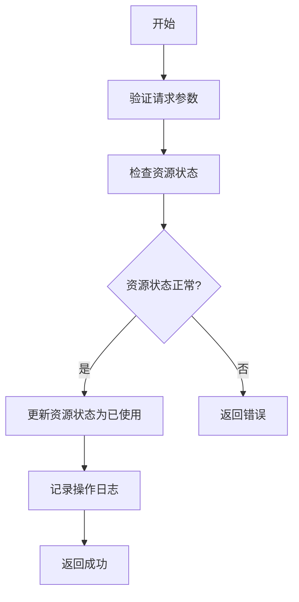

**Diagram sources**
- [apply.go](file://internal/controller/apply/apply.go#L64-L112)
- [apply.go](file://internal/controller/apply/apply.go#L93-L104)

## 状态变更
状态变更是db-resource服务的重要功能，通过状态机管理资源的生命周期。资源的状态包括未使用、预选中、预占用、已使用、被其他业务使用、故障隐患等。

### 状态机转换
资源的状态机转换遵循严格的规则，确保资源的合理分配和使用。

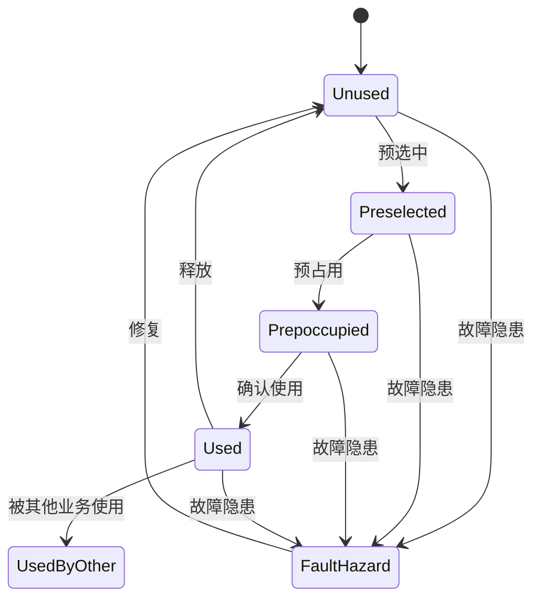

**Diagram sources**
- [TbRpDetail.go](file://internal/model/TbRpDetail.go#L29-L42)
- [TbRpStatusChangeLog.go](file://internal/model/TbRpStatusChangeLog.go#L34-L47)

### 状态变更日志
每次状态变更都会记录到状态变更日志表中，便于追踪和审计。

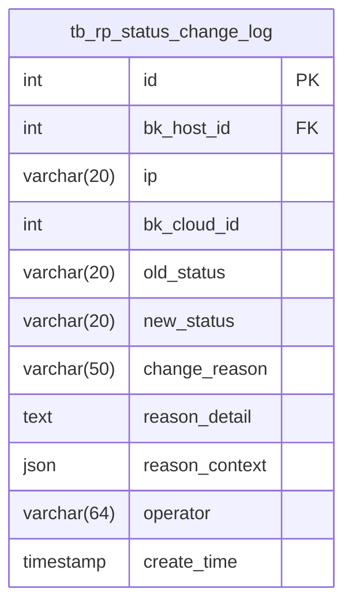

**Diagram sources**
- [TbRpStatusChangeLog.go](file://internal/model/TbRpStatusChangeLog.go#L35-L47)
- [TbRpStatusChangeLog.go](file://internal/model/TbRpStatusChangeLog.go#L95-L126)

## 资源锁定
资源锁定是确保资源分配过程中数据一致性的关键机制。通过Redis分布式锁，db-resource服务可以防止多个请求同时修改同一资源。

### 资源锁实现
资源锁的实现基于Redis的SETNX命令，确保在高并发环境下资源的独占访问。

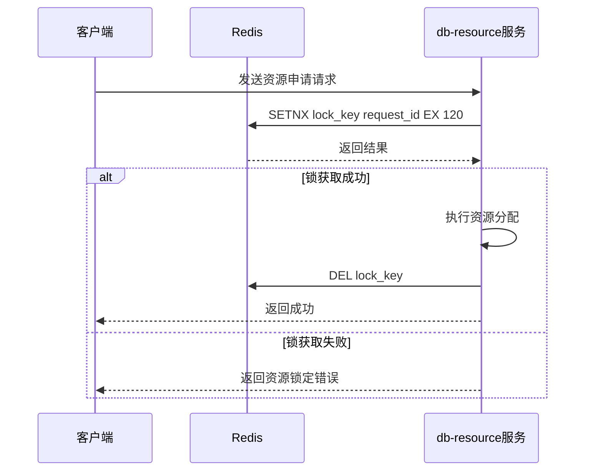

**Diagram sources**
- [lock.go](file://internal/lock/lock.go#L82-L107)
- [apply.go](file://internal/controller/apply/apply.go#L167-L177)

## 资源回收
资源回收是db-resource服务的重要功能，通过定期任务和手动操作，确保资源的及时释放和再利用。

### 定期任务
db-resource服务通过cron定时任务定期执行资源回收操作，如检查故障主机、同步硬件信息等。

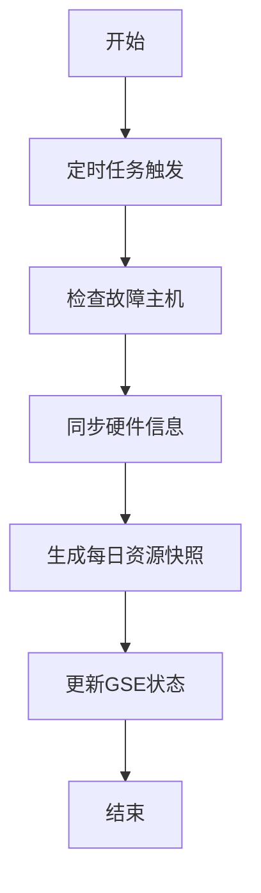

**Diagram sources**
- [main.go](file://main.go#L130-L186)
- [main.go](file://main.go#L136-L139)

### 手动回收
用户可以通过API手动触发资源回收操作，如删除不再使用的主机资源。


**Diagram sources**
- [rs_manage.go](file://internal/controller/manage/rs_manage.go#L74-L91)
- [rs_manage.go](file://internal/controller/manage/rs_manage.go#L80-L89)

## 请求/响应格式
db-resource服务的API遵循统一的请求/响应格式，确保接口的规范性和易用性。

### 请求格式
请求体采用JSON格式，包含必要的参数和数据。

```json
{
  "bk_cloud_id": 0,
  "resource_type": "mysql",
  "for_biz_id": 123,
  "details": [
    {
      "group_mark": "backend",
      "count": 2,
      "spec": {
        "cpu": 8,
        "mem": 32
      }
    }
  ]
}
```

### 响应格式
响应体采用统一的格式，包含状态码、消息、数据和请求ID。

```json
{
  "code": 0,
  "message": "success",
  "data": {
    "request_id": "req_123",
    "details": []
  },
  "request_id": "req_123"
}
```

**Section sources**
- [controller.go](file://internal/controller/controller.go#L32-L37)
- [apply.go](file://internal/controller/apply/apply.go#L169-L192)

## 认证方法
db-resource服务采用基于请求头的认证方法，确保API调用的安全性。

### 认证流程
认证流程包括请求头验证和权限检查。

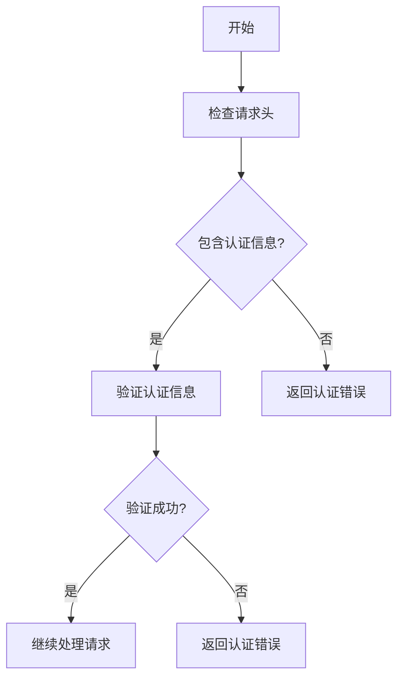

**Section sources**
- [middleware.go](file://internal/middleware/middleware.go)
- [controller.go](file://internal/controller/controller.go#L39-L66)

## 错误场景
db-resource服务定义了多种错误场景，确保在异常情况下能够提供清晰的错误信息。

### 常见错误
- **资源不足**: 当资源池中没有足够的资源满足申请时，返回资源不足错误。
- **资源锁定**: 当资源被其他请求锁定时，返回资源锁定错误。
- **参数错误**: 当请求参数不合法时，返回参数错误。
- **数据库错误**: 当数据库操作失败时，返回数据库错误。

**Section sources**
- [errno.go](file://common/go-pubpkg/errno/errno.go)
- [apply.go](file://internal/controller/apply/apply.go#L187-L188)

## 资源创建和查询示例
以下是一些资源创建和查询的示例，展示如何使用db-resource服务的API。

### 资源申请示例
```json
POST /resource/apply
{
  "bk_cloud_id": 0,
  "resource_type": "mysql",
  "for_biz_id": 123,
  "details": [
    {
      "group_mark": "backend",
      "count": 2,
      "spec": {
        "cpu": 8,
        "mem": 32
      }
    }
  ]
}
```

### 资源查询示例
```json
POST /resource/list
{
  "for_bizs": [123],
  "resource_types": ["mysql"],
  "city": ["shanghai"],
  "limit": 10,
  "offset": 0
}
```

**Section sources**
- [test_resource_views.py](file://dbm-ui/backend/tests/db_services/dbresource/test_resource_views.py#L166-L180)
- [test_resource_views.py](file://dbm-ui/backend/tests/db_services/dbresource/test_resource_views.py#L239-L255)

## 数据库实例部署流程
数据库实例部署流程涉及多个步骤，从资源申请到实例创建，确保资源的合理分配和实例的顺利部署。

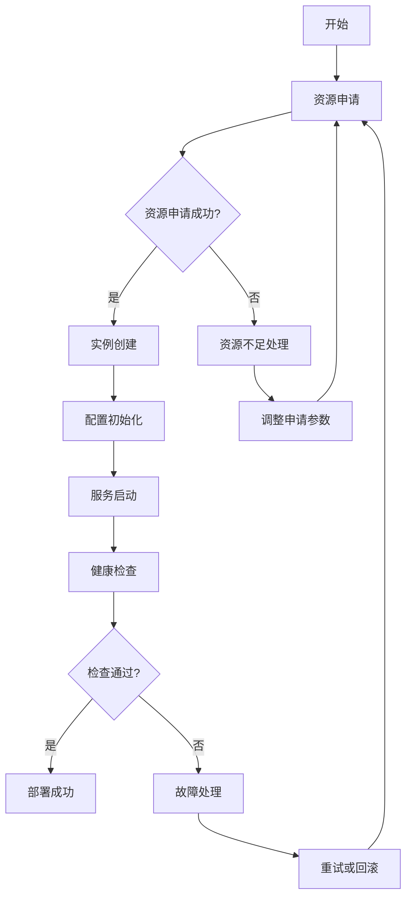

**Diagram sources**
- [apply.go](file://internal/controller/apply/apply.go#L136-L206)
- [rs_manage.go](file://internal/controller/manage/rs_manage.go#L74-L91)