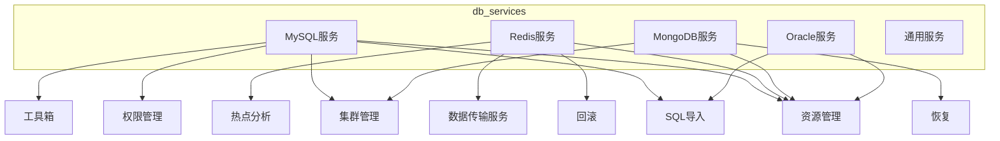
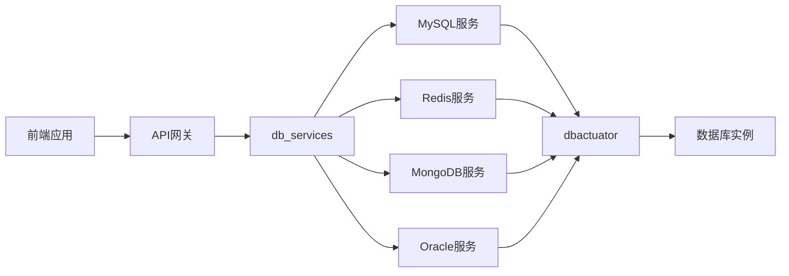
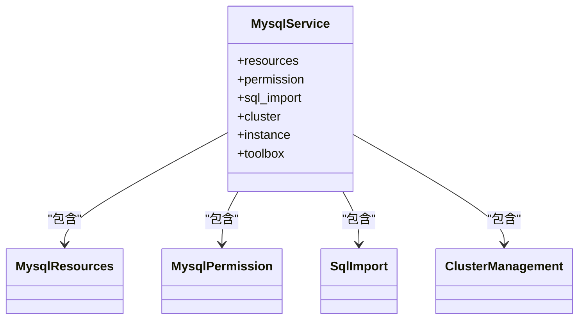
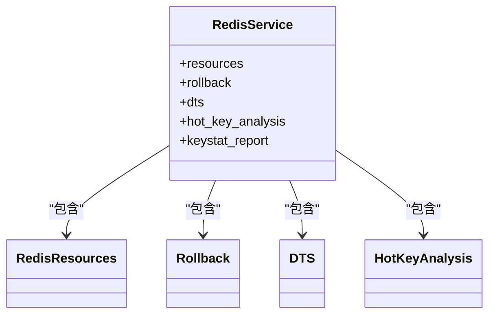
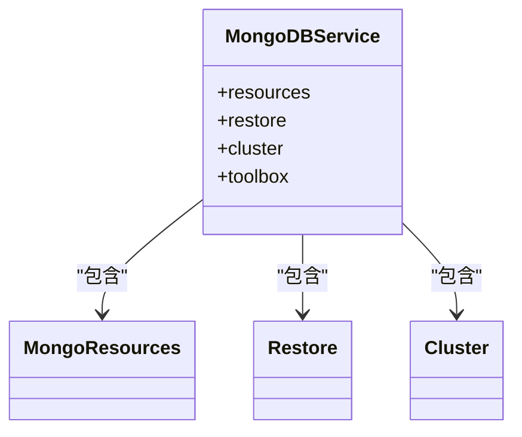
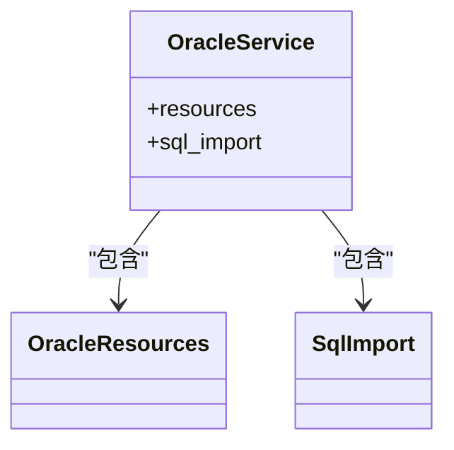
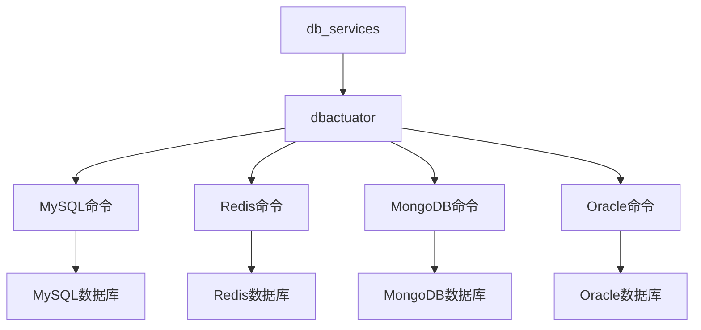

# db_services API

<cite>
**本文档引用的文件**  
- [urls.py](file://dbm-ui/backend/db_services/mysql/urls.py)
- [urls.py](file://dbm-ui/backend/db_services/redis/urls.py)
- [urls.py](file://dbm-ui/backend/db_services/mongodb/urls.py)
- [urls.py](file://dbm-ui/backend/db_services/oracle/urls.py)
- [cmd.go](file://dbm-services/mysql/db-tools/dbactuator/cmd/cmd.go)
- [cmd.go](file://dbm-services/bigdata/db-tools/dbactuator/cmd/cmd.go)
- [root.go](file://dbm-services/oracle/db-tools/dbactuator/cmd/root.go)
- [main.go](file://dbm-services/mongodb/db-tools/dbactuator/main.go)
</cite>

## 目录
1. [简介](#简介)
2. [项目结构](#项目结构)
3. [核心组件](#核心组件)
4. [架构概述](#架构概述)
5. [详细组件分析](#详细组件分析)
6. [依赖分析](#依赖分析)
7. [性能考虑](#性能考虑)
8. [故障排除指南](#故障排除指南)
9. [结论](#结论)

## 简介
本文档旨在详细记录db_services模块的内部API，涵盖MySQL、Redis、MongoDB、Oracle等数据库服务的专用API。文档将解释这些API如何封装底层dbactuator命令并提供统一的前端接口，并提供跨数据库服务调用的示例和最佳实践。

## 项目结构
db_services模块为多种数据库提供统一的服务接口，每个数据库类型都有独立的子模块，包含资源管理、权限控制、数据迁移等专用功能。模块通过Django URL路由将请求分发到相应的处理程序。

**图源**
- [mysql/urls.py](file://dbm-ui/backend/db_services/mysql/urls.py)
- [redis/urls.py](file://dbm-ui/backend/db_services/redis/urls.py)
- [mongodb/urls.py](file://dbm-ui/backend/db_services/mongodb/urls.py)
- [oracle/urls.py](file://dbm-ui/backend/db_services/oracle/urls.py)

**节源**
- [mysql/urls.py](file://dbm-ui/backend/db_services/mysql/urls.py)
- [redis/urls.py](file://dbm-ui/backend/db_services/redis/urls.py)
- [mongodb/urls.py](file://dbm-ui/backend/db_services/mongodb/urls.py)
- [oracle/urls.py](file://dbm-ui/backend/db_services/oracle/urls.py)

## 核心组件
db_services模块的核心是为不同数据库提供统一的API接口层，通过封装底层dbactuator命令实现数据库特有的操作，如备份恢复、权限管理、参数配置等。每个数据库服务都实现了资源管理、实例管理、集群管理等基本功能。

**节源**
- [mysql/urls.py](file://dbm-ui/backend/db_services/mysql/urls.py)
- [redis/urls.py](file://dbm-ui/backend/db_services/redis/urls.py)

## 架构概述
db_services模块采用分层架构，前端通过统一的API网关访问后端服务，后端服务根据数据库类型路由到相应的处理模块，这些模块最终调用dbactuator执行具体的数据库操作。

**图源**
- [mysql/urls.py](file://dbm-ui/backend/db_services/mysql/urls.py)
- [redis/urls.py](file://dbm-ui/backend/db_services/redis/urls.py)
- [mongodb/urls.py](file://dbm-ui/backend/db_services/mongodb/urls.py)
- [oracle/urls.py](file://dbm-ui/backend/db_services/oracle/urls.py)
- [cmd.go](file://dbm-services/mysql/db-tools/dbactuator/cmd/cmd.go)

## 详细组件分析

### MySQL服务分析
MySQL服务提供全面的数据库管理功能，包括资源管理、权限控制、SQL导入、集群管理等。通过mysqlcmd.NewMysqlCommand()封装了所有MySQL相关的操作命令。

**图源**
- [mysql/urls.py](file://dbm-ui/backend/db_services/mysql/urls.py)
- [cmd.go](file://dbm-services/mysql/db-tools/dbactuator/cmd/cmd.go)

### Redis服务分析
Redis服务提供数据传输、回滚、热点分析等高级功能，通过redis_dts、rollback、hot_key_analysis等子模块实现。

**图源**
- [redis/urls.py](file://dbm-ui/backend/db_services/redis/urls.py)
- [cmd.go](file://dbm-services/bigdata/db-tools/dbactuator/cmd/cmd.go)

### MongoDB服务分析
MongoDB服务提供恢复、集群管理等功能，通过restore和cluster子模块实现数据恢复和集群操作。

**图源**
- [mongodb/urls.py](file://dbm-ui/backend/db_services/mongodb/urls.py)
- [main.go](file://dbm-services/mongodb/db-tools/dbactuator/main.go)

### Oracle服务分析
Oracle服务提供资源管理和SQL导入功能，通过简洁的接口封装复杂的数据库操作。

**图源**
- [oracle/urls.py](file://dbm-ui/backend/db_services/oracle/urls.py)
- [root.go](file://dbm-services/oracle/db-tools/dbactuator/cmd/root.go)

## 依赖分析
db_services模块依赖于dbactuator工具集来执行底层数据库操作，通过标准化的接口调用不同数据库的专用命令。

**图源**
- [cmd.go](file://dbm-services/mysql/db-tools/dbactuator/cmd/cmd.go)
- [cmd.go](file://dbm-services/bigdata/db-tools/dbactuator/cmd/cmd.go)
- [root.go](file://dbm-services/oracle/db-tools/dbactuator/cmd/root.go)
- [main.go](file://dbm-services/mongodb/db-tools/dbactuator/main.go)

**节源**
- [cmd.go](file://dbm-services/mysql/db-tools/dbactuator/cmd/cmd.go)
- [cmd.go](file://dbm-services/bigdata/db-tools/dbactuator/cmd/cmd.go)
- [root.go](file://dbm-services/oracle/db-tools/dbactuator/cmd/root.go)
- [main.go](file://dbm-services/mongodb/db-tools/dbactuator/main.go)

## 性能考虑
db_services模块通过异步任务和批量处理优化性能，避免长时间操作阻塞API响应。dbactuator的心跳机制确保长时间任务的可监控性。

## 故障排除指南
当API调用失败时，应首先检查dbactuator的日志输出，确认底层命令执行状态。常见的问题包括权限不足、网络连接失败和配置错误。

**节源**
- [cmd.go](file://dbm-services/mysql/db-tools/dbactuator/cmd/cmd.go)
- [root.go](file://dbm-services/oracle/db-tools/dbactuator/cmd/root.go)

## 结论
db_services模块为多种数据库提供了统一的API接口，通过封装dbactuator命令实现了数据库特有的操作。这种架构既保证了功能的丰富性，又提供了统一的访问方式，便于前端集成和管理。