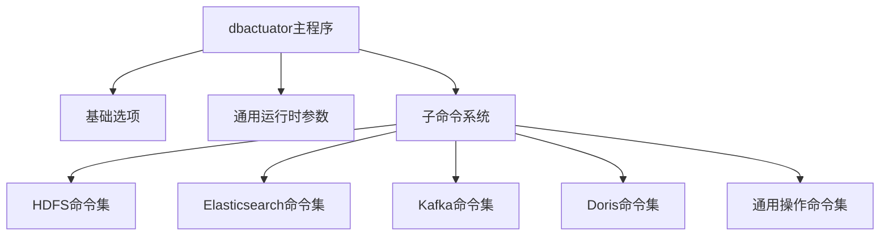
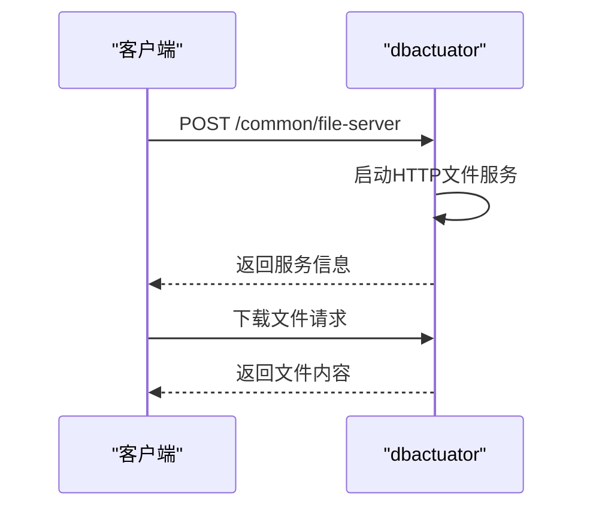
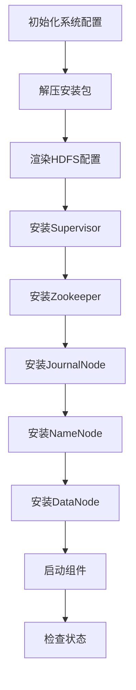
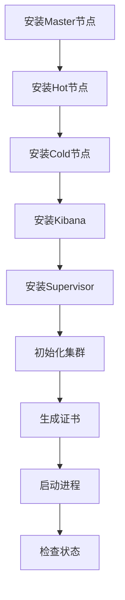
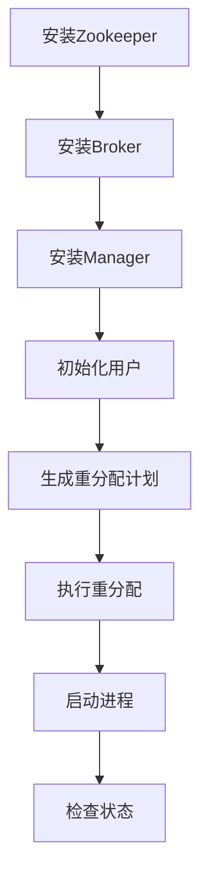
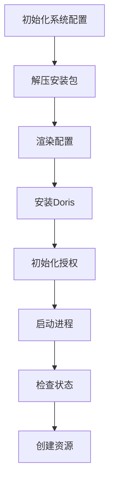
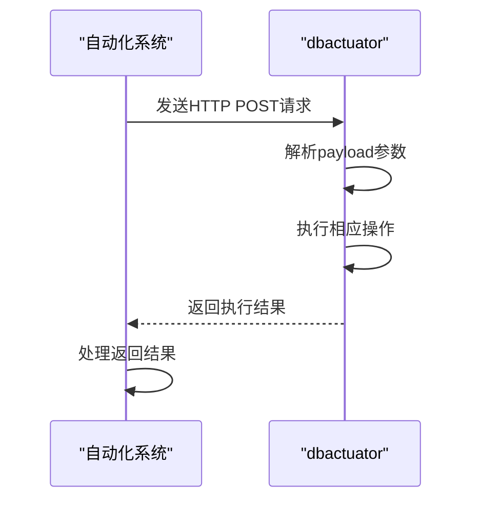

# dbactuator API

<cite>
**本文档引用的文件**
- [cmd.go](file://dbm-services/bigdata/db-tools/dbactuator/cmd/cmd.go)
- [swagger.yaml](file://dbm-services/bigdata/db-tools/dbactuator/docs/swagger.yaml)
- [subcmd.go](file://dbm-services/bigdata/db-tools/dbactuator/internal/subcmd/subcmd.go)
- [hdfscmd/cmd.go](file://dbm-services/bigdata/db-tools/dbactuator/internal/subcmd/hdfscmd/cmd.go)
- [escmd/cmd.go](file://dbm-services/bigdata/db-tools/dbactuator/internal/subcmd/escmd/cmd.go)
- [kafkacmd/cmd.go](file://dbm-services/bigdata/db-tools/dbactuator/internal/subcmd/kafkacmd/cmd.go)
- [doriscmd/cmd.go](file://dbm-services/bigdata/db-tools/dbactuator/internal/subcmd/doriscmd/cmd.go)
- [commoncmd/commoncmd.go](file://dbm-services/bigdata/db-tools/dbactuator/internal/subcmd/commoncmd/commoncmd.go)
</cite>

## 目录
1. [简介](#简介)
2. [核心架构](#核心架构)
3. [通用操作API](#通用操作api)
4. [HDFS操作API](#hdfs操作api)
5. [Elasticsearch操作API](#elasticsearch操作api)
6. [Kafka操作API](#kafka操作api)
7. [Doris操作API](#doris操作api)
8. [HTTP调用示例](#http调用示例)
9. [自动化运维中的作用](#自动化运维中的作用)

## 简介
dbactuator是一个数据库操作命令行工具，提供了一套完整的数据库运维操作命令集合。该工具支持多种大数据组件的安装、配置、启停和维护操作，包括HDFS、Elasticsearch、Kafka、Doris等。通过HTTP接口调用，可以实现自动化运维流程的集成和执行。

**文档来源**
- [cmd.go](file://dbm-services/bigdata/db-tools/dbactuator/cmd/cmd.go#L1-L207)
- [swagger.yaml](file://dbm-services/bigdata/db-tools/dbactuator/docs/swagger.yaml#L1-L251)

## 核心架构
dbactuator采用模块化设计，通过Cobra库实现命令行接口。工具的核心架构包括基础选项、通用运行时参数和子命令系统。每个大数据组件都有独立的命令集，通过统一的入口进行调用。

**图表来源**
- [cmd.go](file://dbm-services/bigdata/db-tools/dbactuator/cmd/cmd.go#L75-L184)
- [subcmd.go](file://dbm-services/bigdata/db-tools/dbactuator/internal/subcmd/subcmd.go#L29-L54)

**章节来源**
- [cmd.go](file://dbm-services/bigdata/db-tools/dbactuator/cmd/cmd.go#L1-L207)
- [subcmd.go](file://dbm-services/bigdata/db-tools/dbactuator/internal/subcmd/subcmd.go#L1-L296)

## 通用操作API
通用操作API提供了一系列基础运维功能，包括文件服务、文件下载和大文件删除等操作。

### 文件服务
通过HTTP暴露指定目录，可用于文件下载。

**图表来源**
- [swagger.yaml](file://dbm-services/bigdata/db-tools/dbactuator/docs/swagger.yaml#L175-L192)

### HTTP下载
支持限速和basicAuth认证的HTTP文件下载。

**章节来源**
- [swagger.yaml](file://dbm-services/bigdata/db-tools/dbactuator/docs/swagger.yaml#L208-L231)

### SCP下载
支持限速的SCP文件下载。

**章节来源**
- [swagger.yaml](file://dbm-services/bigdata/db-tools/dbactuator/docs/swagger.yaml#L232-L247)

### 限速删除大文件
以指定速度删除大文件，避免对系统IO造成过大压力。

**章节来源**
- [swagger.yaml](file://dbm-services/bigdata/db-tools/dbactuator/docs/swagger.yaml#L193-L207)

## HDFS操作API
HDFS操作API提供了完整的HDFS集群管理功能。

**图表来源**
- [hdfscmd/cmd.go](file://dbm-services/bigdata/db-tools/dbactuator/internal/subcmd/hdfscmd/cmd.go#L10-L51)

**章节来源**
- [hdfscmd/cmd.go](file://dbm-services/bigdata/db-tools/dbactuator/internal/subcmd/hdfscmd/cmd.go#L1-L52)

## Elasticsearch操作API
Elasticsearch操作API提供了Elasticsearch集群的完整管理功能。

**图表来源**
- [escmd/cmd.go](file://dbm-services/bigdata/db-tools/dbactuator/internal/subcmd/escmd/cmd.go#L11-L50)

**章节来源**
- [escmd/cmd.go](file://dbm-services/bigdata/db-tools/dbactuator/internal/subcmd/escmd/cmd.go#L1-L51)

## Kafka操作API
Kafka操作API提供了Kafka集群的完整管理功能。

**图表来源**
- [kafkacmd/cmd.go](file://dbm-services/bigdata/db-tools/dbactuator/internal/subcmd/kafkacmd/cmd.go#L11-L57)

**章节来源**
- [kafkacmd/cmd.go](file://dbm-services/bigdata/db-tools/dbactuator/internal/subcmd/kafkacmd/cmd.go#L1-L58)

## Doris操作API
Doris操作API提供了Doris数据库的完整管理功能。

**图表来源**
- [doriscmd/cmd.go](file://dbm-services/bigdata/db-tools/dbactuator/internal/subcmd/doriscmd/cmd.go#L11-L44)

**章节来源**
- [doriscmd/cmd.go](file://dbm-services/bigdata/db-tools/dbactuator/internal/subcmd/doriscmd/cmd.go#L1-L45)

## HTTP调用示例
通过HTTP接口调用dbactuator的API，可以实现自动化运维。

**章节来源**
- [subcmd.go](file://dbm-services/bigdata/db-tools/dbactuator/internal/subcmd/subcmd.go#L106-L126)

## 自动化运维中的作用
dbactuator在自动化运维中扮演着核心执行引擎的角色，通过标准化的API接口，实现了运维操作的自动化和可编程化。

**章节来源**
- [cmd.go](file://dbm-services/bigdata/db-tools/dbactuator/cmd/cmd.go#L58-L72)
- [subcmd.go](file://dbm-services/bigdata/db-tools/dbactuator/internal/subcmd/subcmd.go#L1-L296)