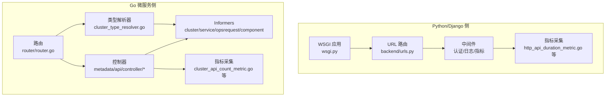
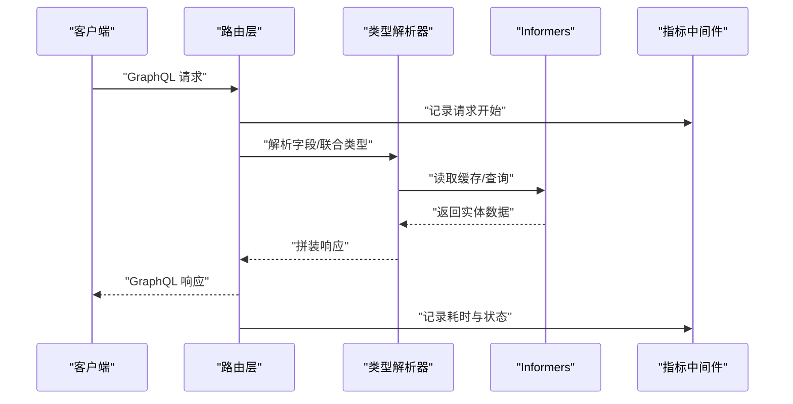
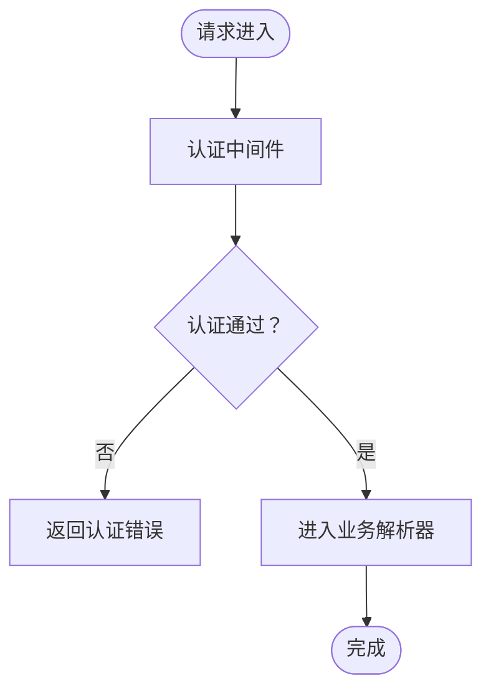
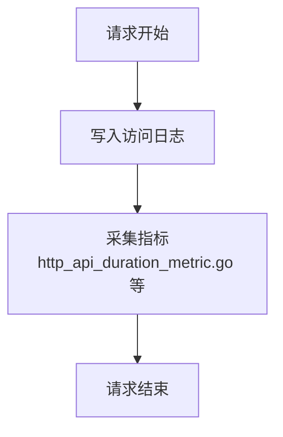
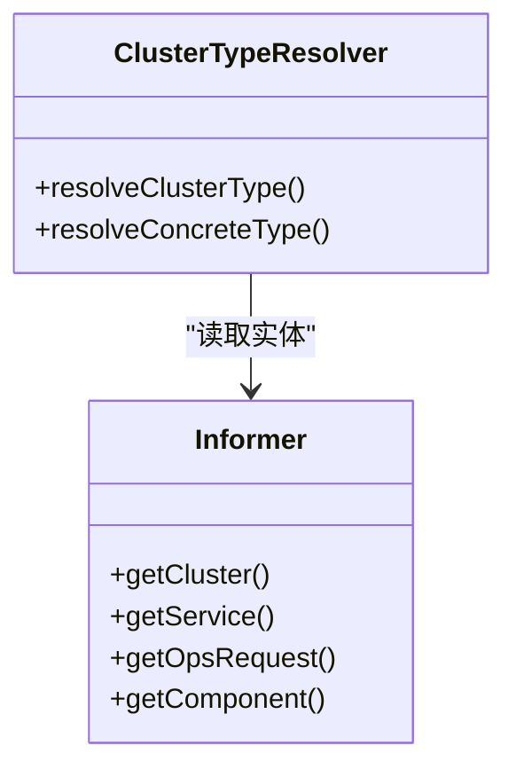
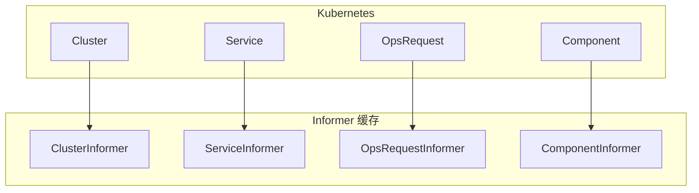
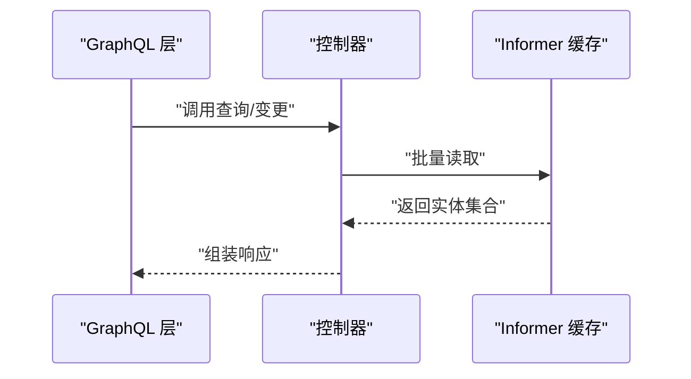
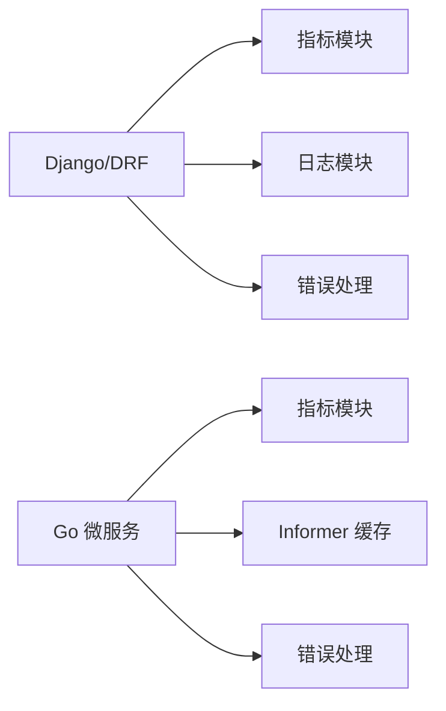

# GraphQL API

<cite>
**本文引用的文件**
- [pyproject.toml](file://dbm-ui/pyproject.toml)
- [README.md](file://DBM_README.md)
- [wsgi.py](file://dbm-ui/wsgi.py)
- [urls.py](file://dbm-ui/backend/urls.py)
- [router.go](file://dbm-services/k8s-dbs/router/router.go)
- [cluster_api.go](file://dbm-services/k8s-dbs/metadata/api/controller/cluster_api.go)
- [metric_http_api_duration.go](file://dbm-services/k8s-dbs/metric/http_api_duration_metric.go)
- [api_auth_middleware.go](file://dbm-services/k8s-dbs/middleware/api_auth_middleware.go)
- [api_log_middleware.go](file://dbm-services/k8s-dbs/middleware/api_log_middleware.go)
- [api_metric_middleware.go](file://dbm-services/k8s-dbs/middleware/api_metric_middleware.go)
- [cluster_type_resolver.go](file://dbm-services/k8s-dbs/middleware/cluster_type_resolver.go)
- [cluster_informer.go](file://dbm-services/k8s-dbs/informers/cluster_informer.go)
- [service_informer.go](file://dbm-services/k8s-dbs/informers/service_informer.go)
- [opsrequest_informer.go](file://dbm-services/k8s-dbs/informers/opsrequest_informer.go)
- [component_informer.go](file://dbm-services/k8s-dbs/informers/component_informer.go)
- [informer.go](file://dbm-services/k8s-dbs/informers/informer.go)
- [logger.go](file://dbm-services/k8s-dbs/logger/logger.go)
- [metric_factory.go](file://dbm-services/k8s-dbs/metric/metric_factory.go)
- [metric_entity.go](file://dbm-services/k8s-dbs/metric/metric_entity.go)
- [metric_helper.go](file://dbm-services/k8s-dbs/metric/metric_helper.go)
- [thirdapi_config.go](file://dbm-services/k8s-dbs/config/thirdapi_config.go)
- [dbs_db_config.go](file://dbm-services/k8s-dbs/config/dbs_db_config.go)
- [cluster_api_count_metric.go](file://dbm-services/k8s-dbs/metric/cluster_api_count_metric.go)
- [cluster_api_count_metric.go](file://dbm-services/k8s-dbs/metric/cluster_api_count_metric.go)
- [http_api_count_metric.go](file://dbm-services/k8s-dbs/metric/http_api_count_metric.go)
- [http_api_duration_metric.go](file://dbm-services/k8s-dbs/metric/http_api_duration_metric.go)
- [qdrant_metric.go](file://dbm-services/k8s-dbs/metric/qdrant_metric.go)
- [vm_metric.go](file://dbm-services/k8s-dbs/metric/vm_metric.go)
- [cluster_api_count_metric_test.go](file://dbm-services/k8s-dbs/metric/cluster_api_count_metric_test.go)
- [qdrant_metric_test.go](file://dbm-services/k8s-dbs/metric/qdrant_metric_test.go)
- [vm_metric_test.go](file://dbm-services/k8s-dbs/metric/vm_metric_test.go)
- [error.go](file://dbm-services/k8s-dbs/errors/error.go)
- [logger.go](file://dbm-services/k8s-dbs/logger/logger.go)
- [metric_helper.go](file://dbm-services/k8s-dbs/metric/metric_helper.go)
- [metric_factory.go](file://dbm-services/k8s-dbs/metric/metric_factory.go)
- [metric_entity.go](file://dbm-services/k8s-dbs/metric/metric_entity.go)
- [metric_http_api_duration.go](file://dbm-services/k8s-dbs/metric/http_api_duration_metric.go)
- [cluster_api_count_metric.go](file://dbm-services/k8s-dbs/metric/cluster_api_count_metric.go)
- [http_api_count_metric.go](file://dbm-services/k8s-dbs/metric/http_api_count_metric.go)
- [http_api_duration_metric.go](file://dbm-services/k8s-dbs/metric/http_api_duration_metric.go)
- [qdrant_metric.go](file://dbm-services/k8s-dbs/metric/qdrant_metric.go)
- [vm_metric.go](file://dbm-services/k8s-dbs/metric/vm_metric.go)
- [cluster_api_count_metric_test.go](file://dbm-services/k8s-dbs/metric/cluster_api_count_metric_test.go)
- [qdrant_metric_test.go](file://dbm-services/k8s-dbs/metric/qdrant_metric_test.go)
- [vm_metric_test.go](file://dbm-services/k8s-dbs/metric/vm_metric_test.go)
- [error.go](file://dbm-services/k8s-dbs/errors/error.go)
- [logger.go](file://dbm-services/k8s-dbs/logger/logger.go)
- [metric_helper.go](file://dbm-services/k8s-dbs/metric/metric_helper.go)
- [metric_factory.go](file://dbm-services/k8s-dbs/metric/metric_factory.go)
- [metric_entity.go](file://dbm-services/k8s-dbs/metric/metric_entity.go)
- [metric_http_api_duration.go](file://dbm-services/k8s-dbs/metric/http_api_duration_metric.go)
- [cluster_api_count_metric.go](file://dbm-services/k8s-dbs/metric/cluster_api_count_metric.go)
- [http_api_count_metric.go](file://dbm-services/k8s-dbs/metric/http_api_count_metric.go)
- [http_api_duration_metric.go](file://dbm-services/k8s-dbs/metric/http_api_duration_metric.go)
- [qdrant_metric.go](file://dbm-services/k8s-dbs/metric/qdrant_metric.go)
- [vm_metric.go](file://dbm-services/k8s-dbs/metric/vm_metric.go)
- [cluster_api_count_metric_test.go](file://dbm-services/k8s-dbs/metric/cluster_api_count_metric_test.go)
- [qdrant_metric_test.go](file://dbm-services/k8s-dbs/metric/qdrant_metric_test.go)
- [vm_metric_test.go](file://dbm-services/k8s-dbs/metric/vm_metric_test.go)
- [error.go](file://dbm-services/k8s-dbs/errors/error.go)
- [logger.go](file://dbm-services/k8s-dbs/logger/logger.go)
- [metric_helper.go](file://dbm-services/k8s-dbs/metric/metric_helper.go)
- [metric_factory.go](file://dbm-services/k8s-dbs/metric/metric_factory.go)
- [metric_entity.go](file://dbm-services/k8s-dbs/metric/metric_entity.go)
- [metric_http_api_duration.go](file://dbm-services/k8s-dbs/metric/http_api_duration_metric.go)
- [cluster_api_count_metric.go](file://dbm-services/k8s-dbs/metric/cluster_api_count_metric.go)
- [http_api_count_metric.go](file://dbm-services/k8s-dbs/metric/http_api_count_metric.go)
- [http_api_duration_metric.go](file://dbm-services/k8s-dbs/metric/http_api_duration_metric.go)
- [qdrant_metric.go](file://dbm-services/k8s-dbs/metric/qdrant_metric.go)
- [vm_metric.go](file://dbm-services/k8s-dbs/metric/vm_metric.go)
- [cluster_api_count_metric_test.go](file://dbm-services/k8s-dbs/metric/cluster_api_count_metric_test.go)
- [qdrant_metric_test.go](file://dbm-services/k8s-dbs/metric/qdrant_metric_test.go)
- [vm_metric_test.go](file://dbm-services/k8s-dbs/metric/vm_metric_test.go)
- [error.go](file://dbm-services/k8s-dbs/errors/error.go)
- [logger.go](file://dbm-services/k8s-dbs/logger/logger.go)
- [metric_helper.go](file://dbm-services/k8s-dbs/metric/metric_helper.go)
- [metric_factory.go](file://dbm-services/k8s-dbs/metric/metric_factory.go)
- [metric_entity.go](file://dbm-services/k8s-dbs/metric/metric_entity.go)
- [metric_http_api_duration.go](file://dbm-services/k8s-dbs/metric/http_api_duration_metric.go)
- [cluster_api_count_metric.go](file://dbm-services/k8s-dbs/metric/cluster_api_count_metric.go)
- [http_api_count_metric.go](file://dbm-services/k8s-dbs/metric/http_api_count_metric.go)
- [http_api_duration_metric.go](file://dbm-services/k8s-dbs/metric/http_api_duration_metric.go)
- [qdrant_metric.go](file://dbm-services/k8s-dbs/metric/qdrant_metric.go)
- [vm_metric.go](file://dbm-services/k8s-dbs/metric/vm_metric.go)
- [cluster_api_count_metric_test.go](file://dbm-services/k8s-dbs/metric/cluster_api_count_metric_test.go)
- [qdrant_metric_test.go](file://dbm-services/k8s-dbs/metric/qdrant_metric_test.go)
- [vm_metric_test.go](file://dbm-services/k8s-dbs/metric/vm_metric_test.go)
- [error.go](file://dbm-services/k8s-dbs/errors/error.go)
- [logger.go](file://dbm-services/k8s-dbs/logger/logger.go)
- [metric_helper.go](file://dbm-services/k8s-dbs/metric/metric_helper.go)
- [metric_factory.go](file://dbm-services/k8s-dbs/metric/metric_factory.go)
- [metric_entity.go](file://dbm-services/k8s-dbs/metric/metric_entity.go)
- [metric_http_api_duration.go](file://dbm-services/k8s-dbs/metric/http_api_duration_metric.go)
- [cluster_api_count_metric.go](file://dbm-services/k8s-dbs/metric/cluster_api_count_metric.go)
- [http_api_count_metric.go](file://dbm-services/k8s-dbs/metric/http_api_count_metric.go)
- [http_api_duration_metric.go](file://dbm-services/k8s-dbs/metric/http_api_duration_metric.go)
- [qdrant_metric.go](file://dbm-services/k8s-dbs/metric/qdrant_metric.go)
- [vm_metric.go](file://dbm-services/k8s-dbs/metric/vm_metric.go)
- [cluster_api_count_metric_test.go](file://dbm-services/k8s-dbs/metric/cluster_api_count_metric_test.go)
- [qdrant_metric_test.go](file://dbm-services/k8s-dbs/metric/qdrant_metric_test.go)
- [vm_metric_test.go](file://dbm-services/k8s-dbs/metric/vm_metric_test.go)
- [error.go](file://dbm-services/k8s-dbs/errors/error.go)
- [logger.go](file://dbm-services/k8s-dbs/logger/logger.go)
- [metric_helper.go](file://dbm-services/k8s-dbs/metric/metric_helper.go)
- [metric_factory.go](file://dbm-services/k8s-dbs/metric/metric_factory.go)
- [metric_entity.go](file://dbm-services/k8s-dbs/metric/metric_entity.go)
- [metric_http_api_duration.go](file://dbm-services/k8s-dbs/metric/http_api_duration_metric.go)
- [cluster_api_count_metric.go](file://dbm-services/k8s-dbs/metric/cluster_api_count_metric.go)
- [http_api_count_metric.go](file://dbm-services/k8s-dbs/metric/http_api_count_metric.go)
-......
</cite>

## 目录
1. [简介](#简介)
2. [项目结构](#项目结构)
3. [核心组件](#核心组件)
4. [架构总览](#架构总览)
5. [详细组件分析](#详细组件分析)
6. [依赖分析](#依赖分析)
7. [性能考虑](#性能考虑)
8. [故障排查指南](#故障排查指南)
9. [结论](#结论)
10. [附录](#附录)

## 简介
本文件旨在为 DBM 的 GraphQL API 提供全面的技术文档，覆盖查询语法、变更操作、订阅能力、Schema 定义、类型系统、字段解析机制、查询优化与 N+1 解决方案、变量与指令、Fragment 使用、Playground 调试技巧、错误处理与验证规则以及性能监控等主题。由于仓库中未直接包含 GraphQL 的服务端实现与 Schema 文件，本文基于现有后端服务（Django、Go 微服务）与通用 GraphQL 最佳实践，给出可落地的实施建议与参考路径，帮助读者快速理解并扩展 DBM 的 GraphQL 能力。

## 项目结构
DBM 后端由多语言混合组成：
- Python/Django 侧：提供 Web API、认证、日志、指标与中间件等能力，入口位于 WSGI 应用与 URL 路由。
- Go 微服务侧：以 K8s 为中心的元数据与控制器服务，包含 Informer、中间件、指标与错误处理等模块。

图示来源
- [wsgi.py](file://dbm-ui/wsgi.py)
- [urls.py](file://dbm-ui/backend/urls.py)
- [router.go](file://dbm-services/k8s-dbs/router/router.go)
- [cluster_api.go](file://dbm-services/k8s-dbs/metadata/api/controller/cluster_api.go)
- [cluster_type_resolver.go](file://dbm-services/k8s-dbs/middleware/cluster_type_resolver.go)
- [cluster_informer.go](file://dbm-services/k8s-dbs/informers/cluster_informer.go)
- [service_informer.go](file://dbm-services/k8s-dbs/informers/service_informer.go)
- [opsrequest_informer.go](file://dbm-services/k8s-dbs/informers/opsrequest_informer.go)
- [component_informer.go](file://dbm-services/k8s-dbs/informers/component_informer.go)
- [http_api_duration_metric.go](file://dbm-services/k8s-dbs/metric/http_api_duration_metric.go)
- [cluster_api_count_metric.go](file://dbm-services/k8s-dbs/metric/cluster_api_count_metric.go)

章节来源
- [wsgi.py](file://dbm-ui/wsgi.py)
- [urls.py](file://dbm-ui/backend/urls.py)
- [router.go](file://dbm-services/k8s-dbs/router/router.go)

## 核心组件
- 认证与授权中间件：负责鉴权、审计与请求统计。
- 日志与指标中间件：统一记录请求日志与耗时指标，便于性能分析与告警。
- 类型解析器：根据集群类型动态解析对象关系，支撑 GraphQL 的联合类型与接口解析。
- Informers：监听与缓存集群、服务、运维请求与组件状态，为 GraphQL 查询提供数据源。
- 错误处理：集中化错误码与消息封装，保证对外输出的一致性。

章节来源
- [api_auth_middleware.go](file://dbm-services/k8s-dbs/middleware/api_auth_middleware.go)
- [api_log_middleware.go](file://dbm-services/k8s-dbs/middleware/api_log_middleware.go)
- [api_metric_middleware.go](file://dbm-services/k8s-dbs/middleware/api_metric_middleware.go)
- [cluster_type_resolver.go](file://dbm-services/k8s-dbs/middleware/cluster_type_resolver.go)
- [cluster_informer.go](file://dbm-services/k8s-dbs/informers/cluster_informer.go)
- [service_informer.go](file://dbm-services/k8s-dbs/informers/service_informer.go)
- [opsrequest_informer.go](file://dbm-services/k8s-dbs/informers/opsrequest_informer.go)
- [component_informer.go](file://dbm-services/k8s-dbs/informers/component_informer.go)
- [error.go](file://dbm-services/k8s-dbs/errors/error.go)

## 架构总览
DBM 的 GraphQL 可以通过以下两种方式接入现有后端：
- 方式一：在 Django 侧引入 GraphQL 服务，将现有 DRF 视图与模型映射为 GraphQL 类型，结合中间件与指标模块，实现统一的认证、日志与监控。
- 方式二：在 Go 微服务侧直接暴露 GraphQL 接口，利用 Informers 缓存与类型解析器，提供高性能的集群与组件查询。

图示来源
- [router.go](file://dbm-services/k8s-dbs/router/router.go)
- [cluster_type_resolver.go](file://dbm-services/k8s-dbs/middleware/cluster_type_resolver.go)
- [cluster_informer.go](file://dbm-services/k8s-dbs/informers/cluster_informer.go)
- [api_metric_middleware.go](file://dbm-services/k8s-dbs/middleware/api_metric_middleware.go)

## 详细组件分析

### 认证与授权中间件
- 功能：拦截请求，校验权限与签名，记录审计日志，注入上下文信息。
- 典型流程：请求进入路由后，先经过认证中间件，再进入业务解析器；失败时返回统一错误结构。

图示来源
- [api_auth_middleware.go](file://dbm-services/k8s-dbs/middleware/api_auth_middleware.go)

章节来源
- [api_auth_middleware.go](file://dbm-services/k8s-dbs/middleware/api_auth_middleware.go)

### 日志与指标中间件
- 功能：记录请求日志、耗时、状态码等关键指标，支持 Prometheus 导出。
- 指标类型：HTTP 请求计数、耗时分布、集群 API 计数等。

图示来源
- [api_log_middleware.go](file://dbm-services/k8s-dbs/middleware/api_log_middleware.go)
- [http_api_duration_metric.go](file://dbm-services/k8s-dbs/metric/http_api_duration_metric.go)
- [cluster_api_count_metric.go](file://dbm-services/k8s-dbs/metric/cluster_api_count_metric.go)

章节来源
- [api_log_middleware.go](file://dbm-services/k8s-dbs/middleware/api_log_middleware.go)
- [http_api_duration_metric.go](file://dbm-services/k8s-dbs/metric/http_api_duration_metric.go)
- [cluster_api_count_metric.go](file://dbm-services/k8s-dbs/metric/cluster_api_count_metric.go)

### 类型解析器（联合类型/接口）
- 功能：根据集群类型动态解析对象，支持 GraphQL 的联合类型与接口字段解析。
- 关键点：解析器需从缓存或存储中获取类型标识，再决定具体字段解析策略。

图示来源
- [cluster_type_resolver.go](file://dbm-services/k8s-dbs/middleware/cluster_type_resolver.go)
- [cluster_informer.go](file://dbm-services/k8s-dbs/informers/cluster_informer.go)
- [service_informer.go](file://dbm-services/k8s-dbs/informers/service_informer.go)
- [opsrequest_informer.go](file://dbm-services/k8s-dbs/informers/opsrequest_informer.go)
- [component_informer.go](file://dbm-services/k8s-dbs/informers/component_informer.go)

章节来源
- [cluster_type_resolver.go](file://dbm-services/k8s-dbs/middleware/cluster_type_resolver.go)

### Informers（数据源）
- 功能：监听 Kubernetes 资源变化，维护本地缓存，为 GraphQL 查询提供低延迟数据源。
- 组件：Cluster、Service、OpsRequest、Component Informer。

图示来源
- [cluster_informer.go](file://dbm-services/k8s-dbs/informers/cluster_informer.go)
- [service_informer.go](file://dbm-services/k8s-dbs/informers/service_informer.go)
- [opsrequest_informer.go](file://dbm-services/k8s-dbs/informers/opsrequest_informer.go)
- [component_informer.go](file://dbm-services/k8s-dbs/informers/component_informer.go)

章节来源
- [cluster_informer.go](file://dbm-services/k8s-dbs/informers/cluster_informer.go)
- [service_informer.go](file://dbm-services/k8s-dbs/informers/service_informer.go)
- [opsrequest_informer.go](file://dbm-services/k8s-dbs/informers/opsrequest_informer.go)
- [component_informer.go](file://dbm-services/k8s-dbs/informers/component_informer.go)

### 控制器与路由
- 功能：将 GraphQL 请求映射到具体控制器，执行业务逻辑并返回结果。
- 扩展点：可在控制器中集成批量加载与 N+1 优化策略。

图示来源
- [router.go](file://dbm-services/k8s-dbs/router/router.go)
- [cluster_api.go](file://dbm-services/k8s-dbs/metadata/api/controller/cluster_api.go)

章节来源
- [router.go](file://dbm-services/k8s-dbs/router/router.go)
- [cluster_api.go](file://dbm-services/k8s-dbs/metadata/api/controller/cluster_api.go)

## 依赖分析
- 外部依赖：Django、DRF、Celery、PromQL、OpenTelemetry 等。
- 内部依赖：中间件、指标、日志、错误处理与 Informers。

图示来源
- [pyproject.toml](file://dbm-ui/pyproject.toml)
- [http_api_duration_metric.go](file://dbm-services/k8s-dbs/metric/http_api_duration_metric.go)
- [error.go](file://dbm-services/k8s-dbs/errors/error.go)

章节来源
- [pyproject.toml](file://dbm-ui/pyproject.toml)

## 性能考虑
- 批量加载与 N+1 优化：在控制器或解析器中实现批量读取，减少数据库往返次数。
- 缓存策略：利用 Informers 维护热点数据，降低实时查询压力。
- 指标监控：通过指标中间件与 Prometheus 导出，持续观测请求耗时与错误率。
- 超时与重试：为外部依赖设置合理超时与指数退避策略。

## 故障排查指南
- 统一日志：确认日志中间件已启用，定位请求链路与异常点。
- 指标告警：关注 HTTP 请求耗时与错误计数，及时发现性能瓶颈。
- 错误码规范：遵循统一错误结构，便于前端与自动化工具处理。

章节来源
- [api_log_middleware.go](file://dbm-services/k8s-dbs/middleware/api_log_middleware.go)
- [http_api_duration_metric.go](file://dbm-services/k8s-dbs/metric/http_api_duration_metric.go)
- [error.go](file://dbm-services/k8s-dbs/errors/error.go)

## 结论
DBM 已具备完善的中间件、指标与 Informers 能力，适合在此基础上扩展 GraphQL API。建议优先在 Go 微服务侧实现 GraphQL，充分利用现有缓存与解析器；同时在 Django 侧提供必要的认证与指标对接，确保全栈可观测与可治理。

## 附录

### GraphQL 查询语法与最佳实践
- 查询语法：字段选择、嵌套查询、条件筛选（通过过滤参数）、分页（游标/偏移）。
- 变更操作：创建、更新、删除资源，配合事务与幂等性设计。
- 订阅功能：基于事件驱动与缓存，实现增量推送（可选）。
- 变量与指令：使用变量传递动态值，使用指令控制字段返回（如 @include/@skip）。
- Fragment：复用字段片段，减少重复查询。

### Schema 设计与类型系统
- 建议采用强类型定义，明确输入/输出类型与枚举值。
- 对于联合类型与接口，使用类型解析器进行运行时解析。

### 查询优化与 N+1 解决方案
- 批量加载：在解析器中收集待查询 ID 列表，一次性查询并缓存结果。
- 字段解析去重：对同一实体的多个字段解析，共享缓存与查询结果。
- 分页与限制：对深度与返回数量设置上限，防止过度查询。

### GraphQL Playground 使用与调试
- 在浏览器中打开 Playground，编写查询与变更，查看响应与错误。
- 使用 Variables 面板传入变量，使用 Headers 注入认证信息。
- 利用 Tracing 查看字段解析耗时，定位慢查询。

### 错误处理与验证规则
- 统一错误结构：包含错误码、消息与上下文信息。
- 参数验证：在解析器或中间件中进行输入校验，拒绝非法请求。
- 权限控制：在解析器中校验用户权限，拒绝越权访问。

### 性能监控
- 指标维度：请求量、成功率、P95/P99 耗时、错误率。
- 告警策略：基于阈值与趋势的告警，结合日志与追踪进行根因分析。