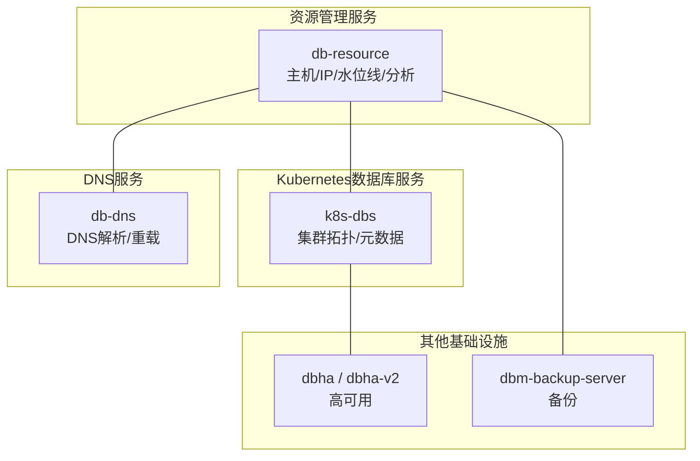
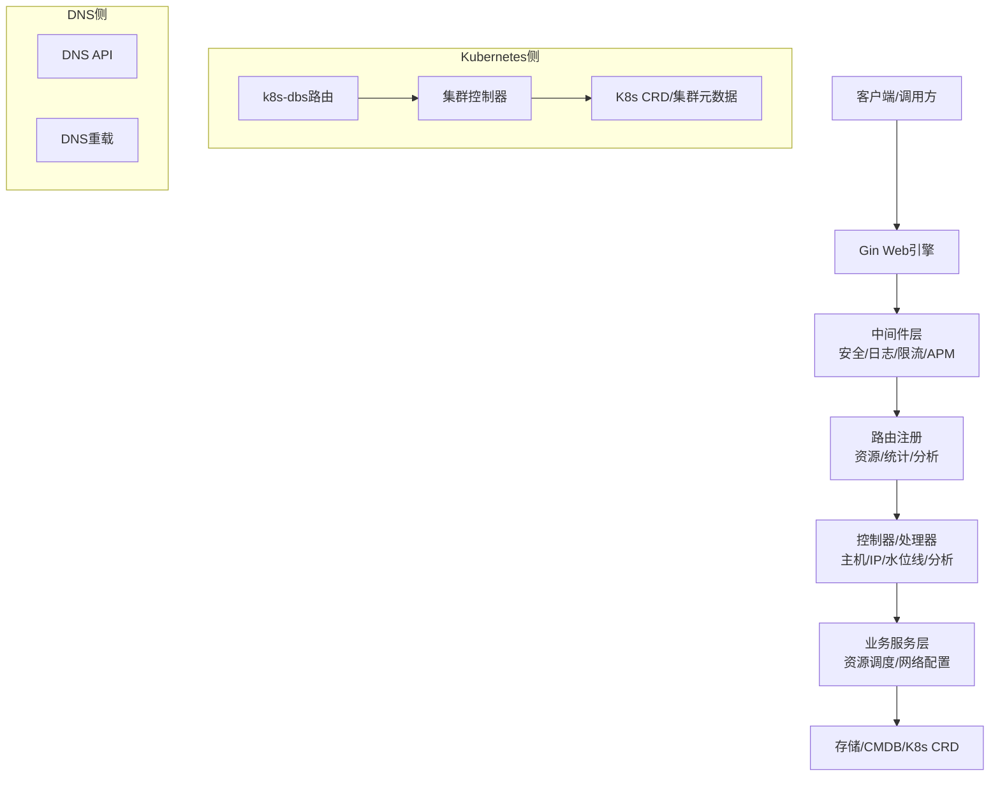
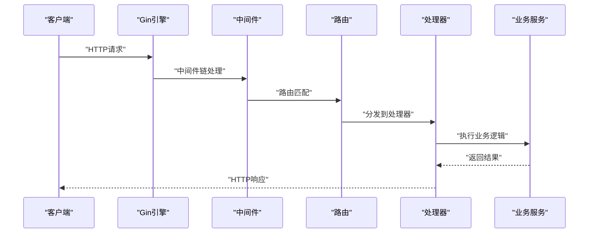
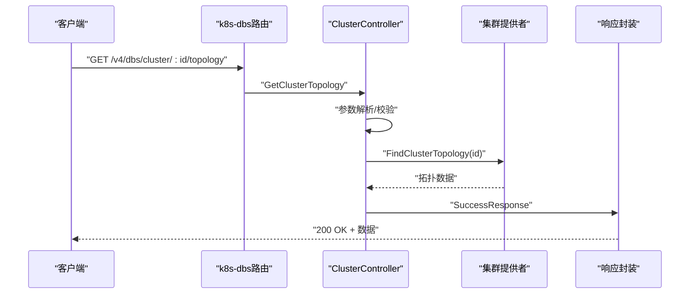
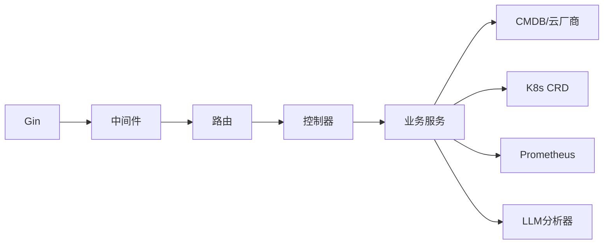

# 基础设施API

<cite>
**本文引用的文件**
- [main.go](file://dbm-services/common/db-resource/main.go)
- [routers.go](file://dbm-services/common/db-resource/internal/routers/routers.go)
- [router.go](file://dbm-services/k8s-dbs/router/router.go)
- [cluster_controller.go](file://dbm-services/k8s-dbs/metadata/api/controller/cluster_controller.go)
</cite>

## 目录
1. [简介](#简介)
2. [项目结构](#项目结构)
3. [核心组件](#核心组件)
4. [架构总览](#架构总览)
5. [详细组件分析](#详细组件分析)
6. [依赖分析](#依赖分析)
7. [性能考虑](#性能考虑)
8. [故障排查指南](#故障排查指南)
9. [结论](#结论)
10. [附录](#附录)

## 简介
本文件面向基础设施服务API，聚焦资源管理、DNS解析、网络配置等能力，系统性梳理主机管理、IP地址分配、域名解析、负载均衡等RESTful接口，并覆盖资源池管理、网络拓扑、服务发现等功能的API说明与使用示例。文档同时提供基础设施自动化、资源调度、网络配置等场景的集成指南，帮助开发者快速上手并稳定集成。

## 项目结构
本仓库包含多个子项目，其中与基础设施API直接相关的关键模块如下：
- db-resource：统一的资源管理服务，提供主机、IP、水位线、分析等接口。
- k8s-dbs：基于Kubernetes CRD的数据库基础设施管理，提供集群拓扑、元数据查询等接口。
- db-dns：DNS解析与重载服务（当前上下文未提供具体实现文件）。
- db-resource、db-dns、dbha、dbm-backup-server 等模块共同构成基础设施能力矩阵。

**章节来源**
- [main.go:46-124](file://dbm-services/common/db-resource/main.go#L46-L124)
- [router.go:33-54](file://dbm-services/k8s-dbs/router/router.go#L33-L54)

## 核心组件
- 资源管理服务（db-resource）
  - 提供主机资源申请、释放、参数查询、后台任务、统计与水位线等接口。
  - 支持LLM智能分析能力，用于资源异常诊断与自动化处理。
- Kubernetes数据库服务（k8s-dbs）
  - 提供集群拓扑查询、集群详情、集群分页列表等接口。
  - 支持Prometheus指标暴露，便于监控集成。
- DNS服务（db-dns）
  - 提供DNS解析与重载能力，支撑服务发现与域名解析需求。
- 其他基础设施
  - 高可用（dbha/dbha-v2）、备份（dbm-backup-server）等模块协同工作。

**章节来源**
- [routers.go:26-55](file://dbm-services/common/db-resource/internal/routers/routers.go#L26-L55)
- [cluster_controller.go:53-136](file://dbm-services/k8s-dbs/metadata/api/controller/cluster_controller.go#L53-L136)

## 架构总览
基础设施API采用微服务化架构，通过Gin框架构建RESTful服务，结合中间件实现安全、日志、限流与APM监控。db-resource负责资源生命周期管理，k8s-dbs负责Kubernetes环境下的数据库集群元数据与拓扑管理，db-dns负责域名解析与重载，dbha/dbha-v2负责高可用保障，dbm-backup-server负责备份能力。

**图表来源**
- [main.go:49-71](file://dbm-services/common/db-resource/main.go#L49-L71)
- [routers.go:27-50](file://dbm-services/common/db-resource/internal/routers/routers.go#L27-L50)
- [router.go:48-54](file://dbm-services/k8s-dbs/router/router.go#L48-L54)

**章节来源**
- [main.go:46-124](file://dbm-services/common/db-resource/main.go#L46-L124)
- [router.go:33-54](file://dbm-services/k8s-dbs/router/router.go#L33-L54)

## 详细组件分析

### 资源管理服务（db-resource）
- 服务启动与中间件
  - 使用Gin初始化Web引擎，注册pprof、OTel追踪、Prometheus指标、请求ID、安全响应头、请求体大小限制、自定义日志等中间件。
  - 绑定监听地址、超时策略与优雅关闭逻辑。
- 路由注册
  - 注册资源申请、主机资源管理、资源参数查询、后台任务、统计与水位线等路由。
  - 提供/ping健康探测与/version信息查询。
- 定时任务
  - 定时更新GSE状态、扫描检查资源、同步主机硬件信息、生成资源快照、检查故障主机等。
- LLM智能分析
  - 可选启用LLM分析器，支持资源异常分析与自动化处理流程。

**图表来源**
- [main.go:49-71](file://dbm-services/common/db-resource/main.go#L49-L71)
- [routers.go:27-50](file://dbm-services/common/db-resource/internal/routers/routers.go#L27-L50)

**章节来源**
- [main.go:46-124](file://dbm-services/common/db-resource/main.go#L46-L124)
- [main.go:165-222](file://dbm-services/common/db-resource/main.go#L165-L222)
- [routers.go:26-55](file://dbm-services/common/db-resource/internal/routers/routers.go#L26-L55)

### Kubernetes数据库服务（k8s-dbs）
- 路由与基础路径
  - 基础路径为/v4/dbs，注册健康检查、API路由与Prometheus指标端点。
- 集群控制器
  - 提供按ID获取集群拓扑、按ID获取集群详情、分页列出集群等接口。
  - 内部进行参数校验、分页构建、数据拷贝与别名映射等处理。

**图表来源**
- [router.go:48-54](file://dbm-services/k8s-dbs/router/router.go#L48-L54)
- [cluster_controller.go:63-78](file://dbm-services/k8s-dbs/metadata/api/controller/cluster_controller.go#L63-L78)

**章节来源**
- [router.go:33-54](file://dbm-services/k8s-dbs/router/router.go#L33-L54)
- [cluster_controller.go:53-136](file://dbm-services/k8s-dbs/metadata/api/controller/cluster_controller.go#L53-L136)

### DNS服务（db-dns）
- 当前上下文未提供具体实现文件，但根据项目结构可推断其职责包括：
  - 提供域名解析接口，支持服务发现与流量接入。
  - 支持DNS重载机制，确保变更生效与一致性。

[本节为概念性说明，不直接分析具体文件，故不提供“章节来源”]

## 依赖分析
- 组件耦合
  - db-resource与中间件、路由、控制器、业务服务之间保持清晰的分层关系。
  - k8s-dbs通过控制器与提供者解耦，便于扩展与测试。
- 外部依赖
  - Gin、OTel、Prometheus、Cron等作为核心依赖，分别提供Web框架、可观测性、指标与定时任务能力。
- 集成点
  - db-resource与CMDB、云厂商SDK、LLM分析器集成。
  - k8s-dbs与Kubernetes CRD、Prometheus指标集成。

**图表来源**
- [main.go:25-60](file://dbm-services/common/db-resource/main.go#L25-L60)
- [router.go:27-53](file://dbm-services/k8s-dbs/router/router.go#L27-L53)

**章节来源**
- [main.go:25-60](file://dbm-services/common/db-resource/main.go#L25-L60)
- [router.go:27-53](file://dbm-services/k8s-dbs/router/router.go#L27-L53)

## 性能考虑
- 中间件与超时
  - 合理设置ReadHeaderTimeout、ReadTimeout、WriteTimeout与IdleTimeout，防止慢连接与长尾请求影响整体性能。
- 指标与追踪
  - OTel与Prometheus中间件有助于定位性能瓶颈与异常。
- 定时任务
  - 将耗时操作放入定时任务，避免阻塞主请求链路。
- 日志与限流
  - 控制日志级别与请求体大小限制，降低IO与内存压力。

[本节为通用指导，不直接分析具体文件，故不提供“章节来源”]

## 故障排查指南
- 健康检查
  - 访问/ping或/version接口确认服务可用性与版本信息。
- 日志与追踪
  - 结合请求ID与OTel追踪ID定位问题根因。
- 指标观测
  - 通过Prometheus指标端点查看QPS、延迟、错误率等关键指标。
- 定时任务
  - 关注定时任务执行日志，排查资源同步、快照生成、故障检测等任务是否正常运行。

**章节来源**
- [main.go:51-71](file://dbm-services/common/db-resource/main.go#L51-L71)
- [main.go:165-222](file://dbm-services/common/db-resource/main.go#L165-L222)
- [router.go:53](file://dbm-services/k8s-dbs/router/router.go#L53)

## 结论
本基础设施API体系通过资源管理、Kubernetes数据库管理、DNS解析与高可用备份等能力，形成完整的基础设施自动化与网络配置闭环。建议在生产环境中结合中间件、指标与追踪能力，配合定时任务与日志策略，确保系统的稳定性与可观测性。

[本节为总结性内容，不直接分析具体文件，故不提供“章节来源”]

## 附录

### API使用示例与集成指南
- 资源管理（db-resource）
  - 主机资源申请/释放：通过资源申请与释放接口完成主机生命周期管理。
  - IP地址分配：通过资源参数查询与主机资源管理接口完成IP分配与回收。
  - 水位线与统计：通过水位线与统计接口监控资源使用情况。
  - LLM智能分析：启用LLM分析器后，可对资源异常进行自动诊断与处理。
- Kubernetes数据库（k8s-dbs）
  - 集群拓扑查询：通过/v4/dbs/cluster/:id/topology获取集群拓扑详情。
  - 集群详情与列表：通过相应接口获取集群信息与分页列表。
- DNS解析与重载
  - 通过DNS API与重载接口实现域名解析与变更生效。
- 集成步骤
  - 在调用方应用中引入HTTP客户端，配置超时与重试策略。
  - 通过中间件与追踪ID串联调用链，便于问题定位。
  - 对关键接口进行指标埋点，结合Prometheus进行告警与容量规划。

[本节为通用指导，不直接分析具体文件，故不提供“章节来源”]