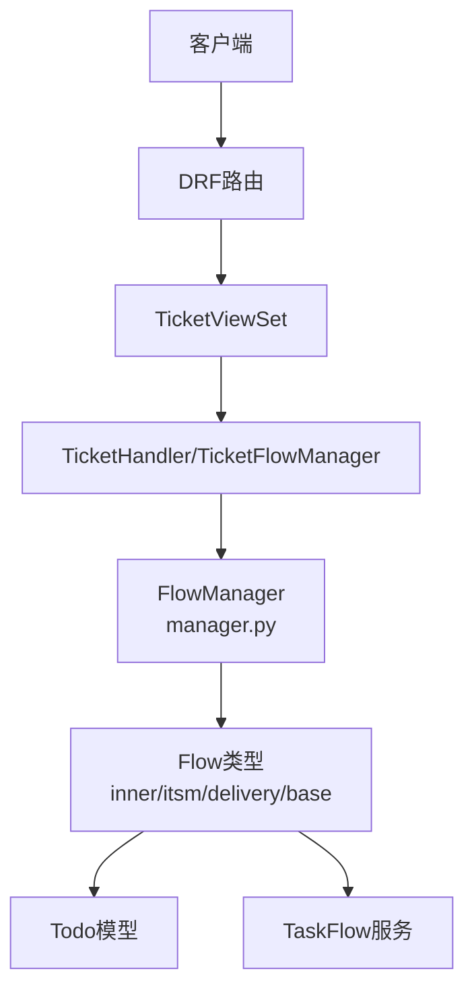
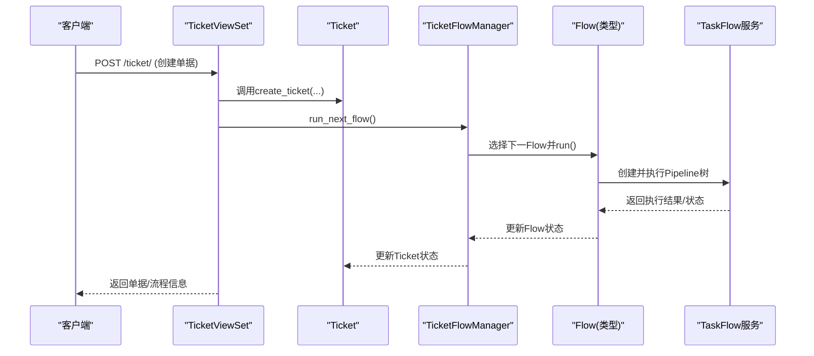
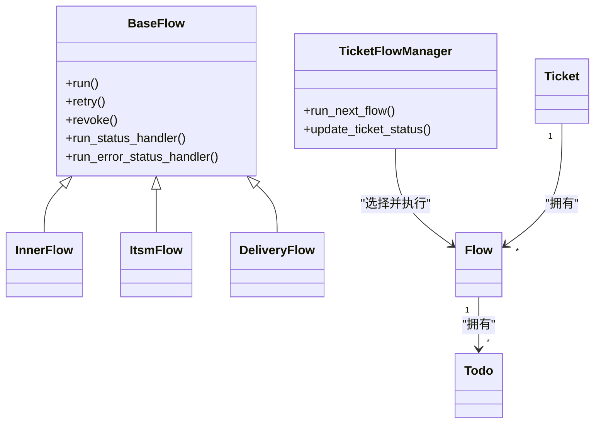
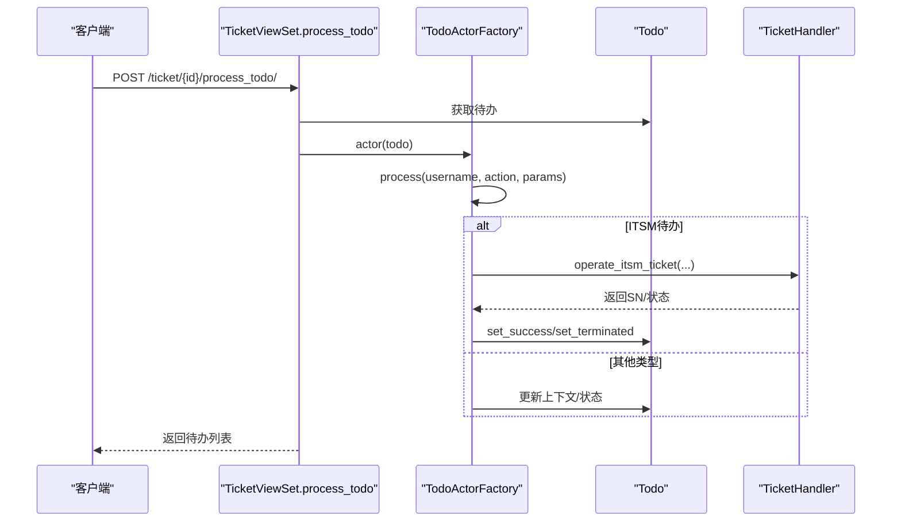
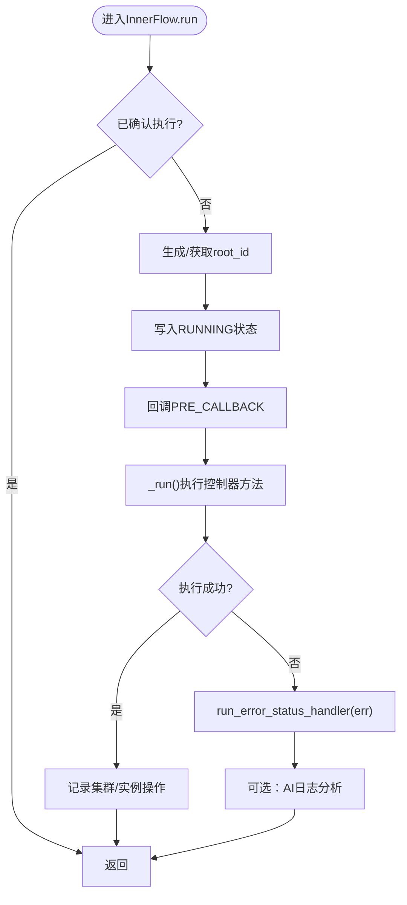
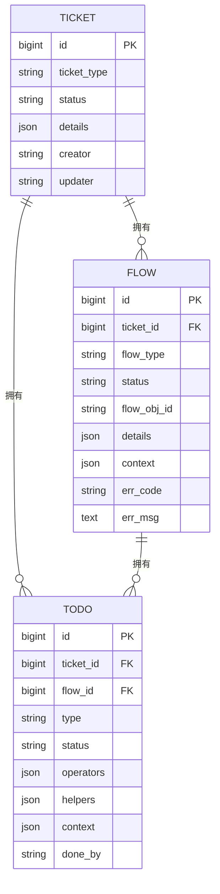
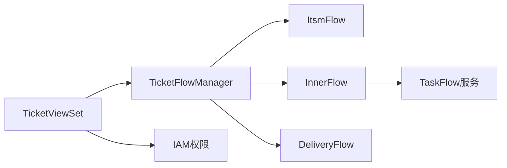

# 工作流任务API

<cite>
**本文档引用的文件**
- [urls.py](file://dbm-ui/backend/ticket/urls.py)
- [views.py](file://dbm-ui/backend/ticket/views.py)
- [todo.py](file://dbm-ui/backend/ticket/models/todo.py)
- [ticket.py](file://dbm-ui/backend/ticket/models/ticket.py)
- [manager.py](file://dbm-ui/backend/ticket/flow_manager/manager.py)
- [inner.py](file://dbm-ui/backend/ticket/flow_manager/inner.py)
- [itsm.py](file://dbm-ui/backend/ticket/flow_manager/itsm.py)
- [delivery.py](file://dbm-ui/backend/ticket/flow_manager/delivery.py)
- [base.py](file://dbm-ui/backend/ticket/flow_manager/base.py)
- [itsm_todo.py](file://dbm-ui/backend/ticket/todos/itsm_todo.py)
- [__init__.py](file://dbm-ui/backend/ticket/todos/__init__.py)
- [handlers.py](file://dbm-ui/backend/db_services/taskflow/handlers.py)
- [pipeline-worker.yaml](file://helm-charts/bk-dbm/charts/dbm/templates/deployments/celery/pipeline-worker.yaml)
</cite>

## 目录
1. [简介](#简介)
2. [项目结构](#项目结构)
3. [核心组件](#核心组件)
4. [架构总览](#架构总览)
5. [详细组件分析](#详细组件分析)
6. [依赖分析](#依赖分析)
7. [性能考量](#性能考量)
8. [故障排查指南](#故障排查指南)
9. [结论](#结论)
10. [附录](#附录)

## 简介
本文件面向工作流与任务管理API，围绕工单（Ticket）的全生命周期，覆盖创建、审批、执行、回滚、重试、终止、查询、进度跟踪、异常处理等能力，提供RESTful接口定义与使用说明。文档同时给出典型场景（数据库变更、备份恢复、故障处理）的工作流API使用示例，帮助开发者与运维人员快速理解并集成。

## 项目结构
- API入口由Django REST Framework路由注册，TicketViewSet提供统一的单据与流程相关接口。
- 流程管理通过TicketFlowManager协调不同Flow类型（如ITSM、内部任务、定时器、资源申请/交付等）的执行与状态推进。
- 待办（Todo）模型承载审批、确认、补货、定时等节点的人工处理角色与状态。
- 内部任务通过Flow执行后台任务树（Pipeline），并与TaskFlow服务交互。

图表来源
- [urls.py:11-19](file://dbm-ui/backend/ticket/urls.py#L11-L19)
- [views.py:98-106](file://dbm-ui/backend/ticket/views.py#L98-L106)
- [manager.py:62-113](file://dbm-ui/backend/ticket/flow_manager/manager.py#L62-L113)

章节来源
- [urls.py:11-19](file://dbm-ui/backend/ticket/urls.py#L11-L19)
- [views.py:98-106](file://dbm-ui/backend/ticket/views.py#L98-L106)

## 核心组件
- 单据（Ticket）：承载业务类型、状态、详情、流程等信息，提供当前/下一流程定位与状态推进。
- 流程（Flow）：单据内按顺序执行的步骤，包含类型、状态、上下文、错误码与消息等。
- 待办（Todo）：人工节点（审批、确认、补货、定时等）的处理人、协助人、状态与上下文。
- 流程管理器（TicketFlowManager）：根据当前/下一流程选择并执行对应Flow类型，推进单据整体状态。
- Flow基类与子类：封装run/retry/revoke/status处理逻辑，对接TaskFlow后台任务树。
- TaskFlow服务：负责实际执行Pipeline树，支持撤销、重试等操作。

章节来源
- [ticket.py:233-314](file://dbm-ui/backend/ticket/models/ticket.py#L233-L314)
- [todo.py:84-144](file://dbm-ui/backend/ticket/models/todo.py#L84-L144)
- [manager.py:62-113](file://dbm-ui/backend/ticket/flow_manager/manager.py#L62-L113)
- [base.py:127-153](file://dbm-ui/backend/ticket/flow_manager/base.py#L127-L153)

## 架构总览
以下序列图展示从创建单据到流程推进的关键交互：

图表来源
- [views.py:209-210](file://dbm-ui/backend/ticket/views.py#L209-L210)
- [manager.py:73-96](file://dbm-ui/backend/ticket/flow_manager/manager.py#L73-L96)
- [inner.py:177-204](file://dbm-ui/backend/ticket/flow_manager/inner.py#L177-L204)

## 详细组件分析

### 单据与流程接口
- 创建单据
  - 方法：POST /ticket/
  - 请求体：包含ticket_type、creator、bk_biz_id、remark、details、auto_execute、send_msg_config、helpers等
  - 行为：校验重复、初始化构建器、生成流程、触发首个流程
- 批量创建单据
  - 方法：POST /ticket/batch_create_ticket/
  - 请求体：tickets数组，每项包含ticket_type、details等
  - 行为：逐条参数校验与创建，返回创建结果列表
- 单据详情
  - 方法：GET /ticket/{id}/
  - 行为：返回单据详情，支持标记已读
- 单据列表
  - 方法：GET /ticket/
  - 行为：分页列出单据，补充关联对象信息
- 查询单据状态
  - 方法：GET /ticket/list_ticket_status/?ticket_ids=...
  - 行为：返回指定单据ID的状态映射；若存在内置任务待办，状态更新为“待继续”
- 获取单据流程
  - 方法：GET /ticket/{id}/flows/
  - 行为：返回流程列表，包含流程摘要
- 单据回调
  - 方法：POST /ticket/{id}/callback/
  - 行为：触发流程推进（用于异步回调）
- 单据流程重试
  - 方法：POST /ticket/{id}/retry_flow/
  - 请求体：flow_id
  - 行为：对指定流程执行重试
- 单据流程终止
  - 方法：POST /ticket/{id}/revoke_flow/
  - 请求体：flow_id、remark
  - 行为：终止指定流程并停止相关Pipeline
- 单据终止
  - 方法：POST /ticket/revoke_ticket/
  - 请求体：ticket_ids、remark
  - 行为：批量终止单据
- 获取单据类型
  - 方法：GET /ticket/flow_types/?is_apply=...
  - 行为：返回可用单据类型列表
- 获取单据类型（优化版）
  - 方法：GET /ticket/ticket_group_types/?is_apply=...
  - 行为：按资源/回收/数据库类型分组返回单据类型
- 节点列表
  - 方法：GET /ticket/{id}/get_nodes/?role=&keyword=
  - 行为：从上架单据中获取节点信息
- 查询可编辑流程描述
  - 方法：GET /ticket/query_ticket_flow_describe/?db_type=&bk_biz_id=
  - 行为：返回可编辑流程描述
- 修改/创建/删除流程规则
  - 方法：POST /ticket/update_ticket_flow_config/
  - 方法：POST /ticket/create_ticket_flow_config/
  - 方法：DELETE /ticket/delete_ticket_flow_config/
  - 行为：对业务或全局的流程规则进行维护

章节来源
- [views.py:269-321](file://dbm-ui/backend/ticket/views.py#L269-L321)
- [views.py:328-382](file://dbm-ui/backend/ticket/views.py#L328-L382)
- [views.py:390-433](file://dbm-ui/backend/ticket/views.py#L390-L433)
- [views.py:440-461](file://dbm-ui/backend/ticket/views.py#L440-L461)
- [views.py:644-696](file://dbm-ui/backend/ticket/views.py#L644-L696)

### 待办处理接口
- 待办处理
  - 方法：POST /ticket/{id}/process_todo/
  - 请求体：todo_id、action、params（含备注等）
  - 行为：根据待办类型交由对应TodoActor处理，更新待办状态与历史
- 批量待办处理
  - 方法：POST /ticket/batch_process_todo/
  - 请求体：批量待办参数
  - 行为：批量处理待办并返回最新待办列表
- 批量单据待办处理
  - 方法：POST /ticket/batch_process_ticket/
  - 请求体：批量单据参数
  - 行为：处理单据的第一个待办，触发相应工厂函数
- 集群下架待办
  - 方法：GET /ticket/cluster_disable_todo/
  - 行为：分页返回待处理的集群下架待办，补充集群简要信息
- 待办数量统计
  - 方法：GET /ticket/get_tickets_count/
  - 行为：统计我的申请、待我处理、待我协助、我的已办、定时等数量
- 主机/集群待办计数
  - 方法：GET /ticket/get_host_todo_count/
  - 方法：GET /ticket/get_cluster_disable_count/

章节来源
- [views.py:469-482](file://dbm-ui/backend/ticket/views.py#L469-L482)
- [views.py:719-741](file://dbm-ui/backend/ticket/views.py#L719-L741)
- [views.py:488-512](file://dbm-ui/backend/ticket/views.py#L488-L512)
- [views.py:559-604](file://dbm-ui/backend/ticket/views.py#L559-L604)
- [views.py:543-553](file://dbm-ui/backend/ticket/views.py#L543-L553)
- [views.py:518-537](file://dbm-ui/backend/ticket/views.py#L518-L537)

### 流程类型与执行逻辑
- ITSM流程
  - 通过TicketFlowManager识别FlowType.BK_ITSM，映射ITSM单据状态到本系统流程状态
  - 审批通过/拒绝/撤单/终止分别更新流程与待办状态
- 内部任务流程（InnerFlow）
  - 生成或获取root_id，写入运行中状态，执行控制器方法
  - 异常时更新失败状态与错误信息；成功后记录集群/实例操作记录
  - 支持重试与撤销：撤销时停止Pipeline并更新待办状态
- 交付流程（Delivery）
  - 基于前置流程树状态决定下一步状态（成功/失败/运行中），跳过任务直接进入下一节点
- 基类流程（BaseFlow）
  - 提供run状态与错误状态处理、重试刷新等通用逻辑

图表来源
- [manager.py:62-113](file://dbm-ui/backend/ticket/flow_manager/manager.py#L62-L113)
- [base.py:127-153](file://dbm-ui/backend/ticket/flow_manager/base.py#L127-L153)
- [inner.py:177-232](file://dbm-ui/backend/ticket/flow_manager/inner.py#L177-L232)
- [itsm.py:91-115](file://dbm-ui/backend/ticket/flow_manager/itsm.py#L91-L115)
- [delivery.py:104-110](file://dbm-ui/backend/ticket/flow_manager/delivery.py#L104-L110)

章节来源
- [itsm.py:91-115](file://dbm-ui/backend/ticket/flow_manager/itsm.py#L91-L115)
- [inner.py:177-232](file://dbm-ui/backend/ticket/flow_manager/inner.py#L177-L232)
- [delivery.py:104-110](file://dbm-ui/backend/ticket/flow_manager/delivery.py#L104-L110)
- [base.py:127-153](file://dbm-ui/backend/ticket/flow_manager/base.py#L127-L153)

### 待办处理流程
- ITSM待办处理
  - 支持提单人自办、审批人/管理员通过、撤单/拒单/关单等动作
  - 调用TicketHandler操作ITSM节点，更新待办与流程状态
- 通用待办处理
  - TodoActor根据待办类型执行处理，支持备注更新、上下文合并
  - 超级用户默认可处理，重复处理会被拒绝

图表来源
- [views.py:469-482](file://dbm-ui/backend/ticket/views.py#L469-L482)
- [itsm_todo.py:31-73](file://dbm-ui/backend/ticket/todos/itsm_todo.py#L31-L73)
- [__init__.py:61-74](file://dbm-ui/backend/ticket/todos/__init__.py#L61-L74)

章节来源
- [itsm_todo.py:31-73](file://dbm-ui/backend/ticket/todos/itsm_todo.py#L31-L73)
- [__init__.py:61-74](file://dbm-ui/backend/ticket/todos/__init__.py#L61-L74)

### 任务执行与回滚
- 内部任务执行
  - InnerFlow.run写入运行中状态，导入控制器模块并调用指定方法执行
  - 成功后记录集群/实例操作记录；异常时更新错误码与错误信息
- 回滚与重试
  - revoke：刷新状态为终止，停止Pipeline，更新待办状态
  - retry：继承基类重试逻辑，重新执行流程

图表来源
- [inner.py:177-204](file://dbm-ui/backend/ticket/flow_manager/inner.py#L177-L204)
- [base.py:130-144](file://dbm-ui/backend/ticket/flow_manager/base.py#L130-L144)

章节来源
- [inner.py:177-204](file://dbm-ui/backend/ticket/flow_manager/inner.py#L177-L204)
- [base.py:130-144](file://dbm-ui/backend/ticket/flow_manager/base.py#L130-L144)

### 数据模型关系

图表来源
- [ticket.py:233-314](file://dbm-ui/backend/ticket/models/ticket.py#L233-L314)
- [todo.py:84-144](file://dbm-ui/backend/ticket/models/todo.py#L84-L144)

章节来源
- [ticket.py:233-314](file://dbm-ui/backend/ticket/models/ticket.py#L233-L314)
- [todo.py:84-144](file://dbm-ui/backend/ticket/models/todo.py#L84-L144)

## 依赖分析
- 视图层依赖
  - TicketViewSet依赖Ticket、Flow、Todo、TicketFlowManager、TicketHandler等
  - 权限控制基于IAM与自定义权限类
- 流程层依赖
  - TicketFlowManager根据FlowType映射到具体Flow类（ItsmFlow、InnerFlow、DeliveryFlow等）
  - InnerFlow依赖TaskFlow服务执行Pipeline树
- 外部服务
  - TaskFlow服务通过Celery Worker执行Pipeline任务
  - ITSM对接通过TicketHandler操作

图表来源
- [views.py:64-93](file://dbm-ui/backend/ticket/views.py#L64-L93)
- [manager.py:42-57](file://dbm-ui/backend/ticket/flow_manager/manager.py#L42-L57)
- [handlers.py](file://dbm-ui/backend/db_services/taskflow/handlers.py)

章节来源
- [views.py:64-93](file://dbm-ui/backend/ticket/views.py#L64-L93)
- [manager.py:42-57](file://dbm-ui/backend/ticket/flow_manager/manager.py#L42-L57)

## 性能考量
- 并发一致性
  - run_next_flow通过比较当前与下一流程ID确保并发一致性，避免重复执行
- Pipeline执行
  - InnerFlow在执行前后记录指标，便于性能观测与瓶颈定位
- Celery队列
  - pipeline-worker使用er_execute、er_schedule队列，合理分配执行与调度任务

章节来源
- [manager.py:73-96](file://dbm-ui/backend/ticket/flow_manager/manager.py#L73-L96)
- [inner.py:205-206](file://dbm-ui/backend/ticket/flow_manager/inner.py#L205-L206)
- [pipeline-worker.yaml:44-45](file://helm-charts/bk-dbm/charts/dbm/templates/deployments/celery/pipeline-worker.yaml#L44-L45)

## 故障排查指南
- 流程状态异常
  - 检查Flow.err_code与err_msg，确认是否为AUTO_EXCLUSIVE_ERROR等自动重试场景
  - 使用/revoke_flow接口终止问题流程，必要时调用/batch_process_todo批量清理待办
- ITSM审批问题
  - ITSM待办处理失败时，检查operate_itsm_ticket返回与审批状态映射
  - 确认提单人/审批人/管理员权限与操作人匹配
- 内部任务执行失败
  - 查看InnerFlow.run_error_status_handler记录的错误码与堆栈
  - 如启用AI分析，关注AI日志分析任务执行情况
- 回滚与重试
  - revoke会停止Pipeline并更新待办状态，确认FlowTree是否存在以避免无效撤销
  - retry仅对已执行过的流程有效，注意互斥操作限制

章节来源
- [base.py:130-144](file://dbm-ui/backend/ticket/flow_manager/base.py#L130-L144)
- [inner.py:222-232](file://dbm-ui/backend/ticket/flow_manager/inner.py#L222-L232)
- [itsm_todo.py:55-73](file://dbm-ui/backend/ticket/todos/itsm_todo.py#L55-L73)

## 结论
本文档梳理了工作流与任务管理API的核心接口与执行链路，覆盖从创建到执行、回滚、重试、查询与统计的完整生命周期。结合流程类型与待办处理机制，可支撑数据库变更、备份恢复、故障处理等典型场景的自动化与可视化管理。

## 附录

### 典型场景：工单生命周期示例

- 数据库变更（扩容/迁移）
  - 步骤：创建单据 → ITSM审批 → 内部任务执行（扩容/迁移）→ 成功/失败状态更新 → 必要时重试/回滚
  - 关键接口：POST /ticket/、GET /ticket/{id}/flows/、POST /ticket/{id}/retry_flow/、POST /ticket/{id}/revoke_flow/
- 备份恢复
  - 步骤：创建单据 → 内部任务执行备份/恢复 → 回调推进 → 终止/重试（如异常）
  - 关键接口：POST /ticket/、POST /ticket/{id}/callback/、POST /ticket/{id}/revoke_flow/
- 故障处理（故障隔离/修复）
  - 步骤：创建单据 → 定时/人工确认 → 内部任务执行修复 → 状态更新
  - 关键接口：GET /ticket/get_host_todo_count/、POST /ticket/{id}/process_todo/、GET /ticket/get_tickets_count/

章节来源
- [views.py:269-382](file://dbm-ui/backend/ticket/views.py#L269-L382)
- [views.py:469-482](file://dbm-ui/backend/ticket/views.py#L469-L482)
- [views.py:543-553](file://dbm-ui/backend/ticket/views.py#L543-L553)
- [views.py:559-604](file://dbm-ui/backend/ticket/views.py#L559-L604)