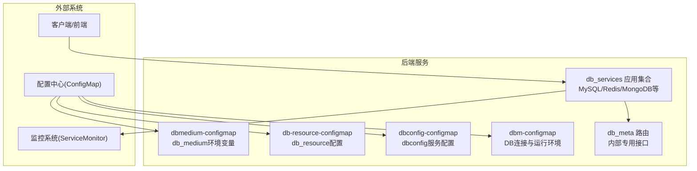
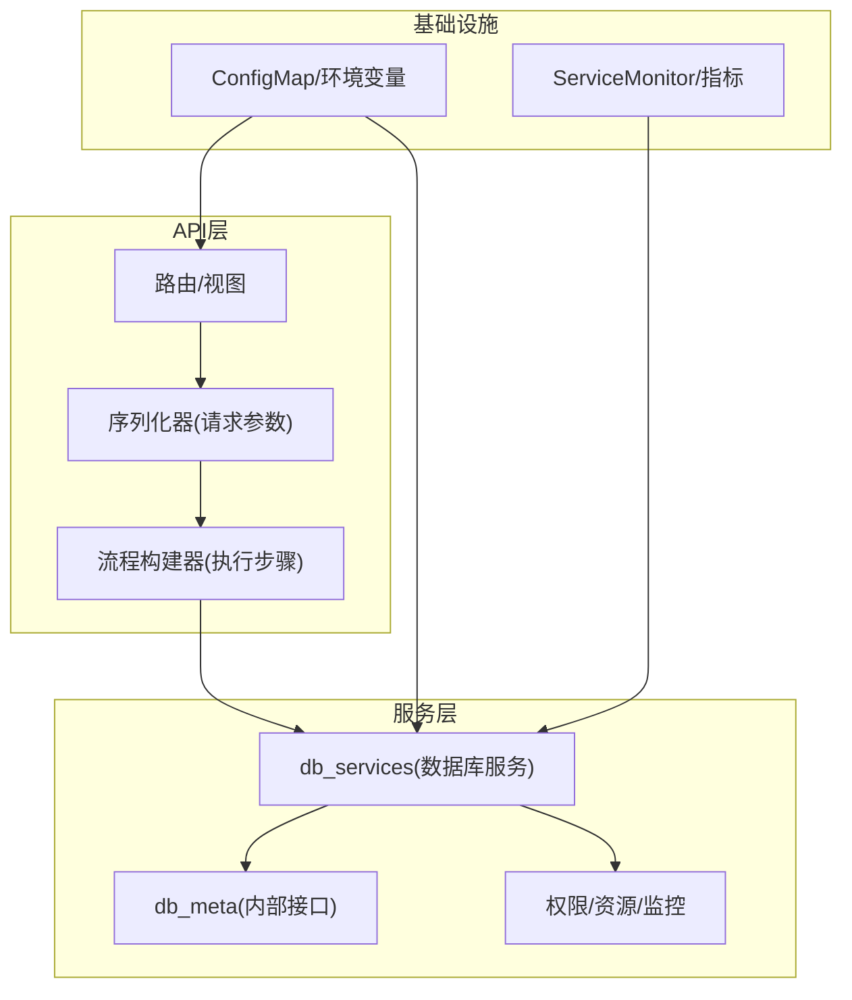
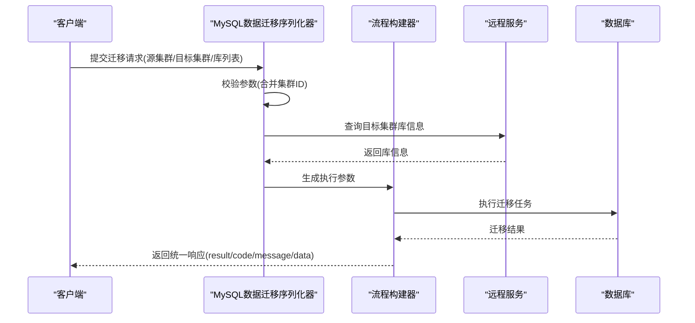
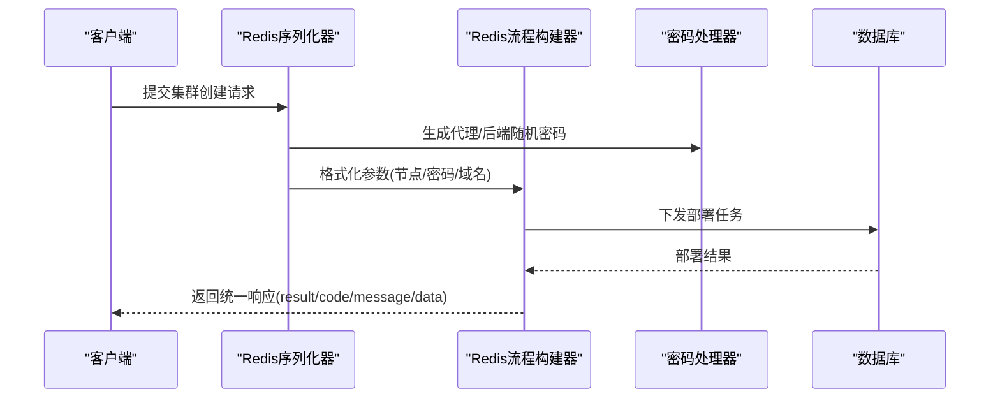
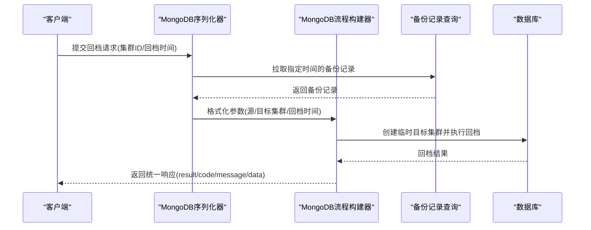

# 数据库管理API

<cite>
**本文引用的文件**
- [dbm-ui/backend/db_meta/urls.py](file://dbm-ui/backend/db_meta/urls.py)
- [docs/api/README.md](file://docs/api/README.md)
- [docs/api/mongodb_list_available_versions.md](file://docs/api/mongodb_list_available_versions.md)
- [dbm-ui/config/default.py](file://dbm-ui/config/default.py)
- [dbm-ui/backend/ticket/builders/mysql/mysql_data_migrate.py](file://dbm-ui/backend/ticket/builders/mysql/mysql_data_migrate.py)
- [dbm-ui/backend/ticket/builders/redis/redis_cluster_apply.py](file://dbm-ui/backend/ticket/builders/redis/redis_cluster_apply.py)
- [dbm-ui/backend/ticket/builders/mongodb/mongo_restore.py](file://dbm-ui/backend/ticket/builders/mongodb/mongo_restore.py)
- [dbm-ui/backend/ticket/builders/mongodb/mongo_scale_updown.py](file://dbm-ui/backend/ticket/builders/mongodb/mongo_scale_updown.py)
- [dbm-ui/backend/ticket/builders/redis/redis_toolbox_redis_scale_updown.py](file://dbm-ui/backend/ticket/builders/redis/redis_toolbox_redis_scale_updown.py)
- [dbm-ui/backend/ticket/builders/mysql/mysql_db_table_backup.py](file://dbm-ui/backend/ticket/builders/mysql/mysql_db_table_backup.py)
- [dbm-ui/backend/ticket/builders/tendbcluster/full_backup.py](file://dbm-ui/backend/ticket/builders/tendbcluster/full_backup.py)
- [dbm-ui/backend/ticket/builders/tendbcluster/base.py](file://dbm-ui/backend/ticket/builders/tendbcluster/base.py)
- [dbm-ui/backend/ticket/builders/mongodb/plugin_delete_clb.py](file://dbm-ui/backend/ticket/builders/mongodb/plugin_delete_clb.py)
- [dbm-ui/backend/ticket/builders/influxdb/influxdb_enable.py](file://dbm-ui/backend/ticket/builders/influxdb/influxdb_enable.py)
- [dbm-ui/backend/ticket/builders/riak/riak_apply.py](file://dbm-ui/backend/ticket/builders/riak/riak_apply.py)
- [helm-charts/bk-dbm/charts/dbconfig/templates/deployment.yaml](file://helm-charts/bk-dbm/charts/dbconfig/templates/deployment.yaml)
- [helm-charts/bk-dbm/charts/dbconfig/templates/servicemonitor.yaml](file://helm-charts/bk-dbm/charts/dbconfig/templates/servicemonitor.yaml)
- [helm-charts/bk-dbm/charts/dbpartition/templates/servicemonitor.yaml](file://helm-charts/bk-dbm/charts/dbpartition/templates/servicemonitor.yaml)
- [helm-charts/bk-dbm/templates/jobs/medium-init-job.yaml](file://helm-charts/bk-dbm/templates/jobs/medium-init-job.yaml)
- [helm-charts/bk-dbm/templates/configmaps/dbconfig-configmap.yaml](file://helm-charts/bk-dbm/templates/configmaps/dbconfig-configmap.yaml)
- [helm-charts/bk-dbm/templates/configmaps/db-resource-configmap.yaml](file://helm-charts/bk-dbm/templates/configmaps/db-resource-configmap.yaml)
- [helm-charts/bk-dbm/templates/configmaps/dbmedium-configmap.yaml](file://helm-charts/bk-dbm/templates/configmaps/dbmedium-configmap.yaml)
- [helm-charts/bk-dbm/templates/configmaps/dbm-configmap.yaml](file://helm-charts/bk-dbm/templates/configmaps/dbm-configmap.yaml)
</cite>

## 目录
1. [简介](#简介)
2. [项目结构](#项目结构)
3. [核心组件](#核心组件)
4. [架构总览](#架构总览)
5. [详细组件分析](#详细组件分析)
6. [依赖关系分析](#依赖关系分析)
7. [性能考量](#性能考量)
8. [故障排查指南](#故障排查指南)
9. [结论](#结论)
10. [附录](#附录)

## 简介
本文件面向数据库管理API，聚焦MySQL、Redis、MongoDB等数据库的集群管理能力，覆盖集群创建、删除、扩容、缩容、备份恢复等REST接口，并补充数据库实例管理、配置管理、监控数据获取等接口说明。文档基于仓库中的API定义、序列化器、流程构建器与配置模板进行整理，提供接口规范、请求/响应示例与常见运维场景的操作步骤。

## 项目结构
- API入口与路由
  - db_meta路由：提供内部专用接口（如DBHA、权限管理、实例状态更新等），仅供内部服务调用。
  - db_services应用：在全局设置中注册，承载各数据库组件的服务能力（如MySQL、Redis、MongoDB等）。
- 文档与示例
  - docs/api目录提供对外或对内约定的HTTP接口使用说明，当前包含MongoDB工具箱接口示例。
- Helm配置
  - dbconfig、dbpartition等Chart提供服务部署、监控采集与环境变量配置，支撑API运行与可观测性。

**图表来源**
- [dbm-ui/backend/db_meta/urls.py:18-76](file://dbm-ui/backend/db_meta/urls.py#L18-L76)
- [dbm-ui/config/default.py:111-149](file://dbm-ui/config/default.py#L111-L149)
- [helm-charts/bk-dbm/templates/configmaps/dbm-configmap.yaml:13-33](file://helm-charts/bk-dbm/templates/configmaps/dbm-configmap.yaml#L13-L33)
- [helm-charts/bk-dbm/templates/configmaps/dbconfig-configmap.yaml:12-42](file://helm-charts/bk-dbm/templates/configmaps/dbconfig-configmap.yaml#L12-L42)
- [helm-charts/bk-dbm/templates/configmaps/db-resource-configmap.yaml:13-35](file://helm-charts/bk-dbm/templates/configmaps/db-resource-configmap.yaml#L13-L35)
- [helm-charts/bk-dbm/templates/configmaps/dbmedium-configmap.yaml:10-21](file://helm-charts/bk-dbm/templates/configmaps/dbmedium-configmap.yaml#L10-L21)

**章节来源**
- [dbm-ui/backend/db_meta/urls.py:18-76](file://dbm-ui/backend/db_meta/urls.py#L18-L76)
- [dbm-ui/config/default.py:111-149](file://dbm-ui/config/default.py#L111-L149)
- [docs/api/README.md:1-10](file://docs/api/README.md#L1-L10)

## 核心组件
- 内部元数据与高可用接口（db_meta）
  - 提供DBHA专用接口、实例状态更新、角色切换、域名详情等内部接口，供DBHA、权限管理等内部模块调用。
- 数据库服务应用（db_services.*）
  - 在全局设置中注册，承载各数据库组件的服务能力，包括但不限于MySQL、Redis、MongoDB、InfluxDB、Riak等。
- 文档与示例（docs/api）
  - 提供MongoDB工具箱接口示例，展示查询集群可升级版本列表的REST接口规范。
- 配置与监控（Helm Charts）
  - dbconfig提供服务配置与Swagger UI开关；dbpartition提供ServiceMonitor指标采集；dbm-configmap等提供DB连接与运行环境变量。

**章节来源**
- [dbm-ui/backend/db_meta/urls.py:18-76](file://dbm-ui/backend/db_meta/urls.py#L18-L76)
- [dbm-ui/config/default.py:111-149](file://dbm-ui/config/default.py#L111-L149)
- [docs/api/README.md:1-10](file://docs/api/README.md#L1-L10)
- [docs/api/mongodb_list_available_versions.md:16-57](file://docs/api/mongodb_list_available_versions.md#L16-L57)

## 架构总览
数据库管理API围绕“路由/视图”和“流程构建器/序列化器”两条主线组织：
- 路由/视图：db_meta提供内部专用接口；db_services承载对外服务。
- 流程构建器/序列化器：各数据库组件通过序列化器定义请求参数，通过流程构建器封装控制器调用与执行步骤。
- 配置与监控：通过Helm配置CM注入环境变量，dbconfig提供服务配置，ServiceMonitor采集指标。

**图表来源**
- [dbm-ui/backend/db_meta/urls.py:18-76](file://dbm-ui/backend/db_meta/urls.py#L18-L76)
- [dbm-ui/config/default.py:111-149](file://dbm-ui/config/default.py#L111-L149)
- [helm-charts/bk-dbm/charts/dbconfig/templates/deployment.yaml:1-46](file://helm-charts/bk-dbm/charts/dbconfig/templates/deployment.yaml#L1-L46)
- [helm-charts/bk-dbm/charts/dbconfig/templates/servicemonitor.yaml:1-21](file://helm-charts/bk-dbm/charts/dbconfig/templates/servicemonitor.yaml#L1-L21)
- [helm-charts/bk-dbm/charts/dbpartition/templates/servicemonitor.yaml:1-21](file://helm-charts/bk-dbm/charts/dbpartition/templates/servicemonitor.yaml#L1-L21)

## 详细组件分析

### MySQL 集群管理API
- 接口概览
  - 集群创建：通过序列化器定义集群规格、字符集、版本、分片数等参数，结合流程构建器完成部署。
  - 数据迁移：支持源集群到目标集群的库级别迁移，包含克隆类型、忽略库列表等参数。
  - 备份恢复：支持全库备份、库表备份等场景，参数包含集群ID、匹配/忽略规则等。
- 关键接口与参数
  - 数据迁移（示例）
    - 方法与路径：POST /backend/ticket/builders/mysql/mysql_data_migrate.py（序列化器定义请求体）
    - 请求参数要点：源集群ID、目标集群列表、最终库列表、克隆类型、显示字段（克隆库列表、忽略库列表）
    - 参数校验：合并目标集群与源集群ID，调用远程服务查询库信息
  - 全库备份（示例）
    - 方法与路径：TBD（参考流程构建器与控制器）
    - 请求参数要点：集群ID、备份类型、目标存储等
  - 库表备份（示例）
    - 方法与路径：TBD（参考流程构建器与控制器）
    - 请求参数要点：集群ID、库匹配/忽略模式、表匹配/忽略模式
- 响应与状态码
  - 统一采用后端通用响应结构（result/code/message/data），具体状态码依据实现返回。
- 常见场景
  - 集群扩容：通过序列化器定义新规格，流程构建器调用控制器执行扩容。
  - 故障转移：通过DBHA接口更新实例状态、切换角色，配合域名变更。
  - 数据迁移：选择源/目标集群，配置库/表过滤，提交迁移任务。

**图表来源**
- [dbm-ui/backend/ticket/builders/mysql/mysql_data_migrate.py:24-43](file://dbm-ui/backend/ticket/builders/mysql/mysql_data_migrate.py#L24-L43)

**章节来源**
- [dbm-ui/backend/ticket/builders/mysql/mysql_data_migrate.py:24-43](file://dbm-ui/backend/ticket/builders/mysql/mysql_data_migrate.py#L24-L43)
- [dbm-ui/backend/ticket/builders/mysql/mysql_db_table_backup.py:29-58](file://dbm-ui/backend/ticket/builders/mysql/mysql_db_table_backup.py#L29-L58)
- [dbm-ui/backend/ticket/builders/tendbcluster/full_backup.py:172-180](file://dbm-ui/backend/ticket/builders/tendbcluster/full_backup.py#L172-L180)
- [dbm-ui/backend/ticket/builders/tendbcluster/base.py:201-221](file://dbm-ui/backend/ticket/builders/tendbcluster/base.py#L201-L221)

### Redis 集群管理API
- 接口概览
  - 集群创建：定义代理/后端节点、密码、城市、数据库数量等参数，生成随机密码并下发。
  - 容量变更：支持扩容/缩容，计算关闭主从主机并更新节点信息。
- 关键接口与参数
  - 集群创建（示例）
    - 方法与路径：TBD（参考序列化器与流程构建器）
    - 请求参数要点：节点分布、代理/后端密码、城市、数据库数量、域名等
    - 密码策略：根据部署类型生成随机密码，满足平台密码策略
  - 容量变更（示例）
    - 方法与路径：TBD（参考序列化器与流程构建器）
    - 请求参数要点：集群ID、组数、更新模式、旧节点映射等
- 响应与状态码
  - 统一采用后端通用响应结构。
- 常见场景
  - 集群扩容：提交扩容请求，流程构建器分配新节点并执行变更。
  - 集群缩容：提交缩容请求，流程构建器识别需关闭的主从主机并回收资源。
  - 故障转移：通过DBHA接口切换角色，配合域名变更。

**图表来源**
- [dbm-ui/backend/ticket/builders/redis/redis_cluster_apply.py:182-273](file://dbm-ui/backend/ticket/builders/redis/redis_cluster_apply.py#L182-L273)

**章节来源**
- [dbm-ui/backend/ticket/builders/redis/redis_cluster_apply.py:182-273](file://dbm-ui/backend/ticket/builders/redis/redis_cluster_apply.py#L182-L273)
- [dbm-ui/backend/ticket/builders/redis/redis_toolbox_redis_scale_updown.py:106-129](file://dbm-ui/backend/ticket/builders/redis/redis_toolbox_redis_scale_updown.py#L106-L129)

### MongoDB 集群管理API
- 接口概览
  - 集群创建：支持副本集与分片集群，定义分片数、节点数、资源规格等。
  - 容量变更：按分片组数与节点数动态调整资源规格，考虑容灾容忍度。
  - 备份恢复：支持指定备份记录与回档时间，分片集群暂不支持批量回档。
  - 工具箱：查询集群可升级版本列表（支持多集群交集）。
- 关键接口与参数
  - 集群创建/扩容（示例）
    - 方法与路径：TBD（参考序列化器与流程构建器）
    - 请求参数要点：集群类型、分片数、节点数、资源规格、容灾容忍度等
  - 回档恢复（示例）
    - 方法与路径：TBD（参考序列化器与流程构建器）
    - 请求参数要点：集群ID、回档时间映射、备份记录、分片集群限制
  - 版本查询（示例）
    - 方法与路径：GET /apis/mongodb/bizs/{bk_biz_id}/toolbox/list_available_versions/
    - 路径参数：bk_biz_id
    - 查询参数：cluster_ids（数组，至少1个）
    - 响应：统一结构，data为空数组时表示无可升级版本
- 响应与状态码
  - 统一采用后端通用响应结构。
- 常见场景
  - 集群扩容：提交扩容请求，流程构建器按分片组数与容忍度分配节点。
  - 回档恢复：为源集群创建临时目标集群，按回档时间拉取备份记录并执行恢复。
  - 删除CLB：通过插件流程删除负载均衡。

**图表来源**
- [dbm-ui/backend/ticket/builders/mongodb/mongo_restore.py:52-77](file://dbm-ui/backend/ticket/builders/mongodb/mongo_restore.py#L52-L77)

**章节来源**
- [docs/api/mongodb_list_available_versions.md:16-57](file://docs/api/mongodb_list_available_versions.md#L16-L57)
- [dbm-ui/backend/ticket/builders/mongodb/mongo_restore.py:52-77](file://dbm-ui/backend/ticket/builders/mongodb/mongo_restore.py#L52-L77)
- [dbm-ui/backend/ticket/builders/mongodb/mongo_scale_updown.py:71-107](file://dbm-ui/backend/ticket/builders/mongodb/mongo_scale_updown.py#L71-L107)
- [dbm-ui/backend/ticket/builders/mongodb/plugin_delete_clb.py:24-43](file://dbm-ui/backend/ticket/builders/mongodb/plugin_delete_clb.py#L24-L43)

### 其他数据库组件（InfluxDB、Riak）
- InfluxDB
  - 启用场景：通过流程构建器调用控制器执行启用操作。
- Riak
  - 集群申请：根据模块与命名规则生成集群名称与域名，更新票据详情。

**章节来源**
- [dbm-ui/backend/ticket/builders/influxdb/influxdb_enable.py:30-40](file://dbm-ui/backend/ticket/builders/influxdb/influxdb_enable.py#L30-L40)
- [dbm-ui/backend/ticket/builders/riak/riak_apply.py:79-91](file://dbm-ui/backend/ticket/builders/riak/riak_apply.py#L79-L91)

## 依赖关系分析
- 组件耦合
  - 序列化器负责请求参数校验与格式化，流程构建器负责调用控制器与编排执行步骤。
  - db_meta路由提供内部专用接口，db_services承载对外服务，二者通过控制器与流程构建器衔接。
- 外部依赖
  - 配置中心：dbm-configmap、dbconfig-configmap、db-resource-configmap、dbmedium-configmap注入环境变量与服务配置。
  - 监控系统：ServiceMonitor采集dbconfig与dbpartition指标，便于观测API健康与性能。

**图表来源**
- [dbm-ui/backend/ticket/builders/mysql/mysql_data_migrate.py:24-43](file://dbm-ui/backend/ticket/builders/mysql/mysql_data_migrate.py#L24-L43)
- [helm-charts/bk-dbm/charts/dbconfig/templates/servicemonitor.yaml:1-21](file://helm-charts/bk-dbm/charts/dbconfig/templates/servicemonitor.yaml#L1-L21)
- [helm-charts/bk-dbm/charts/dbpartition/templates/servicemonitor.yaml:1-21](file://helm-charts/bk-dbm/charts/dbpartition/templates/servicemonitor.yaml#L1-L21)
- [helm-charts/bk-dbm/templates/configmaps/dbm-configmap.yaml:13-33](file://helm-charts/bk-dbm/templates/configmaps/dbm-configmap.yaml#L13-L33)

**章节来源**
- [dbm-ui/config/default.py:111-149](file://dbm-ui/config/default.py#L111-L149)
- [helm-charts/bk-dbm/charts/dbconfig/templates/servicemonitor.yaml:1-21](file://helm-charts/bk-dbm/charts/dbconfig/templates/servicemonitor.yaml#L1-L21)
- [helm-charts/bk-dbm/charts/dbpartition/templates/servicemonitor.yaml:1-21](file://helm-charts/bk-dbm/charts/dbpartition/templates/servicemonitor.yaml#L1-L21)
- [helm-charts/bk-dbm/templates/configmaps/dbm-configmap.yaml:13-33](file://helm-charts/bk-dbm/templates/configmaps/dbm-configmap.yaml#L13-L33)

## 性能考量
- 连接池与数据库访问
  - Django数据库连接池配置（最大空闲连接、最大打开连接、连接最大存活时间）影响API并发与延迟。
- 监控与指标
  - ServiceMonitor定期采集指标，建议结合告警策略对慢查询、连接数、错误率进行监控。
- 配置注入
  - 通过ConfigMap集中管理数据库地址、用户名、密码与监听地址，避免硬编码带来的性能与安全风险。

**章节来源**
- [helm-charts/bk-dbm/charts/dbconfig/templates/deployment.yaml:1-46](file://helm-charts/bk-dbm/charts/dbconfig/templates/deployment.yaml#L1-L46)
- [helm-charts/bk-dbm/charts/dbconfig/templates/servicemonitor.yaml:1-21](file://helm-charts/bk-dbm/charts/dbconfig/templates/servicemonitor.yaml#L1-L21)
- [helm-charts/bk-dbm/templates/configmaps/dbconfig-configmap.yaml:12-42](file://helm-charts/bk-dbm/templates/configmaps/dbconfig-configmap.yaml#L12-L42)

## 故障排查指南
- 常见问题定位
  - 参数校验失败：检查序列化器定义的必填字段与校验逻辑（如集群ID存在性、状态、版本兼容性）。
  - 远程服务调用异常：确认远程服务地址、鉴权与网络连通性。
  - 流程执行失败：查看流程构建器生成的控制器调用参数与执行日志。
- 配置问题
  - 环境变量缺失：核对dbm-configmap、dbconfig-configmap、db-resource-configmap、dbmedium-configmap中的关键键值。
  - 监控采集异常：检查ServiceMonitor的selector与namespaceSelector配置。
- 建议流程
  - 逐步缩小范围：先验证序列化器参数，再验证流程构建器参数，最后验证控制器与数据库。
  - 查看统一响应结构中的code/message，结合后端日志定位根因。

**章节来源**
- [dbm-ui/backend/ticket/builders/mongodb/mongo_restore.py:52-77](file://dbm-ui/backend/ticket/builders/mongodb/mongo_restore.py#L52-L77)
- [docs/api/mongodb_list_available_versions.md:42-46](file://docs/api/mongodb_list_available_versions.md#L42-L46)
- [helm-charts/bk-dbm/templates/configmaps/dbm-configmap.yaml:13-33](file://helm-charts/bk-dbm/templates/configmaps/dbm-configmap.yaml#L13-L33)
- [helm-charts/bk-dbm/charts/dbconfig/templates/servicemonitor.yaml:1-21](file://helm-charts/bk-dbm/charts/dbconfig/templates/servicemonitor.yaml#L1-L21)

## 结论
本文基于仓库中的API定义、序列化器、流程构建器与配置模板，梳理了MySQL、Redis、MongoDB等数据库的集群管理接口与常见运维场景。建议在生产环境中结合统一响应结构、监控采集与配置中心，确保接口稳定性与可观测性。后续可扩展更多数据库组件的API文档与示例。

## 附录
- API文档索引
  - 当前提供MongoDB工具箱接口示例，涵盖查询集群可升级版本列表的REST规范。
- Helm配置要点
  - dbconfig提供服务配置与Swagger UI开关；dbpartition提供ServiceMonitor指标采集；dbm-configmap等提供DB连接与运行环境变量。

**章节来源**
- [docs/api/README.md:1-10](file://docs/api/README.md#L1-L10)
- [docs/api/mongodb_list_available_versions.md:16-57](file://docs/api/mongodb_list_available_versions.md#L16-L57)
- [helm-charts/bk-dbm/charts/dbconfig/templates/deployment.yaml:1-46](file://helm-charts/bk-dbm/charts/dbconfig/templates/deployment.yaml#L1-L46)
- [helm-charts/bk-dbm/charts/dbpartition/templates/servicemonitor.yaml:1-21](file://helm-charts/bk-dbm/charts/dbpartition/templates/servicemonitor.yaml#L1-L21)
- [helm-charts/bk-dbm/templates/configmaps/dbconfig-configmap.yaml:12-42](file://helm-charts/bk-dbm/templates/configmaps/dbconfig-configmap.yaml#L12-L42)
- [helm-charts/bk-dbm/templates/configmaps/db-resource-configmap.yaml:13-35](file://helm-charts/bk-dbm/templates/configmaps/db-resource-configmap.yaml#L13-L35)
- [helm-charts/bk-dbm/templates/configmaps/dbmedium-configmap.yaml:10-21](file://helm-charts/bk-dbm/templates/configmaps/dbmedium-configmap.yaml#L10-L21)
- [helm-charts/bk-dbm/templates/configmaps/dbm-configmap.yaml:13-33](file://helm-charts/bk-dbm/templates/configmaps/dbm-configmap.yaml#L13-L33)