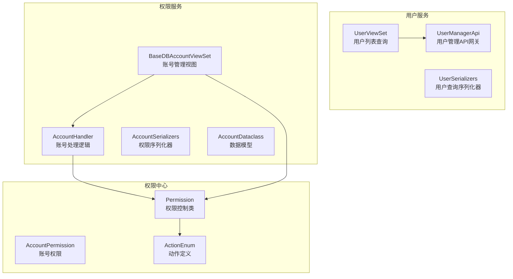
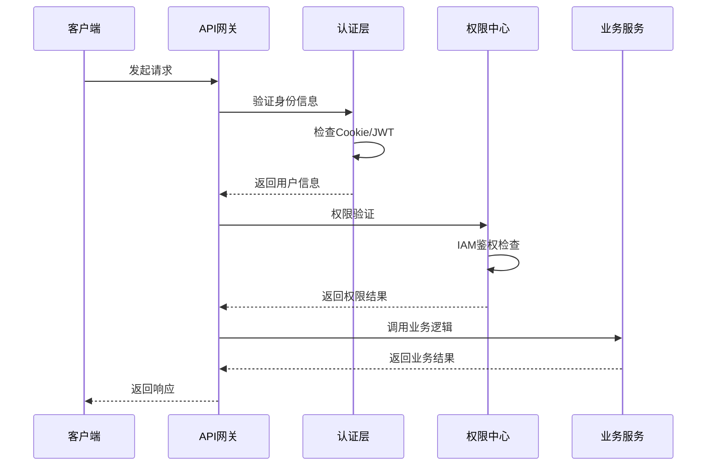
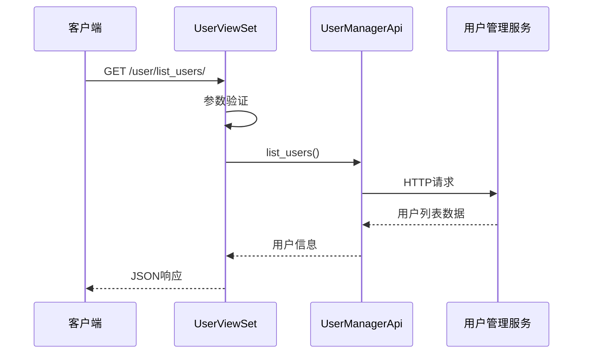
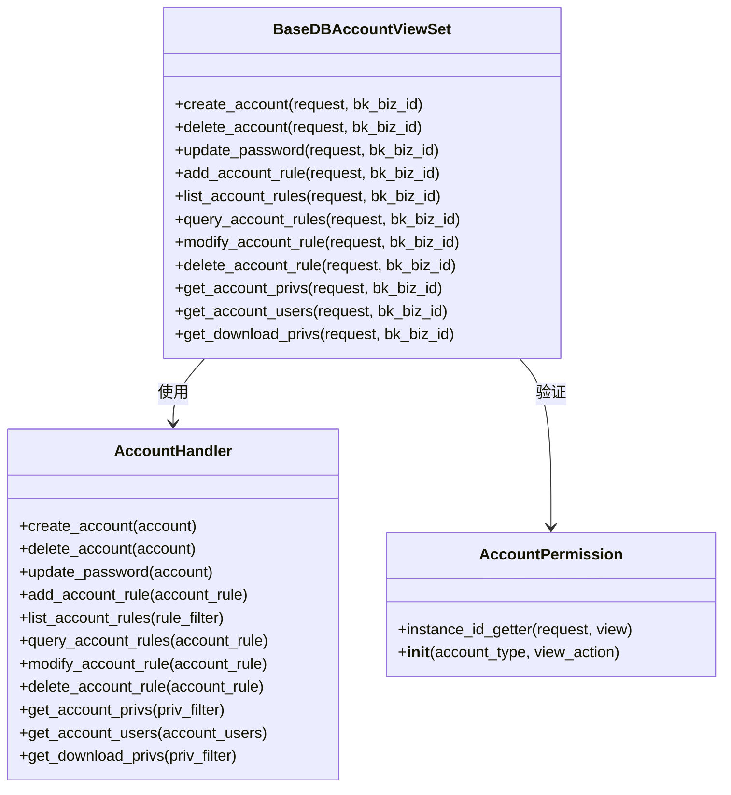
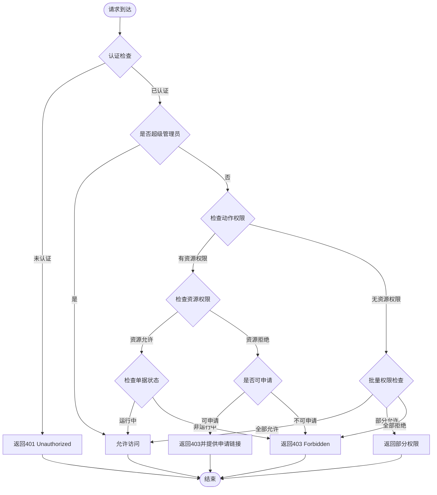
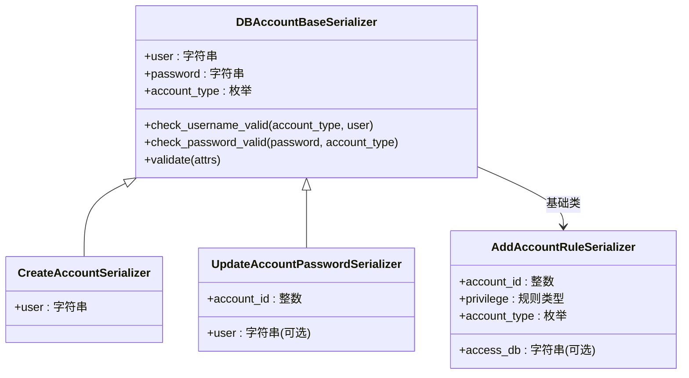
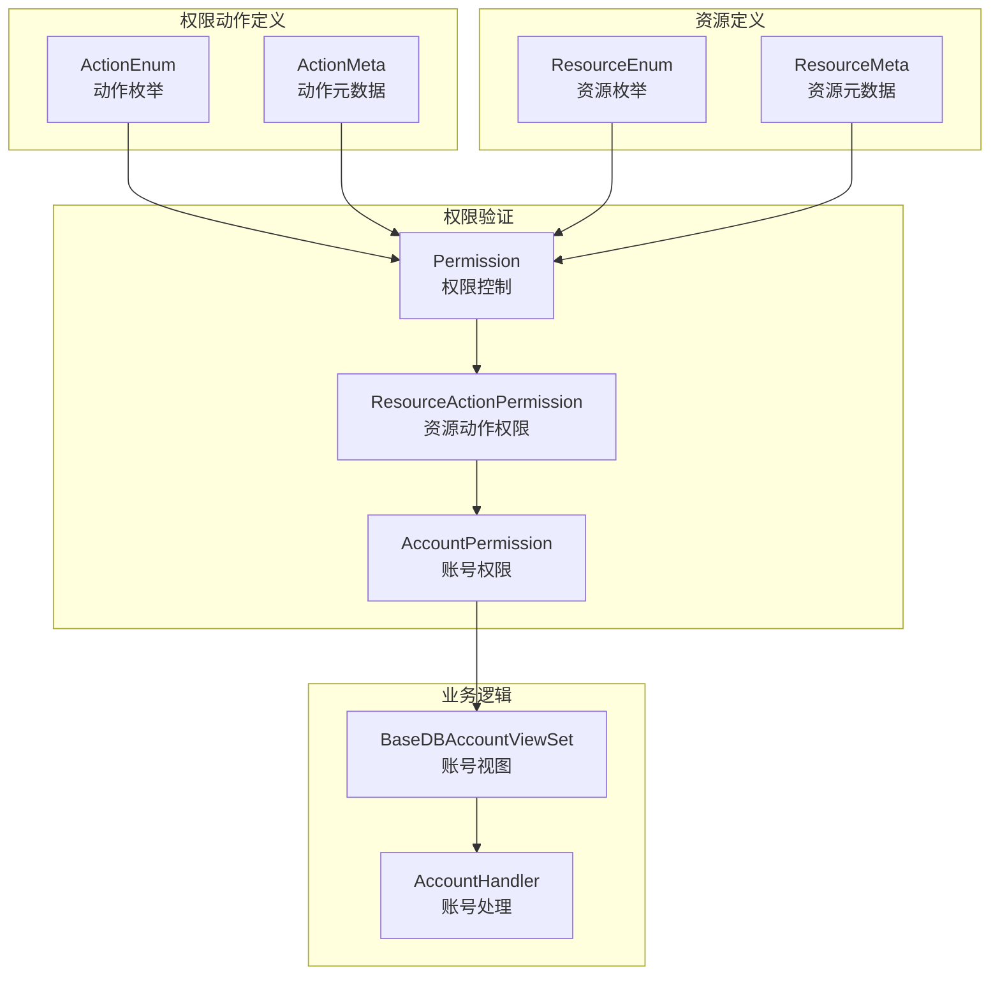
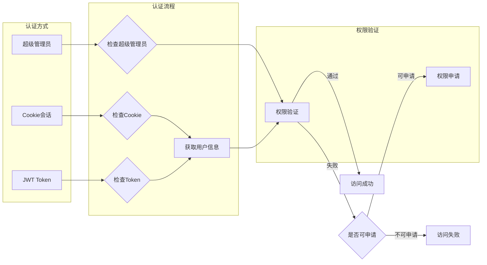

# 用户权限API

<cite>
**本文档引用的文件**
- [db_services/user/views.py](file://dbm-ui/backend/db_services/user/views.py)
- [db_services/user/serializers.py](file://dbm-ui/backend/db_services/user/serializers.py)
- [db_services/user/urls.py](file://dbm-ui/backend/db_services/user/urls.py)
- [components/usermanage/client.py](file://dbm-ui/backend/components/usermanage/client.py)
- [db_services/dbpermission/db_account/views.py](file://dbm-ui/backend/db_services/dbpermission/db_account/views.py)
- [db_services/dbpermission/db_account/serializers.py](file://dbm-ui/backend/db_services/dbpermission/db_account/serializers.py)
- [db_services/dbpermission/db_account/handlers.py](file://dbm-ui/backend/db_services/dbpermission/db_account/handlers.py)
- [db_services/dbpermission/db_account/dataclass.py](file://dbm-ui/backend/db_services/dbpermission/db_account/dataclass.py)
- [db_services/dbpermission/constants.py](file://dbm-ui/backend/db_services/dbpermission/constants.py)
- [iam_app/handlers/permission.py](file://dbm-ui/backend/iam_app/handlers/permission.py)
- [iam_app/handlers/drf_perm/account.py](file://dbm-ui/backend/iam_app/handlers/drf_perm/account.py)
- [iam_app/dataclass/actions.py](file://dbm-ui/backend/iam_app/dataclass/actions.py)
</cite>

## 目录
1. [简介](#简介)
2. [项目结构](#项目结构)
3. [核心组件](#核心组件)
4. [架构概览](#架构概览)
5. [详细组件分析](#详细组件分析)
6. [依赖关系分析](#依赖关系分析)
7. [性能考虑](#性能考虑)
8. [故障排除指南](#故障排除指南)
9. [结论](#结论)

## 简介
本文件为蓝鲸DB管理系统中的用户管理和权限控制API提供详细的技术文档。内容涵盖用户注册、登录、权限分配、角色管理等接口，详细说明认证机制（JWT Token、Cookie会话）、权限验证流程和访问控制策略。文档还包含用户信息管理、部门管理、业务权限分配等接口的请求/响应格式，并提供权限申请、审批流程的API接口说明，包括RBAC权限模型的具体实现和使用示例。

## 项目结构
该项目采用Django REST Framework框架构建，用户权限相关功能主要分布在以下模块：
- 用户信息服务：提供用户列表查询接口
- 数据库权限服务：提供账号管理、权限分配、规则查询等功能
- 权限中心集成：基于IAM的权限控制和无权限申请流程
- 认证与会话：支持Cookie会话和JWT Token认证

**图表来源**
- [db_services/user/views.py:24-36](file://dbm-ui/backend/db_services/user/views.py#L24-L36)
- [db_services/dbpermission/db_account/views.py:51-255](file://dbm-ui/backend/db_services/dbpermission/db_account/views.py#L51-L255)
- [iam_app/handlers/permission.py:47-670](file://dbm-ui/backend/iam_app/handlers/permission.py#L47-L670)

**章节来源**
- [db_services/user/views.py:1-36](file://dbm-ui/backend/db_services/user/views.py#L1-L36)
- [db_services/user/serializers.py:1-20](file://dbm-ui/backend/db_services/user/serializers.py#L1-L20)
- [db_services/user/urls.py:1-20](file://dbm-ui/backend/db_services/user/urls.py#L1-L20)

## 核心组件
本节详细介绍用户管理和权限控制的核心组件及其职责。

### 用户管理组件
用户管理组件提供用户信息查询功能，通过API网关调用用户管理服务：

- **UserViewSet**：继承SystemViewSet，提供用户列表查询接口
- **ListUsersSerializer**：用户查询参数序列化器，支持模糊搜索和精确搜索
- **UserManagerApi**：用户管理API网关客户端，封装HTTP请求方法

### 权限管理组件
权限管理组件提供完整的数据库账号和权限管理功能：

- **BaseDBAccountViewSet**：账号管理视图基类，封装通用处理逻辑
- **AccountHandler**：账号处理业务逻辑，包括创建、删除、密码修改、规则管理等
- **AccountPermission**：账号权限控制类，基于IAM实现细粒度权限验证
- **权限序列化器**：定义各种权限操作的请求参数格式
- **数据模型**：AccountMeta、AccountRuleMeta等数据结构定义

**章节来源**
- [db_services/dbpermission/db_account/views.py:51-255](file://dbm-ui/backend/db_services/dbpermission/db_account/views.py#L51-L255)
- [db_services/dbpermission/db_account/handlers.py:40-441](file://dbm-ui/backend/db_services/dbpermission/db_account/handlers.py#L40-L441)
- [iam_app/handlers/drf_perm/account.py:25-49](file://dbm-ui/backend/iam_app/handlers/drf_perm/account.py#L25-L49)

## 架构概览
系统采用分层架构设计，包含用户服务层、权限服务层、权限中心集成层和认证层。

**图表来源**
- [iam_app/handlers/permission.py:177-207](file://dbm-ui/backend/iam_app/handlers/permission.py#L177-L207)
- [components/usermanage/client.py:18-37](file://dbm-ui/backend/components/usermanage/client.py#L18-L37)

系统架构特点：
- **多层认证**：支持Cookie会话和JWT Token双重认证机制
- **细粒度权限**：基于RBAC模型，支持按业务、账号、集群等多维度权限控制
- **动态权限**：权限验证在运行时进行，支持实时权限变更
- **无权限申请**：集成IAM系统，提供无缝的权限申请流程

## 详细组件分析

### 用户管理API

#### 用户列表查询接口
提供用户信息查询功能，支持模糊搜索和精确搜索。

**图表来源**
- [db_services/user/views.py:32-35](file://dbm-ui/backend/db_services/user/views.py#L32-L35)
- [components/usermanage/client.py:22-28](file://dbm-ui/backend/components/usermanage/client.py#L22-L28)

接口规范：
- **URL**: `/user/list_users/`
- **方法**: GET
- **认证**: 需要登录
- **查询参数**:
  - `fuzzy_lookups`: 模糊搜索关键词
  - `exact_lookups`: 精确搜索关键词
  - `no_page`: 是否不分页（已下线）

**章节来源**
- [db_services/user/views.py:24-36](file://dbm-ui/backend/db_services/user/views.py#L24-L36)
- [db_services/user/serializers.py:15-20](file://dbm-ui/backend/db_services/user/serializers.py#L15-L20)
- [db_services/user/urls.py:15-20](file://dbm-ui/backend/db_services/user/urls.py#L15-L20)

### 权限管理API

#### 账号管理接口
提供数据库账号的完整生命周期管理功能。

**图表来源**
- [db_services/dbpermission/db_account/views.py:96-255](file://dbm-ui/backend/db_services/dbpermission/db_account/views.py#L96-L255)
- [db_services/dbpermission/db_account/handlers.py:95-441](file://dbm-ui/backend/db_services/dbpermission/db_account/handlers.py#L95-L441)
- [iam_app/handlers/drf_perm/account.py:25-49](file://dbm-ui/backend/iam_app/handlers/drf_perm/account.py#L25-L49)

#### 权限验证流程
系统采用RBAC模型实现细粒度权限控制，支持多种权限验证场景。

**图表来源**
- [iam_app/handlers/permission.py:177-290](file://dbm-ui/backend/iam_app/handlers/permission.py#L177-L290)

**章节来源**
- [db_services/dbpermission/db_account/views.py:62-72](file://dbm-ui/backend/db_services/dbpermission/db_account/views.py#L62-L72)
- [iam_app/handlers/permission.py:47-670](file://dbm-ui/backend/iam_app/handlers/permission.py#L47-L670)

### 权限序列化器

#### 账号管理序列化器
定义各种权限操作的请求参数格式和验证规则。

**图表来源**
- [db_services/dbpermission/db_account/serializers.py:25-74](file://dbm-ui/backend/db_services/dbpermission/db_account/serializers.py#L25-L74)
- [db_services/dbpermission/db_account/serializers.py:76-97](file://dbm-ui/backend/db_services/dbpermission/db_account/serializers.py#L76-L97)
- [db_services/dbpermission/db_account/serializers.py:167-224](file://dbm-ui/backend/db_services/dbpermission/db_account/serializers.py#L167-L224)

权限类型定义：
- **MySQL权限**: DML、DDL、GLOBAL三类权限
- **MongoDB权限**: USER、MANAGER两类权限  
- **SQLServer权限**: DML、OWNER两类权限

**章节来源**
- [db_services/dbpermission/db_account/serializers.py:17-224](file://dbm-ui/backend/db_services/dbpermission/db_account/serializers.py#L17-L224)
- [db_services/dbpermission/constants.py:17-147](file://dbm-ui/backend/db_services/dbpermission/constants.py#L17-L147)

## 依赖关系分析

### 权限控制依赖图
系统权限控制涉及多个层次的依赖关系，形成完整的权限管理体系。

**图表来源**
- [iam_app/dataclass/actions.py:114-800](file://dbm-ui/backend/iam_app/dataclass/actions.py#L114-L800)
- [iam_app/handlers/permission.py:47-670](file://dbm-ui/backend/iam_app/handlers/permission.py#L47-L670)
- [iam_app/handlers/drf_perm/account.py:25-49](file://dbm-ui/backend/iam_app/handlers/drf_perm/account.py#L25-L49)

### 认证机制依赖
系统支持多种认证方式，满足不同场景需求。

**图表来源**
- [iam_app/handlers/permission.py:52-66](file://dbm-ui/backend/iam_app/handlers/permission.py#L52-L66)
- [iam_app/handlers/permission.py:177-207](file://dbm-ui/backend/iam_app/handlers/permission.py#L177-L207)

**章节来源**
- [iam_app/handlers/permission.py:47-670](file://dbm-ui/backend/iam_app/handlers/permission.py#L47-L670)
- [iam_app/dataclass/actions.py:114-800](file://dbm-ui/backend/iam_app/dataclass/actions.py#L114-L800)

## 性能考虑
系统在设计时充分考虑了性能优化，采用多种策略提升响应速度和并发处理能力。

### 缓存策略
- **用户信息缓存**：用户管理API网关对用户列表查询结果进行缓存，减少重复查询
- **权限结果缓存**：权限验证结果在内存中缓存，避免重复的IAM调用
- **配置信息缓存**：权限中心系统信息和动作定义在进程启动时加载到内存

### 异步处理
- **权限申请异步**：权限申请流程采用异步处理，避免阻塞主业务流程
- **批量权限检查**：支持批量权限检查，减少IAM API调用次数
- **权限字段注入**：权限字段的注入采用延迟计算，只在需要时进行权限验证

### 连接池管理
- **数据库连接池**：权限相关数据库操作使用连接池，提高数据库访问效率
- **API网关连接池**：用户管理API网关使用连接池，减少连接建立开销
- **IAM客户端连接池**：权限中心客户端使用连接池，优化权限验证性能

## 故障排除指南

### 常见权限问题
1. **权限不足错误**
   - 检查用户是否具有相应的权限动作
   - 验证资源实例ID是否正确
   - 确认权限是否已生效

2. **权限申请失败**
   - 检查IAM系统连接状态
   - 验证用户是否有权限申请相应动作
   - 确认申请数据格式是否正确

3. **权限验证超时**
   - 检查IAM系统的响应时间
   - 验证网络连接状态
   - 考虑增加超时时间配置

### 调试建议
- 启用详细日志记录，跟踪权限验证过程
- 使用IAM提供的调试工具检查权限申请流程
- 监控系统性能指标，识别潜在的性能瓶颈
- 定期清理权限缓存，避免缓存失效导致的问题

**章节来源**
- [iam_app/handlers/permission.py:197-206](file://dbm-ui/backend/iam_app/handlers/permission.py#L197-L206)
- [iam_app/handlers/permission.py:225-239](file://dbm-ui/backend/iam_app/handlers/permission.py#L225-L239)

## 结论
本文件详细介绍了蓝鲸DB管理系统中的用户管理和权限控制API。系统采用分层架构设计，结合RBAC权限模型和IAM权限中心，提供了完整的用户管理、权限控制和访问验证功能。

主要特点包括：
- **多层次认证**：支持Cookie会话和JWT Token双重认证机制
- **细粒度权限**：基于RBAC模型，支持按业务、账号、集群等多维度权限控制
- **动态权限验证**：权限验证在运行时进行，支持实时权限变更
- **无缝权限申请**：集成IAM系统，提供便捷的权限申请流程
- **高性能设计**：采用缓存、异步处理等策略优化系统性能

通过合理使用这些API，可以有效管理用户权限，确保系统的安全性和可控性。建议在实际部署中根据具体业务需求调整权限配置，并定期审查权限设置以确保符合安全最佳实践。