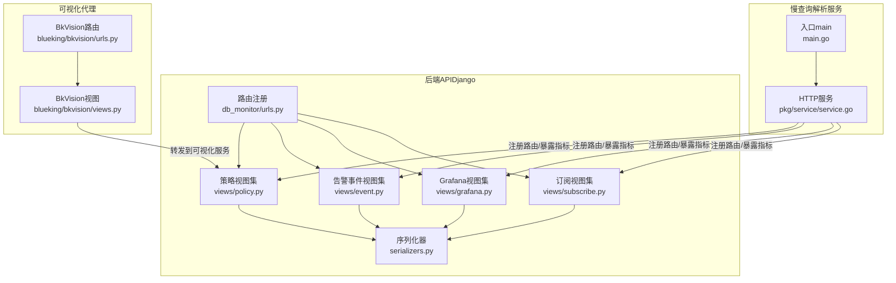
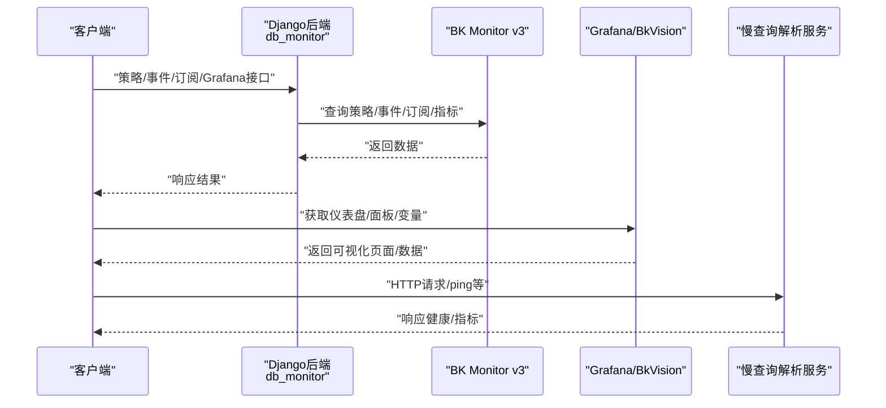
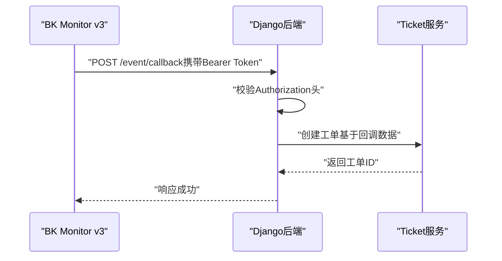
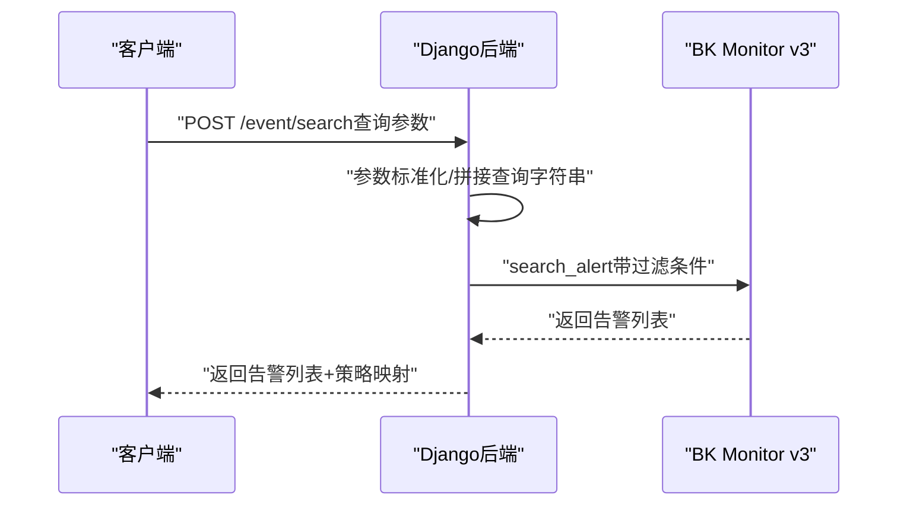
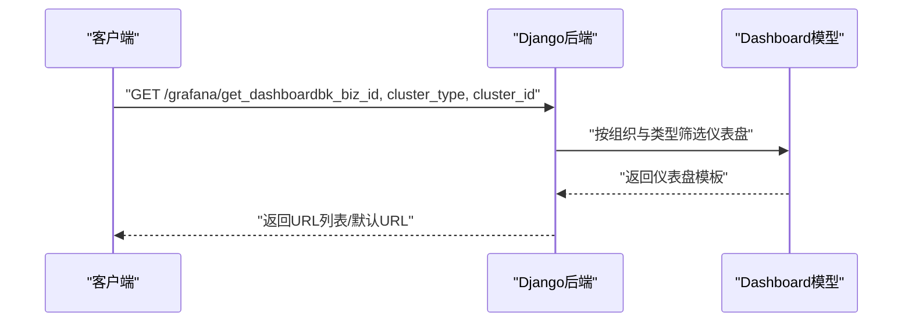
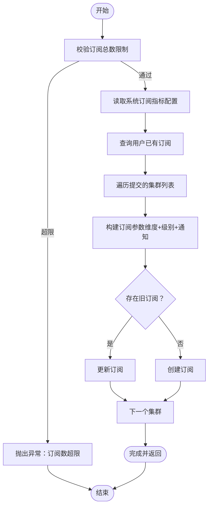
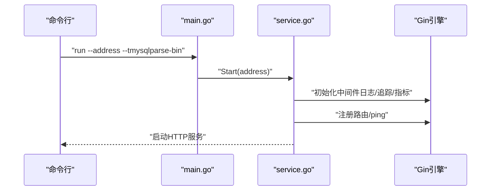
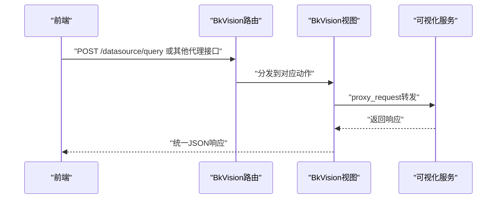
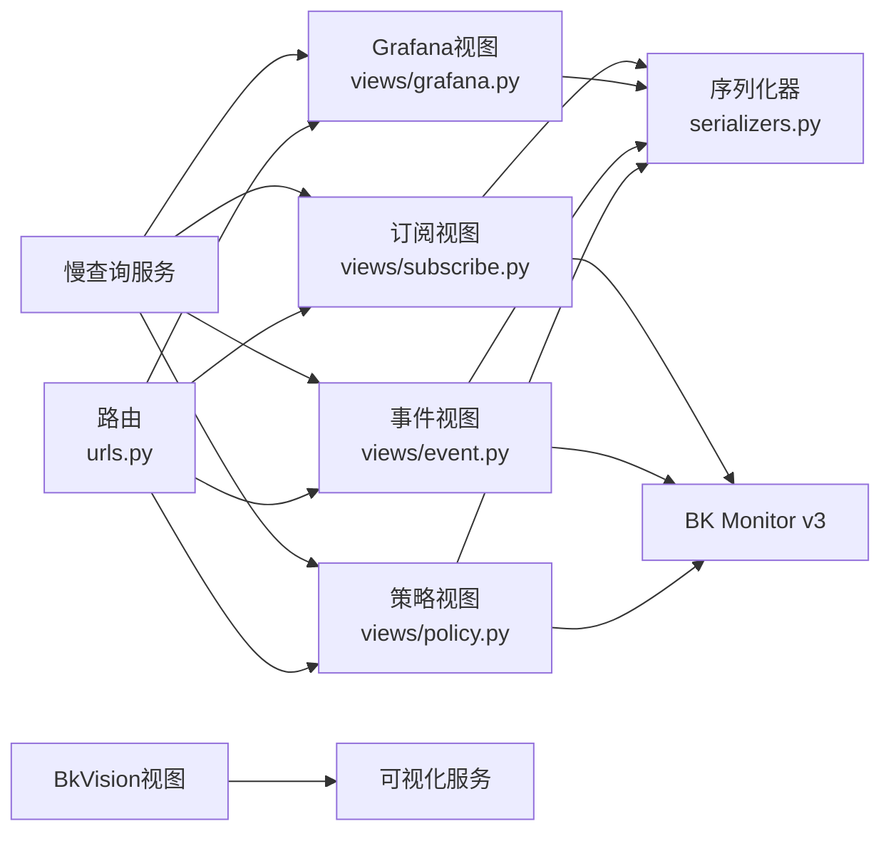

# 监控告警API

<cite>
**本文引用的文件**
- [dbm-ui/backend/db_monitor/views/policy.py](file://dbm-ui/backend/db_monitor/views/policy.py)
- [dbm-ui/backend/db_monitor/views/event.py](file://dbm-ui/backend/db_monitor/views/event.py)
- [dbm-ui/backend/db_monitor/views/grafana.py](file://dbm-ui/backend/db_monitor/views/grafana.py)
- [dbm-ui/backend/db_monitor/views/subscribe.py](file://dbm-ui/backend/db_monitor/views/subscribe.py)
- [dbm-ui/backend/db_monitor/urls.py](file://dbm-ui/backend/db_monitor/urls.py)
- [dbm-ui/backend/db_monitor/serializers.py](file://dbm-ui/backend/db_monitor/serializers.py)
- [dbm-services/mysql/slow-query-parser-service/main.go](file://dbm-services/mysql/slow-query-parser-service/main.go)
- [dbm-services/mysql/slow-query-parser-service/pkg/service/service.go](file://dbm-services/mysql/slow-query-parser-service/pkg/service/service.go)
- [dbm-ui/blueking/bkvision/urls.py](file://dbm-ui/blueking/bkvision/urls.py)
- [dbm-ui/blueking/bkvision/views.py](file://dbm-ui/blueking/bkvision/views.py)
- [dbm-ui/scripts/batch_sync_alarm_policy_field.py](file://dbm-ui/scripts/batch_sync_alarm_policy_field.py)
</cite>

## 目录
1. [简介](#简介)
2. [项目结构](#项目结构)
3. [核心组件](#核心组件)
4. [架构总览](#架构总览)
5. [详细组件分析](#详细组件分析)
6. [依赖分析](#依赖分析)
7. [性能考量](#性能考量)
8. [故障排查指南](#故障排查指南)
9. [结论](#结论)
10. [附录](#附录)

## 简介
本文件面向监控与告警相关API的使用者与维护者，系统性梳理DB管理系统在监控与告警方面的RESTful接口能力，覆盖以下主题：
- 监控数据查询：指标维度查询、告警事件查询、策略信息查询
- 告警规则配置：策略创建、更新、克隆、启用/停用、批量更新告警组、重置默认策略
- 告警处理：告警事件列表、告警订阅保存/查询/删除、告警屏蔽、值班规则与通知
- 监控报表与可视化：Grafana仪表盘地址获取、BkVision数据源/变量/面板代理
- 慢查询分析与性能监控：慢查询解析服务的HTTP接口与指标暴露
- 健康检查：慢查询解析服务的存活探测端点
- 最佳实践：鉴权、分页、过滤、批量操作、跨系统集成（BK Monitor v3）

## 项目结构
监控与告警API主要由两部分构成：
- 后端Django应用：dbm-ui/backend/db_monitor 提供策略、事件、订阅、Grafana、值班与屏蔽等接口
- 慢查询解析服务：dbm-services/mysql/slow-query-parser-service 提供慢查询解析与HTTP服务
- 可视化代理：dbm-ui/blueking/bkvision 提供对第三方可视化系统的代理访问

**图表来源**
- [dbm-ui/backend/db_monitor/urls.py:1-33](file://dbm-ui/backend/db_monitor/urls.py#L1-L33)
- [dbm-ui/backend/db_monitor/views/policy.py:136-521](file://dbm-ui/backend/db_monitor/views/policy.py#L136-L521)
- [dbm-ui/backend/db_monitor/views/event.py:29-150](file://dbm-ui/backend/db_monitor/views/event.py#L29-L150)
- [dbm-ui/backend/db_monitor/views/grafana.py:32-97](file://dbm-ui/backend/db_monitor/views/grafana.py#L32-L97)
- [dbm-ui/backend/db_monitor/views/subscribe.py:37-182](file://dbm-ui/backend/db_monitor/views/subscribe.py#L37-L182)
- [dbm-services/mysql/slow-query-parser-service/main.go:1-63](file://dbm-services/mysql/slow-query-parser-service/main.go#L1-L63)
- [dbm-services/mysql/slow-query-parser-service/pkg/service/service.go:16-39](file://dbm-services/mysql/slow-query-parser-service/pkg/service/service.go#L16-L39)
- [dbm-ui/blueking/bkvision/urls.py:1-17](file://dbm-ui/blueking/bkvision/urls.py#L1-L17)
- [dbm-ui/blueking/bkvision/views.py:123-152](file://dbm-ui/blueking/bkvision/views.py#L123-L152)

**章节来源**
- [dbm-ui/backend/db_monitor/urls.py:1-33](file://dbm-ui/backend/db_monitor/urls.py#L1-L33)
- [dbm-services/mysql/slow-query-parser-service/main.go:1-63](file://dbm-services/mysql/slow-query-parser-service/main.go#L1-L63)
- [dbm-services/mysql/slow-query-parser-service/pkg/service/service.go:16-39](file://dbm-services/mysql/slow-query-parser-service/pkg/service/service.go#L16-L39)
- [dbm-ui/blueking/bkvision/urls.py:1-17](file://dbm-ui/blueking/bkvision/urls.py#L1-L17)
- [dbm-ui/blueking/bkvision/views.py:123-152](file://dbm-ui/blueking/bkvision/views.py#L123-L152)

## 核心组件
- 策略管理（MonitorPolicyViewSet）
  - 列表/详情/创建/更新/删除
  - 启用/停用、克隆策略、批量更新告警组、重置默认策略、批量删除
  - 策略回调（与BK Monitor v3联动）、查询监控策略信息
  - 提供集群/实例/IP/角色/模块等枚举列表
- 告警事件（AlertView）
  - 告警事件列表查询（支持多维过滤、分页、DBA自管/协助过滤）
  - 指标维度查询
- Grafana仪表盘（MonitorGrafanaViewSet）
  - 获取集群/业务仪表盘URL
- 订阅管理（MonitorSubscribeViewSet）
  - 保存订阅、列出订阅、删除订阅、获取订阅指标配置
- 慢查询解析服务（slow-query-parser-service）
  - HTTP服务、OTel链路追踪、Prometheus指标、/ping健康检查
- 可视化代理（BkVision）
  - 数据源/数据集/变量/面板/元数据等代理接口

**章节来源**
- [dbm-ui/backend/db_monitor/views/policy.py:136-521](file://dbm-ui/backend/db_monitor/views/policy.py#L136-L521)
- [dbm-ui/backend/db_monitor/views/event.py:29-150](file://dbm-ui/backend/db_monitor/views/event.py#L29-L150)
- [dbm-ui/backend/db_monitor/views/grafana.py:32-97](file://dbm-ui/backend/db_monitor/views/grafana.py#L32-L97)
- [dbm-ui/backend/db_monitor/views/subscribe.py:37-182](file://dbm-ui/backend/db_monitor/views/subscribe.py#L37-L182)
- [dbm-services/mysql/slow-query-parser-service/pkg/service/service.go:16-39](file://dbm-services/mysql/slow-query-parser-service/pkg/service/service.go#L16-L39)
- [dbm-ui/blueking/bkvision/urls.py:1-17](file://dbm-ui/blueking/bkvision/urls.py#L1-L17)
- [dbm-ui/blueking/bkvision/views.py:123-152](file://dbm-ui/blueking/bkvision/views.py#L123-L152)

## 架构总览
下图展示监控与告警API的调用路径与外部系统集成：

**图表来源**
- [dbm-ui/backend/db_monitor/views/policy.py:435-452](file://dbm-ui/backend/db_monitor/views/policy.py#L435-L452)
- [dbm-ui/backend/db_monitor/views/event.py:118-138](file://dbm-ui/backend/db_monitor/views/event.py#L118-L138)
- [dbm-ui/backend/db_monitor/views/subscribe.py:113-114](file://dbm-ui/backend/db_monitor/views/subscribe.py#L113-L114)
- [dbm-services/mysql/slow-query-parser-service/pkg/service/service.go:33-35](file://dbm-services/mysql/slow-query-parser-service/pkg/service/service.go#L33-L35)
- [dbm-ui/blueking/bkvision/views.py:123-152](file://dbm-ui/blueking/bkvision/views.py#L123-L152)

## 详细组件分析

### 策略管理（MonitorPolicyViewSet）
- 接口能力
  - 列表/详情/创建/更新/删除
  - 启用/停用、克隆策略、批量更新告警组、重置默认策略、批量删除
  - 策略回调（与BK Monitor v3联动）、查询监控策略信息
  - 提供集群/实例/IP/角色/模块等枚举列表
- 关键流程（策略回调）
  - 校验Authorization头中的Bearer Token
  - 将回调数据转换为工单创建请求并调用Ticket服务

**图表来源**
- [dbm-ui/backend/db_monitor/views/policy.py:435-452](file://dbm-ui/backend/db_monitor/views/policy.py#L435-L452)

**章节来源**
- [dbm-ui/backend/db_monitor/views/policy.py:136-521](file://dbm-ui/backend/db_monitor/views/policy.py#L136-L521)

### 告警事件（AlertView）
- 接口能力
  - 告警事件列表查询（支持多维过滤、分页、DBA自管/协助过滤）
  - 指标维度查询
- 关键流程（事件列表）
  - 参数标准化、查询字符串拼接、DBA业务/类型过滤、调用BK Monitor v3查询

**图表来源**
- [dbm-ui/backend/db_monitor/views/event.py:44-138](file://dbm-ui/backend/db_monitor/views/event.py#L44-L138)

**章节来源**
- [dbm-ui/backend/db_monitor/views/event.py:29-150](file://dbm-ui/backend/db_monitor/views/event.py#L29-L150)

### Grafana仪表盘（MonitorGrafanaViewSet）
- 接口能力
  - 获取集群仪表盘URL
  - 获取业务/概览仪表盘URL
- 关键流程（获取仪表盘）
  - 根据集群类型选择仪表盘模板，生成业务+集群维度的URL

**图表来源**
- [dbm-ui/backend/db_monitor/views/grafana.py:46-64](file://dbm-ui/backend/db_monitor/views/grafana.py#L46-L64)
- [dbm-ui/backend/db_monitor/views/grafana.py:72-96](file://dbm-ui/backend/db_monitor/views/grafana.py#L72-L96)

**章节来源**
- [dbm-ui/backend/db_monitor/views/grafana.py:32-97](file://dbm-ui/backend/db_monitor/views/grafana.py#L32-L97)

### 订阅管理（MonitorSubscribeViewSet）
- 接口能力
  - 保存订阅（按集群维度+告警级别+通知方式）
  - 列出订阅（补全集群/业务/级别信息）
  - 删除订阅
  - 获取订阅指标配置
- 关键流程（保存订阅）
  - 校验用户订阅总数上限
  - 读取系统配置的指标集合
  - 与现有订阅比对，执行新增或更新

**图表来源**
- [dbm-ui/backend/db_monitor/views/subscribe.py:56-114](file://dbm-ui/backend/db_monitor/views/subscribe.py#L56-L114)

**章节来源**
- [dbm-ui/backend/db_monitor/views/subscribe.py:37-182](file://dbm-ui/backend/db_monitor/views/subscribe.py#L37-L182)

### 慢查询解析服务（slow-query-parser-service）
- 接口能力
  - HTTP服务：/ping 健康检查
  - OTel链路追踪中间件
  - Prometheus指标中间件
- 关键流程（启动）
  - 解析命令行参数（监听地址、解析器二进制路径）
  - 初始化日志与追踪
  - 注册路由并启动HTTP服务

**图表来源**
- [dbm-services/mysql/slow-query-parser-service/main.go:43-61](file://dbm-services/mysql/slow-query-parser-service/main.go#L43-L61)
- [dbm-services/mysql/slow-query-parser-service/pkg/service/service.go:16-39](file://dbm-services/mysql/slow-query-parser-service/pkg/service/service.go#L16-L39)

**章节来源**
- [dbm-services/mysql/slow-query-parser-service/main.go:1-63](file://dbm-services/mysql/slow-query-parser-service/main.go#L1-L63)
- [dbm-services/mysql/slow-query-parser-service/pkg/service/service.go:16-39](file://dbm-services/mysql/slow-query-parser-service/pkg/service/service.go#L16-L39)

### 可视化代理（BkVision）
- 接口能力
  - 数据源/数据集/变量/面板/元数据/分享列表等代理接口
- 关键流程（代理转发）
  - 将前端请求转发至可视化服务，并捕获异常返回统一格式

**图表来源**
- [dbm-ui/blueking/bkvision/urls.py:7-17](file://dbm-ui/blueking/bkvision/urls.py#L7-L17)
- [dbm-ui/blueking/bkvision/views.py:123-152](file://dbm-ui/blueking/bkvision/views.py#L123-L152)

**章节来源**
- [dbm-ui/blueking/bkvision/urls.py:1-17](file://dbm-ui/blueking/bkvision/urls.py#L1-L17)
- [dbm-ui/blueking/bkvision/views.py:123-152](file://dbm-ui/blueking/bkvision/views.py#L123-L152)

## 依赖分析
- Django路由与视图
  - 路由集中注册策略、事件、Grafana、订阅等视图集
- 视图与序列化器
  - 视图依赖序列化器进行参数校验与响应结构定义
- 外部系统集成
  - BK Monitor v3：策略、事件、订阅、指标查询
  - Grafana/BkVision：仪表盘与可视化数据代理
- 慢查询解析服务
  - Gin引擎、OTel中间件、Prometheus中间件

**图表来源**
- [dbm-ui/backend/db_monitor/urls.py:21-32](file://dbm-ui/backend/db_monitor/urls.py#L21-L32)
- [dbm-ui/backend/db_monitor/views/policy.py:136-521](file://dbm-ui/backend/db_monitor/views/policy.py#L136-L521)
- [dbm-ui/backend/db_monitor/views/event.py:29-150](file://dbm-ui/backend/db_monitor/views/event.py#L29-L150)
- [dbm-ui/backend/db_monitor/views/grafana.py:32-97](file://dbm-ui/backend/db_monitor/views/grafana.py#L32-L97)
- [dbm-ui/backend/db_monitor/views/subscribe.py:37-182](file://dbm-ui/backend/db_monitor/views/subscribe.py#L37-L182)
- [dbm-services/mysql/slow-query-parser-service/pkg/service/service.go:16-39](file://dbm-services/mysql/slow-query-parser-service/pkg/service/service.go#L16-L39)
- [dbm-ui/blueking/bkvision/views.py:123-152](file://dbm-ui/blueking/bkvision/views.py#L123-L152)

**章节来源**
- [dbm-ui/backend/db_monitor/urls.py:1-33](file://dbm-ui/backend/db_monitor/urls.py#L1-L33)
- [dbm-ui/backend/db_monitor/views/policy.py:136-521](file://dbm-ui/backend/db_monitor/views/policy.py#L136-L521)
- [dbm-ui/backend/db_monitor/views/event.py:29-150](file://dbm-ui/backend/db_monitor/views/event.py#L29-L150)
- [dbm-ui/backend/db_monitor/views/grafana.py:32-97](file://dbm-ui/backend/db_monitor/views/grafana.py#L32-L97)
- [dbm-ui/backend/db_monitor/views/subscribe.py:37-182](file://dbm-ui/backend/db_monitor/views/subscribe.py#L37-L182)
- [dbm-services/mysql/slow-query-parser-service/pkg/service/service.go:16-39](file://dbm-services/mysql/slow-query-parser-service/pkg/service/service.go#L16-L39)
- [dbm-ui/blueking/bkvision/views.py:123-152](file://dbm-ui/blueking/bkvision/views.py#L123-L152)

## 性能考量
- 分页与过滤
  - 事件查询支持分页与多维过滤，建议合理设置limit与过滤条件，避免大范围扫描
- 批量操作
  - 策略批量更新告警组时涉及多线程/批量写入，注意资源竞争与幂等性
- 指标查询
  - Grafana/BkVision代理接口应避免重复请求，建议前端缓存常用配置
- 慢查询解析服务
  - 启用OTel与Prometheus中间件，便于观测服务性能与延迟；/ping用于快速健康检查

[本节为通用指导，无需特定文件来源]

## 故障排查指南
- 策略回调鉴权失败
  - 确认回调接口携带正确的Bearer Token，且与环境变量一致
  - 参考：[dbm-ui/backend/db_monitor/views/policy.py:442-451](file://dbm-ui/backend/db_monitor/views/policy.py#L442-L451)
- 订阅总数超限
  - 用户订阅总数不得超过上限，建议先清理无效订阅再新增
  - 参考：[dbm-ui/backend/db_monitor/views/subscribe.py:65-66](file://dbm-ui/backend/db_monitor/views/subscribe.py#L65-L66)
- 仪表盘URL为空
  - 确认组织与类型匹配的仪表盘是否存在，或检查业务维度参数
  - 参考：[dbm-ui/backend/db_monitor/views/grafana.py:55-64](file://dbm-ui/backend/db_monitor/views/grafana.py#L55-L64)
- 慢查询解析服务不可用
  - 使用/health或/ping检查服务状态，确认中间件与监听地址配置正确
  - 参考：[dbm-services/mysql/slow-query-parser-service/pkg/service/service.go:33-35](file://dbm-services/mysql/slow-query-parser-service/pkg/service/service.go#L33-L35)

**章节来源**
- [dbm-ui/backend/db_monitor/views/policy.py:442-451](file://dbm-ui/backend/db_monitor/views/policy.py#L442-L451)
- [dbm-ui/backend/db_monitor/views/subscribe.py:65-66](file://dbm-ui/backend/db_monitor/views/subscribe.py#L65-L66)
- [dbm-ui/backend/db_monitor/views/grafana.py:55-64](file://dbm-ui/backend/db_monitor/views/grafana.py#L55-L64)
- [dbm-services/mysql/slow-query-parser-service/pkg/service/service.go:33-35](file://dbm-services/mysql/slow-query-parser-service/pkg/service/service.go#L33-L35)

## 结论
本文档系统梳理了DB管理系统在监控与告警方面的RESTful接口，涵盖策略配置、事件查询、订阅管理、可视化接入以及慢查询解析服务。通过明确的接口定义、流程图与最佳实践，可帮助开发者与运维人员高效集成与维护监控体系。

[本节为总结，无需特定文件来源]

## 附录

### API一览与使用示例（路径与要点）
- 策略管理
  - 列表/详情/创建/更新/删除：参考序列化器字段与视图方法
    - [dbm-ui/backend/db_monitor/views/policy.py:136-521](file://dbm-ui/backend/db_monitor/views/policy.py#L136-L521)
    - [dbm-ui/backend/db_monitor/serializers.py:128-263](file://dbm-ui/backend/db_monitor/serializers.py#L128-L263)
  - 启用/停用、克隆、重置默认策略、批量删除
    - [dbm-ui/backend/db_monitor/views/policy.py:211-240](file://dbm-ui/backend/db_monitor/views/policy.py#L211-L240)
    - [dbm-ui/backend/db_monitor/views/policy.py:229-231](file://dbm-ui/backend/db_monitor/views/policy.py#L229-L231)
    - [dbm-ui/backend/db_monitor/views/policy.py:295-302](file://dbm-ui/backend/db_monitor/views/policy.py#L295-L302)
    - [dbm-ui/backend/db_monitor/views/policy.py:516-520](file://dbm-ui/backend/db_monitor/views/policy.py#L516-L520)
  - 策略回调（与BK Monitor v3联动）
    - [dbm-ui/backend/db_monitor/views/policy.py:435-452](file://dbm-ui/backend/db_monitor/views/policy.py#L435-L452)
  - 查询监控策略信息
    - [dbm-ui/backend/db_monitor/views/policy.py:464-504](file://dbm-ui/backend/db_monitor/views/policy.py#L464-L504)
- 告警事件
  - 事件列表与指标维度查询
    - [dbm-ui/backend/db_monitor/views/event.py:44-138](file://dbm-ui/backend/db_monitor/views/event.py#L44-L138)
    - [dbm-ui/backend/db_monitor/views/event.py:146-149](file://dbm-ui/backend/db_monitor/views/event.py#L146-L149)
- Grafana仪表盘
  - 获取集群/业务/概览仪表盘URL
    - [dbm-ui/backend/db_monitor/views/grafana.py:46-64](file://dbm-ui/backend/db_monitor/views/grafana.py#L46-L64)
    - [dbm-ui/backend/db_monitor/views/grafana.py:72-96](file://dbm-ui/backend/db_monitor/views/grafana.py#L72-L96)
- 订阅管理
  - 保存/列出/删除订阅、获取订阅指标
    - [dbm-ui/backend/db_monitor/views/subscribe.py:56-114](file://dbm-ui/backend/db_monitor/views/subscribe.py#L56-L114)
    - [dbm-ui/backend/db_monitor/views/subscribe.py:122-161](file://dbm-ui/backend/db_monitor/views/subscribe.py#L122-L161)
    - [dbm-ui/backend/db_monitor/views/subscribe.py:169-171](file://dbm-ui/backend/db_monitor/views/subscribe.py#L169-L171)
    - [dbm-ui/backend/db_monitor/views/subscribe.py:179-181](file://dbm-ui/backend/db_monitor/views/subscribe.py#L179-L181)
- 慢查询解析服务
  - HTTP服务与健康检查
    - [dbm-services/mysql/slow-query-parser-service/pkg/service/service.go:33-35](file://dbm-services/mysql/slow-query-parser-service/pkg/service/service.go#L33-L35)
- 可视化代理（BkVision）
  - 数据源/数据集/变量/面板/元数据/分享列表
    - [dbm-ui/blueking/bkvision/urls.py:7-17](file://dbm-ui/blueking/bkvision/urls.py#L7-L17)
    - [dbm-ui/blueking/bkvision/views.py:123-152](file://dbm-ui/blueking/bkvision/views.py#L123-L152)

### 最佳实践
- 鉴权与权限
  - 使用权限装饰器与IAM资源动作控制，确保最小权限原则
- 分页与过滤
  - 合理设置limit与过滤条件，避免全量扫描
- 批量操作
  - 注意幂等性与事务一致性，必要时采用异步任务
- 可观测性
  - 启用OTel与Prometheus中间件，结合Grafana/BkVision进行可视化

**章节来源**
- [dbm-ui/backend/db_monitor/views/policy.py:150-175](file://dbm-ui/backend/db_monitor/views/policy.py#L150-L175)
- [dbm-ui/backend/db_monitor/views/subscribe.py:65-66](file://dbm-ui/backend/db_monitor/views/subscribe.py#L65-L66)
- [dbm-services/mysql/slow-query-parser-service/pkg/service/service.go:24-29](file://dbm-services/mysql/slow-query-parser-service/pkg/service/service.go#L24-L29)
- [dbm-ui/blueking/bkvision/views.py:123-152](file://dbm-ui/blueking/bkvision/views.py#L123-L152)

### 历史数据与策略同步脚本
- 批量同步告警策略字段（策略标签、通知配置、聚合信息等）
  - [dbm-ui/scripts/batch_sync_alarm_policy_field.py:57-118](file://dbm-ui/scripts/batch_sync_alarm_policy_field.py#L57-L118)

**章节来源**
- [dbm-ui/scripts/batch_sync_alarm_policy_field.py:57-118](file://dbm-ui/scripts/batch_sync_alarm_policy_field.py#L57-L118)