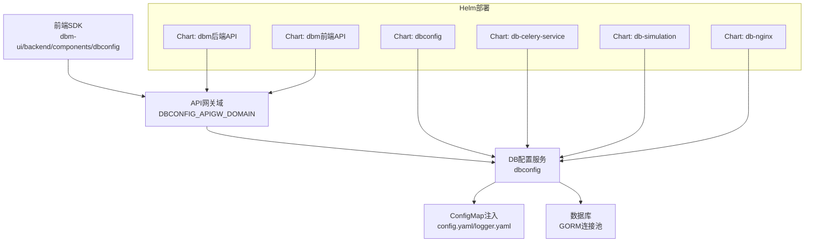
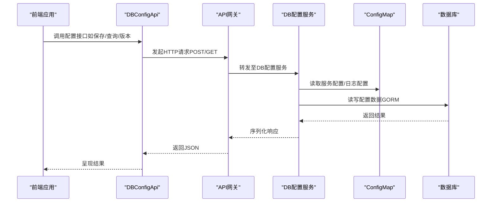
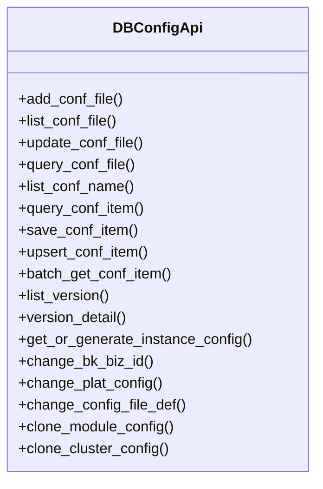
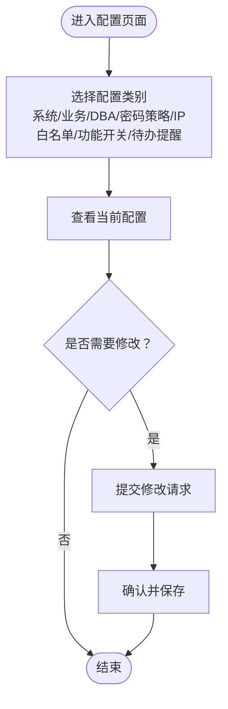
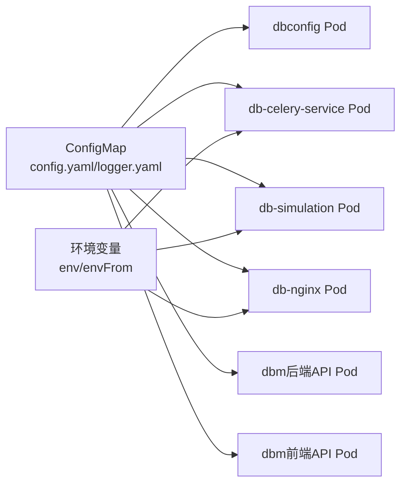
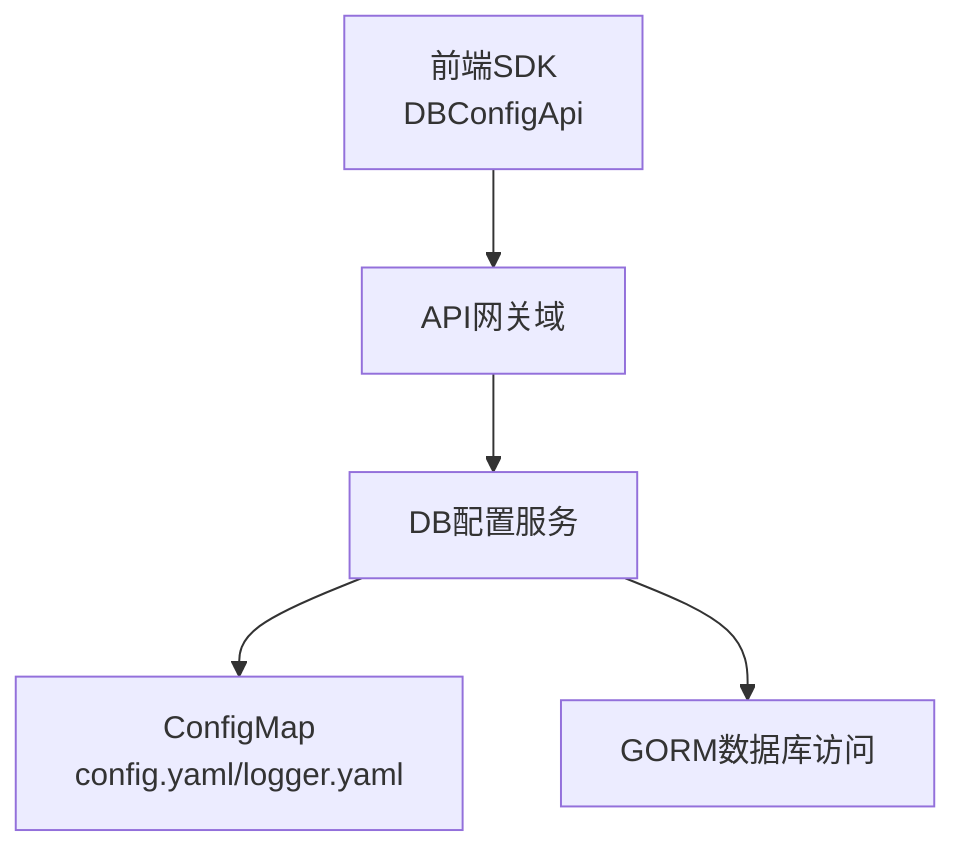

# 配置系统API

<cite>
**本文引用的文件**
- [client.py](file://dbm-ui/backend/components/dbconfig/client.py)
- [constants.py](file://dbm-ui/backend/components/dbconfig/constants.py)
- [urls.py](file://dbm-ui/backend/configuration/urls.py)
- [deployment.yaml](file://helm-charts/bk-dbm/charts/dbconfig/templates/deployment.yaml)
- [configmaps/dbconfig-configmap.yaml](file://helm-charts/bk-dbm/templates/configmaps/dbconfig-configmap.yaml)
- [deployment.yaml](file://helm-charts/bk-dbm/charts/db-celery-service/templates/deployment.yaml)
- [deployment.yaml](file://helm-charts/bk-dbm/charts/db-simulation/templates/deployment.yaml)
- [deployment.yaml](file://helm-charts/bk-dbm/charts/db-nginx/templates/deployment.yaml)
- [deployment.yaml](file://helm-charts/bk-dbm/charts/dbm/templates/deployments/backend-api/backend-api.yaml)
- [deployment.yaml](file://helm-charts/bk-dbm/charts/dbm/templates/deployments/saas-api/saas-api.yaml)
</cite>

## 目录
1. [简介](#简介)
2. [项目结构](#项目结构)
3. [核心组件](#核心组件)
4. [架构总览](#架构总览)
5. [详细组件分析](#详细组件分析)
6. [依赖关系分析](#依赖关系分析)
7. [性能考量](#性能考量)
8. [故障排查指南](#故障排查指南)
9. [结论](#结论)
10. [附录](#附录)

## 简介
本文件面向“系统配置与环境管理API”，聚焦于以下能力：
- 系统参数配置、环境变量管理、配置文件管理
- 配置项的增删改查、配置同步、版本管理
- 数据库配置、网络配置、安全配置等分类接口
- 配置导入导出、批量配置、配置审计等高级功能的使用路径与流程说明

该文档以实际代码与配置为依据，结合后端API网关与前端SDK的调用方式，给出可落地的RESTful接口说明与最佳实践。

## 项目结构
围绕配置系统的相关模块主要分布在以下位置：
- 前端SDK：dbm-ui/backend/components/dbconfig，封装DB配置系统API
- 后端路由：dbm-ui/backend/configuration，提供系统/业务设置等REST接口
- Helm部署：helm-charts/bk-dbm，包含dbconfig服务、db-celery-service、db-simulation、db-nginx、dbm后端/前端API等Chart，用于容器化部署与配置注入

图表来源
- [client.py:19-114](file://dbm-ui/backend/components/dbconfig/client.py#L19-L114)
- [configmaps/dbconfig-configmap.yaml:1-57](file://helm-charts/bk-dbm/templates/configmaps/dbconfig-configmap.yaml#L1-L57)
- [deployment.yaml:1-46](file://helm-charts/bk-dbm/charts/dbconfig/templates/deployment.yaml#L1-L46)

章节来源
- [client.py:19-114](file://dbm-ui/backend/components/dbconfig/client.py#L19-L114)
- [urls.py:12-34](file://dbm-ui/backend/configuration/urls.py#L12-L34)

## 核心组件
- 前端SDK（DBConfigApi）
  - 提供配置文件与配置项的增删改查、版本管理、克隆、变更业务等接口
  - 关键接口包括：新增/编辑/查询配置文件；查询配置项列表；保存/UPSERT配置项；批量获取；版本列表/详情；生成实例配置模板；变更业务；变更平台配置定义等
- 后端配置类视图集（System/Biz Settings等）
  - 通过DRF路由注册，提供系统设置、业务设置、DBA权限、密码策略、IP白名单、功能开关、待办提醒等REST接口
- Helm部署与配置注入
  - 通过ConfigMap注入服务配置与日志配置，并挂载到容器内
  - 通过env/envFrom将环境变量注入到Pod中，支持外部配置源

章节来源
- [client.py:24-110](file://dbm-ui/backend/components/dbconfig/client.py#L24-L110)
- [constants.py:18-67](file://dbm-ui/backend/components/dbconfig/constants.py#L18-L67)
- [urls.py:14-31](file://dbm-ui/backend/configuration/urls.py#L14-L31)

## 架构总览
下图展示从前端SDK到后端服务、再到配置存储的整体链路：

图表来源
- [client.py:24-110](file://dbm-ui/backend/components/dbconfig/client.py#L24-L110)
- [configmaps/dbconfig-configmap.yaml:12-57](file://helm-charts/bk-dbm/templates/configmaps/dbconfig-configmap.yaml#L12-L57)

## 详细组件分析

### 前端SDK：DBConfigApi
- 模块定位：封装DB配置系统API，统一方法名与URL前缀
- 主要接口族
  - 配置文件管理：新增/编辑/查询配置文件、查询文件列表
  - 配置项管理：查询配置项列表、保存无版本配置、UPSERT有版本配置、批量获取
  - 版本管理：查询版本列表、查询版本详情、生成实例配置模板、变更业务
  - 平台配置：变更平台配置定义、变更配置文件定义
  - 克隆：模块级克隆、集群级克隆
- 请求描述与行为
  - 多数接口采用POST或GET，部分接口对返回值进行预处理（如统一取列表首项）
  - 版本相关接口强调“版本概念”与“生成并发布”的组合能力

图表来源
- [client.py:19-114](file://dbm-ui/backend/components/dbconfig/client.py#L19-L114)

章节来源
- [client.py:24-110](file://dbm-ui/backend/components/dbconfig/client.py#L24-L110)

### 后端配置类视图集（系统/业务设置）
- 路由注册：通过DefaultRouter注册多个ViewSet，暴露REST接口
- 主要视图集
  - SystemSettingsViewSet：系统设置
  - BizSettingsViewSet：业务设置
  - DBAdminViewSet：DBA权限
  - ProfileViewSet：用户档案
  - PasswordPolicyViewSet：密码策略
  - IPWhitelistViewSet：IP白名单
  - FunctionControllerViewSet：功能控制器
  - TodoRemindViewSet：待办提醒
- 使用建议
  - 通过标准REST方法（GET/POST/PUT/DELETE）访问对应资源
  - 注意鉴权与权限控制，确保仅授权用户可修改敏感设置

章节来源
- [urls.py:14-31](file://dbm-ui/backend/configuration/urls.py#L14-L31)

### 配置项枚举与类型（后端常量）
- 层级名称：平台/业务/模块/集群/实例
- 配置类型：部署配置、数据库配置、备份配置、Proxy配置
- 操作类型：新增、更新、删除
- 请求类型：仅保存、生成并保存、保存并发布、生成并发布
- 格式类型：列表、字典、分级字典
- MySQL默认部署配置：包含默认版本与字符集等

章节来源
- [constants.py:18-67](file://dbm-ui/backend/components/dbconfig/constants.py#L18-L67)

### 配置文件与环境注入（Helm）
- dbconfig服务
  - 通过ConfigMap注入服务配置与日志配置，挂载到容器内
  - 支持GORM日志、监听地址、数据库连接、连接池、Swagger开关、加密Key前缀、迁移开关等
- db-celery-service、db-simulation、db-nginx、dbm后端/前端API
  - 通过env/envFrom注入环境变量，支持从ConfigMap读取
  - 容器内可通过环境变量与挂载配置文件共同完成运行时配置

图表来源
- [configmaps/dbconfig-configmap.yaml:12-57](file://helm-charts/bk-dbm/templates/configmaps/dbconfig-configmap.yaml#L12-L57)
- [deployment.yaml:29-42](file://helm-charts/bk-dbm/charts/dbconfig/templates/deployment.yaml#L29-L42)
- [deployment.yaml:68-84](file://helm-charts/bk-dbm/charts/db-celery-service/templates/deployment.yaml#L68-L84)
- [deployment.yaml:73-84](file://helm-charts/bk-dbm/charts/db-simulation/templates/deployment.yaml#L73-L84)
- [deployment.yaml:38-42](file://helm-charts/bk-dbm/charts/db-nginx/templates/deployment.yaml#L38-L42)
- [deployment.yaml:40-44](file://helm-charts/bk-dbm/charts/dbm/templates/deployments/backend-api/backend-api.yaml#L40-L44)
- [deployment.yaml:40-44](file://helm-charts/bk-dbm/charts/dbm/templates/deployments/saas-api/saas-api.yaml#L40-L44)

## 依赖关系分析
- 前端SDK依赖API网关域（DBCONFIG_APIGW_DOMAIN），统一转发至DB配置服务
- DB配置服务依赖ConfigMap注入的服务配置与日志配置，并通过GORM访问数据库
- Helm部署层通过ConfigMap与环境变量实现配置的集中化与动态注入
- 后端配置类视图集通过DRF路由暴露REST接口，供前端调用

图表来源
- [client.py:21-21](file://dbm-ui/backend/components/dbconfig/client.py#L21-L21)
- [configmaps/dbconfig-configmap.yaml:12-57](file://helm-charts/bk-dbm/templates/configmaps/dbconfig-configmap.yaml#L12-L57)

章节来源
- [client.py:19-22](file://dbm-ui/backend/components/dbconfig/client.py#L19-L22)
- [configmaps/dbconfig-configmap.yaml:1-57](file://helm-charts/bk-dbm/templates/configmaps/dbconfig-configmap.yaml#L1-L57)

## 性能考量
- 连接池与超时
  - 服务配置中包含最大空闲连接数、最大打开连接数、连接最大生命周期等参数，建议根据业务峰值合理调整
- 日志与可观测性
  - 通过logger.yaml配置输出目标、格式、级别、轮转大小与保留天数，建议生产环境开启适当级别并启用轮转
- 缓存与批量
  - 批量获取接口可用于减少多次往返，提升批量配置场景下的效率
- 部署与探针
  - 后端API与前端API均配置健康检查探针，确保容器化部署的可用性与弹性

章节来源
- [configmaps/dbconfig-configmap.yaml:24-28](file://helm-charts/bk-dbm/templates/configmaps/dbconfig-configmap.yaml#L24-L28)
- [deployment.yaml:49-57](file://helm-charts/bk-dbm/charts/dbm/templates/deployments/backend-api/backend-api.yaml#L49-L57)
- [deployment.yaml:49-62](file://helm-charts/bk-dbm/charts/dbm/templates/deployments/saas-api/saas-api.yaml#L49-L62)

## 故障排查指南
- 配置文件无法加载
  - 检查ConfigMap中的config.yaml/logger.yaml是否正确注入到容器内对应路径
  - 确认挂载路径与服务读取路径一致
- 数据库连接异常
  - 核对GORM连接参数（主机、端口、用户名、密码、字符集等）
  - 关注连接池参数与最大生命周期设置
- 接口返回异常
  - 使用版本列表/详情接口核对配置版本状态
  - 对批量获取接口，确认请求体字段与对象标识是否正确
- 环境变量未生效
  - 检查env/envFrom是否正确引用ConfigMap
  - 确认容器启动命令中是否正确读取环境变量

章节来源
- [configmaps/dbconfig-configmap.yaml:12-57](file://helm-charts/bk-dbm/templates/configmaps/dbconfig-configmap.yaml#L12-L57)
- [deployment.yaml:29-42](file://helm-charts/bk-dbm/charts/dbconfig/templates/deployment.yaml#L29-L42)
- [deployment.yaml:68-84](file://helm-charts/bk-dbm/charts/db-celery-service/templates/deployment.yaml#L68-L84)

## 结论
本配置系统API以“前端SDK + API网关 + DB配置服务 + Helm配置注入”为核心架构，覆盖配置文件与配置项的全生命周期管理，并提供版本管理、批量配置、克隆与业务变更等高级能力。通过合理的连接池与日志配置、以及容器化部署与环境注入机制，系统具备良好的可维护性与扩展性。

## 附录

### RESTful接口清单与使用示例（基于前端SDK）
- 配置文件
  - 新增平台级配置文件：POST /bkconfig/v1/conffile/add
  - 查询配置文件列表：GET /bkconfig/v1/conffile/list
  - 编辑平台级配置：POST /bkconfig/v1/conffile/update
  - 查询公共配置项列表：GET /bkconfig/v1/conffile/query
- 配置项
  - 查询配置项列表：POST /bkconfig/v1/confitem/query
  - 保存无版本配置：POST /bkconfig/v1/confitem/save
  - UPSERT有版本配置：POST /bkconfig/v1/confitem/upsert
  - 批量获取多个对象的某一配置项：POST /bkconfig/v1/confitem/batchget
- 版本管理
  - 查询历史配置版本名列表：GET /bkconfig/v1/version/list
  - 查询版本详细信息：GET /bkconfig/v1/version/detail
  - 查询实例配置文件模板：POST /bkconfig/v1/version/generate
  - 集群转移业务：POST /bkconfig/v1/version/change-bkbizid
- 平台配置
  - 修改平台级配置项定义：POST /bkconfig/v1/confname/change
  - 修改配置文件本身的定义：POST /bkconfig/v1/conffile/change
- 克隆
  - 克隆模块配置：POST /bkconfig/v1/confitem/clonemodule
  - 克隆集群配置：POST /bkconfig/v1/confitem/clonecluster

章节来源
- [client.py:24-110](file://dbm-ui/backend/components/dbconfig/client.py#L24-L110)