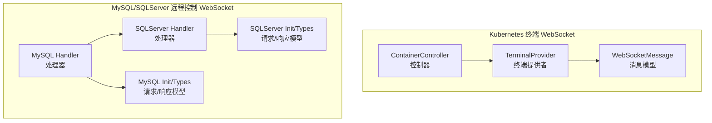
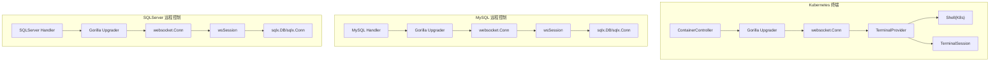
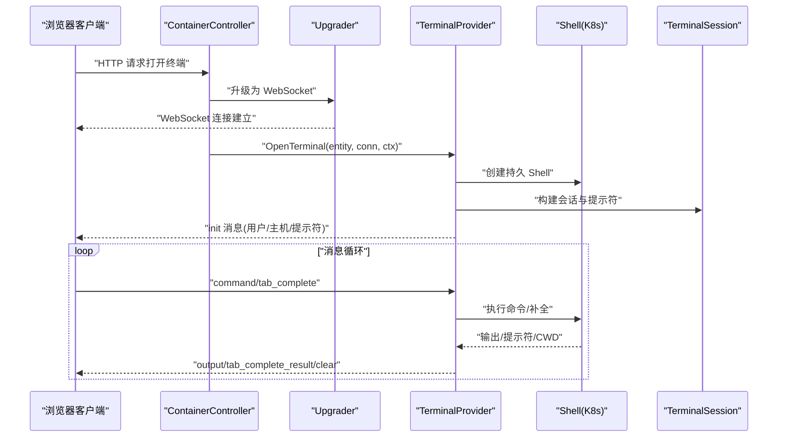
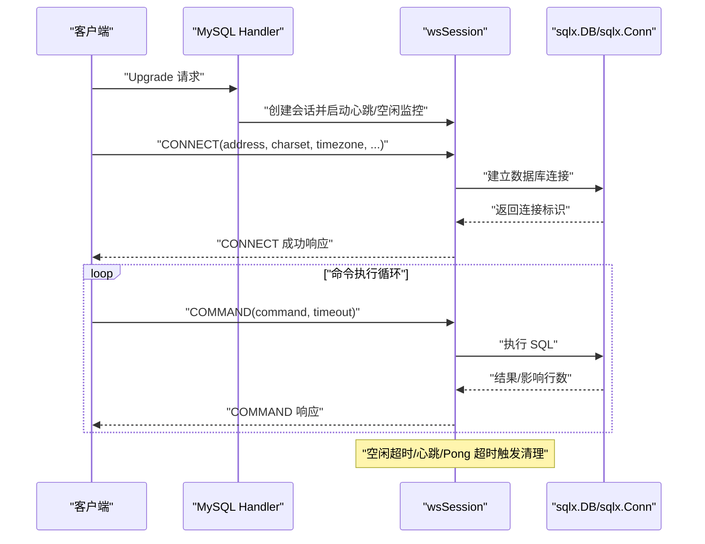
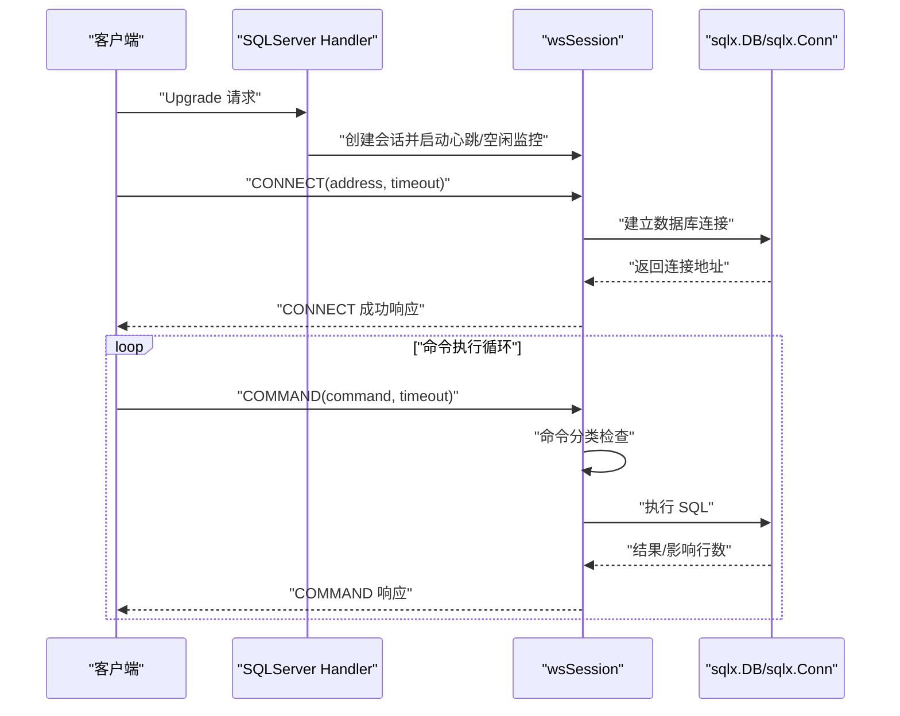
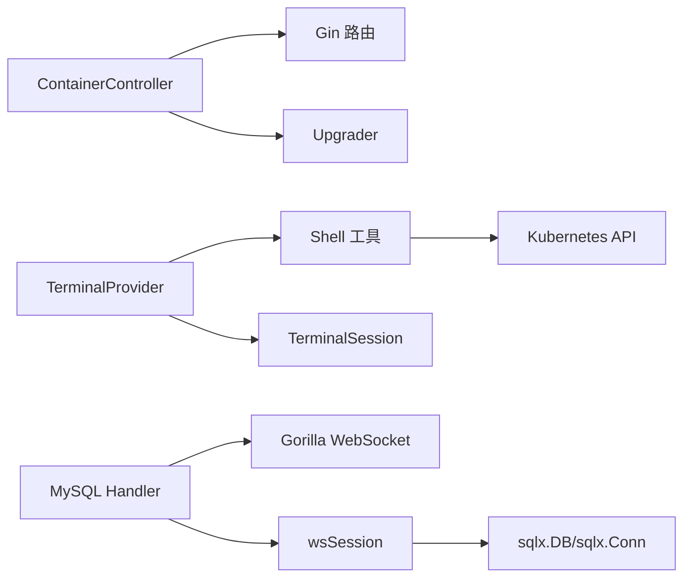

# WebSocket API

<cite>
**本文引用的文件**
- [message.go](file://dbm-services/k8s-dbs/terminal/entity/message.go)
- [container_controller.go](file://dbm-services/k8s-dbs/terminal/api/controller/container_controller.go)
- [k8s_provider.go](file://dbm-services/k8s-dbs/terminal/provider/k8s_provider.go)
- [handler.go](file://dbm-services/mysql/db-remote-service/pkg/v2/mysql/websocket/handler.go)
- [init.go](file://dbm-services/mysql/db-remote-service/pkg/v2/mysql/websocket/init.go)
- [command.go](file://dbm-services/mysql/db-remote-service/pkg/v2/mysql/websocket/command.go)
- [handler.go](file://dbm-services/mysql/db-remote-service/pkg/v2/sqlserver/websocket/handler.go)
- [init.go](file://dbm-services/mysql/db-remote-service/pkg/v2/sqlserver/websocket/init.go)
- [default.py](file://dbm-ui/config/default.py)
</cite>

## 目录
1. [简介](#简介)
2. [项目结构](#项目结构)
3. [核心组件](#核心组件)
4. [架构总览](#架构总览)
5. [详细组件分析](#详细组件分析)
6. [依赖关系分析](#依赖关系分析)
7. [性能考量](#性能考量)
8. [故障排查指南](#故障排查指南)
9. [结论](#结论)
10. [附录](#附录)

## 简介
本文件为 DBM 的 WebSocket API 详细文档，覆盖两类 WebSocket 服务：
- Kubernetes 终端交互 WebSocket：用于在浏览器中与 Pod 容器进行交互式终端会话，支持命令执行、Tab 补全、实时输出等。
- 数据库远程控制 WebSocket：面向 MySQL 与 SQLServer 的远程控制通道，支持连接建立、命令执行、心跳保活、空闲超时、并发节流与错误处理。

文档内容包括：
- 连接建立流程、握手协议与认证方式
- 消息格式、事件类型与消息结构
- 实时数据推送、状态更新与双向通信使用场景
- 连接管理、重连机制与异常处理策略
- 客户端连接示例与消息发送/接收的代码片段路径
- 消息序列化格式、压缩选项与性能优化建议

## 项目结构
DBM 的 WebSocket 功能由两部分组成：
- k8s-dbs 终端模块：提供容器交互式终端能力，基于 Gorilla WebSocket 库实现。
- mysql/db-remote-service：提供 MySQL 与 SQLServer 的远程控制 WebSocket，同样基于 Gorilla WebSocket。

图表来源
- [container_controller.go:44-98](file://dbm-services/k8s-dbs/terminal/api/controller/container_controller.go#L44-L98)
- [k8s_provider.go:38-90](file://dbm-services/k8s-dbs/terminal/provider/k8s_provider.go#L38-L90)
- [message.go:40-75](file://dbm-services/k8s-dbs/terminal/entity/message.go#L40-L75)
- [handler.go:264-340](file://dbm-services/mysql/db-remote-service/pkg/v2/mysql/websocket/handler.go#L264-L340)
- [handler.go:244-321](file://dbm-services/mysql/db-remote-service/pkg/v2/sqlserver/websocket/handler.go#L244-L321)
- [init.go:5-35](file://dbm-services/mysql/db-remote-service/pkg/v2/mysql/websocket/init.go#L5-L35)
- [init.go:5-31](file://dbm-services/mysql/db-remote-service/pkg/v2/sqlserver/websocket/init.go#L5-L31)

章节来源
- [container_controller.go:44-98](file://dbm-services/k8s-dbs/terminal/api/controller/container_controller.go#L44-L98)
- [k8s_provider.go:38-90](file://dbm-services/k8s-dbs/terminal/provider/k8s_provider.go#L38-L90)
- [handler.go:264-340](file://dbm-services/mysql/db-remote-service/pkg/v2/mysql/websocket/handler.go#L264-L340)
- [handler.go:244-321](file://dbm-services/mysql/db-remote-service/pkg/v2/sqlserver/websocket/handler.go#L244-L321)

## 核心组件
- 消息模型与事件类型（Kubernetes 终端）：定义消息类型、基础消息结构、初始化数据、命令数据、输出数据、Tab 补全数据等。
- 控制器与提供者（Kubernetes 终端）：控制器负责参数校验与 WebSocket 升级；提供者负责与 Kubernetes Shell 交互、消息循环与事件分发。
- MySQL/SQLServer 处理器：负责握手、会话生命周期管理、心跳、空闲超时、并发节流、请求分发与响应封装。
- 请求/响应模型：统一的请求基础结构、连接请求、命令请求与响应结构，包含结果、影响行数与错误字段。

章节来源
- [message.go:22-75](file://dbm-services/k8s-dbs/terminal/entity/message.go#L22-L75)
- [container_controller.go:44-98](file://dbm-services/k8s-dbs/terminal/api/controller/container_controller.go#L44-L98)
- [k8s_provider.go:92-141](file://dbm-services/k8s-dbs/terminal/provider/k8s_provider.go#L92-L141)
- [handler.go:42-118](file://dbm-services/mysql/db-remote-service/pkg/v2/mysql/websocket/handler.go#L42-L118)
- [init.go:5-35](file://dbm-services/mysql/db-remote-service/pkg/v2/mysql/websocket/init.go#L5-L35)
- [handler.go:33-115](file://dbm-services/mysql/db-remote-service/pkg/v2/sqlserver/websocket/handler.go#L33-L115)
- [init.go:5-31](file://dbm-services/mysql/db-remote-service/pkg/v2/sqlserver/websocket/init.go#L5-L31)

## 架构总览
下面的架构图展示了两类 WebSocket 的整体交互流程与组件关系。

图表来源
- [container_controller.go:36-42](file://dbm-services/k8s-dbs/terminal/api/controller/container_controller.go#L36-L42)
- [k8s_provider.go:44-90](file://dbm-services/k8s-dbs/terminal/provider/k8s_provider.go#L44-L90)
- [handler.go:264-340](file://dbm-services/mysql/db-remote-service/pkg/v2/mysql/websocket/handler.go#L264-L340)
- [handler.go:244-321](file://dbm-services/mysql/db-remote-service/pkg/v2/sqlserver/websocket/handler.go#L244-L321)

## 详细组件分析

### Kubernetes 终端 WebSocket
- 连接建立与握手
  - 使用 Gorilla WebSocket Upgrader，生产环境需限制来源（当前示例允许所有来源）。
  - 升级后不再能返回 HTTP JSON 错误，错误需通过 WebSocket 文本消息发送。
- 认证与鉴权
  - 控制器对请求参数进行基础校验；鉴权通常依赖上层网关或中间件（如 Session 或 JWT），具体以部署环境为准。
- 消息格式与事件类型
  - 基础消息结构包含类型、可选 ID、数据体。
  - 事件类型包括：初始化、命令执行、输出推送、Tab 补全请求与结果、清屏等。
- 实时数据推送与双向通信
  - 服务器向客户端推送命令输出与提示符；客户端向服务器发送命令与补全请求。
- 会话管理与错误处理
  - 提供者负责消息循环、命令执行、补全处理与错误反馈；空输入与 clear 命令有特殊处理。

图表来源
- [container_controller.go:50-90](file://dbm-services/k8s-dbs/terminal/api/controller/container_controller.go#L50-L90)
- [k8s_provider.go:44-141](file://dbm-services/k8s-dbs/terminal/provider/k8s_provider.go#L44-L141)
- [message.go:40-75](file://dbm-services/k8s-dbs/terminal/entity/message.go#L40-L75)

章节来源
- [container_controller.go:36-42](file://dbm-services/k8s-dbs/terminal/api/controller/container_controller.go#L36-L42)
- [container_controller.go:50-90](file://dbm-services/k8s-dbs/terminal/api/controller/container_controller.go#L50-L90)
- [k8s_provider.go:92-141](file://dbm-services/k8s-dbs/terminal/provider/k8s_provider.go#L92-L141)
- [message.go:22-75](file://dbm-services/k8s-dbs/terminal/entity/message.go#L22-L75)

### MySQL 远程控制 WebSocket
- 连接建立与握手
  - 使用 Gorilla WebSocket Upgrader，设置握手超时、读写缓冲大小。
  - 设置消息大小上限，防止恶意客户端导致内存压力。
- 认证与鉴权
  - 通过账户工厂函数注入用户与密码，分别对应管理员与 WebConsole 只读账号。
  - 鉴权通常结合后端会话或网关认证，具体以部署配置为准。
- 消息格式与事件类型
  - 统一请求结构：包含请求类型与请求体。
  - 支持 CONNECT 与 COMMAND 两类请求；响应包含结果、影响行数与错误字段。
- 会话生命周期与保活
  - 心跳：周期性发送 Ping，客户端需响应 Pong。
  - 空闲超时：超过阈值无活动自动关闭连接。
  - 并发节流：全局信号量限制 COMMAND 并发，避免过载。
- 错误处理与清理
  - 读取错误、不支持的消息类型均返回错误响应。
  - 会话结束时按顺序清理：通知后台 goroutine 退出 → 等待 → 关闭 socket → 归还连接。

图表来源
- [handler.go:264-340](file://dbm-services/mysql/db-remote-service/pkg/v2/mysql/websocket/handler.go#L264-L340)
- [handler.go:132-238](file://dbm-services/mysql/db-remote-service/pkg/v2/mysql/websocket/handler.go#L132-L238)
- [init.go:5-35](file://dbm-services/mysql/db-remote-service/pkg/v2/mysql/websocket/init.go#L5-L35)

章节来源
- [handler.go:26-40](file://dbm-services/mysql/db-remote-service/pkg/v2/mysql/websocket/handler.go#L26-L40)
- [handler.go:264-340](file://dbm-services/mysql/db-remote-service/pkg/v2/mysql/websocket/handler.go#L264-L340)
- [handler.go:132-238](file://dbm-services/mysql/db-remote-service/pkg/v2/mysql/websocket/handler.go#L132-L238)
- [init.go:5-35](file://dbm-services/mysql/db-remote-service/pkg/v2/mysql/websocket/init.go#L5-L35)

### SQLServer 远程控制 WebSocket
- 连接建立与握手
  - 与 MySQL 处理器类似，设置握手超时、读写缓冲与消息大小上限。
  - 区别在于不需要 charset/timezone 字段。
- 认证与鉴权
  - 提供管理员、业务只读、系统库只读三类处理器，分别注入不同账户与命令分类器。
- 命令分类与安全
  - 引入命令分类器，仅允许白名单命令，增强安全性。
- 会话生命周期与保活
  - 心跳、空闲超时、并发节流与清理流程与 MySQL 处理器一致。

图表来源
- [handler.go:244-321](file://dbm-services/mysql/db-remote-service/pkg/v2/sqlserver/websocket/handler.go#L244-L321)
- [handler.go:117-211](file://dbm-services/mysql/db-remote-service/pkg/v2/sqlserver/websocket/handler.go#L117-L211)
- [init.go:5-31](file://dbm-services/mysql/db-remote-service/pkg/v2/sqlserver/websocket/init.go#L5-L31)

章节来源
- [handler.go:23-31](file://dbm-services/mysql/db-remote-service/pkg/v2/sqlserver/websocket/handler.go#L23-L31)
- [handler.go:244-321](file://dbm-services/mysql/db-remote-service/pkg/v2/sqlserver/websocket/handler.go#L244-L321)
- [handler.go:117-211](file://dbm-services/mysql/db-remote-service/pkg/v2/sqlserver/websocket/handler.go#L117-L211)
- [init.go:5-31](file://dbm-services/mysql/db-remote-service/pkg/v2/sqlserver/websocket/init.go#L5-L31)

## 依赖关系分析
- 组件耦合
  - Kubernetes 终端：控制器与提供者职责清晰分离；提供者依赖 Shell 与会话工具。
  - MySQL/SQLServer：处理器与会话结构紧密耦合，会话内含连接、用户凭据与后台任务。
- 外部依赖
  - Gorilla WebSocket：用于升级与消息收发。
  - Gin：用于 HTTP 路由与上下文。
  - sqlx：用于数据库连接与查询。
- 潜在循环依赖
  - 未发现直接循环依赖；各模块边界清晰。

图表来源
- [container_controller.go:32-34](file://dbm-services/k8s-dbs/terminal/api/controller/container_controller.go#L32-L34)
- [k8s_provider.go:22-36](file://dbm-services/k8s-dbs/terminal/provider/k8s_provider.go#L22-L36)
- [handler.go:19-22](file://dbm-services/mysql/db-remote-service/pkg/v2/mysql/websocket/handler.go#L19-L22)
- [handler.go:42-54](file://dbm-services/mysql/db-remote-service/pkg/v2/mysql/websocket/handler.go#L42-L54)

章节来源
- [container_controller.go:32-34](file://dbm-services/k8s-dbs/terminal/api/controller/container_controller.go#L32-L34)
- [k8s_provider.go:22-36](file://dbm-services/k8s-dbs/terminal/provider/k8s_provider.go#L22-L36)
- [handler.go:19-22](file://dbm-services/mysql/db-remote-service/pkg/v2/mysql/websocket/handler.go#L19-L22)
- [handler.go:42-54](file://dbm-services/mysql/db-remote-service/pkg/v2/mysql/websocket/handler.go#L42-L54)

## 性能考量
- 消息大小限制
  - 设置最大消息大小，防止恶意或异常客户端导致内存压力。
- 心跳与空闲超时
  - 定期心跳维持连接活性；空闲超时主动回收资源，避免僵尸连接。
- 并发节流
  - 全局信号量限制 COMMAND 并发，避免服务器过载；超时返回节流错误。
- 读写缓冲与超时
  - 合理设置读写缓冲与读取超时，平衡吞吐与延迟。
- 序列化与压缩
  - 默认采用 JSON 文本消息；未见内置压缩选项。建议客户端侧对大结果集进行分页或增量传输以降低带宽压力。

章节来源
- [handler.go:24-40](file://dbm-services/mysql/db-remote-service/pkg/v2/mysql/websocket/handler.go#L24-L40)
- [handler.go:78-118](file://dbm-services/mysql/db-remote-service/pkg/v2/mysql/websocket/handler.go#L78-L118)
- [handler.go:173-204](file://dbm-services/mysql/db-remote-service/pkg/v2/mysql/websocket/handler.go#L173-L204)
- [handler.go:23-31](file://dbm-services/mysql/db-remote-service/pkg/v2/sqlserver/websocket/handler.go#L23-L31)
- [handler.go:66-115](file://dbm-services/mysql/db-remote-service/pkg/v2/sqlserver/websocket/handler.go#L66-L115)
- [handler.go:149-179](file://dbm-services/mysql/db-remote-service/pkg/v2/sqlserver/websocket/handler.go#L149-L179)

## 故障排查指南
- 连接升级失败
  - 检查握手超时与来源限制；确认网络可达与代理配置正确。
- 读取消息失败
  - 查看日志中的读取错误；确认消息格式与大小限制。
- 心跳/空闲超时
  - 客户端需及时响应 Pong；避免长时间无活动导致连接被关闭。
- 并发节流
  - 若出现“服务器过载，请重试”类错误，降低并发或等待资源释放。
- 错误响应
  - 服务器会通过文本消息返回错误详情；客户端应解析并展示给用户。

章节来源
- [container_controller.go:66-71](file://dbm-services/k8s-dbs/terminal/api/controller/container_controller.go#L66-L71)
- [k8s_provider.go:98-104](file://dbm-services/k8s-dbs/terminal/provider/k8s_provider.go#L98-L104)
- [handler.go:306-337](file://dbm-services/mysql/db-remote-service/pkg/v2/mysql/websocket/handler.go#L306-L337)
- [handler.go:287-318](file://dbm-services/mysql/db-remote-service/pkg/v2/sqlserver/websocket/handler.go#L287-L318)

## 结论
DBM 的 WebSocket API 分别覆盖了容器交互与数据库远程控制两大场景。Kubernetes 终端 WebSocket 提供了直观的交互式终端体验；MySQL/SQLServer 远程控制 WebSocket 则提供了安全、可控且具备保活与节流机制的数据库操作通道。通过明确的消息格式、严格的会话管理与完善的错误处理，两类 WebSocket 均具备良好的稳定性与可维护性。

## 附录

### 连接建立与握手协议
- Kubernetes 终端
  - 使用 Gorilla Upgrader，默认允许跨域（生产需限制来源）。
  - 升级后不再返回 HTTP JSON，错误通过 WebSocket 文本消息反馈。
- MySQL/SQLServer
  - 使用 Gorilla Upgrader，设置握手超时、读写缓冲与消息大小上限。
  - 读取超时与 Pong 响应机制确保连接健康。

章节来源
- [container_controller.go:36-42](file://dbm-services/k8s-dbs/terminal/api/controller/container_controller.go#L36-L42)
- [container_controller.go:66-71](file://dbm-services/k8s-dbs/terminal/api/controller/container_controller.go#L66-L71)
- [handler.go:264-284](file://dbm-services/mysql/db-remote-service/pkg/v2/mysql/websocket/handler.go#L264-L284)
- [handler.go:244-264](file://dbm-services/mysql/db-remote-service/pkg/v2/sqlserver/websocket/handler.go#L244-L264)

### 认证方式
- Kubernetes 终端
  - 依赖上层网关或中间件（如 Session/JWT）进行认证；控制器对必要参数进行校验。
- MySQL/SQLServer
  - 通过账户工厂函数注入用户与密码；提供管理员与只读两类账号；SQLServer 增加命令分类器以限制命令范围。

章节来源
- [default.py:198-202](file://dbm-ui/config/default.py#L198-L202)
- [handler.go:254-262](file://dbm-services/mysql/db-remote-service/pkg/v2/mysql/websocket/handler.go#L254-L262)
- [handler.go:220-242](file://dbm-services/mysql/db-remote-service/pkg/v2/sqlserver/websocket/handler.go#L220-L242)

### 消息格式与事件类型
- Kubernetes 终端
  - 基础消息结构：类型、可选 ID、数据体。
  - 事件类型：init、command、output、tab_complete、tab_complete_result、clear。
- MySQL/SQLServer
  - 基础请求结构：请求类型 + 请求体。
  - 响应结构：结果、影响行数、错误字段。

章节来源
- [message.go:22-75](file://dbm-services/k8s-dbs/terminal/entity/message.go#L22-L75)
- [init.go:5-35](file://dbm-services/mysql/db-remote-service/pkg/v2/mysql/websocket/init.go#L5-L35)
- [init.go:5-31](file://dbm-services/mysql/db-remote-service/pkg/v2/sqlserver/websocket/init.go#L5-L31)

### 实时数据推送与双向通信
- Kubernetes 终端
  - 服务器推送命令输出与提示符；客户端推送命令与补全请求。
- MySQL/SQLServer
  - 服务器推送命令执行结果；客户端发送 CONNECT/COMMAND 请求。

章节来源
- [k8s_provider.go:161-231](file://dbm-services/k8s-dbs/terminal/provider/k8s_provider.go#L161-L231)
- [handler.go:206-238](file://dbm-services/mysql/db-remote-service/pkg/v2/mysql/websocket/handler.go#L206-L238)
- [handler.go:181-211](file://dbm-services/mysql/db-remote-service/pkg/v2/sqlserver/websocket/handler.go#L181-L211)

### 连接管理、重连机制与异常处理
- 心跳与空闲超时
  - 定时发送 Ping，客户端需响应 Pong；空闲超时关闭连接。
- 并发节流
  - 全局信号量限制 COMMAND 并发；超时返回节流错误。
- 异常处理
  - 读取错误、不支持的消息类型、命令执行错误均通过错误响应返回。
- 清理顺序
  - 通知后台 goroutine 退出 → 等待 → 关闭 socket → 归还连接。

章节来源
- [handler.go:78-130](file://dbm-services/mysql/db-remote-service/pkg/v2/mysql/websocket/handler.go#L78-L130)
- [handler.go:173-204](file://dbm-services/mysql/db-remote-service/pkg/v2/mysql/websocket/handler.go#L173-L204)
- [handler.go:240-252](file://dbm-services/mysql/db-remote-service/pkg/v2/mysql/websocket/handler.go#L240-L252)
- [handler.go:66-115](file://dbm-services/mysql/db-remote-service/pkg/v2/sqlserver/websocket/handler.go#L66-L115)
- [handler.go:149-179](file://dbm-services/mysql/db-remote-service/pkg/v2/sqlserver/websocket/handler.go#L149-L179)
- [handler.go:213-218](file://dbm-services/mysql/db-remote-service/pkg/v2/sqlserver/websocket/handler.go#L213-L218)

### 客户端连接示例与消息发送/接收代码片段路径
- Kubernetes 终端
  - 连接建立与消息循环参考：[container_controller.go:50-90](file://dbm-services/k8s-dbs/terminal/api/controller/container_controller.go#L50-L90)、[k8s_provider.go:92-141](file://dbm-services/k8s-dbs/terminal/provider/k8s_provider.go#L92-L141)
  - 消息结构定义参考：[message.go:40-75](file://dbm-services/k8s-dbs/terminal/entity/message.go#L40-L75)
- MySQL 远程控制
  - 连接建立与会话管理参考：[handler.go:264-340](file://dbm-services/mysql/db-remote-service/pkg/v2/mysql/websocket/handler.go#L264-L340)
  - 请求/响应模型参考：[init.go:5-35](file://dbm-services/mysql/db-remote-service/pkg/v2/mysql/websocket/init.go#L5-L35)
  - 命令执行参考：[command.go:11-27](file://dbm-services/mysql/db-remote-service/pkg/v2/mysql/websocket/command.go#L11-L27)
- SQLServer 远程控制
  - 连接建立与会话管理参考：[handler.go:244-321](file://dbm-services/mysql/db-remote-service/pkg/v2/sqlserver/websocket/handler.go#L244-L321)
  - 请求/响应模型参考：[init.go:5-31](file://dbm-services/mysql/db-remote-service/pkg/v2/sqlserver/websocket/init.go#L5-L31)

### 消息序列化格式、压缩选项与性能优化建议
- 序列化格式
  - 文本 JSON；未见内置压缩选项。
- 压缩选项
  - 未发现压缩实现；建议客户端侧对大结果集进行分页或增量传输。
- 性能优化建议
  - 合理设置消息大小上限、读写缓冲与读取超时。
  - 使用心跳与空闲超时减少资源占用。
  - 通过全局信号量限制 COMMAND 并发，避免过载。

章节来源
- [handler.go:24-40](file://dbm-services/mysql/db-remote-service/pkg/v2/mysql/websocket/handler.go#L24-L40)
- [handler.go:78-118](file://dbm-services/mysql/db-remote-service/pkg/v2/mysql/websocket/handler.go#L78-L118)
- [handler.go:173-204](file://dbm-services/mysql/db-remote-service/pkg/v2/mysql/websocket/handler.go#L173-L204)
- [handler.go:23-31](file://dbm-services/mysql/db-remote-service/pkg/v2/sqlserver/websocket/handler.go#L23-L31)
- [handler.go:66-115](file://dbm-services/mysql/db-remote-service/pkg/v2/sqlserver/websocket/handler.go#L66-L115)
- [handler.go:149-179](file://dbm-services/mysql/db-remote-service/pkg/v2/sqlserver/websocket/handler.go#L149-L179)