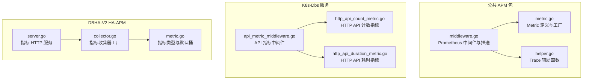
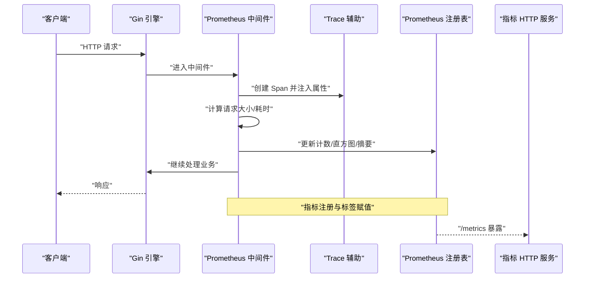
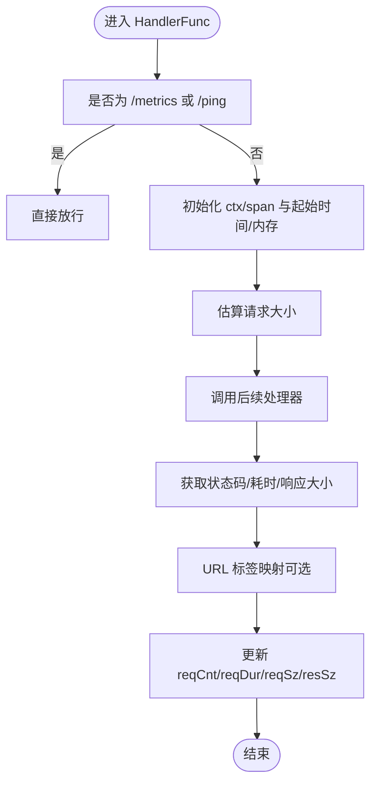
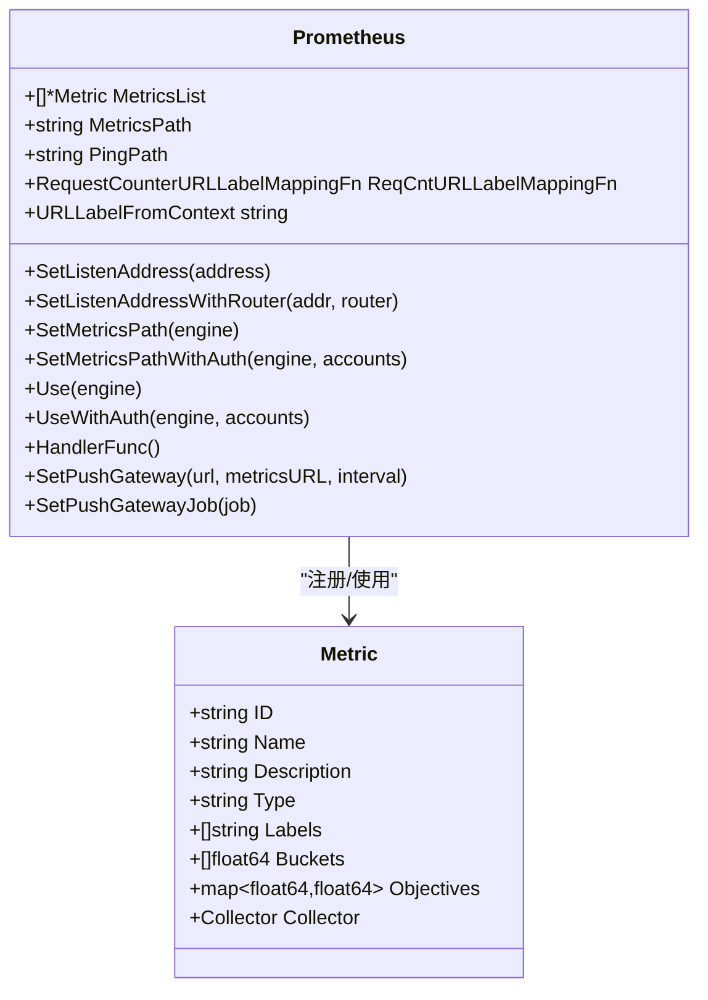
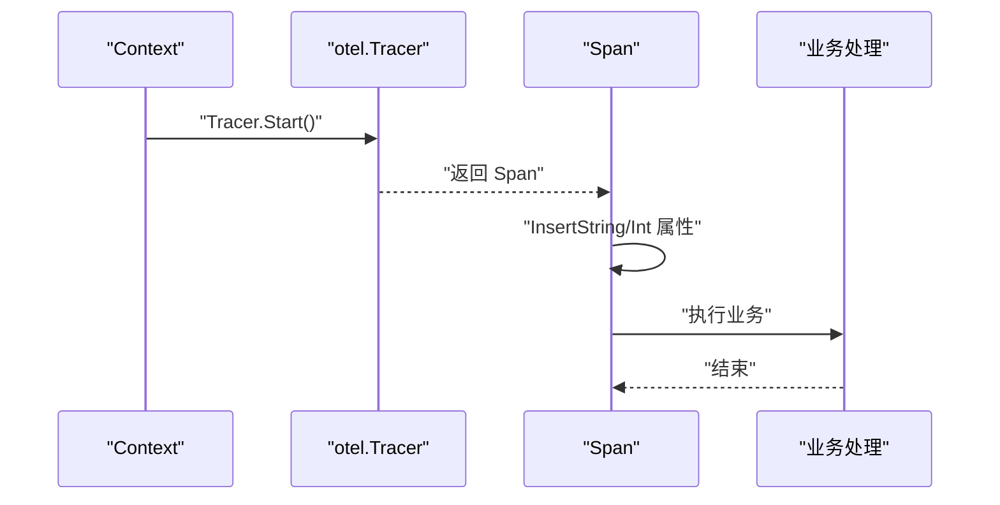
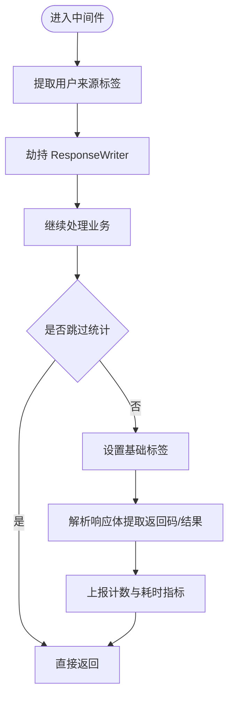
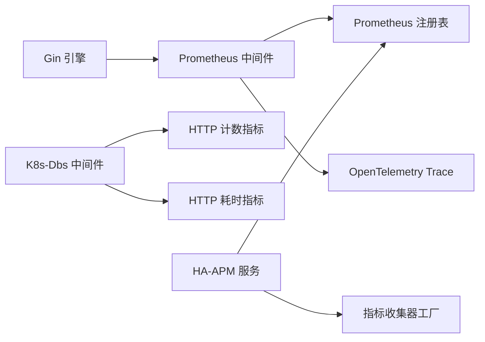

# APM监控接口

<cite>
**本文引用的文件**
- [metric.go](file://dbm-services/common/go-pubpkg/apm/metric/metric.go)
- [middleware.go](file://dbm-services/common/go-pubpkg/apm/metric/middleware.go)
- [helper.go](file://dbm-services/common/go-pubpkg/apm/trace/helper.go)
- [http_api_duration_metric.go](file://dbm-services/k8s-dbs/metric/http_api_duration_metric.go)
- [http_api_count_metric.go](file://dbm-services/k8s-dbs/metric/http_api_count_metric.go)
- [api_metric_middleware.go](file://dbm-services/k8s-dbs/middleware/api_metric_middleware.go)
- [metric.go](file://dbm-services/common/dbha-v2/pkg/haapm/metric.go)
- [collector.go](file://dbm-services/common/dbha-v2/pkg/haapm/collector.go)
- [server.go](file://dbm-services/common/dbha-v2/pkg/haapm/server.go)
</cite>

## 目录
1. [简介](#简介)
2. [项目结构](#项目结构)
3. [核心组件](#核心组件)
4. [架构总览](#架构总览)
5. [详细组件分析](#详细组件分析)
6. [依赖关系分析](#依赖关系分析)
7. [性能考虑](#性能考虑)
8. [故障排查指南](#故障排查指南)
9. [结论](#结论)
10. [附录](#附录)

## 简介
本文件为 DBM 的 APM 监控系统 API 文档，覆盖以下主题：
- Prometheus 指标收集接口与标准指标定义
- HTTP 请求监控、响应时间统计与自定义指标扩展
- Metric 结构体使用、标签系统配置与直方图桶设置
- Trace 链路追踪实现、Span 上下文传递与分布式追踪最佳实践
- 指标采集频率、存储策略与告警规则配置建议
- 性能优化建议与常见监控问题排查

## 项目结构
APM 相关代码主要分布在三个模块：
- 公共 APM 包：提供通用的 Prometheus 中间件、Metric 定义与 Trace 辅助工具
- K8s-Dbs 服务：提供 HTTP API 的通用指标（计数与耗时）与中间件
- DBHA-V2 HA-APM：独立的 Prometheus 指标服务器与指标类型封装



**图表来源**
- [metric.go:92-103](file://dbm-services/common/go-pubpkg/apm/metric/metric.go#L92-L103)
- [middleware.go:32-49](file://dbm-services/common/go-pubpkg/apm/metric/middleware.go#L32-L49)
- [helper.go:21-75](file://dbm-services/common/go-pubpkg/apm/trace/helper.go#L21-L75)
- [http_api_count_metric.go:27-47](file://dbm-services/k8s-dbs/metric/http_api_count_metric.go#L27-L47)
- [http_api_duration_metric.go:27-48](file://dbm-services/k8s-dbs/metric/http_api_duration_metric.go#L27-L48)
- [api_metric_middleware.go:41-86](file://dbm-services/k8s-dbs/middleware/api_metric_middleware.go#L41-L86)
- [metric.go:31-88](file://dbm-services/common/dbha-v2/pkg/haapm/metric.go#L31-L88)
- [collector.go:31-107](file://dbm-services/common/dbha-v2/pkg/haapm/collector.go#L31-L107)
- [server.go:46-80](file://dbm-services/common/dbha-v2/pkg/haapm/server.go#L46-L80)

**章节来源**
- [metric.go:11-225](file://dbm-services/common/go-pubpkg/apm/metric/metric.go#L11-L225)
- [middleware.go:32-315](file://dbm-services/common/go-pubpkg/apm/metric/middleware.go#L32-L315)
- [helper.go:11-76](file://dbm-services/common/go-pubpkg/apm/trace/helper.go#L11-L76)
- [http_api_count_metric.go:19-48](file://dbm-services/k8s-dbs/metric/http_api_count_metric.go#L19-L48)
- [http_api_duration_metric.go:19-49](file://dbm-services/k8s-dbs/metric/http_api_duration_metric.go#L19-L49)
- [api_metric_middleware.go:19-187](file://dbm-services/k8s-dbs/middleware/api_metric_middleware.go#L19-L187)
- [metric.go:25-89](file://dbm-services/common/dbha-v2/pkg/haapm/metric.go#L25-L89)
- [collector.go:25-108](file://dbm-services/common/dbha-v2/pkg/haapm/collector.go#L25-L108)
- [server.go:25-200](file://dbm-services/common/dbha-v2/pkg/haapm/server.go#L25-L200)

## 核心组件
- Prometheus 中间件与标准指标
  - 提供 /metrics 与 /ping 接口，默认直方图桶、计数与摘要指标
  - 支持独立监听地址、BasicAuth、PushGateway 推送
- 自定义指标定义与注册
  - Metric 结构体描述指标名称、帮助信息、类型、标签与桶
  - NewMetric 根据类型创建对应 Collectors 并注册到 Prometheus
- Trace 集成
  - 在 Gin 中间件中创建 Span，注入内存使用等上下文属性
  - 提供向 Span 注入键值对的辅助函数
- K8s-Dbs 服务指标
  - 统一的 HTTP API 计数与耗时指标，支持用户来源与结果标签
  - 中间件自动过滤健康检查等无需统计的接口
- HA-APM 指标服务
  - 独立的 /metrics 与 /health HTTP 服务，支持注册自定义指标类型

**章节来源**
- [middleware.go:32-129](file://dbm-services/common/go-pubpkg/apm/metric/middleware.go#L32-L129)
- [metric.go:92-182](file://dbm-services/common/go-pubpkg/apm/metric/metric.go#L92-L182)
- [helper.go:21-75](file://dbm-services/common/go-pubpkg/apm/trace/helper.go#L21-L75)
- [http_api_count_metric.go:27-47](file://dbm-services/k8s-dbs/metric/http_api_count_metric.go#L27-L47)
- [http_api_duration_metric.go:27-48](file://dbm-services/k8s-dbs/metric/http_api_duration_metric.go#L27-L48)
- [api_metric_middleware.go:41-112](file://dbm-services/k8s-dbs/middleware/api_metric_middleware.go#L41-L112)
- [server.go:46-80](file://dbm-services/common/dbha-v2/pkg/haapm/server.go#L46-L80)

## 架构总览
APM 监控由“中间件采集 + 指标注册 + HTTP 暴露/推送”三层组成。请求在进入业务处理前通过中间件采集请求耗时、大小与状态，同时创建/继承 Trace Span；业务完成后根据配置将指标暴露或推送到 PushGateway。



**图表来源**
- [middleware.go:260-314](file://dbm-services/common/go-pubpkg/apm/metric/middleware.go#L260-L314)
- [helper.go:61-75](file://dbm-services/common/go-pubpkg/apm/trace/helper.go#L61-L75)
- [metric.go:105-182](file://dbm-services/common/go-pubpkg/apm/metric/metric.go#L105-L182)
- [server.go:144-180](file://dbm-services/common/dbha-v2/pkg/haapm/server.go#L144-L180)

## 详细组件分析

### Prometheus 中间件与标准指标
- 标准指标
  - 请求总量（按状态码、方法、处理器、主机、URL 分组）
  - 请求耗时直方图（按状态码、方法、URL 分组）
  - 请求/响应大小摘要
- 关键能力
  - 可配置独立监听地址与路由分离，避免 /metrics 进入业务访问日志
  - 支持 BasicAuth 访问 /metrics
  - 支持 PushGateway 推送，定时从本地 /metrics 拉取并 POST 到 PushGateway
  - URL 标签映射函数用于控制计数器 URL 标签基数
  - 请求大小估算与内存使用属性注入到 Span



**图表来源**
- [middleware.go:260-314](file://dbm-services/common/go-pubpkg/apm/metric/middleware.go#L260-L314)
- [middleware.go:223-245](file://dbm-services/common/go-pubpkg/apm/metric/middleware.go#L223-L245)

**章节来源**
- [middleware.go:32-151](file://dbm-services/common/go-pubpkg/apm/metric/middleware.go#L32-L151)
- [middleware.go:193-213](file://dbm-services/common/go-pubpkg/apm/metric/middleware.go#L193-L213)
- [middleware.go:247-314](file://dbm-services/common/go-pubpkg/apm/metric/middleware.go#L247-L314)
- [metric.go:25-66](file://dbm-services/common/go-pubpkg/apm/metric/metric.go#L25-L66)

### Metric 结构体与注册工厂
- Metric 字段
  - ID、Name、Description、Type、Labels、Buckets、Objectives
- NewMetric 工厂
  - 根据 Type 创建 Counter/Gauge/Histogram/Summary 及其 Vec 版本
  - 将 Collector 注册到全局注册表并缓存到 Metrics 映射
- 使用建议
  - 优先使用 Vec 类型以支持多维标签
  - 直方图桶需结合业务时延分布选择，避免过多基数



**图表来源**
- [metric.go:92-103](file://dbm-services/common/go-pubpkg/apm/metric/metric.go#L92-L103)
- [metric.go:105-182](file://dbm-services/common/go-pubpkg/apm/metric/metric.go#L105-L182)
- [middleware.go:32-49](file://dbm-services/common/go-pubpkg/apm/metric/middleware.go#L32-L49)
- [middleware.go:69-96](file://dbm-services/common/go-pubpkg/apm/metric/middleware.go#L69-L96)

**章节来源**
- [metric.go:92-182](file://dbm-services/common/go-pubpkg/apm/metric/metric.go#L92-L182)
- [middleware.go:69-129](file://dbm-services/common/go-pubpkg/apm/metric/middleware.go#L69-L129)

### 标签系统与直方图桶配置
- 标签设计
  - 标签用于区分指标维度，如 code/method/url/host/handler 等
  - URL 标签可通过映射函数降低基数（如将路径参数替换为模板）
  - K8s-Dbs 服务提供用户来源与结果标签，便于审计与告警
- 直方图桶
  - 默认桶与业务自定义桶并存
  - 建议结合 P50/P95/P99 时延分布选择桶边界，避免过细导致内存与查询压力过大

**章节来源**
- [middleware.go:77-89](file://dbm-services/common/go-pubpkg/apm/metric/middleware.go#L77-L89)
- [http_api_duration_metric.go:30-48](file://dbm-services/k8s-dbs/metric/http_api_duration_metric.go#L30-L48)

### Trace 链路追踪与 Span 上下文传递
- 中间件集成
  - 在请求进入时创建 Span，注入 URL 与内存使用等属性
  - 通过 IntoContext 获取带 Trace 的 Context，后续可继续派生子 Span
- 辅助函数
  - InsertInt/String/StringSlice/IntSlice 将键值对写入 Span
- 最佳实践
  - 仅对关键路径启用 Trace，避免高并发下的开销放大
  - 控制 Span 属性数量，避免超长事件串



**图表来源**
- [middleware.go:276-287](file://dbm-services/common/go-pubpkg/apm/metric/middleware.go#L276-L287)
- [helper.go:61-75](file://dbm-services/common/go-pubpkg/apm/trace/helper.go#L61-L75)

**章节来源**
- [middleware.go:276-287](file://dbm-services/common/go-pubpkg/apm/metric/middleware.go#L276-L287)
- [helper.go:21-75](file://dbm-services/common/go-pubpkg/apm/trace/helper.go#L21-L75)

### K8s-Dbs 服务指标与中间件
- 指标
  - HTTPAPITotalCounter：按 API 名称、方法、状态、用户来源、返回码与结果计数
  - HTTPAPIDurationHistogram：按相同维度统计耗时（毫秒）
- 中间件流程
  - 提取用户来源标签（GET 使用 Query，其他方法解析 Body）
  - 劫持 ResponseWriter 解析响应体以提取返回码与结果
  - 过滤健康检查等无需统计的接口
  - 上报通用与集群/Addon 相关指标



**图表来源**
- [api_metric_middleware.go:41-86](file://dbm-services/k8s-dbs/middleware/api_metric_middleware.go#L41-L86)
- [api_metric_middleware.go:114-148](file://dbm-services/k8s-dbs/middleware/api_metric_middleware.go#L114-L148)

**章节来源**
- [http_api_count_metric.go:27-47](file://dbm-services/k8s-dbs/metric/http_api_count_metric.go#L27-L47)
- [http_api_duration_metric.go:27-48](file://dbm-services/k8s-dbs/metric/http_api_duration_metric.go#L27-L48)
- [api_metric_middleware.go:41-187](file://dbm-services/k8s-dbs/middleware/api_metric_middleware.go#L41-L187)

### HA-APM 指标服务
- 服务配置
  - 监听地址、子系统名、读写超时、指标路径与健康检查路径
- 指标注册
  - 支持注册 MetricGetter 或 *Metric，内部转换为具体 Collectors 并注册
- HTTP 服务
  - /metrics 暴露指标，/health 返回健康状态
  - 支持优雅关闭

```mermaid
classDiagram
class Server {
+ServerConfig config
+[]*Metric metrics
+Start() error
+Stop() error
+Register(...interface{}) *Server
+RegisterMetrics([]*Metric) *Server
}
class Metric {
+string Name
+string Description
+string Type
+[]string Labels
+[]float64 Buckets
+Collector Collector
}
Server --> Metric : "注册/绑定"
```

**图表来源**
- [server.go:46-126](file://dbm-services/common/dbha-v2/pkg/haapm/server.go#L46-L126)
- [metric.go:31-47](file://dbm-services/common/dbha-v2/pkg/haapm/metric.go#L31-L47)

**章节来源**
- [server.go:46-200](file://dbm-services/common/dbha-v2/pkg/haapm/server.go#L46-L200)
- [collector.go:31-107](file://dbm-services/common/dbha-v2/pkg/haapm/collector.go#L31-L107)
- [metric.go:31-88](file://dbm-services/common/dbha-v2/pkg/haapm/metric.go#L31-L88)

## 依赖关系分析
- 组件耦合
  - 中间件依赖 Metric 定义与 Prometheus 注册表
  - K8s-Dbs 中间件依赖统一指标对象与响应体解析
  - HA-APM 服务独立于业务引擎，仅依赖 Prometheus 注册表
- 外部依赖
  - Gin、Prometheus 客户端、OpenTelemetry Trace



**图表来源**
- [middleware.go:247-257](file://dbm-services/common/go-pubpkg/apm/metric/middleware.go#L247-L257)
- [api_metric_middleware.go:41-86](file://dbm-services/k8s-dbs/middleware/api_metric_middleware.go#L41-L86)
- [server.go:144-180](file://dbm-services/common/dbha-v2/pkg/haapm/server.go#L144-L180)
- [collector.go:31-107](file://dbm-services/common/dbha-v2/pkg/haapm/collector.go#L31-L107)

**章节来源**
- [middleware.go:247-257](file://dbm-services/common/go-pubpkg/apm/metric/middleware.go#L247-L257)
- [api_metric_middleware.go:41-86](file://dbm-services/k8s-dbs/middleware/api_metric_middleware.go#L41-L86)
- [server.go:144-180](file://dbm-services/common/dbha-v2/pkg/haapm/server.go#L144-L180)

## 性能考虑
- 指标基数控制
  - 使用 URL 标签映射函数降低路径参数带来的基数膨胀
  - 合理选择标签维度，避免动态值（如实例 ID、会话 ID）作为标签
- 直方图桶优化
  - 结合业务时延分布选择桶，避免过细导致内存与查询压力
  - 对高频短尾场景可采用更粗的桶
- 中间件开销
  - 仅在必要路径启用 Trace，减少属性数量
  - 避免在高频接口中进行昂贵的序列化/IO 操作
- PushGateway 使用
  - 合理设置推送间隔，避免频繁网络往返
  - 优先使用本地 /metrics 暴露，再由外部拉取或推送

## 故障排查指南
- /metrics 无法访问
  - 检查是否设置了独立监听地址与路由分离
  - 若启用 BasicAuth，确认账号密码正确
- 指标未更新
  - 确认已调用 Use/UseWithAuth 注册中间件
  - 检查自定义指标是否成功注册（查看日志）
- PushGateway 推送失败
  - 检查 PushGateway 地址、Job 与实例标识
  - 查看网络连通性与防火墙策略
- Trace 无数据
  - 确认已正确创建 Span 并注入属性
  - 检查 OpenTelemetry 配置与导出器

**章节来源**
- [middleware.go:112-151](file://dbm-services/common/go-pubpkg/apm/metric/middleware.go#L112-L151)
- [middleware.go:184-191](file://dbm-services/common/go-pubpkg/apm/metric/middleware.go#L184-L191)
- [middleware.go:168-182](file://dbm-services/common/go-pubpkg/apm/metric/middleware.go#L168-L182)

## 结论
DBM 的 APM 监控体系通过统一的中间件与指标定义，实现了对 HTTP 请求的全面观测与 Trace 集成。结合合理的标签设计与直方图桶配置，可在保证可观测性的同时控制资源开销。建议在生产环境中：
- 明确指标维度与标签策略，定期审查基数
- 依据业务时延分布优化直方图桶
- 合理使用 PushGateway 与独立监听，确保稳定性
- 在关键路径启用 Trace，避免过度采样

## 附录
- 指标采集频率与存储策略
  - 采集频率取决于 Prometheus 抓取周期（通常 15s-60s）
  - 存储策略由 Prometheus 配置决定（保留期、压缩等）
- 告警规则配置建议
  - 基于请求总量与错误率设置告警
  - 基于 P95/P99 耗时设置阈值告警
  - 结合 Trace 链路时延定位慢调用根因