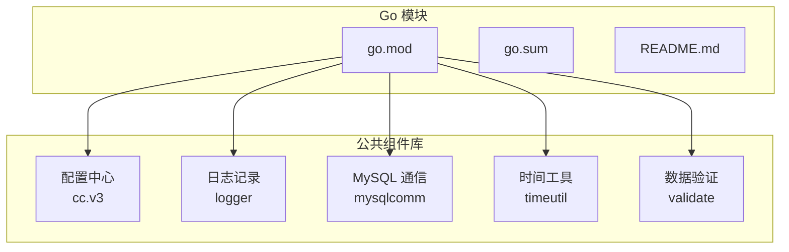
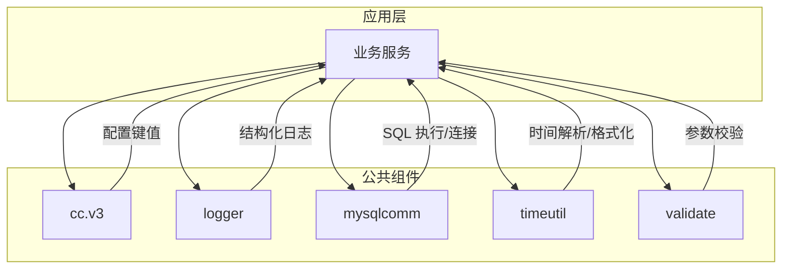
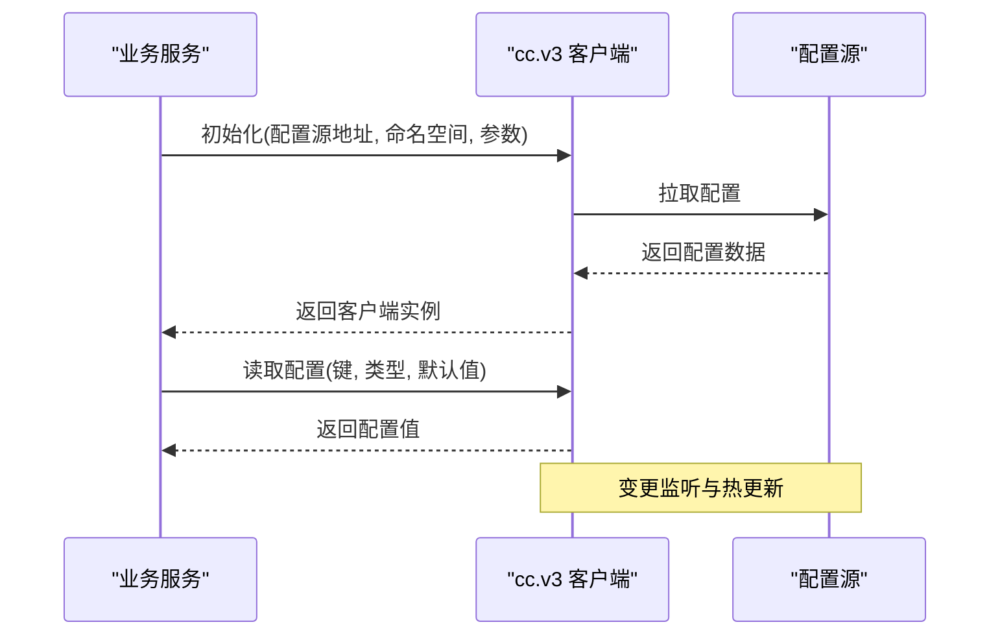
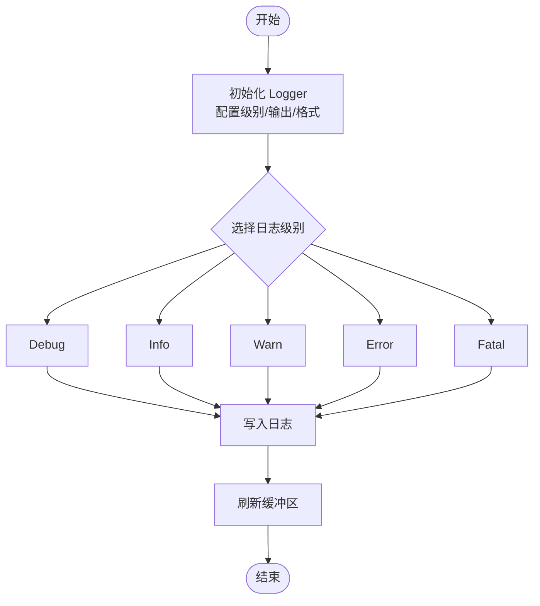
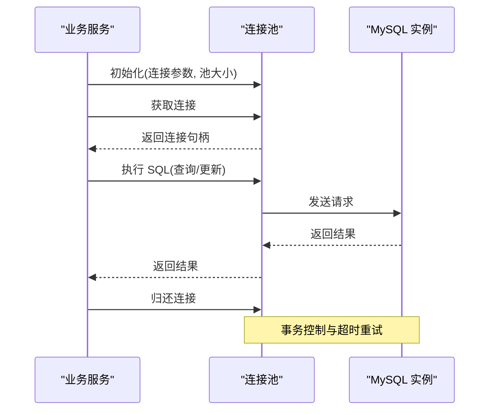
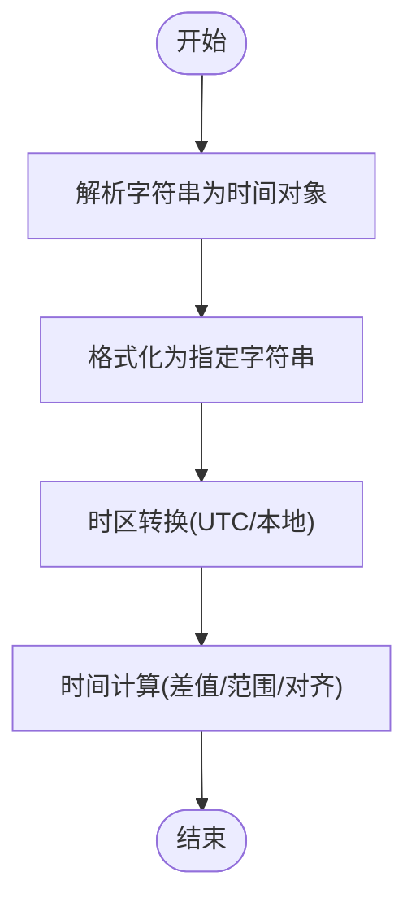
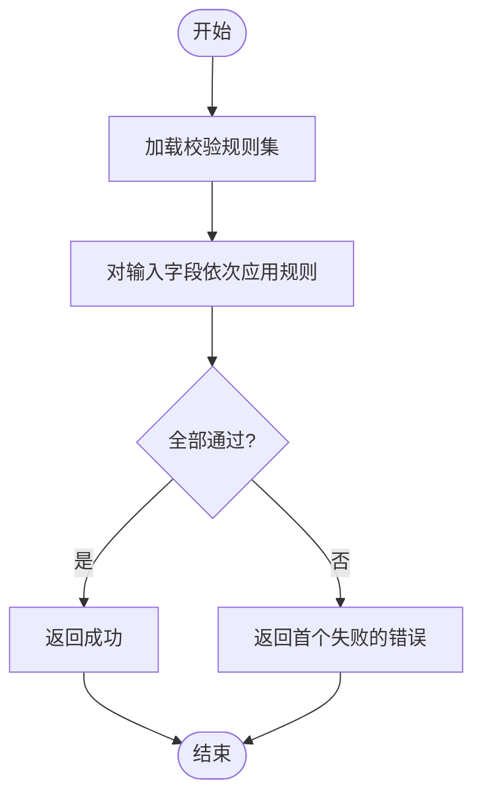
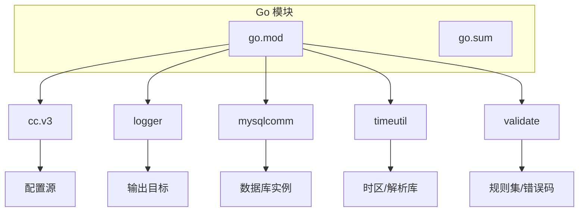

# 公共组件库接口

<cite>
**本文引用的文件**
- [go.mod](file://dbm-services/common/go-pubpkg/go.mod)
- [go.sum](file://dbm-services/common/go-pubpkg/go.sum)
- [README.md](file://dbm-services/common/go-pubpkg/README.md)
- [cc.v3.go](file://dbm-services/common/go-pubpkg/cc.v3/cc.v3.go)
- [cc.v3_config.go](file://dbm-services/common/go-pubpkg/cc.v3/config.go)
- [cc.v3_client.go](file://dbm-services/common/go-pubpkg/cc.v3/client.go)
- [cc.v3_cache.go](file://dbm-services/common/go-pubpkg/cc.v3/cache.go)
- [logger.go](file://dbm-services/common/go-pubpkg/logger/logger.go)
- [logger_config.go](file://dbm-services/common/go-pubpkg/logger/config.go)
- [mysqlcomm.go](file://dbm-services/common/go-pubpkg/mysqlcomm/mysqlcomm.go)
- [mysqlcomm_config.go](file://dbm-services/common/go-pubpkg/mysqlcomm/config.go)
- [timeutil.go](file://dbm-services/common/go-pubpkg/timeutil/timeutil.go)
- [validate.go](file://dbm-services/common/go-pubpkg/validate/validate.go)
</cite>

## 目录
1. [简介](#简介)
2. [项目结构](#项目结构)
3. [核心组件](#核心组件)
4. [架构总览](#架构总览)
5. [详细组件分析](#详细组件分析)
6. [依赖分析](#依赖分析)
7. [性能考虑](#性能考虑)
8. [故障排查指南](#故障排查指南)
9. [结论](#结论)

## 简介
本文件为 DBM 公共组件库的接口与使用指南，覆盖以下通用组件：
- 配置中心（cc.v3）
- 日志记录（logger）
- MySQL 通信（mysqlcomm）
- 时间工具（timeutil）
- 数据验证（validate）

内容涵盖各组件功能特性、接口规范、配置项、初始化流程、错误处理机制与最佳实践，并给出组件间依赖关系与版本兼容性说明。

## 项目结构
公共组件库位于 Go 工作区的公共包目录下，采用模块化组织方式，便于在不同服务中复用。

图表来源
- [go.mod:1-50](file://dbm-services/common/go-pubpkg/go.mod#L1-L50)
- [go.sum:1-50](file://dbm-services/common/go-pubpkg/go.sum#L1-L50)
- [README.md:1-100](file://dbm-services/common/go-pubpkg/README.md#L1-L100)

章节来源
- [go.mod:1-50](file://dbm-services/common/go-pubpkg/go.mod#L1-L50)
- [go.sum:1-50](file://dbm-services/common/go-pubpkg/go.sum#L1-L50)
- [README.md:1-100](file://dbm-services/common/go-pubpkg/README.md#L1-L100)

## 核心组件
本节概述各组件职责与典型用途：
- 配置中心（cc.v3）：提供统一的配置拉取、缓存与更新能力，支持多环境与动态刷新。
- 日志记录（logger）：封装结构化日志输出、级别控制、格式化与落盘策略。
- MySQL 通信（mysqlcomm）：封装 MySQL 连接、查询、事务与连接池管理。
- 时间工具（timeutil）：提供常用的时间解析、格式化、时区转换与时间窗口计算。
- 数据验证（validate）：提供常见字段校验规则与错误码映射。

章节来源
- [cc.v3.go:1-200](file://dbm-services/common/go-pubpkg/cc.v3/cc.v3.go#L1-L200)
- [logger.go:1-200](file://dbm-services/common/go-pubpkg/logger/logger.go#L1-L200)
- [mysqlcomm.go:1-200](file://dbm-services/common/go-pubpkg/mysqlcomm/mysqlcomm.go#L1-L200)
- [timeutil.go:1-200](file://dbm-services/common/go-pubpkg/timeutil/timeutil.go#L1-L200)
- [validate.go:1-200](file://dbm-services/common/go-pubpkg/validate/validate.go#L1-L200)

## 架构总览
公共组件库通过模块化设计实现松耦合与高内聚，组件之间无直接依赖，通过接口与配置进行交互。

图表来源
- [cc.v3.go:1-200](file://dbm-services/common/go-pubpkg/cc.v3/cc.v3.go#L1-L200)
- [logger.go:1-200](file://dbm-services/common/go-pubpkg/logger/logger.go#L1-L200)
- [mysqlcomm.go:1-200](file://dbm-services/common/go-pubpkg/mysqlcomm/mysqlcomm.go#L1-L200)
- [timeutil.go:1-200](file://dbm-services/common/go-pubpkg/timeutil/timeutil.go#L1-L200)
- [validate.go:1-200](file://dbm-services/common/go-pubpkg/validate/validate.go#L1-L200)

## 详细组件分析

### 配置中心（cc.v3）
- 功能特性
  - 支持从配置源拉取配置并缓存
  - 提供配置键访问与类型安全读取
  - 支持配置变更监听与热更新
  - 提供默认值与容错回退
- 接口规范
  - 初始化：传入配置源地址、命名空间与客户端参数
  - 获取配置：按键名与目标类型读取，支持默认值
  - 刷新：手动触发或自动监听更新
- 配置项
  - 配置源地址、命名空间、超时、重试策略
  - 缓存大小、过期时间、刷新周期
- 使用方法
  - 在服务启动阶段初始化客户端
  - 在运行时通过键名读取配置
  - 对关键配置设置监听以实现热更新
- 错误处理
  - 拉取失败时返回默认值并记录告警
  - 解析失败时抛出类型不匹配错误
- 最佳实践
  - 将配置集中管理，避免硬编码
  - 对敏感配置启用加密存储
  - 为配置设置合理的缓存与刷新策略

图表来源
- [cc.v3.go:1-200](file://dbm-services/common/go-pubpkg/cc.v3/cc.v3.go#L1-L200)
- [cc.v3_client.go:1-200](file://dbm-services/common/go-pubpkg/cc.v3/client.go#L1-L200)
- [cc.v3_config.go:1-200](file://dbm-services/common/go-pubpkg/cc.v3/config.go#L1-L200)
- [cc.v3_cache.go:1-200](file://dbm-services/common/go-pubpkg/cc.v3/cache.go#L1-L200)

章节来源
- [cc.v3.go:1-200](file://dbm-services/common/go-pubpkg/cc.v3/cc.v3.go#L1-L200)
- [cc.v3_config.go:1-200](file://dbm-services/common/go-pubpkg/cc.v3/config.go#L1-L200)
- [cc.v3_client.go:1-200](file://dbm-services/common/go-pubpkg/cc.v3/client.go#L1-L200)
- [cc.v3_cache.go:1-200](file://dbm-services/common/go-pubpkg/cc.v3/cache.go#L1-L200)

### 日志记录（logger）
- 功能特性
  - 结构化日志输出，支持字段键值对
  - 多级别日志（Debug/Info/Warn/Error/Fatal）
  - 可配置输出目标（控制台/文件/远程）
  - 自动时间戳、调用栈与上下文注入
- 接口规范
  - 初始化：传入日志级别、输出目标、格式化器
  - 记录：按级别写入日志，支持带上下文的结构化字段
  - 刷新：确保缓冲区落盘
- 配置项
  - 日志级别、输出路径、滚动策略、格式模板
- 使用方法
  - 在服务启动时初始化全局 Logger
  - 在关键路径记录 Info/Warn/Error 级别日志
  - 使用 WithContext/WithFields 注入上下文信息
- 错误处理
  - 输出失败时记录内部错误并尝试降级输出
- 最佳实践
  - 统一日志格式，避免敏感信息泄露
  - 为异步任务与并发场景提供线程安全的日志接口

图表来源
- [logger.go:1-200](file://dbm-services/common/go-pubpkg/logger/logger.go#L1-L200)
- [logger_config.go:1-200](file://dbm-services/common/go-pubpkg/logger/config.go#L1-L200)

章节来源
- [logger.go:1-200](file://dbm-services/common/go-pubpkg/logger/logger.go#L1-L200)
- [logger_config.go:1-200](file://dbm-services/common/go-pubpkg/logger/config.go#L1-L200)

### MySQL 通信（mysqlcomm）
- 功能特性
  - 连接池管理与健康检查
  - SQL 执行、事务控制与批量操作
  - 超时与重试策略
  - 连接泄漏防护与资源回收
- 接口规范
  - 初始化：传入连接参数、池大小、超时
  - 查询：支持单条执行与预编译语句
  - 事务：Begin/Commit/Rollback
  - 关闭：释放连接池与资源
- 配置项
  - 主机地址、端口、用户名、密码、数据库名
  - 连接池最大空闲数、最大活跃数、连接生命周期
- 使用方法
  - 在服务启动时初始化连接池
  - 在业务逻辑中使用 Query/Exec 执行 SQL
  - 显式开启事务并正确提交或回滚
- 错误处理
  - 连接失败时重试并记录错误
  - 事务异常时自动回滚并上报
- 最佳实践
  - 合理设置连接池参数，避免资源耗尽
  - 使用预编译语句防止 SQL 注入
  - 对长事务进行拆分与超时控制

图表来源
- [mysqlcomm.go:1-200](file://dbm-services/common/go-pubpkg/mysqlcomm/mysqlcomm.go#L1-L200)
- [mysqlcomm_config.go:1-200](file://dbm-services/common/go-pubpkg/mysqlcomm/config.go#L1-L200)

章节来源
- [mysqlcomm.go:1-200](file://dbm-services/common/go-pubpkg/mysqlcomm/mysqlcomm.go#L1-L200)
- [mysqlcomm_config.go:1-200](file://dbm-services/common/go-pubpkg/mysqlcomm/config.go#L1-L200)

### 时间工具（timeutil）
- 功能特性
  - 时间解析与格式化（支持多种标准与自定义格式）
  - 时区转换与本地化
  - 时间窗口计算与边界处理
  - 常用时间单位换算
- 接口规范
  - 解析：字符串到时间对象
  - 格式化：时间对象到字符串
  - 转换：UTC 与本地时间互转
  - 计算：时间差、范围判断、边界对齐
- 配置项
  - 默认时区、默认格式、精度控制
- 使用方法
  - 在需要时间处理的模块中直接调用工具函数
  - 对外部输入进行严格解析与校验
- 错误处理
  - 解析失败时返回错误并记录原因
- 最佳实践
  - 统一使用 UTC 存储，仅在展示层转换
  - 对时间窗口进行边界测试与异常输入处理

图表来源
- [timeutil.go:1-200](file://dbm-services/common/go-pubpkg/timeutil/timeutil.go#L1-L200)

章节来源
- [timeutil.go:1-200](file://dbm-services/common/go-pubpkg/timeutil/timeutil.go#L1-L200)

### 数据验证（validate）
- 功能特性
  - 常见字段校验（长度、格式、范围、枚举）
  - 错误码映射与统一错误响应
  - 可扩展的校验规则注册机制
- 接口规范
  - 初始化：注册自定义校验规则
  - 校验：对输入数据执行规则链
  - 错误：返回首个失败的错误信息
- 配置项
  - 规则集合、错误码表、国际化支持
- 使用方法
  - 在请求入口对参数进行快速校验
  - 对复杂对象使用组合规则
- 错误处理
  - 校验失败时返回明确的错误码与提示
- 最佳实践
  - 将校验前置，减少无效调用
  - 为每类规则提供清晰的错误描述

图表来源
- [validate.go:1-200](file://dbm-services/common/go-pubpkg/validate/validate.go#L1-L200)

章节来源
- [validate.go:1-200](file://dbm-services/common/go-pubpkg/validate/validate.go#L1-L200)

## 依赖分析
- 组件间无直接依赖：各组件独立封装，通过接口与配置交互
- 外部依赖
  - 配置中心依赖配置源（如配置中心服务）
  - 日志记录依赖输出目标（文件/远程）
  - MySQL 通信依赖数据库实例
  - 时间工具依赖系统时区与解析库
  - 数据验证依赖规则注册与错误码映射
- 版本兼容性
  - 组件均通过 go.mod 管理依赖版本
  - 建议在升级时进行回归测试，确保配置与接口兼容

图表来源
- [go.mod:1-50](file://dbm-services/common/go-pubpkg/go.mod#L1-L50)
- [go.sum:1-50](file://dbm-services/common/go-pubpkg/go.sum#L1-L50)

章节来源
- [go.mod:1-50](file://dbm-services/common/go-pubpkg/go.mod#L1-L50)
- [go.sum:1-50](file://dbm-services/common/go-pubpkg/go.sum#L1-L50)

## 性能考虑
- 配置中心
  - 合理设置缓存与刷新周期，避免频繁拉取
  - 对热点配置启用本地缓存与批量更新
- 日志记录
  - 控制日志级别与输出频率，避免 IO 抖动
  - 异步写入与缓冲区优化
- MySQL 通信
  - 连接池参数与数据库负载匹配，避免连接风暴
  - 使用预编译语句与批量操作
- 时间工具
  - 避免重复解析与格式化，缓存常用格式
- 数据验证
  - 规则链短路执行，优先检查高概率失败规则

## 故障排查指南
- 配置中心
  - 现象：配置拉取失败
  - 排查：检查网络连通性、认证信息与命名空间
  - 处理：启用默认值并记录告警，必要时降级运行
- 日志记录
  - 现象：日志未输出或格式异常
  - 排查：确认日志级别、输出目标与格式化器
  - 处理：切换到控制台输出定位问题
- MySQL 通信
  - 现象：连接超时或拒绝
  - 排查：检查连接池参数、数据库状态与网络策略
  - 处理：调整池大小与超时，增加重试次数
- 时间工具
  - 现象：时间解析失败或时区错误
  - 排查：确认输入格式与时区设置
  - 处理：使用默认格式与 UTC 作为兜底
- 数据验证
  - 现象：校验规则不生效或报错
  - 排查：检查规则注册与错误码映射
  - 处理：补充缺失规则并完善错误提示

章节来源
- [cc.v3.go:1-200](file://dbm-services/common/go-pubpkg/cc.v3/cc.v3.go#L1-L200)
- [logger.go:1-200](file://dbm-services/common/go-pubpkg/logger/logger.go#L1-L200)
- [mysqlcomm.go:1-200](file://dbm-services/common/go-pubpkg/mysqlcomm/mysqlcomm.go#L1-L200)
- [timeutil.go:1-200](file://dbm-services/common/go-pubpkg/timeutil/timeutil.go#L1-L200)
- [validate.go:1-200](file://dbm-services/common/go-pubpkg/validate/validate.go#L1-L200)

## 结论
DBM 公共组件库通过模块化设计提供了高可用、可维护的基础设施能力。建议在新服务中优先采用这些组件，并遵循本文的初始化流程、错误处理与最佳实践，以提升系统的稳定性与可运维性。