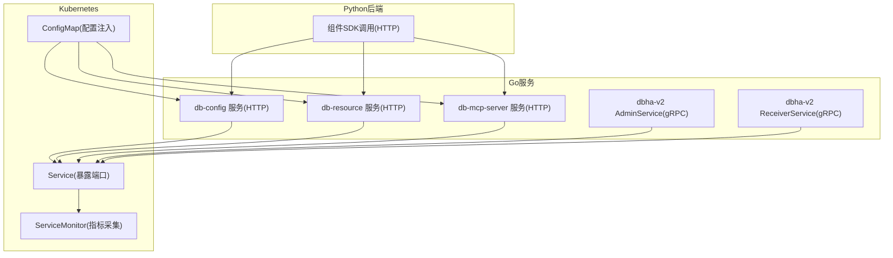
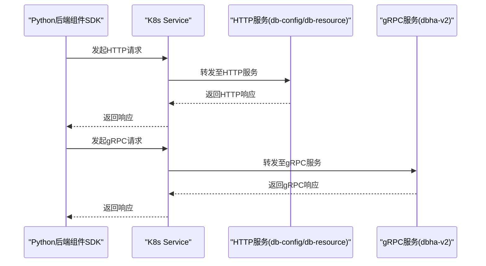
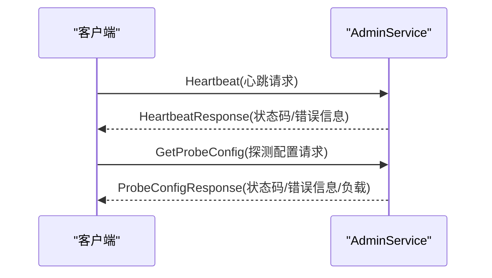
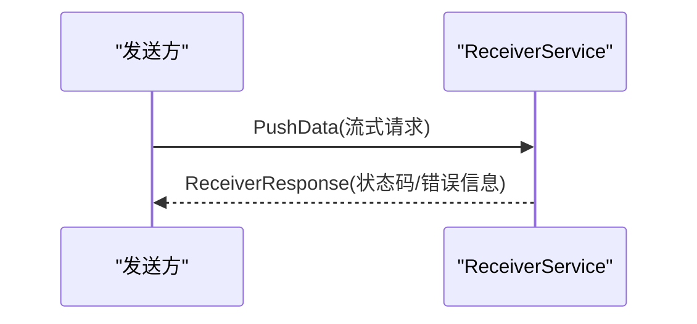
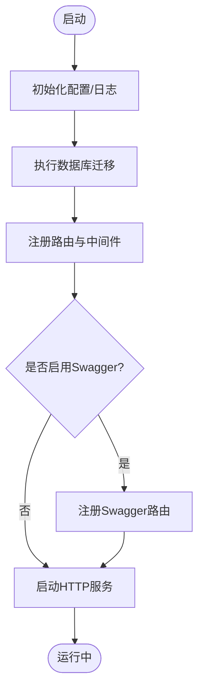
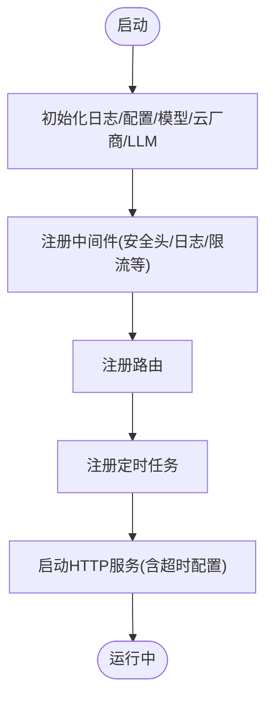
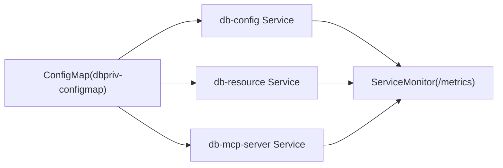

# 内部服务接口

<cite>
**本文引用的文件**
- [admin.proto](file://dbm-services/common/dbha-v2/pkg/proto/idl/admin.proto)
- [receiver.proto](file://dbm-services/common/dbha-v2/pkg/proto/idl/receiver.proto)
- [main.go](file://dbm-services/common/db-config/cmd/bkconfigsvr/main.go)
- [main.go](file://dbm-services/common/db-resource/main.go)
- [main.go](file://dbm-services/common/db-mcp-server/main.go)
- [dbpriv-configmap.yaml](file://helm-charts/bk-dbm/templates/configmaps/dbpriv-configmap.yaml)
- [service.yaml](file://helm-charts/bk-dbm/charts/db-dns-api/templates/service.yaml)
- [service.yaml](file://helm-charts/bk-dbm/charts/db-dbha/templates/service.yaml)
- [servicemonitor.yaml](file://helm-charts/bk-dbm/charts/k8s-dbs/templates/servicemonitor.yaml)
- [default.py](file://dbm-ui/config/default.py)
- [base.py](file://dbm-ui/blueking/component/base.py)
</cite>

## 目录
1. [简介](#简介)
2. [项目结构](#项目结构)
3. [核心组件](#核心组件)
4. [架构总览](#架构总览)
5. [详细组件分析](#详细组件分析)
6. [依赖关系分析](#依赖关系分析)
7. [性能考虑](#性能考虑)
8. [故障排查指南](#故障排查指南)
9. [结论](#结论)
10. [附录](#附录)

## 简介
本文件面向DBM内部服务接口，聚焦于Go服务之间的RPC调用接口、gRPC服务定义与Protobuf消息格式，以及服务发现、负载均衡、故障转移、健康检查与监控指标等运行期机制。文档同时覆盖公共组件库接口规范（日志、配置、数据库连接池），并给出服务注册/注销、健康检查与监控指标的使用方法，以及服务版本管理与向后兼容策略建议。

## 项目结构
- Go服务以独立可执行程序形式存在，采用HTTP/Gin框架提供REST API，并在部分服务中集成gRPC客户端/服务端能力。
- Protobuf定义集中于dbha-v2模块，用于Admin与Receiver两类RPC服务。
- Helm Charts提供服务暴露、服务发现与监控采集的基础设施模板。
- Python后端（dbm-ui）提供组件封装与调用示例，展示如何通过蓝鲸组件SDK发起HTTP请求并处理错误。

**图表来源**
- [main.go:45-84](file://dbm-services/common/db-config/cmd/bkconfigsvr/main.go#L45-L84)
- [main.go:67-109](file://dbm-services/common/db-resource/main.go#L67-L109)
- [main.go:1-8](file://dbm-services/common/db-mcp-server/main.go#L1-L8)
- [admin.proto:65-68](file://dbm-services/common/dbha-v2/pkg/proto/idl/admin.proto#L65-L68)
- [receiver.proto:38-40](file://dbm-services/common/dbha-v2/pkg/proto/idl/receiver.proto#L38-L40)
- [service.yaml:1-16](file://helm-charts/bk-dbm/charts/db-dns-api/templates/service.yaml#L1-L16)
- [service.yaml:1-17](file://helm-charts/bk-dbm/charts/db-dbha/templates/service.yaml#L1-L17)
- [servicemonitor.yaml:1-28](file://helm-charts/bk-dbm/charts/k8s-dbs/templates/servicemonitor.yaml#L1-L28)
- [dbpriv-configmap.yaml:1-32](file://helm-charts/bk-dbm/templates/configmaps/dbpriv-configmap.yaml#L1-L32)

**章节来源**
- [main.go:45-84](file://dbm-services/common/db-config/cmd/bkconfigsvr/main.go#L45-L84)
- [main.go:67-109](file://dbm-services/common/db-resource/main.go#L67-L109)
- [main.go:1-8](file://dbm-services/common/db-mcp-server/main.go#L1-L8)
- [admin.proto:65-68](file://dbm-services/common/dbha-v2/pkg/proto/idl/admin.proto#L65-L68)
- [receiver.proto:38-40](file://dbm-services/common/dbha-v2/pkg/proto/idl/receiver.proto#L38-L40)
- [service.yaml:1-16](file://helm-charts/bk-dbm/charts/db-dns-api/templates/service.yaml#L1-L16)
- [service.yaml:1-17](file://helm-charts/bk-dbm/charts/db-dbha/templates/service.yaml#L1-L17)
- [servicemonitor.yaml:1-28](file://helm-charts/bk-dbm/charts/k8s-dbs/templates/servicemonitor.yaml#L1-L28)
- [dbpriv-configmap.yaml:1-32](file://helm-charts/bk-dbm/templates/configmaps/dbpriv-configmap.yaml#L1-L32)

## 核心组件
- AdminService（gRPC）
  - 心跳上报与探测配置下发
  - 请求/响应消息：HeartbeatRequest、HeartbeatResponse
- ReceiverService（gRPC）
  - 流式推送数据
  - 请求/响应消息：ReceiverRequest（流）、ReceiverResponse
- db-config 服务（HTTP）
  - 提供配置管理API，集成OpenTelemetry链路追踪与Prometheus指标
- db-resource 服务（HTTP）
  - 提供资源相关API，内置安全头、请求体大小限制、日志中间件与定时任务
- db-mcp-server 服务（HTTP）
  - 作为统一入口或代理，负责路由与转发

**章节来源**
- [admin.proto:30-42](file://dbm-services/common/dbha-v2/pkg/proto/idl/admin.proto#L30-L42)
- [admin.proto:59-63](file://dbm-services/common/dbha-v2/pkg/proto/idl/admin.proto#L59-L63)
- [receiver.proto:28-36](file://dbm-services/common/dbha-v2/pkg/proto/idl/receiver.proto#L28-L36)
- [main.go:45-84](file://dbm-services/common/db-config/cmd/bkconfigsvr/main.go#L45-L84)
- [main.go:67-109](file://dbm-services/common/db-resource/main.go#L67-L109)
- [main.go:1-8](file://dbm-services/common/db-mcp-server/main.go#L1-L8)

## 架构总览
DBM内部服务通过Kubernetes Service对外暴露，结合ServiceMonitor实现Prometheus指标采集。服务间通信以HTTP为主，部分场景使用gRPC。Python后端通过组件SDK封装HTTP调用，统一处理错误与日志。

**图表来源**
- [service.yaml:1-16](file://helm-charts/bk-dbm/charts/db-dns-api/templates/service.yaml#L1-L16)
- [service.yaml:1-17](file://helm-charts/bk-dbm/charts/db-dbha/templates/service.yaml#L1-L17)
- [base.py:41-69](file://dbm-ui/blueking/component/base.py#L41-L69)

**章节来源**
- [service.yaml:1-16](file://helm-charts/bk-dbm/charts/db-dns-api/templates/service.yaml#L1-L16)
- [service.yaml:1-17](file://helm-charts/bk-dbm/charts/db-dbha/templates/service.yaml#L1-L17)
- [base.py:41-69](file://dbm-ui/blueking/component/base.py#L41-L69)

## 详细组件分析

### AdminService（心跳与探测配置）
- 服务定义：Heartbeat、GetProbeConfig
- 请求字段：clientID、configVersion、configLastUpdated、procStartedTime、adminLastConnectTime、receiverLastConnectTime
- 响应字段：code、errmsg
- 适用场景：心跳上报、探测配置下发

**图表来源**
- [admin.proto:30-42](file://dbm-services/common/dbha-v2/pkg/proto/idl/admin.proto#L30-L42)
- [admin.proto:44-63](file://dbm-services/common/dbha-v2/pkg/proto/idl/admin.proto#L44-L63)
- [admin.proto:65-68](file://dbm-services/common/dbha-v2/pkg/proto/idl/admin.proto#L65-L68)

**章节来源**
- [admin.proto:30-42](file://dbm-services/common/dbha-v2/pkg/proto/idl/admin.proto#L30-L42)
- [admin.proto:44-63](file://dbm-services/common/dbha-v2/pkg/proto/idl/admin.proto#L44-L63)
- [admin.proto:65-68](file://dbm-services/common/dbha-v2/pkg/proto/idl/admin.proto#L65-L68)

### ReceiverService（流式数据推送）
- 服务定义：PushData（流式）
- 请求字段：headers（键值对）、payload（字节）
- 响应字段：code、errmsg
- 适用场景：事件/日志/指标流式推送

**图表来源**
- [receiver.proto:28-36](file://dbm-services/common/dbha-v2/pkg/proto/idl/receiver.proto#L28-L36)
- [receiver.proto:38-40](file://dbm-services/common/dbha-v2/pkg/proto/idl/receiver.proto#L38-L40)

**章节来源**
- [receiver.proto:28-36](file://dbm-services/common/dbha-v2/pkg/proto/idl/receiver.proto#L28-L36)
- [receiver.proto:38-40](file://dbm-services/common/dbha-v2/pkg/proto/idl/receiver.proto#L38-L40)

### db-config 服务（HTTP）
- 功能：配置管理API，集成跨域、请求日志、OTel链路追踪、Prometheus指标
- 启动流程：初始化配置、数据库迁移、注册路由、启动HTTP服务
- Swagger：可选UI

**图表来源**
- [main.go:88-115](file://dbm-services/common/db-config/cmd/bkconfigsvr/main.go#L88-L115)
- [main.go:45-84](file://dbm-services/common/db-config/cmd/bkconfigsvr/main.go#L45-L84)

**章节来源**
- [main.go:88-115](file://dbm-services/common/db-config/cmd/bkconfigsvr/main.go#L88-L115)
- [main.go:45-84](file://dbm-services/common/db-config/cmd/bkconfigsvr/main.go#L45-L84)

### db-resource 服务（HTTP）
- 功能：资源管理API，内置安全头、请求体大小限制、日志中间件、定时任务
- 启动流程：初始化日志、配置、模型、云厂商客户端、LLM分析器；注册路由与中间件；启动HTTP服务
- 超时设置：ReadHeaderTimeout、ReadTimeout、WriteTimeout、IdleTimeout、MaxHeaderBytes

**图表来源**
- [main.go:112-124](file://dbm-services/common/db-resource/main.go#L112-L124)
- [main.go:67-109](file://dbm-services/common/db-resource/main.go#L67-L109)

**章节来源**
- [main.go:112-124](file://dbm-services/common/db-resource/main.go#L112-L124)
- [main.go:67-109](file://dbm-services/common/db-resource/main.go#L67-L109)

### db-mcp-server 服务（HTTP）
- 功能：统一入口或代理，负责路由与转发
- 启动入口：cmd.Execute()

**章节来源**
- [main.go:1-8](file://dbm-services/common/db-mcp-server/main.go#L1-L8)

## 依赖关系分析
- 服务发现与负载均衡
  - 通过Kubernetes Service暴露端口，配合Ingress/NLB实现外部访问与负载均衡
  - ServiceMonitor采集指标，Prometheus抓取
- 故障转移
  - 通过Kubernetes副本数与滚动更新策略实现高可用
  - 服务侧通过优雅关闭（Graceful Shutdown）降低中断风险
- 配置注入
  - ConfigMap注入db-config/db-resource/db-priv等服务配置

**图表来源**
- [dbpriv-configmap.yaml:1-32](file://helm-charts/bk-dbm/templates/configmaps/dbpriv-configmap.yaml#L1-L32)
- [service.yaml:1-16](file://helm-charts/bk-dbm/charts/db-dns-api/templates/service.yaml#L1-L16)
- [service.yaml:1-17](file://helm-charts/bk-dbm/charts/db-dbha/templates/service.yaml#L1-L17)
- [servicemonitor.yaml:1-28](file://helm-charts/bk-dbm/charts/k8s-dbs/templates/servicemonitor.yaml#L1-L28)

**章节来源**
- [dbpriv-configmap.yaml:1-32](file://helm-charts/bk-dbm/templates/configmaps/dbpriv-configmap.yaml#L1-L32)
- [service.yaml:1-16](file://helm-charts/bk-dbm/charts/db-dns-api/templates/service.yaml#L1-L16)
- [service.yaml:1-17](file://helm-charts/bk-dbm/charts/db-dbha/templates/service.yaml#L1-L17)
- [servicemonitor.yaml:1-28](file://helm-charts/bk-dbm/charts/k8s-dbs/templates/servicemonitor.yaml#L1-L28)

## 性能考虑
- HTTP服务超时与并发
  - db-resource设置了严格的读取/写入/空闲超时与头部大小限制，适合长耗时任务场景
- 指标与追踪
  - OpenTelemetry链路追踪与Prometheus指标中间件已在db-config与db-resource启用
- 数据库连接池
  - Python后端使用连接池中间件，配置了最大连接数、溢出与回收周期

**章节来源**
- [main.go:73-81](file://dbm-services/common/db-resource/main.go#L73-L81)
- [main.go:65-70](file://dbm-services/common/db-config/cmd/bkconfigsvr/main.go#L65-L70)
- [default.py:229-280](file://dbm-ui/config/default.py#L229-L280)

## 故障排查指南
- HTTP调用异常
  - 组件SDK会捕获异常并记录日志，优先检查URL、响应内容与错误消息
- gRPC调用异常
  - 关注心跳与探测配置的返回码与错误信息，核对clientID与时间戳一致性
- 配置问题
  - 通过ConfigMap注入的配置项（如dbmeta、dbRemoteService、bk_app_code等）需确保正确
- 指标采集
  - 检查ServiceMonitor的路径与端口是否匹配服务暴露的/metrics

**章节来源**
- [base.py:41-69](file://dbm-ui/blueking/component/base.py#L41-L69)
- [admin.proto:39-42](file://dbm-services/common/dbha-v2/pkg/proto/idl/admin.proto#L39-L42)
- [dbpriv-configmap.yaml:27-30](file://helm-charts/bk-dbm/templates/configmaps/dbpriv-configmap.yaml#L27-L30)
- [servicemonitor.yaml:17-20](file://helm-charts/bk-dbm/charts/k8s-dbs/templates/servicemonitor.yaml#L17-L20)

## 结论
DBM内部服务接口以HTTP为主、gRPC为辅，结合Kubernetes服务发现与ServiceMonitor实现可观测性。通过严格的超时配置、连接池与中间件，保障服务稳定性与可维护性。建议在新增服务时遵循统一的中间件与指标规范，并在版本演进中保持向后兼容。

## 附录

### 服务间通信协议与超时设置
- HTTP
  - db-resource：ReadHeaderTimeout、ReadTimeout、WriteTimeout、IdleTimeout、MaxHeaderBytes
- gRPC
  - AdminService：心跳与探测配置
  - ReceiverService：流式数据推送

**章节来源**
- [main.go:73-81](file://dbm-services/common/db-resource/main.go#L73-L81)
- [admin.proto:30-42](file://dbm-services/common/dbha-v2/pkg/proto/idl/admin.proto#L30-L42)
- [receiver.proto:28-36](file://dbm-services/common/dbha-v2/pkg/proto/idl/receiver.proto#L28-L36)

### 服务注册/注销与健康检查
- 注册/注销
  - 通过Kubernetes Deployment/Service声明式管理
- 健康检查
  - 参考Helm NOTES提示中的健康检查URL（示例：/common/health）

**章节来源**
- [service.yaml:1-16](file://helm-charts/bk-dbm/charts/db-dns-api/templates/service.yaml#L1-L16)
- [service.yaml:1-17](file://helm-charts/bk-dbm/charts/db-dbha/templates/service.yaml#L1-L17)

### 监控指标与采集
- Prometheus ServiceMonitor
  - 采集路径：/metrics
  - 端口：http/api
  - 命名空间选择：Release.Namespace

**章节来源**
- [servicemonitor.yaml:17-20](file://helm-charts/bk-dbm/charts/k8s-dbs/templates/servicemonitor.yaml#L17-L20)

### 公共组件库接口规范
- 日志记录
  - Go服务：统一logger初始化与中间件
  - Python后端：组件SDK统一异常与日志处理
- 配置管理
  - ConfigMap注入，db-config/db-resource/db-priv等服务读取
- 数据库连接池
  - Python后端：连接池中间件，配置POOL_SIZE/MAX_OVERFLOW/RECYCLE

**章节来源**
- [main.go:225-235](file://dbm-services/common/db-resource/main.go#L225-L235)
- [base.py:41-69](file://dbm-ui/blueking/component/base.py#L41-L69)
- [dbpriv-configmap.yaml:1-32](file://helm-charts/bk-dbm/templates/configmaps/dbpriv-configmap.yaml#L1-L32)
- [default.py:229-280](file://dbm-ui/config/default.py#L229-L280)

### 服务版本管理与向后兼容
- 建议
  - 采用语义化版本，保持gRPC服务方法签名稳定
  - 对新增字段采用默认值与兼容解析策略
  - 通过ConfigMap与环境变量实现渐进式灰度

[本节为通用实践建议，无需具体文件引用]