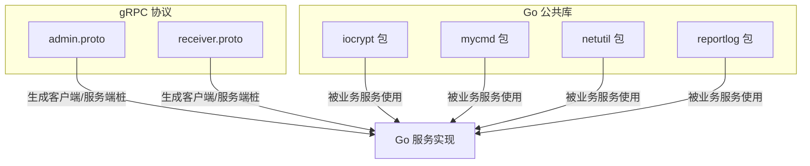
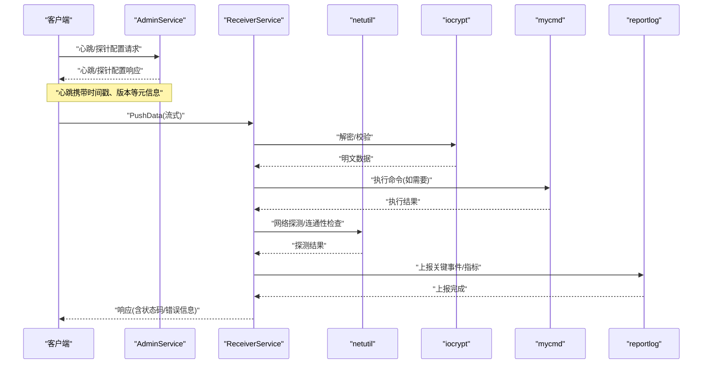
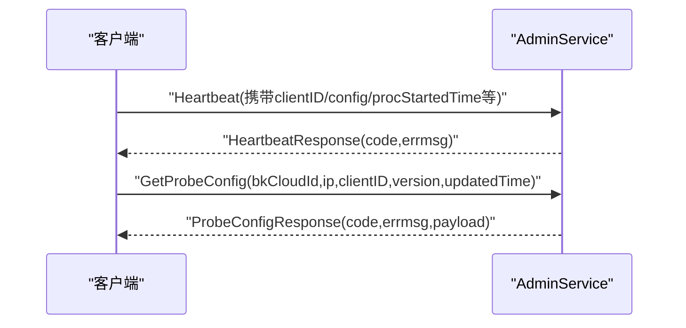
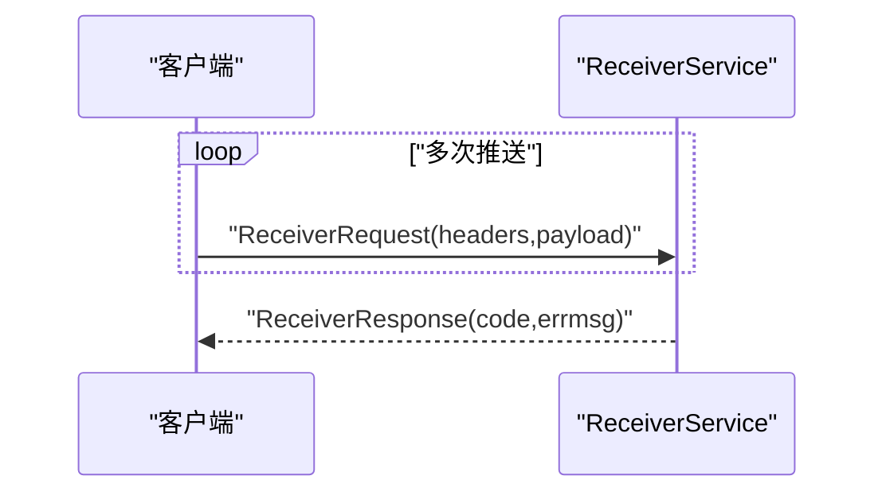
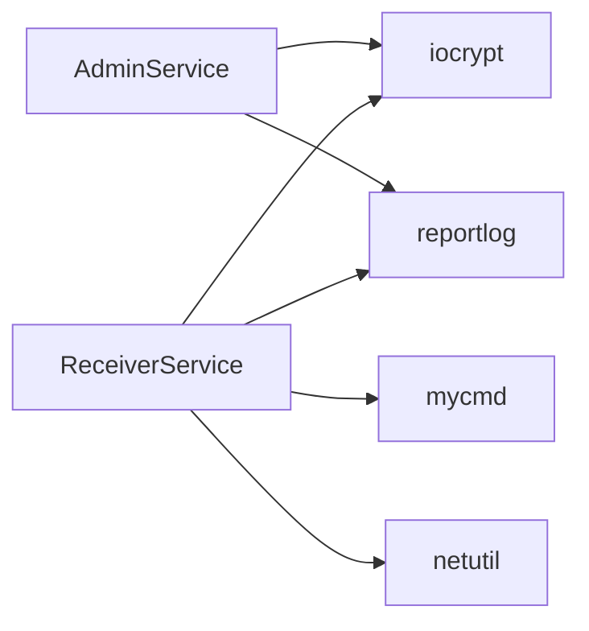

# 服务通信接口

<cite>
**本文引用的文件**
- [admin.proto](file://dbm-services/common/dbha-v2/pkg/proto/idl/admin.proto)
- [receiver.proto](file://dbm-services/common/dbha-v2/pkg/proto/idl/receiver.proto)
- [iocrypt 包](file://dbm-services/common/go-pubpkg/iocrypt)
- [mycmd 包](file://dbm-services/common/go-pubpkg/mycmd)
- [netutil 包](file://dbm-services/common/go-pubpkg/netutil)
- [reportlog 包](file://dbm-services/common/go-pubpkg/reportlog)
</cite>

## 目录
1. [简介](#简介)
2. [项目结构](#项目结构)
3. [核心组件](#核心组件)
4. [架构总览](#架构总览)
5. [详细组件分析](#详细组件分析)
6. [依赖关系分析](#依赖关系分析)
7. [性能考虑](#性能考虑)
8. [故障排查指南](#故障排查指南)
9. [结论](#结论)
10. [附录](#附录)

## 简介
本文件面向DBM服务间通信接口，聚焦以下通信相关组件的接口规范与实现要点：
- 加密解密（iocrypt）
- 命令执行（mycmd）
- 网络工具（netutil）
- 日志上报（reportlog）

同时，结合仓库中已提供的gRPC协议定义，说明AdminService与ReceiverService的服务契约、消息格式与调用约定；并基于通用实践给出服务发现、负载均衡、故障转移、健康检查、熔断保护、通信安全、超时与重试等配置建议与最佳实践。

## 项目结构
围绕服务通信接口，相关代码主要分布在如下位置：
- gRPC协议定义：dbm-services/common/dbha-v2/pkg/proto/idl/
- Go公共库（通信相关能力）：dbm-services/common/go-pubpkg/{iocrypt, mycmd, netutil, reportlog}

图示来源
- [admin.proto:1-69](file://dbm-services/common/dbha-v2/pkg/proto/idl/admin.proto#L1-L69)
- [receiver.proto:1-41](file://dbm-services/common/dbha-v2/pkg/proto/idl/receiver.proto#L1-L41)

章节来源
- [admin.proto:1-69](file://dbm-services/common/dbha-v2/pkg/proto/idl/admin.proto#L1-L69)
- [receiver.proto:1-41](file://dbm-services/common/dbha-v2/pkg/proto/idl/receiver.proto#L1-L41)

## 核心组件
本节对四个通信组件进行概览性说明，重点落在接口职责、典型用法与与gRPC的集成方式。

- iocrypt（加密解密）
  - 职责：提供数据加解密能力，保障服务间传输数据的机密性与完整性。
  - 使用场景：敏感参数传递、凭证交换、日志内容加密等。
  - 与gRPC集成：作为底层依赖，供上层服务在请求前加密、响应后解密。

- mycmd（命令执行）
  - 职责：封装远程命令执行能力，支持超时控制、输出捕获与错误处理。
  - 使用场景：跨主机执行运维脚本、安装/卸载工具、采集系统信息。
  - 与gRPC集成：可作为ReceiverService推送数据后的处理步骤之一。

- netutil（网络工具）
  - 职责：提供网络探测、连通性检测、端口扫描、DNS解析等网络能力。
  - 使用场景：健康检查前置探测、服务可用性评估、网络诊断。
  - 与gRPC集成：可用于AdminService心跳或配置下发前的网络校验。

- reportlog（日志上报）
  - 职责：统一日志采集、格式化与上报，支持批量发送与失败重试。
  - 使用场景：服务运行日志、审计日志、事件上报。
  - 与gRPC集成：可与AdminService/ReceiverService配合，将关键事件以结构化日志形式上报。

章节来源
- [iocrypt 包](file://dbm-services/common/go-pubpkg/iocrypt)
- [mycmd 包](file://dbm-services/common/go-pubpkg/mycmd)
- [netutil 包](file://dbm-services/common/go-pubpkg/netutil)
- [reportlog 包](file://dbm-services/common/go-pubpkg/reportlog)

## 架构总览
下图展示AdminService与ReceiverService的典型交互流程，以及与通信组件的协作关系。

图示来源
- [admin.proto:30-42](file://dbm-services/common/dbha-v2/pkg/proto/idl/admin.proto#L30-L42)
- [receiver.proto:28-36](file://dbm-services/common/dbha-v2/pkg/proto/idl/receiver.proto#L28-L36)
- [iocrypt 包](file://dbm-services/common/go-pubpkg/iocrypt)
- [mycmd 包](file://dbm-services/common/go-pubpkg/mycmd)
- [netutil 包](file://dbm-services/common/go-pubpkg/netutil)
- [reportlog 包](file://dbm-services/common/go-pubpkg/reportlog)

## 详细组件分析

### AdminService（心跳与探针配置）
- 服务角色：负责接收客户端心跳、上报配置版本与时间信息；提供探针配置查询能力。
- 关键RPC
  - Heartbeat(HeartbeatRequest) → HeartbeatResponse
  - GetProbeConfig(ProbeConfigRequest) → ProbeConfigResponse
- 请求/响应字段要点
  - 心跳请求包含客户端标识、配置版本、启动时间、最近连接时间等，便于服务端做版本一致性与存活监控。
  - 探针配置请求包含云区域ID、IP、客户端ID、版本与更新时间，服务端据此返回payload或无数据。
- 错误码
  - 探针配置返回码包含成功、失败、无数据三类，便于客户端按需处理。

图示来源
- [admin.proto:30-68](file://dbm-services/common/dbha-v2/pkg/proto/idl/admin.proto#L30-L68)

章节来源
- [admin.proto:30-68](file://dbm-services/common/dbha-v2/pkg/proto/idl/admin.proto#L30-L68)

### ReceiverService（数据推送）
- 服务角色：接收客户端推送的流式数据，支持多段数据分片传输。
- 关键RPC
  - PushData(stream ReceiverRequest) → ReceiverResponse
- 请求/响应字段要点
  - ReceiverRequest包含headers（键值对元信息）与payload（二进制数据），适合传输大块或二进制内容。
  - ReceiverResponse包含code与errmsg，用于统一错误反馈。
- 数据流控制
  - 流式推送适合大数据量场景，客户端应按顺序发送多个ReceiverRequest，服务端聚合处理。

图示来源
- [receiver.proto:28-40](file://dbm-services/common/dbha-v2/pkg/proto/idl/receiver.proto#L28-L40)

章节来源
- [receiver.proto:28-40](file://dbm-services/common/dbha-v2/pkg/proto/idl/receiver.proto#L28-L40)

### iocrypt（加密解密）
- 能力概述：提供对称/非对称加解密、摘要计算、签名验证等基础密码学能力。
- 在AdminService/ReceiverService中的应用
  - 对敏感字段（如payload）进行解密，确保传输安全。
  - 可与心跳请求中的版本/时间戳结合进行完整性校验。
- 最佳实践
  - 使用强随机源初始化密钥与IV。
  - 对响应数据进行完整性校验，防止中间人篡改。

章节来源
- [iocrypt 包](file://dbm-services/common/go-pubpkg/iocrypt)

### mycmd（命令执行）
- 能力概述：封装远程命令执行，支持超时、输出捕获、错误分类与重试策略。
- 在ReceiverService中的应用
  - 接收解密后的指令后，调用mycmd执行具体动作（如安装工具、采集信息）。
- 最佳实践
  - 严格限制命令白名单与参数校验，避免注入风险。
  - 设置合理超时与最大输出大小，防止资源耗尽。

章节来源
- [mycmd 包](file://dbm-services/common/go-pubpkg/mycmd)

### netutil（网络工具）
- 能力概述：提供连通性探测、端口扫描、DNS解析、网络延迟测量等能力。
- 在AdminService中的应用
  - 作为健康检查前置步骤，判断目标主机/端口可达性。
- 在ReceiverService中的应用
  - 在推送前对远端网络环境进行快速探测，降低失败率。
- 最佳实践
  - 合理设置探测超时与并发度，避免对目标系统造成压力。

章节来源
- [netutil 包](file://dbm-services/common/go-pubpkg/netutil)

### reportlog（日志上报）
- 能力概述：统一日志采集、格式化与上报，支持批量发送、失败重试与限速。
- 在AdminService/ReceiverService中的应用
  - 记录心跳、配置拉取、数据推送、命令执行等关键事件，便于排障与审计。
- 最佳实践
  - 结构化日志字段明确，包含trace_id、模块、级别、时间戳、错误码等。
  - 配置合理的批量大小与重试间隔，避免对下游造成冲击。

章节来源
- [reportlog 包](file://dbm-services/common/go-pubpkg/reportlog)

## 依赖关系分析
- AdminService/ReceiverService依赖于通信组件：
  - iocrypt：保障payload与元数据的机密性与完整性。
  - mycmd：执行推送指令或健康检查触发的动作。
  - netutil：前置网络探测与连通性校验。
  - reportlog：统一记录关键事件与错误信息。
- 依赖方向
  - 通信组件为服务提供基础设施能力，服务通过协议定义与之交互。

图示来源
- [admin.proto:65-68](file://dbm-services/common/dbha-v2/pkg/proto/idl/admin.proto#L65-L68)
- [receiver.proto:38-40](file://dbm-services/common/dbha-v2/pkg/proto/idl/receiver.proto#L38-L40)
- [iocrypt 包](file://dbm-services/common/go-pubpkg/iocrypt)
- [mycmd 包](file://dbm-services/common/go-pubpkg/mycmd)
- [netutil 包](file://dbm-services/common/go-pubpkg/netutil)
- [reportlog 包](file://dbm-services/common/go-pubpkg/reportlog)

## 性能考虑
- 流式推送优化
  - ReceiverService采用流式推送，建议客户端按固定大小分片，减少单次内存占用。
- 超时与背压
  - 为AdminService/ReceiverService设置合理的读写超时，避免长时间阻塞。
  - 在高并发场景下启用限速与队列长度控制，防止服务过载。
- 加密开销
  - iocrypt的加解密成本较高，建议对大块payload进行压缩后再加密，或仅对敏感字段加密。
- 命令执行效率
  - mycmd应尽量复用连接与会话，避免频繁建立/销毁带来的额外开销。
- 网络探测频率
  - netutil探测应设置合理的周期与并发上限，避免对目标系统造成压力。

## 故障排查指南
- 心跳异常
  - 现象：HeartbeatResponse返回错误码或长时间无响应。
  - 排查：检查clientID是否正确、配置版本是否一致、procStartedTime是否合理。
- 探针配置无数据
  - 现象：GetProbeConfig返回“无数据”。
  - 排查：确认bkCloudId/ip/clientID/version/updatedTime是否匹配预期；检查服务端配置下发逻辑。
- 推送失败
  - 现象：PushData返回错误码。
  - 排查：检查headers与payload合法性；确认iocrypt解密是否成功；查看mycmd执行日志；核对网络连通性。
- 日志缺失
  - 现象：关键事件未上报。
  - 排查：确认reportlog配置与目标地址；检查批量发送与重试策略；核对日志级别与过滤规则。

章节来源
- [admin.proto:30-68](file://dbm-services/common/dbha-v2/pkg/proto/idl/admin.proto#L30-L68)
- [receiver.proto:28-40](file://dbm-services/common/dbha-v2/pkg/proto/idl/receiver.proto#L28-L40)
- [reportlog 包](file://dbm-services/common/go-pubpkg/reportlog)

## 结论
通过对AdminService与ReceiverService的协议定义与通信组件（iocrypt、mycmd、netutil、reportlog）的协同分析，DBM服务间通信具备清晰的接口边界与可扩展的实现路径。结合合理的服务发现、负载均衡、故障转移、健康检查与熔断保护策略，可在保证安全性与可靠性的前提下，获得良好的性能表现。

## 附录

### gRPC 服务与消息规范摘要
- AdminService
  - Heartbeat(HeartbeatRequest) → HeartbeatResponse
  - GetProbeConfig(ProbeConfigRequest) → ProbeConfigResponse
- ReceiverService
  - PushData(stream ReceiverRequest) → ReceiverResponse

章节来源
- [admin.proto:30-68](file://dbm-services/common/dbha-v2/pkg/proto/idl/admin.proto#L30-L68)
- [receiver.proto:28-40](file://dbm-services/common/dbha-v2/pkg/proto/idl/receiver.proto#L28-L40)