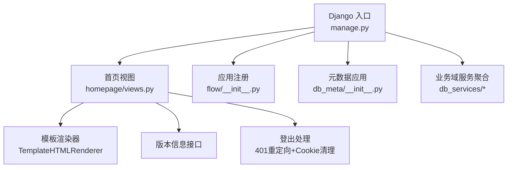
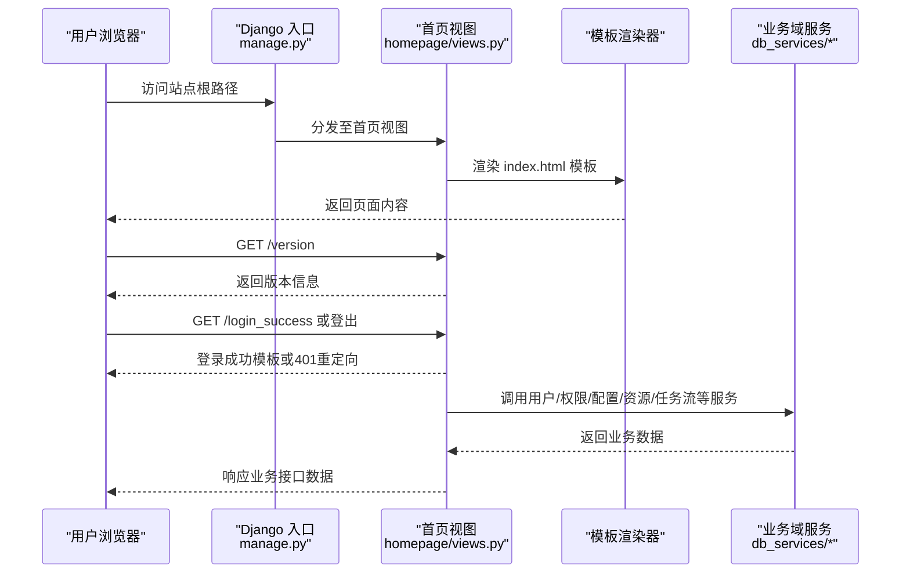
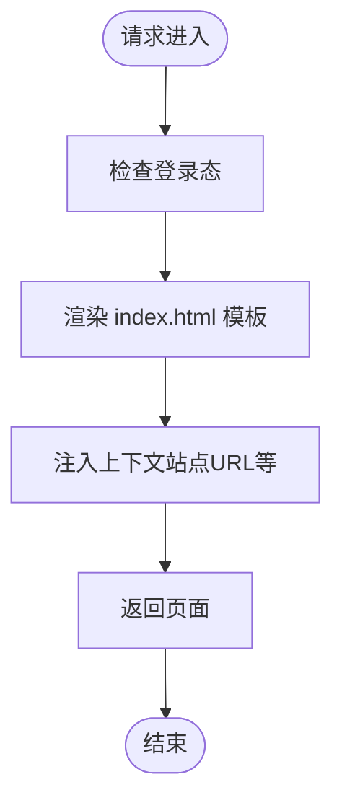
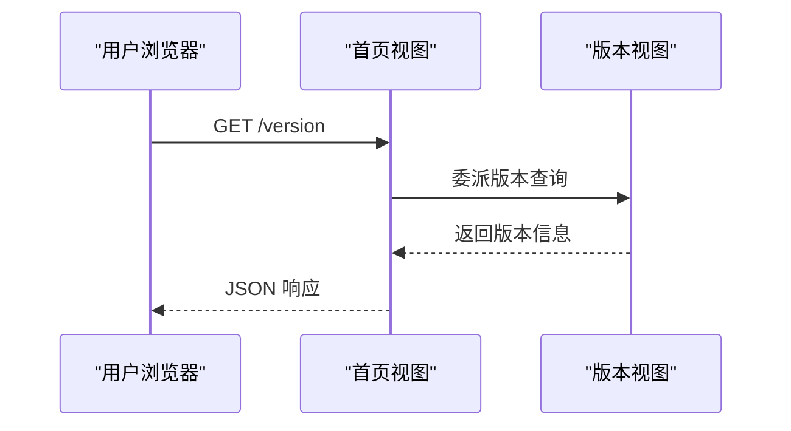
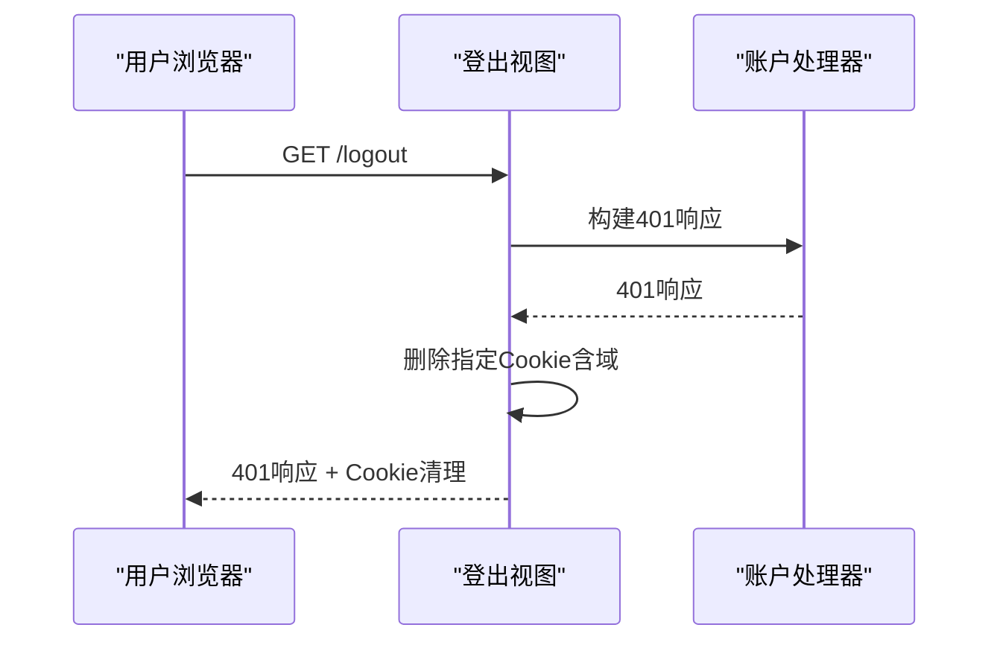
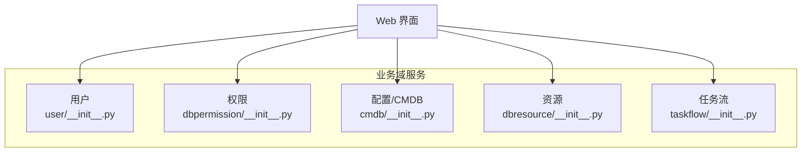
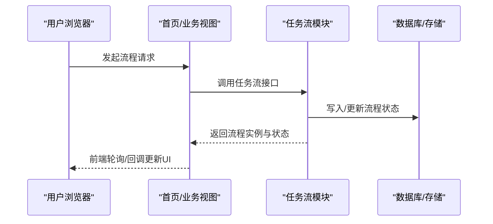
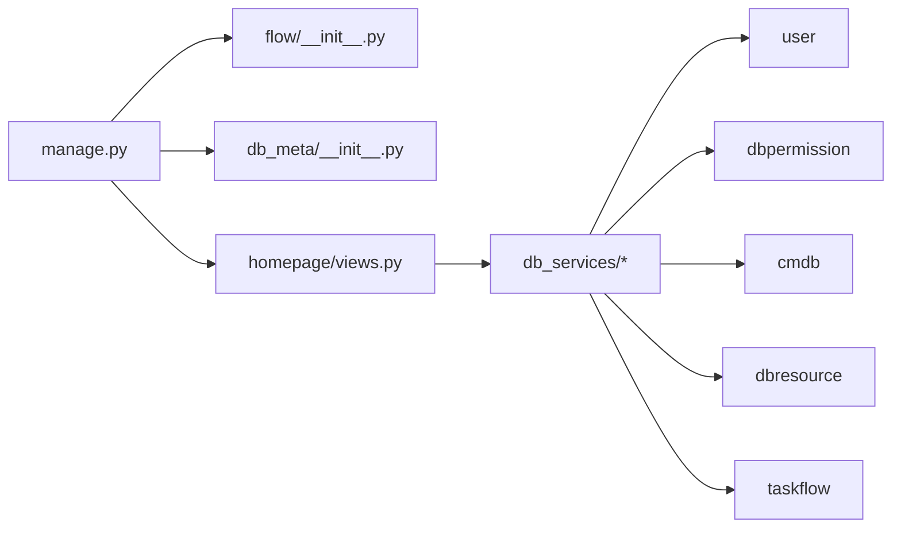

# Web管理界面

<cite>
**本文引用的文件**
- [manage.py](file://dbm-ui/manage.py)
- [views.py](file://dbm-ui/backend/homepage/views.py)
- [__init__.py（flow）](file://dbm-ui/backend/flow/__init__.py)
- [__init__.py（db_meta）](file://dbm-ui/backend/db_meta/__init__.py)
- [__init__.py（db_services 用户）](file://dbm-ui/backend/db_services/user/__init__.py)
- [__init__.py（db_services 任务流）](file://dbm-ui/backend/db_services/taskflow/__init__.py)
- [__init__.py（db_services 权限）](file://dbm-ui/backend/db_services/dbpermission/__init__.py)
- [__init__.py（db_services 配置）](file://dbm-ui/backend/db_services/cmdb/__init__.py)
- [__init__.py（db_services 资源）](file://dbm-ui/backend/db_services/dbresource/__init__.py)
</cite>

## 目录
1. [简介](#简介)
2. [项目结构](#项目结构)
3. [核心组件](#核心组件)
4. [架构总览](#架构总览)
5. [详细组件分析](#详细组件分析)
6. [依赖分析](#依赖分析)
7. [性能考虑](#性能考虑)
8. [故障排查指南](#故障排查指南)
9. [结论](#结论)
10. [附录](#附录)

## 简介
本文件面向DBM（蓝鲸智云-DB管理系统）的Web管理界面，系统性梳理其架构设计、用户与权限体系、流程引擎（任务流）集成以及前后端交互模式。文档以“可读性优先”为原则，结合可视化图示帮助读者快速理解界面组件关系、数据流转与操作流程，并提供响应式与无障碍访问的实践建议、主题与样式定制指引，以及跨浏览器兼容与性能优化策略。

## 项目结构
DBM的Web管理界面由后端Django应用与前端模板共同构成。后端负责：
- 应用入口与环境初始化（如数据库特性适配）
- 首页与版本信息接口
- 登录态与登出处理
- 各业务域服务的聚合（用户、权限、配置、资源、任务流等）

前端模板通过REST渲染器返回页面，配合蓝鲸账户体系进行统一认证与会话管理。

图表来源
- [manage.py:10-23](file://dbm-ui/manage.py#L10-L23)
- [views.py:34-95](file://dbm-ui/backend/homepage/views.py#L34-L95)
- [__init__.py（flow）:11](file://dbm-ui/backend/flow/__init__.py#L11)
- [__init__.py（db_meta）:11](file://dbm-ui/backend/db_meta/__init__.py#L11)

章节来源
- [manage.py:10-23](file://dbm-ui/manage.py#L10-L23)
- [views.py:34-95](file://dbm-ui/backend/homepage/views.py#L34-L95)
- [__init__.py（flow）:11](file://dbm-ui/backend/flow/__init__.py#L11)
- [__init__.py（db_meta）:11](file://dbm-ui/backend/db_meta/__init__.py#L11)

## 核心组件
- 应用入口与环境初始化：设置Django运行参数与数据库特性适配，确保在MySQL 5.7环境下稳定运行。
- 首页与模板渲染：提供SPA风格的单页模板入口，注入站点URL等上下文变量。
- 版本信息接口：返回应用版本、Chart版本等信息，便于前端展示与更新提示。
- 登录与登出：基于蓝鲸账户体系，统一处理登录成功页面与登出逻辑（含Cookie清理与401响应）。
- 业务域服务聚合：通过db_services包下的子模块（用户、权限、配置、资源、任务流等）提供能力扩展点。

章节来源
- [manage.py:10-23](file://dbm-ui/manage.py#L10-L23)
- [views.py:34-95](file://dbm-ui/backend/homepage/views.py#L34-L95)
- [__init__.py（db_services 用户）:1-11](file://dbm-ui/backend/db_services/user/__init__.py#L1-L11)
- [__init__.py（db_services 权限）:1-11](file://dbm-ui/backend/db_services/dbpermission/__init__.py#L1-L11)
- [__init__.py（db_services 配置）:1-11](file://dbm-ui/backend/db_services/cmdb/__init__.py#L1-L11)
- [__init__.py（db_services 资源）:1-11](file://dbm-ui/backend/db_services/dbresource/__init__.py#L1-L11)
- [__init__.py（db_services 任务流）:1-11](file://dbm-ui/backend/db_services/taskflow/__init__.py#L1-L11)

## 架构总览
下图展示了Web管理界面从请求到渲染的关键路径，以及与任务流、元数据与业务域服务的协作关系。

图表来源
- [manage.py:14-23](file://dbm-ui/manage.py#L14-L23)
- [views.py:34-95](file://dbm-ui/backend/homepage/views.py#L34-L95)
- [__init__.py（db_services 用户）:1-11](file://dbm-ui/backend/db_services/user/__init__.py#L1-L11)
- [__init__.py（db_services 权限）:1-11](file://dbm-ui/backend/db_services/dbpermission/__init__.py#L1-L11)
- [__init__.py（db_services 配置）:1-11](file://dbm-ui/backend/db_services/cmdb/__init__.py#L1-L11)
- [__init__.py（db_services 资源）:1-11](file://dbm-ui/backend/db_services/dbresource/__init__.py#L1-L11)
- [__init__.py（db_services 任务流）:1-11](file://dbm-ui/backend/db_services/taskflow/__init__.py#L1-L11)

## 详细组件分析

### 首页与模板渲染（HomeView）
- 角色定位：作为Web管理界面的入口，负责渲染单页模板并注入基础上下文（如站点URL）。
- 关键行为：
  - 使用模板渲染器返回index.html。
  - 提供版本查询接口，返回最新版本信息。
  - 登录态校验与X-Frame-Options豁免，便于嵌入场景。
- 用户交互模式：
  - 初始加载：拉取版本信息用于展示。
  - 页面内导航：通过前端路由切换不同功能模块。
- 数据展示方式：模板中注入的上下文变量用于动态生成页面元素与API地址。
- 操作流程：请求进入视图 -> 校验登录 -> 渲染模板 -> 返回页面。

图表来源
- [views.py:34-44](file://dbm-ui/backend/homepage/views.py#L34-L44)

章节来源
- [views.py:34-44](file://dbm-ui/backend/homepage/views.py#L34-L44)

### 版本信息接口（VersionView 与 HomeView.version）
- 角色定位：对外提供版本号查询，便于前端展示与更新提示。
- 关键行为：
  - 返回应用版本、Chart版本等信息。
  - 与首页视图协同，统一版本查询入口。
- 用户交互模式：页面加载时自动拉取版本信息；在更新提示或帮助信息中展示。

图表来源
- [views.py:45-47](file://dbm-ui/backend/homepage/views.py#L45-L47)
- [views.py:50-54](file://dbm-ui/backend/homepage/views.py#L50-L54)

章节来源
- [views.py:45-47](file://dbm-ui/backend/homepage/views.py#L45-L47)
- [views.py:50-54](file://dbm-ui/backend/homepage/views.py#L50-L54)

### 登录与登出（LoginSuccessView 与 LogOutView）
- 角色定位：统一处理登录成功页面与登出逻辑，确保跨域Cookie清理与401响应。
- 关键行为：
  - 登录成功页面：注入会话域信息，便于前端识别。
  - 登出：调用账户处理器构建401响应，并删除bk_ticket/bk_token/bk_uid等Cookie。
- 用户交互模式：
  - 登录成功：跳转至登录成功页面，前端据此调整UI状态。
  - 登出：触发401响应，前端重定向至登录页并清理本地状态。

图表来源
- [views.py:79-95](file://dbm-ui/backend/homepage/views.py#L79-L95)

章节来源
- [views.py:79-95](file://dbm-ui/backend/homepage/views.py#L79-L95)

### 业务域服务聚合（db_services）
- 角色定位：为Web管理界面提供用户、权限、配置、资源、任务流等能力的后端聚合层。
- 组织方式：每个子模块以__init__.py声明，便于按需引入与扩展。
- 用户交互模式：前端通过REST接口调用各域服务，后端在视图中统一编排与返回。

图表来源
- [__init__.py（db_services 用户）:1-11](file://dbm-ui/backend/db_services/user/__init__.py#L1-L11)
- [__init__.py（db_services 权限）:1-11](file://dbm-ui/backend/db_services/dbpermission/__init__.py#L1-L11)
- [__init__.py（db_services 配置）:1-11](file://dbm-ui/backend/db_services/cmdb/__init__.py#L1-L11)
- [__init__.py（db_services 资源）:1-11](file://dbm-ui/backend/db_services/dbresource/__init__.py#L1-L11)
- [__init__.py（db_services 任务流）:1-11](file://dbm-ui/backend/db_services/taskflow/__init__.py#L1-L11)

章节来源
- [__init__.py（db_services 用户）:1-11](file://dbm-ui/backend/db_services/user/__init__.py#L1-L11)
- [__init__.py（db_services 权限）:1-11](file://dbm-ui/backend/db_services/dbpermission/__init__.py#L1-L11)
- [__init__.py（db_services 配置）:1-11](file://dbm-ui/backend/db_services/cmdb/__init__.py#L1-L11)
- [__init__.py（db_services 资源）:1-11](file://dbm-ui/backend/db_services/dbresource/__init__.py#L1-L11)
- [__init__.py（db_services 任务流）:1-11](file://dbm-ui/backend/db_services/taskflow/__init__.py#L1-L11)

### 流程引擎（任务流）集成
- 角色定位：通过flow应用与db_services.taskflow模块，为Web界面提供流程编排与执行能力。
- 集成方式：在应用入口中注册flow应用配置，使任务流相关视图与模型可用。
- 用户交互模式：前端发起流程请求，后端通过任务流引擎调度并返回结果。

图表来源
- [__init__.py（flow）:11](file://dbm-ui/backend/flow/__init__.py#L11)
- [__init__.py（db_services 任务流）:1-11](file://dbm-ui/backend/db_services/taskflow/__init__.py#L1-L11)

章节来源
- [__init__.py（flow）:11](file://dbm-ui/backend/flow/__init__.py#L11)
- [__init__.py（db_services 任务流）:1-11](file://dbm-ui/backend/db_services/taskflow/__init__.py#L1-L11)

## 依赖分析
- 应用耦合与内聚：
  - homepage视图与模板渲染器强内聚，职责单一。
  - 业务域服务通过__init__.py暴露接口，降低上层耦合。
  - flow与db_meta通过应用注册机制被主应用发现与加载。
- 外部依赖与集成点：
  - 蓝鲸账户体系：统一登录、登出与Cookie管理。
  - REST框架：提供模板渲染器与接口响应格式。
- 潜在循环依赖：
  - 当前结构以视图与服务聚合为主，未见明显循环导入迹象。

图表来源
- [manage.py:14-23](file://dbm-ui/manage.py#L14-L23)
- [__init__.py（flow）:11](file://dbm-ui/backend/flow/__init__.py#L11)
- [__init__.py（db_meta）:11](file://dbm-ui/backend/db_meta/__init__.py#L11)
- [views.py:34-95](file://dbm-ui/backend/homepage/views.py#L34-L95)
- [__init__.py（db_services 用户）:1-11](file://dbm-ui/backend/db_services/user/__init__.py#L1-L11)
- [__init__.py（db_services 权限）:1-11](file://dbm-ui/backend/db_services/dbpermission/__init__.py#L1-L11)
- [__init__.py（db_services 配置）:1-11](file://dbm-ui/backend/db_services/cmdb/__init__.py#L1-L11)
- [__init__.py（db_services 资源）:1-11](file://dbm-ui/backend/db_services/dbresource/__init__.py#L1-L11)
- [__init__.py（db_services 任务流）:1-11](file://dbm-ui/backend/db_services/taskflow/__init__.py#L1-L11)

章节来源
- [manage.py:14-23](file://dbm-ui/manage.py#L14-L23)
- [views.py:34-95](file://dbm-ui/backend/homepage/views.py#L34-L95)
- [__init__.py（flow）:11](file://dbm-ui/backend/flow/__init__.py#L11)
- [__init__.py（db_meta）:11](file://dbm-ui/backend/db_meta/__init__.py#L11)
- [__init__.py（db_services 用户）:1-11](file://dbm-ui/backend/db_services/user/__init__.py#L1-L11)
- [__init__.py（db_services 权限）:1-11](file://dbm-ui/backend/db_services/dbpermission/__init__.py#L1-L11)
- [__init__.py（db_services 配置）:1-11](file://dbm-ui/backend/db_services/cmdb/__init__.py#L1-L11)
- [__init__.py（db_services 资源）:1-11](file://dbm-ui/backend/db_services/dbresource/__init__.py#L1-L11)
- [__init__.py（db_services 任务流）:1-11](file://dbm-ui/backend/db_services/taskflow/__init__.py#L1-L11)

## 性能考虑
- 模板渲染与静态资源：
  - 使用模板渲染器减少AJAX首屏压力，但需注意模板复杂度与上下文注入量。
  - 将CSS/JS资源置于CDN并启用缓存，避免重复下载。
- 接口调用与分页：
  - 对大数据集采用分页或懒加载策略，降低首屏渲染时间。
- 登录态与Cookie：
  - 登出时清理Cookie并返回401，有助于前端快速回收资源与重定向。
- 数据库适配：
  - 在MySQL 5.7环境下保持兼容，避免使用高版本特性导致的连接失败。

## 故障排查指南
- 登录相关问题：
  - 若出现跨域登录异常，检查会话域注入与Cookie清理逻辑是否正确。
  - 登出后仍显示已登录：确认401响应头与Cookie删除是否生效。
- 模板渲染异常：
  - 检查模板路径与渲染器配置，确保index.html存在且上下文变量完整。
- 版本信息为空：
  - 核对版本查询接口返回值与最新版本获取逻辑。
- 任务流执行失败：
  - 查看任务流日志与数据库状态，确认流程节点与回调是否正常。

章节来源
- [views.py:79-95](file://dbm-ui/backend/homepage/views.py#L79-L95)
- [views.py:45-47](file://dbm-ui/backend/homepage/views.py#L45-L47)
- [views.py:50-54](file://dbm-ui/backend/homepage/views.py#L50-L54)

## 结论
DBM的Web管理界面以Django为核心，通过模板渲染与REST接口实现前后端解耦；以db_services为业务域聚合层，支撑用户、权限、配置、资源与任务流等能力；以flow与db_meta为应用扩展点，保障流程编排与元数据管理。整体架构清晰、职责明确，具备良好的可维护性与扩展性。建议在后续迭代中进一步完善前端组件化与状态管理，强化响应式与无障碍访问能力，并持续优化接口性能与跨浏览器兼容性。

## 附录
- 响应式设计与无障碍访问指导原则（通用建议）：
  - 使用语义化HTML与ARIA标签，确保屏幕阅读器友好。
  - 控制对比度与字号，保证小屏与高对比度场景可用。
  - 为交互元素提供键盘可达性与焦点可见性。
  - 图标与按钮提供文本替代与工具提示。
- 样式自定义与主题支持（通用建议）：
  - 采用CSS变量集中管理主题色与间距，便于切换深浅主题。
  - 为关键组件提供可覆盖的类名与CSS钩子。
  - 通过媒体查询实现断点适配，避免过度依赖JavaScript。
- 跨浏览器兼容性与性能优化（通用建议）：
  - 使用Babel与Autoprefixer处理语法与前缀，确保主流浏览器可用。
  - 对长列表与复杂布局采用虚拟滚动与分块渲染。
  - 启用Gzip/HTTP/2压缩与缓存策略，减少网络开销。