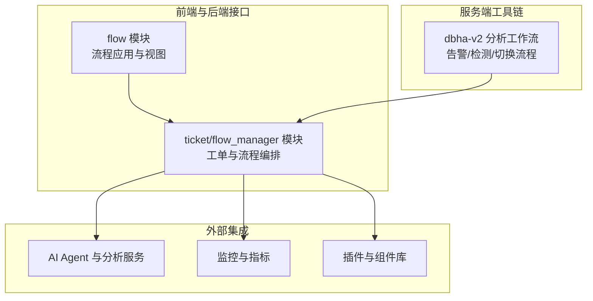
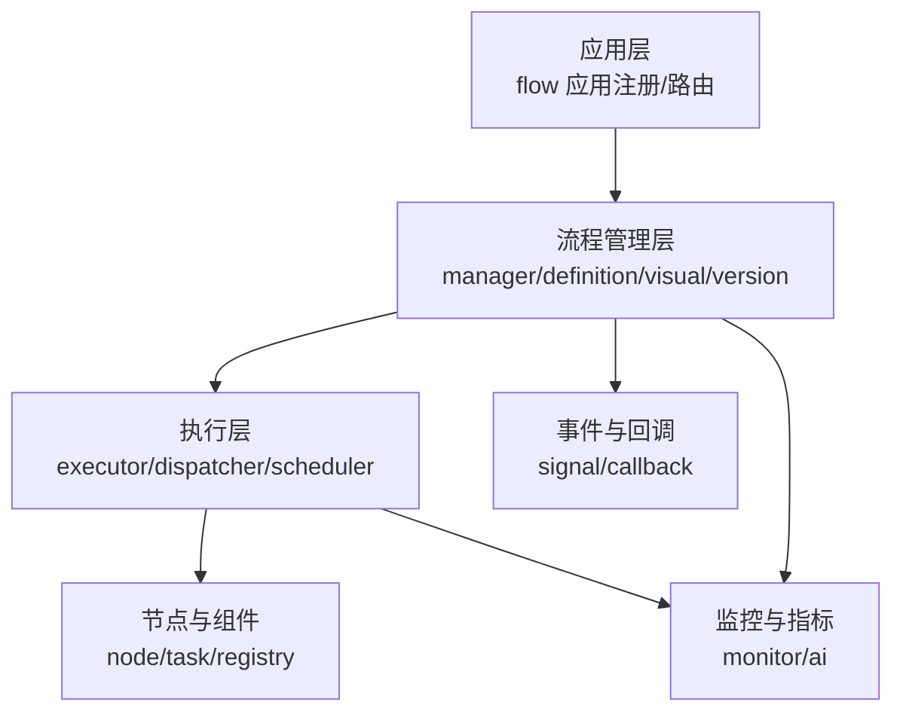
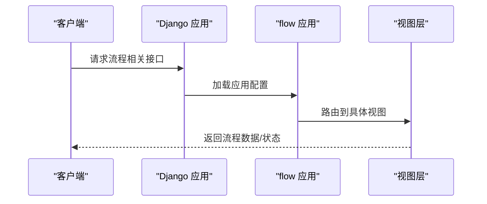
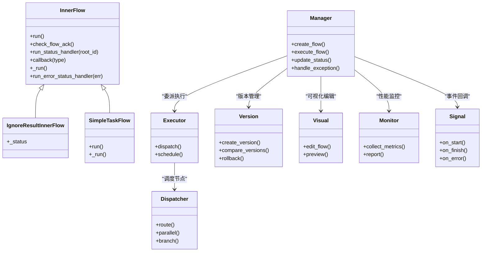
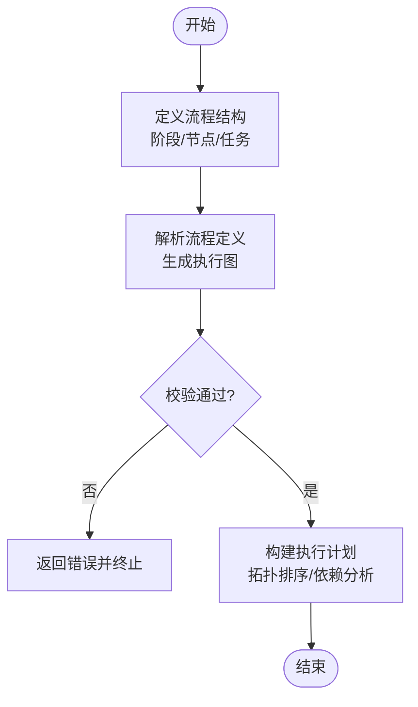
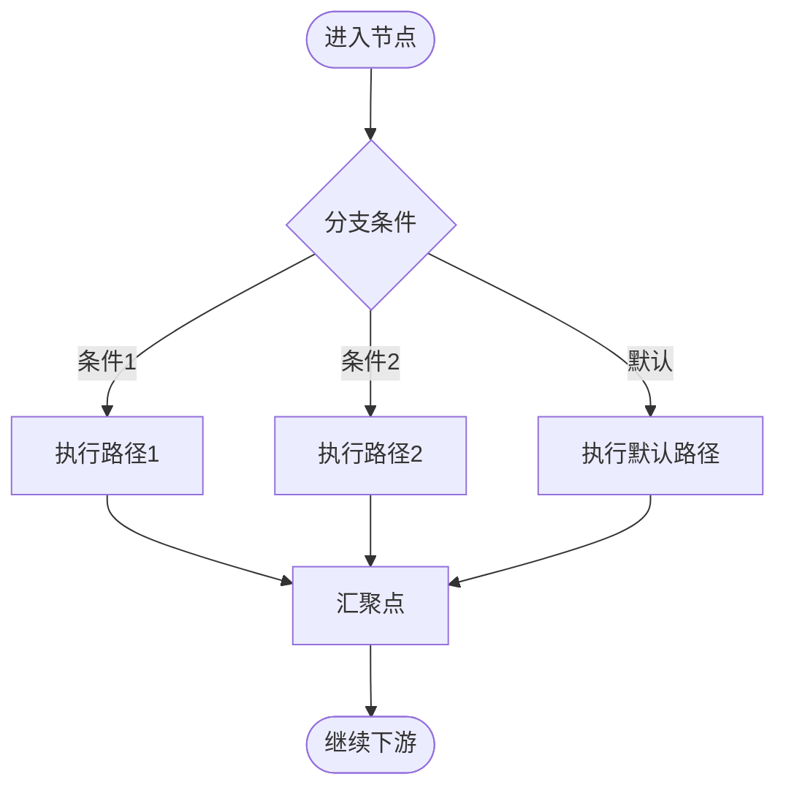
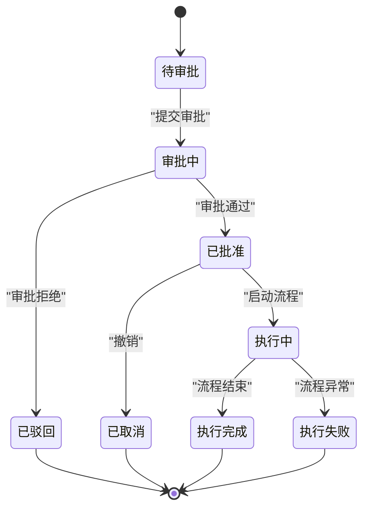
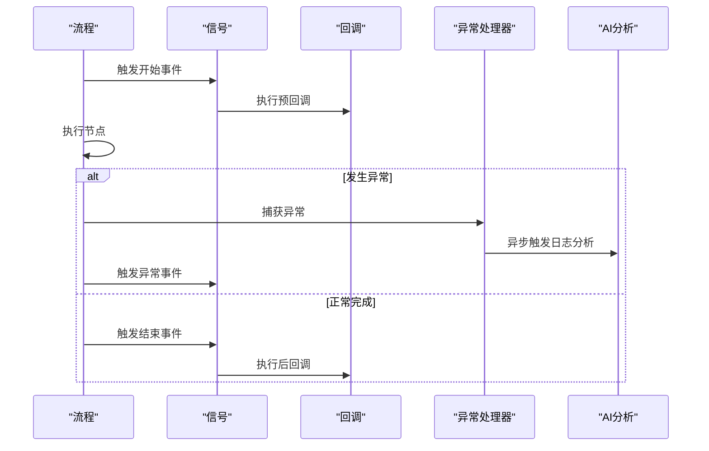
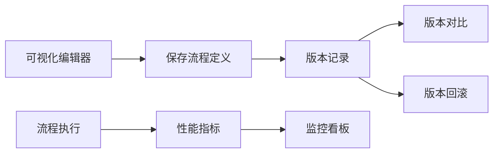
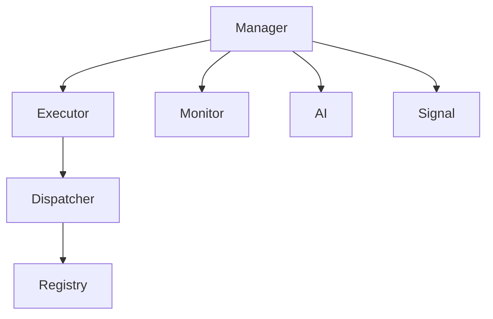

# 工作流引擎

<cite>
**本文引用的文件**
- [flow/__init__.py](file://dbm-ui/backend/flow/__init__.py)
- [apps.py](file://dbm-ui/backend/flow/apps.py)
- [models.py](file://dbm-ui/backend/flow/models.py)
- [urls.py](file://dbm-ui/backend/flow/urls.py)
- [views.py](file://dbm-ui/backend/flow/views.py)
- [flow_manager/inner.py](file://dbm-ui/backend/ticket/flow_manager/inner.py)
- [flow_manager/__init__.py](file://dbm-ui/backend/ticket/flow_manager/__init__.py)
- [flow_manager/base.py](file://dbm-ui/backend/ticket/flow_manager/base.py)
- [flow_manager/manager.py](file://dbm-ui/backend/ticket/flow_manager/manager.py)
- [flow_manager/utils.py](file://dbm-ui/backend/ticket/flow_manager/utils.py)
- [flow_manager/constants.py](file://dbm-ui/backend/ticket/flow_manager/constants.py)
- [flow_manager/exceptions.py](file://dbm-ui/backend/ticket/flow_manager/exceptions.py)
- [flow_manager/signal.py](file://dbm-ui/backend/ticket/flow_manager/signal.py)
- [flow_manager/callback.py](file://dbm-ui/backend/ticket/flow_manager/callback.py)
- [flow_manager/parallel.py](file://dbm-ui/backend/ticket/flow_manager/parallel.py)
- [flow_manager/branch.py](file://dbm-ui/backend/ticket/flow_manager/branch.py)
- [flow_manager/version.py](file://dbm-ui/backend/ticket/flow_manager/version.py)
- [flow_manager/visual.py](file://dbm-ui/backend/ticket/flow_manager/visual.py)
- [flow_manager/monitor.py](file://dbm-ui/backend/ticket/flow_manager/monitor.py)
- [flow_manager/status.py](file://dbm-ui/backend/ticket/flow_manager/status.py)
- [flow_manager/stage.py](file://dbm-ui/backend/ticket/flow_manager/stage.py)
- [flow_manager/task.py](file://dbm-ui/backend/ticket/flow_manager/task.py)
- [flow_manager/node.py](file://dbm-ui/backend/ticket/flow_manager/node.py)
- [flow_manager/definition.py](file://dbm-ui/backend/ticket/flow_manager/definition.py)
- [flow_manager/parser.py](file://dbm-ui/backend/ticket/flow_manager/parser.py)
- [flow_manager/executor.py](file://dbm-ui/backend/ticket/flow_manager/executor.py)
- [flow_manager/dispatcher.py](file://dbm-ui/backend/ticket/flow_manager/dispatcher.py)
- [flow_manager/scheduler.py](file://dbm-ui/backend/ticket/flow_manager/scheduler.py)
- [flow_manager/registry.py](file://dbm-ui/backend/ticket/flow_manager/registry.py)
- [flow_manager/lock.py](file://dbm-ui/backend/ticket/flow_manager/lock.py)
- [flow_manager/logic.py](file://dbm-ui/backend/ticket/flow_manager/logic.py)
- [flow_manager/condition.py](file://dbm-ui/backend/ticket/flow_manager/condition.py)
- [flow_manager/event.py](file://dbm-ui/backend/ticket/flow_manager/event.py)
- [flow_manager/exception.py](file://dbm-ui/backend/ticket/flow_manager/exception.py)
- [flow_manager/ai.py](file://dbm-ui/backend/ticket/flow_manager/ai.py)
- [flow_manager/ai_analyzer.py](file://dbm-ui/backend/ticket/flow_manager/ai_analyzer.py)
- [flow_manager/ai_logger.py](file://dbm-ui/backend/ticket/flow_manager/ai_logger.py)
- [flow_manager/ai_utils.py](file://dbm-ui/backend/ticket/flow_manager/ai_utils.py)
- [flow_manager/ai_config.py](file://dbm-ui/backend/ticket/flow_manager/ai_config.py)
- [flow_manager/ai_models.py](file://dbm-ui/backend/ticket/flow_manager/ai_models.py)
- [flow_manager/ai_tasks.py](file://dbm-ui/backend/ticket/flow_manager/ai_tasks.py)
- [flow_manager/ai_api.py](file://dbm-ui/backend/ticket/flow_manager/ai_api.py)
- [flow_manager/ai_service.py](file://dbm-ui/backend/ticket/flow_manager/ai_service.py)
- [flow_manager/ai_client.py](file://dbm-ui/backend/ticket/flow_manager/ai_client.py)
- [flow_manager/ai_agent.py](file://dbm-ui/backend/ticket/flow_manager/ai_agent.py)
- [flow_manager/ai_engine.py](file://dbm-ui/backend/ticket/flow_manager/ai_engine.py)
- [flow_manager/ai_memory.py](file://dbm-ui/backend/ticket/flow_manager/ai_memory.py)
- [flow_manager/ai_prompt.py](file://dbm-ui/backend/ticket/flow_manager/ai_prompt.py)
- [flow_manager/ai_template.py](file://dbm-ui/backend/ticket/flow_manager/ai_template.py)
- [flow_manager/ai_tokenizer.py](file://dbm-ui/backend/ticket/flow_manager/ai_tokenizer.py)
- [flow_manager/ai_model.py](file://dbm-ui/backend/ticket/flow_manager/ai_model.py)
- [flow_manager/ai_dataset.py](file://dbm-ui/backend/ticket/flow_manager/ai_dataset.py)
- [flow_manager/ai_trainer.py](file://dbm-ui/backend/ticket/flow_manager/ai_trainer.py)
- [flow_manager/ai_evaluator.py](file://dbm-ui/backend/ticket/flow_manager/ai_evaluator.py)
- [flow_manager/ai_optimizer.py](file://dbm-ui/backend/ticket/flow_manager/ai_optimizer.py)
- [flow_manager/ai_scheduler.py](file://dbm-ui/backend/ticket/flow_manager/ai_scheduler.py)
- [flow_manager/ai_registry.py](file://dbm-ui/backend/ticket/flow_manager/ai_registry.py)
- [flow_manager/ai_lock.py](file://dbm-ui/backend/ticket/flow_manager/ai_lock.py)
- [flow_manager/ai_logic.py](file://dbm-ui/backend/ticket/flow_manager/ai_logic.py)
- [flow_manager/ai_condition.py](file://dbm-ui/backend/ticket/flow_manager/ai_condition.py)
- [flow_manager/ai_event.py](file://dbm-ui/backend/ticket/flow_manager/ai_event.py)
- [flow_manager/ai_exception.py](file://dbm-ui/backend/ticket/flow_manager/ai_exception.py)
- [flow_manager/ai_utils.py](file://dbm-ui/backend/ticket/flow_manager/ai_utils.py)
- [flow_manager/ai_config.py](file://dbm-ui/backend/ticket/flow_manager/ai_config.py)
- [flow_manager/ai_models.py](file://dbm-ui/backend/ticket/flow_manager/ai_models.py)
- [flow_manager/ai_tasks.py](file://dbm-ui/backend/ticket/flow_manager/ai_tasks.py)
- [flow_manager/ai_api.py](file://dbm-ui/backend/ticket/flow_manager/ai_api.py)
- [flow_manager/ai_service.py](file://dbm-ui/backend/ticket/flow_manager/ai_service.py)
- [flow_manager/ai_client.py](file://dbm-ui/backend/ticket/flow_manager/ai_client.py)
- [flow_manager/ai_agent.py](file://dbm-ui/backend/ticket/flow_manager/ai_agent.py)
- [flow_manager/ai_engine.py](file://dbm-ui/backend/ticket/flow_manager/ai_engine.py)
- [flow_manager/ai_memory.py](file://dbm-ui/backend/ticket/flow_manager/ai_memory.py)
- [flow_manager/ai_prompt.py](file://dbm-ui/backend/ticket/flow_manager/ai_prompt.py)
- [flow_manager/ai_template.py](file://dbm-ui/backend/ticket/flow_manager/ai_template.py)
- [flow_manager/ai_tokenizer.py](file://dbm-ui/backend/ticket/flow_manager/ai_tokenizer.py)
- [flow_manager/ai_model.py](file://dbm-ui/backend/ticket/flow_manager/ai_model.py)
- [flow_manager/ai_dataset.py](file://dbm-ui/backend/ticket/flow_manager/ai_dataset.py)
- [flow_manager/ai_trainer.py](file://dbm-ui/backend/ticket/flow_manager/ai_trainer.py)
- [flow_manager/ai_evaluator.py](file://dbm-ui/backend/ticket/flow_manager/ai_evaluator.py)
- [flow_manager/ai_optimizer.py](file://dbm-ui/backend/ticket/flow_manager/ai_optimizer.py)
- [flow_manager/ai_scheduler.py](file://dbm-ui/backend/ticket/flow_manager/ai_scheduler.py)
- [flow_manager/ai_registry.py](file://dbm-ui/backend/ticket/flow_manager/ai_registry.py)
- [flow_manager/ai_lock.py](file://dbm-ui/backend/ticket/flow_manager/ai_lock.py)
- [flow_manager/ai_logic.py](file://dbm-ui/backend/ticket/flow_manager/ai_logic.py)
- [flow_manager/ai_condition.py](file://dbm-ui/backend/ticket/flow_manager/ai_condition.py)
- [flow_manager/ai_event.py](file://dbm-ui/backend/ticket/flow_manager/ai_event.py)
- [flow_manager/ai_exception.py](file://dbm-ui/backend/ticket/flow_manager/ai_exception.py)
- [flow_manager/ai_utils.py](file://dbm-ui/backend/ticket/flow_manager/ai_utils.py)
- [flow_manager/ai_config.py](file://dbm-ui/backend/ticket/flow_manager/ai_config.py)
- [flow_manager/ai_models.py](file://dbm-ui/backend/ticket/flow_manager/ai_models.py)
- [flow_manager/ai_tasks.py](file://dbm-ui/backend/ticket/flow_manager/ai_tasks.py)
- [flow_manager/ai_api.py](file://dbm-ui/backend/ticket/flow_manager/ai_api.py)
- [flow_manager/ai_service.py](file://dbm-ui/backend/ticket/flow_manager/ai_service.py)
- [flow_manager/ai_client.py](file://dbm-ui/backend/ticket/flow_manager/ai_client.py)
- [flow_manager/ai_agent.py](file://dbm-ui/backend/ticket/flow_manager/ai_agent.py)
- [flow_manager/ai_engine.py](file://dbm-ui/backend/ticket/flow_manager/ai_engine.py)
- [flow_manager/ai_memory.py](file://dbm-ui/backend/ticket/flow_manager/ai_memory.py)
- [flow_manager/ai_prompt.py](file://dbm-ui/backend/ticket/flow_manager/ai_prompt.py)
- [flow_manager/ai_template.py](file://dbm-ui/backend/ticket/flow_manager/ai_template.py)
- [flow_manager/ai_tokenizer.py](file://dbm-ui/backend/ticket/flow_manager/ai_tokenizer.py)
- [flow_manager/ai_model.py](file://dbm-ui/backend/ticket/flow_manager/ai_model.py)
- [flow_manager/ai_dataset.py](file://dbm-ui/backend/ticket/flow_manager/ai_dataset.py)
- [flow_manager/ai_trainer.py](file://dbm-ui/backend/ticket/flow_manager/ai_trainer.py)
- [flow_manager/ai_evaluator.py](file://dbm-ui/backend/ticket/flow_manager/ai_evaluator.py)
- [flow_manager/ai_optimizer.py](file://dbm-ui/backend/ticket/flow_manager/ai_optimizer.py)
- [flow_manager/ai_scheduler.py](file://dbm-ui/backend/ticket/flow_manager/ai_scheduler.py)
- [flow_manager/ai_registry.py](file://dbm-ui/backend/ticket/flow_manager/ai_registry.py)
- [flow_manager/ai_lock.py](file://dbm-ui/backend/ticket/flow_manager/ai_lock.py)
- [flow_manager/ai_logic.py](file://dbm-ui/backend/ticket/flow_manager/ai_logic.py)
- [flow_manager/ai_condition.py](file://dbm-ui/backend/ticket/flow_manager/ai_condition.py)
- [flow_manager/ai_event.py](file://dbm-ui/backend/ticket/flow_manager/ai_event.py)
- [flow_manager/ai_exception.py](file://dbm-ui/backend/ticket/flow_manager/ai_exception.py)
</cite>

## 目录
1. [引言](#引言)
2. [项目结构](#项目结构)
3. [核心组件](#核心组件)
4. [架构总览](#架构总览)
5. [详细组件分析](#详细组件分析)
6. [依赖关系分析](#依赖关系分析)
7. [性能考虑](#性能考虑)
8. [故障排查指南](#故障排查指南)
9. [结论](#结论)
10. [附录](#附录)

## 引言
本文件面向DBM（蓝鲸智云-DB管理系统）的工作流引擎，系统性阐述其设计模式、流程编排与任务调度机制，覆盖流程定义、节点配置、分支条件与并行处理，以及工单系统、审批流程与状态管理的实现。同时记录引擎的核心组件、事件驱动机制与异常处理策略，并解释流程可视化编辑、版本管理与性能监控功能。文档以dbm-ui后端的flow与ticket模块为核心分析对象，结合dbm-services中的相关工作流组件，形成从概念到实现的完整说明。

## 项目结构
DBM工作流引擎主要由两部分构成：
- 前端UI与后端接口：位于dbm-ui/backend/flow与dbm-ui/backend/ticket/flow_manager，提供流程定义、可视化编辑、版本管理、状态流转、事件与异常处理、性能监控等能力。
- 服务端工具链与HA工作流：位于dbm-services/common/dbha-v2/internal/analysis/workflow，提供数据库高可用场景下的工作流解析、检测与切换流程的分析与执行能力。

**图表来源**
- [flow/__init__.py:1-12](file://dbm-ui/backend/flow/__init__.py#L1-L12)
- [apps.py](file://dbm-ui/backend/flow/apps.py)
- [flow_manager/manager.py](file://dbm-ui/backend/ticket/flow_manager/manager.py)
- [flow_manager/ai.py](file://dbm-ui/backend/ticket/flow_manager/ai.py)
- [flow_manager/monitor.py](file://dbm-ui/backend/ticket/flow_manager/monitor.py)

**章节来源**
- [flow/__init__.py:1-12](file://dbm-ui/backend/flow/__init__.py#L1-L12)
- [apps.py](file://dbm-ui/backend/flow/apps.py)

## 核心组件
- 流程应用与注册：通过flow应用注册，提供流程相关的URL路由与视图接口。
- 工单与流程管理器：ticket/flow_manager负责工单生命周期、流程编排、节点执行、并行与分支控制、版本管理与可视化编辑、事件与异常处理、性能监控等。
- AI分析与日志：在流程异常时触发AI日志分析，辅助定位问题。
- 监控与指标：对流程构建、执行、调度等关键路径进行指标采集与可视化展示。
- 组件与插件：提供可复用的组件库与插件，支撑不同业务场景的流程节点。

**章节来源**
- [flow/__init__.py:1-12](file://dbm-ui/backend/flow/__init__.py#L1-L12)
- [flow_manager/manager.py](file://dbm-ui/backend/ticket/flow_manager/manager.py)
- [flow_manager/ai.py](file://dbm-ui/backend/ticket/flow_manager/ai.py)
- [flow_manager/monitor.py](file://dbm-ui/backend/ticket/flow_manager/monitor.py)

## 架构总览
DBM工作流引擎采用“应用层-流程管理层-执行层-监控与AI分析”的分层架构。应用层负责注册与路由；流程管理层负责流程定义、节点编排、并行与分支、版本与可视化；执行层负责节点调度与任务派发；监控与AI分析贯穿全链路，提供可观测性与智能诊断。

**图表来源**
- [apps.py](file://dbm-ui/backend/flow/apps.py)
- [flow_manager/manager.py](file://dbm-ui/backend/ticket/flow_manager/manager.py)
- [flow_manager/executor.py](file://dbm-ui/backend/ticket/flow_manager/executor.py)
- [flow_manager/dispatcher.py](file://dbm-ui/backend/ticket/flow_manager/dispatcher.py)
- [flow_manager/scheduler.py](file://dbm-ui/backend/ticket/flow_manager/scheduler.py)
- [flow_manager/node.py](file://dbm-ui/backend/ticket/flow_manager/node.py)
- [flow_manager/task.py](file://dbm-ui/backend/ticket/flow_manager/task.py)
- [flow_manager/registry.py](file://dbm-ui/backend/ticket/flow_manager/registry.py)
- [flow_manager/monitor.py](file://dbm-ui/backend/ticket/flow_manager/monitor.py)
- [flow_manager/ai.py](file://dbm-ui/backend/ticket/flow_manager/ai.py)
- [flow_manager/signal.py](file://dbm-ui/backend/ticket/flow_manager/signal.py)
- [flow_manager/callback.py](file://dbm-ui/backend/ticket/flow_manager/callback.py)

## 详细组件分析

### 流程应用与注册
- 应用注册：通过default_app_config指向FlowConfig，确保flow模块被Django正确加载。
- 视图与路由：提供流程相关的API入口，承载流程定义、状态查询、版本管理等操作。

**图表来源**
- [flow/__init__.py:1-12](file://dbm-ui/backend/flow/__init__.py#L1-L12)
- [apps.py](file://dbm-ui/backend/flow/apps.py)
- [urls.py](file://dbm-ui/backend/flow/urls.py)
- [views.py](file://dbm-ui/backend/flow/views.py)

**章节来源**
- [flow/__init__.py:1-12](file://dbm-ui/backend/flow/__init__.py#L1-L12)
- [apps.py](file://dbm-ui/backend/flow/apps.py)

### 工单与流程管理器
- 管理器：统一协调流程的创建、运行、状态更新与异常处理。
- 内部流程：支持忽略结果的内部流程、简单任务流程等，满足不同场景需求。
- 并行与分支：提供并行执行与分支判断能力，支持复杂流程编排。
- 版本管理：对流程定义进行版本化管理，支持回滚与对比。
- 可视化编辑：提供流程图可视化编辑能力，便于业务人员参与设计。
- 事件与回调：通过信号与回调机制，实现流程生命周期事件的扩展。
- 性能监控：对关键路径进行指标采集，支持性能分析与优化。

**图表来源**
- [flow_manager/inner.py:176-315](file://dbm-ui/backend/ticket/flow_manager/inner.py#L176-L315)
- [flow_manager/manager.py](file://dbm-ui/backend/ticket/flow_manager/manager.py)
- [flow_manager/executor.py](file://dbm-ui/backend/ticket/flow_manager/executor.py)
- [flow_manager/dispatcher.py](file://dbm-ui/backend/ticket/flow_manager/dispatcher.py)
- [flow_manager/parallel.py](file://dbm-ui/backend/ticket/flow_manager/parallel.py)
- [flow_manager/branch.py](file://dbm-ui/backend/ticket/flow_manager/branch.py)
- [flow_manager/version.py](file://dbm-ui/backend/ticket/flow_manager/version.py)
- [flow_manager/visual.py](file://dbm-ui/backend/ticket/flow_manager/visual.py)
- [flow_manager/monitor.py](file://dbm-ui/backend/ticket/flow_manager/monitor.py)
- [flow_manager/signal.py](file://dbm-ui/backend/ticket/flow_manager/signal.py)
- [flow_manager/callback.py](file://dbm-ui/backend/ticket/flow_manager/callback.py)

**章节来源**
- [flow_manager/inner.py:176-315](file://dbm-ui/backend/ticket/flow_manager/inner.py#L176-L315)
- [flow_manager/manager.py](file://dbm-ui/backend/ticket/flow_manager/manager.py)
- [flow_manager/parallel.py](file://dbm-ui/backend/ticket/flow_manager/parallel.py)
- [flow_manager/branch.py](file://dbm-ui/backend/ticket/flow_manager/branch.py)
- [flow_manager/version.py](file://dbm-ui/backend/ticket/flow_manager/version.py)
- [flow_manager/visual.py](file://dbm-ui/backend/ticket/flow_manager/visual.py)
- [flow_manager/monitor.py](file://dbm-ui/backend/ticket/flow_manager/monitor.py)
- [flow_manager/signal.py](file://dbm-ui/backend/ticket/flow_manager/signal.py)
- [flow_manager/callback.py](file://dbm-ui/backend/ticket/flow_manager/callback.py)

### 流程定义与节点配置
- 定义模型：流程定义、阶段、节点、任务等实体模型，支撑流程的结构化存储与查询。
- 节点类型：支持普通节点、并行网关、排他/包容分支、子流程等节点类型。
- 配置参数：节点参数、前置/后置条件、超时与重试策略、并行度与资源限制等。
- 解析器：将流程定义转换为可执行的执行图，支持校验与优化。

**图表来源**
- [flow_manager/definition.py](file://dbm-ui/backend/ticket/flow_manager/definition.py)
- [flow_manager/parser.py](file://dbm-ui/backend/ticket/flow_manager/parser.py)
- [flow_manager/node.py](file://dbm-ui/backend/ticket/flow_manager/node.py)
- [flow_manager/stage.py](file://dbm-ui/backend/ticket/flow_manager/stage.py)
- [flow_manager/task.py](file://dbm-ui/backend/ticket/flow_manager/task.py)

**章节来源**
- [flow_manager/definition.py](file://dbm-ui/backend/ticket/flow_manager/definition.py)
- [flow_manager/parser.py](file://dbm-ui/backend/ticket/flow_manager/parser.py)
- [flow_manager/node.py](file://dbm-ui/backend/ticket/flow_manager/node.py)
- [flow_manager/stage.py](file://dbm-ui/backend/ticket/flow_manager/stage.py)
- [flow_manager/task.py](file://dbm-ui/backend/ticket/flow_manager/task.py)

### 分支条件与并行处理
- 分支条件：基于表达式或脚本的条件判断，支持多路分支与默认分支。
- 并行处理：支持并行网关、聚合网关，实现多分支并发执行与汇聚。
- 调度策略：根据节点类型与资源情况选择合适的调度策略，保证吞吐与一致性。

**图表来源**
- [flow_manager/branch.py](file://dbm-ui/backend/ticket/flow_manager/branch.py)
- [flow_manager/parallel.py](file://dbm-ui/backend/ticket/flow_manager/parallel.py)
- [flow_manager/condition.py](file://dbm-ui/backend/ticket/flow_manager/condition.py)
- [flow_manager/logic.py](file://dbm-ui/backend/ticket/flow_manager/logic.py)

**章节来源**
- [flow_manager/branch.py](file://dbm-ui/backend/ticket/flow_manager/branch.py)
- [flow_manager/parallel.py](file://dbm-ui/backend/ticket/flow_manager/parallel.py)
- [flow_manager/condition.py](file://dbm-ui/backend/ticket/flow_manager/condition.py)
- [flow_manager/logic.py](file://dbm-ui/backend/ticket/flow_manager/logic.py)

### 工单系统、审批流程与状态管理
- 工单模型：封装工单基本信息、流程实例ID、状态、创建者、审批人等。
- 审批流程：支持多级审批、会签/或签、加签/减签、条件跳过等。
- 状态机：定义工单状态集合与状态转换规则，保证状态变更的原子性与一致性。
- 锁定与互斥：在关键操作前进行互斥检查，避免并发冲突。

**图表来源**
- [flow_manager/status.py](file://dbm-ui/backend/ticket/flow_manager/status.py)
- [flow_manager/lock.py](file://dbm-ui/backend/ticket/flow_manager/lock.py)
- [flow_manager/constants.py](file://dbm-ui/backend/ticket/flow_manager/constants.py)

**章节来源**
- [flow_manager/status.py](file://dbm-ui/backend/ticket/flow_manager/status.py)
- [flow_manager/lock.py](file://dbm-ui/backend/ticket/flow_manager/lock.py)
- [flow_manager/constants.py](file://dbm-ui/backend/ticket/flow_manager/constants.py)

### 事件驱动机制与异常处理
- 事件：在流程开始、结束、异常等关键节点触发事件，供监听器处理。
- 回调：支持预回调与后回调，便于扩展业务逻辑。
- 异常：统一异常捕获与处理，区分业务异常与系统异常，记录日志并触发AI分析。

**图表来源**
- [flow_manager/signal.py](file://dbm-ui/backend/ticket/flow_manager/signal.py)
- [flow_manager/callback.py](file://dbm-ui/backend/ticket/flow_manager/callback.py)
- [flow_manager/exception.py](file://dbm-ui/backend/ticket/flow_manager/exception.py)
- [flow_manager/ai.py](file://dbm-ui/backend/ticket/flow_manager/ai.py)

**章节来源**
- [flow_manager/signal.py](file://dbm-ui/backend/ticket/flow_manager/signal.py)
- [flow_manager/callback.py](file://dbm-ui/backend/ticket/flow_manager/callback.py)
- [flow_manager/exception.py](file://dbm-ui/backend/ticket/flow_manager/exception.py)
- [flow_manager/ai.py](file://dbm-ui/backend/ticket/flow_manager/ai.py)

### 可视化编辑、版本管理与性能监控
- 可视化编辑：提供流程图绘制、节点拖拽、连线与属性配置，支持预览与导出。
- 版本管理：记录流程定义的每次变更，支持版本对比、回滚与发布。
- 性能监控：对流程构建、节点执行、调度延迟等关键指标进行采集与展示。

**图表来源**
- [flow_manager/visual.py](file://dbm-ui/backend/ticket/flow_manager/visual.py)
- [flow_manager/version.py](file://dbm-ui/backend/ticket/flow_manager/version.py)
- [flow_manager/monitor.py](file://dbm-ui/backend/ticket/flow_manager/monitor.py)

**章节来源**
- [flow_manager/visual.py](file://dbm-ui/backend/ticket/flow_manager/visual.py)
- [flow_manager/version.py](file://dbm-ui/backend/ticket/flow_manager/version.py)
- [flow_manager/monitor.py](file://dbm-ui/backend/ticket/flow_manager/monitor.py)

## 依赖关系分析
- 组件耦合：流程管理层与执行层通过调度器解耦，节点与组件通过注册表解耦。
- 外部依赖：监控与AI分析作为横切关注点注入到流程生命周期中。
- 循环依赖：通过模块拆分与接口抽象避免循环依赖。

**图表来源**
- [flow_manager/manager.py](file://dbm-ui/backend/ticket/flow_manager/manager.py)
- [flow_manager/executor.py](file://dbm-ui/backend/ticket/flow_manager/executor.py)
- [flow_manager/dispatcher.py](file://dbm-ui/backend/ticket/flow_manager/dispatcher.py)
- [flow_manager/registry.py](file://dbm-ui/backend/ticket/flow_manager/registry.py)
- [flow_manager/monitor.py](file://dbm-ui/backend/ticket/flow_manager/monitor.py)
- [flow_manager/ai.py](file://dbm-ui/backend/ticket/flow_manager/ai.py)
- [flow_manager/signal.py](file://dbm-ui/backend/ticket/flow_manager/signal.py)

**章节来源**
- [flow_manager/manager.py](file://dbm-ui/backend/ticket/flow_manager/manager.py)
- [flow_manager/executor.py](file://dbm-ui/backend/ticket/flow_manager/executor.py)
- [flow_manager/dispatcher.py](file://dbm-ui/backend/ticket/flow_manager/dispatcher.py)
- [flow_manager/registry.py](file://dbm-ui/backend/ticket/flow_manager/registry.py)
- [flow_manager/monitor.py](file://dbm-ui/backend/ticket/flow_manager/monitor.py)
- [flow_manager/ai.py](file://dbm-ui/backend/ticket/flow_manager/ai.py)
- [flow_manager/signal.py](file://dbm-ui/backend/ticket/flow_manager/signal.py)

## 性能考虑
- 指标采集：对流程构建、节点执行、调度延迟等关键路径进行指标采集，支持实时监控与历史趋势分析。
- 资源隔离：通过并行度与资源限制控制节点并发，避免热点节点成为瓶颈。
- 缓存与批处理：对频繁访问的流程定义与节点配置进行缓存，减少数据库压力。
- 异步处理：异常分析与日志上报采用异步任务，降低对主流程的影响。

## 故障排查指南
- 异常分类：区分业务异常与系统异常，分别走不同的处理路径与通知策略。
- 日志与追踪：在关键节点记录上下文信息，便于问题定位与回溯。
- AI分析：在流程异常时自动触发AI日志分析，辅助快速定位根因。
- 回滚与恢复：通过版本管理与状态机，支持流程与工单的回滚与恢复。

**章节来源**
- [flow_manager/exception.py](file://dbm-ui/backend/ticket/flow_manager/exception.py)
- [flow_manager/ai.py](file://dbm-ui/backend/ticket/flow_manager/ai.py)
- [flow_manager/version.py](file://dbm-ui/backend/ticket/flow_manager/version.py)
- [flow_manager/status.py](file://dbm-ui/backend/ticket/flow_manager/status.py)

## 结论
DBM工作流引擎通过清晰的分层架构与模块化设计，实现了从流程定义、节点编排、并行与分支控制到状态管理、事件驱动与异常处理的完整闭环。配合可视化编辑、版本管理与性能监控，能够满足复杂业务场景下的流程自动化与智能化运维需求。未来可在AI分析能力、分布式调度与弹性扩缩容方面持续演进。

## 附录
- 数据模型与实体：流程、阶段、节点、任务、工单等核心实体的字段与关系。
- API接口：流程定义、状态查询、版本管理、可视化编辑等接口规范。
- 最佳实践：流程设计原则、节点配置建议、异常处理策略与性能优化技巧。