# 数据库管理界面

<cite>
**本文引用的文件**
- [DBM_README.md](file://dbm-ui/DBM_README.md)
- [manage.py](file://dbm-ui/manage.py)
- [readme.md](file://readme.md)
- [readme_en.md](file://readme_en.md)
- [bk_dataview/grafana/authentication.py](file://dbm-ui/backend/bk_dataview/grafana/authentication.py)
- [bk_dataview/grafana/router.py](file://dbm-ui/backend/bk_dataview/grafana/router.py)
- [bk_dataview/grafana/client.py](file://dbm-ui/backend/bk_dataview/grafana/client.py)
- [bk_dataview/grafana/promsql.py](file://dbm-ui/backend/bk_dataview/grafana/promsql.py)
- [bk_dataview/grafana/models.py](file://dbm-ui/backend/bk_dataview/grafana/models.py)
- [bk_dataview/grafana/backends/api.py](file://dbm-ui/backend/bk_dataview/grafana/backends/api.py)
- [bk_dataview/grafana/backends/db.py](file://dbm-ui/backend/bk_dataview/grafana/backends/db.py)
- [bk_web/middleware.py](file://dbm-ui/backend/bk_web/middleware.py)
- [bk_web/exceptions.py](file://dbm-ui/backend/bk_web/exceptions.py)
- [configuration/views.py](file://dbm-ui/backend/configuration/views.py)
- [configuration/urls.py](file://dbm-ui/backend/configuration/urls.py)
- [configuration/serializers.py](file://dbm-ui/backend/configuration/serializers.py)
- [db_monitor/views.py](file://dbm-ui/backend/db_monitor/views.py)
- [db_monitor/urls.py](file://dbm-ui/backend/db_monitor/urls.py)
- [db_monitor/serializers.py](file://dbm-ui/backend/db_monitor/serializers.py)
- [db_proxy/views.py](file://dbm-ui/backend/db_proxy/views.py)
- [db_proxy/urls.py](file://dbm-ui/backend/db_proxy/urls.py)
- [db_proxy/reverse_api/views.py](file://dbm-ui/backend/db_proxy/reverse_api/views.py)
- [db_proxy/frontend_views/views.py](file://dbm-ui/backend/db_proxy/frontend_views/views.py)
- [db_services/mysql/__init__.py](file://dbm-ui/backend/db_services/mysql/__init__.py)
- [db_services/mysql/views.py](file://dbm-ui/backend/db_services/mysql/views.py)
- [db_services/mysql/urls.py](file://dbm-ui/backend/db_services/mysql/urls.py)
- [db_services/redis/__init__.py](file://dbm-ui/backend/db_services/redis/__init__.py)
- [db_services/redis/views.py](file://dbm-ui/backend/db_services/redis/views.py)
- [db_services/redis/urls.py](file://dbm-ui/backend/db_services/redis/urls.py)
- [db_services/mongodb/__init__.py](file://dbm-ui/backend/db_services/mongodb/__init__.py)
- [db_services/mongodb/views.py](file://dbm-ui/backend/db_services/mongodb/views.py)
- [db_services/mongodb/urls.py](file://dbm-ui/backend/db_services/mongodb/urls.py)
- [db_services/oracle/__init__.py](file://dbm-ui/backend/db_services/oracle/__init__.py)
- [db_services/oracle/views.py](file://dbm-ui/backend/db_services/oracle/views.py)
- [db_services/oracle/urls.py](file://dbm-ui/backend/db_services/oracle/urls.py)
- [db_services/sqlserver/__init__.py](file://dbm-ui/backend/db_services/sqlserver/__init__.py)
- [db_services/sqlserver/views.py](file://dbm-ui/backend/db_services/sqlserver/views.py)
- [db_services/sqlserver/urls.py](file://dbm-ui/backend/db_services/sqlserver/urls.py)
- [flow/views.py](file://dbm-ui/backend/flow/views.py)
- [flow/urls.py](file://dbm-ui/backend/flow/urls.py)
- [ticket/views.py](file://dbm-ui/backend/ticket/views.py)
- [ticket/urls.py](file://dbm-ui/backend/ticket/urls.py)
- [components/dbconfig/views.py](file://dbm-ui/backend/components/dbconfig/views.py)
- [components/dbconfig/urls.py](file://dbm-ui/backend/components/dbconfig/urls.py)
- [components/dbconfig/serializers.py](file://dbm-ui/backend/components/dbconfig/serializers.py)
- [components/mysql_backup/views.py](file://dbm-ui/backend/components/mysql_backup/views.py)
- [components/mysql_backup/urls.py](file://dbm-ui/backend/components/mysql_backup/urls.py)
- [components/mysql_partition/views.py](file://dbm-ui/backend/components/mysql_partition/views.py)
- [components/mysql_partition/urls.py](file://dbm-ui/backend/components/mysql_partition/urls.py)
- [components/mysql_priv_manager/views.py](file://dbm-ui/backend/components/mysql_priv_manager/views.py)
- [components/mysql_priv_manager/urls.py](file://dbm-ui/backend/components/mysql_priv_manager/urls.py)
- [components/dbresource/views.py](file://dbm-ui/backend/components/dbresource/views.py)
- [components/dbresource/urls.py](file://dbm-ui/backend/components/dbresource/urls.py)
- [components/db_name_service/views.py](file://dbm-ui/backend/components/db_name_service/views.py)
- [components/db_name_service/urls.py](file://dbm-ui/backend/components/dbresource/urls.py)
- [components/db_remote_service/views.py](file://dbm-ui/backend/components/db_remote_service/views.py)
- [components/db_remote_service/urls.py](file://dbm-ui/backend/components/db_remote_service/urls.py)
- [components/dns/views.py](file://dbm-ui/backend/components/dns/views.py)
- [components/dns/urls.py](file://dbm-ui/backend/components/dns/urls.py)
- [components/job/views.py](file://dbm-ui/backend/components/job/views.py)
- [components/job/urls.py](file://dbm-ui/backend/components/job/urls.py)
- [components/itsm/views.py](file://dbm-ui/backend/components/itsm/views.py)
- [components/itsm/urls.py](file://dbm-ui/backend/components/itsm/urls.py)
- [components/sops/views.py](file://dbm-ui/backend/components/sops/views.py)
- [components/sops/urls.py](file://dbm-ui/backend/components/sops/urls.py)
- [components/usermanage/views.py](file://dbm-ui/backend/components/usermanage/views.py)
- [components/usermanage/urls.py](file://dbm-ui/backend/components/usermanage/urls.py)
- [components/cmsi/views.py](file://dbm-ui/backend/components/cmsi/views.py)
- [components/cmsi/urls.py](file://dbm-ui/backend/components/cmsi/urls.py)
- [components/cos/views.py](file://dbm-ui/backend/components/cos/views.py)
- [components/cos/urls.py](file://dbm-ui/backend/components/cos/urls.py)
- [components/gcs/views.py](file://dbm-ui/backend/components/gcs/views.py)
- [components/gcs/urls.py](file://dbm-ui/backend/components/gcs/urls.py)
- [components/bklog/views.py](file://dbm-ui/backend/components/bklog/views.py)
- [components/bklog/urls.py](file://dbm-ui/backend/components/bklog/urls.py)
- [components/bkchat/views.py](file://dbm-ui/backend/components/bkchat/views.py)
- [components/bkchat/urls.py](file://dbm-ui/backend/components/bkchat/urls.py)
- [components/bkbase/views.py](file://dbm-ui/backend/components/bkbase/views.py)
- [components/bkbase/urls.py](file://dbm-ui/backend/components/bkbase/urls.py)
- [components/cc/views.py](file://dbm-ui/backend/components/cc/views.py)
- [components/cc/urls.py](file://dbm-ui/backend/components/cc/urls.py)
- [components/bknodeman/views.py](file://dbm-ui/backend/components/bknodeman/views.py)
- [components/bknodeman/urls.py](file://dbm-ui/backend/components/bknodeman/urls.py)
- [components/bkmonitorv3/views.py](file://dbm-ui/backend/components/bkmonitorv3/views.py)
- [components/bkmonitorv3/urls.py](file://dbm-ui/backend/components/bkmonitorv3/urls.py)
- [components/gse/views.py](file://dbm-ui/backend/components/gse/views.py)
- [components/gse/urls.py](file://dbm-ui/backend/components/gse/urls.py)
- [components/xwork/views.py](file://dbm-ui/backend/components/xwork/views.py)
- [components/xwork/urls.py](file://dbm-ui/backend/components/xwork/urls.py)
- [components/uwork/views.py](file://dbm-ui/backend/components/uwork/views.py)
- [components/uwork/urls.py](file://dbm-ui/backend/components/uwork/urls.py)
- [components/scr/views.py](file://dbm-ui/backend/components/scr/views.py)
- [components/scr/urls.py](file://dbm-ui/backend/components/scr/urls.py)
- [components/sql_import/views.py](file://dbm-ui/backend/components/sql_import/views.py)
- [components/sql_import/urls.py](file://dbm-ui/backend/components/sql_import/urls.py)
- [components/utils.py](file://dbm-ui/backend/components/utils.py)
- [components/proxy_api.py](file://dbm-ui/backend/components/proxy_api.py)
- [components/domains.py](file://dbm-ui/backend/components/domains.py)
- [components/constants.py](file://dbm-ui/backend/components/constants.py)
- [components/base.py](file://dbm-ui/backend/components/base.py)
- [components/bk.py](file://dbm-ui/backend/components/bk.py)
- [components/exception.py](file://dbm-ui/backend/components/exception.py)
- [components/exception.py](file://dbm-ui/backend/components/exception.py)
- [components/exception.py](file://dbm-ui/backend/components/exception.py)
- [components/exception.py](file://dbm-ui/backend/components/exception.py)
- [components/exception.py](file://dbm-ui/backend/components/exception.py)
- [components/exception.py](file://dbm-ui/backend/components/exception.py)
- [components/exception.py](file://dbm-ui/backend/components/exception.py)
- [components/exception.py](file://dbm-ui/backend/components/exception.py)
- [components/exception.py](file://dbm-ui/backend/components/exception.py)
- [components/exception.py](file://dbm-ui/backend/components/exception.py)
- [components/exception.py](file://dbm-ui/backend/components/exception.py)
- [components/exception.py](file://dbm-ui/backend/components/exception.py)
- [components/exception.py](file://dbm-ui/backend/components/exception.py)
- [components/exception.py](file://dbm-ui/backend/components/exception.py)
- [components/exception.py](file://dbm-ui/backend/components/exception.py)
- [components/exception.py](file://dbm-ui/backend/components/exception.py)
- [components/exception.py](file://dbm-ui/backend/components/exception.py)
- [components/exception.py](file://dbm-ui/backend/components/exception.py)
- [components/exception.py](file://dbm-ui/backend/components/exception.py)
- [components/exception.py](file://dbm-ui/backend/components/exception.py)
- [components/exception.py](file://dbm-ui/backend/components/exception.py)
- [components/exception.py](file://dbm-ui/backend/components/exception.py)
- [components/exception.py](file://dbm-ui/backend/components/exception.py)
- [components/exception.py](file://dbm-ui/backend/components/exception.py)
- [components/exception.py](file://dbm-ui/backend/components/exception.py)
- [components/exception.py](file://dbm-ui/backend/components/exception.py)
- [components/exception.py](file://dbm-ui/backend/components/exception.py)
- [components/exception.py](file://dbm-ui/backend/components/exception.py)
- [components/exception......](file://dbm-ui/backend/components/exception.py)
</cite>

## 目录
1. [简介](#简介)
2. [项目结构](#项目结构)
3. [核心组件](#核心组件)
4. [架构总览](#架构总览)
5. [详细组件分析](#详细组件分析)
6. [依赖关系分析](#依赖关系分析)
7. [性能考虑](#性能考虑)
8. [故障排查指南](#故障排查指南)
9. [结论](#结论)
10. [附录](#附录)

## 简介
本文件面向DBM数据库管理界面，系统性梳理MySQL、Redis、MongoDB、Oracle与SQLServer五类数据库的管理界面设计、操作流程与功能特性；覆盖集群部署、配置管理、监控告警、备份恢复等用户交互设计；阐述界面组件的状态管理、数据绑定与实时更新机制；并说明不同数据库类型在界面层的适配与功能差异。本文所有技术细节均基于仓库现有实现进行归纳总结。

## 项目结构
DBM后端采用Django框架，前端资源通过构建脚本集成到后端。核心模块包括：
- 业务服务层：db_services/mysql、db_services/redis、db_services/mongodb、db_services/oracle、db_services/sqlserver
- 配置与流程：configuration、flow、ticket
- 监控与代理：db_monitor、db_proxy
- 组件对接：components/*（与CMDB、作业平台、ITSMSOP等）
- 可视化与监控：bk_dataview/grafana（Grafana集成）

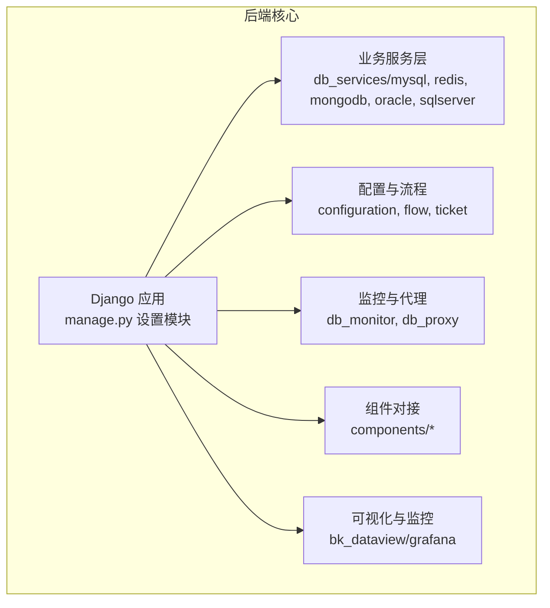

图表来源
- [manage.py:1-28](file://dbm-ui/manage.py#L1-L28)
- [db_services/mysql/__init__.py:1-11](file://dbm-ui/backend/db_services/mysql/__init__.py#L1-L11)
- [db_services/redis/__init__.py:1-11](file://dbm-ui/backend/db_services/redis/__init__.py#L1-L11)
- [db_services/mongodb/__init__.py:1-11](file://dbm-ui/backend/db_services/mongodb/__init__.py#L1-L11)
- [db_services/oracle/__init__.py:1-11](file://dbm-ui/backend/db_services/oracle/__init__.py#L1-L11)
- [db_services/sqlserver/__init__.py:1-11](file://dbm-ui/backend/db_services/sqlserver/__init__.py#L1-L11)
- [configuration/views.py](file://dbm-ui/backend/configuration/views.py)
- [flow/views.py](file://dbm-ui/backend/flow/views.py)
- [ticket/views.py](file://dbm-ui/backend/ticket/views.py)
- [db_monitor/views.py](file://dbm-ui/backend/db_monitor/views.py)
- [db_proxy/views.py](file://dbm-ui/backend/db_proxy/views.py)
- [components/dbconfig/views.py](file://dbm-ui/backend/components/dbconfig/views.py)
- [bk_dataview/grafana/authentication.py](file://dbm-ui/backend/bk_dataview/grafana/authentication.py)

章节来源
- [DBM_README.md:72-230](file://dbm-ui/DBM_README.md#L72-L230)
- [manage.py:1-28](file://dbm-ui/manage.py#L1-L28)
- [readme.md:1-35](file://readme.md#L1-L35)
- [readme_en.md:1-29](file://readme_en.md#L1-L29)

## 核心组件
- 业务服务层：各数据库模块提供统一的URL路由与视图，承载集群部署、实例管理、配置下发、备份恢复等能力。
- 配置与流程：configuration负责配置项管理；flow与ticket支撑流程编排与工单闭环。
- 监控与代理：db_monitor提供监控策略与指标；db_proxy提供反向代理与前端视图。
- 组件对接：components/*封装第三方系统对接，如作业平台、ITSM、SOPS、用户管理、短信、对象存储等。
- 可视化与监控：bk_dataview/grafana集成Grafana，提供仪表盘与数据源管理。

章节来源
- [configuration/views.py](file://dbm-ui/backend/configuration/views.py)
- [configuration/urls.py](file://dbm-ui/backend/configuration/urls.py)
- [flow/views.py](file://dbm-ui/backend/flow/views.py)
- [flow/urls.py](file://dbm-ui/backend/flow/urls.py)
- [ticket/views.py](file://dbm-ui/backend/ticket/views.py)
- [ticket/urls.py](file://dbm-ui/backend/ticket/urls.py)
- [db_monitor/views.py](file://dbm-ui/backend/db_monitor/views.py)
- [db_monitor/urls.py](file://dbm-ui/backend/db_monitor/urls.py)
- [db_proxy/views.py](file://dbm-ui/backend/db_proxy/views.py)
- [db_proxy/urls.py](file://dbm-ui/backend/db_proxy/urls.py)
- [bk_dataview/grafana/authentication.py](file://dbm-ui/backend/bk_dataview/grafana/authentication.py)
- [bk_dataview/grafana/router.py](file://dbm-ui/backend/bk_dataview/grafana/router.py)
- [bk_dataview/grafana/client.py](file://dbm-ui/backend/bk_dataview/grafana/client.py)
- [bk_dataview/grafana/promsql.py](file://dbm-ui/backend/bk_dataview/grafana/promsql.py)
- [bk_dataview/grafana/models.py](file://dbm-ui/backend/bk_dataview/grafana/models.py)
- [bk_dataview/grafana/backends/api.py](file://dbm-ui/backend/bk_dataview/grafana/backends/api.py)
- [bk_dataview/grafana/backends/db.py](file://dbm-ui/backend/bk_dataview/grafana/backends/db.py)

## 架构总览
DBM后端通过Django应用加载器启动，业务服务层按数据库类型划分模块，统一经路由注册到URL。监控与代理模块提供跨域与反向代理能力，组件对接模块封装外部系统调用。可视化模块集成Grafana，提供监控看板与数据源。

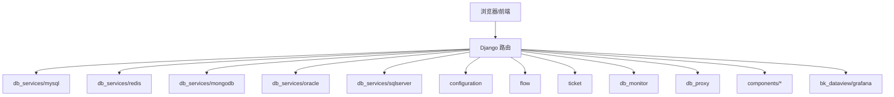

图表来源
- [manage.py:1-28](file://dbm-ui/manage.py#L1-L28)
- [db_services/mysql/urls.py](file://dbm-ui/backend/db_services/mysql/urls.py)
- [db_services/redis/urls.py](file://dbm-ui/backend/db_services/redis/urls.py)
- [db_services/mongodb/urls.py](file://dbm-ui/backend/db_services/mongodb/urls.py)
- [db_services/oracle/urls.py](file://dbm-ui/backend/db_services/oracle/urls.py)
- [db_services/sqlserver/urls.py](file://dbm-ui/backend/db_services/sqlserver/urls.py)
- [configuration/urls.py](file://dbm-ui/backend/configuration/urls.py)
- [flow/urls.py](file://dbm-ui/backend/flow/urls.py)
- [ticket/urls.py](file://dbm-ui/backend/ticket/urls.py)
- [db_monitor/urls.py](file://dbm-ui/backend/db_monitor/urls.py)
- [db_proxy/urls.py](file://dbm-ui/backend/db_proxy/urls.py)
- [bk_dataview/grafana/router.py](file://dbm-ui/backend/bk_dataview/grafana/router.py)

## 详细组件分析

### MySQL 管理界面
- 界面定位：db_services/mysql模块提供MySQL相关管理能力，包括集群部署、实例管理、配置下发、备份恢复等。
- 操作流程：通过URL路由进入MySQL视图，调用对应服务逻辑完成操作。
- 功能特性：支持集群拓扑展示、实例列表、配置模板、备份计划、分区管理、权限管理等。
- 界面适配：与components/mysql_backup、components/mysql_partition、components/mysql_priv_manager等组件联动。

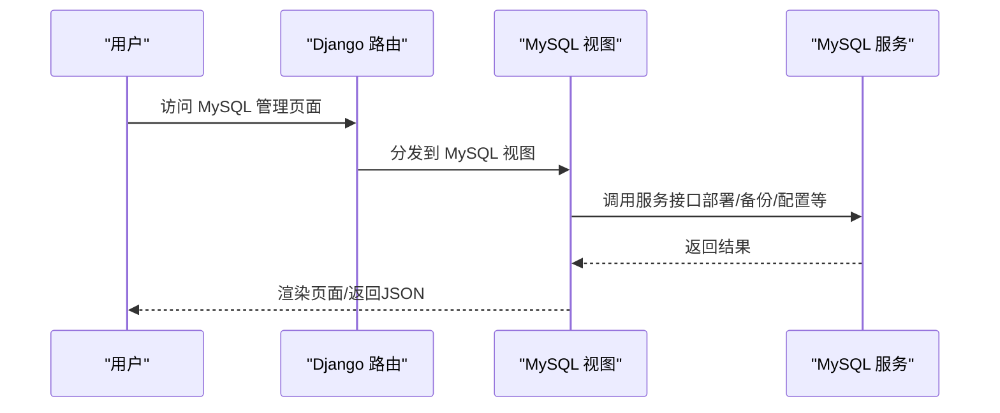

图表来源
- [db_services/mysql/urls.py](file://dbm-ui/backend/db_services/mysql/urls.py)
- [db_services/mysql/views.py](file://dbm-ui/backend/db_services/mysql/views.py)
- [components/mysql_backup/views.py](file://dbm-ui/backend/components/mysql_backup/views.py)
- [components/mysql_partition/views.py](file://dbm-ui/backend/components/mysql_partition/views.py)
- [components/mysql_priv_manager/views.py](file://dbm-ui/backend/components/mysql_priv_manager/views.py)

章节来源
- [db_services/mysql/__init__.py:1-11](file://dbm-ui/backend/db_services/mysql/__init__.py#L1-L11)
- [db_services/mysql/views.py](file://dbm-ui/backend/db_services/mysql/views.py)
- [db_services/mysql/urls.py](file://dbm-ui/backend/db_services/mysql/urls.py)
- [components/mysql_backup/views.py](file://dbm-ui/backend/components/mysql_backup/views.py)
- [components/mysql_backup/urls.py](file://dbm-ui/backend/components/mysql_backup/urls.py)
- [components/mysql_partition/views.py](file://dbm-ui/backend/components/mysql_partition/views.py)
- [components/mysql_partition/urls.py](file://dbm-ui/backend/components/mysql_partition/urls.py)
- [components/mysql_priv_manager/views.py](file://dbm-ui/backend/components/mysql_priv_manager/views.py)
- [components/mysql_priv_manager/urls.py](file://dbm-ui/backend/components/mysql_priv_manager/urls.py)

### Redis 管理界面
- 界面定位：db_services/redis模块提供Redis相关管理能力，包括集群部署、实例管理、配置下发、备份恢复等。
- 操作流程：通过URL路由进入Redis视图，调用对应服务逻辑完成操作。
- 功能特性：支持集群拓扑展示、实例列表、配置模板、备份计划等。
- 界面适配：与components/dbconfig、components/dbresource等组件联动。

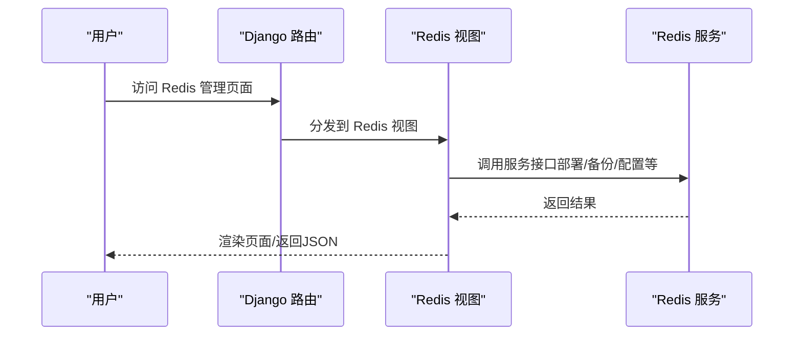

图表来源
- [db_services/redis/urls.py](file://dbm-ui/backend/db_services/redis/urls.py)
- [db_services/redis/views.py](file://dbm-ui/backend/db_services/redis/views.py)
- [components/dbconfig/views.py](file://dbm-ui/backend/components/dbconfig/views.py)
- [components/dbresource/views.py](file://dbm-ui/backend/components/dbresource/views.py)

章节来源
- [db_services/redis/__init__.py:1-11](file://dbm-ui/backend/db_services/redis/__init__.py#L1-L11)
- [db_services/redis/views.py](file://dbm-ui/backend/db_services/redis/views.py)
- [db_services/redis/urls.py](file://dbm-ui/backend/db_services/redis/urls.py)
- [components/dbconfig/views.py](file://dbm-ui/backend/components/dbconfig/views.py)
- [components/dbconfig/urls.py](file://dbm-ui/backend/components/dbconfig/urls.py)
- [components/dbresource/views.py](file://dbm-ui/backend/components/dbresource/views.py)
- [components/dbresource/urls.py](file://dbm-ui/backend/components/dbresource/urls.py)

### MongoDB 管理界面
- 界面定位：db_services/mongodb模块提供MongoDB相关管理能力，包括集群部署、实例管理、配置下发、备份恢复等。
- 操作流程：通过URL路由进入MongoDB视图，调用对应服务逻辑完成操作。
- 功能特性：支持集群拓扑展示、实例列表、配置模板、备份计划等。
- 界面适配：与components/dbconfig、components/dbresource等组件联动。

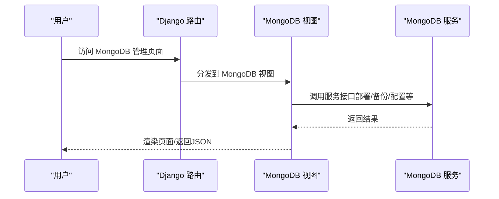

图表来源
- [db_services/mongodb/urls.py](file://dbm-ui/backend/db_services/mongodb/urls.py)
- [db_services/mongodb/views.py](file://dbm-ui/backend/db_services/mongodb/views.py)
- [components/dbconfig/views.py](file://dbm-ui/backend/components/dbconfig/views.py)
- [components/dbresource/views.py](file://dbm-ui/backend/components/dbresource/views.py)

章节来源
- [db_services/mongodb/__init__.py:1-11](file://dbm-ui/backend/db_services/mongodb/__init__.py#L1-L11)
- [db_services/mongodb/views.py](file://dbm-ui/backend/db_services/mongodb/views.py)
- [db_services/mongodb/urls.py](file://dbm-ui/backend/db_services/mongodb/urls.py)
- [components/dbconfig/views.py](file://dbm-ui/backend/components/dbconfig/views.py)
- [components/dbconfig/urls.py](file://dbm-ui/backend/components/dbconfig/urls.py)
- [components/dbresource/views.py](file://dbm-ui/backend/components/dbresource/views.py)
- [components/dbresource/urls.py](file://dbm-ui/backend/components/dbresource/urls.py)

### Oracle 管理界面
- 界面定位：db_services/oracle模块提供Oracle相关管理能力，包括集群部署、实例管理、配置下发、备份恢复等。
- 操作流程：通过URL路由进入Oracle视图，调用对应服务逻辑完成操作。
- 功能特性：支持集群拓扑展示、实例列表、配置模板、备份计划等。
- 界面适配：与components/dbconfig、components/dbresource等组件联动。

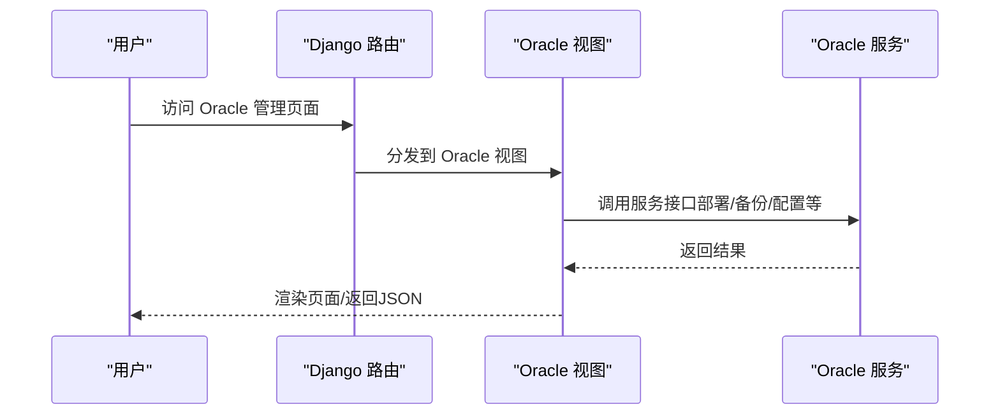

图表来源
- [db_services/oracle/urls.py](file://dbm-ui/backend/db_services/oracle/urls.py)
- [db_services/oracle/views.py](file://dbm-ui/backend/db_services/oracle/views.py)
- [components/dbconfig/views.py](file://dbm-ui/backend/components/dbconfig/views.py)
- [components/dbresource/views.py](file://dbm-ui/backend/components/dbresource/views.py)

章节来源
- [db_services/oracle/__init__.py:1-11](file://dbm-ui/backend/db_services/oracle/__init__.py#L1-L11)
- [db_services/oracle/views.py](file://dbm-ui/backend/db_services/oracle/views.py)
- [db_services/oracle/urls.py](file://dbm-ui/backend/db_services/oracle/urls.py)
- [components/dbconfig/views.py](file://dbm-ui/backend/components/dbconfig/views.py)
- [components/dbconfig/urls.py](file://dbm-ui/backend/components/dbconfig/urls.py)
- [components/dbresource/views.py](file://dbm-ui/backend/components/dbresource/views.py)
- [components/dbresource/urls.py](file://dbm-ui/backend/components/dbresource/urls.py)

### SQLServer 管理界面
- 界面定位：db_services/sqlserver模块提供SQLServer相关管理能力，包括集群部署、实例管理、配置下发、备份恢复等。
- 操作流程：通过URL路由进入SQLServer视图，调用对应服务逻辑完成操作。
- 功能特性：支持集群拓扑展示、实例列表、配置模板、备份计划等。
- 界面适配：与components/dbconfig、components/dbresource等组件联动。

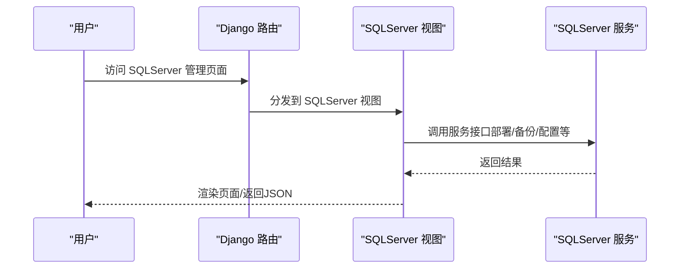

图表来源
- [db_services/sqlserver/urls.py](file://dbm-ui/backend/db_services/sqlserver/urls.py)
- [db_services/sqlserver/views.py](file://dbm-ui/backend/db_services/sqlserver/views.py)
- [components/dbconfig/views.py](file://dbm-ui/backend/components/dbconfig/views.py)
- [components/dbresource/views.py](file://dbm-ui/backend/components/dbresource/views.py)

章节来源
- [db_services/sqlserver/__init__.py:1-11](file://dbm-ui/backend/db_services/sqlserver/__init__.py#L1-L11)
- [db_services/sqlserver/views.py](file://dbm-ui/backend/db_services/sqlserver/views.py)
- [db_services/sqlserver/urls.py](file://dbm-ui/backend/db_services/sqlserver/urls.py)
- [components/dbconfig/views.py](file://dbm-ui/backend/components/dbconfig/views.py)
- [components/dbconfig/urls.py](file://dbm-ui/backend/components/dbconfig/urls.py)
- [components/dbresource/views.py](file://dbm-ui/backend/components/dbresource/views.py)
- [components/dbresource/urls.py](file://dbm-ui/backend/components/dbresource/urls.py)

### 配置管理界面
- 界面定位：configuration模块提供配置项管理能力，支持配置模板、下发策略、版本管理等。
- 操作流程：通过URL路由进入配置视图，调用序列化器与模型完成配置的增删改查。
- 功能特性：支持配置模板维护、批量下发、历史版本对比、权限控制等。

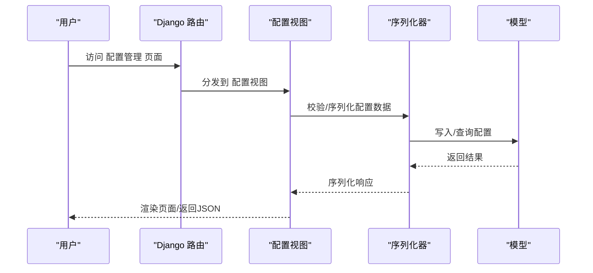

图表来源
- [configuration/urls.py](file://dbm-ui/backend/configuration/urls.py)
- [configuration/views.py](file://dbm-ui/backend/configuration/views.py)
- [configuration/serializers.py](file://dbm-ui/backend/configuration/serializers.py)

章节来源
- [configuration/views.py](file://dbm-ui/backend/configuration/views.py)
- [configuration/urls.py](file://dbm-ui/backend/configuration/urls.py)
- [configuration/serializers.py](file://dbm-ui/backend/configuration/serializers.py)

### 监控告警界面
- 界面定位：db_monitor模块提供监控策略与指标管理，bk_dataview/grafana集成Grafana，提供仪表盘与数据源。
- 操作流程：通过URL路由进入监控视图，调用Grafana客户端与后端API，完成仪表盘与数据源的管理。
- 功能特性：支持策略模板、阈值配置、告警规则、看板展示、PromQL查询等。

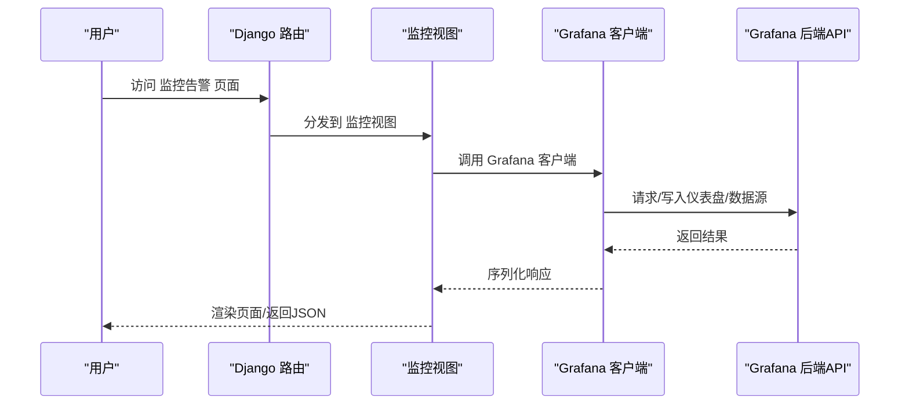

图表来源
- [db_monitor/urls.py](file://dbm-ui/backend/db_monitor/urls.py)
- [db_monitor/views.py](file://dbm-ui/backend/db_monitor/views.py)
- [bk_dataview/grafana/router.py](file://dbm-ui/backend/bk_dataview/grafana/router.py)
- [bk_dataview/grafana/client.py](file://dbm-ui/backend/bk_dataview/grafana/client.py)
- [bk_dataview/grafana/backends/api.py](file://dbm-ui/backend/bk_dataview/grafana/backends/api.py)
- [bk_dataview/grafana/backends/db.py](file://dbm-ui/backend/bk_dataview/grafana/backends/db.py)
- [bk_dataview/grafana/promsql.py](file://dbm-ui/backend/bk_dataview/grafana/promsql.py)
- [bk_dataview/grafana/models.py](file://dbm-ui/backend/bk_dataview/grafana/models.py)

章节来源
- [db_monitor/views.py](file://dbm-ui/backend/db_monitor/views.py)
- [db_monitor/urls.py](file://dbm-ui/backend/db_monitor/urls.py)
- [db_monitor/serializers.py](file://dbm-ui/backend/db_monitor/serializers.py)
- [bk_dataview/grafana/authentication.py](file://dbm-ui/backend/bk_dataview/grafana/authentication.py)
- [bk_dataview/grafana/router.py](file://dbm-ui/backend/bk_dataview/grafana/router.py)
- [bk_dataview/grafana/client.py](file://dbm-ui/backend/bk_dataview/grafana/client.py)
- [bk_dataview/grafana/promsql.py](file://dbm-ui/backend/bk_dataview/grafana/promsql.py)
- [bk_dataview/grafana/models.py](file://dbm-ui/backend/bk_dataview/grafana/models.py)
- [bk_dataview/grafana/backends/api.py](file://dbm-ui/backend/bk_dataview/grafana/backends/api.py)
- [bk_dataview/grafana/backends/db.py](file://dbm-ui/backend/bk_dataview/grafana/backends/db.py)

### 备份恢复界面
- 界面定位：components/mysql_backup提供MySQL备份能力；db_services/mysql与db_services/redis等模块提供备份入口。
- 操作流程：通过URL路由进入备份视图，调用备份组件与服务逻辑完成备份任务的创建、执行与状态查询。
- 功能特性：支持备份策略配置、任务调度、进度跟踪、结果校验、回放验证等。

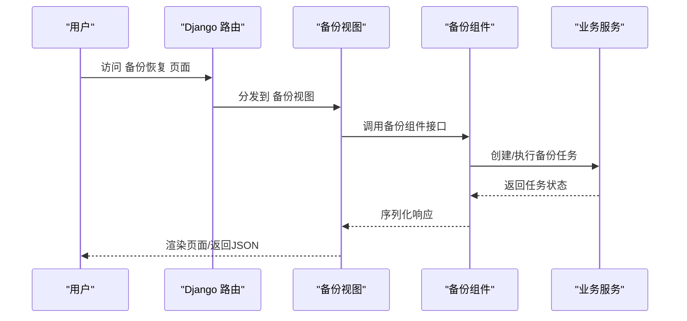

图表来源
- [components/mysql_backup/urls.py](file://dbm-ui/backend/components/mysql_backup/urls.py)
- [components/mysql_backup/views.py](file://dbm-ui/backend/components/mysql_backup/views.py)
- [db_services/mysql/views.py](file://dbm-ui/backend/db_services/mysql/views.py)
- [db_services/redis/views.py](file://dbm-ui/backend/db_services/redis/views.py)

章节来源
- [components/mysql_backup/views.py](file://dbm-ui/backend/components/mysql_backup/views.py)
- [components/mysql_backup/urls.py](file://dbm-ui/backend/components/mysql_backup/urls.py)
- [db_services/mysql/views.py](file://dbm-ui/backend/db_services/mysql/views.py)
- [db_services/redis/views.py](file://dbm-ui/backend/db_services/redis/views.py)

### 流程编排与工单界面
- 界面定位：flow与ticket模块提供流程编排与工单闭环能力，贯穿配置、部署、变更、备份等操作。
- 操作流程：通过URL路由进入流程或工单视图，调用引擎与插件完成流程执行与状态跟踪。
- 功能特性：支持流程模板、节点配置、审批流、执行引擎、信号与回调、任务统计等。

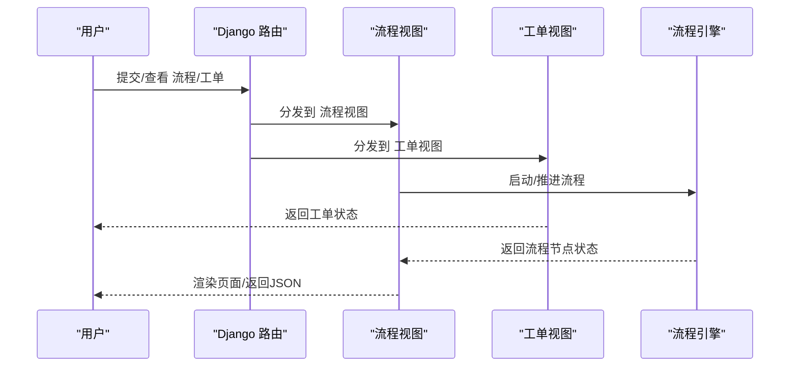

图表来源
- [flow/urls.py](file://dbm-ui/backend/flow/urls.py)
- [flow/views.py](file://dbm-ui/backend/flow/views.py)
- [ticket/urls.py](file://dbm-ui/backend/ticket/urls.py)
- [ticket/views.py](file://dbm-ui/backend/ticket/views.py)

章节来源
- [flow/views.py](file://dbm-ui/backend/flow/views.py)
- [flow/urls.py](file://dbm-ui/backend/flow/urls.py)
- [ticket/views.py](file://dbm-ui/backend/ticket/views.py)
- [ticket/urls.py](file://dbm-ui/backend/ticket/urls.py)

### 组件对接与第三方系统
- 界面定位：components/*模块封装与CMDB、作业平台、ITSMSOP、用户管理、短信、对象存储、日志、聊天、基础能力、网络、工单、协同、安全运营等系统的对接。
- 操作流程：通过URL路由进入组件视图，调用proxy_api与domains常量完成第三方系统调用。
- 功能特性：统一异常处理、认证参数注入、返回标准化、错误码与消息模板化。

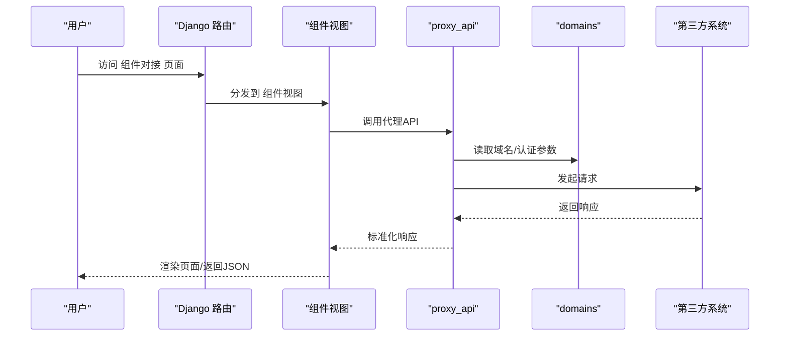

图表来源
- [components/proxy_api.py](file://dbm-ui/backend/components/proxy_api.py)
- [components/domains.py](file://dbm-ui/backend/components/domains.py)
- [components/exception.py](file://dbm-ui/backend/components/exception.py)
- [bk_web/middleware.py](file://dbm-ui/backend/bk_web/middleware.py)
- [bk_web/exceptions.py](file://dbm-ui/backend/bk_web/exceptions.py)

章节来源
- [components/proxy_api.py](file://dbm-ui/backend/components/proxy_api.py)
- [components/domains.py](file://dbm-ui/backend/components/domains.py)
- [components/exception.py](file://dbm-ui/backend/components/exception.py)
- [bk_web/middleware.py](file://dbm-ui/backend/bk_web/middleware.py)
- [bk_web/exceptions.py](file://dbm-ui/backend/bk_web/exceptions.py)

## 依赖关系分析
- 模块耦合：db_services各模块与components/*存在间接耦合，通过URL路由与序列化器/视图进行解耦。
- 外部依赖：components/*模块依赖proxy_api与domains常量，统一处理第三方系统调用。
- 监控依赖：bk_dataview/grafana依赖router、client、backends与models，形成监控数据链路。
- 异常处理：bk_web与components共同依赖统一异常中间件与异常类，保障错误码与消息一致性。

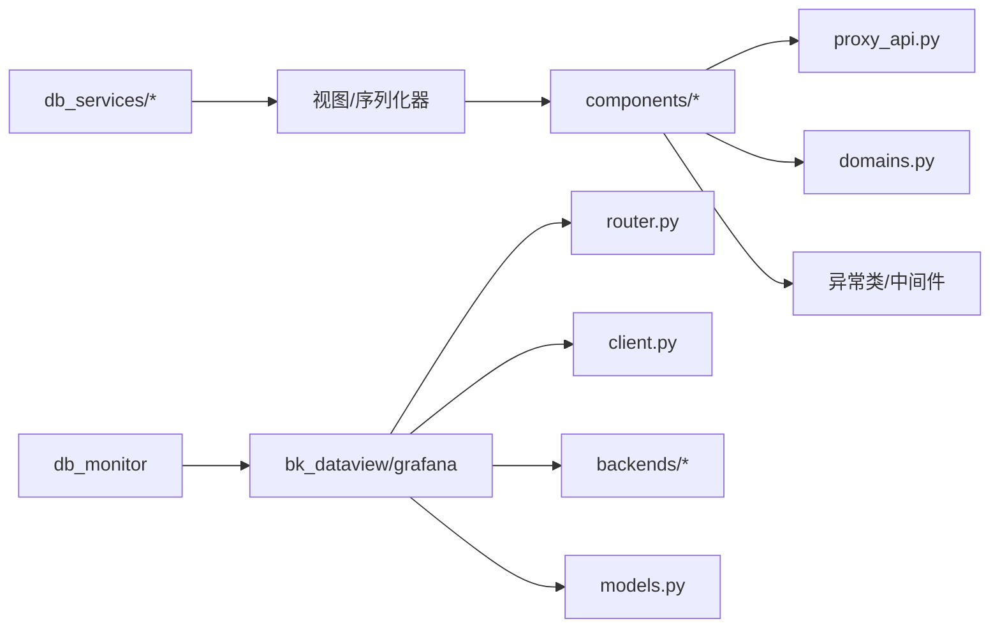

图表来源
- [db_services/mysql/urls.py](file://dbm-ui/backend/db_services/mysql/urls.py)
- [db_services/redis/urls.py](file://dbm-ui/backend/db_services/redis/urls.py)
- [db_services/mongodb/urls.py](file://dbm-ui/backend/db_services/mongodb/urls.py)
- [db_services/oracle/urls.py](file://dbm-ui/backend/db_services/oracle/urls.py)
- [db_services/sqlserver/urls.py](file://dbm-ui/backend/db_services/sqlserver/urls.py)
- [components/proxy_api.py](file://dbm-ui/backend/components/proxy_api.py)
- [components/domains.py](file://dbm-ui/backend/components/domains.py)
- [components/exception.py](file://dbm-ui/backend/components/exception.py)
- [bk_web/middleware.py](file://dbm-ui/backend/bk_web/middleware.py)
- [bk_web/exceptions.py](file://dbm-ui/backend/bk_web/exceptions.py)
- [db_monitor/urls.py](file://dbm-ui/backend/db_monitor/urls.py)
- [bk_dataview/grafana/router.py](file://dbm-ui/backend/bk_dataview/grafana/router.py)
- [bk_dataview/grafana/client.py](file://dbm-ui/backend/bk_dataview/grafana/client.py)
- [bk_dataview/grafana/backends/api.py](file://dbm-ui/backend/bk_dataview/grafana/backends/api.py)
- [bk_dataview/grafana/backends/db.py](file://dbm-ui/backend/bk_dataview/grafana/backends/db.py)
- [bk_dataview/grafana/models.py](file://dbm-ui/backend/bk_dataview/grafana/models.py)

章节来源
- [db_services/mysql/urls.py](file://dbm-ui/backend/db_services/mysql/urls.py)
- [db_services/redis/urls.py](file://dbm-ui/backend/db_services/redis/urls.py)
- [db_services/mongodb/urls.py](file://dbm-ui/backend/db_services/mongodb/urls.py)
- [db_services/oracle/urls.py](file://dbm-ui/backend/db_services/oracle/urls.py)
- [db_services/sqlserver/urls.py](file://dbm-ui/backend/db_services/sqlserver/urls.py)
- [components/proxy_api.py](file://dbm-ui/backend/components/proxy_api.py)
- [components/domains.py](file://dbm-ui/backend/components/domains.py)
- [components/exception.py](file://dbm-ui/backend/components/exception.py)
- [bk_web/middleware.py](file://dbm-ui/backend/bk_web/middleware.py)
- [bk_web/exceptions.py](file://dbm-ui/backend/bk_web/exceptions.py)
- [db_monitor/urls.py](file://dbm-ui/backend/db_monitor/urls.py)
- [bk_dataview/grafana/router.py](file://dbm-ui/backend/bk_dataview/grafana/router.py)
- [bk_dataview/grafana/client.py](file://dbm-ui/backend/bk_dataview/grafana/client.py)
- [bk_dataview/grafana/backends/api.py](file://dbm-ui/backend/bk_dataview/grafana/backends/api.py)
- [bk_dataview/grafana/backends/db.py](file://dbm-ui/backend/bk_dataview/grafana/backends/db.py)
- [bk_dataview/grafana/models.py](file://dbm-ui/backend/bk_dataview/grafana/models.py)

## 性能考虑
- 接口幂等与缓存：监控与代理模块建议在查询频繁的场景引入缓存与分页，避免重复计算与大查询。
- 异步任务：流程与周期任务通过Celery执行，建议合理设置队列与并发，避免阻塞主流程。
- 数据绑定与实时更新：前端通过轮询或长连接实现状态更新，建议结合WebSocket或事件推送降低延迟。
- 异常统一处理：异常中间件与异常类确保错误码与消息一致，减少前端分支判断复杂度。

## 故障排查指南
- 异常处理：统一异常类继承基础异常类，异常信息支持格式化模板，错误码由平台码、模块码、错误码组成，便于定位问题。
- API请求封装：第三方系统接口请求统一使用API封装，默认自动处理标准返回，失败时抛出ApiError异常，由中间件捕获处理。
- 环境变量与配置：确保环境变量齐全，数据库与Redis配置正确，前端资源构建完成后再启动服务。
- 日志与监控：通过bk_web中间件与components/bklog组件输出日志，结合bk_dataview/grafana查看监控指标。

章节来源
- [bk_web/middleware.py](file://dbm-ui/backend/bk_web/middleware.py)
- [bk_web/exceptions.py](file://dbm-ui/backend/bk_web/exceptions.py)
- [components/exception.py](file://dbm-ui/backend/components/exception.py)
- [components/bklog/views.py](file://dbm-ui/backend/components/bklog/views.py)
- [components/bklog/urls.py](file://dbm-ui/backend/components/bklog/urls.py)
- [DBM_README.md:112-230](file://dbm-ui/DBM_README.md#L112-L230)

## 结论
DBM数据库管理界面以模块化设计为核心，围绕MySQL、Redis、MongoDB、Oracle、SQLServer提供统一的管理入口与交互体验。通过配置、流程、监控、代理与组件对接的协同，实现从集群部署到备份恢复的全生命周期管理。界面层通过URL路由与视图/序列化器解耦业务逻辑，配合统一异常处理与第三方系统对接，确保用户体验与系统稳定性。

## 附录
- 开发与部署：参考DBM_README.md中的本地部署与环境配置说明，确保前后端环境与依赖满足要求。
- 国际化与白皮书：readme_en.md提供英文概览与白皮书链接，便于国际化场景使用。

章节来源
- [DBM_README.md:72-230](file://dbm-ui/DBM_README.md#L72-L230)
- [readme_en.md:1-29](file://readme_en.md#L1-L29)