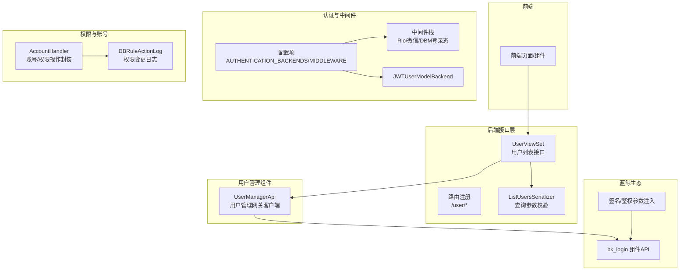
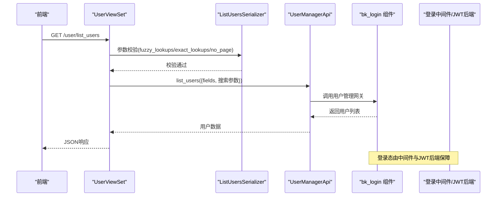
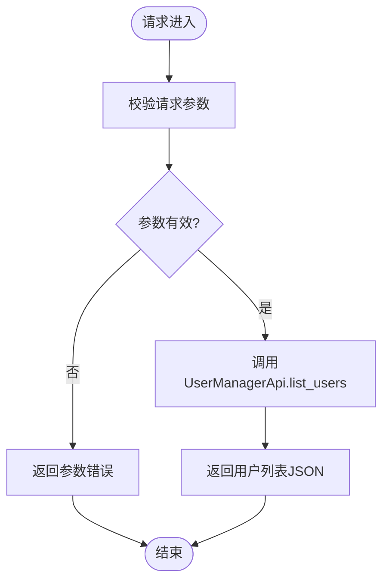
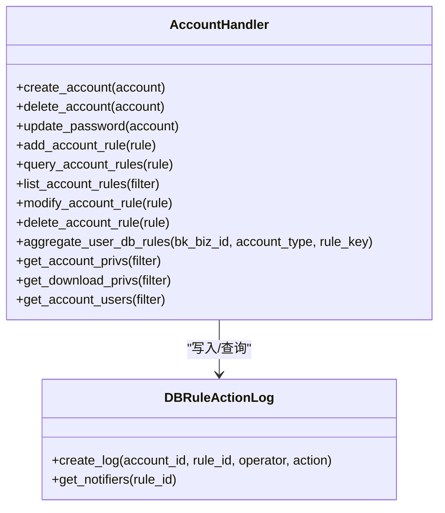
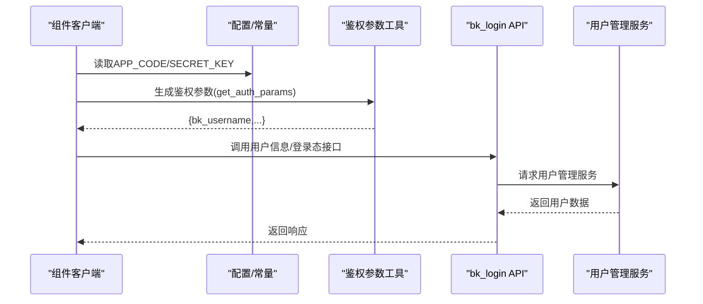
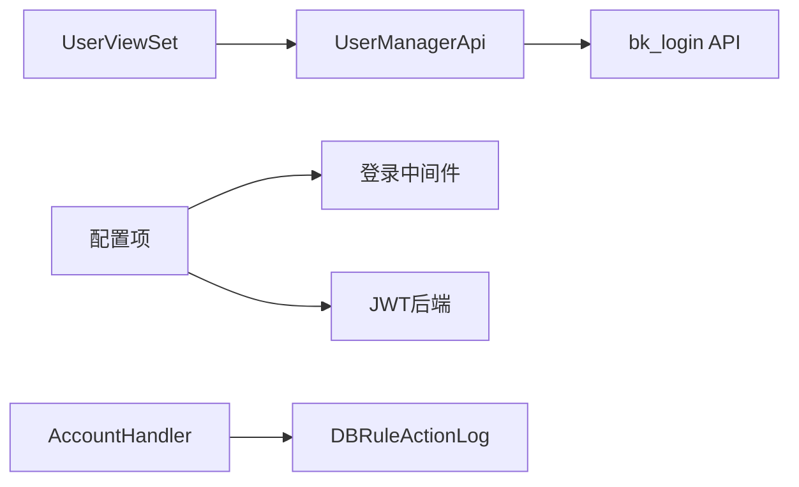

# 用户管理

<cite>
**本文档引用的文件**
- [views.py](file://dbm-ui/backend/db_services/user/views.py)
- [serializers.py](file://dbm-ui/backend/db_services/user/serializers.py)
- [urls.py](file://dbm-ui/backend/db_services/user/urls.py)
- [client.py](file://dbm-ui/backend/components/usermanage/client.py)
- [default.py](file://dbm-ui/config/default.py)
- [bk_login.py](file://dbm-ui/blueking/component/apis/bk_login.py)
- [client.py](file://dbm-ui/blueking/component/client.py)
- [utils.py](file://dbm-ui/blueking/component/utils.py)
- [shortcuts.py](file://dbm-ui/blueking/component/shortcuts.py)
- [handlers.py](file://dbm-ui/backend/db_services/dbpermission/db_account/handlers.py)
- [models.py](file://dbm-ui/backend/db_services/dbpermission/db_authorize/models.py)
</cite>

## 目录
1. [简介](#简介)
2. [项目结构](#项目结构)
3. [核心组件](#核心组件)
4. [架构总览](#架构总览)
5. [详细组件分析](#详细组件分析)
6. [依赖关系分析](#依赖关系分析)
7. [性能考量](#性能考量)
8. [故障排查指南](#故障排查指南)
9. [结论](#结论)
10. [附录](#附录)

## 简介
本文件聚焦于DBM（蓝鲸数据库管理平台）的用户管理子系统，覆盖用户注册、登录认证、权限分配与角色管理、组管理机制、权限继承规则、会话管理、UI交互设计、数据校验与安全控制、用户状态管理、密码策略与账户锁定机制，以及与蓝鲸生态（用户管理、登录、权限中心等）的集成方式与第三方认证支持。文档以代码为依据，结合架构图与流程图，帮助读者快速理解并正确使用该子系统。

## 项目结构
用户管理相关能力主要分布在以下模块：
- 用户查询接口层：REST API视图、序列化器与路由
- 用户管理组件封装：统一调用蓝鲸用户管理网关
- 登录与认证中间件：蓝鲸登录态与JWT用户模型后端
- 权限与账号管理：账号创建/删除/改密、权限规则增删改查、权限日志与通知
- 蓝鲸生态对接：登录态校验、用户信息获取、签名与鉴权参数注入

图表来源
- [views.py:24-35](file://dbm-ui/backend/db_services/user/views.py#L24-L35)
- [urls.py:15-19](file://dbm-ui/backend/db_services/user/urls.py#L15-L19)
- [serializers.py:15-19](file://dbm-ui/backend/db_services/user/serializers.py#L15-L19)
- [client.py:18-36](file://dbm-ui/backend/components/usermanage/client.py#L18-L36)
- [default.py:180-202](file://dbm-ui/config/default.py#L180-L202)
- [handlers.py:40-117](file://dbm-ui/backend/db_services/dbpermission/db_account/handlers.py#L40-L117)
- [models.py:49-89](file://dbm-ui/backend/db_services/dbpermission/db_authorize/models.py#L49-L89)
- [bk_login.py:29-55](file://dbm-ui/blueking/component/apis/bk_login.py#L29-L55)
- [client.py:138-172](file://dbm-ui/blueking/component/client.py#L138-L172)

章节来源
- [views.py:24-35](file://dbm-ui/backend/db_services/user/views.py#L24-L35)
- [urls.py:15-19](file://dbm-ui/backend/db_services/user/urls.py#L15-L19)
- [serializers.py:15-19](file://dbm-ui/backend/db_services/user/serializers.py#L15-L19)
- [client.py:18-36](file://dbm-ui/backend/components/usermanage/client.py#L18-L36)
- [default.py:180-202](file://dbm-ui/config/default.py#L180-L202)

## 核心组件
- 用户列表接口：提供人员列表查询能力，支持模糊/精确搜索与不分页选项
- 用户管理组件：封装用户管理网关调用，提供列表与单个用户查询
- 认证与中间件：统一接入蓝鲸登录态与JWT用户模型后端
- 权限与账号：账号生命周期管理、权限规则增删改查、权限日志与通知
- 蓝鲸生态：登录态校验、用户信息获取、签名与鉴权参数注入

章节来源
- [views.py:24-35](file://dbm-ui/backend/db_services/user/views.py#L24-L35)
- [serializers.py:15-19](file://dbm-ui/backend/db_services/user/serializers.py#L15-L19)
- [client.py:18-36](file://dbm-ui/backend/components/usermanage/client.py#L18-L36)
- [default.py:180-202](file://dbm-ui/config/default.py#L180-L202)
- [handlers.py:40-117](file://dbm-ui/backend/db_services/dbpermission/db_account/handlers.py#L40-L117)
- [models.py:49-89](file://dbm-ui/backend/db_services/dbpermission/db_authorize/models.py#L49-L89)

## 架构总览
用户管理的整体架构围绕“接口层-组件层-认证层-权限层-生态对接”展开，形成清晰的职责边界与调用链路。

图表来源
- [views.py:24-35](file://dbm-ui/backend/db_services/user/views.py#L24-L35)
- [serializers.py:15-19](file://dbm-ui/backend/db_services/user/serializers.py#L15-L19)
- [client.py:18-36](file://dbm-ui/backend/components/usermanage/client.py#L18-L36)
- [bk_login.py:29-55](file://dbm-ui/blueking/component/apis/bk_login.py#L29-L55)
- [default.py:180-202](file://dbm-ui/config/default.py#L180-L202)

## 详细组件分析

### 用户列表接口与参数校验
- 接口职责：提供人员列表查询，支持模糊/精确搜索与不分页选项
- 参数校验：序列化器对可选参数进行约束与默认值处理
- 路由注册：DefaultRouter注册UserViewSet，暴露REST风格路径

图表来源
- [views.py:24-35](file://dbm-ui/backend/db_services/user/views.py#L24-L35)
- [serializers.py:15-19](file://dbm-ui/backend/db_services/user/serializers.py#L15-L19)
- [urls.py:15-19](file://dbm-ui/backend/db_services/user/urls.py#L15-L19)

章节来源
- [views.py:24-35](file://dbm-ui/backend/db_services/user/views.py#L24-L35)
- [serializers.py:15-19](file://dbm-ui/backend/db_services/user/serializers.py#L15-L19)
- [urls.py:15-19](file://dbm-ui/backend/db_services/user/urls.py#L15-L19)

### 用户管理组件封装
- 统一模块与基础路径：定义用户管理模块与API网关域名
- 接口方法：list_users/retrieve_user，支持缓存与描述性注释
- 调用方式：通过BaseApi生成数据API，简化调用方实现

章节来源
- [client.py:18-36](file://dbm-ui/backend/components/usermanage/client.py#L18-L36)

### 认证与登录态管理
- 中间件栈：包含蓝鲸登录态中间件与DBM自定义登录态中间件
- 认证后端：扩展JWTUserModelBackend，统一用户模型解析
- 登录态校验：通过bk_login组件API进行用户信息获取与登录态判断

章节来源
- [default.py:180-202](file://dbm-ui/config/default.py#L180-L202)
- [bk_login.py:29-55](file://dbm-ui/blueking/component/apis/bk_login.py#L29-L55)

### 权限与账号管理
- 账号生命周期：创建账号、删除账号、修改密码
- 权限规则：新增/查询/修改/删除账号规则；支持按用户、DB、权限聚合
- 权限日志：记录授权、修改、删除、创建等动作，支持通知人筛选
- 通知机制：基于权限变更日志与系统设置过滤虚拟用户，生成通知人列表

图表来源
- [handlers.py:40-441](file://dbm-ui/backend/db_services/dbpermission/db_account/handlers.py#L40-L441)
- [models.py:49-89](file://dbm-ui/backend/db_services/dbpermission/db_authorize/models.py#L49-L89)

章节来源
- [handlers.py:40-441](file://dbm-ui/backend/db_services/dbpermission/db_account/handlers.py#L40-L441)
- [models.py:49-89](file://dbm-ui/backend/db_services/dbpermission/db_authorize/models.py#L49-L89)

### 与蓝鲸生态的集成与第三方认证
- 用户管理网关：通过UserManagerApi统一调用用户管理服务
- 登录态与签名：组件客户端自动注入签名参数与语言头，支持测试环境开关
- 鉴权参数：从Cookie/Session/Query中提取鉴权参数，兼容多种场景
- 用户信息：通过bk_login组件API批量/单个获取用户信息，支持登录态判断

图表来源
- [client.py:138-172](file://dbm-ui/blueking/component/client.py#L138-L172)
- [utils.py:46-56](file://dbm-ui/blueking/component/utils.py#L46-L56)
- [shortcuts.py:45-66](file://dbm-ui/blueking/component/shortcuts.py#L45-L66)
- [bk_login.py:29-55](file://dbm-ui/blueking/component/apis/bk_login.py#L29-L55)

章节来源
- [client.py:138-172](file://dbm-ui/blueking/component/client.py#L138-L172)
- [utils.py:46-56](file://dbm-ui/blueking/component/utils.py#L46-L56)
- [shortcuts.py:45-66](file://dbm-ui/blueking/component/shortcuts.py#L45-L66)
- [bk_login.py:29-55](file://dbm-ui/blueking/component/apis/bk_login.py#L29-L55)

## 依赖关系分析
- 接口层依赖组件层：UserViewSet依赖UserManagerApi完成用户查询
- 组件层依赖蓝鲸生态：UserManagerApi依赖bk_login组件API与用户管理服务
- 认证层依赖配置：中间件与JWT后端由配置项统一启用
- 权限层依赖日志：权限变更日志支撑通知与审计

图表来源
- [views.py:24-35](file://dbm-ui/backend/db_services/user/views.py#L24-L35)
- [client.py:18-36](file://dbm-ui/backend/components/usermanage/client.py#L18-L36)
- [default.py:180-202](file://dbm-ui/config/default.py#L180-L202)
- [handlers.py:40-117](file://dbm-ui/backend/db_services/dbpermission/db_account/handlers.py#L40-L117)
- [models.py:49-89](file://dbm-ui/backend/db_services/dbpermission/db_authorize/models.py#L49-L89)

章节来源
- [views.py:24-35](file://dbm-ui/backend/db_services/user/views.py#L24-L35)
- [client.py:18-36](file://dbm-ui/backend/components/usermanage/client.py#L18-L36)
- [default.py:180-202](file://dbm-ui/config/default.py#L180-L202)
- [handlers.py:40-117](file://dbm-ui/backend/db_services/dbpermission/db_account/handlers.py#L40-L117)
- [models.py:49-89](file://dbm-ui/backend/db_services/dbpermission/db_authorize/models.py#L49-L89)

## 性能考量
- 缓存策略：用户管理接口支持缓存时间配置，降低频繁查询压力
- 分页与不分页：序列化器提供不分页选项，但建议优先使用分页以避免大列表传输
- 权限聚合：按用户与DB聚合规则，减少重复遍历与计算
- 日志索引：权限变更日志建立索引，提升查询效率

章节来源
- [client.py:23-28](file://dbm-ui/backend/components/usermanage/client.py#L23-L28)
- [serializers.py:15-19](file://dbm-ui/backend/db_services/user/serializers.py#L15-L19)
- [handlers.py:269-280](file://dbm-ui/backend/db_services/dbpermission/db_account/handlers.py#L269-L280)
- [models.py:64-67](file://dbm-ui/backend/db_services/dbpermission/db_authorize/models.py#L64-L67)

## 故障排查指南
- 用户列表为空或异常
  - 检查序列化器参数是否符合预期
  - 确认UserManagerApi调用是否成功
  - 核对中间件是否正确注入登录态
- 权限变更未生效
  - 检查权限规则增删改查流程是否执行成功
  - 关注DBRuleActionLog记录与通知人筛选逻辑
- 登录态失效或鉴权失败
  - 核对中间件与JWT后端配置
  - 检查组件签名参数与语言头是否正确注入
  - 验证bk_login接口可用性与返回数据

章节来源
- [views.py:24-35](file://dbm-ui/backend/db_services/user/views.py#L24-L35)
- [serializers.py:15-19](file://dbm-ui/backend/db_services/user/serializers.py#L15-L19)
- [default.py:180-202](file://dbm-ui/config/default.py#L180-L202)
- [handlers.py:225-267](file://dbm-ui/backend/db_services/dbpermission/db_account/handlers.py#L225-L267)
- [models.py:77-89](file://dbm-ui/backend/db_services/dbpermission/db_authorize/models.py#L77-L89)
- [client.py:138-172](file://dbm-ui/blueking/component/client.py#L138-L172)

## 结论
DBM用户管理子系统以清晰的分层架构实现了用户查询、登录认证、权限与账号管理，并与蓝鲸生态深度集成。通过组件封装与配置化中间件，系统具备良好的可维护性与扩展性。建议在生产环境中优先使用分页查询、合理设置缓存、完善权限日志与通知机制，确保系统稳定与安全。

## 附录
- 用户状态管理：通过权限规则与账号生命周期管理实现用户状态的动态控制
- 密码策略：账号密码修改由权限管理器统一处理，建议结合系统策略与加密组件使用
- 账户锁定机制：当前代码未直接体现账户锁定逻辑，可通过权限规则与系统设置配合实现