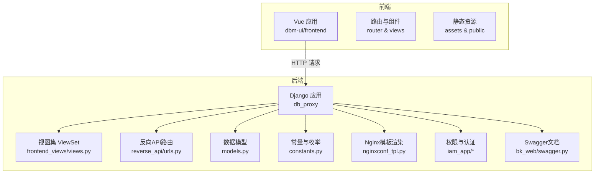
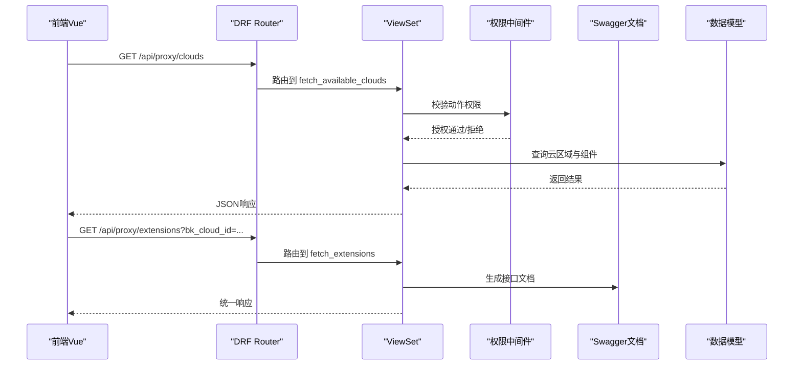
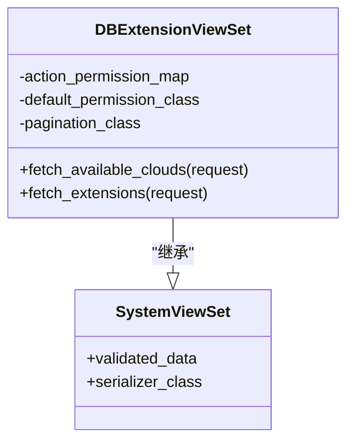
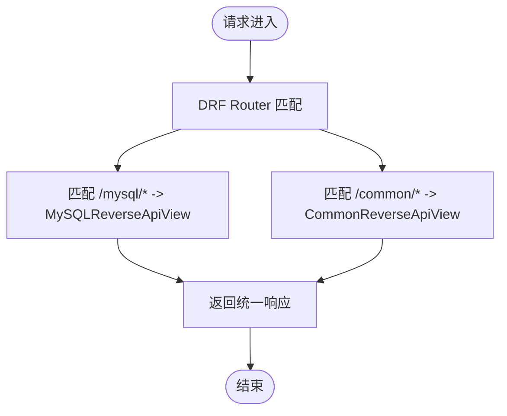
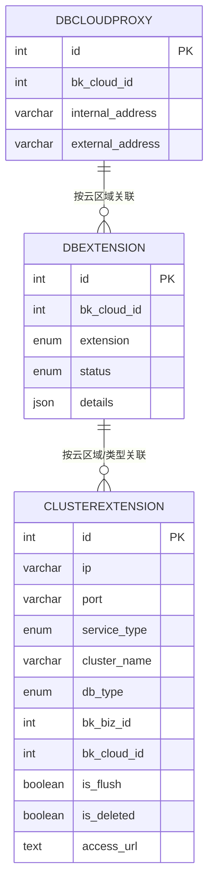
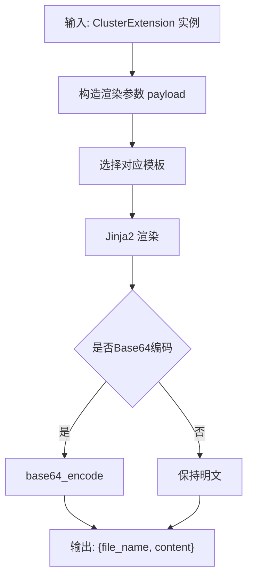
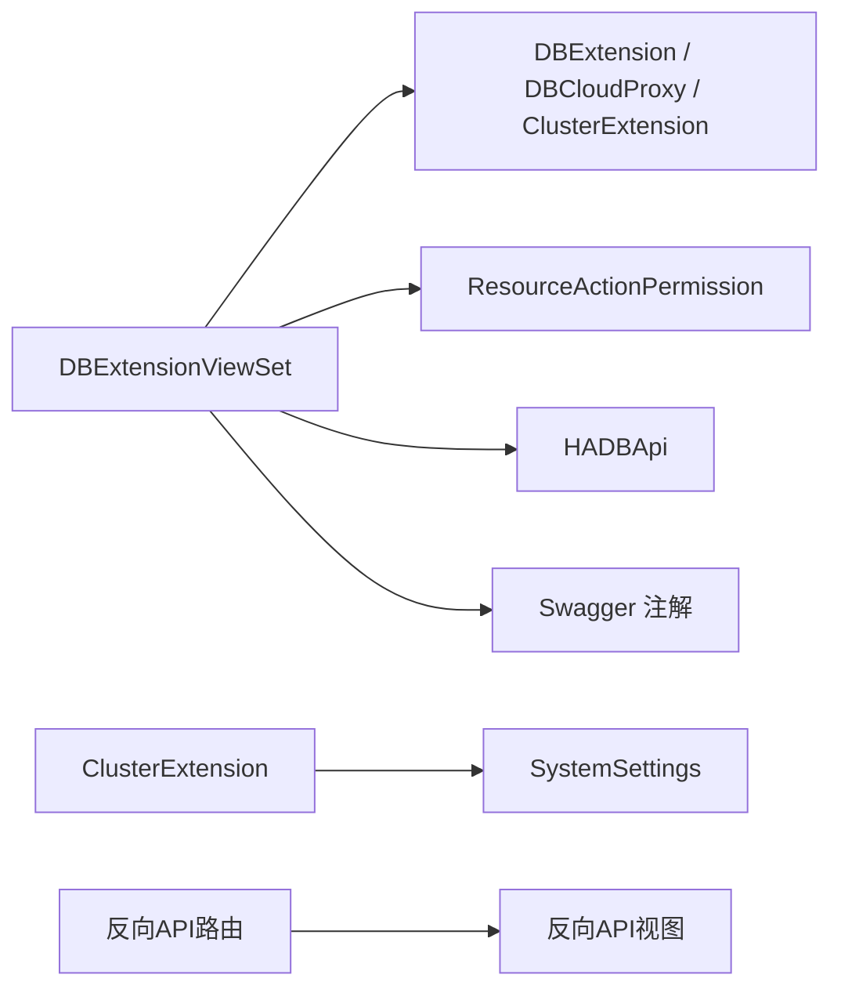

# 界面架构设计

<cite>
**本文引用的文件**
- [dbm-ui/backend/db_proxy/frontend_views/views.py](file://dbm-ui/backend/db_proxy/frontend_views/views.py)
- [dbm-ui/backend/db_proxy/frontend_views/__init__.py](file://dbm-ui/backend/db_proxy/frontend_views/__init__.py)
- [dbm-ui/backend/db_proxy/models.py](file://dbm-ui/backend/db_proxy/models.py)
- [dbm-ui/backend/db_proxy/constants.py](file://dbm-ui/backend/db_proxy/constants.py)
- [dbm-ui/backend/db_proxy/nginxconf_tpl.py](file://dbm-ui/backend/db_proxy/nginxconf_tpl.py)
- [dbm-ui/backend/db_proxy/reverse_api/urls.py](file://dbm-ui/backend/db_proxy/reverse_api/urls.py)
- [dbm-ui/backend/db_proxy/reverse_api/__init__.py](file://dbm-ui/backend/db_proxy/reverse_api/__init__.py)
- [dbm-ui/backend/bk_web/viewsets.py](file://dbm-ui/backend/bk_web/viewsets.py)
- [dbm-ui/backend/bk_web/swagger.py](file://dbm-ui/backend/bk_web/swagger.py)
- [dbm-ui/backend/iam_app/dataclass.py](file://dbm-ui/backend/iam_app/dataclass.py)
- [dbm-ui/backend/iam_app/handlers/drf_perm/base.py](file://dbm-ui/backend/iam_app/handlers/drf_perm/base.py)
- [dbm-ui/backend/components/hadb/client.py](file://dbm-ui/backend/components/hadb/client.py)
- [dbm-ui/backend/db_proxy/constants.py](file://dbm-ui/backend/db_proxy/constants.py)
- [dbm-ui/backend/db_proxy/exceptions.py](file://dbm-ui/backend/db_proxy/exceptions.py)
- [dbm-ui/backend/db_proxy/serializers.py](file://dbm-ui/backend/db_proxy/serializers.py)
- [dbm-ui/backend/db_proxy/urls.py](file://dbm-ui/backend/db_proxy/urls.py)
- [dbm-ui/backend/db_proxy/views.py](file://dbm-ui/backend/db_proxy/views.py)
- [dbm-ui/backend/db_proxy/reverse_api/common.py](file://dbm-ui/backend/db_proxy/reverse_api/common.py)
- [dbm-ui/backend/db_proxy/reverse_api/mysql.py](file://dbm-ui/backend/db_proxy/reverse_api/mysql.py)
- [dbm-ui/backend/db_proxy/serializers.py](file://dbm-ui/backend/db_proxy/serializers.py)
- [dbm-ui/backend/db_proxy/exceptions.py](file://dbm-ui/backend/db_proxy/exceptions.py)
- [dbm-ui/backend/db_proxy/models.py](file://dbm-ui/backend/db_proxy/models.py)
- [dbm-ui/backend/db_proxy/constants.py](file://dbm-ui/backend/db_proxy/constants.py)
- [dbm-ui/backend/db_proxy/nginxconf_tpl.py](file://dbm-ui/backend/db_proxy/nginxconf_tpl.py)
- [dbm-ui/backend/db_proxy/reverse_api/urls.py](file://dbm-ui/backend/db_proxy/reverse_api/urls.py)
- [dbm-ui/backend/db_proxy/reverse_api/__init__.py](file://dbm-ui/backend/db_proxy/reverse_api/__init__.py)
- [dbm-ui/backend/bk_web/viewsets.py](file://dbm-ui/backend/bk_web/viewsets.py)
- [dbm-ui/backend/bk_web/swagger.py](file://dbm-ui/backend/bk_web/swagger.py)
- [dbm-ui/backend/iam_app/dataclass.py](file://dbm-ui/backend/iam_app/dataclass.py)
- [dbm-ui/backend/iam_app/handlers/drf_perm/base.py](file://dbm-ui/backend/iam_app/handlers/drf_perm/base.py)
- [dbm-ui/backend/components/hadb/client.py](file://dbm-ui/backend/components/hadb/client.py)
</cite>

## 目录
1. [简介](#简介)
2. [项目结构](#项目结构)
3. [核心组件](#核心组件)
4. [架构总览](#架构总览)
5. [详细组件分析](#详细组件分析)
6. [依赖关系分析](#依赖关系分析)
7. [性能考量](#性能考量)
8. [故障排查指南](#故障排查指南)
9. [结论](#结论)
10. [附录](#附录)

## 简介
本文件面向DBM的Web界面架构设计，系统性阐述后端Django REST框架的路由与视图层、权限与认证、数据模型与序列化、以及与前端的交互模式。重点覆盖以下方面：
- 整体架构模式：前后端分离、REST API驱动、权限中间件与Swagger文档
- 路由设计：DRF Router注册、URL命名空间与反向API
- 视图层设计：基于ViewSet的统一响应、序列化器与查询参数校验
- 静态资源管理：Nginx子配置模板渲染与下发
- API接口组织：云区域组件信息聚合、DBHA状态对接、反向API路由
- 用户体验设计原则：统一鉴权、清晰的错误提示、可发现的接口文档
- 组件化与模块化：按功能域拆分app、常量与枚举集中管理
- 性能优化策略：缓存、批量查询、模板渲染与超时设置
- 错误处理机制：异常捕获、统一响应与错误码

## 项目结构
DBM Web界面采用“后端Django + 前端Vue”的典型前后端分离架构。后端以Django REST Framework为核心，通过DRF Router组织API；前端通过HTTP调用后端接口，完成页面渲染与交互。

图表来源
- [dbm-ui/backend/db_proxy/frontend_views/views.py:30-79](file://dbm-ui/backend/db_proxy/frontend_views/views.py#L30-L79)
- [dbm-ui/backend/db_proxy/reverse_api/urls.py:16-20](file://dbm-ui/backend/db_proxy/reverse_api/urls.py#L16-L20)
- [dbm-ui/backend/db_proxy/models.py:34-139](file://dbm-ui/backend/db_proxy/models.py#L34-L139)
- [dbm-ui/backend/db_proxy/constants.py:33-103](file://dbm-ui/backend/db_proxy/constants.py#L33-L103)
- [dbm-ui/backend/db_proxy/nginxconf_tpl.py:17-37](file://dbm-ui/backend/db_proxy/nginxconf_tpl.py#L17-L37)
- [dbm-ui/backend/iam_app/handlers/drf_perm/base.py](file://dbm-ui/backend/iam_app/handlers/drf_perm/base.py)
- [dbm-ui/backend/bk_web/swagger.py](file://dbm-ui/backend/bk_web/swagger.py)

章节来源
- [dbm-ui/backend/db_proxy/frontend_views/views.py:30-79](file://dbm-ui/backend/db_proxy/frontend_views/views.py#L30-L79)
- [dbm-ui/backend/db_proxy/reverse_api/urls.py:16-20](file://dbm-ui/backend/db_proxy/reverse_api/urls.py#L16-L20)
- [dbm-ui/backend/db_proxy/models.py:34-139](file://dbm-ui/backend/db_proxy/models.py#L34-L139)
- [dbm-ui/backend/db_proxy/constants.py:33-103](file://dbm-ui/backend/db_proxy/constants.py#L33-L103)
- [dbm-ui/backend/db_proxy/nginxconf_tpl.py:17-37](file://dbm-ui/backend/db_proxy/nginxconf_tpl.py#L17-L37)
- [dbm-ui/backend/iam_app/handlers/drf_perm/base.py](file://dbm-ui/backend/iam_app/handlers/drf_perm/base.py)
- [dbm-ui/backend/bk_web/swagger.py](file://dbm-ui/backend/bk_web/swagger.py)

## 核心组件
- 视图集与路由
  - 云区域组件视图集：提供“获取可用云区域”和“获取云区域组件信息”的接口，使用自定义权限类与Swagger标注。
  - 反向API路由：注册MySQL与通用反向API视图，形成REST风格的URL集合。
- 数据模型
  - DBCloudProxy：云区域代理地址（含缓存与异常处理）
  - DBExtension：云区域组件部署记录（扩展类型、状态、详情JSON）
  - ClusterExtension：集群扩展服务（访问URL拼装、软删除与刷新标记）
- 常量与枚举
  - 扩展类型、服务状态、集群服务类型、账户枚举与映射表
- Nginx模板渲染
  - 多数据库类型的location模板与重写规则，支持代理头、缓冲区、超时等参数
- 权限与认证
  - 基于IAM的动作权限校验，结合DRF权限类实现细粒度授权
- 文档与工具
  - Swagger自动文档生成，统一响应包装

章节来源
- [dbm-ui/backend/db_proxy/frontend_views/views.py:30-79](file://dbm-ui/backend/db_proxy/frontend_views/views.py#L30-L79)
- [dbm-ui/backend/db_proxy/reverse_api/urls.py:16-20](file://dbm-ui/backend/db_proxy/reverse_api/urls.py#L16-L20)
- [dbm-ui/backend/db_proxy/models.py:34-232](file://dbm-ui/backend/db_proxy/models.py#L34-L232)
- [dbm-ui/backend/db_proxy/constants.py:33-103](file://dbm-ui/backend/db_proxy/constants.py#L33-L103)
- [dbm-ui/backend/db_proxy/nginxconf_tpl.py:17-143](file://dbm-ui/backend/db_proxy/nginxconf_tpl.py#L17-L143)
- [dbm-ui/backend/iam_app/handlers/drf_perm/base.py](file://dbm-ui/backend/iam_app/handlers/drf_perm/base.py)
- [dbm-ui/backend/bk_web/swagger.py](file://dbm-ui/backend/bk_web/swagger.py)

## 架构总览
后端通过DRF Router将不同功能域的视图注册到统一的URL空间，前端通过HTTP请求访问这些接口。权限中间件在进入视图前进行动作级授权，Swagger提供接口文档与示例。

图表来源
- [dbm-ui/backend/db_proxy/frontend_views/views.py:41-79](file://dbm-ui/backend/db_proxy/frontend_views/views.py#L41-L79)
- [dbm-ui/backend/db_proxy/reverse_api/urls.py:16-20](file://dbm-ui/backend/db_proxy/reverse_api/urls.py#L16-L20)
- [dbm-ui/backend/iam_app/handlers/drf_perm/base.py](file://dbm-ui/backend/iam_app/handlers/drf_perm/base.py)
- [dbm-ui/backend/bk_web/swagger.py](file://dbm-ui/backend/bk_web/swagger.py)

## 详细组件分析

### 云区域组件视图集
- 功能职责
  - 获取可用云区域列表：基于DBExtension去重查询云区域ID，结合CMDB云区域缓存映射名称
  - 获取云区域组件信息：按云区域过滤组件，按扩展类型分组并格式化；DBHA信息通过HADB API直连获取
- 访问控制
  - 使用ResourceActionPermission对平台管理动作进行授权
  - 指定部分动作无需额外权限
- 文档与响应
  - 使用common_swagger_auto_schema标注接口摘要与标签
  - 返回统一Response对象，便于前端统一处理

图表来源
- [dbm-ui/backend/db_proxy/frontend_views/views.py:30-79](file://dbm-ui/backend/db_proxy/frontend_views/views.py#L30-L79)
- [dbm-ui/backend/bk_web/viewsets.py](file://dbm-ui/backend/bk_web/viewsets.py)

章节来源
- [dbm-ui/backend/db_proxy/frontend_views/views.py:30-79](file://dbm-ui/backend/db_proxy/frontend_views/views.py#L30-L79)
- [dbm-ui/backend/bk_web/viewsets.py](file://dbm-ui/backend/bk_web/viewsets.py)
- [dbm-ui/backend/bk_web/swagger.py](file://dbm-ui/backend/bk_web/swagger.py)
- [dbm-ui/backend/iam_app/dataclass.py](file://dbm-ui/backend/iam_app/dataclass.py)
- [dbm-ui/backend/iam_app/handlers/drf_perm/base.py](file://dbm-ui/backend/iam_app/handlers/drf_perm/base.py)
- [dbm-ui/backend/components/hadb/client.py](file://dbm-ui/backend/components/hadb/client.py)

### 反向API路由与视图
- 路由注册
  - MySQL反向API视图：提供MySQL相关透传能力
  - 通用反向API视图：提供跨数据库类型的通用透传能力
- URL模式
  - trailing_slash=True，统一以斜杠结尾的REST风格路径
- 作用
  - 将后端服务暴露为前端可访问的统一入口，配合Nginx模板实现路径转发

图表来源
- [dbm-ui/backend/db_proxy/reverse_api/urls.py:16-20](file://dbm-ui/backend/db_proxy/reverse_api/urls.py#L16-L20)
- [dbm-ui/backend/db_proxy/reverse_api/common.py](file://dbm-ui/backend/db_proxy/reverse_api/common.py)
- [dbm-ui/backend/db_proxy/reverse_api/mysql.py](file://dbm-ui/backend/db_proxy/reverse_api/mysql.py)

章节来源
- [dbm-ui/backend/db_proxy/reverse_api/urls.py:16-20](file://dbm-ui/backend/db_proxy/reverse_api/urls.py#L16-L20)
- [dbm-ui/backend/db_proxy/reverse_api/__init__.py:14-16](file://dbm-ui/backend/db_proxy/reverse_api/__init__.py#L14-L16)

### 数据模型与URL拼装
- DBCloudProxy
  - 提供云区域代理外部地址查询，使用缓存避免频繁数据库访问
  - 异常场景抛出ProxyPassBaseException，便于前端统一错误处理
- DBExtension
  - 记录云区域组件部署详情，支持按状态与类型过滤
  - 提供按云区域聚合组件信息的方法
- ClusterExtension
  - 记录集群扩展服务（如Kibana、Pulsar Manager等），负责拼装访问URL
  - 支持软删除与刷新标记，便于定时任务批量处理
  - 与SystemSettings联动，根据云区域域名动态调整访问地址

图表来源
- [dbm-ui/backend/db_proxy/models.py:34-232](file://dbm-ui/backend/db_proxy/models.py#L34-L232)

章节来源
- [dbm-ui/backend/db_proxy/models.py:34-232](file://dbm-ui/backend/db_proxy/models.py#L34-L232)
- [dbm-ui/backend/db_proxy/exceptions.py](file://dbm-ui/backend/db_proxy/exceptions.py)

### Nginx模板渲染与静态资源管理
- 渲染流程
  - 根据ClusterExtension实例与模板字符串渲染子配置
  - 支持Base64编码输出，便于安全传输
  - 生成文件名包含业务ID、数据库类型、集群名等关键信息
- 模板类型
  - ES、Doris、HDFS、Kafka、Pulsar等多数据库类型的location模板
  - 设置代理头、缓冲区大小、连接/发送/读取超时等参数
- 重启脚本
  - 提供Nginx重载命令模板，便于运维自动化

图表来源
- [dbm-ui/backend/db_proxy/nginxconf_tpl.py:17-37](file://dbm-ui/backend/db_proxy/nginxconf_tpl.py#L17-L37)
- [dbm-ui/backend/db_proxy/nginxconf_tpl.py:40-143](file://dbm-ui/backend/db_proxy/nginxconf_tpl.py#L40-L143)

章节来源
- [dbm-ui/backend/db_proxy/nginxconf_tpl.py:17-143](file://dbm-ui/backend/db_proxy/nginxconf_tpl.py#L17-L143)

### 权限与认证
- 动作权限
  - 使用ResourceActionPermission与ActionEnum进行动作级授权
  - 平台管理动作需具备相应权限
- 中间件
  - 在ViewSet层面应用默认权限类，确保所有接口受控
- 与Swagger
  - 结合common_swagger_auto_schema生成接口文档，提升可发现性

章节来源
- [dbm-ui/backend/iam_app/dataclass.py](file://dbm-ui/backend/iam_app/dataclass.py)
- [dbm-ui/backend/iam_app/handlers/drf_perm/base.py](file://dbm-ui/backend/iam_app/handlers/drf_perm/base.py)
- [dbm-ui/backend/bk_web/swagger.py](file://dbm-ui/backend/bk_web/swagger.py)

## 依赖关系分析
- 组件耦合
  - DBExtensionViewSet依赖DBExtension模型、序列化器、HADB API客户端与权限中间件
  - ClusterExtension依赖SystemSettings进行域名拼装
  - 反向API路由依赖对应视图类
- 外部依赖
  - CMDB云区域查询（ResourceQueryHelper）
  - HADB API（DBHA状态）
  - IAM权限系统
- 潜在循环依赖
  - 通过模块导入顺序与接口抽象避免循环引用

图表来源
- [dbm-ui/backend/db_proxy/frontend_views/views.py:30-79](file://dbm-ui/backend/db_proxy/frontend_views/views.py#L30-L79)
- [dbm-ui/backend/db_proxy/models.py:34-232](file://dbm-ui/backend/db_proxy/models.py#L34-L232)
- [dbm-ui/backend/db_proxy/reverse_api/urls.py:16-20](file://dbm-ui/backend/db_proxy/reverse_api/urls.py#L16-L20)

章节来源
- [dbm-ui/backend/db_proxy/frontend_views/views.py:30-79](file://dbm-ui/backend/db_proxy/frontend_views/views.py#L30-L79)
- [dbm-ui/backend/db_proxy/models.py:34-232](file://dbm-ui/backend/db_proxy/models.py#L34-L232)
- [dbm-ui/backend/db_proxy/reverse_api/urls.py:16-20](file://dbm-ui/backend/db_proxy/reverse_api/urls.py#L16-L20)

## 性能考量
- 缓存策略
  - 云区域代理外部地址缓存，降低数据库压力与延迟
- 批量查询
  - 云区域组件信息按类型分组，减少重复查询
- 超时与缓冲
  - Nginx模板设置合理的连接/发送/读取超时与缓冲区大小，提升稳定性
- 模块化与延迟加载
  - 按功能域拆分app，减少启动时的初始化开销

## 故障排查指南
- 常见问题
  - 云区域无代理：DBCloudProxy未部署或缓存失效，触发异常
  - 组件状态异常：DBExtension状态非运行中导致信息缺失
  - DBHA状态获取失败：HADB API不可达或参数错误
- 排查步骤
  - 检查DBCloudProxy缓存键与值
  - 校验DBExtension状态与详情字段
  - 验证HADB API入参与返回格式
  - 查看Swagger文档确认接口签名与参数
- 错误处理
  - 统一异常抛出与响应，便于前端提示与日志追踪

章节来源
- [dbm-ui/backend/db_proxy/models.py:45-62](file://dbm-ui/backend/db_proxy/models.py#L45-L62)
- [dbm-ui/backend/db_proxy/exceptions.py](file://dbm-ui/backend/db_proxy/exceptions.py)
- [dbm-ui/backend/db_proxy/frontend_views/views.py:71-77](file://dbm-ui/backend/db_proxy/frontend_views/views.py#L71-L77)
- [dbm-ui/backend/bk_web/swagger.py](file://dbm-ui/backend/bk_web/swagger.py)

## 结论
DBM Web界面采用清晰的前后端分离架构：后端以Django REST Framework为核心，通过DRF Router组织API，配合权限中间件与Swagger文档，实现统一、可发现、可授权的接口体系；前端通过HTTP请求消费接口，完成业务交互。数据模型围绕云区域与集群扩展服务展开，提供缓存、URL拼装与模板渲染等能力，支撑Nginx代理与多数据库类型管理。整体设计强调模块化、可维护性与可扩展性，适合在复杂业务场景下持续演进。

## 附录
- URL路由配置要点
  - 使用DefaultRouter注册视图，trailing_slash=True
  - 云区域组件：/api/proxy/clouds 与 /api/proxy/extensions
  - 反向API：/api/proxy/mysql/* 与 /api/proxy/common/*
- 视图层设计要点
  - 基于ViewSet统一响应，使用序列化器校验查询参数
  - 权限类与动作枚举结合，实现细粒度授权
- 静态资源管理要点
  - 模板渲染输出统一为{file_name, content}，支持Base64编码
  - 生成文件名包含业务ID、数据库类型、集群名等关键信息
- API接口组织要点
  - 云区域组件信息聚合，DBHA状态直连HADB API
  - 统一异常与响应格式，便于前端统一处理