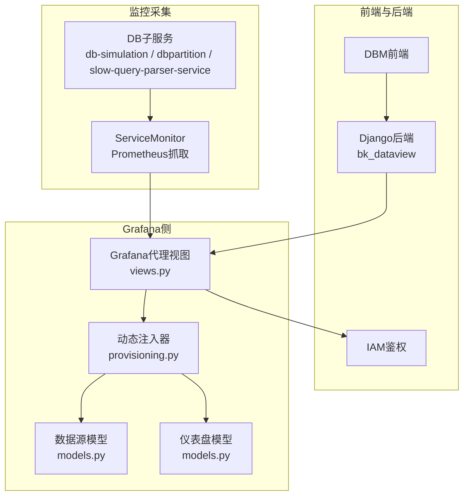
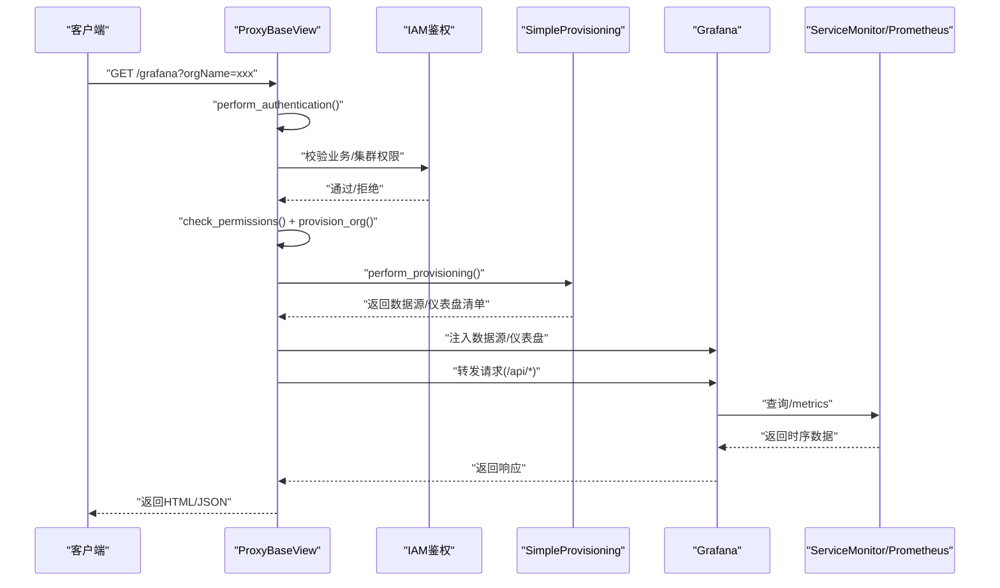
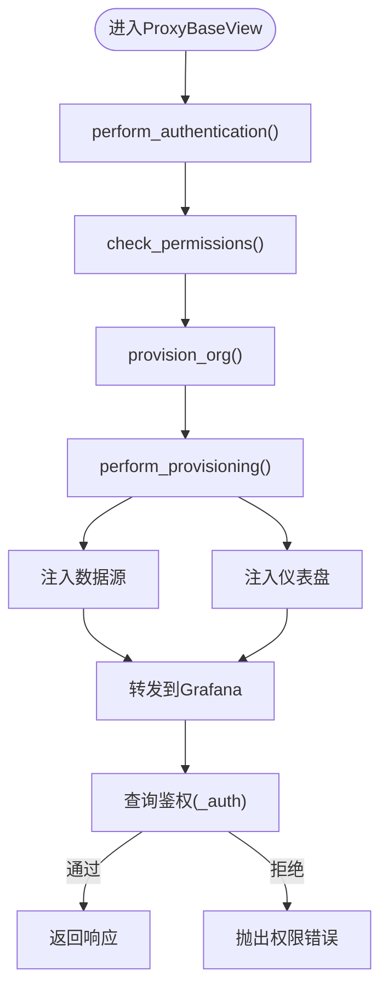
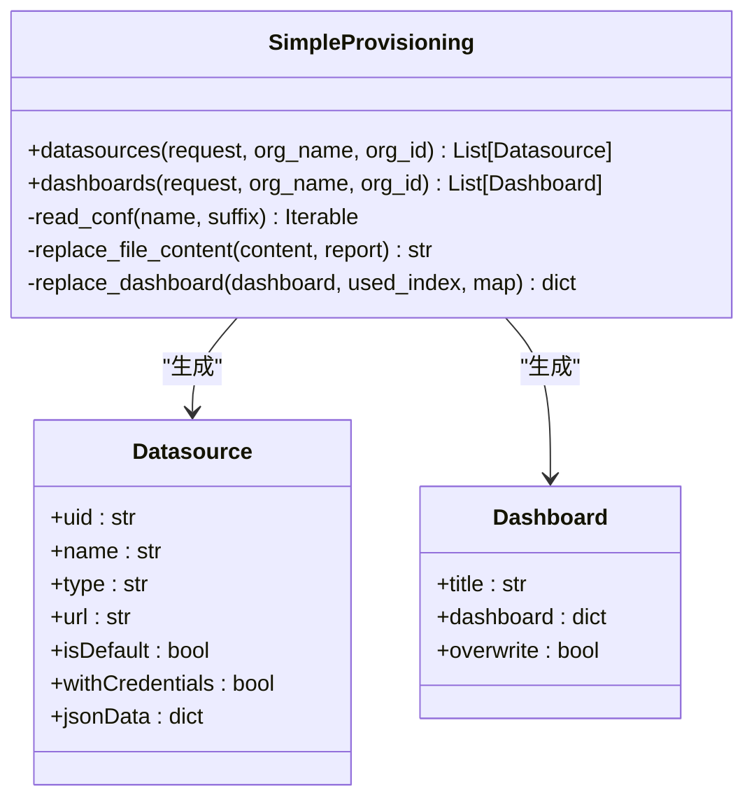
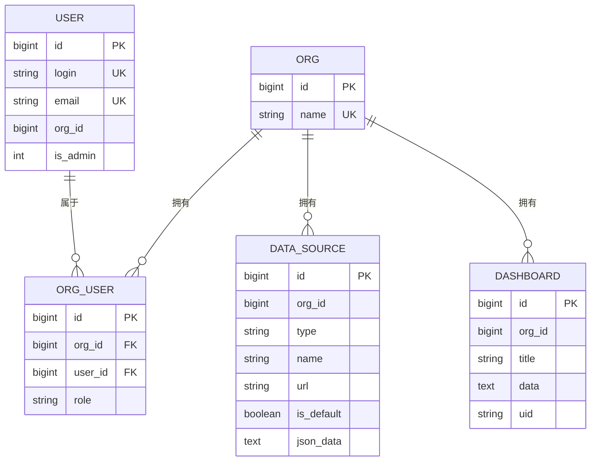
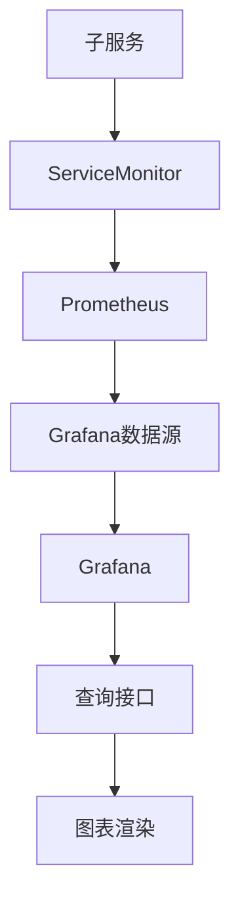
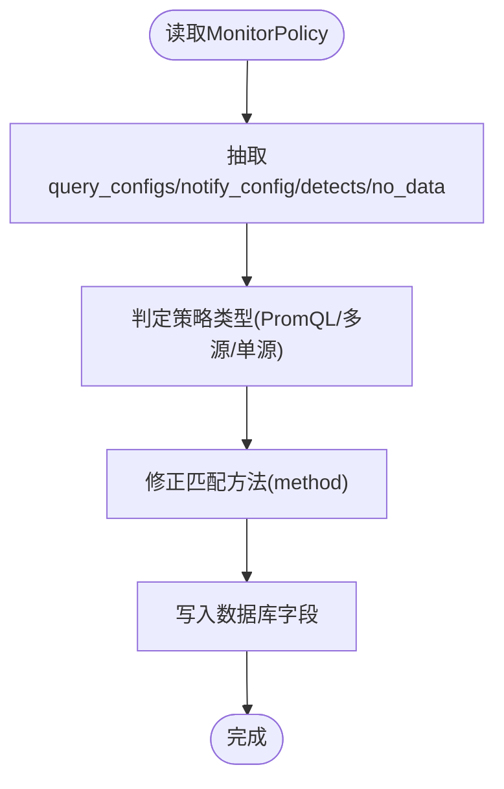
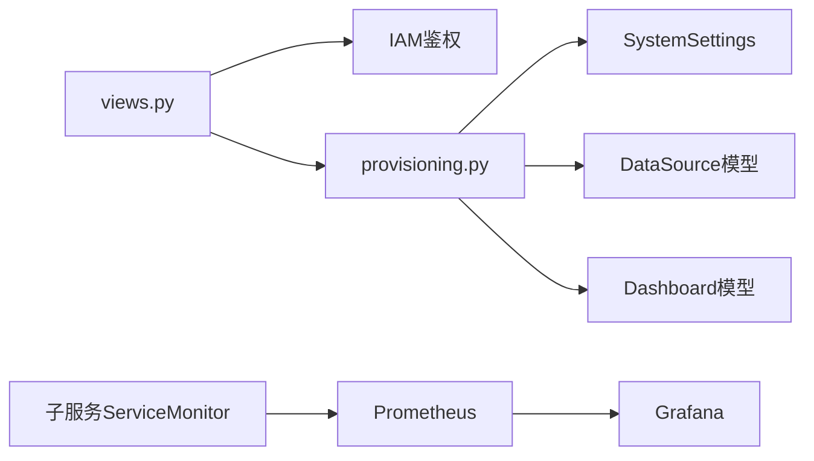

# 监控仪表板

<cite>
**本文引用的文件**   
- [dbm-ui/backend/bk_dataview/README.md](file://dbm-ui/backend/bk_dataview/README.md)
- [dbm-ui/backend/bk_dataview/grafana/views.py](file://dbm-ui/backend/bk_dataview/grafana/views.py)
- [dbm-ui/backend/bk_dataview/grafana/provisioning.py](file://dbm-ui/backend/bk_dataview/grafana/provisioning.py)
- [dbm-ui/backend/bk_dataview/grafana/models.py](file://dbm-ui/backend/bk_dataview/grafana/models.py)
- [dbm-ui/backend/bk_dataview/dashboards/dbm.yaml](file://dbm-ui/backend/bk_dataview/dashboards/dbm.yaml)
- [dbm-ui/config/default.py](file://dbm-ui/config/default.py)
- [helm-charts/bk-dbm/charts/grafana/templates/servicemonitor.yaml](file://helm-charts/bk-dbm/charts/grafana/templates/servicemonitor.yaml)
- [helm-charts/bk-dbm/templates/configmaps/grafana-ini-configmap.yaml](file://helm-charts/bk-dbm/templates/configmaps/grafana-ini-configmap.yaml)
- [helm-charts/bk-dbm/templates/configmaps/grafana-env-configmap.yaml](file://helm-charts/bk-dbm/templates/configmaps/grafana-env-configmap.yaml)
- [helm-charts/bk-dbm/charts/db-simulation/templates/servicemonitor.yaml](file://helm-charts/bk-dbm/charts/db-simulation/templates/servicemonitor.yaml)
- [helm-charts/bk-dbm/charts/dbpartition/templates/servicemonitor.yaml](file://helm-charts/bk-dbm/charts/dbpartition/templates/servicemonitor.yaml)
- [helm-charts/bk-dbm/charts/slow-query-parser-service/templates/servicemonitor.yaml](file://helm-charts/bk-dbm/charts/slow-query-parser-service/templates/servicemonitor.yaml)
- [dbm-ui/scripts/batch_sync_alarm_policy_field.py](file://dbm-ui/scripts/batch_sync_alarm_policy_field.py)
- [dbm-ui/scripts/batch_policy_detects.py](file://dbm-ui/scripts/batch_policy_detects.py)
</cite>

## 目录
1. [简介](#简介)
2. [项目结构](#项目结构)
3. [核心组件](#核心组件)
4. [架构总览](#架构总览)
5. [详细组件分析](#详细组件分析)
6. [依赖关系分析](#依赖关系分析)
7. [性能考量](#性能考量)
8. [故障排查指南](#故障排查指南)
9. [结论](#结论)
10. [附录](#附录)

## 简介
本文件面向DBM（蓝鲸数据库管理）的监控仪表板能力，系统化阐述监控数据的采集、存储与查询机制，以及在Grafana中的可视化呈现、图表组件与实时监控能力。文档重点覆盖以下方面：
- 监控数据采集与暴露：基于Prometheus ServiceMonitor的指标抓取与导出。
- Grafana集成与代理：通过Django后端代理访问Grafana，实现统一鉴权、权限控制与动态注入数据源/仪表盘。
- 仪表板与图表：多租户组织隔离、按集群/业务/组件维度的仪表盘注入与渲染。
- 实时监控与告警：结合DBM策略同步脚本，实现策略字段标准化、聚合信息提取与告警通知。
- 报表与趋势：通过Grafana模板变量与查询接口，支撑趋势分析与报表生成。

## 项目结构
DBM监控仪表板由“前端嵌入式Grafana代理”“Kubernetes监控采集”“策略与告警脚本”三部分组成：
- Grafana代理与注入：位于dbm-ui/backend/bk_dataview，负责鉴权、权限校验、数据源与仪表盘的动态注入。
- Helm监控采集：位于helm-charts/bk-dbm，通过ServiceMonitor暴露/抓取各子服务指标。
- 告警策略同步：位于dbm-ui/scripts，负责将策略详情标准化写入数据库，便于前端展示与告警联动。

**图表来源**
- [dbm-ui/backend/bk_dataview/grafana/views.py:62-120](file://dbm-ui/backend/bk_dataview/grafana/views.py#L62-L120)
- [dbm-ui/backend/bk_dataview/grafana/provisioning.py:70-214](file://dbm-ui/backend/bk_dataview/grafana/provisioning.py#L70-L214)
- [helm-charts/bk-dbm/charts/grafana/templates/servicemonitor.yaml:31-46](file://helm-charts/bk-dbm/charts/grafana/templates/servicemonitor.yaml#L31-L46)
- [helm-charts/bk-dbm/charts/db-simulation/templates/servicemonitor.yaml:16-21](file://helm-charts/bk-dbm/charts/db-simulation/templates/servicemonitor.yaml#L16-L21)

**章节来源**
- [dbm-ui/backend/bk_dataview/README.md:1-256](file://dbm-ui/backend/bk_dataview/README.md#L1-L256)
- [dbm-ui/backend/bk_dataview/grafana/views.py:62-120](file://dbm-ui/backend/bk_dataview/grafana/views.py#L62-L120)
- [helm-charts/bk-dbm/charts/grafana/templates/servicemonitor.yaml:1-50](file://helm-charts/bk-dbm/charts/grafana/templates/servicemonitor.yaml#L1-L50)

## 核心组件
- Grafana代理与鉴权
  - 通过ProxyBaseView完成认证、权限校验与组织注入，随后进行数据源与仪表盘的动态注入。
  - 支持IAM权限校验，针对集群域与业务应用进行细粒度授权。
- 动态注入器
  - SimpleProvisioning从配置路径读取YAML/JSON，注入数据源与仪表盘；同时对仪表盘中的数据源UID与日志索引进行替换，确保在不同业务/组织下正确指向目标数据源。
- 数据模型
  - User/Org/OrgUser/DataSource/Dashboard映射Grafana数据库表，支撑用户、组织、数据源与仪表盘的持久化与查询。
- 监控采集
  - 通过ServiceMonitor暴露/抓取各子服务指标，Prometheus按配置周期拉取，供Grafana查询。
- 告警策略同步
  - 将策略详情中的检测规则、无数据配置、通知间隔等字段标准化写入数据库，便于前端展示与告警联动。

**章节来源**
- [dbm-ui/backend/bk_dataview/grafana/views.py:62-120](file://dbm-ui/backend/bk_dataview/grafana/views.py#L62-L120)
- [dbm-ui/backend/bk_dataview/grafana/provisioning.py:70-214](file://dbm-ui/backend/bk_dataview/grafana/provisioning.py#L70-L214)
- [dbm-ui/backend/bk_dataview/grafana/models.py:16-135](file://dbm-ui/backend/bk_dataview/grafana/models.py#L16-L135)
- [helm-charts/bk-dbm/charts/grafana/templates/servicemonitor.yaml:31-46](file://helm-charts/bk-dbm/charts/grafana/templates/servicemonitor.yaml#L31-L46)
- [dbm-ui/scripts/batch_sync_alarm_policy_field.py:57-146](file://dbm-ui/scripts/batch_sync_alarm_policy_field.py#L57-L146)

## 架构总览
DBM监控仪表板采用“后端代理+动态注入+多租户”的架构模式：
- 前端通过统一前缀访问后端代理，代理根据orgName解析组织上下文。
- 代理完成用户认证、组织注入与数据源/仪表盘注入，随后将请求转发至Grafana。
- Grafana通过ServiceMonitor暴露的/metrics端点被Prometheus抓取，形成时序数据。
- 前端通过Grafana查询接口进行趋势分析与报表生成。

**图表来源**
- [dbm-ui/backend/bk_dataview/grafana/views.py:62-120](file://dbm-ui/backend/bk_dataview/grafana/views.py#L62-L120)
- [dbm-ui/backend/bk_dataview/grafana/provisioning.py:70-214](file://dbm-ui/backend/bk_dataview/grafana/provisioning.py#L70-L214)
- [helm-charts/bk-dbm/charts/grafana/templates/servicemonitor.yaml:31-46](file://helm-charts/bk-dbm/charts/grafana/templates/servicemonitor.yaml#L31-L46)

## 详细组件分析

### Grafana代理与权限控制
- 认证阶段：支持自定义认证类，若通过则创建/获取用户并注入到Grafana。
- 权限阶段：支持自定义权限类，校验orgName与用户关系，必要时创建组织并加入用户。
- 注入阶段：若存在监控令牌，则批量注入数据源与仪表盘；否则跳过注入。
- 查询鉴权：针对特定查询接口（统一查询、PromQL、Grafana查询/日志查询），解析条件并进行集群/业务维度的IAM权限校验。

**图表来源**
- [dbm-ui/backend/bk_dataview/grafana/views.py:62-120](file://dbm-ui/backend/bk_dataview/grafana/views.py#L62-L120)
- [dbm-ui/backend/bk_dataview/grafana/views.py:424-455](file://dbm-ui/backend/bk_dataview/grafana/views.py#L424-L455)

**章节来源**
- [dbm-ui/backend/bk_dataview/grafana/views.py:62-120](file://dbm-ui/backend/bk_dataview/grafana/views.py#L62-L120)
- [dbm-ui/backend/bk_dataview/grafana/views.py:424-455](file://dbm-ui/backend/bk_dataview/grafana/views.py#L424-L455)

### 动态注入器（数据源与仪表盘）
- 数据源注入：从配置路径读取YAML，注入数据源；支持环境变量替换，确保在不同组织下指向正确的数据源。
- 仪表盘注入：读取JSON文件，替换数据源UID与日志索引ID，屏蔽编辑权限，按标签推断仪表盘类型与视图名称，并持久化到MonitorDash模型。
- 组织隔离：通过ORG_NAME/ORG_ID注入，实现多租户隔离。

**图表来源**
- [dbm-ui/backend/bk_dataview/grafana/provisioning.py:70-214](file://dbm-ui/backend/bk_dataview/grafana/provisioning.py#L70-L214)
- [dbm-ui/backend/bk_dataview/dashboards/dbm.yaml:1-8](file://dbm-ui/backend/bk_dataview/dashboards/dbm.yaml#L1-L8)

**章节来源**
- [dbm-ui/backend/bk_dataview/grafana/provisioning.py:70-214](file://dbm-ui/backend/bk_dataview/grafana/provisioning.py#L70-L214)
- [dbm-ui/backend/bk_dataview/dashboards/dbm.yaml:1-8](file://dbm-ui/backend/bk_dataview/dashboards/dbm.yaml#L1-L8)

### Grafana数据模型
- 用户/组织/成员：User/Org/OrgUser，用于多租户与权限控制。
- 数据源/仪表盘：DataSource/Dashboard，用于持久化Grafana侧实体，便于统一管理与查询。

**图表来源**
- [dbm-ui/backend/bk_dataview/grafana/models.py:16-135](file://dbm-ui/backend/bk_dataview/grafana/models.py#L16-L135)

**章节来源**
- [dbm-ui/backend/bk_dataview/grafana/models.py:16-135](file://dbm-ui/backend/bk_dataview/grafana/models.py#L16-L135)

### 监控采集与查询机制
- 采集：各子服务通过ServiceMonitor暴露/metrics端点，Prometheus按配置周期抓取。
- 查询：Grafana通过已注入的数据源查询时序数据，支持PromQL与统一查询接口。
- 配置：Grafana通过ConfigMap注入ini与环境变量，启用代理登录与插件加载。

**图表来源**
- [helm-charts/bk-dbm/charts/grafana/templates/servicemonitor.yaml:31-46](file://helm-charts/bk-dbm/charts/grafana/templates/servicemonitor.yaml#L31-L46)
- [helm-charts/bk-dbm/templates/configmaps/grafana-ini-configmap.yaml:17-42](file://helm-charts/bk-dbm/templates/configmaps/grafana-ini-configmap.yaml#L17-L42)
- [helm-charts/bk-dbm/templates/configmaps/grafana-env-configmap.yaml:15-24](file://helm-charts/bk-dbm/templates/configmaps/grafana-env-configmap.yaml#L15-L24)

**章节来源**
- [helm-charts/bk-dbm/charts/grafana/templates/servicemonitor.yaml:1-50](file://helm-charts/bk-dbm/charts/grafana/templates/servicemonitor.yaml#L1-L50)
- [helm-charts/bk-dbm/templates/configmaps/grafana-ini-configmap.yaml:1-42](file://helm-charts/bk-dbm/templates/configmaps/grafana-ini-configmap.yaml#L1-L42)
- [helm-charts/bk-dbm/templates/configmaps/grafana-env-configmap.yaml:1-24](file://helm-charts/bk-dbm/templates/configmaps/grafana-env-configmap.yaml#L1-L24)

### 告警策略与通知
- 策略字段标准化：脚本将策略详情中的检测规则、恢复配置、无数据配置、通知间隔等抽取并写入数据库，便于前端展示与告警联动。
- 策略类型判定：根据查询配置数量与数据源标签判断策略类型（PromQL/多源/单源），并修正匹配方法。
- 通知配置：提取通知间隔与通知模式，写入策略对象，支撑后续通知流程。

**图表来源**
- [dbm-ui/scripts/batch_sync_alarm_policy_field.py:57-146](file://dbm-ui/scripts/batch_sync_alarm_policy_field.py#L57-L146)
- [dbm-ui/scripts/batch_policy_detects.py:32-46](file://dbm-ui/scripts/batch_policy_detects.py#L32-L46)

**章节来源**
- [dbm-ui/scripts/batch_sync_alarm_policy_field.py:57-146](file://dbm-ui/scripts/batch_sync_alarm_policy_field.py#L57-L146)
- [dbm-ui/scripts/batch_policy_detects.py:32-46](file://dbm-ui/scripts/batch_policy_detects.py#L32-L46)

## 依赖关系分析
- 后端依赖
  - Grafana代理依赖Django中间件与IAM鉴权，确保用户认证与权限控制。
  - 注入器依赖SystemSettings中的监控令牌与日志索引集信息，以替换仪表盘与数据源。
- 前端依赖
  - 通过统一前缀访问代理，代理根据orgName解析组织上下文，实现多租户隔离。
- 监控依赖
  - 子服务通过ServiceMonitor暴露/metrics端点，Prometheus抓取后供Grafana查询。

**图表来源**
- [dbm-ui/backend/bk_dataview/grafana/views.py:62-120](file://dbm-ui/backend/bk_dataview/grafana/views.py#L62-L120)
- [dbm-ui/backend/bk_dataview/grafana/provisioning.py:70-214](file://dbm-ui/backend/bk_dataview/grafana/provisioning.py#L70-L214)
- [helm-charts/bk-dbm/charts/grafana/templates/servicemonitor.yaml:31-46](file://helm-charts/bk-dbm/charts/grafana/templates/servicemonitor.yaml#L31-L46)

**章节来源**
- [dbm-ui/backend/bk_dataview/grafana/views.py:62-120](file://dbm-ui/backend/bk_dataview/grafana/views.py#L62-L120)
- [dbm-ui/backend/bk_dataview/grafana/provisioning.py:70-214](file://dbm-ui/backend/bk_dataview/grafana/provisioning.py#L70-L214)
- [helm-charts/bk-dbm/charts/grafana/templates/servicemonitor.yaml:1-50](file://helm-charts/bk-dbm/charts/grafana/templates/servicemonitor.yaml#L1-L50)

## 性能考量
- 注入性能：SimpleProvisioning通过配置文件批量注入，适用于中小规模场景；对于大规模数据源注入，建议评估DBHandler路径的批量导入能力。
- 查询优化：Prometheus抓取间隔与超时需结合业务规模调优；Grafana查询应避免一次性拉取过多时间序列，合理使用模板变量与聚合。
- 缓存与并发：代理层对用户、组织、仪表盘等建立缓存，减少重复查询；注意缓存失效与一致性问题。
- 渲染性能：图像渲染服务（如Image Renderer）可按需启用，避免不必要的渲染开销。

## 故障排查指南
- 登录与权限
  - 若出现未授权或跳转登录页，检查认证类与权限类配置，确认orgName与用户关系是否正确。
- 注入失败
  - 若数据源/仪表盘未注入，检查监控令牌是否配置，以及PROVISIONING_PATH下的YAML/JSON是否可解析。
- 查询失败
  - 若查询接口报权限错误，检查查询条件解析与IAM权限映射，确认集群域或业务应用是否存在。
- 采集异常
  - 若Prometheus无法抓取指标，检查ServiceMonitor的namespaceSelector与端口配置，确认/metrics端点可达。

**章节来源**
- [dbm-ui/backend/bk_dataview/grafana/views.py:62-120](file://dbm-ui/backend/bk_dataview/grafana/views.py#L62-L120)
- [dbm-ui/backend/bk_dataview/grafana/provisioning.py:70-214](file://dbm-ui/backend/bk_dataview/grafana/provisioning.py#L70-L214)
- [helm-charts/bk-dbm/charts/grafana/templates/servicemonitor.yaml:31-46](file://helm-charts/bk-dbm/charts/grafana/templates/servicemonitor.yaml#L31-L46)

## 结论
DBM监控仪表板通过“后端代理+动态注入+多租户”的架构，实现了与Grafana的深度集成与灵活扩展。结合Prometheus的指标采集与统一查询接口，能够高效支撑性能指标展示、趋势分析与报表生成。配合策略同步脚本，进一步完善了告警策略的标准化与可视化呈现。建议在生产环境中持续优化抓取与查询参数、引入更高效的注入方式，并加强缓存与渲染性能的调优。

## 附录
- Grafana代理配置要点
  - HOST/PREFIX需与Grafana配置一致；ADMIN账号需修改默认密码；CODE_INJECTIONS用于隐藏导航栏等UI元素。
- 多租户与组织
  - 通过orgName/org_id解析组织上下文，支持多业务/项目隔离；默认组织ID可按需调整。
- 仪表盘与数据源
  - 仪表盘注入时会替换数据源UID与日志索引ID，确保跨组织可用；同时屏蔽编辑权限，保证稳定性。

**章节来源**
- [dbm-ui/config/default.py:622-646](file://dbm-ui/config/default.py#L622-L646)
- [dbm-ui/backend/bk_dataview/README.md:50-95](file://dbm-ui/backend/bk_dataview/README.md#L50-L95)