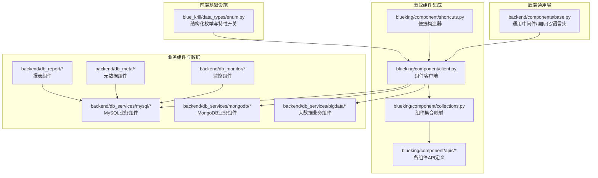
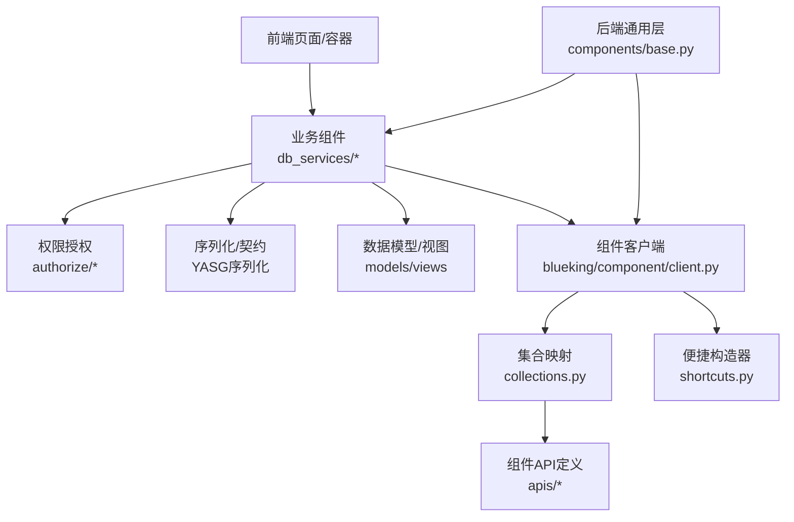
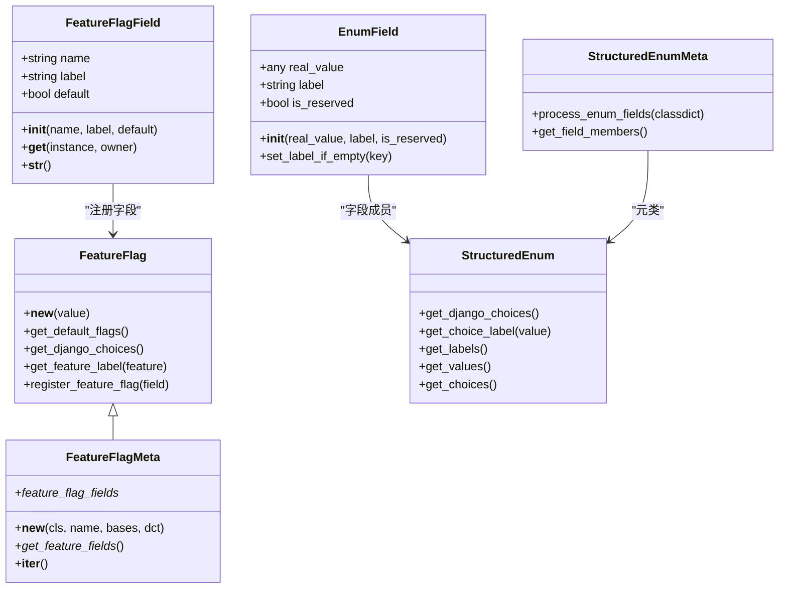
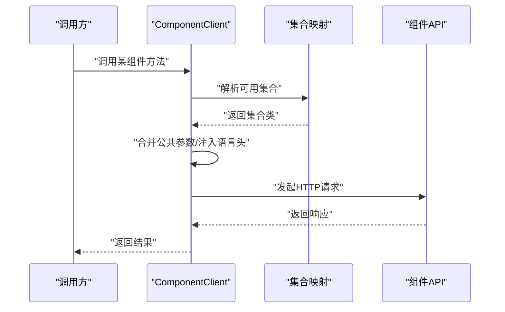
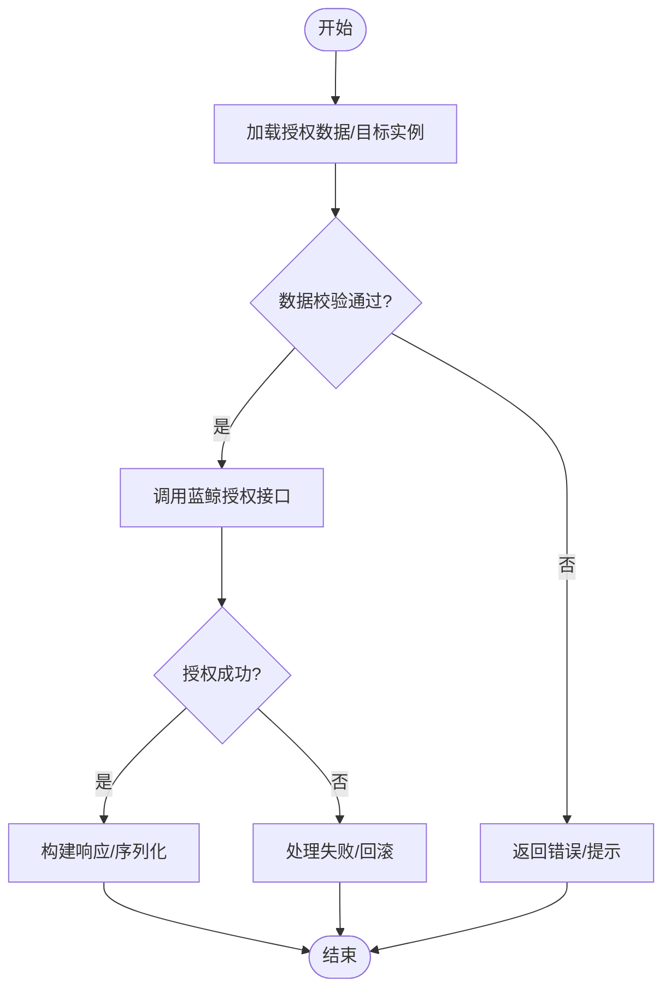
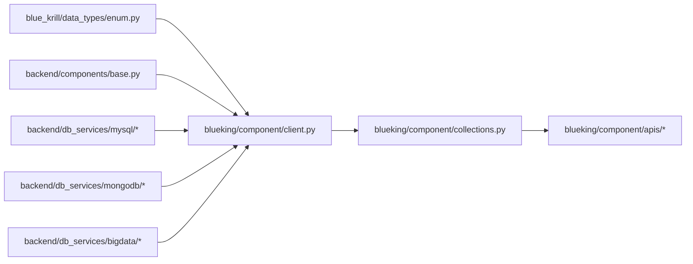

# 组件库与UI元素

<cite>
**本文引用的文件**
- [blue_krill/data_types/enum.py](file://dbm-ui/blue_krill/data_types/enum.py)
- [blueking/component/client.py](file://dbm-ui/blueking/component/client.py)
- [blueking/component/collections.py](file://dbm-ui/blueking/component/collections.py)
- [blueking/component/apis/bk_login.py](file://dbm-ui/blueking/component/apis/bk_login.py)
- [blueking/component/shortcuts.py](file://dbm-ui/blueking/component/shortcuts.py)
- [backend/components/base.py](file://dbm-ui/backend/components/base.py)
- [backend/db_services/dbbase/resources/yasg_slz.py](file://dbm-ui/backend/db_services/dbbase/resources/yasg_slz.py)
- [backend/db_services/mysql/resources/tendbha/yasg_slz.py](file://dbm-ui/backend/db_services/mysql/resources/tendbha/yasg_slz.py)
- [backend/db_services/bigdata/resources/yasg_slz.py](file://dbm-ui/backend/db_services/bigdata/resources/yasg_slz.py)
- [backend/db_services/mongodb/permission/db_authorize/mock_data.py](file://dbm-ui/backend/db_services/mongodb/permission/db_authorize/mock_data.py)
- [backend/db_services/mysql/permission/authorize/handlers.py](file://dbm-ui/backend/db_services/mysql/permission/authorize/handlers.py)
- [backend/db_services/mysql/permission/authorize/views.py](file://dbm-ui/backend/db_services/mysql/permission/authorize/views.py)
- [backend/db_services/mysql/permission/authorize/handlers.py](file://dbm-ui/backend/db_services/mysql/permission/authorize/handlers.py)
- [backend/db_services/mysql/permission/authorize/views.py](file://dbm-ui/backend/db_services/mysql/permission/authorize/views.py)
- [backend/db_services/mysql/permission/authorize/handlers.py](file://dbm-ui/backend/db_services/mysql/permission/authorize/handlers.py)
- [backend/db_services/mysql/permission/authorize/views.py](file://dbm-ui/backend/db_services/mysql/permission/authorize/views.py)
</cite>

## 目录
1. [引言](#引言)
2. [项目结构](#项目结构)
3. [核心组件](#核心组件)
4. [架构总览](#架构总览)
5. [详细组件分析](#详细组件分析)
6. [依赖分析](#依赖分析)
7. [性能考量](#性能考量)
8. [故障排查指南](#故障排查指南)
9. [结论](#结论)
10. [附录](#附录)

## 引言
本文件面向DBM（蓝鲸智云-数据库管理）项目的组件库与UI元素，系统性梳理可复用组件的设计原则、属性配置、事件处理与生命周期；覆盖通用组件、业务组件与插件化组件的实现形态；阐述状态管理、样式定制与主题支持策略；并总结组件间组合模式、扩展机制与最佳实践。文档以仓库现有代码为依据，避免臆测，通过“章节来源”与“图表来源”标注具体出处。

## 项目结构
DBM前端侧组件与UI元素主要分布在以下区域：
- blue_krill/data_types：提供基础数据类型与枚举体系，支撑组件的类型安全与配置能力
- blueking/component：封装蓝鲸组件API客户端与集合，统一调用入口与签名参数
- backend/components：后端组件适配层，提供跨域、国际化等通用能力
- backend/db_services：业务组件与权限控制相关模块，体现业务组件的职责边界与扩展点
- backend/db_report、backend/db_meta、backend/db_monitor 等：业务组件与数据模型，展示数据驱动型组件的典型模式

图表来源
- [blue_krill/data_types/enum.py:1-273](file://dbm-ui/blue_krill/data_types/enum.py#L1-L273)
- [blueking/component/client.py:110-172](file://dbm-ui/blueking/component/client.py#L110-L172)
- [blueking/component/collections.py:1-19](file://dbm-ui/blueking/component/collections.py#L1-L19)
- [blueking/component/apis/bk_login.py:29-55](file://dbm-ui/blueking/component/apis/bk_login.py#L29-L55)
- [blueking/component/shortcuts.py:32-66](file://dbm-ui/blueking/component/shortcuts.py#L32-L66)
- [backend/components/base.py:425-425](file://dbm-ui/backend/components/base.py#L425-L425)

章节来源
- [blue_krill/data_types/enum.py:1-273](file://dbm-ui/blue_krill/data_types/enum.py#L1-L273)
- [blueking/component/client.py:110-172](file://dbm-ui/blueking/component/client.py#L110-L172)
- [blueking/component/collections.py:1-19](file://dbm-ui/blueking/component/collections.py#L1-L19)
- [blueking/component/apis/bk_login.py:29-55](file://dbm-ui/blueking/component/apis/bk_login.py#L29-L55)
- [blueking/component/shortcuts.py:32-66](file://dbm-ui/blueking/component/shortcuts.py#L32-L66)
- [backend/components/base.py:425-425](file://dbm-ui/backend/components/base.py#L425-L425)

## 核心组件
本节聚焦三类组件形态及其设计原则：

- 通用组件
  - 特性开关与结构化枚举：通过结构化枚举与特性开关，统一配置项与标签文案，便于多语言与可测试性
  - 统一客户端与集合：组件客户端负责签名、语言头、公共参数合并；集合映射提供可用组件清单
  - 通用中间件：后端组件基类提供国际化语言头注入，确保跨服务调用一致性

- 业务组件
  - 权限授权与资源序列化：业务组件围绕权限授权、资源序列化与Mock数据展开，体现“数据即界面”的组件模式
  - 资源视图与YAML序列化：通过YASG序列化生成接口文档与示例数据，支撑组件的契约式开发

- 插件化组件
  - 组件集合注册：通过集合映射集中注册可用组件，便于按需启用与扩展
  - 客户端动态代理：客户端按需缓存集合实例，形成“插件化”的按需加载与调用

章节来源
- [blue_krill/data_types/enum.py:86-125](file://dbm-ui/blue_krill/data_types/enum.py#L86-L125)
- [blueking/component/client.py:136-171](file://dbm-ui/blueking/component/client.py#L136-L171)
- [blueking/component/collections.py:15-19](file://dbm-ui/blueking/component/collections.py#L15-L19)
- [backend/components/base.py:425-425](file://dbm-ui/backend/components/base.py#L425-L425)
- [backend/db_services/dbbase/resources/yasg_slz.py:73-73](file://dbm-ui/backend/db_services/dbbase/resources/yasg_slz.py#L73-L73)
- [backend/db_services/mysql/resources/tendbha/yasg_slz.py:23-23](file://dbm-ui/backend/db_services/mysql/resources/tendbha/yasg_slz.py#L23-L23)
- [backend/db_services/bigdata/resources/yasg_slz.py:24-75](file://dbm-ui/backend/db_services/bigdata/resources/yasg_slz.py#L24-L75)

## 架构总览
下图展示组件库与业务组件的交互关系，以及与后端通用层的协作方式。

图表来源
- [blueking/component/client.py:110-172](file://dbm-ui/blueking/component/client.py#L110-L172)
- [blueking/component/collections.py:15-19](file://dbm-ui/blueking/component/collections.py#L15-L19)
- [blueking/component/apis/bk_login.py:29-55](file://dbm-ui/blueking/component/apis/bk_login.py#L29-L55)
- [blueking/component/shortcuts.py:32-66](file://dbm-ui/blueking/component/shortcuts.py#L32-L66)
- [backend/components/base.py:425-425](file://dbm-ui/backend/components/base.py#L425-L425)

## 详细组件分析

### 结构化枚举与特性开关（通用组件）
- 设计原则
  - 类型安全：通过结构化枚举与特性开关，约束取值范围与默认行为
  - 可扩展：支持注册新的特性开关字段，保持向后兼容
  - 多语言友好：枚举字段提供标签，便于国际化显示
- 关键点
  - 特性开关字段注册与校验
  - 枚举字段成员到choices的转换
  - 字段标签与保留字段过滤

图表来源
- [blue_krill/data_types/enum.py:20-125](file://dbm-ui/blue_krill/data_types/enum.py#L20-L125)
- [blue_krill/data_types/enum.py:137-232](file://dbm-ui/blue_krill/data_types/enum.py#L137-L232)

章节来源
- [blue_krill/data_types/enum.py:20-125](file://dbm-ui/blue_krill/data_types/enum.py#L20-L125)
- [blue_krill/data_types/enum.py:137-232](file://dbm-ui/blue_krill/data_types/enum.py#L137-L232)

### 组件客户端与集合（插件化组件）
- 设计原则
  - 插件化：通过集合映射集中注册可用组件，按需启用
  - 统一签名与语言头：客户端自动注入签名参数与语言头
  - 动态代理：按需缓存集合实例，减少重复构造
- 关键点
  - 基础客户端与带签名客户端的差异
  - 公共参数合并与请求头注入
  - 集合映射与可用组件清单

图表来源
- [blueking/component/client.py:136-171](file://dbm-ui/blueking/component/client.py#L136-L171)
- [blueking/component/collections.py:15-19](file://dbm-ui/blueking/component/collections.py#L15-L19)
- [blueking/component/apis/bk_login.py:29-55](file://dbm-ui/blueking/component/apis/bk_login.py#L29-L55)

章节来源
- [blueking/component/client.py:110-172](file://dbm-ui/blueking/component/client.py#L110-L172)
- [blueking/component/collections.py:15-19](file://dbm-ui/blueking/component/collections.py#L15-L19)
- [blueking/component/apis/bk_login.py:29-55](file://dbm-ui/blueking/component/apis/bk_login.py#L29-L55)
- [blueking/component/shortcuts.py:32-66](file://dbm-ui/blueking/component/shortcuts.py#L32-L66)

### 权限授权组件（业务组件）
- 设计原则
  - 数据驱动：权限授权流程由数据模型与序列化定义驱动
  - 可观测：通过视图与处理器分离职责，便于日志与审计
  - 可扩展：Mock数据与真实接口解耦，便于测试与灰度
- 关键点
  - 授权处理器与视图的协作
  - 蓝鲸授权接口调用
  - Mock数据与目标实例配置

图表来源
- [backend/db_services/mysql/permission/authorize/handlers.py:210-210](file://dbm-ui/backend/db_services/mysql/permission/authorize/handlers.py#L210-L210)
- [backend/db_services/mysql/permission/authorize/views.py:68-68](file://dbm-ui/backend/db_services/mysql/permission/authorize/views.py#L68-L68)
- [backend/db_services/mongodb/permission/db_authorize/mock_data.py:13-13](file://dbm-ui/backend/db_services/mongodb/permission/db_authorize/mock_data.py#L13-L13)

章节来源
- [backend/db_services/mysql/permission/authorize/handlers.py:210-210](file://dbm-ui/backend/db_services/mysql/permission/authorize/handlers.py#L210-L210)
- [backend/db_services/mysql/permission/authorize/views.py:68-68](file://dbm-ui/backend/db_services/mysql/permission/authorize/views.py#L68-L68)
- [backend/db_services/mongodb/permission/db_authorize/mock_data.py:13-13](file://dbm-ui/backend/db_services/mongodb/permission/db_authorize/mock_data.py#L13-L13)

### 资源序列化与YASG契约（业务组件）
- 设计原则
  - 契约先行：通过YASG序列化生成接口文档与示例数据
  - 数据即界面：序列化输出直接驱动前端展示
  - 可维护：示例数据与接口契约保持一致
- 关键点
  - MySQL高可用集群域名与节点ID示例
  - MongoDB权限目标实例示例
  - 大数据模块的节点关系与DNS示例

章节来源
- [backend/db_services/dbbase/resources/yasg_slz.py:73-73](file://dbm-ui/backend/db_services/dbbase/resources/yasg_slz.py#L73-L73)
- [backend/db_services/mysql/resources/tendbha/yasg_slz.py:23-23](file://dbm-ui/backend/db_services/mysql/resources/tendbha/yasg_slz.py#L23-L23)
- [backend/db_services/bigdata/resources/yasg_slz.py:24-75](file://dbm-ui/backend/db_services/bigdata/resources/yasg_slz.py#L24-L75)

## 依赖分析
- 组件耦合与内聚
  - blue_krill/data_types 提供类型与配置能力，被上层组件广泛依赖
  - blueking/component 将“客户端-集合-API”解耦，形成清晰的插件化入口
  - backend/components/base 作为通用层，向上游组件提供语言头与中间件能力
- 外部依赖与集成点
  - 组件API通过集合映射集中注册，便于替换与扩展
  - 权限授权组件依赖蓝鲸授权接口，通过处理器与视图解耦
- 潜在循环依赖
  - 当前结构以“工具层→客户端层→业务层”单向依赖为主，未见明显循环

图表来源
- [blue_krill/data_types/enum.py:1-273](file://dbm-ui/blue_krill/data_types/enum.py#L1-L273)
- [blueking/component/client.py:110-172](file://dbm-ui/blueking/component/client.py#L110-L172)
- [blueking/component/collections.py:15-19](file://dbm-ui/blueking/component/collections.py#L15-L19)
- [backend/components/base.py:425-425](file://dbm-ui/backend/components/base.py#L425-L425)

章节来源
- [blue_krill/data_types/enum.py:1-273](file://dbm-ui/blue_krill/data_types/enum.py#L1-L273)
- [blueking/component/client.py:110-172](file://dbm-ui/blueking/component/client.py#L110-L172)
- [blueking/component/collections.py:15-19](file://dbm-ui/blueking/component/collections.py#L15-L19)
- [backend/components/base.py:425-425](file://dbm-ui/backend/components/base.py#L425-L425)

## 性能考量
- 客户端请求优化
  - 统一参数合并与语言头注入，减少重复计算
  - 按需缓存集合实例，降低对象构造开销
- 序列化与契约
  - YASG序列化输出应避免冗余字段，提升传输效率
  - 示例数据尽量精简，仅保留关键字段
- 权限授权
  - 批量授权场景下，优先使用批量接口，减少往返次数
  - 失败重试与超时控制需结合后端限流策略

## 故障排查指南
- 组件调用失败
  - 检查签名参数与时间戳/随机数是否正确生成
  - 确认语言头是否正确注入
- 权限授权异常
  - 核对目标实例与授权范围配置
  - 查看处理器与视图的日志输出，定位失败环节
- 国际化问题
  - 确认通用中间件已注入语言头
  - 校验枚举标签与多语言资源是否匹配

章节来源
- [blueking/component/client.py:136-171](file://dbm-ui/blueking/component/client.py#L136-L171)
- [backend/components/base.py:425-425](file://dbm-ui/backend/components/base.py#L425-L425)
- [backend/db_services/mysql/permission/authorize/handlers.py:210-210](file://dbm-ui/backend/db_services/mysql/permission/authorize/handlers.py#L210-L210)

## 结论
DBM组件库以“类型安全+插件化客户端+业务契约”为核心，实现了通用组件、业务组件与插件化组件的协同。通过结构化枚举与特性开关保障配置一致性，通过组件客户端与集合映射实现灵活扩展，通过YASG契约与权限授权组件实现数据驱动与可观测性。建议在后续迭代中持续完善错误处理与性能监控，强化组件间的组合与复用模式。

## 附录
- 最佳实践
  - 使用结构化枚举与特性开关统一配置项
  - 通过集合映射集中注册组件，便于替换与扩展
  - 采用YASG契约先行，保证前后端一致性
  - 权限授权组件遵循“处理器-视图-接口”分层
- 扩展机制
  - 新增组件：在集合映射中注册，提供API定义与序列化
  - 新增特性开关：通过特性开关类注册字段
  - 国际化：确保枚举标签与翻译资源同步更新