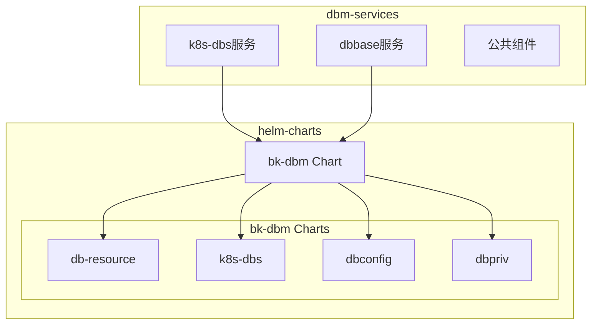
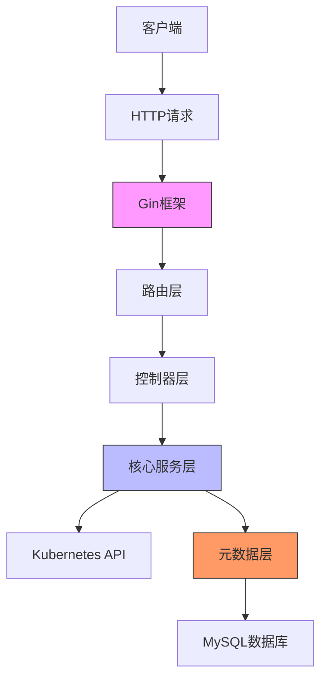
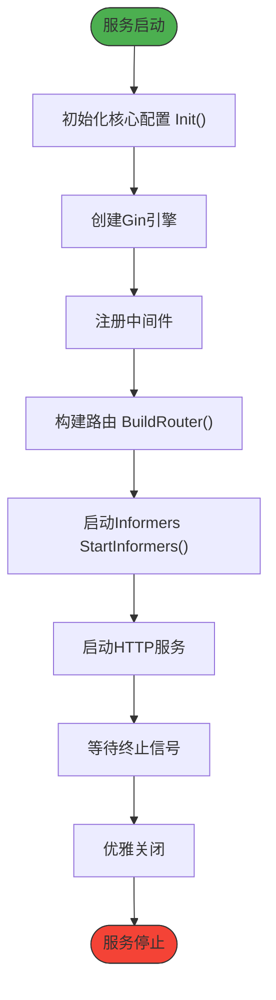
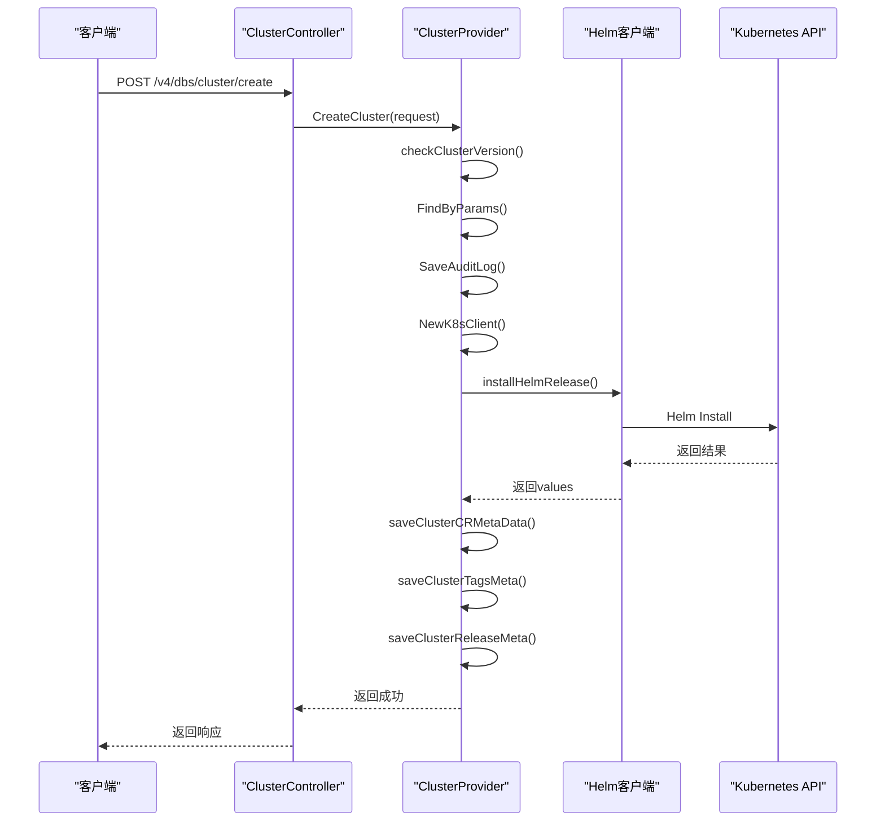
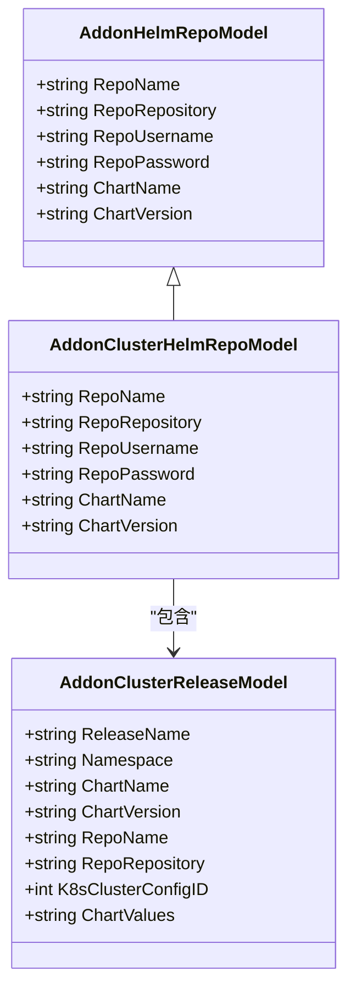
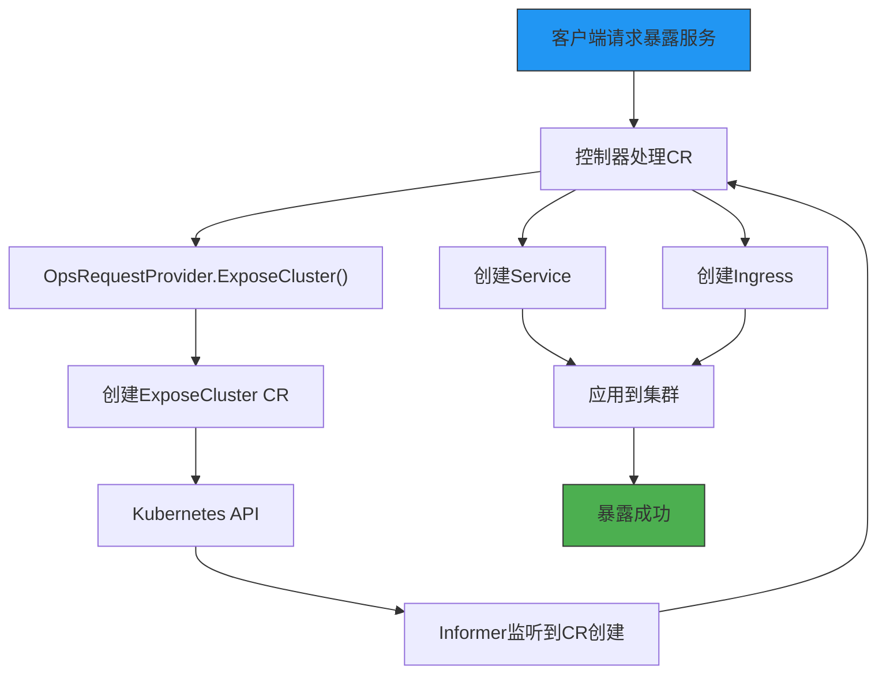
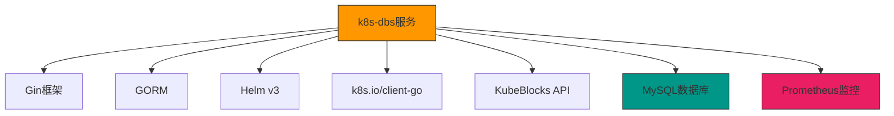

# Kubernetes数据库服务

<cite>
**本文档引用的文件**   
- [server.go](file://dbm-services/k8s-dbs/cmd/server.go)
- [README.md](file://dbm-services/k8s-dbs/README.md)
- [go.mod](file://dbm-services/k8s-dbs/go.mod)
- [init.go](file://dbm-services/k8s-dbs/core/init.go)
- [router.go](file://dbm-services/k8s-dbs/router/router.go)
- [informer.go](file://dbm-services/k8s-dbs/informers/informer.go)
- [cluster_provider.go](file://dbm-services/k8s-dbs/core/provider/cluster_provider.go)
- [Chart.yaml](file://helm-charts/bk-dbm/Chart.yaml)
- [values.yaml](file://helm-charts/bk-dbm/values.yaml)
- [deployment.yaml](file://helm-charts/bk-dbm/charts/db-resource/templates/deployment.yaml)
- [service.yaml](file://helm-charts/bk-dbm/charts/k8s-dbs/templates/service.yaml)
- [addon_helm_repo_suite_test.go](file://dbm-services/k8s-dbs/metadata/dbaccess/testsuite/addon_helm_repo_suite_test.go)
- [api_type_const.go](file://dbm-services/k8s-dbs/common/constant/api_type_const.go)
- [cluster_controller.go](file://dbm-services/k8s-dbs/core/api/controller/cluster_controller.go)
- [ops_provider.go](file://dbm-services/k8s-dbs/core/provider/ops_provider.go)
</cite>

## 目录
1. [引言](#引言)
2. [项目结构](#项目结构)
3. [核心组件](#核心组件)
4. [架构概述](#架构概述)
5. [详细组件分析](#详细组件分析)
6. [依赖分析](#依赖分析)
7. [性能考虑](#性能考虑)
8. [故障排查指南](#故障排查指南)
9. [结论](#结论)

## 引言
本文档旨在深入分析`dbbase`和`k8s-dbs`服务在Kubernetes环境下的协同工作机制，重点阐述如何通过Helm Chart和Kubernetes API实现数据库实例的部署与管理。文档将详细解释服务层如何处理Pod、Service、PVC等Kubernetes资源的创建、更新和删除，并通过实例展示在K8s中部署MySQL实例的完整流程，包括Helm Release管理、Service暴露和监控集成。同时，将讨论K8s环境下数据库的弹性伸缩和故障自愈策略。

## 项目结构
项目结构清晰地分为多个服务模块，其中`dbm-services/k8s-dbs`是核心的数据库管控服务，负责与Kubernetes集群交互。`helm-charts/bk-dbm`目录包含了部署整个DBM系统所需的Helm Charts，这些Chart定义了各个微服务的部署配置。

**图表来源**
- [server.go](file://dbm-services/k8s-dbs/cmd/server.go)
- [Chart.yaml](file://helm-charts/bk-dbm/Chart.yaml)
- [values.yaml](file://helm-charts/bk-dbm/values.yaml)

**章节来源**
- [server.go](file://dbm-services/k8s-dbs/cmd/server.go)
- [Chart.yaml](file://helm-charts/bk-dbm/Chart.yaml)

## 核心组件
`k8s-dbs`服务是基于Go客户端和KubeBlocks API构建的数据库管控服务，使用Gin框架开发。它提供了一系列RESTful API，允许用户在Kubernetes集群中基于KubeBlocks组件轻松部署、管理和操作数据库集群。主要功能包括数据库集群的创建、删除、缩放、启动、停止、重启和升级等。

**章节来源**
- [README.md](file://dbm-services/k8s-dbs/README.md)
- [go.mod](file://dbm-services/k8s-dbs/go.mod)

## 架构概述
`k8s-dbs`服务的架构分为多个层次：入口层由Gin框架处理HTTP请求；路由层将请求分发到相应的控制器；核心服务层处理业务逻辑并与Kubernetes API交互；元数据层负责与数据库交互，存储和检索集群、组件等元信息。

**图表来源**
- [server.go](file://dbm-services/k8s-dbs/cmd/server.go)
- [router.go](file://dbm-services/k8s-dbs/router/router.go)
- [init.go](file://dbm-services/k8s-dbs/core/init.go)

## 详细组件分析

### k8s-dbs服务分析
`k8s-dbs`服务的入口点是`server.go`中的`main`函数，它负责初始化核心配置、注册中间件、构建路由并启动HTTP服务。服务启动后，会通过`StartInformers`启动多个Informer来监听Kubernetes集群中的资源变化。

#### 服务启动流程

**图表来源**
- [server.go](file://dbm-services/k8s-dbs/cmd/server.go#L48-L108)

#### 集群创建流程

**图表来源**
- [cluster_provider.go](file://dbm-services/k8s-dbs/core/provider/cluster_provider.go#L216-L280)
- [server.go](file://dbm-services/k8s-dbs/cmd/server.go)

**章节来源**
- [cluster_provider.go](file://dbm-services/k8s-dbs/core/provider/cluster_provider.go)
- [server.go](file://dbm-services/k8s-dbs/cmd/server.go)

### Helm Chart管理
Helm Chart是部署数据库实例的核心。`k8s-dbs`服务通过Helm Go SDK与Helm仓库交互，安装、升级和删除数据库集群。Chart的元数据存储在MySQL数据库中，包括仓库地址、认证信息、Chart名称和版本等。

#### Helm仓库配置

**图表来源**
- [addon_helm_repo_suite_test.go](file://dbm-services/k8s-dbs/metadata/dbaccess/testsuite/addon_helm_repo_suite_test.go)
- [addoncluster_helm_repo_suite_test.go](file://dbm-services/k8s-dbs/metadata/dbaccess/testsuite/addoncluster_helm_repo_suite_test.go)
- [addoncluster_release_suite_test.go](file://dbm-services/k8s-dbs/metadata/dbaccess/testsuite/addoncluster_release_suite_test.go)

### 服务暴露机制
当需要将数据库服务暴露给外部访问时，`k8s-dbs`服务会创建一个`ExposeCluster`自定义资源（CR），并通过Kubernetes API将其提交到集群中。Informer会监听到这个资源的创建，并触发相应的控制器来创建Service、Ingress等资源。

#### 服务暴露流程

**图表来源**
- [cluster_controller.go](file://dbm-services/k8s-dbs/core/api/controller/cluster_controller.go#L387-L407)
- [ops_provider.go](file://dbm-services/k8s-dbs/core/provider/ops_provider.go#L811-L858)

**章节来源**
- [cluster_controller.go](file://dbm-services/k8s-dbs/core/api/controller/cluster_controller.go)
- [ops_provider.go](file://dbm-services/k8s-dbs/core/provider/ops_provider.go)

## 依赖分析
`k8s-dbs`服务依赖于多个外部组件和库，包括Kubernetes客户端库、Helm库、Gin Web框架、GORM数据库ORM等。这些依赖在`go.mod`文件中明确定义。

**图表来源**
- [go.mod](file://dbm-services/k8s-dbs/go.mod)
- [init.go](file://dbm-services/k8s-dbs/core/init.go)

**章节来源**
- [go.mod](file://dbm-services/k8s-dbs/go.mod)
- [init.go](file://dbm-services/k8s-dbs/core/init.go)

## 性能考虑
`k8s-dbs`服务通过Informer机制实现了对Kubernetes资源的高效监听，避免了频繁的轮询查询。同时，服务使用了连接池和缓存机制来优化数据库访问性能。对于高并发场景，可以通过水平扩展`k8s-dbs`服务实例来提高处理能力。

## 故障排查指南
当遇到数据库实例部署失败时，应首先检查`k8s-dbs`服务的日志，查看是否有Helm安装错误或Kubernetes API调用失败。其次，检查MySQL数据库中的元数据表，确认集群、组件等信息是否正确存储。最后，检查Kubernetes集群中的相关资源（如Pod、Service、PVC）的状态，定位具体问题。

**章节来源**
- [server.go](file://dbm-services/k8s-dbs/cmd/server.go)
- [informer.go](file://dbm-services/k8s-dbs/informers/informer.go)

## 结论
`dbbase`和`k8s-dbs`服务通过紧密协作，实现了在Kubernetes环境中对数据库实例的全生命周期管理。`k8s-dbs`服务作为核心管控组件，利用Helm Chart和Kubernetes API实现了资源的编排和管理，而`dbbase`服务则提供了基础的数据库操作能力。这种架构设计使得数据库的部署和管理更加自动化、标准化和可扩展。