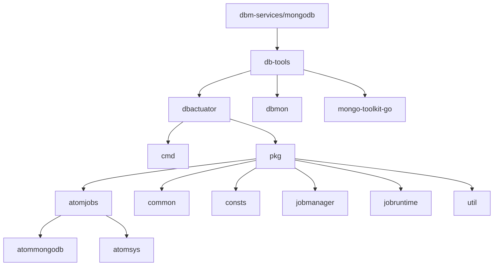
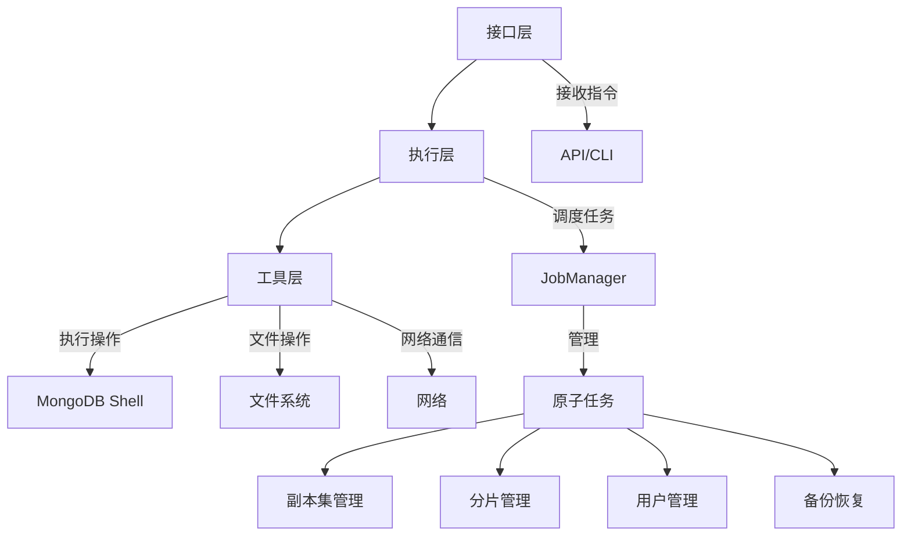
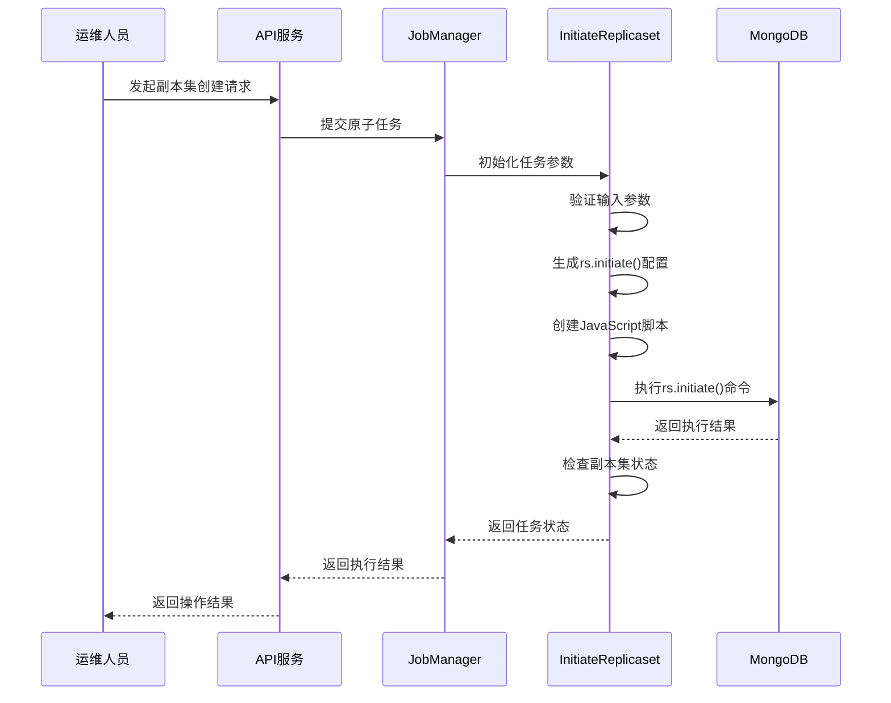
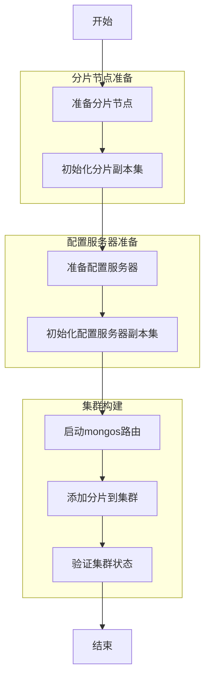
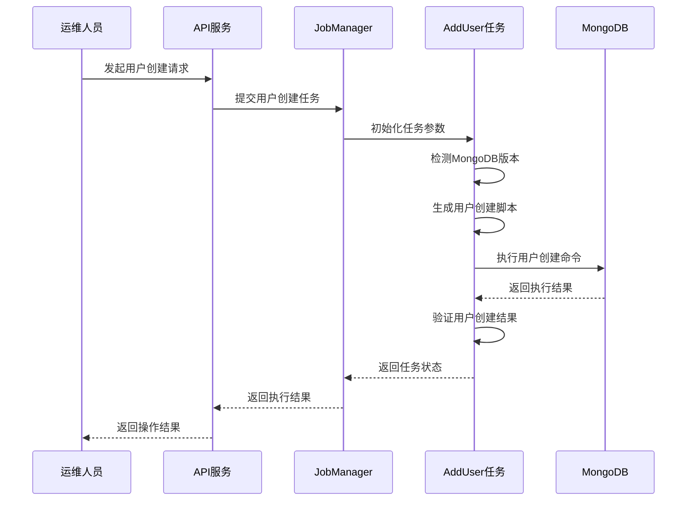
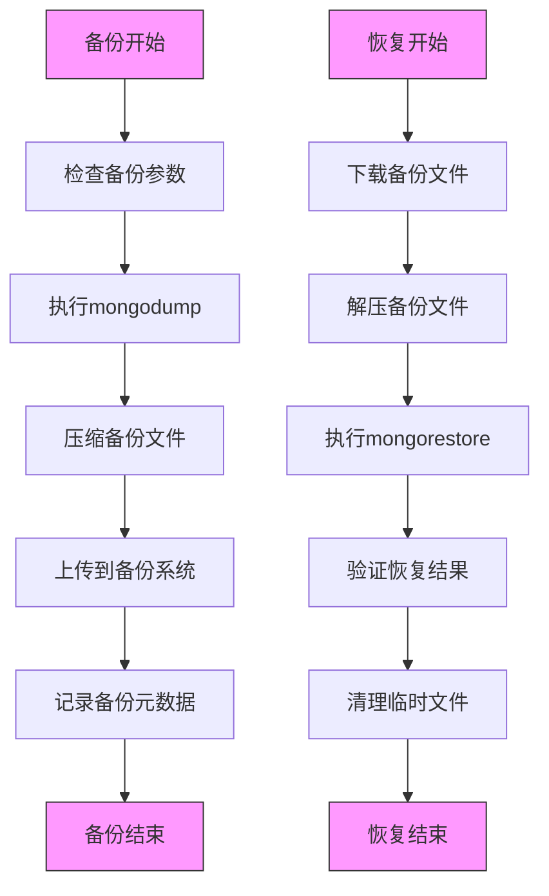
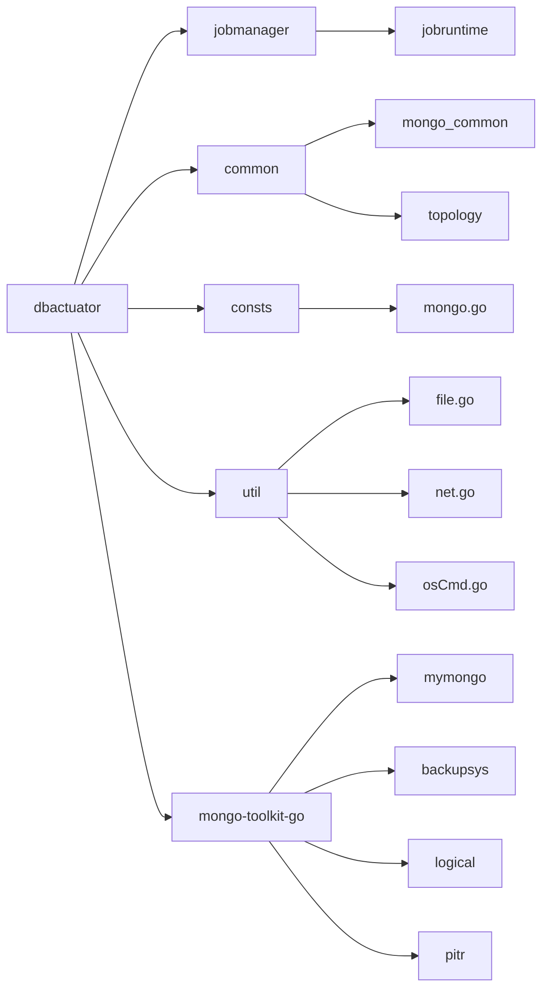

# MongoDB服务模块

<cite>
**本文档引用的文件**   
- [initiate_replicaset.go](file://dbm-services/mongodb/db-tools/dbactuator/pkg/atomjobs/atommongodb/initiate_replicaset.go)
- [add_shard_to_cluster.go](file://dbm-services/mongodb/db-tools/dbactuator/pkg/atomjobs/atommongodb/add_shard_to_cluster.go)
- [backup.go](file://dbm-services/mongodb/db-tools/dbactuator/pkg/atomjobs/atommongodb/backup.go)
- [add_user.go](file://dbm-services/mongodb/db-tools/dbactuator/pkg/atomjobs/atommongodb/add_user.go)
- [restore.go](file://dbm-services/mongodb/db-tools/dbactuator/pkg/atomjobs/atommongodb/restore.go)
- [root.go](file://dbm-services/mongodb/db-tools/dbactuator/cmd/root.go)
- [atommongodb.go](file://dbm-services/mongodb/db-tools/dbactuator/pkg/atomjobs/atommongodb/atommongodb.go)
</cite>

## 目录
1. [项目结构](#项目结构)
2. [核心组件](#核心组件)
3. [架构概述](#架构概述)
4. [详细组件分析](#详细组件分析)
5. [依赖分析](#依赖分析)
6. [性能考虑](#性能考虑)
7. [故障排除指南](#故障排除指南)
8. [结论](#结论)

## 项目结构

MongoDB服务模块位于`dbm-services/mongodb`目录下，主要包含三个子模块：`dbactuator`、`dbmon`和`mongo-toolkit-go`。其中`dbactuator`是实现MongoDB全生命周期管理的核心组件。

**图源**
- [initiate_replicaset.go](file://dbm-services/mongodb/db-tools/dbactuator/pkg/atomjobs/atommongodb/initiate_replicaset.go)
- [add_shard_to_cluster.go](file://dbm-services/mongodb/db-tools/dbactuator/pkg/atomjobs/atommongodb/add_shard_to_cluster.go)

**节源**
- [initiate_replicaset.go](file://dbm-services/mongodb/db-tools/dbactuator/pkg/atomjobs/atommongodb/initiate_replicaset.go)
- [add_shard_to_cluster.go](file://dbm-services/mongodb/db-tools/dbactuator/pkg/atomjobs/atommongodb/add_shard_to_cluster.go)

## 核心组件

MongoDB服务模块的核心功能由`dbactuator`工具实现，该工具通过原子任务（atomic jobs）的方式管理MongoDB实例的全生命周期。主要组件包括：

- **副本集管理**：通过`initiate_replicaset`原子任务实现副本集的初始化
- **分片集群管理**：通过`add_shard_to_cluster`原子任务实现分片的添加
- **用户权限管理**：通过`add_user`原子任务实现用户创建和权限分配
- **备份恢复**：通过`backup`和`restore`原子任务实现数据的备份与恢复
- **自动化修复**：通过`autofix`机制实现故障的自动检测和修复

这些组件共同构成了MongoDB服务的完整管理能力。

**节源**
- [atommongodb.go](file://dbm-services/mongodb/db-tools/dbactuator/pkg/atomjobs/atommongodb/atommongodb.go)
- [root.go](file://dbm-services/mongodb/db-tools/dbactuator/cmd/root.go)

## 架构概述

MongoDB服务模块采用分层架构设计，从上到下分为接口层、执行层和工具层。接口层接收管理指令，执行层调度具体的原子任务，工具层提供底层的MongoDB操作能力。

**图源**
- [root.go](file://dbm-services/mongodb/db-tools/dbactuator/cmd/root.go)
- [jobmanager.go](file://dbm-services/mongodb/db-tools/dbactuator/pkg/jobmanager/jobmanager.go)

## 详细组件分析

### 副本集管理分析

副本集管理是MongoDB高可用性的基础，通过`initiate_replicaset`原子任务实现。该任务封装了`rs.initiate()`命令，实现了副本集的全生命周期管理。

#### 副本集初始化流程

**图源**
- [initiate_replicaset.go](file://dbm-services/mongodb/db-tools/dbactuator/pkg/atomjobs/atommongodb/initiate_replicaset.go)

**节源**
- [initiate_replicaset.go](file://dbm-services/mongodb/db-tools/dbactuator/pkg/atomjobs/atommongodb/initiate_replicaset.go)

### 分片集群管理分析

分片集群管理通过`add_shard_to_cluster`原子任务实现，该任务封装了`sh.addShard()`命令，实现了分片的动态添加。

#### 分片集群部署流程

**图源**
- [add_shard_to_cluster.go](file://dbm-services/mongodb/db-tools/dbactuator/pkg/atomjobs/atommongodb/add_shard_to_cluster.go)

**节源**
- [add_shard_to_cluster.go](file://dbm-services/mongodb/db-tools/dbactuator/pkg/atomjobs/atommongodb/add_shard_to_cluster.go)

### 用户权限管理分析

用户权限管理通过`add_user`原子任务实现，支持不同MongoDB版本的用户创建语法。

#### 用户创建流程

**图源**
- [add_user.go](file://dbm-services/mongodb/db-tools/dbactuator/pkg/atomjobs/atommongodb/add_user.go)

**节源**
- [add_user.go](file://dbm-services/mongodb/db-tools/dbactuator/pkg/atomjobs/atommongodb/add_user.go)

### 备份恢复机制分析

备份恢复功能通过`backup`和`restore`原子任务实现，提供了完整的数据保护能力。

#### 备份恢复流程

**图源**
- [backup.go](file://dbm-services/mongodb/db-tools/dbactuator/pkg/atomjobs/atommongodb/backup.go)
- [restore.go](file://dbm-services/mongodb/db-tools/dbactuator/pkg/atomjobs/atommongodb/restore.go)

**节源**
- [backup.go](file://dbm-services/mongodb/db-tools/dbactuator/pkg/atomjobs/atommongodb/backup.go)
- [restore.go](file://dbm-services/mongodb/db-tools/dbactuator/pkg/atomjobs/atommongodb/restore.go)

## 依赖分析

MongoDB服务模块依赖于多个内部和外部组件，形成了复杂的依赖关系网络。

**图源**
- [go.mod](file://dbm-services/mongodb/db-tools/dbactuator/go.mod)
- [root.go](file://dbm-services/mongodb/db-tools/dbactuator/cmd/root.go)

**节源**
- [go.mod](file://dbm-services/mongodb/db-tools/dbactuator/go.mod)
- [root.go](file://dbm-services/mongodb/db-tools/dbactuator/cmd/root.go)

## 性能考虑

MongoDB服务模块在设计时考虑了多个性能优化点：

1. **并发控制**：通过`GetConcurrentLock`机制限制同时执行的备份任务数量，避免系统资源过载
2. **资源清理**：定期清理旧的备份文件和临时文件，防止磁盘空间耗尽
3. **压缩优化**：根据操作系统类型选择合适的压缩算法（zstd或gzip），平衡压缩比和性能
4. **连接管理**：复用MongoDB连接，减少连接建立的开销
5. **日志优化**：合理设置日志级别，避免过多的日志输出影响性能

这些优化措施确保了在大规模MongoDB实例管理场景下的稳定性和性能。

## 故障排除指南

当MongoDB服务模块出现问题时，可以按照以下步骤进行排查：

1. **检查日志文件**：查看`dbactuator`的日志输出，定位错误信息
2. **验证参数配置**：确认任务参数是否正确，特别是IP地址、端口和认证信息
3. **检查网络连接**：确保目标MongoDB实例网络可达
4. **验证权限设置**：确认执行用户有足够的操作系统和数据库权限
5. **检查磁盘空间**：确保有足够的磁盘空间用于备份和临时文件
6. **查看依赖服务**：确认`mongo-toolkit-go`等依赖组件正常运行

对于常见的错误，模块提供了详细的错误码和错误信息，帮助快速定位问题。

**节源**
- [errors.go](file://dbm-services/mongodb/db-tools/dbactuator/pkg/consts/err.go)
- [util.go](file://dbm-services/mongodb/db-tools/dbactuator/pkg/util/util.go)

## 结论

MongoDB服务模块通过`dbactuator`工具实现了MongoDB副本集和分片集群的全生命周期管理。该模块采用原子任务的设计模式，将复杂的MongoDB管理操作封装为可复用、可组合的原子任务，提高了管理的可靠性和效率。

模块与`dbactuator`工具的交互逻辑清晰，通过参数传递和结果返回实现了任务的调度和执行。对于MongoDB特定命令如`rs.initiate`和`sh.addShard`，模块提供了安全的封装和执行机制，确保了操作的正确性和一致性。

从零开始部署一个MongoDB分片集群的流程已经通过`initiate_replicaset`和`add_shard_to_cluster`等原子任务实现，用户权限管理、数据备份恢复以及自动化修复功能也已完善。整体架构设计合理，依赖关系清晰，为MongoDB的自动化运维提供了坚实的基础。