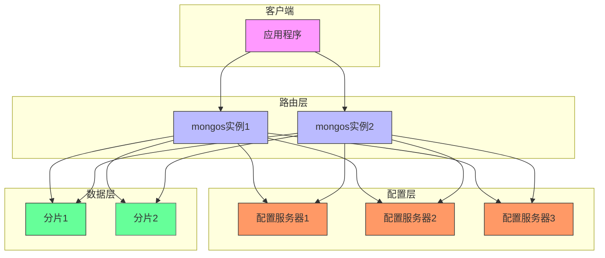
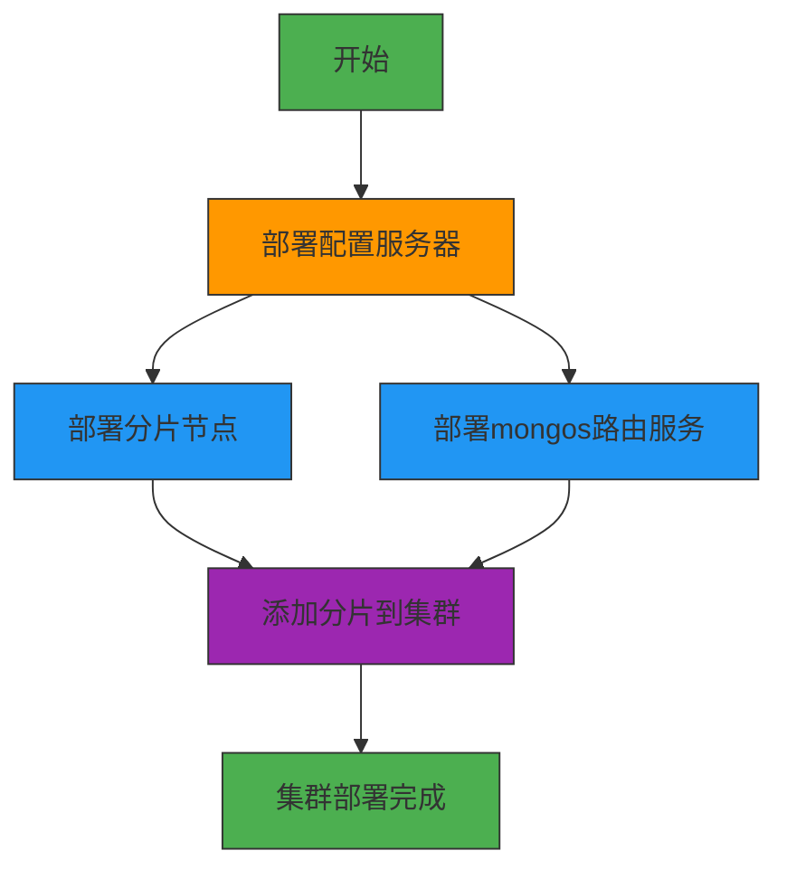
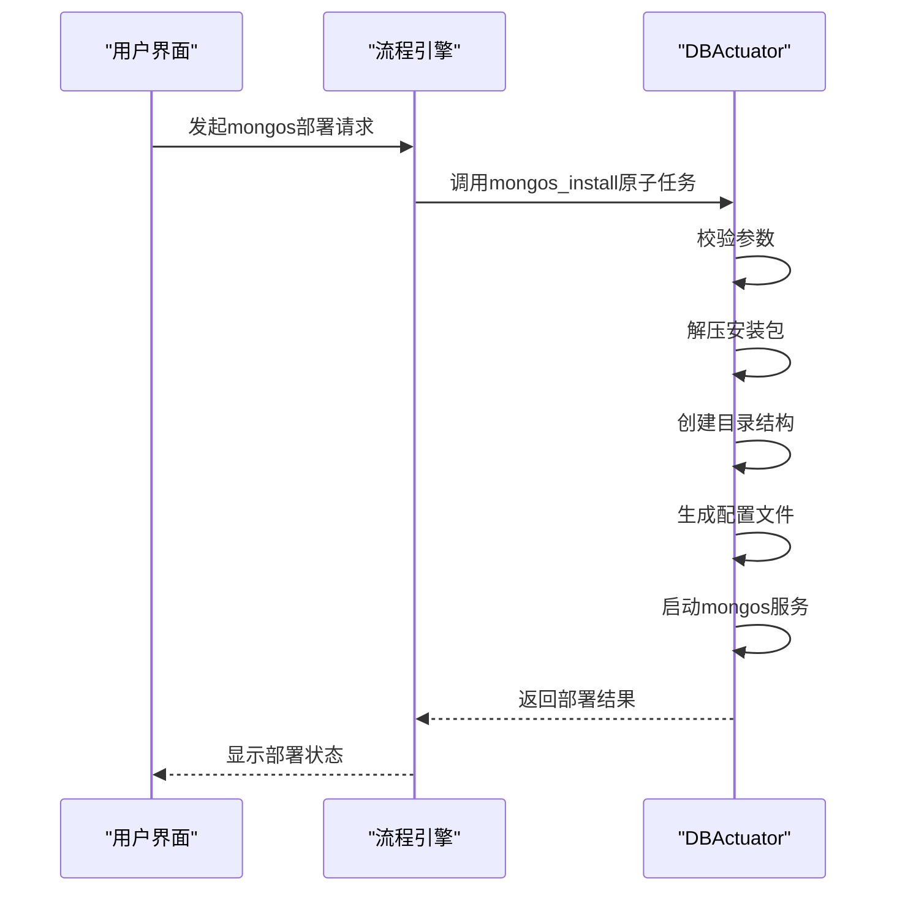
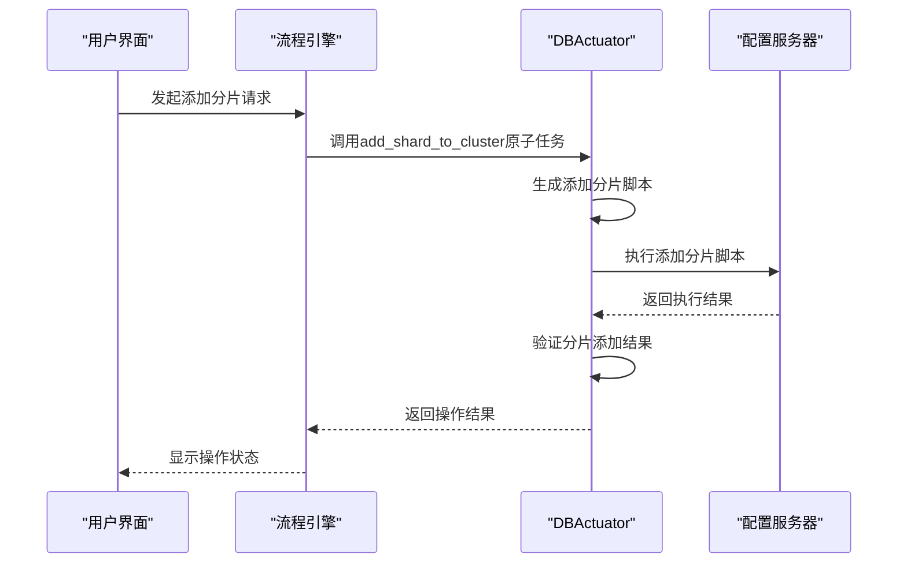

# MongoDB分片集群部署

<cite>
**本文档引用的文件**  
- [add_shard_to_cluster.go](file://dbm-services/mongodb/db-tools/dbactuator/pkg/atomjobs/atommongodb/add_shard_to_cluster.go)
- [mongos_install.go](file://dbm-services/mongodb/db-tools/dbactuator/pkg/atomjobs/atommongodb/mongos_install.go)
- [mongod_install.go](file://dbm-services/mongodb/db-tools/dbactuator/pkg/atomjobs/atommongodb/mongod_install.go)
- [topology.go](file://dbm-services/mongodb/db-tools/dbactuator/pkg/common/topology.go)
- [mongodb_dataclass.py](file://dbm-ui/backend/flow/utils/mongodb/mongodb_dataclass.py)
- [cluster_add_shard.py](file://dbm-ui/backend/flow/engine/bamboo/scene/mongodb/sub_task/cluster_add_shard.py)
- [add_shard_to_cluster.example.md](file://dbm-services/mongodb/db-tools/dbactuator/example/add_shard_to_cluster.example.md)
</cite>

## 目录
1. [引言](#引言)
2. [核心组件分析](#核心组件分析)
3. [分片集群架构概述](#分片集群架构概述)
4. [部署流程与依赖关系](#部署流程与依赖关系)
5. [配置服务器部署](#配置服务器部署)
6. [路由服务器（mongos）部署](#路由服务器（mongos）部署)
7. [分片节点部署](#分片节点部署)
8. [添加分片到集群](#添加分片到集群)
9. [生产级集群部署示例](#生产级集群部署示例)
10. [集群扩展与维护](#集群扩展与维护)
11. [最佳实践](#最佳实践)

## 引言
本文档详细说明如何通过BlueKing DBM系统部署MongoDB分片集群。文档重点介绍`dbm-services/mongodb/db-tools/dbactuator`模块中的关键组件，包括`add_shard_to_cluster.go`、`mongos_install.go`和`mongod_install.go`等命令的协调使用，以实现多分片集群的自动化部署。我们将详细描述配置服务器、路由服务器（mongos）和分片节点的部署顺序与依赖关系，并提供从零开始构建生产级集群的完整示例。

## 核心组件分析

本文档涉及的核心组件包括：

1. **add_shard_to_cluster.go**：负责将已部署的分片添加到MongoDB分片集群中。
2. **mongos_install.go**：负责安装和配置mongos路由服务。
3. **mongod_install.go**：负责安装和配置mongod实例，可用于配置服务器或分片节点。
4. **topology.go**：定义了MongoDB集群的数据结构和拓扑关系。

这些组件共同构成了MongoDB分片集群自动化部署的基础。

**本文档引用的文件**  
- [add_shard_to_cluster.go](file://dbm-services/mongodb/db-tools/dbactuator/pkg/atomjobs/atommongodb/add_shard_to_cluster.go)
- [mongos_install.go](file://dbm-services/mongodb/db-tools/dbactuator/pkg/atomjobs/atommongodb/mongos_install.go)
- [mongod_install.go](file://dbm-services/mongodb/db-tools/dbactuator/pkg/atomjobs/atommongodb/mongod_install.go)
- [topology.go](file://dbm-services/mongodb/db-tools/dbactuator/pkg/common/topology.go)

## 分片集群架构概述

MongoDB分片集群由三个主要组件构成：

1. **配置服务器（Config Server）**：存储集群的元数据和配置信息，包括数据分片的路由信息。
2. **路由服务器（mongos）**：作为客户端应用程序的访问入口，负责将查询请求路由到正确的分片。
3. **分片节点（Shard）**：实际存储数据的MongoDB副本集。

**架构来源**  
- [topology.go](file://dbm-services/mongodb/db-tools/dbactuator/pkg/common/topology.go#L55-L69)
- [mongodb_dataclass.py](file://dbm-ui/backend/flow/utils/mongodb/mongodb_dataclass.py#L329-L335)

## 部署流程与依赖关系

MongoDB分片集群的部署必须遵循严格的顺序，因为各个组件之间存在明确的依赖关系：

1. **配置服务器部署**：必须首先部署配置服务器，因为它们存储集群的元数据。
2. **分片节点部署**：在配置服务器运行后，可以部署各个分片节点。
3. **路由服务器部署**：在配置服务器运行后，可以部署mongos路由服务。
4. **添加分片到集群**：最后，将已部署的分片添加到集群中。

**流程来源**  
- [cluster_add_shard.py](file://dbm-ui/backend/flow/engine/bamboo/scene/mongodb/sub_task/cluster_add_shard.py#L86-L97)
- [add_shard_to_cluster.example.md](file://dbm-services/mongodb/db-tools/dbactuator/example/add_shard_to_cluster.example.md#L9-L24)

## 配置服务器部署

配置服务器是MongoDB分片集群的核心组件，负责存储集群的元数据。在BlueKing DBM系统中，配置服务器通过`mongod_install.go`组件进行部署，但需要设置特定的配置参数。

### 配置要点

- **clusterRole**: 必须设置为"configsvr"
- **端口**: 通常使用27019端口
- **复制集**: 配置服务器必须部署为三节点复制集以确保高可用性
- **存储引擎**: 推荐使用WiredTiger存储引擎

配置服务器的部署是整个集群部署的第一步，因为其他组件都需要访问配置服务器来获取集群元数据。

**组件来源**  
- [mongod_install.go](file://dbm-services/mongodb/db-tools/dbactuator/pkg/atomjobs/atommongodb/mongod_install.go#L55-L62)
- [topology.go](file://dbm-services/mongodb/db-tools/dbactuator/pkg/common/topology.go#L60)

## 路由服务器（mongos）部署

mongos是MongoDB分片集群的查询路由器，负责将客户端请求路由到正确的分片。在BlueKing DBM系统中，mongos通过`mongos_install.go`组件进行部署。

### 部署参数

`MongoSConfParams`结构体定义了mongos部署所需的所有参数：

- **IP和Port**: mongos实例的网络地址
- **DbVersion**: MongoDB版本
- **InstanceType**: 实例类型，固定为"mongos"
- **SetId**: 集群ID
- **KeyFile**: 认证密钥文件
- **Auth**: 是否启用认证
- **ConfigDB**: 配置服务器的连接字符串
- **DbConfig**: 数据库配置，包括慢查询阈值等

### 部署流程

1. **参数校验**: 检查输入参数的合法性
2. **安装包解压**: 解压MongoDB安装包并创建软链接
3. **目录创建**: 创建必要的数据和日志目录
4. **配置文件生成**: 根据MongoDB版本生成相应的配置文件
5. **服务启动**: 启动mongos服务

**组件来源**  
- [mongos_install.go](file://dbm-services/mongodb/db-tools/dbactuator/pkg/atomjobs/atommongodb/mongos_install.go#L20-L35)
- [mongos_install.go](file://dbm-services/mongodb/db-tools/dbactuator/pkg/atomjobs/atommongodb/mongos_install.go#L69-L101)

## 分片节点部署

分片节点是实际存储数据的MongoDB副本集。在BlueKing DBM系统中，分片节点通过`mongod_install.go`组件进行部署。

### 部署参数

`MongoDBConfParams`结构体定义了分片节点部署所需的所有参数：

- **IP和Port**: 分片节点的网络地址
- **DbVersion**: MongoDB版本
- **InstanceType**: 实例类型，固定为"mongod"
- **SetId**: 副本集名称
- **KeyFile**: 认证密钥文件
- **Auth**: 是否启用认证
- **ClusterRole**: 集群角色，分片节点设置为"shardsvr"
- **DbConfig**: 数据库配置，包括缓存大小、oplog大小等

### 部署流程

1. **参数校验**: 检查输入参数的合法性
2. **安装包解压**: 解压MongoDB安装包并创建软链接
3. **目录创建**: 创建必要的数据、日志和备份目录
4. **配置文件生成**: 根据MongoDB版本生成相应的配置文件
5. **服务启动**: 启动mongod服务

分片节点的部署可以在配置服务器部署完成后并行进行，以提高部署效率。

**组件来源**  
- [mongod_install.go](file://dbm-services/mongodb/db-tools/dbactuator/pkg/atomjobs/atommongodb/mongod_install.go#L46-L62)
- [mongod_install.go](file://dbm-services/mongodb/db-tools/dbactuator/pkg/atomjobs/atommongodb/mongod_install.go#L99-L130)

## 添加分片到集群

当分片节点部署完成后，需要将其添加到MongoDB分片集群中。这一过程由`add_shard_to_cluster.go`组件完成。

### 添加流程

1. **参数获取**: 从输入参数中获取配置服务器地址、管理员凭据和分片信息
2. **配置内容生成**: 生成用于添加分片的JavaScript脚本
3. **脚本执行**: 通过mongo shell执行添加分片的脚本
4. **结果验证**: 检查分片是否成功添加到集群中

### 输入参数

`AddConfParams`结构体定义了添加分片所需的所有参数：

- **IP**: 配置服务器或mongos的IP地址
- **Port**: 配置服务器或mongos的端口
- **AdminUsername**: 管理员用户名
- **AdminPassword**: 管理员密码
- **Shards**: 要添加的分片信息，键为分片ID，值为分片节点的连接字符串

**组件来源**  
- [add_shard_to_cluster.go](file://dbm-services/mongodb/db-tools/dbactuator/pkg/atomjobs/atommongodb/add_shard_to_cluster.go#L19-L26)
- [add_shard_to_cluster.go](file://dbm-services/mongodb/db-tools/dbactuator/pkg/atomjobs/atommongodb/add_shard_to_cluster.go#L51-L67)

## 生产级集群部署示例

以下是从零开始构建包含两个分片、三个配置服务器和多个mongos实例的生产级MongoDB分片集群的完整示例。

### 集群规划

| 组件 | 数量 | 主机 | 端口 | 复制集 |
|------|------|------|------|--------|
| 配置服务器 | 3 | cfg1, cfg2, cfg3 | 27019 | configReplSet |
| mongos路由 | 2 | mongos1, mongos2 | 27017 | N/A |
| 分片1 | 3 | shard1a, shard1b, shard1c | 27018 | shard1ReplSet |
| 分片2 | 3 | shard2a, shard2b, shard2c | 27018 | shard2ReplSet |

### 部署步骤

1. **部署配置服务器**
   - 在cfg1、cfg2、cfg3上部署mongod实例，设置clusterRole为"configsvr"
   - 初始化三节点复制集configReplSet

2. **部署分片节点**
   - 在shard1a、shard1b、shard1c上部署mongod实例，设置clusterRole为"shardsvr"
   - 初始化三节点复制集shard1ReplSet
   - 在shard2a、shard2b、shard2c上部署mongod实例，设置clusterRole为"shardsvr"
   - 初始化三节点复制集shard2ReplSet

3. **部署mongos路由**
   - 在mongos1、mongos2上部署mongos实例，配置连接字符串指向配置服务器
   - 启动mongos服务

4. **添加分片到集群**
   - 通过mongos1连接到集群
   - 执行`sh.addShard("shard1ReplSet/shard1a:27018,shard1b:27018,shard1c:27018")`
   - 执行`sh.addShard("shard2ReplSet/shard2a:27018,shard2b:27018,shard2c:27018")`

5. **配置分片键和数据均衡**
   - 为需要分片的集合启用分片
   - 选择合适的分片键
   - 配置数据均衡策略

**示例来源**  
- [add_shard_to_cluster.example.md](file://dbm-services/mongodb/db-tools/dbactuator/example/add_shard_to_cluster.example.md#L13-L22)
- [cluster_add_shard.py](file://dbm-ui/backend/flow/engine/bamboo/scene/mongodb/sub_task/cluster_add_shard.py#L86-L97)

## 集群扩展与维护

### 集群扩展（添加新分片）

当现有分片的存储容量或性能达到瓶颈时，可以通过添加新分片来扩展集群。

1. **部署新分片节点**
   - 部署新的mongod实例，设置clusterRole为"shardsvr"
   - 初始化新的复制集

2. **添加新分片到集群**
   - 使用`add_shard_to_cluster`组件将新分片添加到集群中
   - 系统会自动开始数据均衡过程

3. **监控数据均衡**
   - 监控数据迁移进度
   - 确保集群性能稳定

### 配置更新

- **mongos配置更新**: 可以通过重新部署mongos实例来更新配置
- **分片配置更新**: 可以通过重新部署分片节点来更新配置
- **集群参数调整**: 可以通过mongos连接到集群并执行相应命令来调整集群参数

### 跨版本迁移

跨版本迁移需要谨慎操作，建议遵循以下步骤：

1. **备份数据**: 在迁移前完整备份所有数据
2. **测试环境验证**: 在测试环境中验证新版本的兼容性
3. **逐个组件升级**: 逐个升级配置服务器、分片节点和mongos实例
4. **功能验证**: 验证所有功能正常工作
5. **监控性能**: 监控升级后的性能表现

**维护来源**  
- [cluster_add_shard.py](file://dbm-ui/backend/flow/engine/bamboo/scene/mongodb/sub_task/cluster_add_shard.py#L86-L97)
- [add_shard_to_cluster.go](file://dbm-services/mongodb/db-tools/dbactuator/pkg/atomjobs/atommongodb/add_shard_to_cluster.go#L51-L67)

## 最佳实践

### 分片键选择

选择合适的分片键对集群性能至关重要：

1. **高基数**: 分片键应该有足够多的不同值
2. **均匀分布**: 分片键的值应该能够均匀分布在各个分片上
3. **查询模式**: 分片键应该与主要查询模式相匹配
4. **避免热点**: 避免选择单调递增或递减的字段作为分片键

### 数据均衡策略

1. **自动均衡**: 启用自动均衡，让系统自动管理数据分布
2. **均衡窗口**: 设置合理的均衡窗口，避免在业务高峰期进行大量数据迁移
3. **监控均衡**: 定期监控数据分布情况，确保均衡状态良好

### 集群拓扑管理

1. **高可用性**: 配置服务器和分片节点都应该部署为复制集
2. **多mongos实例**: 部署多个mongos实例以提高可用性和负载均衡
3. **网络规划**: 确保各组件之间的网络延迟较低
4. **资源分配**: 为不同组件分配适当的计算和存储资源

5. **监控和告警**: 建立完善的监控和告警系统，及时发现和解决问题

通过遵循这些最佳实践，可以确保MongoDB分片集群的高性能、高可用性和可维护性。

**最佳实践来源**  
- [topology.go](file://dbm-services/mongodb/db-tools/dbactuator/pkg/common/topology.go#L55-L69)
- [mongodb_dataclass.py](file://dbm-ui/backend/flow/utils/mongodb/mongodb_dataclass.py#L329-L335)