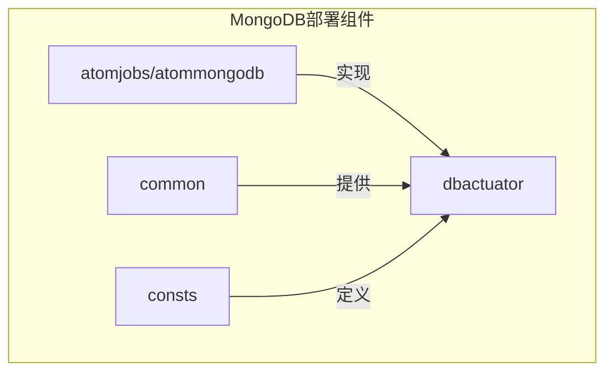
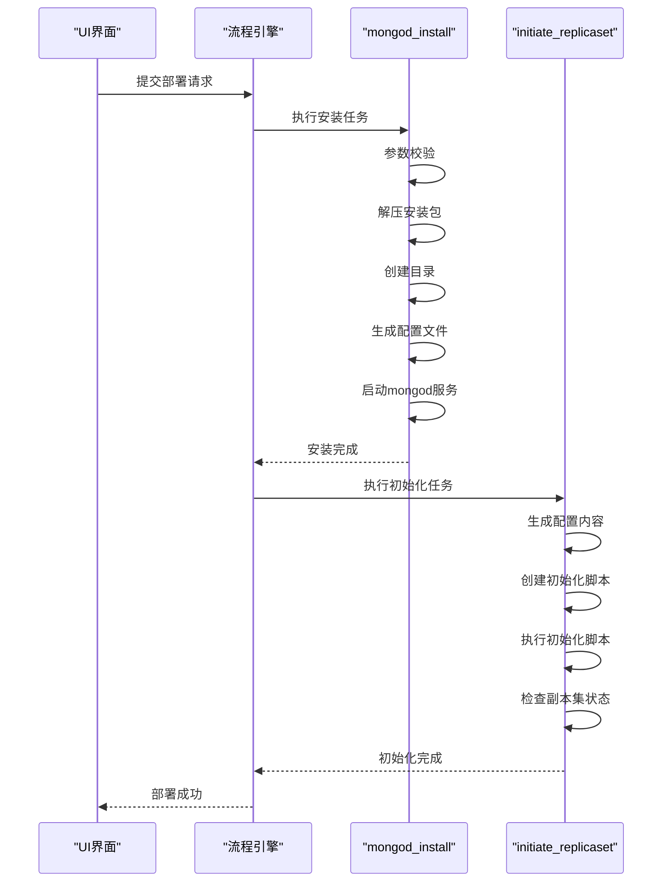
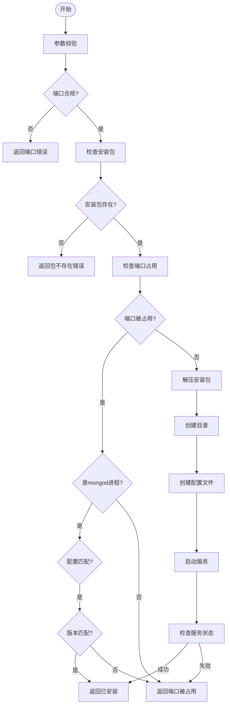
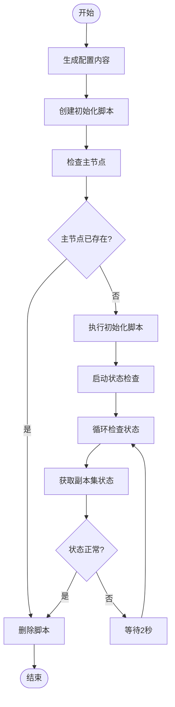
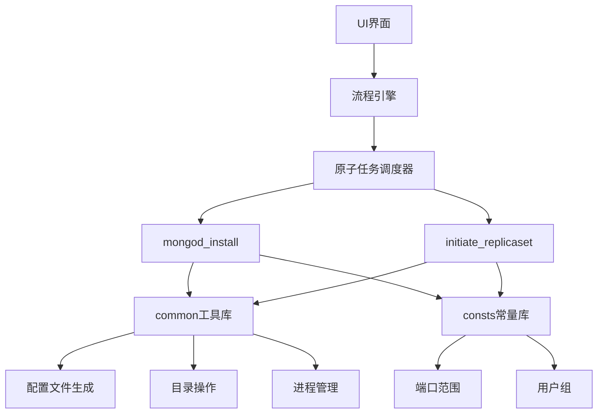

# MongoDB副本集部署

<cite>
**本文档引用的文件**
- [initiate_replicaset.go](file://dbm-services/mongodb/db-tools/dbactuator/pkg/atomjobs/atommongodb/initiate_replicaset.go)
- [mongod_install.go](file://dbm-services/mongodb/db-tools/dbactuator/pkg/atomjobs/atommongodb/mongod_install.go)
- [mongod_conf.go](file://dbm-services/mongodb/db-tools/dbactuator/pkg/common/mongod_conf.go)
- [initiate_replicaset_conf.go](file://dbm-services/mongodb/db-tools/dbactuator/pkg/common/initiate_replicaset_conf.go)
- [mongodb_install.py](file://dbm-ui/backend/flow/engine/bamboo/scene/mongodb/mongodb_install.py)
- [replicaset_install.py](file://dbm-ui/backend/flow/engine/bamboo/scene/mongodb/sub_task/replicaset_install.py)
</cite>

## 目录
1. [简介](#简介)
2. [项目结构](#项目结构)
3. [核心组件](#核心组件)
4. [架构概述](#架构概述)
5. [详细组件分析](#详细组件分析)
6. [依赖分析](#依赖分析)
7. [性能考虑](#性能考虑)
8. [故障排除指南](#故障排除指南)
9. [结论](#结论)

## 简介
本文档详细介绍了如何通过`db_services/mongodb/cluster/replica_set.py`模块调用底层`initiate_replicaset.go`和`mongod_install.go`命令实现三节点MongoDB副本集的自动化部署。文档涵盖了节点角色配置、复制集初始化流程、心跳检测机制和故障转移策略，并提供了完整的部署示例，包括主机配置、数据目录规划、网络端口设置和安全认证配置。

## 项目结构
MongoDB副本集部署功能主要分布在`dbm-services/mongodb/db-tools/dbactuator`目录下，该目录包含了实现MongoDB自动化部署的核心组件。主要结构包括原子任务执行器、通用组件库和常量定义。

**图示来源**
- [initiate_replicaset.go](file://dbm-services/mongodb/db-tools/dbactuator/pkg/atomjobs/atommongodb/initiate_replicaset.go)
- [mongod_install.go](file://dbm-services/mongodb/db-tools/dbactuator/pkg/atomjobs/atommongodb/mongod_install.go)

**本节来源**
- [initiate_replicaset.go](file://dbm-services/mongodb/db-tools/dbactuator/pkg/atomjobs/atommongodb/initiate_replicaset.go)
- [mongod_install.go](file://dbm-services/mongodb/db-tools/dbactuator/pkg/atomjobs/atommongodb/mongod_install.go)

## 核心组件
MongoDB副本集部署的核心组件包括`mongod_install.go`和`initiate_replicaset.go`两个Go语言文件，分别负责MongoDB实例的安装配置和副本集的初始化。这些组件通过参数校验、安装包解压、目录创建、配置文件生成、服务启动和副本集初始化等步骤实现自动化部署。

**本节来源**
- [initiate_replicaset.go](file://dbm-services/mongodb/db-tools/dbactuator/pkg/atomjobs/atommongodb/initiate_replicaset.go#L1-L283)
- [mongod_install.go](file://dbm-services/mongodb/db-tools/dbactuator/pkg/atomjobs/atommongodb/mongod_install.go#L1-L526)

## 架构概述
MongoDB副本集部署采用分层架构设计，上层UI通过流程引擎调用底层原子任务，实现从部署请求到副本集创建的完整流程。部署过程分为预检查、安装包解压、目录创建、配置文件生成、服务启动和副本集初始化等多个阶段。

**图示来源**
- [mongod_install.go](file://dbm-services/mongodb/db-tools/dbactuator/pkg/atomjobs/atommongodb/mongod_install.go#L99-L130)
- [initiate_replicaset.go](file://dbm-services/mongodb/db-tools/dbactuator/pkg/atomjobs/atommongodb/initiate_replicaset.go#L55-L79)

## 详细组件分析

### mongod_install组件分析
`mongod_install.go`组件负责MongoDB实例的安装和配置，包括参数校验、安装包解压、目录创建、配置文件生成和服务启动等关键步骤。

#### 部署流程分析

**图示来源**
- [mongod_install.go](file://dbm-services/mongodb/db-tools/dbactuator/pkg/atomjobs/atommongodb/mongod_install.go#L99-L130)

**本节来源**
- [mongod_install.go](file://dbm-services/mongodb/db-tools/dbactuator/pkg/atomjobs/atommongodb/mongod_install.go#L1-L526)

### initiate_replicaset组件分析
`initiate_replicaset.go`组件负责MongoDB副本集的初始化，通过生成JavaScript脚本并执行来完成副本集的创建和配置。

#### 初始化流程分析

**图示来源**
- [initiate_replicaset.go](file://dbm-services/mongodb/db-tools/dbactuator/pkg/atomjobs/atommongodb/initiate_replicaset.go#L55-L79)

**本节来源**
- [initiate_replicaset.go](file://dbm-services/mongodb/db-tools/dbactuator/pkg/atomjobs/atommongodb/initiate_replicaset.go#L1-L283)

## 依赖分析
MongoDB副本集部署功能依赖于多个组件和模块，包括原子任务执行框架、通用工具库、配置管理模块和流程引擎。这些组件协同工作，实现了从部署请求到副本集创建的完整自动化流程。

**图示来源**
- [mongod_install.go](file://dbm-services/mongodb/db-tools/dbactuator/pkg/atomjobs/atommongodb/mongod_install.go)
- [initiate_replicaset.go](file://dbm-services/mongodb/db-tools/dbactuator/pkg/atomjobs/atommongodb/initiate_replicaset.go)
- [mongod_conf.go](file://dbm-services/mongodb/db-tools/dbactuator/pkg/common/mongod_conf.go)

**本节来源**
- [mongod_install.go](file://dbm-services/mongodb/db-tools/dbactuator/pkg/atomjobs/atommongodb/mongod_install.go#L1-L526)
- [initiate_replicaset.go](file://dbm-services/mongodb/db-tools/dbactuator/pkg/atomjobs/atommongodb/initiate_replicaset.go#L1-L283)

## 性能考虑
在MongoDB副本集部署过程中，性能主要受以下几个因素影响：安装包解压时间、配置文件生成效率、服务启动速度和网络延迟。通过使用文件锁机制避免并发冲突，以及合理的超时设置，可以确保部署过程的稳定性和可靠性。

## 故障排除指南
在部署MongoDB副本集时可能遇到以下常见问题及解决方案：

1. **节点无法加入副本集**
   - 检查网络连通性，确保所有节点之间可以互相访问
   - 验证防火墙设置，确保MongoDB端口（默认27017）已开放
   - 检查主机名解析，确保所有节点的hostname可以正确解析

2. **选举失败**
   - 确保奇数个节点参与选举（建议3、5、7个节点）
   - 检查节点间的时钟同步，使用NTP服务保持时间一致
   - 验证配置文件中的priority设置，确保主节点有最高优先级

3. **安装包校验失败**
   - 确认安装包MD5值与配置一致
   - 检查磁盘空间是否充足
   - 验证安装用户权限是否足够

4. **端口冲突**
   - 检查指定端口是否已被其他进程占用
   - 确认MongoDB端口范围（27000-28999）内选择可用端口
   - 使用`netstat -ntpl | grep <port>`命令检查端口使用情况

**本节来源**
- [mongod_install.go](file://dbm-services/mongodb/db-tools/dbactuator/pkg/atomjobs/atommongodb/mongod_install.go#L318-L375)
- [initiate_replicaset.go](file://dbm-services/mongodb/db-tools/dbactuator/pkg/atomjobs/atommongodb/initiate_replicaset.go#L120-L131)

## 结论
通过`db_services/mongodb/cluster/replica_set.py`模块调用底层`initiate_replicaset.go`和`mongod_install.go`命令，可以实现MongoDB三节点副本集的自动化部署。该方案提供了完整的节点角色配置、复制集初始化、心跳检测和故障转移机制，确保了MongoDB集群的高可用性和数据安全性。部署过程中需要注意参数配置的准确性、网络环境的稳定性以及错误处理的完备性，以确保部署成功和系统稳定运行。