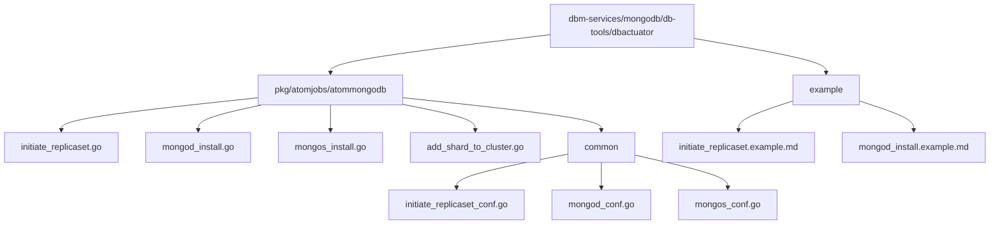
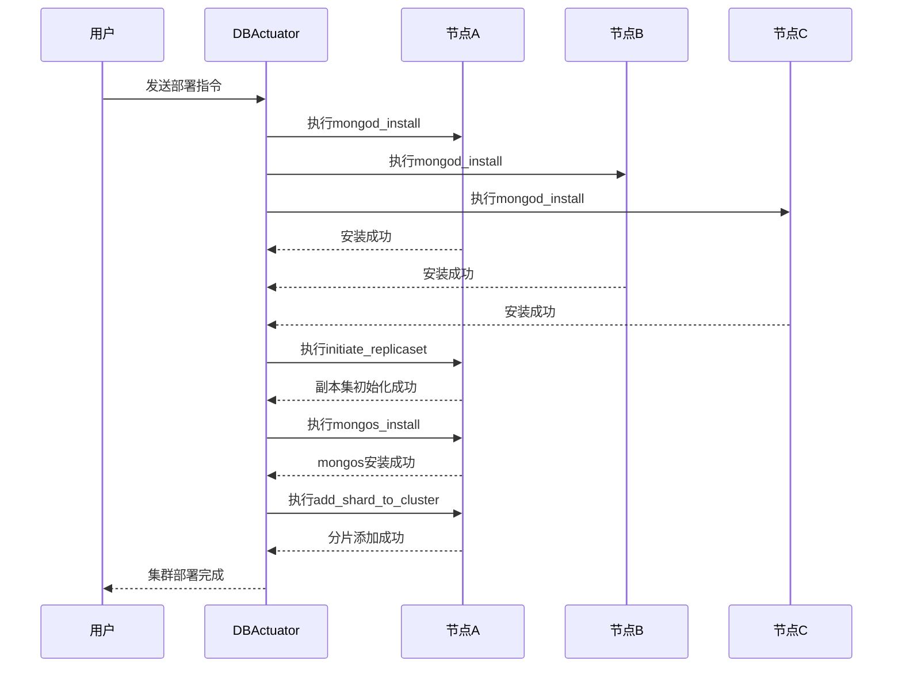
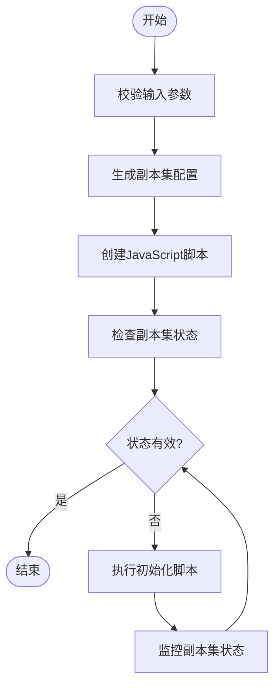
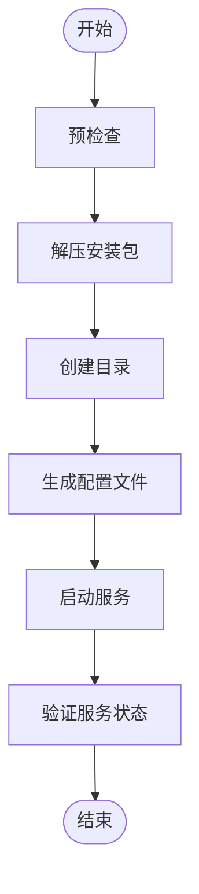
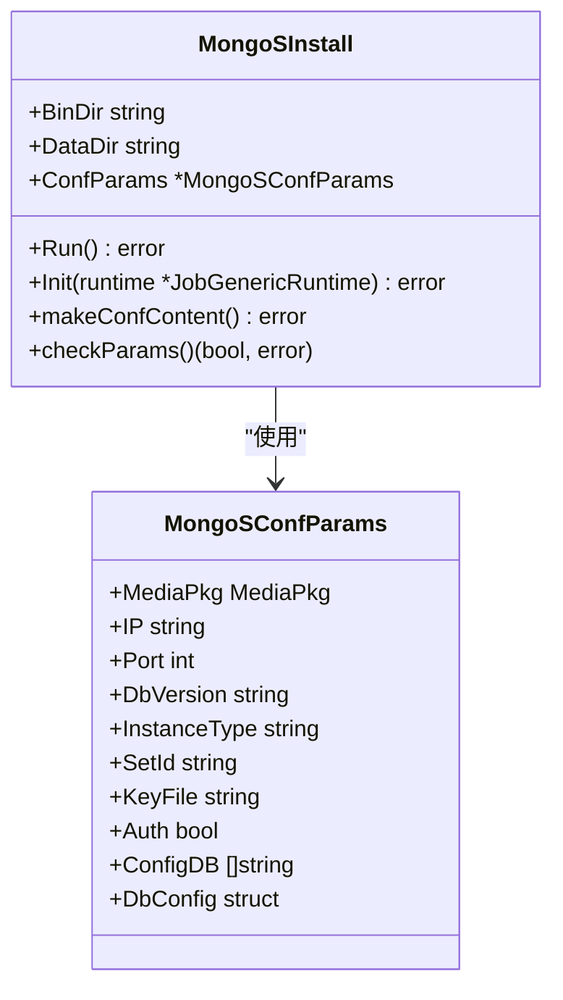
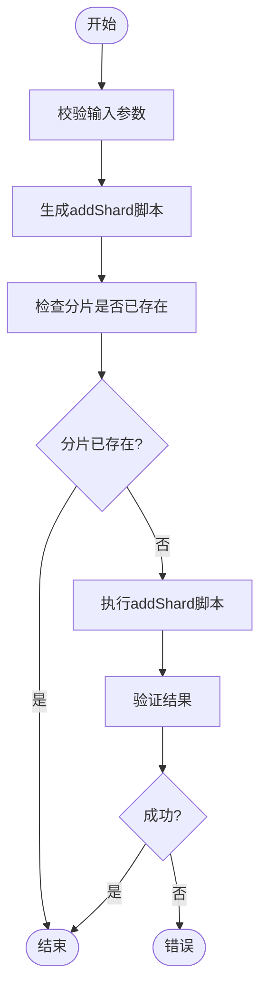
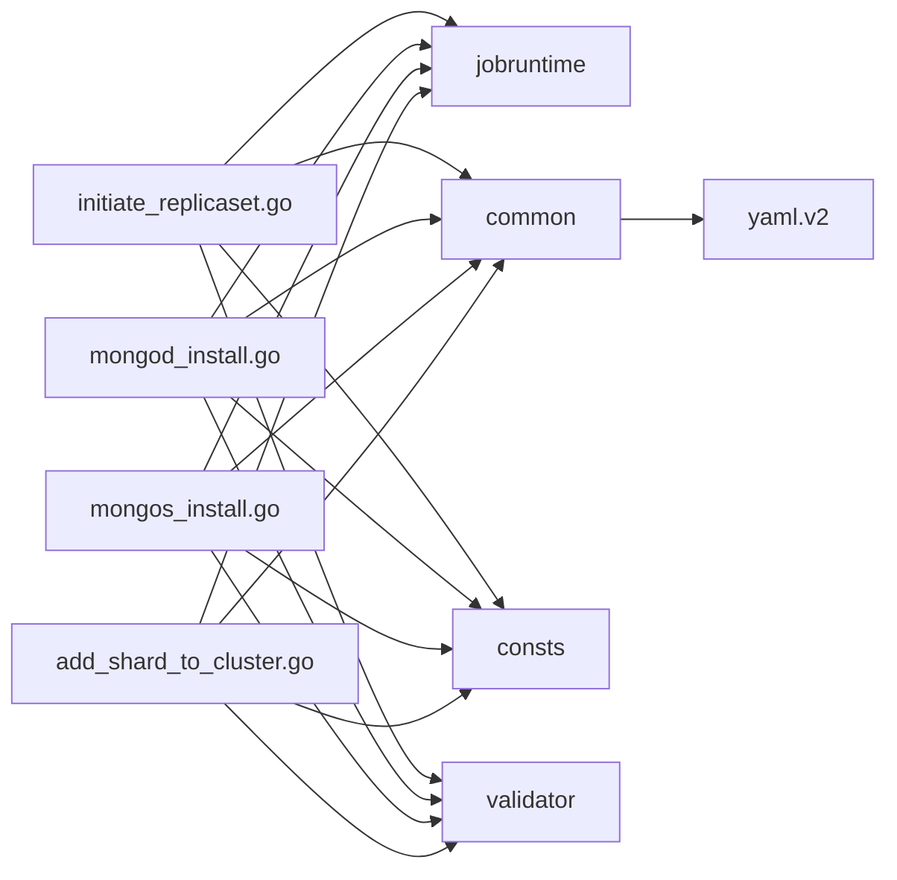

# MongoDB集群部署

<cite>
**本文档引用的文件**   
- [initiate_replicaset.go](file://dbm-services/mongodb/db-tools/dbactuator/pkg/atomjobs/atommongodb/initiate_replicaset.go)
- [mongod_install.go](file://dbm-services/mongodb/db-tools/dbactuator/pkg/atomjobs/atommongodb/mongod_install.go)
- [mongos_install.go](file://dbm-services/mongodb/db-tools/dbactuator/pkg/atomjobs/atommongodb/mongos_install.go)
- [add_shard_to_cluster.go](file://dbm-services/mongodb/db-tools/dbactuator/pkg/atomjobs/atommongodb/add_shard_to_cluster.go)
- [initiate_replicaset_conf.go](file://dbm-services/mongodb/db-tools/dbactuator/pkg/common/initiate_replicaset_conf.go)
- [mongod_conf.go](file://dbm-services/mongodb/db-tools/dbactuator/pkg/common/mongod_conf.go)
- [mongos_conf.go](file://dbm-services/mongodb/db-tools/dbactuator/pkg/common/mongos_conf.go)
- [mongo.go](file://dbm-services/mongodb/db-tools/dbactuator/pkg/consts/mongo.go)
- [initiate_replicaset.example.md](file://dbm-services/mongodb/db-tools/dbactuator/example/initiate_replicaset.example.md)
- [mongod_install.example.md](file://dbm-services/mongodb/db-tools/dbactuator/example/mongod_install.example.md)
</cite>

## 目录
1. [简介](#简介)
2. [项目结构](#项目结构)
3. [核心组件](#核心组件)
4. [架构概述](#架构概述)
5. [详细组件分析](#详细组件分析)
6. [依赖分析](#依赖分析)
7. [性能考虑](#性能考虑)
8. [故障排除指南](#故障排除指南)
9. [结论](#结论)

## 简介
本文档详细介绍了如何通过`db_services/mongodb/cluster`模块实现MongoDB副本集和分片集群的创建流程。文档将深入分析`initiate_replicaset.go`、`mongod_install.go`、`mongos_install.go`和`add_shard_to_cluster.go`等核心命令的实现逻辑，包括参数传递、配置生成和执行流程。同时提供从零开始部署一个三节点副本集及多分片集群的完整示例，涵盖网络配置、数据目录初始化、角色分配等关键步骤，并说明部署过程中的错误处理机制和回滚策略。

## 项目结构
MongoDB集群部署功能主要位于`dbm-services/mongodb/db-tools/dbactuator`目录下，其核心实现位于`pkg/atomjobs/atommongodb`包中。该模块采用原子任务（atomic job）的设计模式，每个部署操作都被封装为一个独立的可执行任务。

**图源**
- [initiate_replicaset.go](file://dbm-services/mongodb/db-tools/dbactuator/pkg/atomjobs/atommongodb/initiate_replicaset.go)
- [mongod_install.go](file://dbm-services/mongodb/db-tools/dbactuator/pkg/atomjobs/atommongodb/mongod_install.go)
- [mongos_install.go](file://dbm-services/mongodb/db-tools/dbactuator/pkg/atomjobs/atommongodb/mongos_install.go)
- [add_shard_to_cluster.go](file://dbm-services/mongodb/db-tools/dbactuator/pkg/atomjobs/atommongodb/add_shard_to_cluster.go)
- [initiate_replicaset_conf.go](file://dbm-services/mongodb/db-tools/dbactuator/pkg/common/initiate_replicaset_conf.go)
- [mongod_conf.go](file://dbm-services/mongodb/db-tools/dbactuator/pkg/common/mongod_conf.go)
- [mongos_conf.go](file://dbm-services/mongodb/db-tools/dbactuator/pkg/common/mongos_conf.go)

**章节源**
- [initiate_replicaset.go](file://dbm-services/mongodb/db-tools/dbactuator/pkg/atomjobs/atommongodb/initiate_replicaset.go#L1-L283)
- [mongod_install.go](file://dbm-services/mongodb/db-tools/dbactuator/pkg/atomjobs/atommongodb/mongod_install.go#L1-L526)
- [mongos_install.go](file://dbm-services/mongodb/db-tools/dbactuator/pkg/atomjobs/atommongodb/mongos_install.go#L1-L443)
- [add_shard_to_cluster.go](file://dbm-services/mongodb/db-tools/dbactuator/pkg/atomjobs/atommongodb/add_shard_to_cluster.go#L1-L245)

## 核心组件
本模块的核心组件是四个原子任务，它们共同完成了MongoDB集群的部署：
1. `mongod_install.go`：负责在单个节点上安装和配置mongod实例。
2. `initiate_replicaset.go`：负责初始化一个副本集，将多个mongod实例组合成一个高可用的复制集。
3. `mongos_install.go`：负责安装和配置mongos路由实例。
4. `add_shard_to_cluster.go`：负责将已配置的副本集作为分片添加到分片集群中。

这些组件通过`jobruntime.JobRunner`接口进行标准化，确保了任务执行的一致性和可管理性。

**章节源**
- [initiate_replicaset.go](file://dbm-services/mongodb/db-tools/dbactuator/pkg/atomjobs/atommongodb/initiate_replicaset.go#L1-L283)
- [mongod_install.go](file://dbm-services/mongodb/db-tools/dbactuator/pkg/atomjobs/atommongodb/mongod_install.go#L1-L526)
- [mongos_install.go](file://dbm-services/mongodb/db-tools/dbactuator/pkg/atomjobs/atommongodb/mongos_install.go#L1-L443)
- [add_shard_to_cluster.go](file://dbm-services/mongodb/db-tools/dbactuator/pkg/atomjobs/atommongodb/add_shard_to_cluster.go#L1-L245)

## 架构概述
MongoDB集群部署采用分步式、原子化的任务执行架构。整个部署流程被分解为一系列独立的、可重试的原子任务，每个任务负责一个特定的部署步骤。这种设计提高了部署的可靠性和可维护性。

**图源**
- [initiate_replicaset.go](file://dbm-services/mongodb/db-tools/dbactuator/pkg/atomjobs/atommongodb/initiate_replicaset.go)
- [mongod_install.go](file://dbm-services/mongodb/db-tools/dbactuator/pkg/atomjobs/atommongodb/mongod_install.go)
- [mongos_install.go](file://dbm-services/mongodb/db-tools/dbactuator/pkg/atomjobs/atommongodb/mongos_install.go)
- [add_shard_to_cluster.go](file://dbm-services/mongodb/db-tools/dbactuator/pkg/atomjobs/atommongodb/add_shard_to_cluster.go)

## 详细组件分析

### initiate_replicaset.go 分析
`initiate_replicaset.go`模块负责初始化MongoDB副本集。它通过生成JavaScript脚本并执行`rs.initiate()`命令来完成副本集的创建。

#### 实现逻辑
1. **参数校验**：通过`checkParams()`方法使用`validator`库对输入参数进行验证。
2. **配置生成**：`makeConfContent()`方法根据输入参数构建符合MongoDB规范的副本集配置JSON对象。
3. **脚本生成**：`createInitiateReplicasetScript()`方法将配置JSON和`rs.initiate()`命令写入临时JavaScript文件。
4. **执行与验证**：`execScript()`方法调用`mongo` shell执行脚本，并通过`checkStatus()`和`getStatus()`方法监控副本集状态，确保初始化成功。

**图源**
- [initiate_replicaset.go](file://dbm-services/mongodb/db-tools/dbactuator/pkg/atomjobs/atommongodb/initiate_replicaset.go#L1-L283)
- [initiate_replicaset_conf.go](file://dbm-services/mongodb/db-tools/dbactuator/pkg/common/initiate_replicaset_conf.go#L1-L38)

**章节源**
- [initiate_replicaset.go](file://dbm-services/mongodb/db-tools/dbactuator/pkg/atomjobs/atommongodb/initiate_replicaset.go#L1-L283)

### mongod_install.go 分析
`mongod_install.go`模块负责在单个节点上安装和配置mongod实例。

#### 实现逻辑
1. **预检查**：`checkParams()`方法检查端口合规性、安装包完整性、端口占用情况等。
2. **解压安装**：`unTarAndCreateSoftLink()`方法解压MongoDB安装包并创建软链接。
3. **目录创建**：`mkdir()`方法创建数据目录、日志目录等，并设置正确的属主和权限。
4. **配置生成**：`makeConfContent()`方法根据MongoDB版本生成YAML或INI格式的配置文件。
5. **服务启动**：`startup()`方法启动mongod进程并验证服务状态。

**图源**
- [mongod_install.go](file://dbm-services/mongodb/db-tools/dbactuator/pkg/atomjobs/atommongodb/mongod_install.go#L1-L526)
- [mongod_conf.go](file://dbm-services/mongodb/db-tools/dbactuator/pkg/common/mongod_conf.go#L1-L123)

**章节源**
- [mongod_install.go](file://dbm-services/mongodb/db-tools/dbactuator/pkg/atomjobs/atommongodb/mongod_install.go#L1-L526)

### mongos_install.go 分析
`mongos_install.go`模块负责安装和配置mongos路由实例，其逻辑与`mongod_install.go`类似，但配置文件结构不同。

#### 实现逻辑
1. **参数校验**：与`mongod_install.go`类似，但针对mongos的特定参数。
2. **解压与目录创建**：流程与`mongod_install.go`相同。
3. **配置生成**：`makeConfContent()`方法生成包含`sharding.configDB`字段的YAML配置文件。
4. **服务启动**：启动mongos进程。

**图源**
- [mongos_install.go](file://dbm-services/mongodb/db-tools/dbactuator/pkg/atomjobs/atommongodb/mongos_install.go#L1-L443)
- [mongos_conf.go](file://dbm-services/mongodb/db-tools/dbactuator/pkg/common/mongos_conf.go#L1-L63)

**章节源**
- [mongos_install.go](file://dbm-services/mongodb/db-tools/dbactuator/pkg/atomjobs/atommongodb/mongos_install.go#L1-L443)

### add_shard_to_cluster.go 分析
`add_shard_to_cluster.go`模块负责将一个副本集作为分片添加到分片集群中。

#### 实现逻辑
1. **参数校验**：验证管理员凭据和分片信息。
2. **脚本生成**：`makeConfContent()`方法生成包含`sh.addShard()`命令的JavaScript脚本。
3. **执行与验证**：`execScript()`方法执行脚本，并通过`getShardInfo()`命令验证分片是否成功添加。

**图源**
- [add_shard_to_cluster.go](file://dbm-services/mongodb/db-tools/dbactuator/pkg/atomjobs/atommongodb/add_shard_to_cluster.go#L1-L245)

**章节源**
- [add_shard_to_cluster.go](file://dbm-services/mongodb/db-tools/dbactuator/pkg/atomjobs/atommongodb/add_shard_to_cluster.go#L1-L245)

## 依赖分析
该模块依赖于多个内部和外部组件：
- **内部依赖**：`jobruntime`包提供任务运行时环境，`common`包提供通用工具和配置结构，`consts`包定义常量。
- **外部依赖**：`go-playground/validator/v10`用于参数校验，`gopkg.in/yaml.v2`用于YAML配置文件处理。

**图源**
- [initiate_replicaset.go](file://dbm-services/mongodb/db-tools/dbactuator/pkg/atomjobs/atommongodb/initiate_replicaset.go)
- [mongod_install.go](file://dbm-services/mongodb/db-tools/dbactuator/pkg/atomjobs/atommongodb/mongod_install.go)
- [mongos_install.go](file://dbm-services/mongodb/db-tools/dbactuator/pkg/atomjobs/atommongodb/mongos_install.go)
- [add_shard_to_cluster.go](file://dbm-services/mongodb/db-tools/dbactuator/pkg/atomjobs/atommongodb/add_shard_to_cluster.go)

**章节源**
- [initiate_replicaset.go](file://dbm-services/mongodb/db-tools/dbactuator/pkg/atomjobs/atommongodb/initiate_replicaset.go#L3-L17)
- [mongod_install.go](file://dbm-services/mongodb/db-tools/dbactuator/pkg/atomjobs/atommongodb/mongod_install.go#L3-L17)
- [mongos_install.go](file://dbm-services/mongodb/db-tools/dbactuator/pkg/atomjobs/atommongodb/mongos_install.go#L3-L17)
- [add_shard_to_cluster.go](file://dbm-services/mongodb/db-tools/dbactuator/pkg/atomjobs/atommongodb/add_shard_to_cluster.go#L3-L16)

## 性能考虑
在部署大规模MongoDB集群时，应考虑以下性能因素：
- **并行部署**：多个`mongod_install`任务可以并行执行，以加快部署速度。
- **资源预留**：确保每个节点有足够的CPU、内存和磁盘I/O资源。
- **网络配置**：优化网络延迟和带宽，特别是在跨数据中心部署时。
- **配置优化**：根据工作负载调整`cacheSizeGB`、`oplogSizeMB`等参数。

## 故障排除指南
### 常见错误及解决方案
1. **端口占用**：如果`checkParams()`检测到端口被占用，需确认是否为MongoDB进程，并检查版本和配置是否匹配。
2. **安装包校验失败**：确保提供的`pkg_md5`与实际安装包的MD5值一致。
3. **副本集初始化失败**：检查网络连通性，确保所有成员节点都能互相访问。
4. **权限问题**：确保部署用户对数据目录、日志目录有正确的读写权限。

**章节源**
- [mongod_install.go](file://dbm-services/mongodb/db-tools/dbactuator/pkg/atomjobs/atommongodb/mongod_install.go#L318-L375)
- [initiate_replicaset.go](file://dbm-services/mongodb/db-tools/dbactuator/pkg/atomjobs/atommongodb/initiate_replicaset.go#L120-L131)

## 结论
通过`db_services/mongodb/cluster`模块，可以实现MongoDB副本集和分片集群的自动化部署。该模块采用原子化、分步式的设计，确保了部署过程的可靠性和可维护性。通过深入理解`initiate_replicaset.go`、`mongod_install.go`、`mongos_install.go`和`add_shard_to_cluster.go`等核心组件的实现逻辑，可以有效地进行集群部署、故障排除和性能优化。