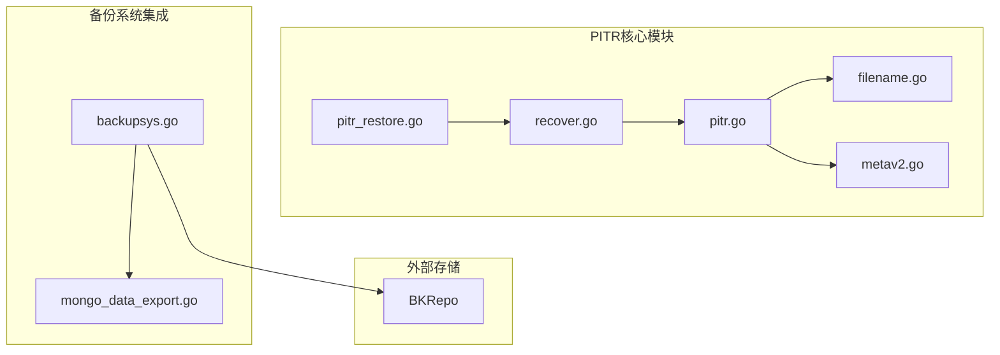
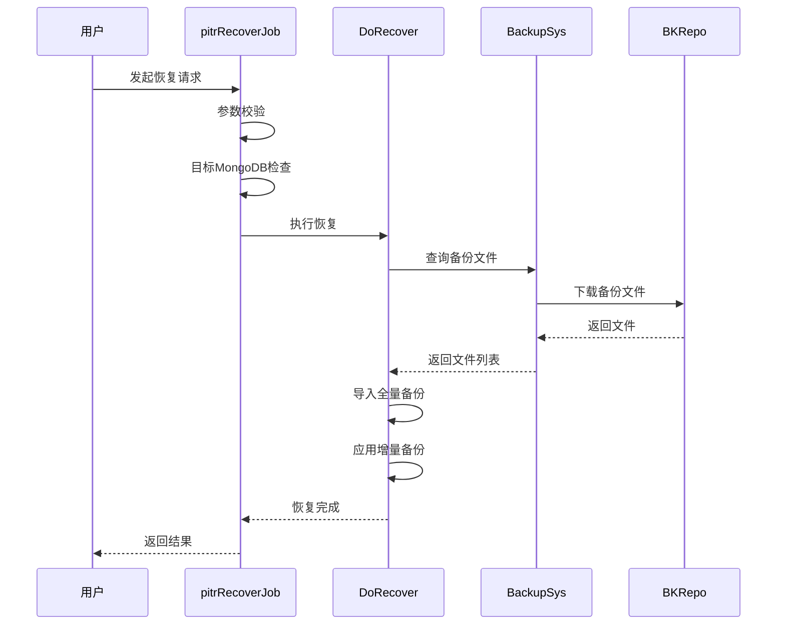
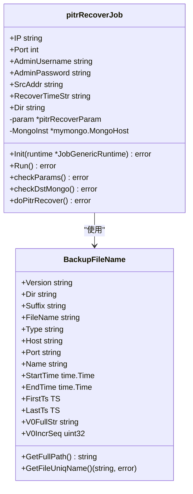
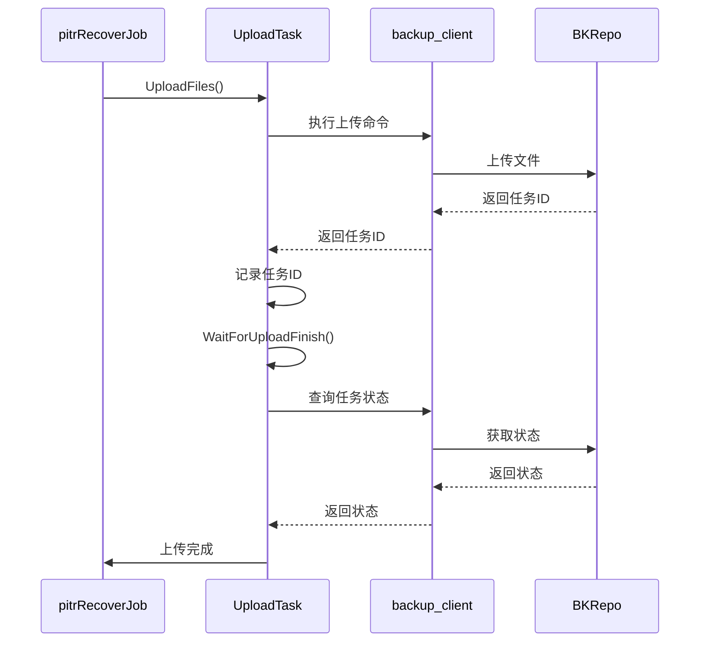
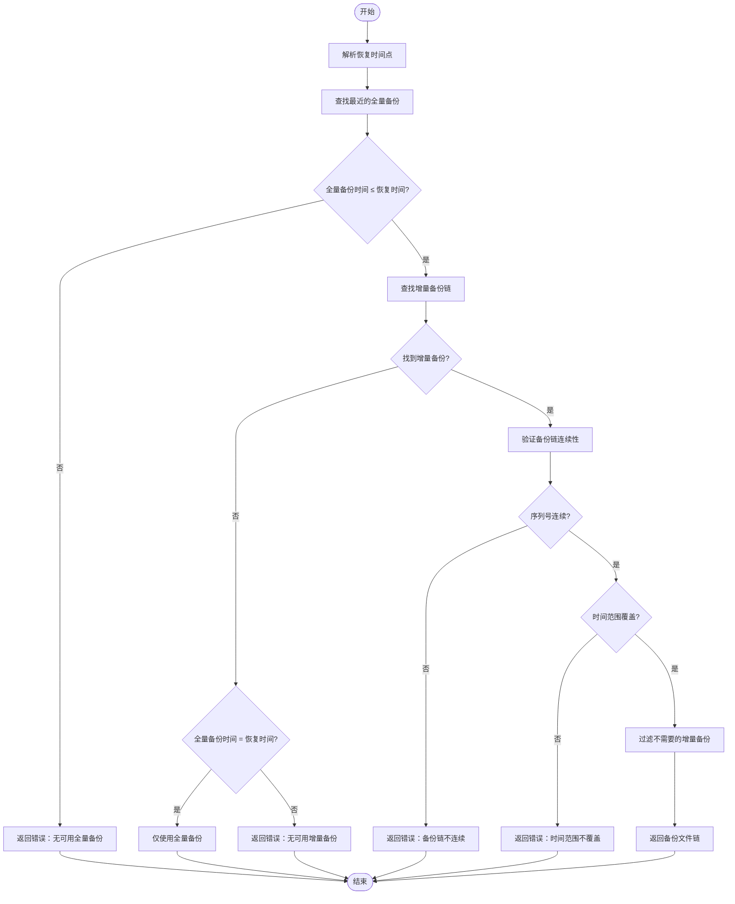
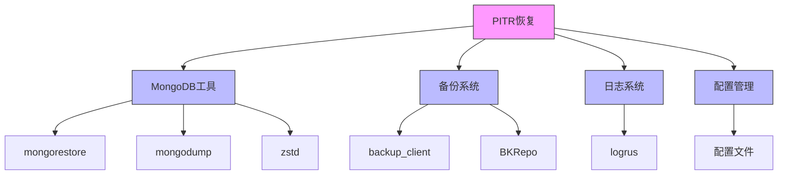

# 基于时间点的恢复（PITR）

<cite>
**本文档引用文件**   
- [pitr_restore.go](file://dbm-services/mongodb/db-tools/dbactuator/pkg/atomjobs/atommongodb/pitr_restore.go)
- [backupsys.go](file://dbm-services/mongodb/db-tools/dbactuator/pkg/backupsys/backupsys.go)
- [pitr.go](file://dbm-services/mongodb/db-tools/mongo-toolkit-go/toolkit/pitr/pitr.go)
- [recover.go](file://dbm-services/mongodb/db-tools/mongo-toolkit-go/toolkit/pitr/recover.go)
- [filename.go](file://dbm-services/mongodb/db-tools/mongo-toolkit-go/toolkit/pitr/filename.go)
- [metav2.go](file://dbm-services/mongodb/db-tools/mongo-toolkit-go/toolkit/pitr/metav2.go)
- [mongo_data_export.go](file://dbm-services/mongodb/db-tools/dbactuator/pkg/atomjobs/atommongodb/mongo_data_export.go)
</cite>

## 目录
1. [引言](#引言)
2. [项目结构](#项目结构)
3. [核心组件](#核心组件)
4. [架构概述](#架构概述)
5. [详细组件分析](#详细组件分析)
6. [依赖分析](#依赖分析)
7. [性能考虑](#性能考虑)
8. [故障排除指南](#故障排除指南)
9. [结论](#结论)

## 引言
本文档详细阐述了MongoDB基于时间点恢复（PITR）的实现原理。重点分析了`pitr_restore.go`中PITR的实现机制，包括oplog的捕获与应用、增量备份链的构建、时间点定位算法以及数据一致性保证机制。同时解释了`backupsys.go`如何支持PITR所需的备份文件管理和元数据追踪，特别是与BKRepo等外部存储系统的集成方式。提供了PITR配置指南，包括oplog大小规划、备份频率设置和存储空间预估，并通过具体案例说明如何执行精确到秒级的数据恢复操作，讨论PITR在灾难恢复场景下的优势与限制。

## 项目结构
该PITR系统主要由以下几个核心模块构成：

**图源**
- [pitr_restore.go](file://dbm-services/mongodb/db-tools/dbactuator/pkg/atomjobs/atommongodb/pitr_restore.go)
- [backupsys.go](file://dbm-services/mongodb/db-tools/dbactuator/pkg/backupsys/backupsys.go)
- [recover.go](file://dbm-services/mongodb/db-tools/mongo-toolkit-go/toolkit/pitr/recover.go)

**节源**
- [pitr_restore.go](file://dbm-services/mongodb/db-tools/dbactuator/pkg/atomjobs/atommongodb/pitr_restore.go#L1-L321)
- [backupsys.go](file://dbm-services/mongodb/db-tools/dbactuator/pkg/backupsys/backupsys.go#L1-L212)

## 核心组件
PITR系统的核心组件包括恢复引擎、备份系统接口和元数据管理器。恢复引擎负责执行实际的恢复操作，备份系统接口负责与外部存储系统交互，元数据管理器负责维护备份文件的元信息。

**节源**
- [pitr.go](file://dbm-services/mongodb/db-tools/mongo-toolkit-go/toolkit/pitr/pitr.go#L1-L3)
- [recover.go](file://dbm-services/mongodb/db-tools/mongo-toolkit-go/toolkit/pitr/recover.go#L1-L709)

## 架构概述
PITR系统的整体架构如下图所示：

**图源**
- [pitr_restore.go](file://dbm-services/mongodb/db-tools/dbactuator/pkg/atomjobs/atommongodb/pitr_restore.go#L66-L85)
- [recover.go](file://dbm-services/mongodb/db-tools/mongo-toolkit-go/toolkit/pitr/recover.go#L476-L512)

## 详细组件分析

### PITR恢复流程分析
PITR恢复流程主要包括以下几个步骤：

1. **参数初始化**：解析恢复参数，包括目标实例信息、恢复时间点等
2. **环境检查**：检查目标MongoDB实例状态，确保可以进行恢复
3. **文件定位**：根据恢复时间点定位需要的全量和增量备份文件
4. **数据恢复**：依次导入全量备份和增量备份

#### 恢复流程类图

**图源**
- [pitr_restore.go](file://dbm-services/mongodb/db-tools/dbactuator/pkg/atomjobs/atommongodb/pitr_restore.go#L28-L39)
- [filename.go](file://dbm-services/mongodb/db-tools/mongo-toolkit-go/toolkit/pitr/filename.go#L17-L33)

### 备份系统集成分析
备份系统负责管理备份文件的存储和检索，与BKRepo等外部存储系统集成。

#### 备份系统序列图

**图源**
- [backupsys.go](file://dbm-services/mongodb/db-tools/dbactuator/pkg/backupsys/backupsys.go#L25-L59)
- [mongo_data_export.go](file://dbm-services/mongodb/db-tools/dbactuator/pkg/atomjobs/atommongodb/mongo_data_export.go#L282-L304)

### 时间点定位算法分析
时间点定位算法负责根据用户指定的恢复时间点，精确找到需要的备份文件链。

#### 时间点定位流程图

**图源**
- [recover.go](file://dbm-services/mongodb/db-tools/mongo-toolkit-go/toolkit/pitr/recover.go#L516-L543)
- [filename.go](file://dbm-services/mongodb/db-tools/mongo-toolkit-go/toolkit/pitr/filename.go#L320-L347)

**节源**
- [recover.go](file://dbm-services/mongodb/db-tools/mongo-toolkit-go/toolkit/pitr/recover.go#L516-L709)
- [filename.go](file://dbm-services/mongodb/db-tools/mongo-toolkit-go/toolkit/pitr/filename.go#L1-L348)

## 依赖分析
PITR系统依赖于多个外部组件和内部模块：

**图源**
- [pitr.go](file://dbm-services/mongodb/db-tools/mongo-toolkit-go/toolkit/pitr/pitr.go)
- [backupsys.go](file://dbm-services/mongodb/db-tools/dbactuator/pkg/backupsys/backupsys.go)

**节源**
- [pitr.go](file://dbm-services/mongodb/db-tools/mongo-toolkit-go/toolkit/pitr/pitr.go#L1-L3)
- [backupsys.go](file://dbm-services/mongodb/db-tools/dbactuator/pkg/backupsys/backupsys.go#L1-L212)

## 性能考虑
在实施PITR时需要考虑以下性能因素：

1. **oplog大小规划**：oplog大小应足够大以容纳恢复窗口内的所有操作
2. **备份频率**：全量备份频率影响恢复时间和存储成本
3. **存储空间**：需要预估全量和增量备份的存储需求
4. **网络带宽**：备份文件传输需要足够的网络带宽
5. **恢复时间**：恢复操作的耗时需要在可接受范围内

## 故障排除指南
常见问题及解决方案：

1. **无可用备份文件**：检查备份任务是否正常执行，确认备份文件已成功上传到存储系统
2. **备份链不连续**：检查增量备份任务是否正常执行，确认没有备份任务失败
3. **恢复时间点超出范围**：确认恢复时间点在备份覆盖范围内
4. **权限问题**：检查目标MongoDB实例的访问权限
5. **存储空间不足**：检查目标存储空间是否足够

**节源**
- [pitr_restore.go](file://dbm-services/mongodb/db-tools/dbactuator/pkg/atomjobs/atommongodb/pitr_restore.go#L149-L175)
- [backupsys.go](file://dbm-services/mongodb/db-tools/dbactuator/pkg/backupsys/backupsys.go#L27-L41)

## 结论
MongoDB基于时间点恢复（PITR）系统提供了一种精确的数据恢复机制，能够将数据库恢复到指定的时间点。系统通过oplog的捕获与应用、增量备份链的构建、时间点定位算法以及数据一致性保证机制，实现了高效可靠的恢复功能。与BKRepo等外部存储系统的集成确保了备份数据的安全性和可访问性。通过合理的配置和管理，PITR能够在灾难恢复场景中发挥重要作用，最大限度地减少数据丢失。