# 常规备份与恢复

<cite>
**本文档引用文件**   
- [backup.go](file://dbm-services/mongodb/db-tools/dbactuator/pkg/atomjobs/atommongodb/backup.go)
- [restore.go](file://dbm-services/mongodb/db-tools/dbactuator/pkg/atomjobs/atommongodb/restore.go)
- [backup_client.go](file://dbm-services/mongodb/db-tools/mongo-toolkit-go/pkg/backupsys/backup_client.go)
- [backup.go](file://dbm-services/mongodb/db-tools/mongo-toolkit-go/toolkit/pitr/backup.go)
- [restore.go](file://dbm-services/mongodb/db-tools/mongo-toolkit-go/toolkit/logical/restore.go)
- [views.py](file://dbm-ui/backend/db_services/mongodb/restore/views.py)
</cite>

## 目录
1. [引言](#引言)
2. [备份实现机制](#备份实现机制)
3. [恢复实现机制](#恢复实现机制)
4. [前端界面集成](#前端界面集成)
5. [备份策略配置](#备份策略配置)
6. [性能调优建议](#性能调优建议)
7. [常见故障排查](#常见故障排查)
8. [结论](#结论)

## 引言

本文档详细阐述了MongoDB常规备份与恢复的实现逻辑，涵盖全量和增量备份的触发机制、数据导出流程、压缩加密处理以及校验和生成。同时，深入解析了恢复流程，包括备份文件解析、数据导入、权限重建和一致性验证。结合`dbm-ui`中的恢复服务接口，展示了用户如何通过前端界面发起备份恢复任务。此外，提供了备份策略配置示例、性能调优建议以及常见故障排查方法。

## 备份实现机制

### 备份触发机制

MongoDB的备份任务通过`backup.go`文件中的`NewBackupJob`函数实例化，并由`Run`方法执行。备份任务的参数由前端传入，包括IP地址、端口、管理员用户名和密码等。备份类型分为全量备份和增量备份，通过`BackupType`字段指定。

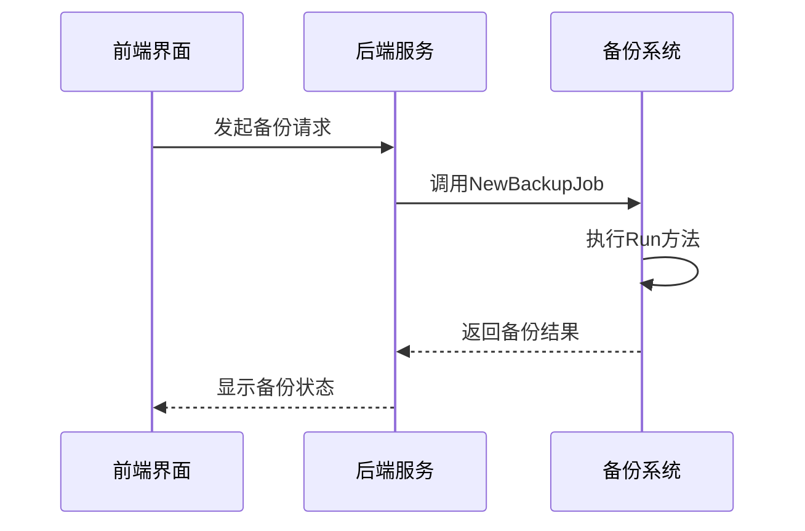

**Diagram sources**
- [backup.go](file://dbm-services/mongodb/db-tools/dbactuator/pkg/atomjobs/atommongodb/backup.go#L70-L102)

### 数据导出流程

数据导出流程主要通过`mongodump`工具实现。在`backup.go`文件中，`doLogicalBackup`方法负责执行逻辑备份。该方法首先检查目标MongoDB实例，然后根据备份类型执行全量或增量备份。

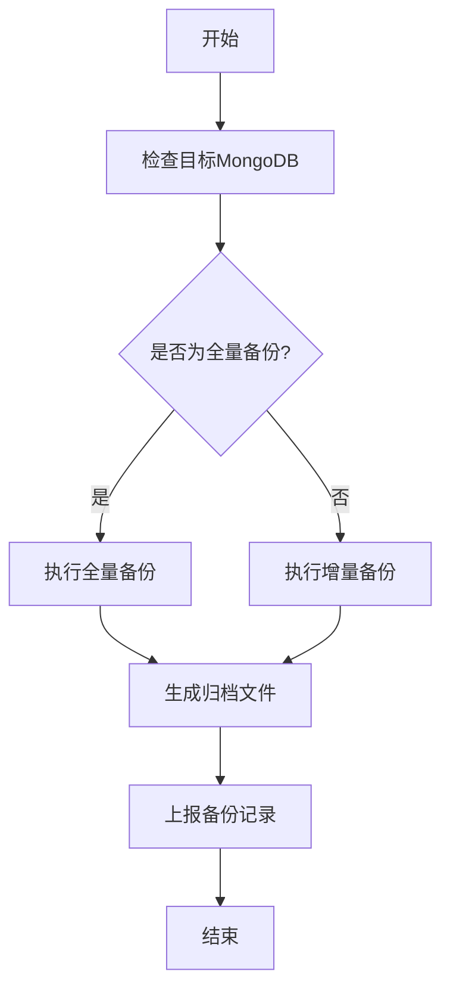

**Diagram sources**
- [backup.go](file://dbm-services/mongodb/db-tools/dbactuator/pkg/atomjobs/atommongodb/backup.go#L276-L397)

### 压缩加密处理

备份文件的压缩处理在`makeArchiveFileZstd`和`makeArchiveFileGzip`方法中实现。系统根据操作系统类型选择使用`zstd`或`gzip`进行压缩。如果系统是`tlinux1.2`，则使用`gzip`，否则使用`zstd`。

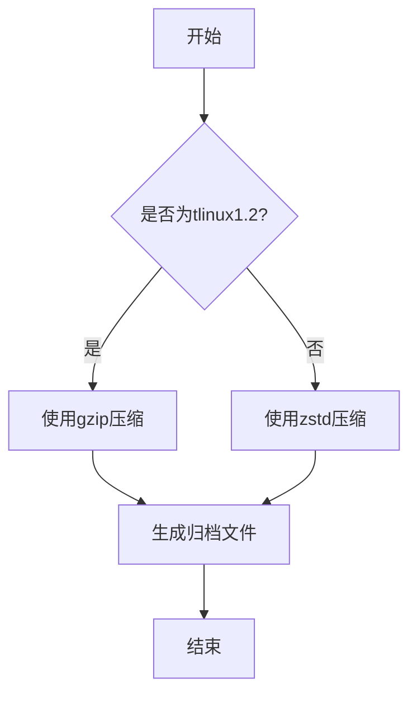

**Diagram sources**
- [backup.go](file://dbm-services/mongodb/db-tools/dbactuator/pkg/atomjobs/atommongodb/backup.go#L414-L448)

### 校验和生成

校验和的生成通过`backup_client.go`文件中的`UploadFile`方法实现。该方法在上传文件时计算MD5校验和，确保文件的完整性。

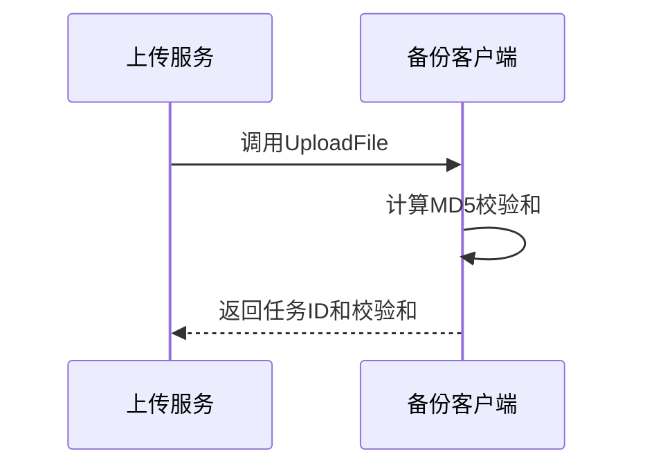

**Diagram sources**
- [backup_client.go](file://dbm-services/mongodb/db-tools/mongo-toolkit-go/pkg/backupsys/backup_client.go#L56-L77)

**Section sources**
- [backup.go](file://dbm-services/mongodb/db-tools/dbactuator/pkg/atomjobs/atommongodb/backup.go#L1-L570)
- [backup_client.go](file://dbm-services/mongodb/db-tools/mongo-toolkit-go/pkg/backupsys/backup_client.go#L1-L244)

## 恢复实现机制

### 备份文件解析

恢复流程从解析备份文件开始。`restore.go`文件中的`doLogicalRestore`方法负责解压备份文件，并检查目标MongoDB中是否存在要恢复的库和表。

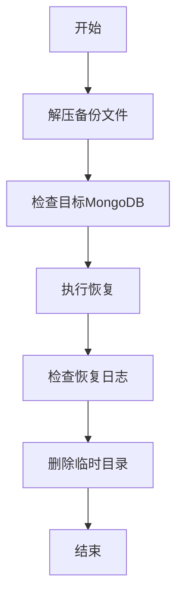

**Diagram sources**
- [restore.go](file://dbm-services/mongodb/db-tools/dbactuator/pkg/atomjobs/atommongodb/restore.go#L75-L93)

### 数据导入

数据导入通过`mongorestore`工具实现。在`restore.go`文件中，`Restore`方法负责执行恢复操作，并将恢复日志写入文件。

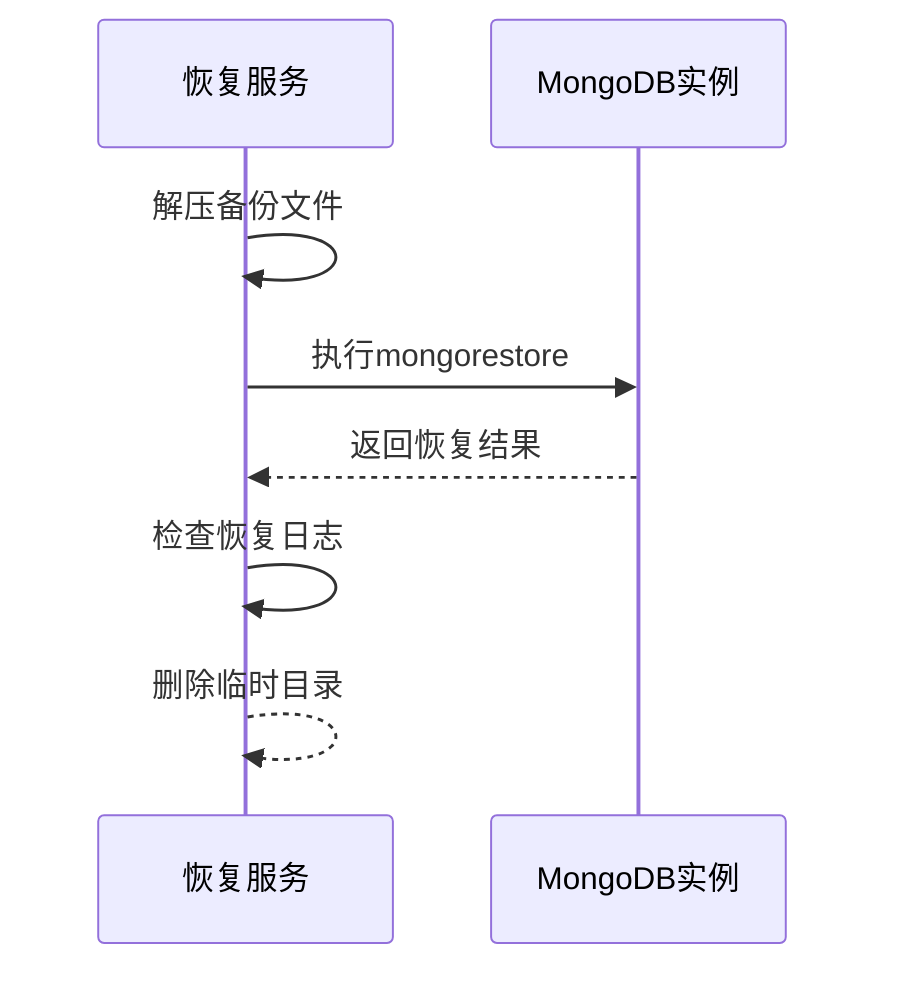

**Diagram sources**
- [restore.go](file://dbm-services/mongodb/db-tools/dbactuator/pkg/atomjobs/atommongodb/restore.go#L119-L187)

### 权限重建

权限重建在恢复过程中自动完成。`restore.go`文件中的`checkDstMongo`方法确保目标MongoDB中没有要恢复的库和表，从而避免权限冲突。

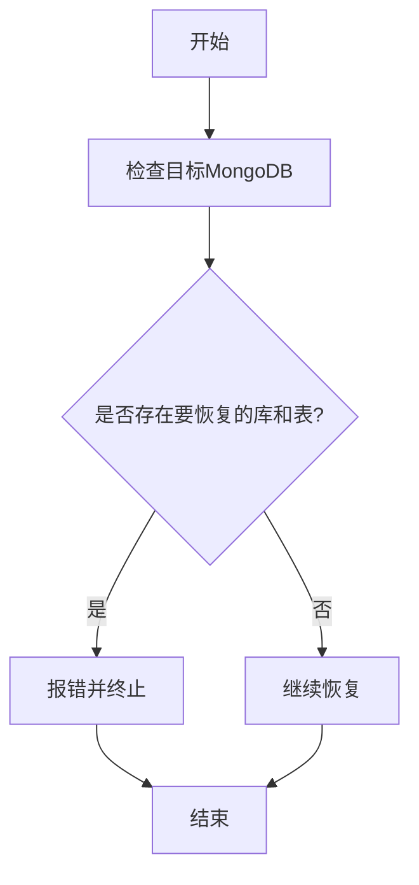

**Diagram sources**
- [restore.go](file://dbm-services/mongodb/db-tools/dbactuator/pkg/atomjobs/atommongodb/restore.go#L96-L116)

### 一致性验证

一致性验证通过检查恢复日志实现。`restore.go`文件中的`CheckRestoreLog`方法分析恢复日志，确保所有文档都成功恢复。

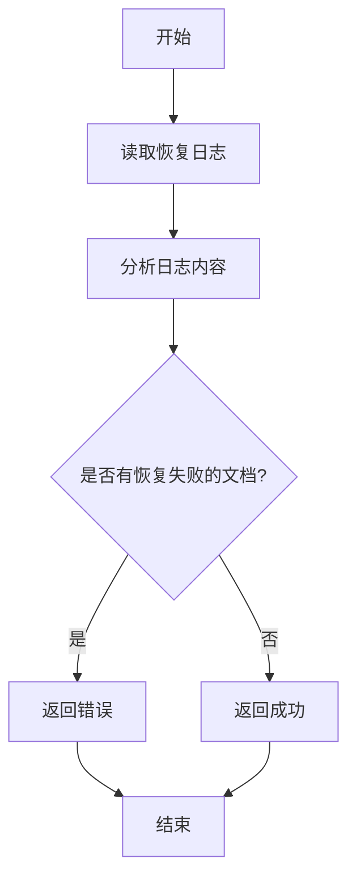

**Diagram sources**
- [restore.go](file://dbm-services/mongodb/db-tools/dbactuator/pkg/atomjobs/atommongodb/restore.go#L171-L179)

**Section sources**
- [restore.go](file://dbm-services/mongodb/db-tools/dbactuator/pkg/atomjobs/atommongodb/restore.go#L1-L332)
- [restore.go](file://dbm-services/mongodb/db-tools/mongo-toolkit-go/toolkit/logical/restore.go#L1-L458)

## 前端界面集成

### 恢复服务接口

`dbm-ui`中的恢复服务接口通过`views.py`文件中的`MongoDBRestoreViewSet`类实现。该类提供了查询备份日志和恢复记录的API。

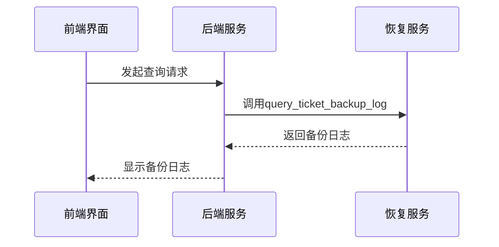

**Diagram sources**
- [views.py](file://dbm-ui/backend/db_services/mongodb/restore/views.py#L34-L49)

**Section sources**
- [views.py](file://dbm-ui/backend/db_services/mongodb/restore/views.py#L19-L49)

## 备份策略配置

### 定时备份

定时备份可以通过配置`cron`任务实现。例如，每天凌晨2点执行全量备份：

```bash
0 2 * * * /path/to/backup_script.sh
```

### 保留策略

保留策略通过`removeOldBackupFiles`方法实现。该方法删除超过30天的旧备份文件，确保磁盘空间的有效利用。

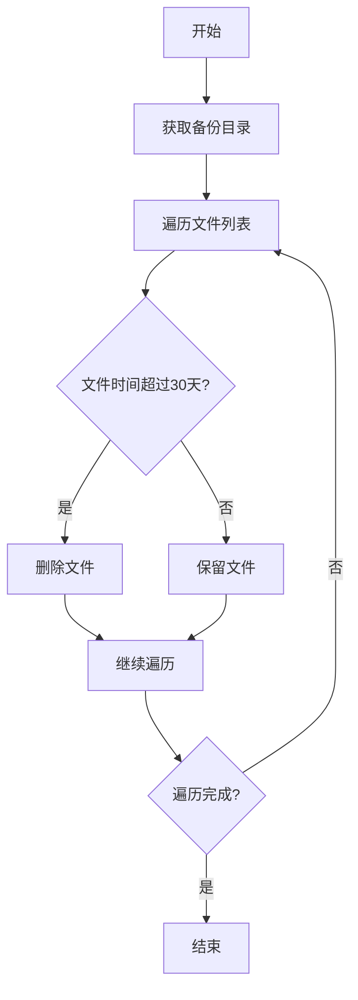

**Diagram sources**
- [backup.go](file://dbm-services/mongodb/db-tools/dbactuator/pkg/atomjobs/atommongodb/backup.go#L163-L260)

## 性能调优建议

### I/O优化

I/O优化可以通过增加并发数和使用高效的压缩算法实现。在`backup.go`文件中，`MaxConcurrency`字段控制最大并发数，默认为4。

### 并发控制

并发控制通过`GetConcurrentLock`方法实现。该方法确保同一时间只有一个备份任务在执行，避免资源竞争。

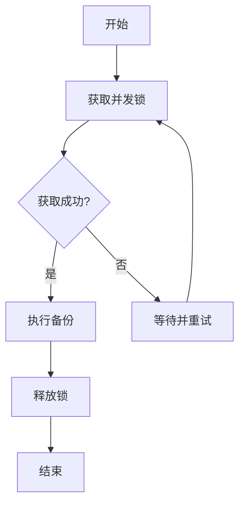

**Diagram sources**
- [backup.go](file://dbm-services/mongodb/db-tools/dbactuator/pkg/atomjobs/atommongodb/backup.go#L80-L102)

## 常见故障排查

### 备份失败

备份失败可能由于网络问题、磁盘空间不足或权限问题导致。检查日志文件`dump.log`可以获取详细的错误信息。

### 恢复中断

恢复中断可能由于网络中断或目标MongoDB实例不可用导致。检查恢复日志`restore.log`可以确定中断原因。

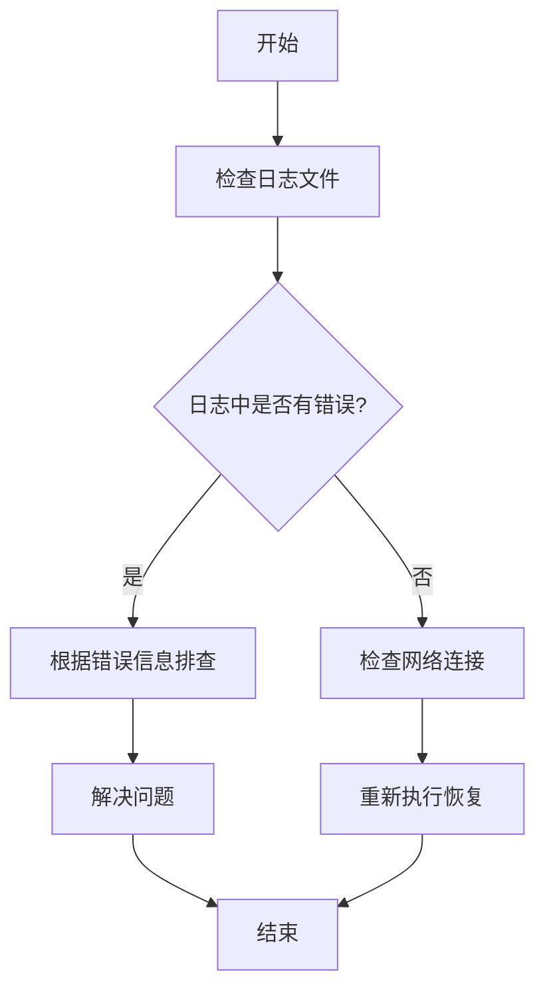

**Diagram sources**
- [restore.go](file://dbm-services/mongodb/db-tools/dbactuator/pkg/atomjobs/atommongodb/restore.go#L157-L169)

## 结论

本文档详细解析了MongoDB常规备份与恢复的实现逻辑，涵盖了从备份触发到恢复验证的全过程。通过合理的备份策略配置和性能调优，可以有效保障数据的安全性和系统的稳定性。在遇到故障时，通过日志分析和系统检查，可以快速定位并解决问题。