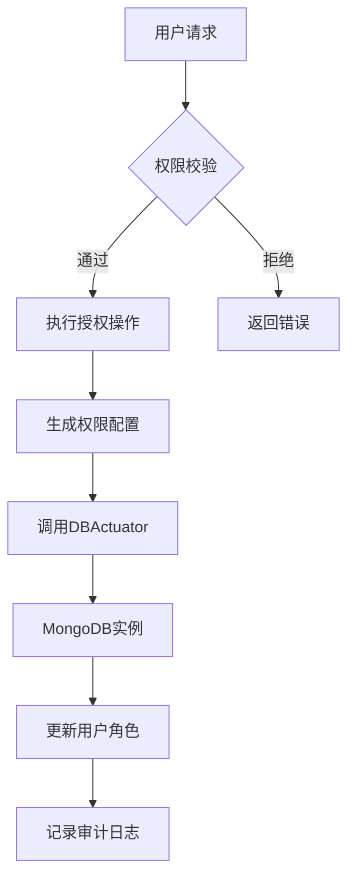

# 授权操作

<cite>
**本文档引用的文件**  
- [mongo_user_conf.go](file://dbm-services/mongodb/db-tools/dbactuator/pkg/common/mongo_user_conf.go)
- [account_rule_mongodb.go](file://dbm-services/mysql/db-priv/service/account_rule_mongodb.go)
- [instance_op.go](file://dbm-services/mongodb/db-tools/dbactuator/pkg/atomjobs/atommongodb/instance_op.go)
- [mongodb_dataclass.py](file://dbm-ui/backend/flow/utils/mongodb/mongodb_dataclass.py)
- [mongodb_script_template.py](file://dbm-ui/backend/flow/utils/mongodb/mongodb_script_template.py)
- [handlers.py](file://dbm-ui/backend/db_services/mongodb/permission/db_authorize/handlers.py)
- [serializers.py](file://dbm-ui/backend/db_services/mongodb/permission/db_authorize/serializers.py)
- [actions.py](file://dbm-ui/backend/iam_app/dataclass/actions.py)
- [initial.json](file://dbm-ui/backend/iam_app/migration_json_files/initial.json)
</cite>

## 目录
1. [引言](#引言)
2. [权限分配模型与RBAC实现机制](#权限分配模型与rbac实现机制)
3. [权限配置结构体解析](#权限配置结构体解析)
4. [权限授予命令封装与原子性保障](#权限授予命令封装与原子性保障)
5. [权限变更请求校验与审计日志](#权限变更请求校验与审计日志)
6. [业务场景示例](#业务场景示例)
7. [安全合规性与最佳实践](#安全合规性与最佳实践)

## 引言
本文件详细阐述了MongoDB在BlueKing DBM系统中的授权操作机制，重点分析权限分配模型、基于角色的访问控制（RBAC）实现方式，以及权限配置、授予、校验和审计的全流程。通过深入解析核心代码结构和交互流程，为运维人员和开发者提供清晰的操作指导和安全实践建议。

## 权限分配模型与RBAC实现机制
BlueKing DBM系统采用基于角色的访问控制（RBAC）模型来管理MongoDB的权限分配。该模型将权限划分为两类主要角色：`mongo_user` 和 `mongo_manager`，分别对应普通用户和管理用户。

- **mongo_user**：包含读写类权限，如 `read`、`readWrite`、`readAnyDatabase`、`readWriteAnyDatabase`。
- **mongo_manager**：包含管理类权限，如 `dbAdmin`、`backup`、`restore`、`userAdmin`、`clusterAdmin` 等高级操作权限。

权限分配以“账号规则”（Account Rule）的形式进行管理，通过定义账号、目标数据库、集群范围和权限类型，实现对资源的细粒度控制。系统通过IAM（身份与访问管理）模块进行权限校验，确保只有具备`mongodb_authorize_rules`等执行权限的用户才能发起授权操作。



**图源**  
- [actions.py](file://dbm-ui/backend/iam_app/dataclass/actions.py#L1961-L1971)
- [account_rule_mongodb.go](file://dbm-services/mysql/db-priv/service/account_rule_mongodb.go#L21-L23)

## 权限配置结构体解析
`mongo_user_conf.go` 文件定义了MongoDB用户权限配置的核心数据结构，支持不同版本的MongoDB协议。

### 核心结构体
- **`MongoRole`**：表示一个角色，包含 `Role`（角色名）和 `Db`（作用数据库）两个字段。
- **`Privileges`**：表示权限集合，包含 `Db`（数据库名）和 `Privileges`（权限字符串切片）。
- **`MongoUser`**：一个接口，定义了 `Init` 和 `GetContent` 方法，用于初始化用户和获取JSON格式的配置内容。

### 版本兼容性处理
系统通过 `NewMongoUser(dbVersion float64)` 工厂函数根据MongoDB版本返回不同的用户实现：
- **`MongoUser26`**：适用于2.6及以上版本，其 `Roles` 字段为 `[]*MongoRole` 类型，支持指定每个角色的作用数据库。
- **`MongoUser24`**：适用于2.4版本，其 `Roles` 字段为 `[]string` 类型，角色名隐含了作用数据库。

### 权限初始化逻辑
`Init` 方法负责将 `[]Privileges` 转换为对应的 `Roles` 结构：
- 对于 `MongoUser26`，遍历每个数据库的权限列表，为每个权限创建一个 `MongoRole` 实例，并指定其作用数据库。
- 对于 `MongoUser24`，使用 `mapset` 去重后，将权限字符串直接添加到 `Roles` 切片中。

**节源**  
- [mongo_user_conf.go](file://dbm-services/mongodb/db-tools/dbactuator/pkg/common/mongo_user_conf.go#L9-L99)

## 权限授予命令封装与原子性保障
权限授予操作通过DBActuator原子任务来执行，确保操作的原子性和可追溯性。

### 原子任务封装
`instance_op.go` 文件中的 `instOpParams` 结构体定义了实例操作的参数，其中 `GrantRolesToUser` 字段专门用于权限授予：
```go
GrantRolesToUser struct {
    Username string   `json:"username,omitempty"`
    Roles    []string `json:"roles,omitempty"`
} `json:"grantRolesToUser,omitempty"`
```
该结构体被序列化后作为参数传递给DBActuator，由其在目标MongoDB实例上执行 `db.grantRolesToUser()` 命令。

### 动态构建与执行
在前端或工作流引擎中，会动态构建包含 `grantRolesToUser` 指令的JavaScript脚本或直接调用API。例如，在 `mongodb_script_template.py` 中定义了初始化副本集时的脚本，其中包含了为特定用户（如`dba`、`appdba`）授予自定义角色的命令：
```javascript
db.grantRolesToUser('dba',[{role:'applyOps',db:'admin'}]);
```
这种封装方式将复杂的数据库命令抽象为可配置的模板，提高了操作的安全性和一致性。

**节源**  
- [instance_op.go](file://dbm-services/mongodb/db-tools/dbactuator/pkg/atomjobs/atommongodb/instance_op.go#L27-L30)
- [mongodb_script_template.py](file://dbm-ui/backend/flow/utils/mongodb/mongodb_script_template.py#L46-L47)

## 权限变更请求校验与审计日志
系统在执行权限变更前，会进行严格的前置校验，并记录完整的审计日志。

### 前置校验流程
`handlers.py` 中的 `multi_user_pre_check_rules` 方法负责对多个用户的授权请求进行前置检查：
1.  获取待授权用户的相关规则和密码信息。
2.  获取用户的基本信息。
3.  执行具体的校验逻辑，确保授权不会产生冲突或违反安全策略。

### 审计日志记录
虽然具体的日志记录代码未在搜索结果中直接体现，但系统设计遵循了安全审计原则：
- 所有授权操作都通过带有 `uid`（唯一标识）的DBActuator任务执行，任务日志天然具备审计功能。
- IAM系统的操作记录会捕获谁在何时执行了 `mongodb_authorize_rules` 操作。
- 数据库自身的操作日志（如`system.log`）也会记录 `grantRolesToUser` 等命令的执行。

**节源**  
- [handlers.py](file://dbm-ui/backend/db_services/mongodb/permission/db_authorize/handlers.py#L105-L120)
- [serializers.py](file://dbm-ui/backend/db_services/mongodb/permission/db_authorize/serializers.py#L24-L42)

## 业务场景示例
### 只读报表用户
为报表系统创建一个只读用户，仅允许访问`reporting`数据库。
- **账号**：`report_user`
- **权限类型**：`mongo_user`
- **具体权限**：`read`
- **作用数据库**：`reporting`

### 跨库读写权限
为应用创建一个用户，允许在`app_db`和`log_db`两个数据库上进行读写。
- **账号**：`app_user`
- **权限类型**：`mongo_user`
- **具体权限**：`readWrite`
- **作用数据库**：`app_db`, `log_db`

这些配置通过前端界面或API提交，系统会自动将其转换为相应的 `MongoRole` 配置并执行授权。

**节源**  
- [account_rule_mongodb.go](file://dbm-services/mysql/db-priv/service/account_rule_mongodb.go#L41-L55)

## 安全合规性与最佳实践
### 最小权限原则
始终遵循最小权限原则，仅授予用户完成其工作所必需的最低权限，避免使用`root`或`dbOwner`等高权限角色。

### 权限回收机制
系统支持通过删除账号规则或修改规则来回收权限。应定期审查和清理不再需要的权限。

### 安全合规性检查
- **权限分离**：确保开发、测试、生产环境的权限严格分离。
- **定期审计**：利用IAM和DBActuator的日志功能，定期审计权限变更历史。
- **密码策略**：强制使用强密码，并定期轮换。

通过以上机制，BlueKing DBM系统实现了对MongoDB权限的集中、安全、可控的管理。

**节源**  
- [initial.json](file://dbm-ui/backend/iam_app/migration_json_files/initial.json#L5757-L5790)
- [actions.py](file://dbm-ui/backend/iam_app/dataclass/actions.py#L1961-L1971)