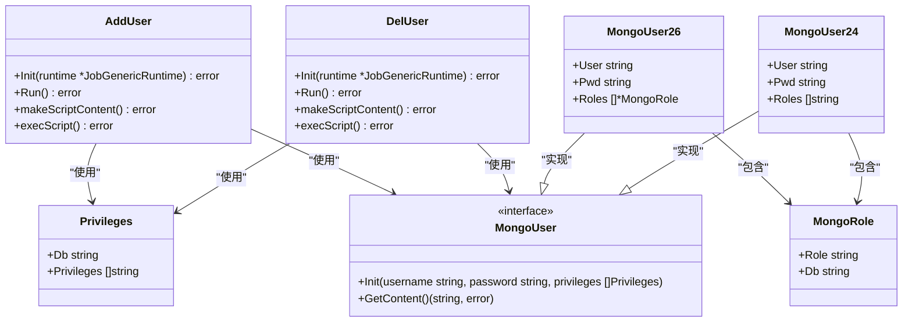
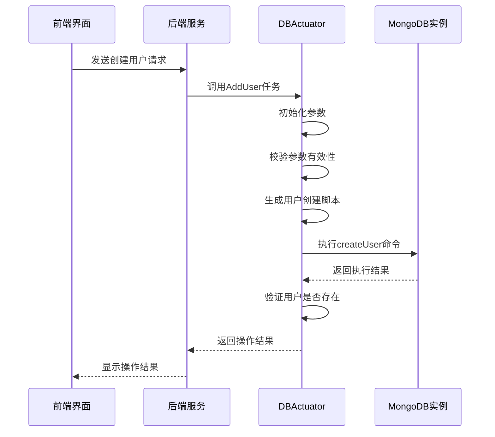
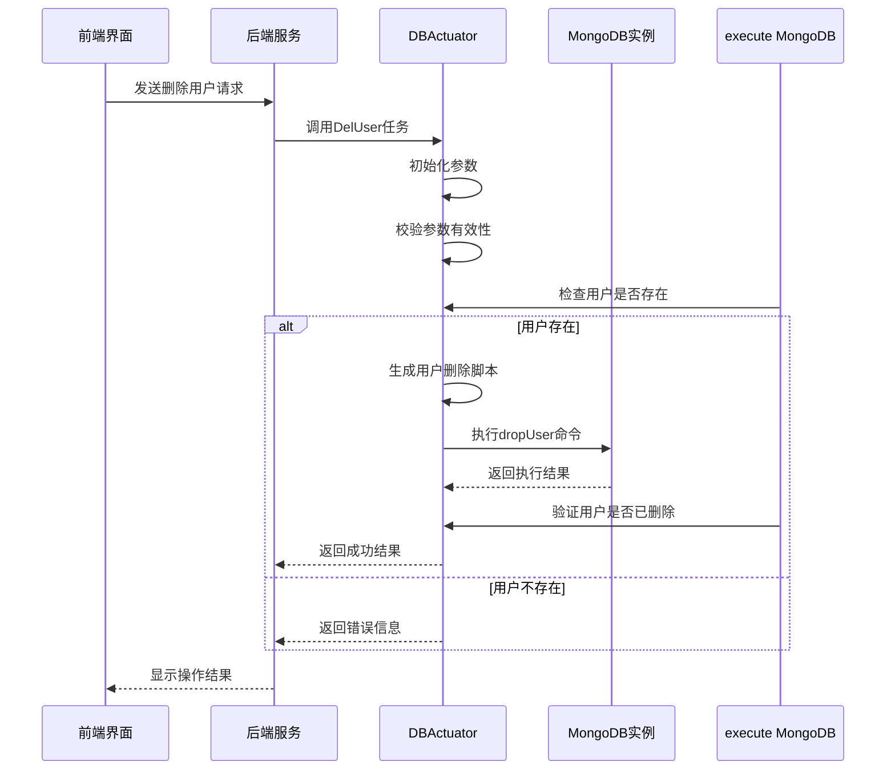
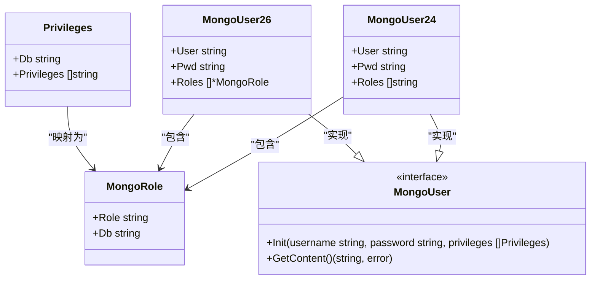
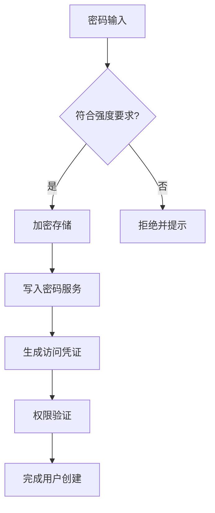

# 权限与账号管理

<cite>
**本文档引用的文件**  
- [add_user.go](file://dbm-services/mongodb/db-tools/dbactuator/pkg/atomjobs/atommongodb/add_user.go)
- [del_user.go](file://dbm-services/mongodb/db-tools/dbactuator/pkg/atomjobs/atommongodb/del_user.go)
- [mongo_user_conf.go](file://dbm-services/mongodb/db-tools/dbactuator/pkg/common/mongo_user_conf.go)
- [user.go](file://dbm-services/mongodb/db-tools/dbactuator/pkg/consts/user.go)
- [mongo_add_user.example.md](file://dbm-services/mongodb/db-tools/dbactuator/example/mongo_add_user.example.md)
- [mongo_del_user.example.md](file://dbm-services/mongodb/db-tools/dbactuator/example/mongo_del_user.example.md)
</cite>

## 目录
1. [引言](#引言)
2. [核心组件分析](#核心组件分析)
3. [用户创建流程](#用户创建流程)
4. [用户删除流程](#用户删除流程)
5. [权限配置模型](#权限配置模型)
6. [RBAC模型实现](#rbac模型实现)
7. [密码策略与安全合规](#密码策略与安全合规)
8. [审计日志机制](#审计日志机制)
9. [实际应用案例](#实际应用案例)
10. [总结](#总结)

## 引言
本文档详细分析了BlueKing DBM系统中MongoDB权限与账号管理模块的实现机制。重点研究了`db_services/mongodb/permission`相关组件如何处理用户授权请求，包括数据库账号的创建、删除和权限分配等核心功能。通过深入解析`add_user.go`和`del_user.go`中的用户管理命令封装方式，以及`mongo_user_conf.go`中的权限配置模型，全面展示了系统的权限管理体系。

**Section sources**
- [add_user.go](file://dbm-services/mongodb/db-tools/dbactuator/pkg/atomjobs/atommongodb/add_user.go#L1-L274)
- [del_user.go](file://dbm-services/mongodb/db-tools/dbactuator/pkg/atomjobs/atommongodb/del_user.go#L1-L206)

## 核心组件分析
MongoDB权限管理模块主要由以下几个核心组件构成：

- **AddUser**: 负责处理MongoDB用户创建请求
- **DelUser**: 负责处理MongoDB用户删除请求
- **MongoUser**: 用户权限配置的核心数据结构
- **Privileges**: 权限定义结构体
- **MongoRole**: 角色定义结构体

这些组件协同工作，实现了完整的用户生命周期管理功能。



**Diagram sources**
- [add_user.go](file://dbm-services/mongodb/db-tools/dbactuator/pkg/atomjobs/atommongodb/add_user.go#L32-L43)
- [del_user.go](file://dbm-services/mongodb/db-tools/dbactuator/pkg/atomjobs/atommongodb/del_user.go#L31-L40)
- [mongo_user_conf.go](file://dbm-services/mongodb/db-tools/dbactuator/pkg/common/mongo_user_conf.go#L36-L39)

**Section sources**
- [add_user.go](file://dbm-services/mongodb/db-tools/dbactuator/pkg/atomjobs/atommongodb/add_user.go#L19-L43)
- [del_user.go](file://dbm-services/mongodb/db-tools/dbactuator/pkg/atomjobs/atommongodb/del_user.go#L19-L40)
- [mongo_user_conf.go](file://dbm-services/mongodb/db-tools/dbactuator/pkg/common/mongo_user_conf.go#L9-L39)

## 用户创建流程
用户创建流程通过`AddUser`组件实现，主要包括以下步骤：

1. **初始化**: 获取运行时环境和配置参数
2. **参数校验**: 验证输入参数的完整性和有效性
3. **脚本生成**: 根据MongoDB版本生成相应的用户创建脚本
4. **执行脚本**: 在目标实例上执行用户创建操作
5. **结果验证**: 检查用户是否成功创建



**Diagram sources**
- [add_user.go](file://dbm-services/mongodb/db-tools/dbactuator/pkg/atomjobs/atommongodb/add_user.go#L56-L67)
- [add_user.go](file://dbm-services/mongodb/db-tools/dbactuator/pkg/atomjobs/atommongodb/add_user.go#L219-L272)

**Section sources**
- [add_user.go](file://dbm-services/mongodb/db-tools/dbactuator/pkg/atomjobs/atommongodb/add_user.go#L56-L272)

## 用户删除流程
用户删除流程通过`DelUser`组件实现，其执行流程如下：

1. **初始化**: 获取运行时环境和配置参数
2. **参数校验**: 验证输入参数的完整性和有效性
3. **存在性检查**: 确认目标用户是否存在
4. **脚本生成**: 根据MongoDB版本生成相应的用户删除脚本
5. **执行脚本**: 在目标实例上执行用户删除操作
6. **结果验证**: 检查用户是否成功删除



**Diagram sources**
- [del_user.go](file://dbm-services/mongodb/db-tools/dbactuator/pkg/atomjobs/atommongodb/del_user.go#L54-L63)
- [del_user.go](file://dbm-services/mongodb/db-tools/dbactuator/pkg/atomjobs/atommongodb/del_user.go#L164-L205)

**Section sources**
- [del_user.go](file://dbm-services/mongodb/db-tools/dbactuator/pkg/atomjobs/atommongodb/del_user.go#L54-L205)

## 权限配置模型
权限配置模型是MongoDB权限管理的核心，通过`mongo_user_conf.go`文件中的数据结构实现。

### 权限结构设计
系统采用分层的权限配置模型，主要包括：

- **Privileges**: 定义数据库级别的权限集合
- **MongoRole**: 定义具体的角色和作用域
- **MongoUser**: 用户实体，包含用户名、密码和角色列表



**Diagram sources**
- [mongo_user_conf.go](file://dbm-services/mongodb/db-tools/dbactuator/pkg/common/mongo_user_conf.go#L15-L33)

### 版本兼容性处理
系统通过`NewMongoUser`工厂方法处理不同MongoDB版本的兼容性问题：

```go
func NewMongoUser(dbVersion float64) MongoUser {
    if dbVersion > 2.4 {
        return &MongoUser26{}
    }
    return &MongoUser24{}
}
```

对于MongoDB 2.6及以上版本，使用`MongoUser26`结构体，支持更细粒度的角色控制；对于早期版本，则使用`MongoUser24`结构体保持向后兼容。

**Section sources**
- [mongo_user_conf.go](file://dbm-services/mongodb/db-tools/dbactuator/pkg/common/mongo_user_conf.go#L41-L47)

## RBAC模型实现
系统实现了基于角色的访问控制（RBAC）模型，通过预定义的角色和权限组合来管理用户权限。

### 角色定义
系统支持多种预定义角色，包括：

- **读写权限**: `readWrite`, `readWriteAnyDatabase`
- **只读权限**: `read`, `readAnyDatabase`
- **管理员权限**: `dbAdmin`, `dbAdminAnyDatabase`, `userAdmin`, `userAdminAnyDatabase`
- **集群管理权限**: `clusterAdmin`, `clusterManager`, `clusterMonitor`
- **超级用户权限**: `root`

### 权限分配流程
权限分配通过`dbsPrivileges`参数实现，其结构如下：

```json
{
  "dbsPrivileges": [
    {
      "db": "业务数据库名",
      "privileges": ["readWrite", "dbAdmin"]
    },
    {
      "db": "admin",
      "privileges": ["read"]
    }
  ]
}
```

每个权限条目指定数据库名称和在该数据库上的权限列表，系统会将这些权限映射为MongoDB内置的角色。

**Section sources**
- [add_user.go](file://dbm-services/mongodb/db-tools/dbactuator/pkg/atomjobs/atommongodb/add_user.go#L20-L30)
- [mongo_user_conf.go](file://dbm-services/mongodb/db-tools/dbactuator/pkg/common/mongo_user_conf.go#L15-L19)

## 密码策略与安全合规
系统实施了严格的密码策略和安全合规措施，确保用户账户的安全性。

### 密码强度要求
系统对用户密码实施以下安全要求：

- 最小长度限制
- 必须包含大小写字母、数字和特殊字符
- 禁止使用常见弱密码
- 禁止连续重复字符
- 禁止键盘序列（如qwerty）
- 禁止数字序列（如123456）

### 安全措施
系统采用多层次的安全防护机制：

- 所有密码在传输和存储过程中都进行加密
- 使用环境变量隔离敏感信息
- 实施最小权限原则
- 支持多因素认证集成
- 定期密码轮换策略



**Diagram sources**
- [user.go](file://dbm-services/mongodb/db-tools/dbactuator/pkg/consts/user.go#L9-L81)

**Section sources**
- [user.go](file://dbm-services/mongodb/db-tools/dbactuator/pkg/consts/user.go#L9-L81)

## 审计日志机制
系统实现了完整的审计日志机制，记录所有用户管理操作。

### 日志记录内容
每次用户管理操作都会生成详细的审计日志，包括：

- 操作类型（创建、删除）
- 操作时间戳
- 操作者信息
- 目标实例信息（IP、端口）
- 用户名
- 权限配置
- 操作结果（成功/失败）
- 错误信息（如果失败）

### 日志级别
系统采用分级日志记录策略：

- **Info级别**: 记录正常操作流程
- **Error级别**: 记录操作失败和异常
- **Debug级别**: 记录详细的调试信息

日志信息可用于安全审计、故障排查和操作追溯。

**Section sources**
- [add_user.go](file://dbm-services/mongodb/db-tools/dbactuator/pkg/atomjobs/atommongodb/add_user.go#L120-L121)
- [del_user.go](file://dbm-services/mongodb/db-tools/dbactuator/pkg/atomjobs/atommongodb/del_user.go#L110-L111)

## 实际应用案例
以下是几个典型的应用场景示例：

### 业务读写用户配置
为业务应用创建具有读写权限的用户：

```json
{
  "ip": "1.1.1.1",
  "port": 27001,
  "instanceType": "mongod",
  "username": "app_user",
  "password": "strong_password_123",
  "adminUsername": "admin",
  "adminPassword": "admin_password",
  "authDb": "admin",
  "dbsPrivileges": [
    {
      "db": "business_db",
      "privileges": ["readWrite"]
    }
  ]
}
```

### 只读报表用户配置
为报表系统创建只读用户：

```json
{
  "ip": "1.1.1.1",
  "port": 27001,
  "instanceType": "mongod",
  "username": "report_user",
  "password": "report_password_456",
  "adminUsername": "admin",
  "adminPassword": "admin_password",
  "authDb": "admin",
  "dbsPrivileges": [
    {
      "db": "business_db",
      "privileges": ["read"]
    }
  ]
}
```

### 管理员用户配置
创建具有管理权限的用户：

```json
{
  "ip": "1.1.1.1",
  "port": 27001,
  "instanceType": "mongod",
  "username": "admin_user",
  "password": "admin_strong_password",
  "adminUsername": "",
  "adminPassword": "",
  "authDb": "admin",
  "dbsPrivileges": [
    {
      "db": "admin",
      "privileges": ["root"]
    }
  ]
}
```

**Section sources**
- [mongo_add_user.example.md](file://dbm-services/mongodb/db-tools/dbactuator/example/mongo_add_user.example.md#L11-L48)

## 总结
本文档详细分析了BlueKing DBM系统中MongoDB权限与账号管理模块的实现机制。系统通过`AddUser`和`DelUser`组件实现了完整的用户生命周期管理功能，利用`mongo_user_conf.go`中的权限配置模型支持灵活的权限分配。RBAC模型的实现使得权限管理更加规范和安全，而严格的密码策略和审计日志机制则确保了系统的安全合规性。通过实际应用案例展示了如何为不同业务场景配置合适的权限，为系统管理员提供了清晰的操作指南。

**Section sources**
- [add_user.go](file://dbm-services/mongodb/db-tools/dbactuator/pkg/atomjobs/atommongodb/add_user.go#L1-L274)
- [del_user.go](file://dbm-services/mongodb/db-tools/dbactuator/pkg/atomjobs/atommongodb/del_user.go#L1-L206)
- [mongo_user_conf.go](file://dbm-services/mongodb/db-tools/dbactuator/pkg/common/mongo_user_conf.go#L1-L100)
- [user.go](file://dbm-services/mongodb/db-tools/dbactuator/pkg/consts/user.go#L1-L81)