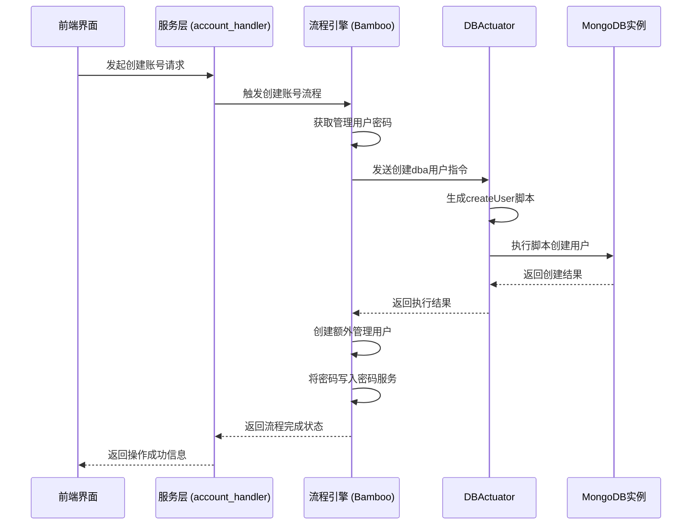
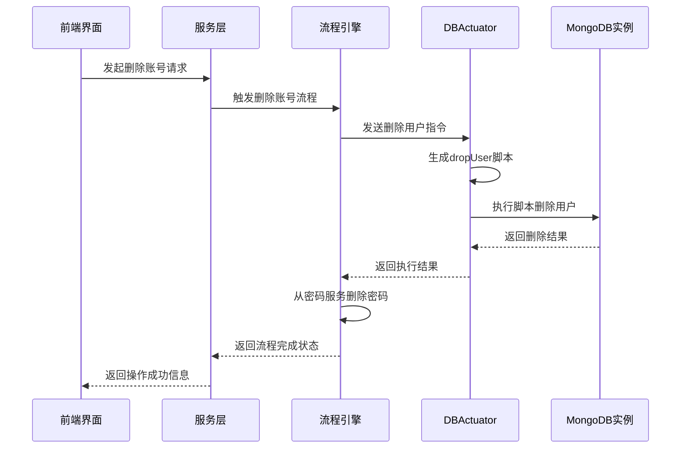
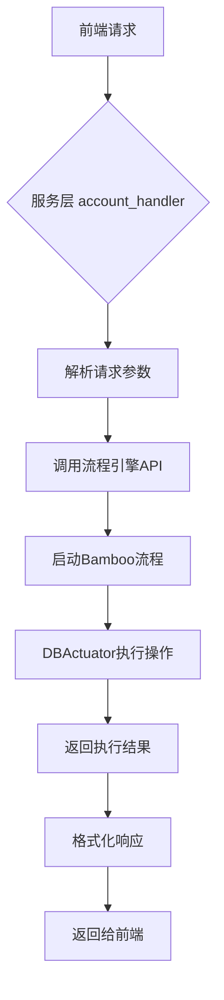
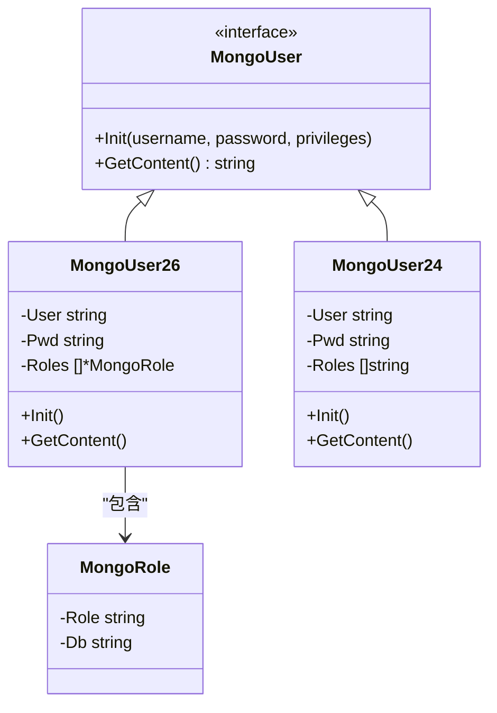
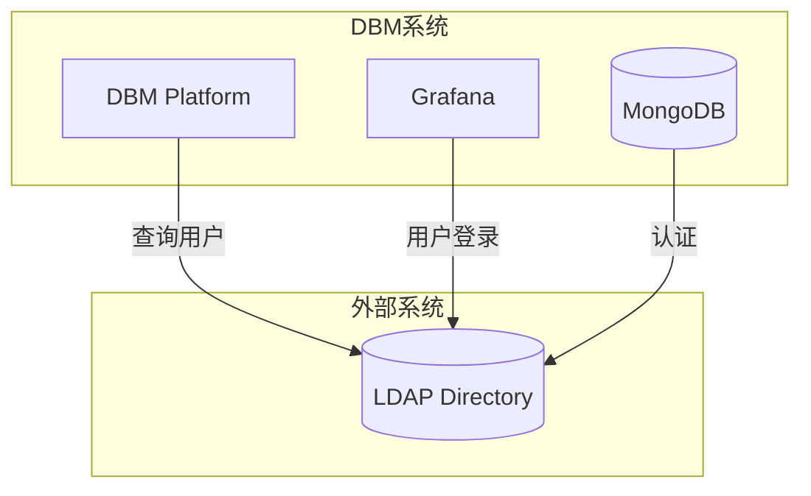

# 账号管理

<cite>
**本文档引用的文件**   
- [add_user.go](file://dbm-services/mongodb/db-tools/dbactuator/pkg/atomjobs/atommongodb/add_user.go)
- [del_user.go](file://dbm-services/mongodb/db-tools/dbactuator/pkg/atomjobs/atommongodb/del_user.go)
- [mongodb_dataclass.py](file://dbm-ui/backend/flow/utils/mongodb/mongodb_dataclass.py)
- [mongodb_script_template.py](file://dbm-ui/backend/flow/utils/mongodb/mongodb_script_template.py)
- [common/mongo_user_conf.go](file://dbm-services/mongodb/db-tools/dbactuator/pkg/common/mongo_user_conf.go)
- [mongodb_rpc/mongodb_user.go](file://dbm-services/mysql/db-remote-service/pkg/rpc_implement/mongodb_rpc/mongodb_user.go)
- [get_manager_user_password.py](file://dbm-ui/backend/flow/plugins/components/collections/mongodb/get_manager_user_password.py)
- [replicaset_install.py](file://dbm-ui/backend/flow/engine/bamboo/scene/mongodb/sub_task/replicaset_install.py)
</cite>

## 目录
1. [简介](#简介)
2. [账号创建流程](#账号创建流程)
3. [账号删除流程](#账号删除流程)
4. [前端请求处理流程](#前端请求处理流程)
5. [身份验证机制与权限管理](#身份验证机制与权限管理)
6. [异常处理与事务一致性](#异常处理与事务一致性)
7. [外部认证系统集成](#外部认证系统集成)
8. [常见问题与解决方案](#常见问题与解决方案)

## 简介
本文档详细阐述了MongoDB账号管理系统的实现机制，重点聚焦于账号的创建、删除和生命周期管理。系统通过分层架构实现了从用户界面到数据库底层操作的完整流程控制。账号管理功能主要由后端服务`dbactuator`中的`add_user.go`和`del_user.go`模块实现，前端请求通过`account_handler.py`等服务层组件进行路由和处理。系统支持多种身份验证机制，并通过密码服务集中管理用户凭证，确保了操作的安全性和一致性。

## 账号创建流程

账号创建流程是一个多阶段的自动化过程，从用户发起请求到最终在MongoDB实例中创建用户，涉及多个服务组件的协同工作。

**图示来源**
- [replicaset_install.py](file://dbm-ui/backend/flow/engine/bamboo/scene/mongodb/sub_task/replicaset_install.py#L70-L101)
- [add_user.go](file://dbm-services/mongodb/db-tools/dbactuator/pkg/atomjobs/atommongodb/add_user.go#L56-L67)
- [get_manager_user_password.py](file://dbm-ui/backend/flow/plugins/components/collections/mongodb/get_manager_user_password.py#L36-L65)

**流程说明：**
1.  **请求发起**：用户通过前端界面提交创建账号的请求。
2.  **流程触发**：服务层接收到请求后，调用流程引擎（Bamboo）启动预定义的“创建账号”流程。
3.  **密码获取**：流程引擎首先调用密码服务，为即将创建的管理用户（如`dba`、`appdba`等）生成或获取安全的密码。
4.  **核心执行**：流程引擎将创建用户的具体指令发送给`DBActuator`。`DBActuator`是部署在目标服务器上的代理程序，负责执行底层操作。
5.  **脚本生成与执行**：`DBActuator`根据MongoDB版本（2.4 vs 2.6+）动态生成相应的JavaScript脚本（使用`db.createUser()`或`db.addUser()`），并通过`mongo`命令行工具在目标实例上执行。
6.  **结果验证**：执行完成后，`DBActuator`会检查用户是否成功创建，并将结果返回给流程引擎。
7.  **状态同步**：流程引擎将新创建用户的密码信息安全地存储到中央密码服务中，完成整个生命周期管理。

**代码路径：**
- `get_add_manager_user_kwargs` (mongodb_dataclass.py) 生成创建管理用户的参数。
- `makeScriptContent` (add_user.go) 负责根据版本生成具体的MongoDB脚本。

**本节来源**
- [add_user.go](file://dbm-services/mongodb/db-tools/dbactuator/pkg/atomjobs/atommongodb/add_user.go#L1-L274)
- [mongodb_dataclass.py](file://dbm-ui/backend/flow/utils/mongodb/mongodb_dataclass.py#L869-L880)
- [replicaset_install.py](file://dbm-ui/backend/flow/engine/bamboo/scene/mongodb/sub_task/replicaset_install.py#L70-L101)

## 账号删除流程

账号删除流程与创建流程类似，但专注于安全地移除用户及其关联权限。

**图示来源**
- [del_user.go](file://dbm-services/mongodb/db-tools/dbactuator/pkg/atomjobs/atommongodb/del_user.go#L54-L65)
- [replicaset_install.py](file://dbm-ui/backend/flow/engine/bamboo/scene/mongodb/sub_task/migrate_mongod_replace.py#L287-L291)

**流程说明：**
1.  **请求与验证**：用户请求删除账号，系统首先验证该账号是否存在且可被删除。
2.  **指令下发**：流程引擎向`DBActuator`发送删除指令，包含目标用户名、实例地址和管理员凭据。
3.  **脚本生成**：`del_user.go`中的`makeScriptContent`方法根据MongoDB主版本号（3.0+）决定使用`dropUser`还是`removeUser`命令生成删除脚本。
4.  **执行与检查**：`execScript`方法执行删除命令，并在执行前后两次检查用户状态，确保删除操作的原子性和可靠性。
5.  **清理**：成功删除数据库用户后，流程引擎会触发后续步骤，从中央密码服务中移除该用户的密码记录，完成彻底清理。

**代码路径：**
- `makeScriptContent` (del_user.go) 生成删除用户的脚本。
- `execScript` (del_user.go) 执行脚本并验证结果。

**本节来源**
- [del_user.go](file://dbm-services/mongodb/db-tools/dbactuator/pkg/atomjobs/atommongodb/del_user.go#L1-L206)

## 前端请求处理流程

前端请求通过一个标准化的服务层进行处理，该层负责解析请求、调用底层工具并返回结果。

**图示来源**
- [test_account_handler.py](file://dbm-ui/backend/tests/db_services/mysql/permission/test_account_handler.py#L52-L78)

**流程说明：**
1.  **请求接收**：服务层（如`account_handler`）接收来自前端的HTTP请求。
2.  **参数解析**：服务层解析JSON请求体，提取出IP、端口、用户名、密码、权限等必要参数。
3.  **流程编排**：服务层不直接操作数据库，而是将参数封装成一个任务，提交给流程引擎（Bamboo）。
4.  **异步执行**：流程引擎异步执行任务，并通过回调或轮询机制通知服务层任务状态。
5.  **结果返回**：服务层将流程的最终结果（成功或失败及详细信息）格式化为标准的API响应，返回给前端。

这种设计实现了关注点分离，使服务层保持轻量，而复杂的操作逻辑由专门的流程引擎和执行器处理。

**本节来源**
- [test_account_handler.py](file://dbm-ui/backend/tests/db_services/mysql/permission/test_account_handler.py#L1-L88)

## 身份验证机制与权限管理

系统实现了精细的权限控制和安全的身份验证机制。

### 身份验证机制
系统主要依赖MongoDB原生的SCRAM（Salted Challenge Response Authentication Mechanism）机制，如SCRAM-SHA-1和SCRAM-SHA-256。`DBActuator`在执行`mongo`命令时，通过`--authenticationDatabase=admin`和`-u/-p`参数提供管理员凭据，确保操作的合法性。

### 权限管理
权限管理通过MongoDB的角色（Role）系统实现。系统根据MongoDB版本动态选择用户创建方式：
- **MongoDB 2.6+**：使用`db.createUser()`，支持细粒度的角色定义，如`{role: 'readWriteAnyDatabase', db: 'admin'}`。
- **MongoDB 2.4**：使用旧的`db.addUser()`，权限以字符串数组形式提供，如`['readWriteAnyDatabase']`。

`common/mongo_user_conf.go`中的`MongoUser`接口和`NewMongoUser`工厂方法实现了这一版本兼容性逻辑。

**图示来源**
- [common/mongo_user_conf.go](file://dbm-services/mongodb/db-tools/dbactuator/pkg/common/mongo_user_conf.go#L36-L100)

**本节来源**
- [common/mongo_user_conf.go](file://dbm-services/mongodb/db-tools/dbactuator/pkg/common/mongo_user_conf.go#L1-L100)
- [add_user.go](file://dbm-services/mongodb/db-tools/dbactuator/pkg/atomjobs/atommongodb/add_user.go#L143-L179)

## 异常处理与事务一致性

系统通过多层次的异常处理和验证机制来保证操作的可靠性和数据一致性。

### 异常处理
- **参数校验**：在`Init`阶段，使用`validator`库对输入参数进行严格校验。
- **存在性检查**：在创建用户前，`checkUser`方法会查询`system.users`集合，防止重复创建。
- **执行后验证**：`execScript`在执行命令后，会再次调用`checkUser`确认用户状态，确保操作成功。
- **错误传播**：所有错误都会被包装并返回，便于上层进行重试或告警。

### 事务一致性
虽然MongoDB的用户管理命令本身是原子的，但整个流程的最终一致性由流程引擎保证。例如，在`replicaset_install.py`中，创建用户和写入密码服务是两个独立的步骤，但它们被编排在同一个流程中，只有当所有步骤都成功时，整个流程才被视为成功。

**本节来源**
- [add_user.go](file://dbm-services/mongodb/db-tools/dbactuator/pkg/atomjobs/atommongodb/add_user.go#L184-L263)
- [del_user.go](file://dbm-services/mongodb/db-tools/dbactuator/pkg/atomjobs/atommongodb/del_user.go#L167-L200)

## 外部认证系统集成

系统具备与外部认证系统（如LDAP）集成的潜力。

虽然当前代码主要使用MongoDB本地用户，但`helm-charts`中的配置文件表明系统支持LDAP集成。通过在Helm Chart的`values.yaml`中配置LDAP服务器、绑定DN和搜索过滤器，可以将MongoDB的认证委托给外部LDAP服务。

**图示来源**
- [grafana/README.md](file://helm-charts/bk-dbm/charts/grafana/README.md#L540-L588)
- [grafana/templates/_helpers.tpl](file://helm-charts/bk-dbm/charts/grana/templates/_helpers.tpl#L190-L237)

这种集成方式允许企业统一管理用户身份，简化了账号生命周期管理。

**本节来源**
- [grafana/README.md](file://helm-charts/bk-dbm/charts/grafana/README.md#L540-L588)
- [grafana/templates/_helpers.tpl](file://helm-charts/bk-dbm/charts/grafana/templates/_helpers.tpl#L190-L237)

## 常见问题与解决方案

### 用户残留权限
**问题**：删除用户后，其权限可能未被完全清理。
**解决方案**：系统在`del_user.go`中通过`dropUser`命令直接从`system.users`集合中移除用户文档，确保权限被彻底删除。同时，流程引擎会清理密码服务中的记录，避免信息残留。

### 重复创建冲突
**问题**：尝试创建已存在的用户会导致操作失败。
**解决方案**：`add_user.go`中的`checkUser`方法在执行创建命令前会主动检查用户是否存在。如果用户已存在且权限不同，则返回错误，防止意外覆盖。

### 版本兼容性问题
**问题**：不同版本的MongoDB使用不同的用户管理API。
**解决方案**：系统通过`CheckMongoVersion`获取版本号，并使用`NewMongoUser`工厂模式动态选择`MongoUser26`或`MongoUser24`实现，生成符合版本要求的脚本，确保了跨版本的兼容性。

**本节来源**
- [add_user.go](file://dbm-services/mongodb/db-tools/dbactuator/pkg/atomjobs/atommongodb/add_user.go#L184-L231)
- [del_user.go](file://dbm-services/mongodb/db-tools/dbactuator/pkg/atomjobs/atommongodb/del_user.go#L167-L175)
- [common/mongo_user_conf.go](file://dbm-services/mongodb/db-tools/dbactuator/pkg/common/mongo_user_conf.go#L42-L47)