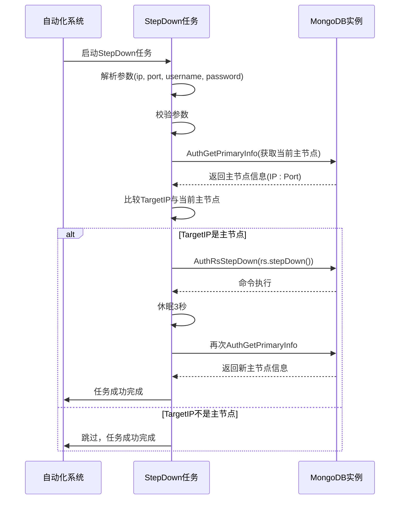

# 自动化修复

<cite>
**本文档引用文件**   
- [mongodb_autofix_ticket.py](file://dbm-ui/backend/db_services/mongodb/autofix/mongodb_autofix_ticket.py)
- [replicaset_stepdown.go](file://dbm-services/mongodb/db-tools/dbactuator/pkg/atomjobs/atommongodb/replicaset_stepdown.go)
- [instance_op.go](file://dbm-services/mongodb/db-tools/dbactuator/pkg/atomjobs/atommongodb/instance_op.go)
- [common/instance_op.go](file://dbm-services/mongodb/db-tools/dbactuator/pkg/common/instance_op.go)
- [MongoDB重启warning事件.json](file://dbm-ui/backend/db_monitor/tpls/alarm/mongodb/MongoDB重启warning事件.json)
- [mongod_step_down.example.md](file://dbm-services/mongodb/db-tools/dbactuator/example/mongod_step_down.example.md)
</cite>

## 目录
1. [引言](#引言)
2. [自动修复工单触发与执行流程](#自动修复工单触发与执行流程)
3. [主节点故障转移与实例重启机制](#主节点故障转移与实例重启机制)
4. [监控告警联动与故障检测](#监控告警联动与故障检测)
5. [典型故障场景自动修复案例](#典型故障场景自动修复案例)
6. [数据一致性保障措施](#数据一致性保障措施)
7. [结论](#结论)

## 引言
本文档详细分析蓝鲸智云-DB管理系统（BlueKing-BK-DBM）中MongoDB自动化修复功能的实现机制。重点解析`mongodb_autofix_ticket.py`如何定义自动修复工单的触发条件和执行流程，`replicaset_stepdown.go`和`instance_op.go`在主节点故障转移、实例重启等自愈操作中的作用机制，以及系统如何通过监控告警联动实现故障检测并自动执行预设的修复策略。同时，提供典型故障场景的自动修复案例，并讨论修复过程中的数据一致性保障措施。

## 自动修复工单触发与执行流程

`mongodb_autofix_ticket.py`文件是MongoDB自动化修复功能的核心，负责定义自动修复工单的触发条件和执行流程。该模块通过`mongo_create_ticket`函数实现自动化工单的创建。

当系统检测到MongoDB集群出现故障时，`mongo_create_ticket`函数会被调用。该函数首先获取负责该业务的MongoDB DBA列表，然后根据故障实例的类型（mongos或mongod）计算出需要申请的机器资源规格。对于mongos实例，系统会分析现有健康mongos实例在不同园区的分布情况，如果某个园区的实例占比超过50%，则在申请新实例时会排除该园区，以实现跨园区的高可用部署。

在收集完所有必要信息后，函数会构造一个包含详细信息的`details`字典，其中包括集群ID、域名、云区域、业务ID、资源规格、集群类型以及具体的故障实例列表。随后，系统调用`Ticket.create_ticket`方法创建一个类型为`MONGODB_AUTOFIX`的工单，并自动将创建者设置为该业务的DBA负责人。

工单创建成功后，系统会通过`notify.send_msg`异步发送消息提醒，并更新集群在`tb_tendis_autofix_core`表中的状态，标记为“等待流程执行”（AF_WFLOW）。如果创建过程中发生异常，则会将状态标记为“失败”（AF_FAIL），并记录错误信息。

整个流程通过工单系统（Ticket System）进行驱动，确保了修复操作的可追溯性和审计性。

**Section sources**
- [mongodb_autofix_ticket.py](file://dbm-ui/backend/db_services/mongodb/autofix/mongodb_autofix_ticket.py#L77-L146)

## 主节点故障转移与实例重启机制

### 主节点故障转移 (`replicaset_stepdown.go`)

`replicaset_stepdown.go`文件定义了`StepDown`结构体，实现了MongoDB副本集的主备切换（StepDown）原子任务。

该任务的执行流程如下：
1.  **初始化**：任务初始化时，首先解析传入的JSON参数（`StepDownConfParams`），包括目标IP、端口、管理员用户名和密码。然后，通过`AuthGetPrimaryInfo`函数连接到指定的MongoDB实例，获取当前主节点的信息。
2.  **参数校验**：使用`validator`库对输入参数进行校验，确保所有必需字段都已提供。
3.  **执行切换**：核心逻辑在`execStepDown`方法中。它会检查配置参数中的`TargetIP`是否与当前获取到的主节点IP一致。如果一致，则调用`common.AuthRsStepDown`函数执行`rs.stepDown()`命令，强制当前主节点降级为从节点。
4.  **验证结果**：执行`rs.stepDown()`后，任务会短暂休眠3秒，然后再次查询主节点信息。如果查询到的主节点不再是原节点，则认为切换成功。

该任务设计为可重试（Retry次数为2次），但不支持回滚（Rollback为空实现），因为主备切换是一个不可逆的操作。

**Diagram sources**
- [replicaset_stepdown.go](file://dbm-services/mongodb/db-tools/dbactuator/pkg/atomjobs/atommongodb/replicaset_stepdown.go#L49-L134)
- [mongod_step_down.example.md](file://dbm-services/mongodb/db-tools/dbactuator/example/mongod_step_down.example.md#L9-L18)

### 实例重启 (`instance_op.go`)

`instance_op.go`文件定义了`instOpJob`结构体，用于对单个MongoDB实例（mongod或mongos）执行各种操作，包括启动、停止、检查数据等。

在实例重启场景中，`Run`方法根据`ConfParams.Op`字段的值执行不同的操作：
*   **停止实例 (`stop`)**：`DoStop`方法首先通过`checkPortInUse`检查端口是否被占用。如果占用，则通过`getPidByPort`获取进程ID，并使用`syscall.Kill`发送SIGINT信号（信号2）尝试优雅停止进程。该操作会重试最多10次，每次间隔5秒。
*   **启动实例 (`start`)**：`DoStart`方法通过调用`/usr/local/mongodb/bin/start_mongo.sh`脚本并传入端口号来启动实例。该脚本会根据配置文件加载相应的MongoDB进程。在启动前，系统会先检查实例是否已在运行，避免重复启动。
*   **以独立模式启动 (`start_as_standalone`)**：此操作首先调用`DoStop`停止实例，然后调用`buildStandaloneConfigFile`构建一个不包含`sharding`和`replication`配置的独立模式配置文件，最后通过`startMongoWithConfigFile`使用该配置文件启动一个独立的mongod实例。

这些操作为自动化修复提供了基础的实例管理能力，使得系统能够在故障发生时灵活地重启或重新配置实例。

**Section sources**
- [instance_op.go](file://dbm-services/mongodb/db-tools/dbactuator/pkg/atomjobs/atommongodb/instance_op.go#L56-L108)
- [common/instance_op.go](file://dbm-services/mongodb/db-tools/dbactuator/pkg/common/instance_op.go#L104-L152)

## 监控告警联动与故障检测

系统通过蓝鲸监控（BKMonitor）实现与MongoDB的告警联动，以检测故障并触发自动化修复流程。

在`dbm-ui/backend/db_monitor/tpls/alarm/mongodb/`目录下，定义了多个针对MongoDB的告警策略。例如，`MongoDB重启warning事件.json`文件定义了一个基于自定义事件的告警规则：
*   **数据源**：该告警监听名为`mongo_restart`的自定义事件。
*   **触发条件**：当事件的`warn_level`为"warning"，且`cluster_type`为"MongoReplicaSet"或"MongoShardedCluster"时，告警被触发。
*   **算法**：使用"阈值"（Threshold）算法，当在60秒的聚合周期内，事件计数大于等于1时，即达到告警条件。
*   **告警级别**：定义为级别2（warning）。

当监控系统检测到MongoDB实例异常重启并上报`mongo_restart`事件时，该告警规则会被激活。告警系统会根据预设的通知策略（如邮件、短信、微信等）通知相关人员。更重要的是，该告警可以与自动化修复流程集成，作为触发`mongodb_autofix_ticket.py`创建自动修复工单的信号源。

此外，系统还定义了其他告警，如`MongoDB登录失败critical事件`和`MongoDB dbha切换mongos失败策略`，用于检测更严重的故障场景。这种多层次的监控体系确保了系统能够及时、准确地发现各种潜在问题，并为自动化修复提供可靠的输入。

**Section sources**
- [MongoDB重启warning事件.json](file://dbm-ui/backend/db_monitor/tpls/alarm/mongodb/MongoDB重启warning事件.json#L1-L278)

## 典型故障场景自动修复案例

### 案例一：主节点宕机

1.  **故障检测**：监控系统检测到主节点所在主机宕机或MongoDB进程崩溃，导致主节点失联。
2.  **告警触发**：副本集中的其他从节点会发起选举，产生新的主节点。同时，监控系统可能因心跳超时或实例不可达而触发告警。
3.  **工单创建**：告警系统联动`mongodb_autofix_ticket.py`，创建一个`MONGODB_AUTOFIX`工单，目标是修复已宕机的旧主节点。
4.  **主备切换**：在修复流程中，系统首先会检查故障节点是否仍被误认为是主节点（网络分区场景）。如果是，会调用`replicaset_stepdown.go`中的`StepDown`任务，强制其降级。
5.  **实例替换**：系统执行`mongod_replace`流程，申请新机器，部署MongoDB实例，并将其作为从节点加入到现有的副本集中。
6.  **恢复完成**：新实例完成数据同步后，修复流程结束。旧的故障节点被标记为下线。

### 案例二：复制延迟过高

1.  **故障检测**：监控系统持续采集从节点的`optime`（操作时间戳）与主节点的差值。当延迟超过预设阈值（如300秒）并持续一段时间后，触发告警。
2.  **工单创建**：系统自动创建`MONGODB_AUTOFIX`工单，目标是修复复制延迟过高的从节点。
3.  **实例重启**：修复流程可能首先尝试调用`instance_op.go`中的`DoStop`和`DoStart`来重启延迟节点的MongoDB进程，以解决可能的临时性问题。
4.  **实例替换**：如果重启无效，系统会执行实例替换流程。它会停止旧的延迟节点，然后在新机器上部署一个全新的实例，并将其加入副本集。新实例会从主节点重新同步全部数据，从而消除累积的延迟。
5.  **恢复完成**：新实例同步完成后，旧的延迟节点被移除，集群恢复正常。

## 数据一致性保障措施

在自动化修复过程中，系统采取了多项措施来保障数据的一致性：

1.  **主节点降级（StepDown）**：在替换主节点前，强制执行`rs.stepDown()`是保障数据一致性的关键步骤。这可以确保在旧主节点完全停止服务前，新的主节点已经选举产生并开始接收写入。这避免了可能出现的“双主”写入问题，防止数据冲突和丢失。
2.  **副本集成员管理**：在添加新节点时，系统通过`rs.add()`命令将其加入副本集。MongoDB会自动处理数据同步，确保新节点从主节点完整复制所有数据。在移除旧节点时，系统会确保其已不再是主节点且数据同步已停止。
3.  **原子任务设计**：每个修复操作（如启动、停止、切换）都被设计为一个原子任务（Atom Job）。这些任务具有明确的输入、输出和执行逻辑，确保了操作的可预测性和幂等性。
4.  **流程编排**：整个修复流程由一个工作流引擎（如文档中提到的`pipeline`）进行编排。引擎会严格按照预定义的顺序执行各个原子任务，并在每个步骤后进行状态检查，确保上一步成功完成后再执行下一步，从而维护了整个修复过程的原子性和一致性。
5.  **日志与审计**：所有操作都会被详细记录在日志中，包括任务的输入参数、执行结果和耗时。这为事后审计和问题排查提供了依据，也间接保障了操作的透明性和可追溯性。

## 结论

蓝鲸DBM的MongoDB自动化修复功能通过`mongodb_autofix_ticket.py`、`replicaset_stepdown.go`和`instance_op.go`等核心模块，构建了一个完整的故障自愈体系。该体系实现了从故障检测、工单创建、主备切换到实例重启/替换的全自动化流程。通过与监控告警系统的深度集成，系统能够及时响应各类故障，并通过精心设计的原子任务和流程编排，在保障数据一致性的前提下，快速恢复服务，极大地提升了数据库的可用性和运维效率。