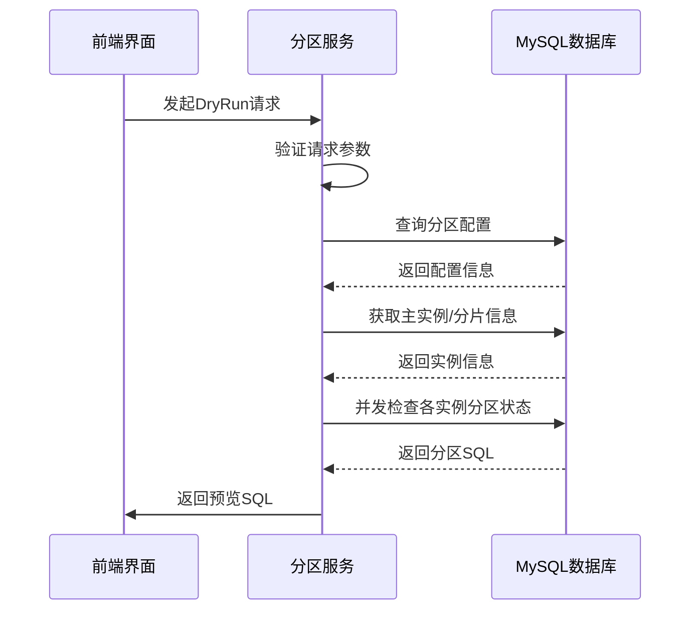
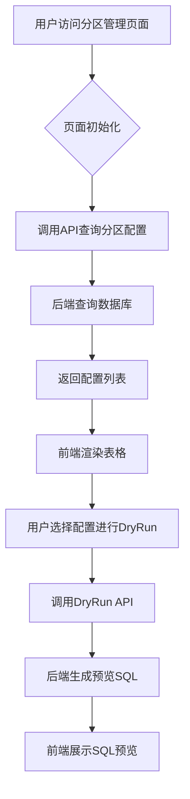

# MySQL分区管理

<cite>
**本文档引用的文件**   
- [manage_config.go](file://dbm-services/mysql/db-partition/service/manage_config.go)
- [check_partition.go](file://dbm-services/mysql/db-partition/service/check_partition.go)
- [handlers.py](file://dbm-ui/backend/db_services/partition/handlers.py)
- [constants.py](file://dbm-ui/backend/db_services/partition/constants.py)
</cite>

## 目录
1. [MySQL分区管理](#mysql分区管理)
2. [分区策略的创建与管理](#分区策略的创建与管理)
3. [分区检查与执行机制](#分区检查与执行机制)
4. [前端视图与配置查询](#前端视图与配置查询)
5. [大表自动分区策略配置案例](#大表自动分区策略配置案例)
6. [分区任务执行流程与监控](#分区任务执行流程与监控)
7. [异常处理机制](#异常处理机制)

## 分区策略的创建与管理

`db-partition/service/manage_config.go` 文件实现了MySQL分区策略的创建、更新、删除和查询功能。该文件通过GORM框架与数据库交互，支持TendbHA、TendbSingle和TendbCluster等多种集群类型。

在创建分区配置时，系统会进行多项验证，包括分区字段类型（datetime、date、timestamp、int、bigint）、分区间隔与过期时间的关系（过期时间必须是分区间隔的整数倍）以及库表名的有效性。创建操作会将配置信息写入相应的分区配置表（如`mysql_partition_config`或`spider_partition_config`），并记录操作日志。

更新操作遵循与创建类似的验证规则，但对特殊分区类型（如类型1、3、4）有额外限制：不允许修改分区字段和字段类型，只能调整保留时间、分区间隔等参数。删除操作支持按配置ID或集群ID批量删除，并会在删除前记录管理日志。

配置查询功能支持多维度筛选，包括业务ID（BkBizId）、配置ID、域名、库名和表名等。查询结果会关联最新的执行日志，按执行状态和配置ID排序，便于用户快速识别异常配置。

**Section sources**
- [manage_config.go](file://dbm-services/mysql/db-partition/service/manage_config.go#L226-L334)
- [manage_config.go](file://dbm-services/mysql/db-partition/service/manage_config.go#L337-L440)
- [manage_config.go](file://dbm-services/mysql/db-partition/service/manage_config.go#L151-L185)

## 分区检查与执行机制

`check_partition.go` 文件定义了分区检查的核心逻辑，主要通过`DryRun`和`CheckPartitionConfigs`两个函数实现。`DryRun`函数用于生成分区SQL语句并在页面上预览，而`CheckPartitionConfigs`则负责实际的分区检查和语句生成。

对于TendbHA集群，系统会获取主实例信息，并调用`CheckPartitionConfigs`生成分区SQL。对于TendbCluster集群，由于存在多个分片实例，系统会并发地对每个实例执行检查，以提高效率。并发控制通过带缓冲的channel实现，最大并发数为50。

`CheckPartitionConfigs`函数采用并发模式处理多个分区配置，使用`rate.Limiter`控制QPS（每秒查询率），避免对数据库造成过大压力。每个配置的检查在独立的goroutine中执行，并设置180秒的超时时间。检查结果分为三类：需要执行的SQL、无需执行的配置和检查失败的配置。

分区检查的核心是`CheckOnePartitionConfig`函数，它会根据当前时间、分区间隔和保留分区数计算需要添加和删除的分区，并生成相应的`ALTER TABLE ... ADD PARTITION`和`DROP PARTITION`语句。

**Diagram sources **
- [check_partition.go](file://dbm-services/mysql/db-partition/service/check_partition.go#L18-L164)
- [check_partition.go](file://dbm-services/mysql/db-partition/service/check_partition.go#L167-L206)

**Section sources**
- [check_partition.go](file://dbm-services/mysql/db-partition/service/check_partition.go#L18-L164)
- [check_partition.go](file://dbm-services/mysql/db-partition/service/check_partition.go#L167-L206)

## 前端视图与配置查询

前端通过`dbm-ui/backend/db_services/partition/handlers.py`中的`PartitionHandler`类处理分区管理视图的逻辑。该类提供了格式化错误信息、处理预览数据等功能。

`get_dry_run_data`方法用于处理DryRun的返回数据。如果执行成功，它会直接返回生成的SQL；如果失败，则会查询原始配置信息并格式化错误消息，便于用户定位问题。

前端查询分区配置时，会调用后端API获取数据，并通过`QueryParititionsInput`结构体进行多条件筛选。查询结果包含配置详情和最近的执行日志，使用户能够全面了解分区策略的执行情况。

**Diagram sources **
- [handlers.py](file://dbm-ui/backend/db_services/partition/handlers.py#L57-L75)

**Section sources**
- [handlers.py](file://dbm-ui/backend/db_services/partition/handlers.py#L43-L75)
- [constants.py](file://dbm-ui/backend/db_services/partition/constants.py#L19-L50)

## 大表自动分区策略配置案例

为大表配置自动分区策略的典型流程如下：

1. **选择分区键**：选择具有时间序列特征的字段作为分区键，如`create_time`（datetime类型）或`timestamp`类型字段。避免选择更新频繁的字段。

2. **定义分区范围**：根据数据量和访问模式确定分区间隔。例如，对于每日新增百万级数据的表，可选择按天分区（间隔24小时）；对于数据量较小的表，可选择按周或按月分区。

3. **设置调度配置**：
   - **过期时间**：设置数据保留周期，如30天、90天或1年。
   - **保留分区数**：系统自动计算，等于过期时间除以分区间隔。
   - **额外分区**：建议预留1-2个未来分区，避免业务高峰期因分区创建延迟导致写入失败。

4. **创建分区配置**：在管理界面填写上述参数，系统会验证配置的合理性，如过期时间必须是分区间隔的整数倍。

5. **预览与执行**：通过DryRun功能预览将要执行的SQL，确认无误后提交。系统会在预定时间自动执行分区任务。

## 分区任务执行流程与监控

分区任务的执行流程如下：
1. 调度系统触发分区任务
2. 获取待执行的分区配置
3. 对每个配置并发检查各数据库实例
4. 生成需要执行的ADD/DROP PARTITION语句
5. 在各实例上执行SQL
6. 上报执行结果和日志

监控指标包括：
- **执行成功率**：成功执行的配置数/总配置数
- **执行耗时**：从任务开始到结束的总时间
- **SQL生成数量**：平均每配置生成的SQL语句数
- **错误类型分布**：各类错误（超时、权限、语法等）的占比

系统通过`PartitionResultReportEvent`结构体上报执行结果，包含集群类型、业务ID、配置ID、执行时间和状态等信息，便于后续分析和告警。

## 异常处理机制

系统实现了多层次的异常处理机制：

1. **输入验证**：在创建和更新配置时，对所有参数进行严格验证，如字段类型、数值范围、格式正确性等。

2. **并发控制**：使用`rate.Limiter`和channel控制并发度，防止因并发过高导致数据库性能下降或连接耗尽。

3. **超时控制**：为每个分区检查设置180秒的上下文超时，避免长时间阻塞。

4. **错误聚合**：收集所有并发检查中的错误，统一返回给调用方，便于问题排查。

5. **日志记录**：所有操作（增删改查）都会记录到管理日志表中，包含操作类型、操作人、配置详情和执行时间，满足审计要求。

6. **降级策略**：当检查失败时，系统会返回具体的错误信息，但不会中断其他配置的检查，保证部分成功。

**Section sources**
- [check_partition.go](file://dbm-services/mysql/db-partition/service/check_partition.go#L174-L176)
- [manage_config.go](file://dbm-services/mysql/db-partition/service/manage_config.go#L629-L655)