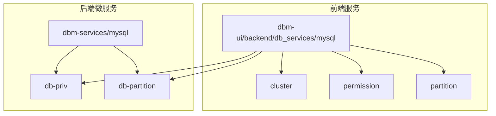
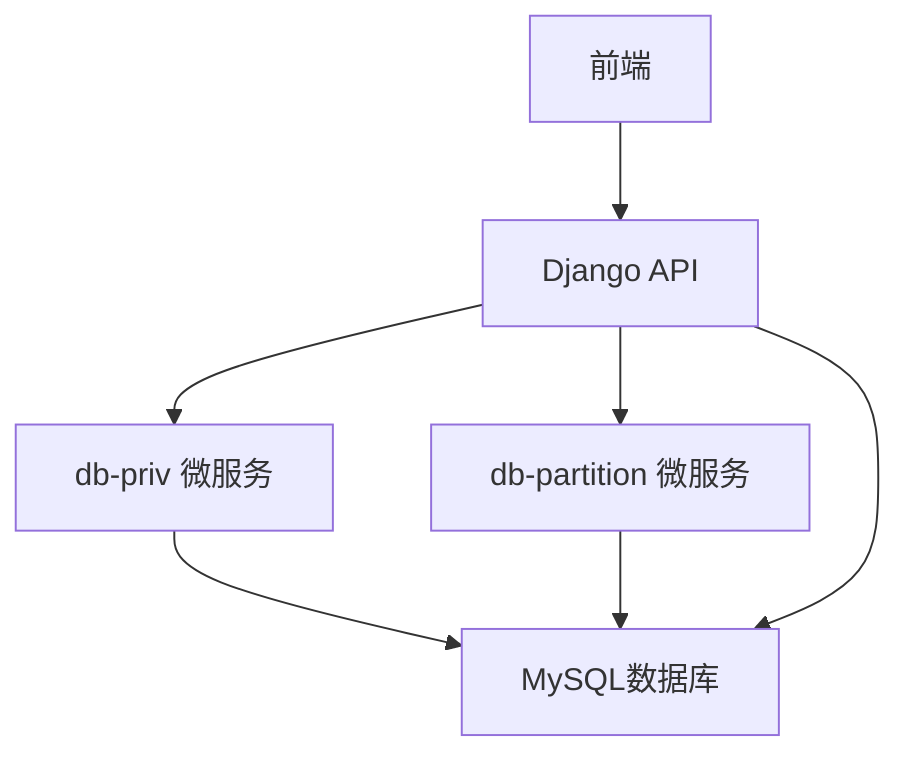
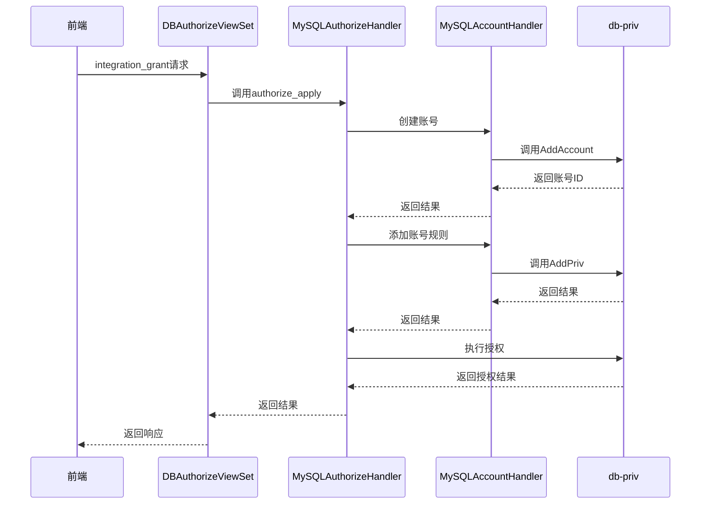
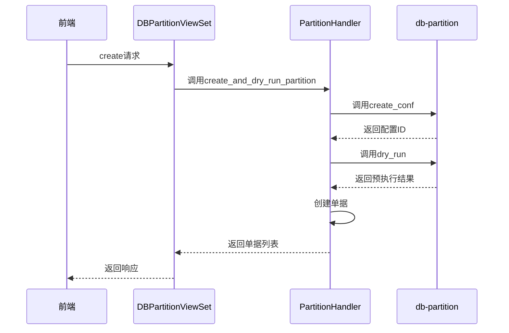
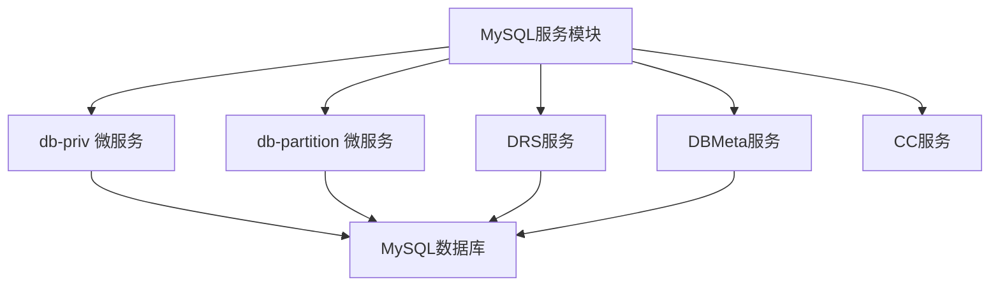

# MySQL服务模块

<cite>
**本文档引用的文件**   
- [cluster/views.py](file://dbm-ui/backend/db_services/mysql/cluster/views.py)
- [permission/authorize/views.py](file://dbm-ui/backend/db_services/mysql/permission/authorize/views.py)
- [permission/authorize/handlers.py](file://dbm-ui/backend/db_services/mysql/permission/authorize/handlers.py)
- [partition/views.py](file://dbm-ui/backend/db_services/partition/views.py)
- [partition/handlers.py](file://dbm-ui/backend/db_services/partition/handlers.py)
- [db-priv/service/account.go](file://dbm-services/mysql/db-priv/service/account.go)
- [db-priv/service/add_priv.go](file://dbm-services/mysql/db-priv/service/add_priv.go)
- [db-partition/service/check_partition.go](file://dbm-services/mysql/db-partition/service/check_partition.go)
- [db-partition/service/manage_config.go](file://dbm-services/mysql/db-partition/service/manage_config.go)
</cite>

## 目录
1. [引言](#引言)
2. [项目结构](#项目结构)
3. [核心组件](#核心组件)
4. [架构概述](#架构概述)
5. [详细组件分析](#详细组件分析)
6. [依赖分析](#依赖分析)
7. [性能考虑](#性能考虑)
8. [故障排除指南](#故障排除指南)
9. [结论](#结论)

## 引言
本文档深入分析MySQL服务模块的业务逻辑实现，涵盖集群管理、权限控制、分区管理等核心功能。详细解释`db_services/mysql`目录下各子模块（如cluster, permission, partition）如何通过Django视图和序列化器处理前端请求，并调用后端微服务完成业务逻辑。重点描述服务层与`db-priv`和`db-partition`等后端服务的交互模式，包括API调用、参数传递和错误处理。通过序列图展示创建MySQL集群、执行权限变更等关键流程。提供实际代码示例，说明事务管理、数据验证和日志记录的具体实现。

## 项目结构
MySQL服务模块位于`dbm-ui/backend/db_services/mysql`目录下，主要包含以下子模块：
- **cluster**: 集群管理相关功能
- **permission**: 权限管理相关功能
- **partition**: 分区管理相关功能
- **resources**: 资源查询相关功能

后端微服务位于`dbm-services/mysql`目录下，主要包括：
- **db-priv**: 权限管理微服务
- **db-partition**: 分区管理微服务

**图源**
- [cluster/views.py](file://dbm-ui/backend/db_services/mysql/cluster/views.py)
- [permission/authorize/views.py](file://dbm-ui/backend/db_services/mysql/permission/authorize/views.py)
- [partition/views.py](file://dbm-ui/backend/db_services/partition/views.py)
- [db-priv/service/account.go](file://dbm-services/mysql/db-priv/service/account.go)
- [db-partition/service/check_partition.go](file://dbm-services/mysql/db-partition/service/check_partition.go)

## 核心组件

### 集群管理
集群管理模块通过Django视图处理前端请求，主要功能包括查询集群、获取远程对等实例等。视图类`ClusterViewSet`继承自`BaseClusterViewSet`，通过`ClusterServiceHandler`处理具体的业务逻辑。

**组件源**
- [cluster/views.py](file://dbm-ui/backend/db_services/mysql/cluster/views.py)

### 权限管理
权限管理模块包含授权、克隆、账号管理等功能。`DBAuthorizeViewSet`是主要的视图类，通过`MySQLAuthorizeHandler`处理授权相关的业务逻辑。集成授权功能结合了创建账号、创建规则、授权规则，实现一键集成授权。

**组件源**
- [permission/authorize/views.py](file://dbm-ui/backend/db_services/mysql/permission/authorize/views.py)
- [permission/authorize/handlers.py](file://dbm-ui/backend/db_services/mysql/permission/authorize/handlers.py)

### 分区管理
分区管理模块提供分区策略的创建、修改、删除、启用、禁用等功能。`DBPartitionViewSet`是主要的视图类，通过`PartitionHandler`处理具体的业务逻辑。分区策略的执行通过创建单据的方式进行。

**组件源**
- [partition/views.py](file://dbm-ui/backend/db_services/partition/views.py)
- [partition/handlers.py](file://dbm-ui/backend/db_services/partition/handlers.py)

## 架构概述
MySQL服务模块采用前后端分离的架构，前端服务通过Django REST framework提供API接口，后端微服务使用Go语言实现，通过HTTP API进行通信。整体架构如下：

**图源**
- [permission/authorize/views.py](file://dbm-ui/backend/db_services/mysql/permission/authorize/views.py)
- [partition/views.py](file://dbm-ui/backend/db_services/partition/views.py)
- [db-priv/service/account.go](file://dbm-services/mysql/db-priv/service/account.go)
- [db-partition/service/check_partition.go](file://dbm-services/mysql/db-partition/service/check_partition.go)

## 详细组件分析

### 权限管理组件分析
权限管理组件通过`MySQLAuthorizeHandler`类封装授权相关的处理操作，主要方法包括：

#### 集成授权流程

**图源**
- [permission/authorize/views.py](file://dbm-ui/backend/db_services/mysql/permission/authorize/views.py)
- [permission/authorize/handlers.py](file://dbm-ui/backend/db_services/mysql/permission/authorize/handlers.py)
- [db-priv/service/account.go](file://dbm-services/mysql/db-priv/service/account.go)
- [db-priv/service/add_priv.go](file://dbm-services/mysql/db-priv/service/add_priv.go)

**组件源**
- [permission/authorize/views.py](file://dbm-ui/backend/db_services/mysql/permission/authorize/views.py)
- [permission/authorize/handlers.py](file://dbm-ui/backend/db_services/mysql/permission/authorize/handlers.py)

### 分区管理组件分析
分区管理组件通过`PartitionHandler`类处理分区相关的业务逻辑，主要方法包括：

#### 分区策略创建与执行流程

**图源**
- [partition/views.py](file://dbm-ui/backend/db_services/partition/views.py)
- [partition/handlers.py](file://dbm-ui/backend/db_services/partition/handlers.py)
- [db-partition/service/check_partition.go](file://dbm-services/mysql/db-partition/service/check_partition.go)
- [db-partition/service/manage_config.go](file://dbm-services/mysql/db-partition/service/manage_config.go)

**组件源**
- [partition/views.py](file://dbm-ui/backend/db_services/partition/views.py)
- [partition/handlers.py](file://dbm-ui/backend/db_services/partition/handlers.py)

## 依赖分析
MySQL服务模块依赖于多个外部服务和组件：

**图源**
- [permission/authorize/handlers.py](file://dbm-ui/backend/db_services/mysql/permission/authorize/handlers.py)
- [partition/handlers.py](file://dbm-ui/backend/db_services/partition/handlers.py)
- [db-priv/service/account.go](file://dbm-services/mysql/db-priv/service/account.go)
- [db-partition/service/check_partition.go](file://dbm-services/mysql/db-partition/service/check_partition.go)

**依赖源**
- [permission/authorize/handlers.py](file://dbm-ui/backend/db_services/mysql/permission/authorize/handlers.py)
- [partition/handlers.py](file://dbm-ui/backend/db_services/partition/handlers.py)

## 性能考虑
在设计和实现MySQL服务模块时，考虑了以下性能优化措施：

1. **并发处理**：在分区管理的`DryRun`方法中，使用goroutine并发处理多个实例的分区检查，通过限流器控制并发度，避免对数据库造成过大压力。
2. **批量请求**：在权限管理的`get_online_rules`方法中，通过批量查询减少数据库访问次数。
3. **缓存机制**：在账号信息查询中，使用缓存减少对后端服务的重复调用。
4. **连接池**：数据库连接使用连接池管理，提高连接复用率。

## 故障排除指南
### 常见问题及解决方案

| 问题 | 可能原因 | 解决方案 |
|------|---------|---------|
| 授权失败 | 账号已存在 | 检查账号是否已存在，使用现有账号 |
| 分区执行超时 | 数据库负载过高 | 检查数据库性能，优化查询 |
| 集群查询慢 | 数据量过大 | 使用分页查询，优化数据库索引 |
| 权限预检查失败 | IP地址格式错误 | 检查IP地址格式，确保符合要求 |

**故障排除源**
- [permission/authorize/handlers.py](file://dbm-ui/backend/db_services/mysql/permission/authorize/handlers.py)
- [partition/handlers.py](file://dbm-ui/backend/db_services/partition/handlers.py)

## 结论
MySQL服务模块通过清晰的分层架构和模块化设计，实现了集群管理、权限控制、分区管理等核心功能。前端服务与后端微服务通过定义良好的API接口进行通信，确保了系统的可维护性和可扩展性。通过合理的性能优化措施，保证了系统在高并发场景下的稳定运行。未来可以进一步优化错误处理机制，提高系统的健壮性。