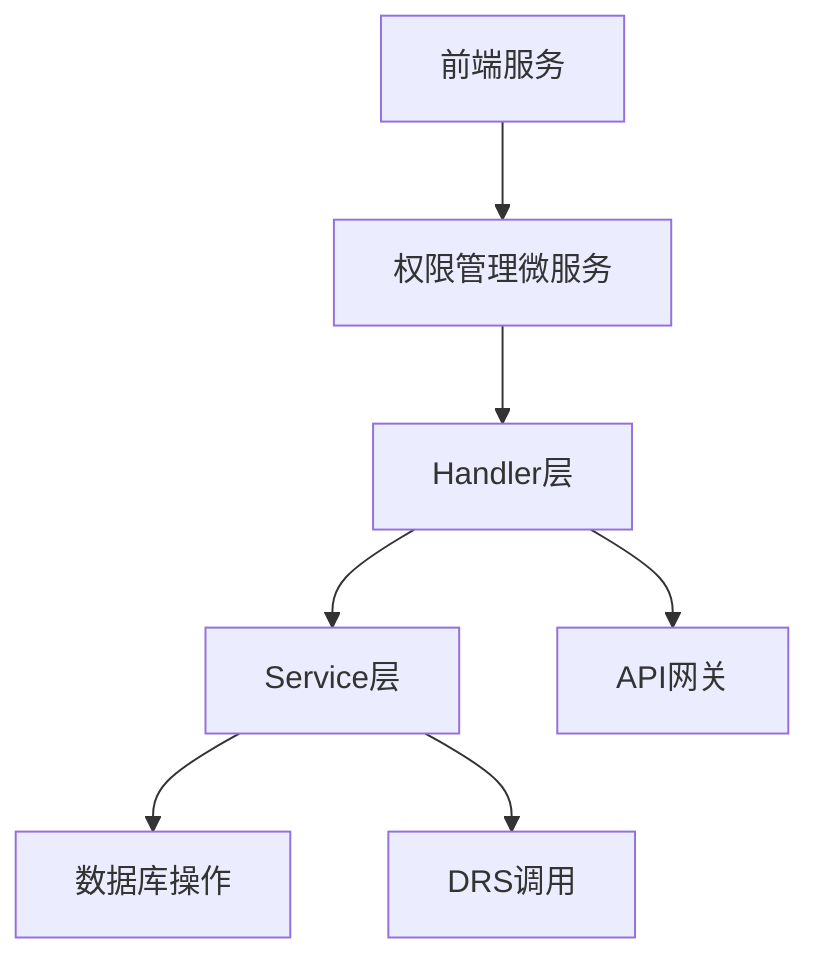
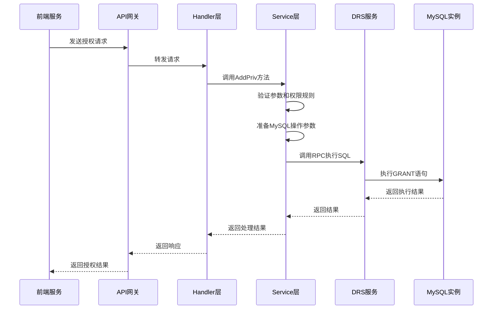
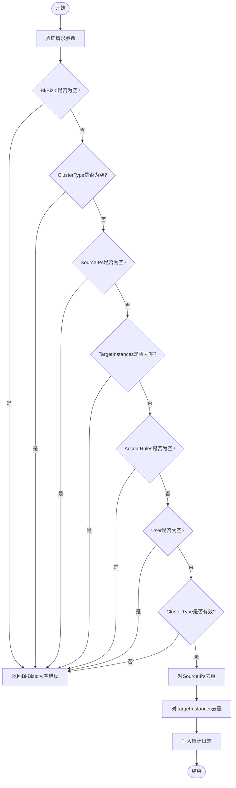
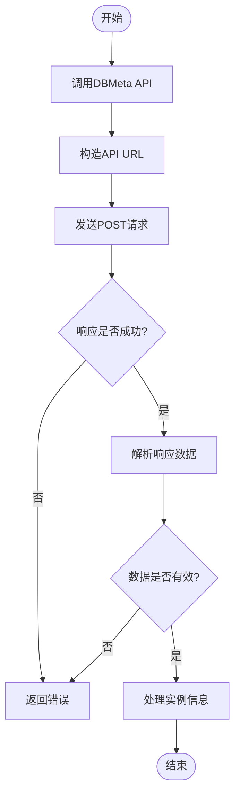
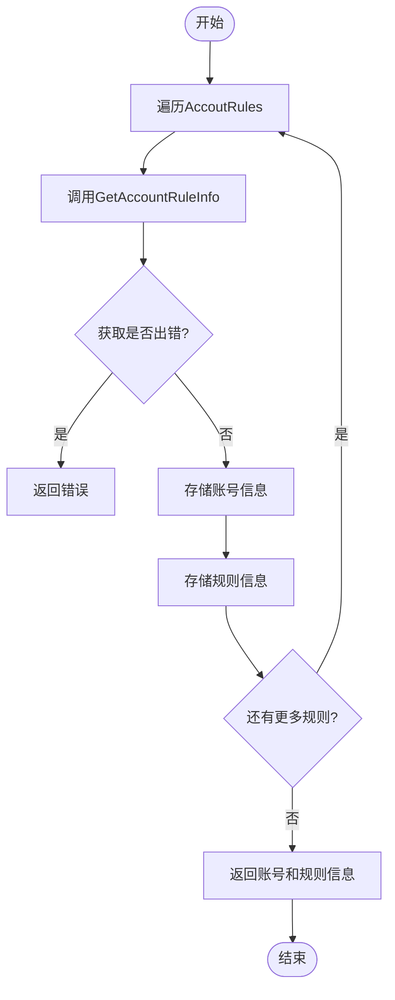
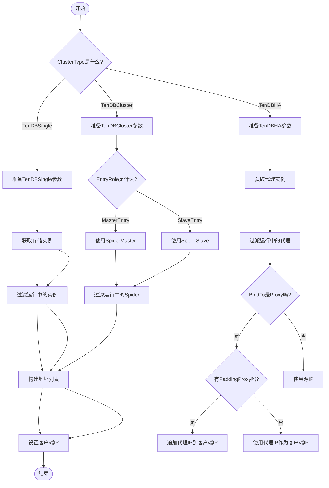
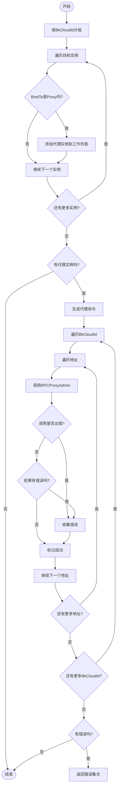
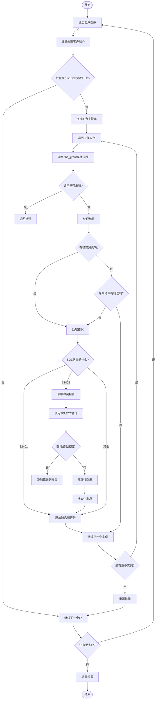
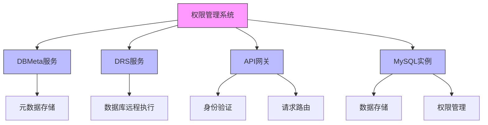

# MySQL权限管理

<cite>
**本文档引用的文件**
- [add_priv.go](file://dbm-services/mysql/db-priv/handler/add_priv.go)
- [add_priv.go](file://dbm-services/mysql/db-priv/service/v2/add_priv/add_priv.go)
- [add_on_mysql.go](file://dbm-services/mysql/db-priv/service/v2/add_priv/add_on_mysql.go)
- [add_proxy_white_list.go](file://dbm-services/mysql/db-priv/service/v2/add_priv/add_proxy_white_list.go)
- [fetch_account_rules_detail.go](file://dbm-services/mysql/db-priv/service/v2/add_priv/fetch_account_rules_detail.go)
- [fetch_target_dbmeta_info.go](file://dbm-services/mysql/db-priv/service/v2/add_priv/fetch_target_dbmeta_info.go)
- [prepare.go](file://dbm-services/mysql/db-priv/service/v2/add_priv/prepare.go)
- [client.py](file://dbm-ui/backend/components/mysql_priv_manager/client.py)
</cite>

## 目录
1. [简介](#简介)
2. [项目结构](#项目结构)
3. [核心组件](#核心组件)
4. [架构概述](#架构概述)
5. [详细组件分析](#详细组件分析)
6. [依赖分析](#依赖分析)
7. [性能考虑](#性能考虑)
8. [故障排除指南](#故障排除指南)
9. [结论](#结论)

## 简介
本文档全面解析MySQL权限管理系统的实现，涵盖账号授权、权限克隆和安全规则等功能。详细说明前端服务如何通过`permission/authorize/views.py`接收授权请求，并调用`db-priv/service`中的微服务。重点分析`add_priv.go`和`add_on_mysql.go`中的权限添加逻辑，包括SQL语句生成、权限验证和执行流程。通过实例展示如何为MySQL实例添加用户权限，并解释权限继承和白名单机制的实现细节。

## 项目结构
MySQL权限管理系统位于`dbm-services/mysql/db-priv`目录下，主要包含以下几个核心组件：
- `handler`：处理HTTP请求的路由和控制器
- `service`：业务逻辑实现，包含权限添加、克隆等核心功能
- `util`：工具函数和辅助方法

**图表来源**
- [add_priv.go](file://dbm-services/mysql/db-priv/handler/add_priv.go)
- [add_priv.go](file://dbm-services/mysql/db-priv/service/v2/add_priv/add_priv.go)

**章节来源**
- [add_priv.go](file://dbm-services/mysql/db-priv/handler/add_priv.go)
- [add_priv.go](file://dbm-services/mysql/db-priv/service/v2/add_priv/add_priv.go)

## 核心组件
权限管理系统的核心组件包括：
- `PrivService`：权限服务主类，处理所有权限相关的HTTP请求
- `PrivTaskPara`：权限任务参数结构体，包含授权所需的所有信息
- `accountAndRule`：账号和规则信息结构体，用于存储账号和权限规则的详细信息

**章节来源**
- [add_priv.go](file://dbm-services/mysql/db-priv/handler/add_priv.go)
- [add_priv.go](file://dbm-services/mysql/db-priv/service/v2/add_priv/add_priv.go)

## 架构概述
权限管理系统的架构采用分层设计，从前端到后端依次为：
1. 前端服务通过API网关调用权限管理微服务
2. 微服务的Handler层接收请求并进行初步验证
3. Service层处理核心业务逻辑，包括权限验证、SQL生成和执行
4. 通过DRS（Database Remote Service）调用底层数据库进行实际的权限操作

**图表来源**
- [add_priv.go](file://dbm-services/mysql/db-priv/handler/add_priv.go)
- [add_priv.go](file://dbm-services/mysql/db-priv/service/v2/add_priv/add_priv.go)
- [add_on_mysql.go](file://dbm-services/mysql/db-priv/service/v2/add_priv/add_on_mysql.go)

## 详细组件分析

### 权限添加流程分析
权限添加流程是MySQL权限管理系统的核心功能，主要包含以下几个步骤：

#### 参数验证和预处理

**图表来源**
- [add_priv.go](file://dbm-services/mysql/db-priv/service/v2/add_priv/add_priv.go)

**章节来源**
- [add_priv.go](file://dbm-services/mysql/db-priv/service/v2/add_priv/add_priv.go)

#### 目标实例信息获取

**图表来源**
- [fetch_target_dbmeta_info.go](file://dbm-services/mysql/db-priv/service/v2/add_priv/fetch_target_dbmeta_info.go)

**章节来源**
- [fetch_target_dbmeta_info.go](file://dbm-services/mysql/db-priv/service/v2/add_priv/fetch_target_dbmeta_info.go)

#### 账号规则信息获取

**图表来源**
- [fetch_account_rules_detail.go](file://dbm-services/mysql/db-priv/service/v2/add_priv/fetch_account_rules_detail.go)

**章节来源**
- [fetch_account_rules_detail.go](file://dbm-services/mysql/db-priv/service/v2/add_priv/fetch_account_rules_detail.go)

#### MySQL操作参数准备

**图表来源**
- [prepare.go](file://dbm-services/mysql/db-priv/service/v2/add_priv/prepare.go)

**章节来源**
- [prepare.go](file://dbm-services/mysql/db-priv/service/v2/add_priv/prepare.go)

#### 代理白名单添加

**图表来源**
- [add_proxy_white_list.go](file://dbm-services/mysql/db-priv/service/v2/add_priv/add_proxy_white_list.go)

**章节来源**
- [add_proxy_white_list.go](file://dbm-services/mysql/db-priv/service/v2/add_priv/add_proxy_white_list.go)

#### MySQL权限添加

**图表来源**
- [add_on_mysql.go](file://dbm-services/mysql/db-priv/service/v2/add_priv/add_on_mysql.go)

**章节来源**
- [add_on_mysql.go](file://dbm-services/mysql/db-priv/service/v2/add_priv/add_on_mysql.go)

## 依赖分析
权限管理系统依赖于多个外部服务和组件：

**图表来源**
- [add_priv.go](file://dbm-services/mysql/db-priv/service/v2/add_priv/add_priv.go)
- [fetch_target_dbmeta_info.go](file://dbm-services/mysql/db-priv/service/v2/add_priv/fetch_target_dbmeta_info.go)
- [add_on_mysql.go](file://dbm-services/mysql/db-priv/service/v2/add_priv/add_on_mysql.go)

**章节来源**
- [add_priv.go](file://dbm-services/mysql/db-priv/service/v2/add_priv/add_priv.go)
- [fetch_target_dbmeta_info.go](file://dbm-services/mysql/db-priv/service/v2/add_priv/fetch_target_dbmeta_info.go)
- [add_on_mysql.go](file://dbm-services/mysql/db-priv/service/v2/add_priv/add_on_mysql.go)

## 性能考虑
权限管理系统在设计时考虑了以下性能因素：

1. **并发处理**：使用goroutine并发处理多个目标实例的权限添加操作
2. **批量操作**：将客户端IP分批处理，避免单次请求过长
3. **连接复用**：通过DRS服务复用数据库连接，减少连接开销
4. **错误收集**：收集所有错误而不是遇到第一个错误就返回，提高诊断效率

## 故障排除指南
当权限添加出现问题时，可以按照以下步骤进行排查：

1. **检查请求参数**：确保所有必需参数都已提供且格式正确
2. **查看日志**：检查服务日志中的错误信息和调试信息
3. **验证目标实例**：确认目标MySQL实例是否在线且可访问
4. **检查账号规则**：确认账号规则是否存在且配置正确
5. **测试DRS连接**：验证DRS服务是否能正常连接到目标MySQL实例

**章节来源**
- [add_priv.go](file://dbm-services/mysql/db-priv/service/v2/add_priv/add_priv.go)
- [add_on_mysql.go](file://dbm-services/mysql/db-priv/service/v2/add_priv/add_on_mysql.go)

## 结论
MySQL权限管理系统通过分层架构和模块化设计，实现了高效、可靠的权限管理功能。系统从前端请求接收、参数验证、目标实例信息获取、账号规则查询到最终的权限添加操作，每个环节都经过精心设计和优化。通过并发处理、批量操作和错误收集等机制，系统能够在保证可靠性的同时提供良好的性能表现。