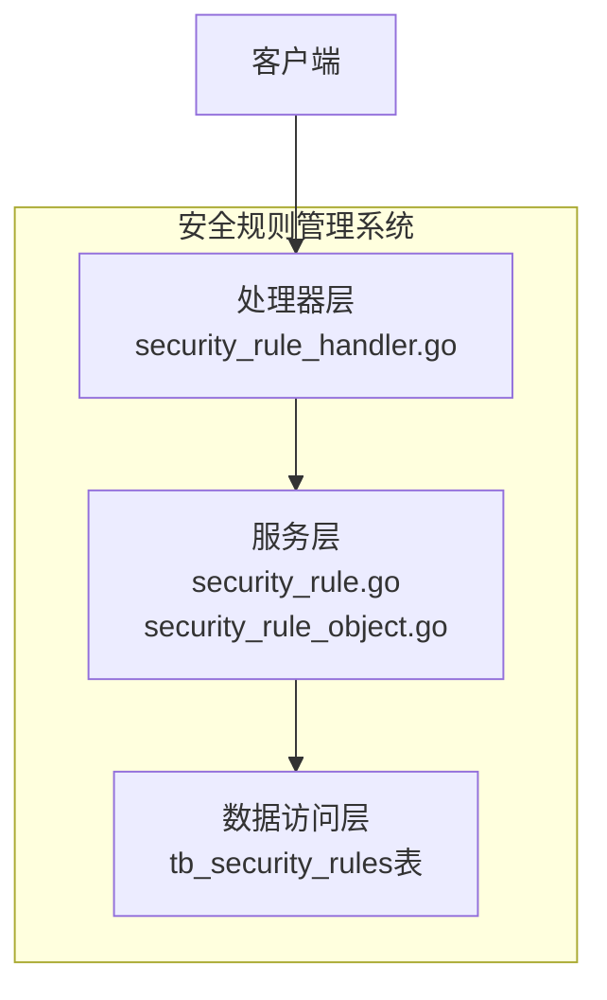
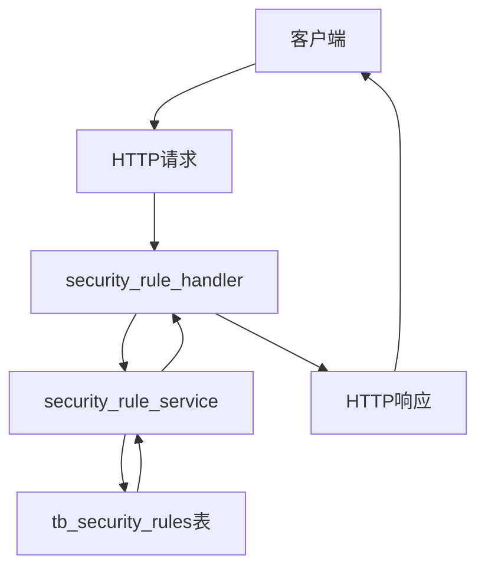
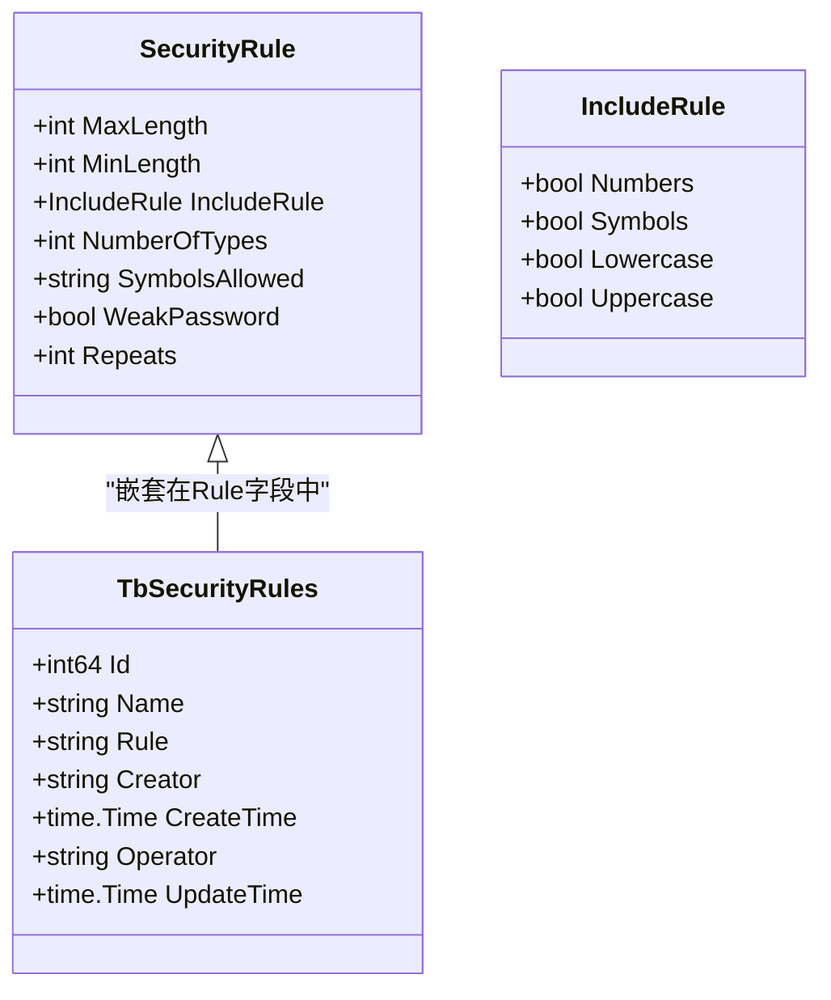
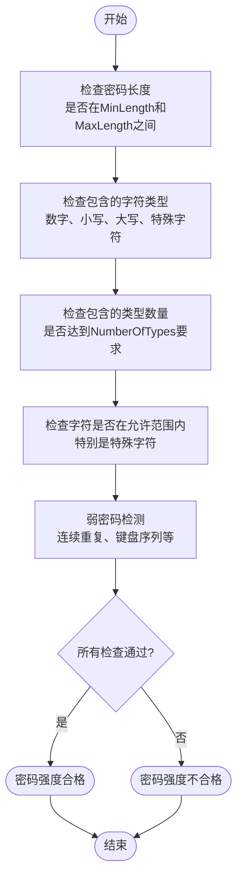
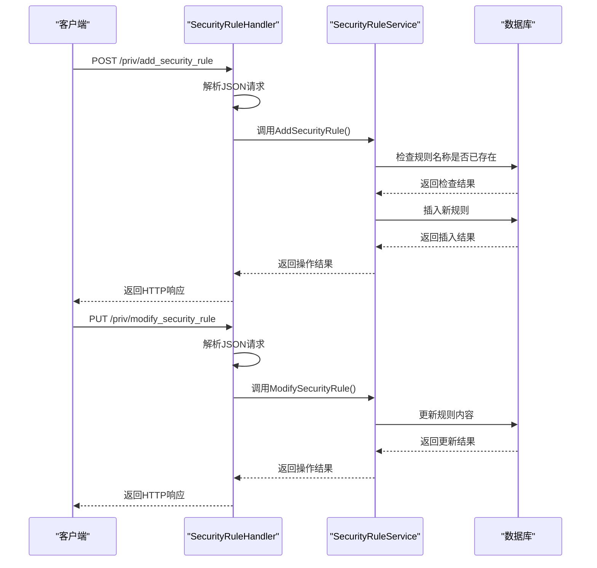
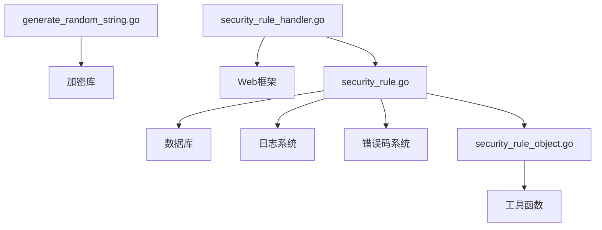

# 安全规则管理

<cite>
**本文档引用的文件**  
- [security_rule.go](file://dbm-services/mysql/db-priv/service/security_rule.go)
- [security_rule_object.go](file://dbm-services/mysql/db-priv/service/security_rule_object.go)
- [generate_random_string.go](file://dbm-services/mysql/db-priv/service/generate_random_string.go)
- [security_rule_handler.go](file://dbm-services/mysql/db-priv/handler/security_rule.go)
- [tb_security_rules 表结构](file://dbm-services/mysql/db-priv/assests/migrations/000004_init.up.sql)
</cite>

## 目录
1. [引言](#引言)
2. [项目结构](#项目结构)
3. [核心组件](#核心组件)
4. [架构概述](#架构概述)
5. [详细组件分析](#详细组件分析)
6. [依赖分析](#依赖分析)
7. [性能考虑](#性能考虑)
8. [故障排除指南](#故障排除指南)
9. [结论](#结论)

## 引言
本文档深入解析MySQL安全规则管理系统的实现，重点分析`security_rule.go`中定义的安全策略执行逻辑，包括密码复杂度验证、访问IP限制和操作时间窗口控制。同时分析`security_rule_object.go`中安全规则的数据结构设计及其与权限系统的集成方式。通过具体示例展示如何配置和应用安全规则，并解释规则冲突解决机制和优先级处理逻辑。

## 项目结构
安全规则管理系统主要位于`dbm-services/mysql/db-priv/`目录下，包含服务层、处理器层和数据访问层。系统通过REST API提供安全规则的增删改查功能，并与权限系统紧密集成。

**图表来源**  
- [security_rule_handler.go](file://dbm-services/mysql/db-priv/handler/security_rule.go)
- [security_rule.go](file://dbm-services/mysql/db-priv/service/security_rule.go)
- [tb_security_rules 表结构](file://dbm-services/mysql/db-priv/assests/migrations/000004_init.up.sql)

**章节来源**  
- [security_rule_handler.go](file://dbm-services/mysql/db-priv/handler/security_rule.go)
- [security_rule.go](file://dbm-services/mysql/db-priv/service/security_rule.go)

## 核心组件
安全规则管理系统的核心组件包括安全规则数据结构、密码复杂度验证器、随机密码生成器和规则管理服务。系统通过JSON格式存储安全规则，并提供完整的CRUD操作接口。

**章节来源**  
- [security_rule_object.go](file://dbm-services/mysql/db-priv/service/security_rule_object.go)
- [security_rule.go](file://dbm-services/mysql/db-priv/service/security_rule.go)

## 架构概述
系统采用分层架构设计，包括处理器层、服务层和数据访问层。处理器层负责HTTP请求的接收和响应，服务层实现业务逻辑，数据访问层负责与数据库交互。

**图表来源**  
- [security_rule_handler.go](file://dbm-services/mysql/db-priv/handler/security_rule.go)
- [security_rule.go](file://dbm-services/mysql/db-priv/service/security_rule.go)
- [tb_security_rules 表结构](file://dbm-services/mysql/db-priv/assests/migrations/000004_init.up.sql)

## 详细组件分析

### 安全规则数据结构分析
安全规则系统的核心数据结构定义了密码策略的各种约束条件，包括长度限制、字符类型要求和弱密码检测规则。

**图表来源**  
- [security_rule_object.go](file://dbm-services/mysql/db-priv/service/security_rule_object.go#L30-L39)
- [tb_security_rules 表结构](file://dbm-services/mysql/db-priv/assests/migrations/000004_init.up.sql#L2-L11)

**章节来源**  
- [security_rule_object.go](file://dbm-services/mysql/db-priv/service/security_rule_object.go)

### 密码复杂度验证流程分析
密码复杂度验证流程系统地检查密码是否符合预定义的安全规则，包括长度检查、字符类型检查和弱密码模式检测。

**图表来源**  
- [generate_random_string.go](file://dbm-services/mysql/db-priv/service/generate_random_string.go#L93-L153)
- [security_rule_object.go](file://dbm-services/mysql/db-priv/service/security_rule_object.go#L48-L64)

**章节来源**  
- [generate_random_string.go](file://dbm-services/mysql/db-priv/service/generate_random_string.go)

### 安全规则管理API流程分析
安全规则管理API处理客户端对安全规则的增删改查操作，确保规则的完整性和一致性。

**图表来源**  
- [security_rule_handler.go](file://dbm-services/mysql/db-priv/handler/security_rule.go)
- [security_rule.go](file://dbm-services/mysql/db-priv/service/security_rule.go)

**章节来源**  
- [security_rule_handler.go](file://dbm-services/mysql/db-priv/handler/security_rule.go)
- [security_rule.go](file://dbm-services/mysql/db-priv/service/security_rule.go)

## 依赖分析
安全规则管理系统依赖于多个组件和模块，包括数据库访问层、日志记录系统和权限验证机制。系统通过清晰的接口定义确保各组件之间的松耦合。

**图表来源**  
- [security_rule.go](file://dbm-services/mysql/db-priv/service/security_rule.go)
- [security_rule_object.go](file://dbm-services/mysql/db-priv/service/security_rule_object.go)
- [generate_random_string.go](file://dbm-services/mysql/db-priv/service/generate_random_string.go)
- [security_rule_handler.go](file://dbm-services/mysql/db-priv/handler/security_rule.go)

**章节来源**  
- [security_rule.go](file://dbm-services/mysql/db-priv/service/security_rule.go)
- [security_rule_object.go](file://dbm-services/mysql/db-priv/service/security_rule_object.go)

## 性能考虑
安全规则管理系统在设计时考虑了性能因素，包括数据库查询优化、内存使用效率和并发处理能力。系统采用连接池管理数据库连接，并对频繁访问的数据进行缓存。

## 故障排除指南
当安全规则管理系统出现问题时，可以按照以下步骤进行排查：
1. 检查数据库连接是否正常
2. 验证安全规则的JSON格式是否正确
3. 检查系统日志中的错误信息
4. 验证API请求参数是否符合要求

**章节来源**  
- [security_rule.go](file://dbm-services/mysql/db-priv/service/security_rule.go)
- [security_rule_handler.go](file://dbm-services/mysql/db-priv/handler/security_rule.go)

## 结论
MySQL安全规则管理系统提供了一套完整的安全策略管理解决方案，通过灵活的规则定义和严格的验证机制，确保数据库账号的安全性。系统设计合理，代码结构清晰，易于维护和扩展。