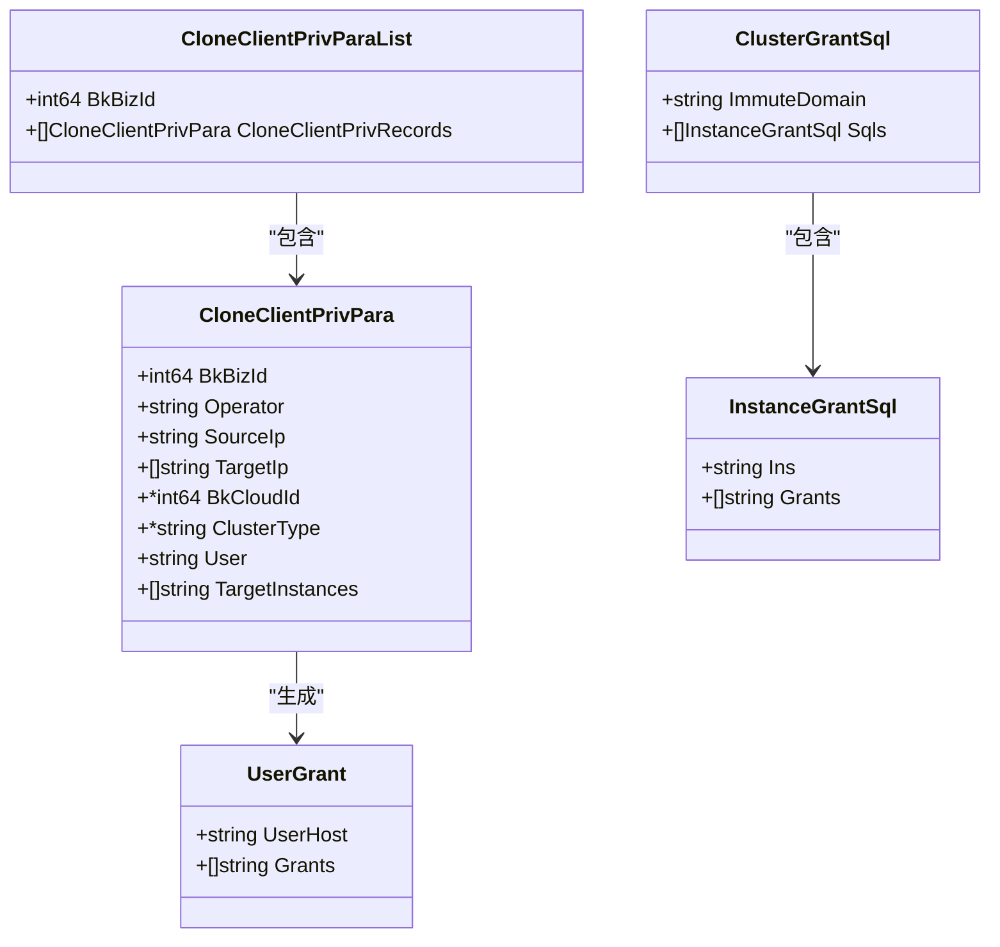
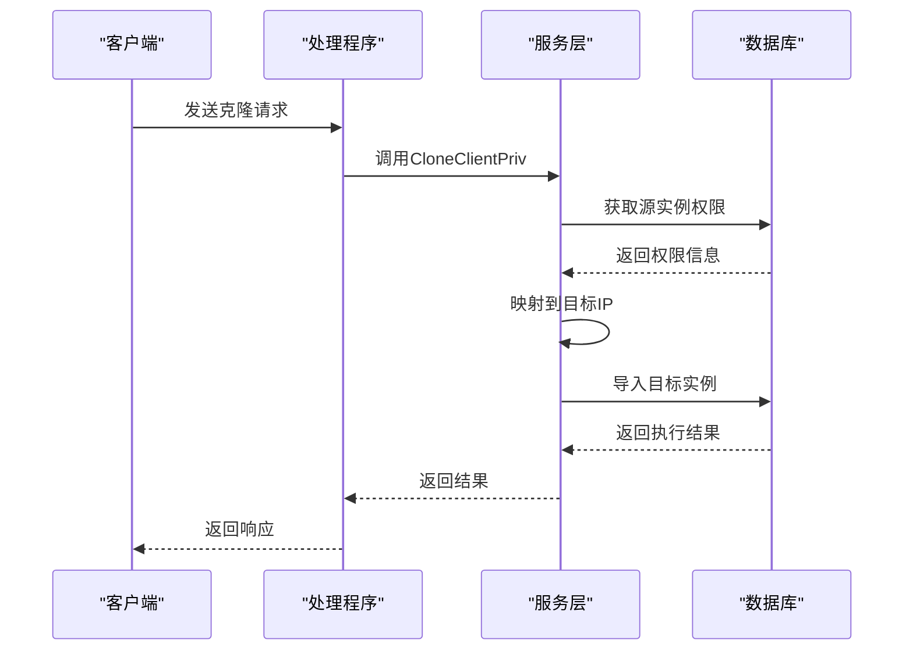
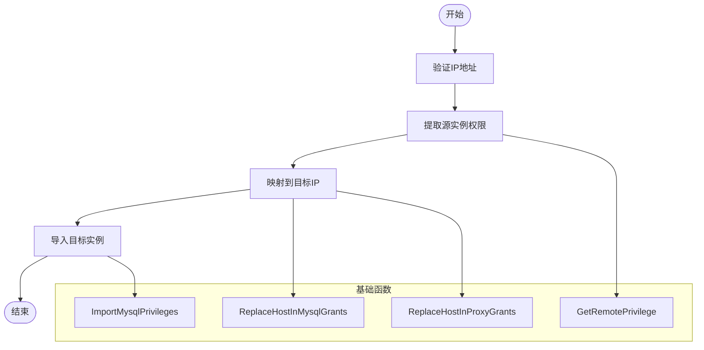
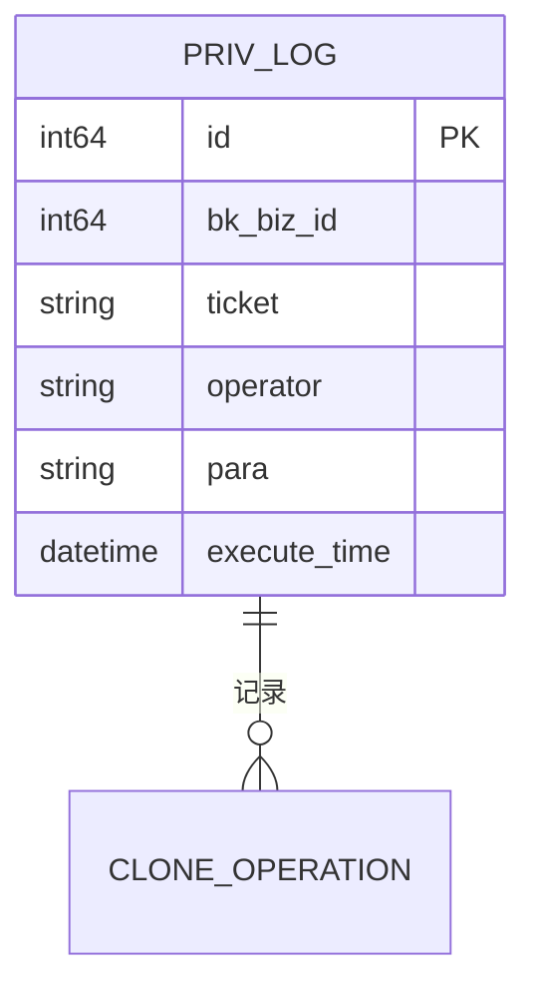

# 权限克隆

<cite>
**本文档引用的文件**   
- [clone_client_priv.go](file://dbm-services/mysql/db-priv/service/clone_client_priv.go)
- [clone_client_priv_base_func.go](file://dbm-services/mysql/db-priv/service/clone_client_priv_base_func.go)
- [clone_client_priv_object.go](file://dbm-services/mysql/db-priv/service/clone_client_priv_object.go)
- [clone_client_priv_handler.go](file://dbm-services/mysql/db-priv/handler/clone_client_priv.go)
- [account_object.go](file://dbm-services/mysql/db-priv/service/account_object.go)
- [account.go](file://dbm-services/mysql/db-priv/service/account.go)
</cite>

## 目录
1. [权限克隆功能概述](#权限克隆功能概述)
2. [核心组件分析](#核心组件分析)
3. [权限克隆流程详解](#权限克隆流程详解)
4. [基础功能函数分析](#基础功能函数分析)
5. [安全验证与审计日志](#安全验证与审计日志)
6. [跨实例权限迁移案例](#跨实例权限迁移案例)
7. [错误处理与异常情况](#错误处理与异常情况)

## 权限克隆功能概述

权限克隆功能是MySQL数据库管理系统中的重要特性，它允许将源实例的权限配置完整复制到目标实例。该功能主要通过`clone_client_priv.go`文件实现，支持从源实例到目标实例的权限复制，包括账号信息提取、权限映射和目标实例适配。权限克隆不仅简化了数据库管理任务，还确保了权限配置的一致性和安全性。

**Section sources**
- [clone_client_priv.go](file://dbm-services/mysql/db-priv/service/clone_client_priv.go#L1-L359)

## 核心组件分析

权限克隆功能的核心组件包括`CloneClientPrivPara`结构体、`CloneClientPriv`方法以及相关的处理函数。`CloneClientPrivPara`结构体定义了权限克隆所需的参数，包括业务ID、操作员、源IP、目标IP、云区域ID等。`CloneClientPriv`方法是权限克隆的主要执行函数，负责协调整个克隆过程。

**Diagram sources **
- [clone_client_priv_object.go](file://dbm-services/mysql/db-priv/service/clone_client_priv_object.go#L8-L70)

## 权限克隆流程详解

权限克隆流程从客户端发起请求开始，经过预检查、权限提取、权限映射和权限导入四个主要阶段。首先，系统会对输入参数进行验证，确保源IP和目标IP的合法性。然后，从源实例提取权限信息，包括用户账号和授权语句。接着，将提取的权限信息映射到目标实例，替换相应的IP地址。最后，将映射后的权限导入目标实例。

**Diagram sources **
- [clone_client_priv.go](file://dbm-services/mysql/db-priv/service/clone_client_priv.go#L49-L359)
- [clone_client_priv_handler.go](file://dbm-services/mysql/db-priv/handler/clone_client_priv.go#L38-L67)

## 基础功能函数分析

`clone_client_priv_base_func.go`文件提供了权限克隆的基础功能函数，包括权限比对、冲突处理和增量同步。`ReplaceHostInMysqlGrants`函数负责替换MySQL授权语句中的主机名，`ReplaceHostInProxyGrants`函数处理代理白名单的主机名替换。这些函数确保了权限信息在不同实例间的正确映射。

**Diagram sources **
- [clone_client_priv_base_func.go](file://dbm-services/mysql/db-priv/service/clone_client_priv_base_func.go#L17-L66)

## 安全验证与审计日志

系统在权限克隆过程中实施了严格的安全验证机制。`validateIP`函数检查源IP和目标IP的合法性，防止无效或重复的IP地址。同时，系统记录详细的审计日志，包括操作时间、操作员、业务ID和请求参数。`AddPrivLog`函数将这些信息存储到数据库中，便于后续审计和故障排查。

**Diagram sources **
- [account_object.go](file://dbm-services/mysql/db-priv/service/account_object.go#L75-L85)
- [account.go](file://dbm-services/mysql/db-priv/service/account.go#L300-L310)

## 跨实例权限迁移案例

在实际应用中，权限克隆功能常用于数据库实例的迁移和扩展。例如，当需要将一个数据库实例从测试环境迁移到生产环境时，可以使用权限克隆功能快速复制所有权限配置。该过程首先对源实例进行权限提取，然后在目标实例上创建相同的用户账号和权限设置，确保两个实例的权限配置完全一致。

**Section sources**
- [clone_client_priv.go](file://dbm-services/mysql/db-priv/service/clone_client_priv.go#L49-L359)
- [clone_client_priv_base_func.go](file://dbm-services/mysql/db-priv/service/clone_client_priv_base_func.go#L17-L66)

## 错误处理与异常情况

权限克隆过程中可能遇到多种错误情况，系统提供了完善的错误处理机制。`AddError`函数用于收集和记录错误信息，包括实例地址和具体的错误描述。当克隆过程中出现错误时，系统会中断操作并返回详细的错误信息，帮助管理员快速定位和解决问题。

**Section sources**
- [clone_client_priv.go](file://dbm-services/mysql/db-priv/service/clone_client_priv.go#L51-L359)
- [clone_client_priv_base_func.go](file://dbm-services/mysql/db-priv/service/clone_client_priv_base_func.go#L178-L182)