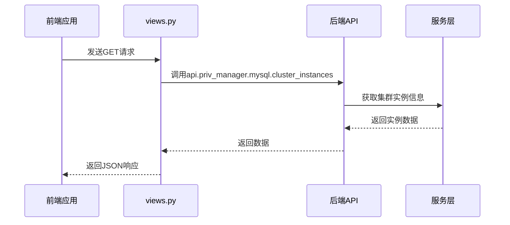
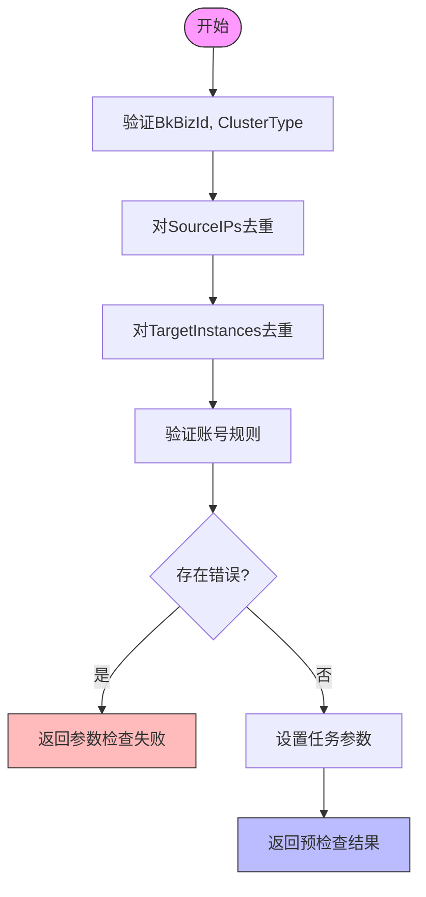
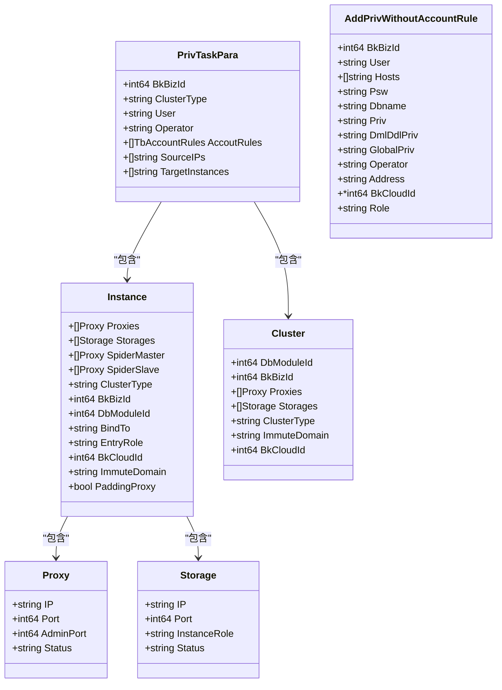
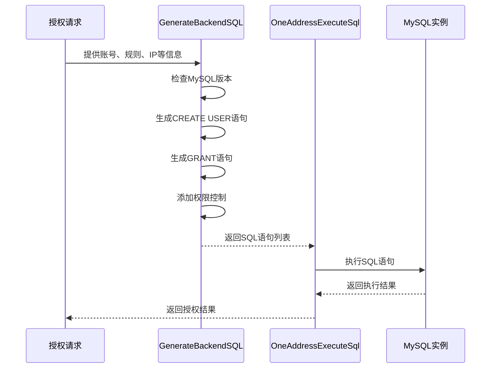
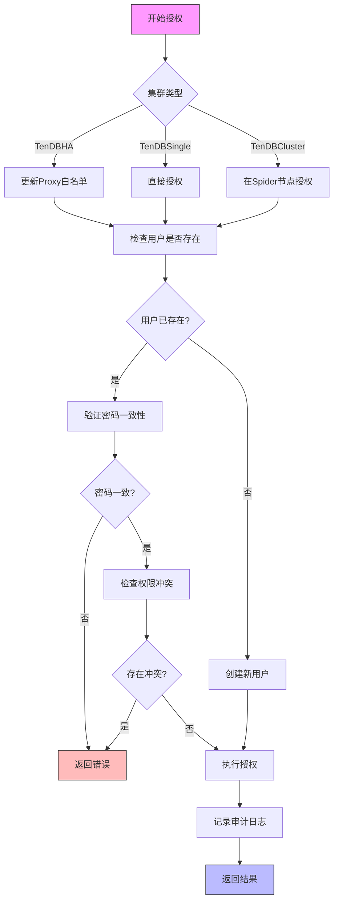

# 权限授权

<cite>
**本文档引用的文件**
- [views.py](file://dbm-ui/backend/db_meta/views/priv_manager/mysql/views.py)
- [add_priv.go](file://dbm-services/mysql/db-priv/handler/add_priv.go)
- [add_priv.go](file://dbm-services/mysql/db-priv/handler/v2/add_priv.go)
- [add_priv.go](file://dbm-services/mysql/db-priv/service/v2/add_priv/add_priv.go)
- [add_priv.go](file://dbm-services/mysql/db-priv/service/add_priv.go)
- [add_priv_base_func.go](file://dbm-services/mysql/db-priv/service/add_priv_base_func.go)
- [add_priv_object.go](file://dbm-services/mysql/db-priv/service/add_priv_object.go)
</cite>

## 目录
1. [引言](#引言)
2. [前端请求处理](#前端请求处理)
3. [核心授权逻辑](#核心授权逻辑)
4. [权限对象结构](#权限对象结构)
5. [SQL语句生成与执行](#sql语句生成与执行)
6. [权限继承与白名单机制](#权限继承与白名单机制)
7. [具体示例](#具体示例)
8. [结论](#结论)

## 引言
本文档详细阐述了MySQL权限授权功能的实现机制。系统通过前后端协作，实现了对MySQL实例的用户权限管理。前端通过API接口接收授权请求，后端服务进行权限验证、SQL语句生成和执行，确保权限分配的安全性和准确性。

## 前端请求处理

前端通过`views.py`文件中的视图函数接收授权请求。这些视图函数使用Django REST framework和Swagger进行API定义和文档化。当接收到HTTP GET请求时，视图函数会解析请求参数，调用后端服务的API接口，并返回JSON格式的响应。

视图函数主要处理不同类型的MySQL集群实例查询，包括TendbSingle、TendbHA和TendbCluster等集群类型。每个视图函数都通过`api.priv_manager.mysql.cluster_instances`模块调用相应的后端服务，获取集群实例信息。

**Diagram sources**
- [views.py](file://dbm-ui/backend/db_meta/views/priv_manager/mysql/views.py#L1-L126)

**Section sources**
- [views.py](file://dbm-ui/backend/db_meta/views/priv_manager/mysql/views.py#L1-L126)

## 核心授权逻辑

核心授权逻辑主要在`add_priv.go`文件中实现。系统提供了多个授权接口，包括预检查授权、正式授权和不使用账号规则的授权。这些接口通过Gin框架处理HTTP请求，解析JSON格式的请求体，并进行相应的业务逻辑处理。

授权流程首先进行参数验证，确保业务ID、集群类型、用户信息等必要参数存在且有效。然后进行IP地址和目标实例的去重处理，确保授权操作的准确性。系统还提供了针对SQL Server的特殊授权逻辑，但在MySQL场景下会提示使用v2版本的授权接口。

**Diagram sources**
- [add_priv.go](file://dbm-services/mysql/db-priv/handler/add_priv.go#L1-L153)
- [add_priv.go](file://dbm-services/mysql/db-priv/service/add_priv.go#L1-L95)

**Section sources**
- [add_priv.go](file://dbm-services/mysql/db-priv/handler/add_priv.go#L1-L153)
- [add_priv.go](file://dbm-services/mysql/db-priv/service/add_priv.go#L1-L95)

## 权限对象结构

`add_priv_object.go`文件定义了权限授权功能中使用的核心数据结构。这些结构体用于表示授权任务的参数、数据库实例信息、集群信息以及账号规则等。

`PrivTaskPara`结构体是授权任务的主要参数容器，包含业务ID、集群类型、用户名、操作员、账号规则列表、源IP列表和目标实例列表等字段。这些字段通过JSON标签进行序列化和反序列化，确保与前端请求格式的兼容性。

其他重要结构体包括`Instance`（表示数据库实例）、`Cluster`（表示数据库集群）、`Proxy`（表示代理实例）和`Storage`（表示存储节点）。这些结构体共同构成了系统对数据库拓扑结构的抽象表示。

**Diagram sources**
- [add_priv_object.go](file://dbm-services/mysql/db-priv/service/add_priv_object.go#L1-L105)

**Section sources**
- [add_priv_object.go](file://dbm-services/mysql/db-priv/service/add_priv_object.go#L1-L105)

## SQL语句生成与执行

SQL语句的生成和执行是权限授权功能的核心环节。系统通过`GenerateBackendSQL`函数生成MySQL授权语句，该函数会根据MySQL版本、集群类型和授权规则生成相应的GRANT语句。

在生成SQL语句时，系统会考虑多种因素：对于MySQL 8.0及以上版本，使用`CREATE USER IF NOT EXISTS`语法；对于备库域名，只授予查询类权限；对于包含连接日志数据库的授权，会额外添加INSERT权限以避免登录失败的问题。

生成的SQL语句会在执行前关闭二进制日志记录（`SET SESSION sql_log_bin=0`），以避免在主从复制环境中产生问题。执行完成后，再重新开启二进制日志记录。这种设计可以防止授权操作被复制到从库，从而避免潜在的权限冲突。

**Diagram sources**
- [add_priv_base_func.go](file://dbm-services/mysql/db-priv/service/add_priv_base_func.go#L1-L612)

**Section sources**
- [add_priv_base_func.go](file://dbm-services/mysql/db-priv/service/add_priv_base_func.go#L1-L612)

## 权限继承与白名单机制

系统实现了复杂的权限继承和白名单机制。在TenDBHA集群中，代理节点（Proxy）需要维护白名单，允许特定的用户从特定的IP地址连接。白名单的更新通过`GenerateProxyPrivilege`函数生成`refresh_users`命令来实现。

权限继承机制确保了用户在不同数据库实例间的一致性访问权限。系统会检查用户是否已存在，如果存在则验证密码是否一致。对于已存在的用户，系统会检查新旧权限是否存在冲突，特别是数据库授权范围的包含关系，以避免权限不确定性问题。

白名单机制在授权流程中作为前置步骤执行，确保所有代理节点都已更新白名单后，才进行后端数据库的权限授予。这种设计保证了授权操作的原子性和一致性。

**Section sources**
- [add_priv_base_func.go](file://dbm-services/mysql/db-priv/service/add_priv_base_func.go#L1-L612)

## 具体示例

为MySQL实例添加用户权限的具体示例如下：首先通过前端界面或API发送授权请求，请求中包含业务ID、集群类型、用户名、源IP列表、目标实例和账号规则等信息。

后端服务接收到请求后，先进行预检查（AddPrivDryRun），验证所有参数的有效性。预检查通过后，执行正式授权操作。系统会为每个目标实例获取其拓扑信息，然后根据实例类型（TenDBSingle、TenDBHA或TenDBCluster）采用不同的授权策略。

对于TenDBHA集群，系统会先更新所有Proxy节点的白名单，然后在主库和从库上分别执行授权操作。对于TenDBCluster集群，授权操作集中在Spider节点上进行。所有授权操作都会记录到审计日志中，便于后续追踪和审计。

**Section sources**
- [add_priv.go](file://dbm-services/mysql/db-priv/handler/v2/add_priv.go#L1-L39)
- [add_priv.go](file://dbm-services/mysql/db-priv/service/v2/add_priv/add_priv.go#L1-L198)

## 结论

MySQL权限授权功能通过前后端协作实现了安全、可靠的权限管理机制。系统通过严格的参数验证、智能的SQL语句生成、完善的权限冲突检测和详细的审计日志记录，确保了数据库权限分配的准确性和安全性。该机制支持多种集群类型和复杂的授权场景，为数据库管理提供了强大的权限控制能力。