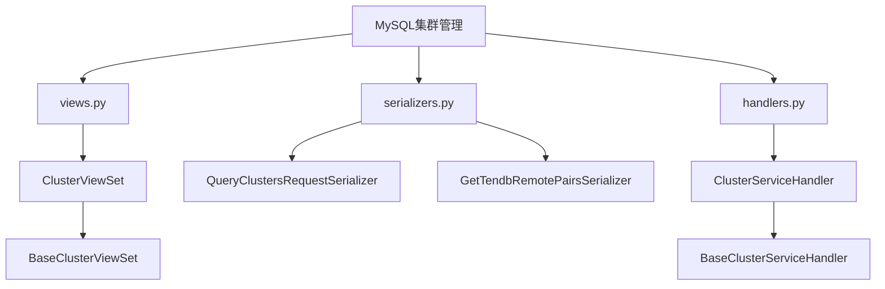
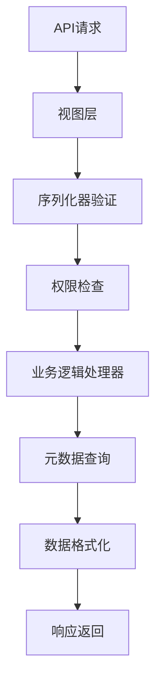
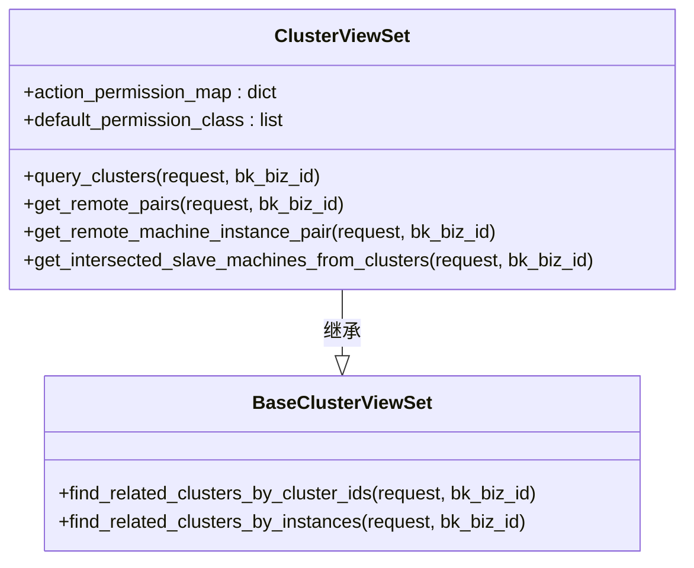
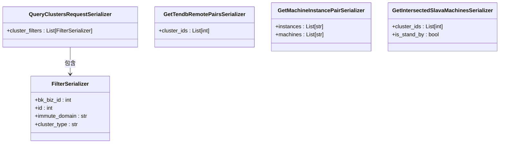
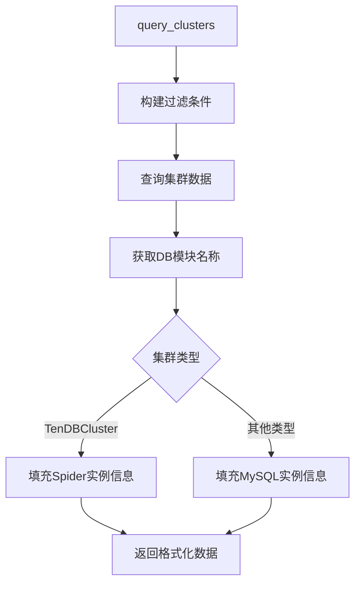
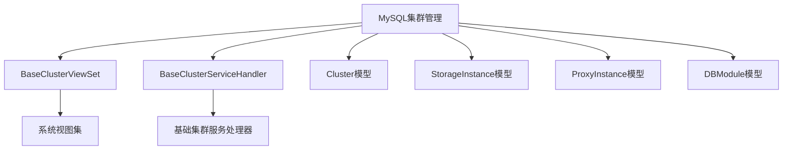

# MySQL集群管理

<cite>
**本文档引用的文件**   
- [views.py](file://dbm-ui/backend/db_services/mysql/cluster/views.py)
- [serializers.py](file://dbm-ui/backend/db_services/mysql/cluster/serializers.py)
- [handlers.py](file://dbm-ui/backend/db_services/mysql/cluster/handlers.py)
- [dataclass.py](file://dbm-ui/backend/db_services/mysql/dataclass.py)
- [cluster/views.py](file://dbm-ui/backend/db_services/dbbase/cluster/views.py)
</cite>

## 目录
1. [项目结构](#项目结构)
2. [核心组件](#核心组件)
3. [架构概述](#架构概述)
4. [详细组件分析](#详细组件分析)
5. [依赖分析](#依赖分析)

## 项目结构

MySQL集群管理功能主要位于`dbm-ui/backend/db_services/mysql/cluster/`目录下，包含视图、序列化器和处理器三个核心组件。该功能通过继承基础集群视图类实现，形成了清晰的分层架构。

**图示来源**
- [views.py](file://dbm-ui/backend/db_services/mysql/cluster/views.py)
- [serializers.py](file://dbm-ui/backend/db_services/mysql/cluster/serializers.py)
- [handlers.py](file://dbm-ui/backend/db_services/mysql/cluster/handlers.py)

## 核心组件

MySQL集群管理功能由三个核心组件构成：视图层（views.py）负责处理API请求，序列化器（serializers.py）负责数据验证和序列化，处理器（handlers.py）负责业务逻辑处理。这些组件通过清晰的职责分离，实现了集群创建、查询和管理等功能。

**组件来源**
- [views.py](file://dbm-ui/backend/db_services/mysql/cluster/views.py#L1-L91)
- [serializers.py](file://dbm-ui/backend/db_services/mysql/cluster/serializers.py#L1-L91)
- [handlers.py](file://dbm-ui/backend/db_services/mysql/cluster/handlers.py#L1-L180)

## 架构概述

MySQL集群管理采用分层架构设计，从API请求到后端服务调用的流程清晰。视图层接收请求后，通过序列化器进行参数验证，然后调用处理器执行业务逻辑，最终返回结果。这种设计实现了关注点分离，提高了代码的可维护性和可测试性。

**图示来源**
- [views.py](file://dbm-ui/backend/db_services/mysql/cluster/views.py#L16-L91)
- [serializers.py](file://dbm-ui/backend/db_services/mysql/cluster/serializers.py#L1-L91)
- [handlers.py](file://dbm-ui/backend/db_services/mysql/cluster/handlers.py#L1-L180)

## 详细组件分析

### 视图组件分析

MySQL集群视图组件继承自基础集群视图类，通过Django REST framework的视图集实现API端点。每个API方法都使用装饰器配置了Swagger文档、请求体和响应格式，确保了API的可发现性和一致性。

**图示来源**
- [views.py](file://dbm-ui/backend/db_services/mysql/cluster/views.py#L36-L91)
- [cluster/views.py](file://dbm-ui/backend/db_services/dbbase/cluster/views.py#L31-L60)

### 序列化器组件分析

序列化器组件负责API请求参数的验证和响应数据的序列化。每个API方法都有对应的请求序列化器和响应序列化器，确保了数据的一致性和完整性。序列化器还包含了Swagger文档的示例数据，便于API的使用和测试。

**图示来源**
- [serializers.py](file://dbm-ui/backend/db_services/mysql/cluster/serializers.py#L27-L91)

### 处理器组件分析

处理器组件包含了MySQL集群管理的核心业务逻辑。它通过查询数据库元数据模型获取集群信息，并根据不同的集群类型（TenDBSingle、TenDBHA、TenDBCluster）进行相应的数据处理和格式化。

**图示来源**
- [handlers.py](file://dbm-ui/backend/db_services/mysql/cluster/handlers.py#L25-L180)

## 依赖分析

MySQL集群管理功能依赖于多个基础组件和数据模型。它继承了基础集群视图和处理器的功能，同时依赖于数据库元数据模型来获取集群、实例和代理的信息。

**图示来源**
- [views.py](file://dbm-ui/backend/db_services/mysql/cluster/views.py#L18-L19)
- [handlers.py](file://dbm-ui/backend/db_services/mysql/cluster/handlers.py#L20-L23)
- [handlers.py](file://dbm-ui/backend/db_services/mysql/cluster/handlers.py#L19-L20)