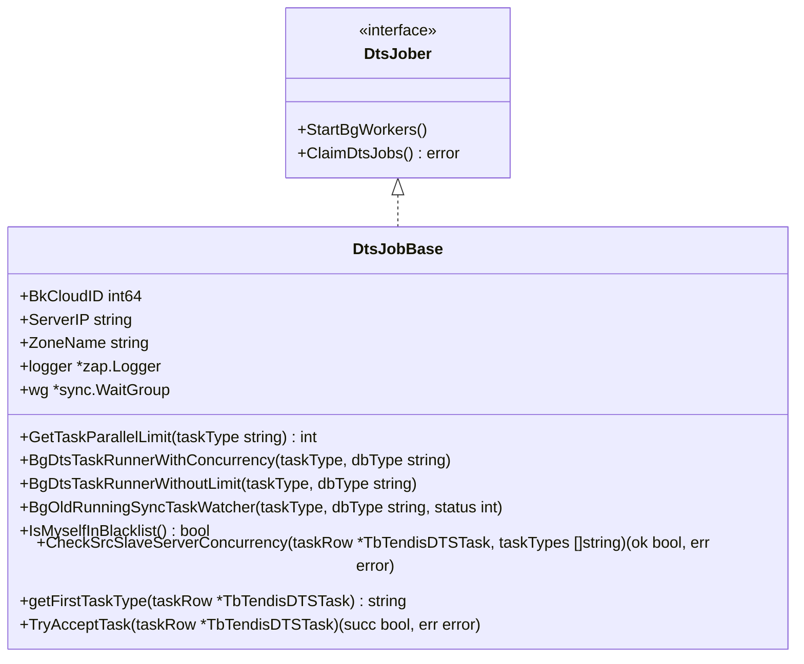
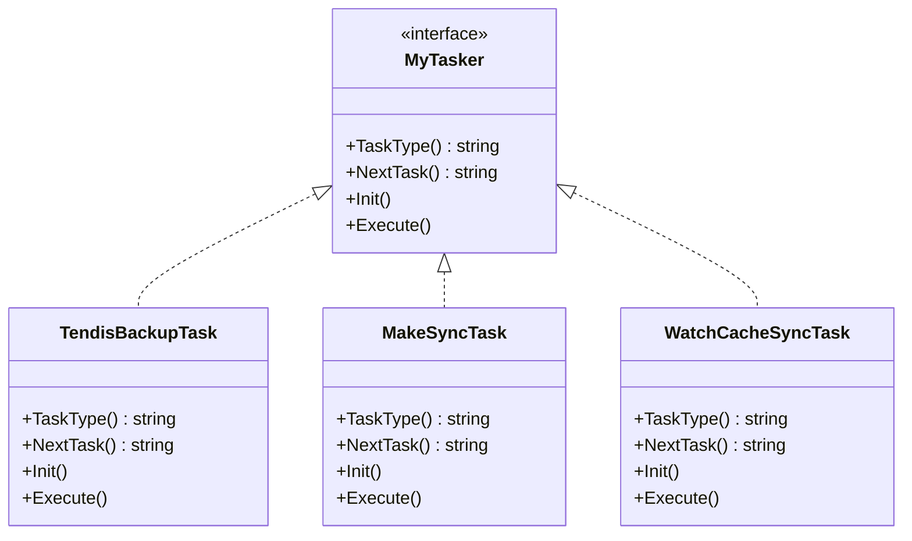
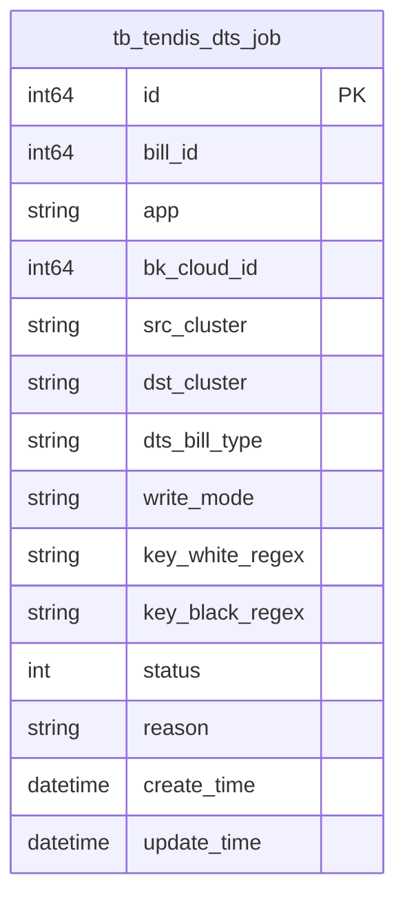
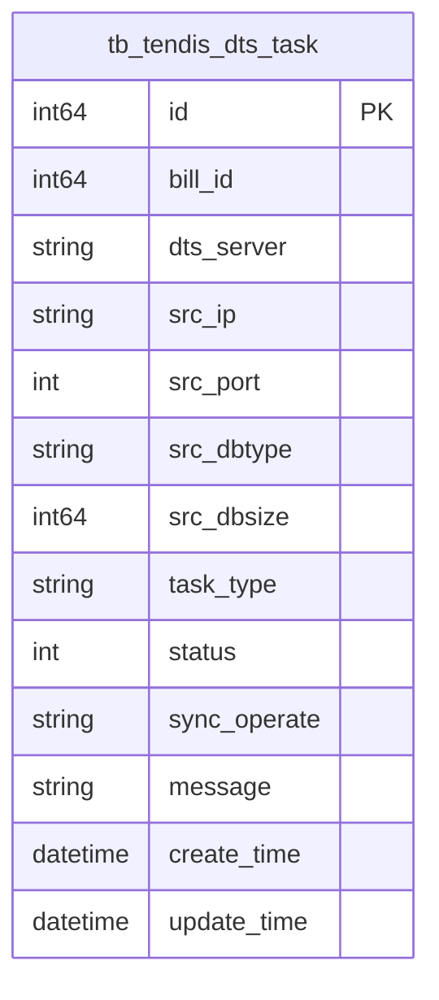

# DTS任务管理

<cite>
**本文档引用文件**  
- [dtsJob.go](file://dbm-services/redis/redis-dts/pkg/dtsJob/dtsJob.go)
- [base.go](file://dbm-services/redis/redis-dts/pkg/dtsJob/base.go)
- [factory.go](file://dbm-services/redis/redis-dts/pkg/dtsTask/factory/factory.go)
- [tendisDtsJob.go](file://dbm-services/redis/redis-dts/models/mysql/tendisdb/tendisDtsJob.go)
- [tendisDtsTask.go](file://dbm-services/redis/redis-dts/models/mysql/tendisdb/tendisDtsTask.go)
- [dtsRemote.go](file://dbm-services/redis/redis-dts/pkg/scrdbclient/dtsRemote.go)
- [constvar.go](file://dbm-services/redis/redis-dts/pkg/constvar/constvar.go)
- [dts.go](file://dbm-services/redis/db-tools/dbactuator/pkg/consts/dts.go)
</cite>

## 目录
1. [引言](#引言)
2. [DTS任务全生命周期管理](#dts任务全生命周期管理)
3. [dtsJob与dtsTask模块设计](#dtsjob与dtstask模块设计)
4. [任务元数据持久化结构](#任务元数据持久化结构)
5. [任务工厂模式实现](#任务工厂模式实现)
6. [任务状态监控与心跳机制](#任务状态监控与心跳机制)
7. [结论](#结论)

## 引言

DTS（Data Transfer Service）是蓝鲸DBM系统中用于Redis数据迁移与同步的核心组件。本文档详细阐述DTS任务的全生命周期管理机制，包括任务创建、状态流转、调度执行与终止回收。重点分析`dtsJob`和`dtsTask`模块的设计模式与实现逻辑，解释任务元数据在MySQL中的持久化结构，结合代码说明任务工厂模式的实现方式，以及任务状态监控与心跳上报机制，确保任务执行的可靠性与可观测性。

## DTS任务全生命周期管理

DTS任务的生命周期始于任务创建，经历调度、执行、状态流转，最终完成或终止回收。整个流程由`dtsJob`作为任务调度单元，`dtsTask`作为具体执行单元协同完成。

任务创建由外部系统（如DBM前端）发起，通过API调用将任务信息写入MySQL数据库。`dtsJob`模块负责周期性地从数据库中扫描待执行的任务，并通过分布式锁机制（`DtsLockKey`）确保任务被唯一调度。任务调度成功后，`dtsJob`会根据任务类型调用`dtsTask`工厂创建具体的执行任务。

任务执行过程中，`dtsTask`会更新其状态（`Status`字段）和进度信息。系统通过`BgDtsTaskRunnerWithConcurrency`和`BgDtsTaskRunnerWithoutLimit`等后台协程，根据任务类型（如备份、增量同步）采用不同的并发控制策略执行任务。对于长时间运行的增量同步任务，系统还提供了`BgOldRunningSyncTaskWatcher`机制，确保在DTS服务重启后能继续监控已存在的同步任务。

当任务完成或因错误终止时，其状态会被更新，相关资源（如网络连接、临时文件）会被回收。用户可通过强制终止操作（`ForceKillTaskTodo`）中断正在运行的任务。

**Section sources**
- [base.go](file://dbm-services/redis/redis-dts/pkg/dtsJob/base.go#L23-L314)
- [tendisDtsTask.go](file://dbm-services/redis/redis-dts/models/mysql/tendisdb/tendisDtsTask.go#L92-L103)

## dtsJob与dtsTask模块设计

`dtsJob`和`dtsTask`模块采用了典型的“作业-任务”分层设计模式，实现了调度逻辑与执行逻辑的解耦。

### dtsJob模块

`dtsJob`模块是任务调度的核心，其基类`DtsJobBase`定义了调度器的基本行为。该模块通过`ClaimDtsJobs`方法尝试认领任务，利用`scrdbclient`包提供的`DtsLockKey`接口实现分布式锁，防止多个DTS服务实例同时调度同一任务。



**Diagram sources**
- [dtsJob.go](file://dbm-services/redis/redis-dts/pkg/dtsJob/dtsJob.go#L23-L27)
- [base.go](file://dbm-services/redis/redis-dts/pkg/dtsJob/base.go#L29-L314)

### dtsTask模块

`dtsTask`模块是任务执行的载体，每个具体的迁移或同步操作（如备份、数据校验）都由一个`dtsTask`实例完成。该模块定义了`MyTasker`接口，规范了任务的通用行为，包括`Init`、`Execute`等方法。



**Diagram sources**
- [factory.go](file://dbm-services/redis/redis-dts/pkg/dtsTask/factory/factory.go#L13-L19)
- [tendisssd.go](file://dbm-services/redis/redis-dts/pkg/dtsTask/tendisssd/tendisssd.go)
- [rediscache.go](file://dbm-services/redis/redis-dts/pkg/dtsTask/rediscache/rediscache.go)

## 任务元数据持久化结构

DTS任务的元数据主要存储在MySQL数据库的两个核心表中：`tb_tendis_dts_job`和`tb_tendis_dts_task`。

### tb_tendis_dts_job 表

该表存储任务的宏观信息，即一个迁移作业（Job）的总体配置。其主要字段包括：

- `bill_id`: 关联的单据ID
- `app`: 业务英文名
- `bk_cloud_id`: 云区域ID
- `src_cluster`: 源集群域名
- `dst_cluster`: 目的集群域名
- `dts_bill_type`: DTS单据类型
- `write_mode`: 写入模式
- `key_white_regex`: Key白名单正则
- `key_black_regex`: Key黑名单正则
- `status`: 作业状态



**Diagram sources**
- [tendisDtsJob.go](file://dbm-services/redis/redis-dts/models/mysql/tendisdb/tendisDtsJob.go#L17-L46)

### tb_tendis_dts_task 表

该表存储任务的详细信息，即一个作业下具体的执行任务（Task）。一个`dts_job`可以包含多个`dts_task`。其主要字段包括：

- `bill_id`: 关联的单据ID
- `dts_server`: 执行任务的DTS服务器IP
- `src_ip`: 源实例IP
- `src_port`: 源实例端口
- `src_dbtype`: 源实例数据库类型
- `src_dbsize`: 源实例数据量大小
- `task_type`: 任务类型（如`TendisBackupTaskType`）
- `status`: 任务状态（0:未开始, 1:执行中, 2:完成, -1:发生错误）
- `sync_operate`: 同步操作（如暂停、恢复、强制终止）
- `message`: 任务执行信息



**Diagram sources**
- [tendisDtsTask.go](file://dbm-services/redis/redis-dts/models/mysql/tendisdb/tendisDtsTask.go#L26-L72)

## 任务工厂模式实现

DTS系统通过工厂模式实现了不同类型任务的动态创建，核心实现在`pkg/dtsTask/factory/factory.go`文件中。

### 工厂接口与实现

系统定义了`MyTasker`接口，所有具体任务类型都必须实现此接口。`MyTendisDtsTaskFactory`函数作为任务工厂，接收一个`TbTendisDTSTask`数据库记录，根据其`TaskType`字段的值，返回对应的具体任务实例。

```go
// MyTasker task接口
type MyTasker interface {
    TaskType() string
    NextTask() string
    Init()
    Execute()
}

// MyTendisDtsTaskFactory task工厂
func MyTendisDtsTaskFactory(taskRow *tendisdb.TbTendisDTSTask) MyTasker {
    if taskRow.TaskType == (&tendisssd.TendisBackupTask{}).TaskType() {
        return tendisssd.NewTendisBackupTask(taskRow)
    } else if taskRow.TaskType == (&tendisssd.MakeSyncTask{}).TaskType() {
        return tendisssd.NewMakeSyncTask(taskRow)
    } else if taskRow.TaskType == (&rediscache.MakeCacheSyncTask{}).TaskType() {
        return rediscache.NewMakeCacheSyncTask(taskRow)
    }
    // ... 其他任务类型
    return nil
}
```

这种设计模式的优点在于：
1. **解耦**：任务调度器（`dtsJob`）无需知道具体任务的实现细节，只需通过工厂获取任务实例。
2. **扩展性**：新增任务类型时，只需实现`MyTasker`接口并修改工厂函数，无需修改调度器代码。
3. **灵活性**：任务类型由数据库字段动态决定，支持灵活配置。

**Section sources**
- [factory.go](file://dbm-services/redis/redis-dts/pkg/dtsTask/factory/factory.go#L13-L47)

## 任务状态监控与心跳机制

为确保任务执行的可靠性与可观测性，DTS系统设计了完善的状态监控与心跳上报机制。

### 状态监控

任务状态通过`tb_tendis_dts_task`表的`status`字段进行持久化。系统通过`GetLast30DaysToExecuteTasks`等API定期从数据库拉取待执行或正在执行的任务，并根据状态进行相应的处理。例如，`BgDtsTaskRunnerWithConcurrency`会跳过状态不为0（未开始）或任务类型不匹配的任务。

### 心跳与健康检查

系统通过`IsMyselfInBlacklist`机制实现DTS服务的健康检查。每个DTS服务在启动时会调用`scrdbclient`的`IsDtsServerInBlachList`接口，检查自身IP是否在黑名单中。如果服务异常，可将其加入黑名单，防止其继续调度新任务。

此外，`CheckSrcSlaveServerConcurrency`方法在调度任务前会检查源Slave机器上正在运行的迁移任务数，防止因并发过高而影响源库性能，这也是一种间接的资源健康监控。

### 错误处理与恢复

任务执行过程中发生的错误会被记录在`message`字段中。对于可重试的错误，系统会根据`RetryTimes`字段进行重试。`BgOldRunningSyncTaskWatcher`机制确保了在DTS服务重启后，已存在的增量同步任务能够被正确恢复和监控，避免了任务丢失。

**Section sources**
- [base.go](file://dbm-services/redis/redis-dts/pkg/dtsJob/base.go#L235-L242)
- [dtsRemote.go](file://dbm-services/redis/redis-dts/pkg/scrdbclient/dtsRemote.go#L50-L62)
- [tendisDtsTask.go](file://dbm-services/redis/redis-dts/models/mysql/tendisdb/tendisDtsTask.go#L134-L177)

## 结论

DTS任务管理系统通过`dtsJob`和`dtsTask`的分层设计，实现了任务调度与执行的清晰分离。基于MySQL的元数据持久化结构保证了任务状态的可靠存储。任务工厂模式的应用使得系统具有良好的扩展性和灵活性。结合分布式锁、并发控制、健康检查和错误恢复机制，整个系统能够稳定、可靠地执行大规模的数据迁移与同步任务，为数据库运维提供了强有力的支撑。