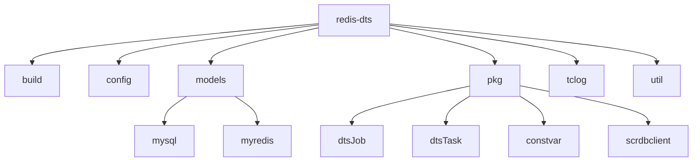
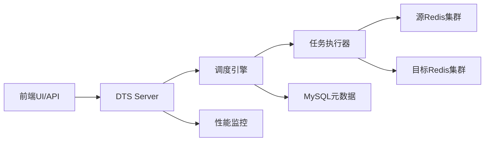
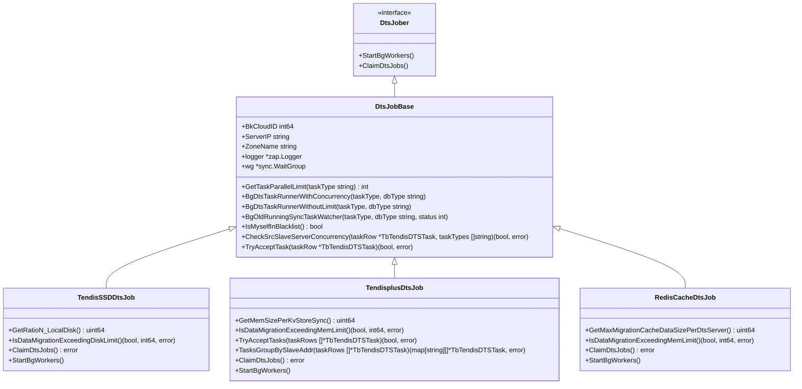
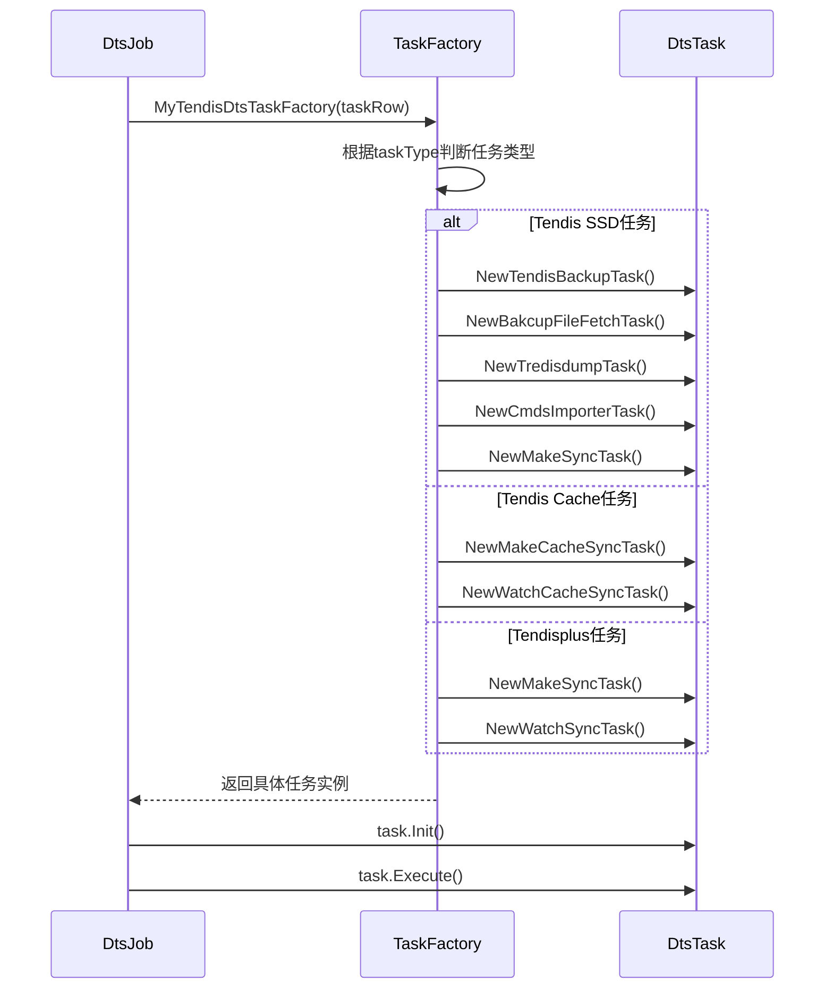
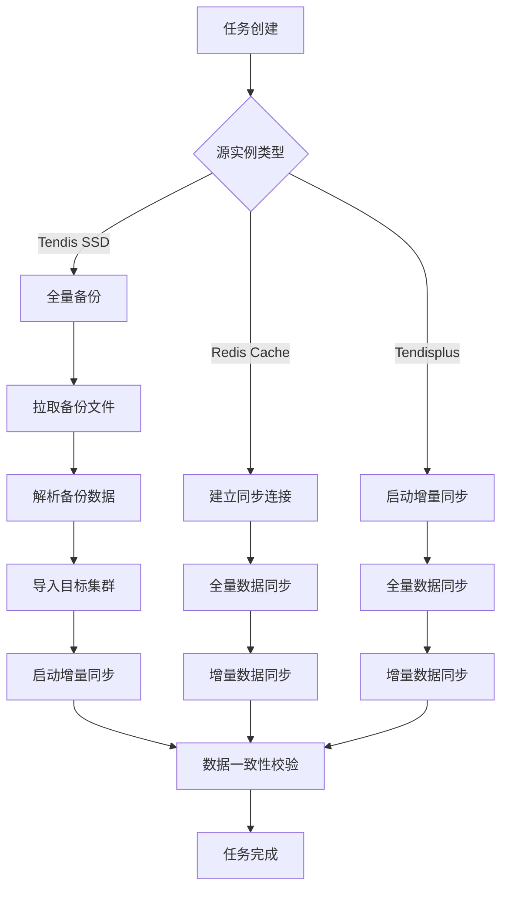
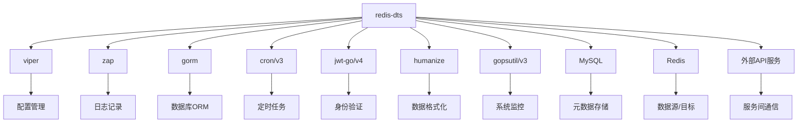

# Redis DTS数据同步

<cite>
**本文档引用文件**   
- [main.go](file://main.go)
- [config.go](file://config/config.go)
- [tendisDtsJob.go](file://models/mysql/tendisdb/tendisDtsJob.go)
- [tendisDtsTask.go](file://models/mysql/tendisdb/tendisDtsTask.go)
- [dtsJob.go](file://pkg/dtsJob/dtsJob.go)
- [base.go](file://pkg/dtsJob/base.go)
- [tendisSSDDtsJob.go](file://pkg/dtsJob/tendisSSDDtsJob.go)
- [tendisplusDtsJob.go](file://pkg/dtsJob/tendisplusDtsJob.go)
- [redisCacheDtsJob.go](file://pkg/dtsJob/redisCacheDtsJob.go)
- [constvar.go](file://pkg/constvar/constvar.go)
- [factory.go](file://pkg/dtsTask/factory/factory.go)
- [scrdbclient.go](file://pkg/scrdbclient/scrdbclient.go)
</cite>

## 目录
1. [简介](#简介)
2. [项目结构](#项目结构)
3. [核心组件](#核心组件)
4. [架构概述](#架构概述)
5. [详细组件分析](#详细组件分析)
6. [依赖分析](#依赖分析)
7. [性能考虑](#性能考虑)
8. [故障排除指南](#故障排除指南)
9. [结论](#结论)

## 简介
本文档深入解析Redis DTS（Data Transmission Service）数据同步功能的实现。详细说明`redis-dts`组件如何实现跨集群、跨版本的Redis数据迁移与同步，包括全量同步、增量同步和断点续传机制。分析DTS任务的生命周期管理，从任务创建、状态监控到异常处理的完整流程。结合`db_services/redis/dts`中的代码，解释DTS与前端UI的交互逻辑，以及如何通过API暴露给外部系统。提供DTS性能调优建议和常见问题排查指南，如网络延迟、数据一致性校验等。

## 项目结构
Redis DTS组件位于`dbm-services/redis/redis-dts`目录下，采用Go语言开发，遵循微服务架构设计。项目结构清晰，主要分为以下几个核心模块：

- **build/**: 包含构建脚本和配置模板
- **config/**: 配置文件处理模块
- **models/**: 数据模型定义，包括MySQL和Redis相关数据结构
- **pkg/**: 核心功能包，包含DTS任务、作业、常量、远程操作等
- **tclog/**: 日志处理模块
- **util/**: 工具函数集合

该结构体现了高内聚、低耦合的设计原则，便于维护和扩展。

**图表来源**
- [main.go](file://main.go#L1-L111)
- [config.go](file://config/config.go#L1-L24)

## 核心组件

Redis DTS的核心组件主要包括DTS作业（DtsJob）和DTS任务（DtsTask）两大模块。DTS作业负责整体任务的调度和资源管理，而DTS任务则负责具体的迁移操作。系统通过`main.go`中的`main()`函数启动，初始化配置、日志和性能监控，并创建不同类型的DTS作业实例。

DTS作业类型包括：
- TendisSSDDtsJob：处理Tendis SSD实例的迁移
- TendisplusDtsJob：处理Tendisplus实例的迁移
- RedisCacheDtsJob：处理Redis缓存实例的迁移
- TendisplusLightningJob：处理Tendisplus闪电迁移

这些作业通过`StartBgWorkers()`方法启动后台工作协程，实现并发处理。

**章节来源**
- [main.go](file://main.go#L23-L99)
- [dtsJob.go](file://pkg/dtsJob/dtsJob.go#L23-L37)

## 架构概述

Redis DTS采用分层架构设计，主要包括以下几个层次：

1. **接入层**：通过HTTP API接收外部请求
2. **调度层**：负责任务的分配和调度
3. **执行层**：具体执行数据迁移任务
4. **存储层**：与MySQL和Redis进行数据交互

系统通过`scrdbclient`模块与外部服务通信，使用JWT进行身份验证，确保通信安全。DTS任务的状态通过MySQL数据库持久化，实现任务的断点续传和状态恢复。

**图表来源**
- [scrdbclient.go](file://pkg/scrdbclient/scrdbclient.go#L38-L50)
- [tendisDtsTask.go](file://models/mysql/tendisdb/tendisDtsTask.go#L26-L72)

## 详细组件分析

### DTS作业分析

DTS作业是Redis DTS的核心调度单元，负责管理任务的生命周期和资源分配。`DtsJobBase`作为基类，提供了任务并发控制、资源检查和状态监控等通用功能。

#### DTS作业类图

**图表来源**
- [dtsJob.go](file://pkg/dtsJob/dtsJob.go#L23-L37)
- [base.go](file://pkg/dtsJob/base.go#L29-L36)
- [tendisSSDDtsJob.go](file://pkg/dtsJob/tendisSSDDtsJob.go#L20-L23)
- [tendisplusDtsJob.go](file://pkg/dtsJob/tendisplusDtsJob.go#L22-L23)
- [redisCacheDtsJob.go](file://pkg/dtsJob/redisCacheDtsJob.go#L19-L20)

### DTS任务分析

DTS任务是具体的数据迁移操作单元，由DTS作业调度执行。任务工厂模式（Factory Pattern）用于创建不同类型的任务实例。

#### 任务工厂序列图

**图表来源**
- [factory.go](file://pkg/dtsTask/factory/factory.go#L21-L47)
- [dtsJob.go](file://pkg/dtsJob/dtsJob.go#L58-L189)

### 数据同步流程分析

Redis DTS的数据同步流程包括全量同步和增量同步两个阶段，通过不同的任务类型实现。

#### 数据同步流程图

**图表来源**
- [constvar.go](file://pkg/constvar/constvar.go#L84-L114)
- [tendisDtsTask.go](file://models/mysql/tendisdb/tendisDtsTask.go#L56-L62)

## 依赖分析

Redis DTS组件依赖于多个外部服务和库，形成了复杂的依赖关系网络。

**图表来源**
- [main.go](file://main.go#L19-L21)
- [scrdbclient.go](file://pkg/scrdbclient/scrdbclient.go#L17-L19)
- [tendisDtsJob.go](file://models/mysql/tendisdb/tendisDtsJob.go#L12-L14)

## 性能考虑

Redis DTS在设计时充分考虑了性能因素，通过多种机制确保系统的高效运行：

1. **资源限制**：根据磁盘和内存使用情况动态调整任务并发度
2. **并发控制**：对源实例的并发迁移任务进行限制，避免影响生产环境
3. **批量处理**：对数据库操作进行批量处理，减少I/O开销
4. **异步执行**：使用goroutine实现任务的异步执行，提高吞吐量

系统通过`osPerf`模块监控主机性能，根据资源使用情况动态调整任务调度策略，确保在不影响系统稳定性的前提下最大化迁移效率。

## 故障排除指南

### 常见问题及解决方案

| 问题现象 | 可能原因 | 解决方案 |
|--------|--------|--------|
| 任务无法启动 | DTS服务器在黑名单中 | 检查服务器是否在黑名单，移除后重试 |
| 迁移速度慢 | 网络带宽不足 | 检查网络连接，优化网络配置 |
| 数据不一致 | 增量同步延迟 | 检查Redis主从复制状态，优化同步参数 |
| 任务超时 | 源实例负载过高 | 降低并发度，错峰执行迁移任务 |
| 磁盘空间不足 | 本地磁盘使用率过高 | 清理临时文件，增加磁盘空间 |

### 监控指标

- **任务状态**：监控任务的执行状态，及时发现异常
- **同步延迟**：监控增量同步的延迟时间
- **资源使用**：监控CPU、内存、磁盘和网络使用情况
- **错误日志**：定期检查错误日志，分析潜在问题

**章节来源**
- [base.go](file://pkg/dtsJob/base.go#L235-L242)
- [tendisSSDDtsJob.go](file://pkg/dtsJob/tendisSSDDtsJob.go#L42-L97)
- [tendisplusDtsJob.go](file://pkg/dtsJob/tendisplusDtsJob.go#L48-L98)

## 结论

Redis DTS是一个功能强大、设计精良的数据同步服务，能够有效支持跨集群、跨版本的Redis数据迁移。通过合理的架构设计和性能优化，系统能够在保证数据一致性的前提下，实现高效的数据同步。未来可以进一步优化任务调度算法，支持更多类型的Redis实例，并增强系统的可扩展性和容错能力。