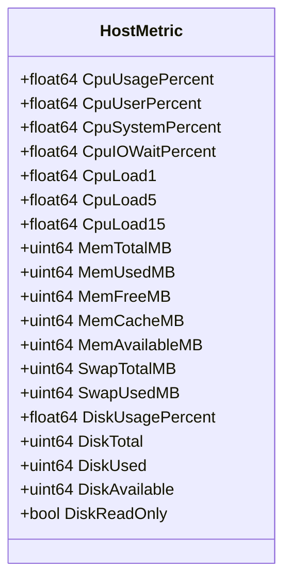
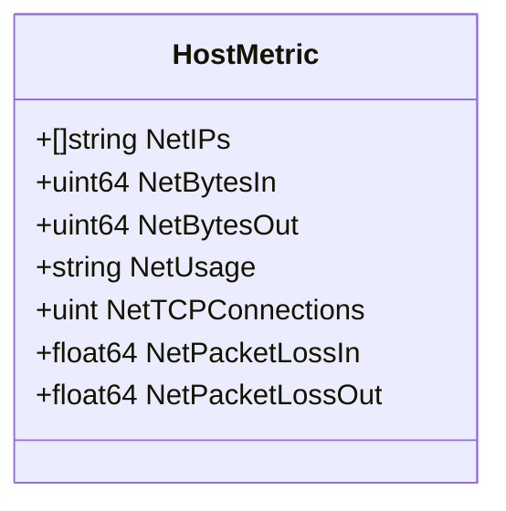
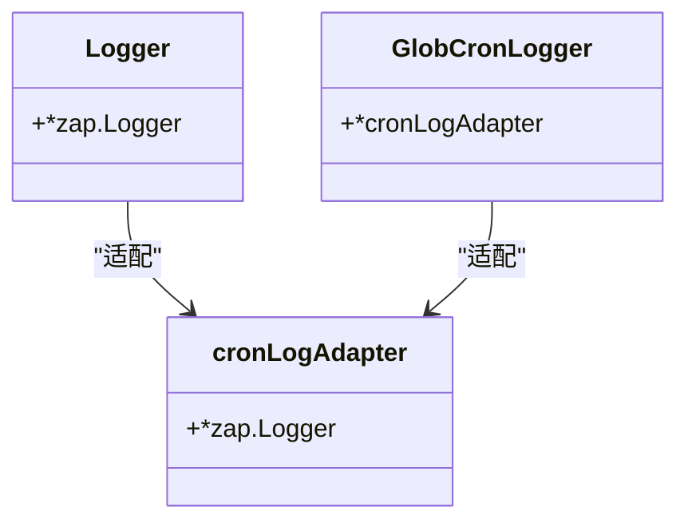
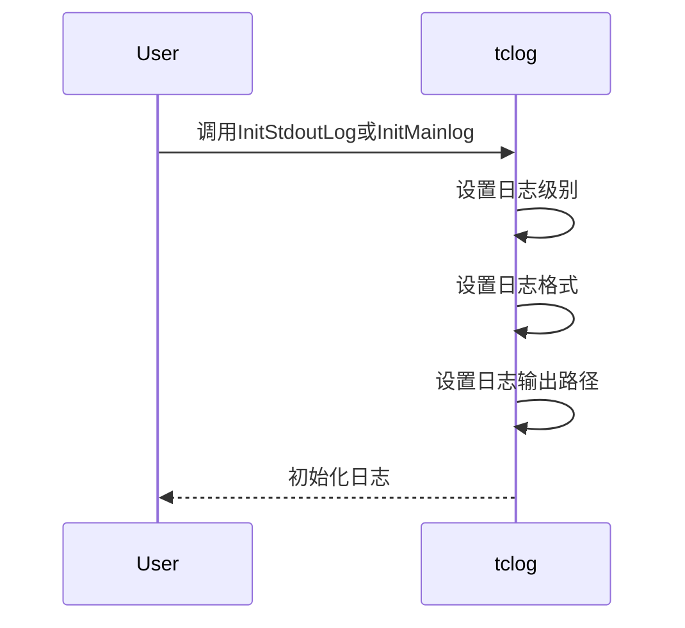
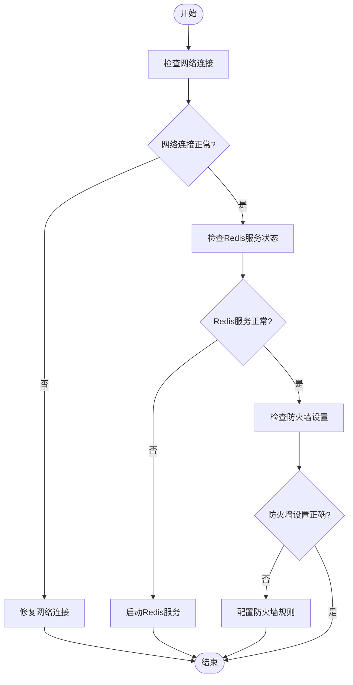
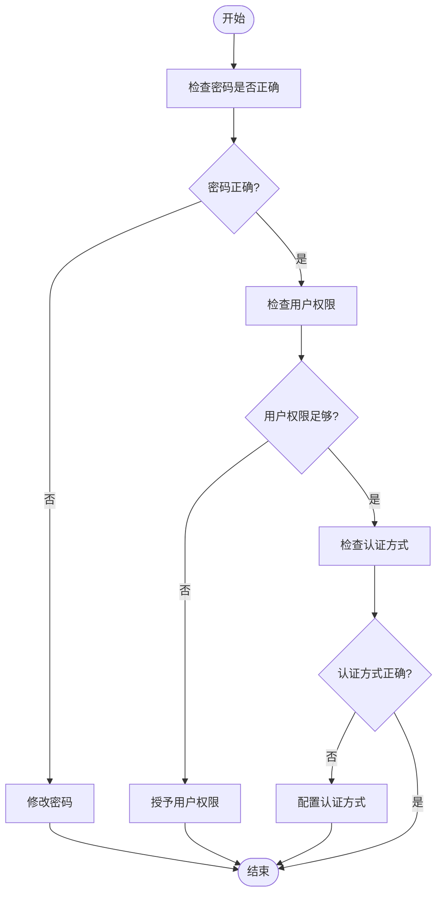
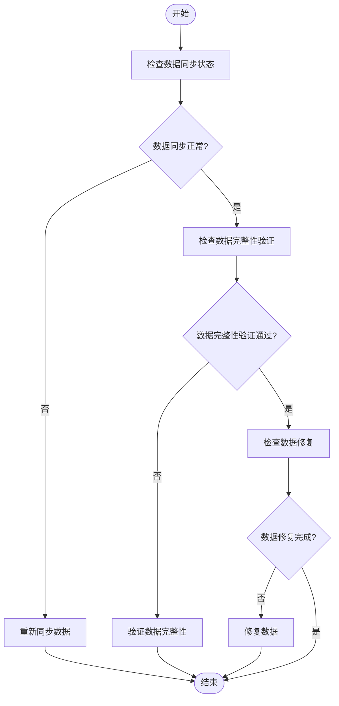
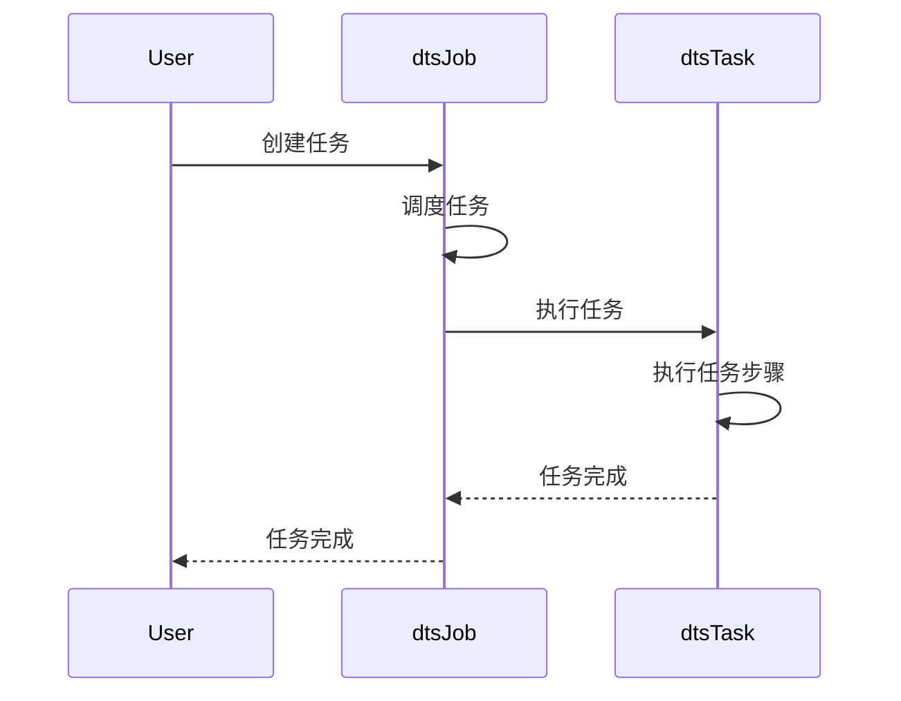
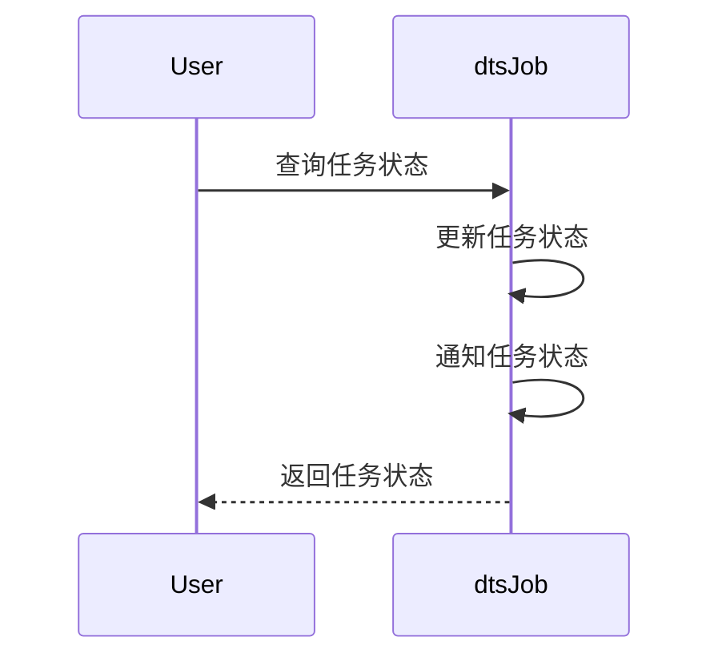

# 性能监控与故障排查

<cite>
**本文档引用的文件**   
- [collector.go](file://dbm-services/common/dbha-v2/internal/probe/harvester/base/collector.go)
- [host_metric.go](file://dbm-services/common/dbha-v2/pkg/storage/haprobe/host_metric.go)
- [metric.go](file://dbm-services/common/go-pubpkg/apm/metric/metric.go)
- [tclog.go](file://dbm-services/redis/redis-dts/tclog/tclog.go)
- [redis_util.go](file://dbm-services/redis/redis-dts/util/redis_util.go)
- [dtsTask.go](file://dbm-services/redis/redis-dts/pkg/dtsTask/dtsTask.go)
- [rediscli.go](file://dbm-services/redis/db-tools/dbactuator/pkg/redisinfo/rediscli.go)
- [dtsJob.go](file://dbm-services/redis/redis-dts/pkg/dtsJob/dtsJob.go)
- [dtsRemote.go](file://dbm-services/redis/redis-dts/pkg/scrdbclient/dtsRemote.go)
</cite>

## 目录
1. [性能监控指标采集方案](#性能监控指标采集方案)
2. [日志记录规范与tclog模块使用](#日志记录规范与tclog模块使用)
3. [常见故障排查步骤与解决方案](#常见故障排查步骤与解决方案)
4. [DTS任务执行流程与状态监控](#dts任务执行流程与状态监控)

## 性能监控指标采集方案

DTS任务执行过程中的性能监控指标采集主要通过`gopsutil`库实现，涵盖了系统资源（CPU、内存、IO）和网络带宽的监控。监控指标的采集在`dbm-services/common/dbha-v2/internal/probe/harvester/base/collector.go`文件中实现。

### 系统资源监控

系统资源监控包括CPU、内存和磁盘的使用情况。这些指标通过`gopsutil`库的相应函数获取，并存储在`HostMetric`结构体中。

**图表来源**
- [host_metric.go](file://dbm-services/common/dbha-v2/pkg/storage/haprobe/host_metric.go#L28-L52)

**本节来源**
- [collector.go](file://dbm-services/common/dbha-v2/internal/probe/harvester/base/collector.go#L49-L187)

### 网络带宽监控

网络带宽监控包括网络接口的输入输出字节数、TCP连接数和网络包丢失率。这些指标通过`gopsutilnet`库的相应函数获取，并存储在`HostMetric`结构体中。

**图表来源**
- [host_metric.go](file://dbm-services/common/dbha-v2/pkg/storage/haprobe/host_metric.go#L54-L61)

**本节来源**
- [collector.go](file://dbm-services/common/dbha-v2/internal/probe/harvester/base/collector.go#L188-L235)

## 日志记录规范与tclog模块使用

日志记录规范与`tclog`模块的使用在`dbm-services/redis/redis-dts/tclog/tclog.go`文件中实现。`tclog`模块提供了日志记录的全局描述符和日志初始化函数。

### 日志记录规范

日志记录规范包括日志级别、日志格式和日志输出路径。日志级别包括`Debug`、`Info`、`Warn`、`Error`和`Fatal`。日志格式为JSON格式，包含时间戳、日志级别、日志消息、调用者和堆栈跟踪。日志输出路径包括标准输出和日志文件。

**图表来源**
- [tclog.go](file://dbm-services/redis/redis-dts/tclog/tclog.go#L17-L20)

**本节来源**
- [tclog.go](file://dbm-services/redis/redis-dts/tclog/tclog.go#L27-L103)

### tclog模块使用

`tclog`模块提供了日志初始化函数`InitStdoutLog`和`InitMainlog`。`InitStdoutLog`函数将所有日志输出到标准输出中，`InitMainlog`函数将所有日志输出到`log/main.log`文件中。

**图表来源**
- [tclog.go](file://dbm-services/redis/redis-dts/tclog/tclog.go#L27-L103)

**本节来源**
- [tclog.go](file://dbm-services/redis/redis-dts/tclog/tclog.go#L27-L103)

## 常见故障排查步骤与解决方案

常见故障排查步骤与解决方案结合`redis_util.go`中的工具函数，提供了源端/目标端连接异常、认证失败、数据不一致等问题的排查方法。

### 源端/目标端连接异常

源端/目标端连接异常的排查步骤包括检查网络连接、检查Redis服务状态和检查防火墙设置。解决方案包括修复网络连接、启动Redis服务和配置防火墙规则。

**本节来源**
- [rediscli.go](file://dbm-services/redis/db-tools/dbactuator/pkg/redisinfo/rediscli.go#L29-L36)
- [redis_util.go](file://dbm-services/redis/redis-dts/util/redis_util.go#L10-L55)

### 认证失败

认证失败的排查步骤包括检查密码是否正确、检查用户权限和检查认证方式。解决方案包括修改密码、授予用户权限和配置认证方式。

**本节来源**
- [rediscli.go](file://dbm-services/redis/db-tools/dbactuator/pkg/redisinfo/rediscli.go#L30-L35)
- [redis_util.go](file://dbm-services/redis/redis-dts/util/redis_util.go#L58-L80)

### 数据不一致

数据不一致的排查步骤包括检查数据同步状态、检查数据完整性验证和检查数据修复。解决方案包括重新同步数据、验证数据完整性和修复数据。

**本节来源**
- [dtsTask.go](file://dbm-services/redis/redis-dts/pkg/dtsTask/dtsTask.go#L325-L360)
- [dtsJob.go](file://dbm-services/redis/redis-dts/pkg/dtsJob/dtsJob.go#L325-L360)

## DTS任务执行流程与状态监控

DTS任务执行流程与状态监控通过`dtsTask`和`dtsJob`模块实现。`dtsTask`模块负责DTS任务的执行，`dtsJob`模块负责DTS任务的状态监控。

### DTS任务执行流程

DTS任务执行流程包括任务创建、任务调度、任务执行和任务完成。任务创建通过`GetJobToScheduleTasks`函数实现，任务调度通过`dtsJob`模块实现，任务执行通过`dtsTask`模块实现，任务完成通过`dtsJob`模块实现。

**图表来源**
- [dtsTask.go](file://dbm-services/redis/redis-dts/pkg/dtsTask/dtsTask.go#L325-L360)
- [dtsJob.go](file://dbm-services/redis/redis-dts/pkg/dtsJob/dtsJob.go#L325-L360)

**本节来源**
- [dtsTask.go](file://dbm-services/redis/redis-dts/pkg/dtsTask/dtsTask.go#L325-L360)
- [dtsJob.go](file://dbm-services/redis/redis-dts/pkg/dtsJob/dtsJob.go#L325-L360)

### DTS任务状态监控

DTS任务状态监控通过`dtsJob`模块实现，包括任务状态查询、任务状态更新和任务状态通知。任务状态查询通过`get_dts_job_detail`函数实现，任务状态更新通过`dtsJob`模块实现，任务状态通知通过`dtsJob`模块实现。

**图表来源**
- [dtsJob.go](file://dbm-services/redis/redis-dts/pkg/dtsJob/dtsJob.go#L325-L360)
- [dtsRemote.go](file://dbm-services/redis/redis-dts/pkg/scrdbclient/dtsRemote.go#L325-L360)

**本节来源**
- [dtsJob.go](file://dbm-services/redis/redis-dts/pkg/dtsJob/dtsJob.go#L325-L360)
- [dtsRemote.go](file://dbm-services/redis/redis-dts/pkg/scrdbclient/dtsRemote.go#L325-L360)