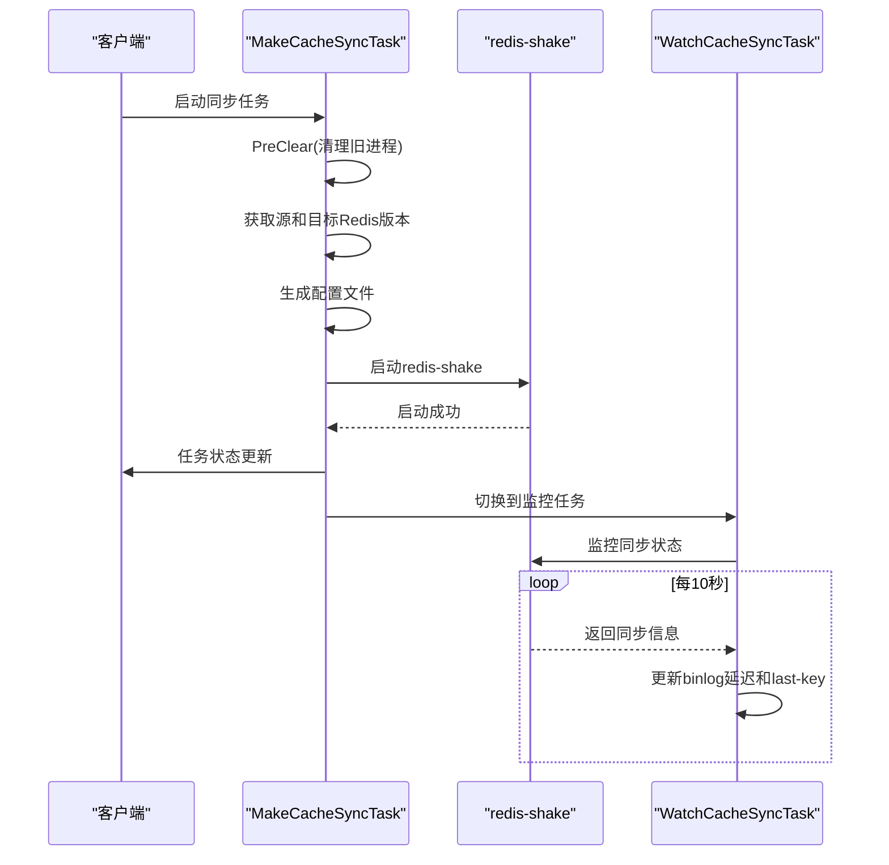
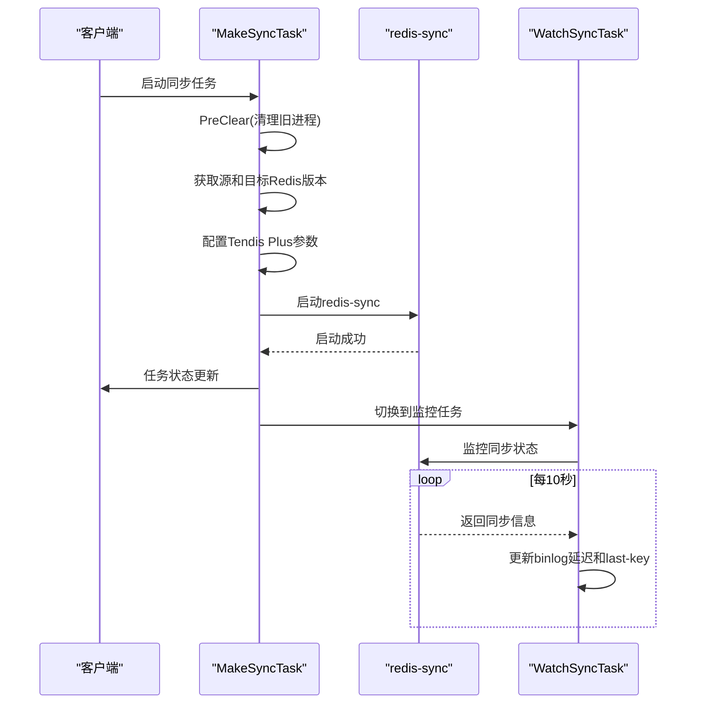
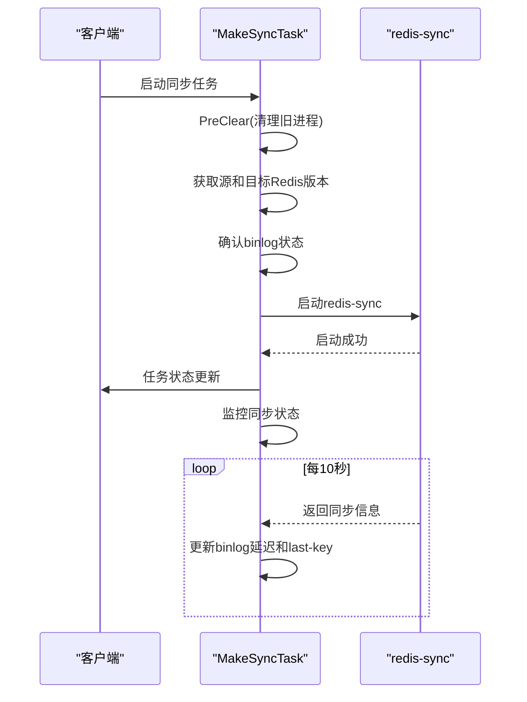
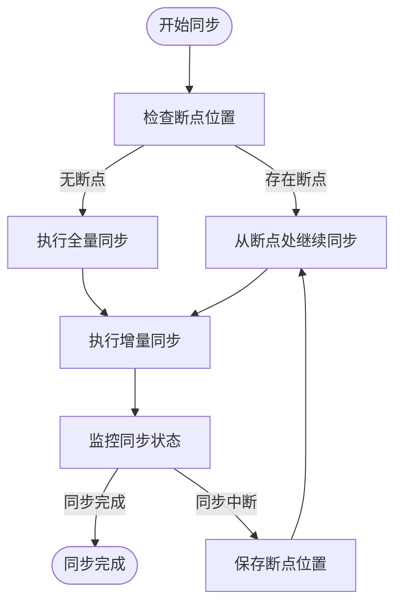

# 数据同步机制

<cite>
**本文档引用文件**   
- [makeCacheSync.go](file://dbm-services/redis/redis-dts/pkg/dtsTask/rediscache/makeCacheSync.go)
- [watchCacheSync.go](file://dbm-services/redis/redis-dts/pkg/dtsTask/rediscache/watchCacheSync.go)
- [makeSync.go](file://dbm-services/redis/redis-dts/pkg/dtsTask/tendisplus/makeSync.go)
- [watchSync.go](file://dbm-services/redis/redis-dts/pkg/dtsTask/tendisplus/watchSync.go)
- [makeSync.go](file://dbm-services/redis/redis-dts/pkg/dtsTask/tendisssd/makeSync.go)
- [config-template.yaml](file://dbm-services/redis/redis-dts/build/config-template.yaml)
- [redis-shake-template.conf](file://dbm-services/redis/redis-dts/build/redis-shake-template.conf)
- [saveSyncSeq.go](file://dbm-services/redis/redis-dts/pkg/dtsTask/saveSyncSeq.go)
</cite>

## 目录
1. [引言](#引言)
2. [数据同步模式概述](#数据同步模式概述)
3. [核心同步逻辑实现](#核心同步逻辑实现)
4. [配置模板与参数调优](#配置模板与参数调优)
5. [断点续传与数据一致性](#断点续传与数据一致性)
6. [总结](#总结)

## 引言
本文档深入解析Redis DTS（Data Transfer Service）支持的多种数据同步模式，涵盖Redis Cache、Tendis Plus和Tendis SSD的全量与增量同步实现。文档详细说明了`makeSync.go`、`watchSync.go`等核心同步逻辑如何基于`redis-shake`和自研工具`redis-sync`实现数据迁移。同时，分析了配置模板文件的作用及其在不同场景下的参数调优策略，并解释了断点续传、数据校验与一致性保障的关键技术实现。

## 数据同步模式概述
Redis DTS支持三种主要的数据存储类型：Redis Cache、Tendis Plus和Tendis SSD。每种类型都有其特定的同步机制，以适应不同的数据模型和性能需求。

- **Redis Cache**：基于开源Redis，使用`redis-shake`工具进行数据同步。支持全量同步和增量同步，适用于标准的键值存储场景。
- **Tendis Plus**：一种增强型的Redis存储，支持更复杂的数据结构。使用自研的`redis-sync`工具进行同步，能够处理大规模数据迁移。
- **Tendis SSD**：基于SSD的持久化存储，适用于需要高吞吐量和低延迟的场景。同样使用`redis-sync`工具，但针对SSD特性进行了优化。

每种模式都通过全量同步和增量同步相结合的方式，确保数据的一致性和完整性。

**Section sources**
- [makeCacheSync.go](file://dbm-services/redis/redis-dts/pkg/dtsTask/rediscache/makeCacheSync.go#L27-L41)
- [makeSync.go](file://dbm-services/redis/redis-dts/pkg/dtsTask/tendisplus/makeSync.go#L23-L31)
- [makeSync.go](file://dbm-services/redis/redis-dts/pkg/dtsTask/tendisssd/makeSync.go#L30-L31)

## 核心同步逻辑实现
### Redis Cache同步逻辑
Redis Cache的同步逻辑主要由`makeCacheSync.go`和`watchCacheSync.go`两个文件实现。`makeCacheSync.go`负责启动`redis-shake`进程，而`watchCacheSync.go`则负责监控同步状态。

**Diagram sources**
- [makeCacheSync.go](file://dbm-services/redis/redis-dts/pkg/dtsTask/rediscache/makeCacheSync.go#L101-L179)
- [watchCacheSync.go](file://dbm-services/redis/redis-dts/pkg/dtsTask/rediscache/watchCacheSync.go#L35-L74)

### Tendis Plus同步逻辑
Tendis Plus的同步逻辑由`makeSync.go`和`watchSync.go`实现。`makeSync.go`负责启动`redis-sync`进程，而`watchSync.go`则负责监控同步状态。

**Diagram sources**
- [makeSync.go](file://dbm-services/redis/redis-dts/pkg/dtsTask/tendisplus/makeSync.go#L76-L131)
- [watchSync.go](file://dbm-services/redis/redis-dts/pkg/dtsTask/tendisplus/watchSync.go#L36-L59)

### Tendis SSD同步逻辑
Tendis SSD的同步逻辑由`makeSync.go`实现，主要负责启动`redis-sync`进程并监控同步状态。

**Diagram sources**
- [makeSync.go](file://dbm-services/redis/redis-dts/pkg/dtsTask/tendisssd/makeSync.go#L88-L170)

## 配置模板与参数调优
### 配置模板文件
Redis DTS使用配置模板文件来生成具体的同步配置。主要的配置模板文件包括：

- **config-template.yaml**：全局配置模板，定义了DTS服务的通用参数，如超时时间、并发度、磁盘使用率等。
- **redis-shake-template.conf**：`redis-shake`工具的配置模板，定义了同步过程中的具体参数，如日志级别、并行度、源和目标地址等。

这些模板文件通过变量替换生成具体的配置文件，确保配置的一致性和可维护性。

**Section sources**
- [config-template.yaml](file://dbm-services/redis/redis-dts/build/config-template.yaml#L1-L51)
- [redis-shake-template.conf](file://dbm-services/redis/redis-dts/build/redis-shake-template.conf#L1-L233)

### 参数调优策略
在不同场景下，需要对配置参数进行调优以达到最佳性能。以下是一些常见的调优策略：

- **并发度调优**：根据源和目标集群的性能，调整`parallel`参数，以充分利用网络带宽和CPU资源。
- **日志级别调优**：在生产环境中，建议将日志级别设置为`info`或`warning`，以减少日志文件的大小和I/O开销。
- **超时时间调优**：根据网络状况和数据量，适当调整超时时间，避免因网络波动导致同步中断。

**Section sources**
- [config-template.yaml](file://dbm-services/redis/redis-dts/build/config-template.yaml#L5-L22)

## 断点续传与数据一致性
### 断点续传
断点续传是Redis DTS的重要特性之一，确保在同步过程中发生中断后能够从断点处继续同步。`redis-shake`和`redis-sync`都支持断点续传，通过记录同步位置（如binlog位置）来实现。

**Diagram sources**
- [makeCacheSync.go](file://dbm-services/redis/redis-dts/pkg/dtsTask/rediscache/makeCacheSync.go#L114-L142)
- [makeSync.go](file://dbm-services/redis/redis-dts/pkg/dtsTask/tendisplus/makeSync.go#L100-L109)
- [makeSync.go](file://dbm-services/redis/redis-dts/pkg/dtsTask/tendisssd/makeSync.go#L130-L136)

### 数据一致性保障
为了确保数据的一致性，Redis DTS采用了多种技术手段：

- **数据校验**：在全量同步完成后，进行数据校验，确保源和目标集群的数据一致。
- **binlog监控**：通过监控binlog的延迟和last-key，实时了解同步状态，及时发现和处理同步异常。
- **事务处理**：在增量同步过程中，确保每个操作的原子性，避免数据不一致。

**Section sources**
- [saveSyncSeq.go](file://dbm-services/redis/redis-dts/pkg/dtsTask/saveSyncSeq.go#L1-L198)

## 总结
本文档详细解析了Redis DTS支持的多种数据同步模式，包括Redis Cache、Tendis Plus和Tendis SSD的全量与增量同步实现。通过分析`makeSync.go`、`watchSync.go`等核心同步逻辑，说明了如何基于`redis-shake`和自研工具`redis-sync`实现数据迁移。同时，探讨了配置模板文件的作用及其在不同场景下的参数调优策略，并解释了断点续传、数据校验与一致性保障的关键技术实现。这些技术共同确保了数据迁移的高效性和可靠性。