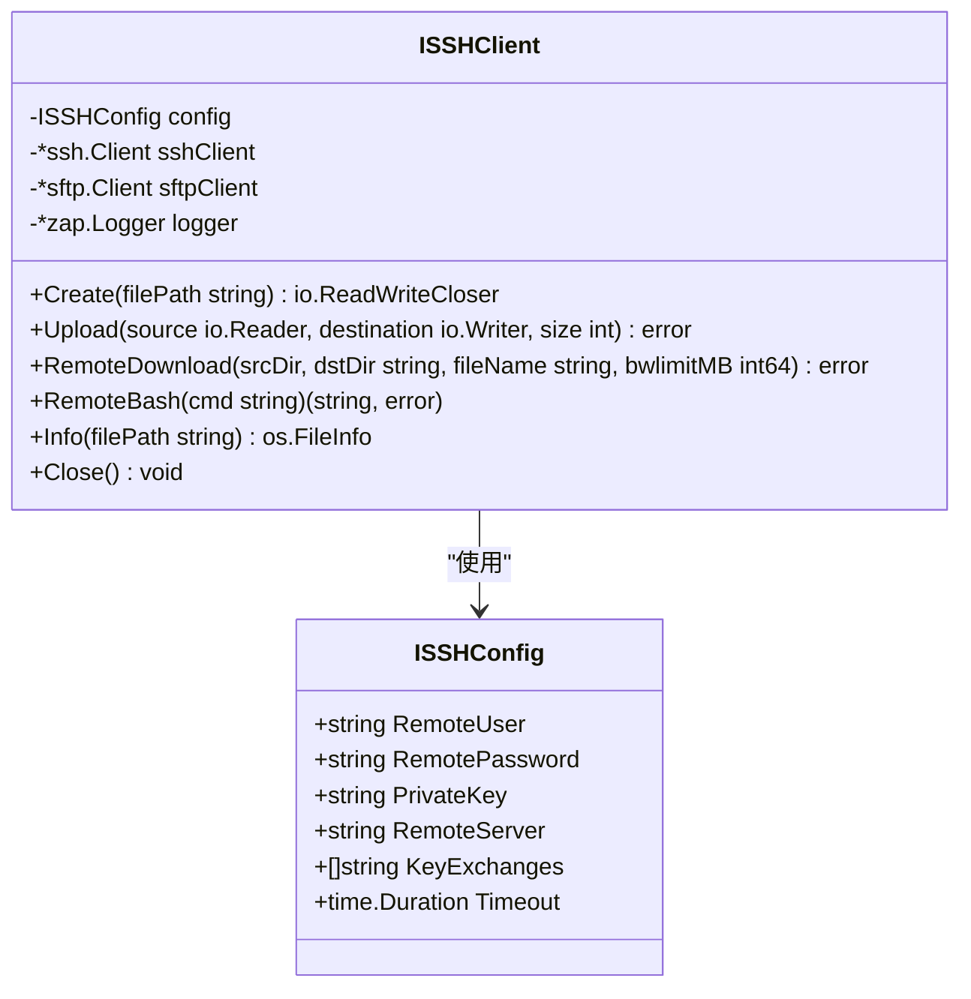
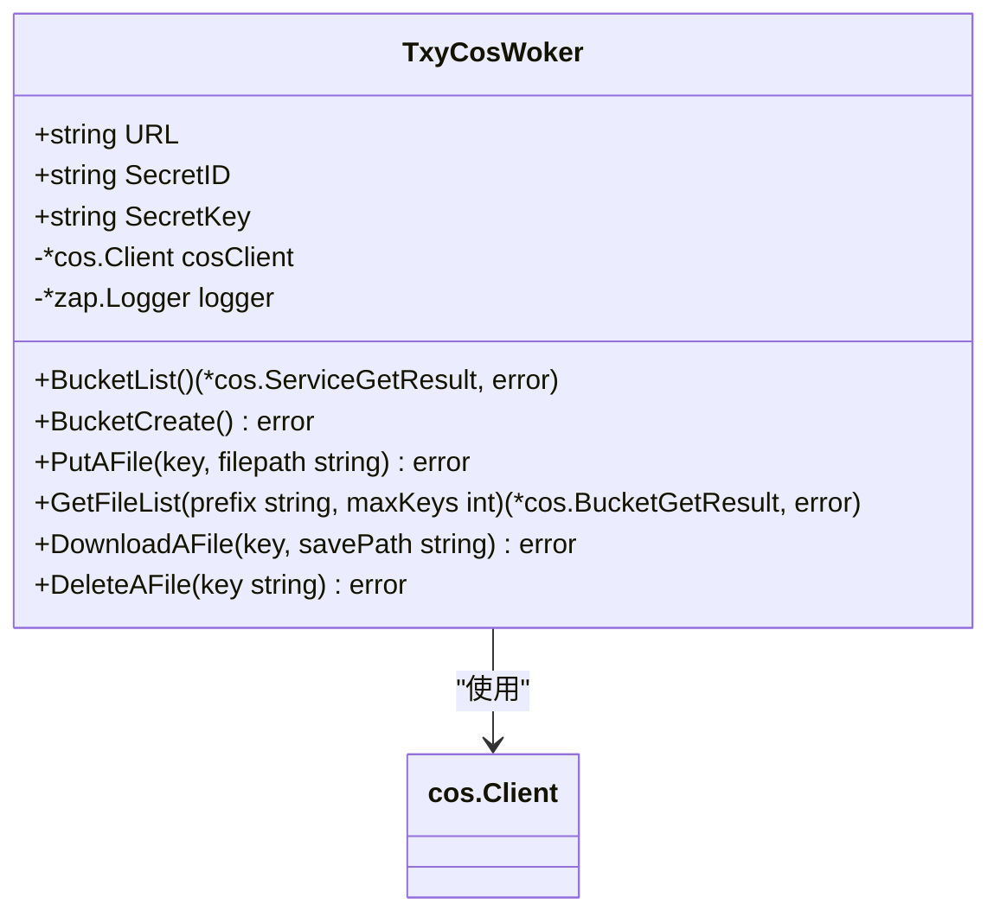
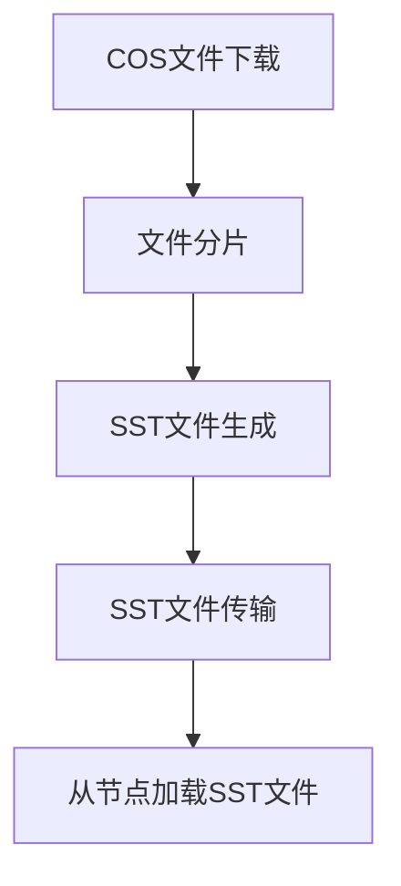
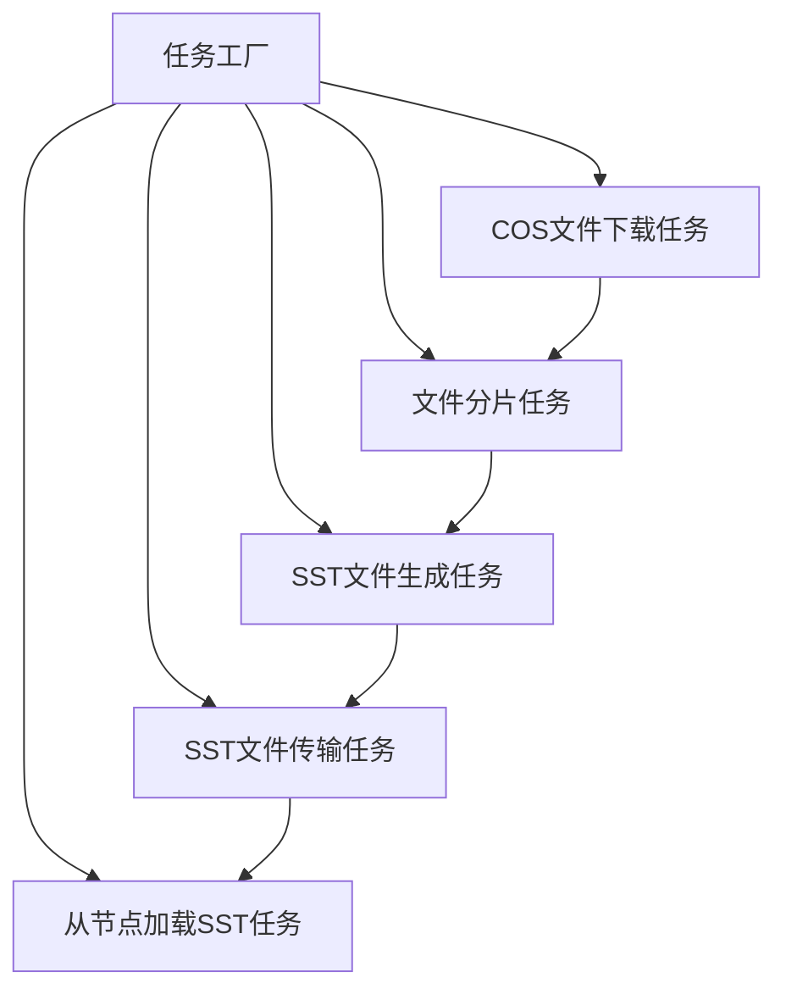
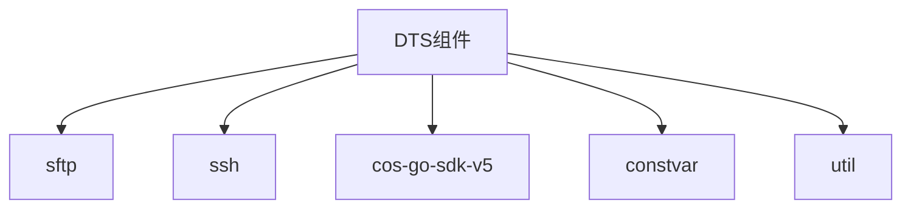

# 远程操作与存储集成

<cite>
**本文档引用的文件**   
- [fileService.go](file://dbm-services/redis/redis-dts/pkg/scrdbclient/fileService.go)
- [txycos.go](file://dbm-services/redis/redis-dts/pkg/txycos/txycos.go)
- [ssh.go](file://dbm-services/redis/redis-dts/pkg/remoteOperation/ssh.go)
- [step1CosFileDownload.go](file://dbm-services/redis/redis-dts/pkg/dtsTask/tendispluslightning/step1CosFileDownload.go)
- [step2FileSplit.go](file://dbm-services/redis/redis-dts/pkg/dtsTask/tendispluslightning/step2FileSplit.go)
- [step3GenerateSST.go](file://dbm-services/redis/redis-dts/pkg/dtsTask/tendispluslightning/step3GenerateSST.go)
- [constvar.go](file://dbm-services/redis/redis-dts/pkg/constvar/constvar.go)
</cite>

## 目录
1. [引言](#引言)
2. [DTS组件远程操作机制](#dts组件远程操作机制)
3. [对象存储集成](#对象存储集成)
4. [Tendis Plus Lightning数据迁移流程](#tendis-plus-lightning数据迁移流程)
5. [核心组件分析](#核心组件分析)
6. [架构概览](#架构概览)
7. [详细组件分析](#详细组件分析)
8. [依赖分析](#依赖分析)
9. [性能考虑](#性能考虑)
10. [故障排除指南](#故障排除指南)
11. [结论](#结论)

## 引言
本文档详细介绍了DTS（Data Transfer Service）组件如何通过SSH协议实现跨机器的远程命令执行与文件传输，以及与对象存储（如腾讯云COS）的集成方式。重点分析了`fileService.go`和`txycos.go`中对蓝鲸文件服务和腾讯云COS的调用逻辑，并说明在Tendis Plus Lightning场景下，SST文件的下载、分片、生成与加载流程，确保大规模数据迁移的高效性与稳定性。

## DTS组件远程操作机制
DTS组件通过SSH协议实现跨机器的远程命令执行与文件传输。该机制主要依赖于`remoteOperation`包中的`ISSHClient`结构体，它封装了SSH和SFTP客户端的功能，提供了创建连接、上传下载文件、执行远程命令等操作。

### SSH连接配置
SSH连接参数通过`ISSHConfig`结构体定义，包括远程用户名、密码、私钥、服务器地址和超时时间等。DTS组件支持通过环境变量获取ABS（蓝鲸作业平台）的用户、密码和端口信息，并使用这些信息创建SSH连接。

**图源**
- [ssh.go](file://dbm-services/redis/redis-dts/pkg/remoteOperation/ssh.go#L25-L33)
- [ssh.go](file://dbm-services/redis/redis-dts/pkg/remoteOperation/ssh.go#L39-L44)

### 远程命令执行
DTS组件通过`RemoteBash`方法执行远程命令。该方法使用`ssh.Session`在远程服务器上执行`bash -c "$cmd"`命令，并捕获输出和错误信息。如果命令执行失败或产生错误输出，将记录错误日志并返回错误。

### 文件传输
DTS组件支持通过SFTP协议进行文件传输。`RemoteDownload`方法用于从远程服务器下载文件，支持带宽限制。该方法会监控文件下载速度，并在下载过程中记录日志。

**本节来源**
- [ssh.go](file://dbm-services/redis/redis-dts/pkg/remoteOperation/ssh.go#L219-L249)
- [ssh.go](file://dbm-services/redis/redis-dts/pkg/remoteOperation/ssh.go#L153-L218)

## 对象存储集成
DTS组件集成了腾讯云COS（Cloud Object Storage）作为对象存储服务，用于存储和管理大规模数据文件。该集成主要通过`txycos`包中的`TxyCosWoker`结构体实现。

### COS客户端初始化
`TxyCosWoker`结构体封装了腾讯云COS客户端的功能，包括桶列表、创建存储桶、文件上传、下载和删除等操作。客户端初始化时，从配置中读取COS的URL、SecretID和SecretKey，并使用这些信息创建COS客户端实例。

**图源**
- [txycos.go](file://dbm-services/redis/redis-dts/pkg/txycos/txycos.go#L18-L24)
- [txycos.go](file://dbm-services/redis/redis-dts/pkg/txycos/txycos.go#L26-L53)

### 文件操作
DTS组件通过`TxyCosWoker`提供的方法进行文件操作。`DownloadAFile`方法用于从COS下载文件，支持多线程下载。`PutAFile`方法用于上传文件到COS，`GetFileList`方法用于获取文件列表，`DeleteAFile`方法用于删除文件。

**本节来源**
- [txycos.go](file://dbm-services/redis/redis-dts/pkg/txycos/txycos.go#L137-L156)
- [txycos.go](file://dbm-services/redis/redis-dts/pkg/txycos/txycos.go#L90-L113)
- [txycos.go](file://dbm-services/redis/redis-dts/pkg/txycos/txycos.go#L115-L135)
- [txycos.go](file://dbm-services/redis/redis-dts/pkg/txycos/txycos.go#L158-L172)

## Tendis Plus Lightning数据迁移流程
在Tendis Plus Lightning场景下，DTS组件通过一系列任务实现大规模数据迁移的高效性与稳定性。整个流程包括COS文件下载、文件分片、SST文件生成、SST文件传输和从节点加载SST文件等步骤。

### 流程概述
1. **COS文件下载**：从腾讯云COS下载原始数据文件到本地。
2. **文件分片**：将下载的文件进行分片处理，生成多个小文件。
3. **SST文件生成**：将分片后的文件转换为SST（Sorted String Table）格式文件。
4. **SST文件传输**：通过SSH协议将SST文件传输到目标集群的从节点。
5. **从节点加载SST文件**：在从节点上加载SST文件，完成数据迁移。

**图源**
- [step1CosFileDownload.go](file://dbm-services/redis/redis-dts/pkg/dtsTask/tendispluslightning/step1CosFileDownload.go)
- [step2FileSplit.go](file://dbm-services/redis/redis-dts/pkg/dtsTask/tendispluslightning/step2FileSplit.go)
- [step3GenerateSST.go](file://dbm-services/redis/redis-dts/pkg/dtsTask/tendispluslightning/step3GenerateSST.go)

### 任务类型定义
Tendis Plus Lightning任务类型在`constvar.go`文件中定义，包括`TendisplusLightningCosFileDownload`、`TendisplusLightningFileSplit`、`TendisplusLightningGenerateSst`、`TendisplusLightningScpSst`和`TendisplusLightningSlaveLoadSst`。

**本节来源**
- [constvar.go](file://dbm-services/redis/redis-dts/pkg/constvar/constvar.go#L108-L114)

## 核心组件分析
DTS组件的核心功能由多个任务类实现，每个任务类负责处理数据迁移流程中的一个特定步骤。

### COS文件下载任务
`CosFileDownloadTask`负责从腾讯云COS下载文件。该任务首先初始化`TxyCosWoker`客户端，然后调用`DownloadAFile`方法下载文件。下载完成后，更新任务状态并进入下一个任务。

**本节来源**
- [step1CosFileDownload.go](file://dbm-services/redis/redis-dts/pkg/dtsTask/tendispluslightning/step1CosFileDownload.go#L15-L94)

### 文件分片任务
`FileSplitTask`负责将下载的文件进行分片处理。该任务使用`tendisplus_lightning_kvfile_split`工具对文件进行分片，并将分片结果保存到指定目录。

**本节来源**
- [step2FileSplit.go](file://dbm-services/redis/redis-dts/pkg/dtsTask/tendispluslightning/step2FileSplit.go#L14-L98)

### SST文件生成任务
`GenerateSstTask`负责将分片后的文件转换为SST格式。该任务使用`tendisplus_lightning_sst_generator`工具生成SST文件，并将文件保存到目标集群从节点的对应目录。

**本节来源**
- [step3GenerateSST.go](file://dbm-services/redis/redis-dts/pkg/dtsTask/tendispluslightning/step3GenerateSST.go#L15-L140)

## 架构概览
DTS组件的整体架构基于任务驱动模式，通过任务工厂创建不同类型的任务实例，并按顺序执行。每个任务实例负责处理数据迁移流程中的一个特定步骤，任务之间通过状态转换进行衔接。

**图源**
- [factory.go](file://dbm-services/redis/redis-dts/pkg/dtsTask/factory/factory.go#L49-L63)

## 详细组件分析
### 任务工厂
`MyTendisplusLightningTaskFactory`是任务工厂函数，根据任务类型创建相应的任务实例。该工厂函数通过比较任务类型字符串来决定创建哪种任务实例。

**本节来源**
- [factory.go](file://dbm-services/redis/redis-dts/pkg/dtsTask/factory/factory.go#L49-L63)

### 工具调用
DTS组件在执行任务时会调用外部工具进行文件处理。例如，`FileSplitTask`调用`tendisplus_lightning_kvfile_split`工具进行文件分片，`GenerateSstTask`调用`tendisplus_lightning_sst_generator`工具生成SST文件。

**本节来源**
- [constvar.go](file://dbm-services/redis/redis-dts/pkg/constvar/constvar.go#L118-L120)

## 依赖分析
DTS组件依赖于多个外部库和内部模块，包括：
- `github.com/pkg/sftp`：用于SFTP文件传输
- `golang.org/x/crypto/ssh`：用于SSH连接
- `github.com/tencentyun/cos-go-sdk-v5`：用于腾讯云COS操作
- `dbm-services/redis/redis-dts/pkg/constvar`：用于常量定义
- `dbm-services/redis/redis-dts/util`：用于通用工具函数

**图源**
- [go.mod](file://dbm-services/redis/redis-dts/go.mod)
- [constvar.go](file://dbm-services/redis/redis-dts/pkg/constvar/constvar.go)
- [util包](file://dbm-services/redis/redis-dts/util)

**本节来源**
- [go.mod](file://dbm-services/redis/redis-dts/go.mod)
- [constvar.go](file://dbm-services/redis/redis-dts/pkg/constvar/constvar.go)
- [util包](file://dbm-services/redis/redis-dts/util)

## 性能考虑
DTS组件在设计时考虑了大规模数据迁移的性能需求，主要体现在以下几个方面：
1. **带宽限制**：在文件传输过程中支持带宽限制，避免占用过多网络资源。
2. **多线程下载**：从COS下载文件时支持多线程下载，提高下载速度。
3. **任务并行**：多个任务可以并行执行，提高整体迁移效率。
4. **资源管理**：通过任务状态管理，合理分配和释放系统资源。

## 故障排除指南
### 常见问题
1. **SSH连接失败**：检查SSH配置是否正确，包括用户名、密码、服务器地址和端口。
2. **COS访问失败**：检查COS的URL、SecretID和SecretKey是否正确。
3. **文件下载失败**：检查网络连接是否正常，COS桶是否存在，文件路径是否正确。
4. **工具执行失败**：检查工具是否存在于指定路径，是否有执行权限。

### 日志分析
DTS组件使用`zap.Logger`记录详细的日志信息，包括任务执行状态、错误信息和调试信息。通过分析日志可以快速定位问题原因。

**本节来源**
- [ssh.go](file://dbm-services/redis/redis-dts/pkg/remoteOperation/ssh.go#L220-L249)
- [txycos.go](file://dbm-services/redis/redis-dts/pkg/txycos/txycos.go#L58-L65)
- [step1CosFileDownload.go](file://dbm-services/redis/redis-dts/pkg/dtsTask/tendispluslightning/step1CosFileDownload.go#L82-L92)

## 结论
DTS组件通过SSH协议和对象存储集成，实现了高效、稳定的大规模数据迁移。其基于任务驱动的架构设计，使得数据迁移流程清晰、可扩展。通过合理利用外部工具和优化性能，DTS组件能够满足Tendis Plus Lightning场景下的数据迁移需求。