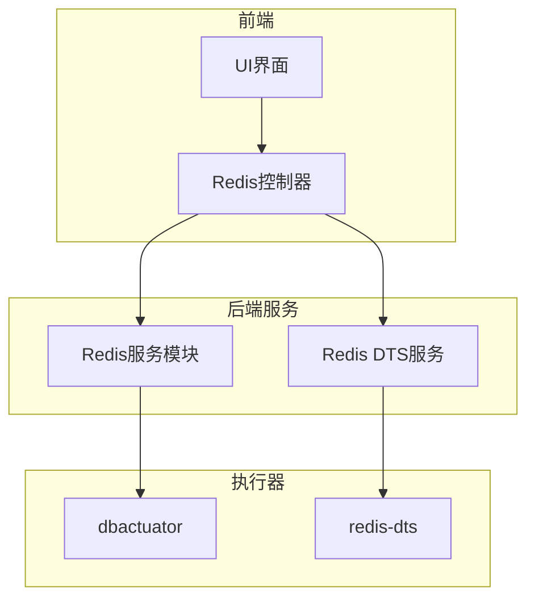
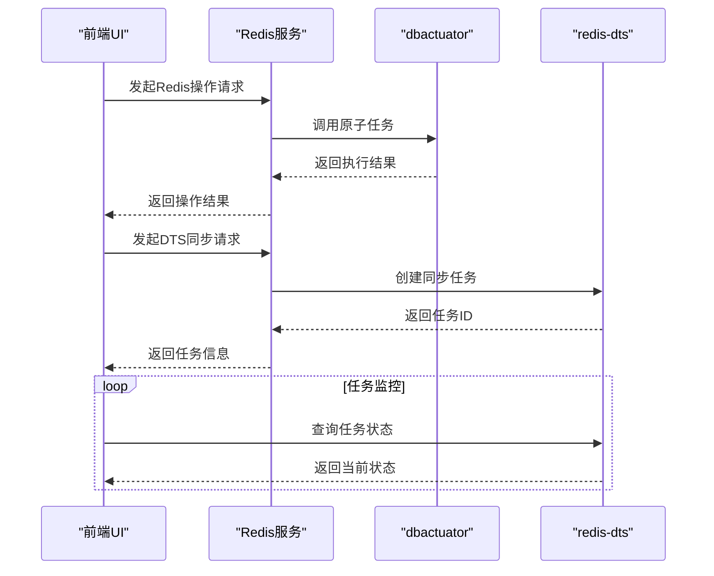
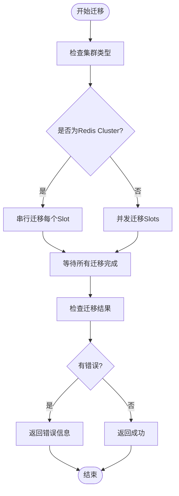
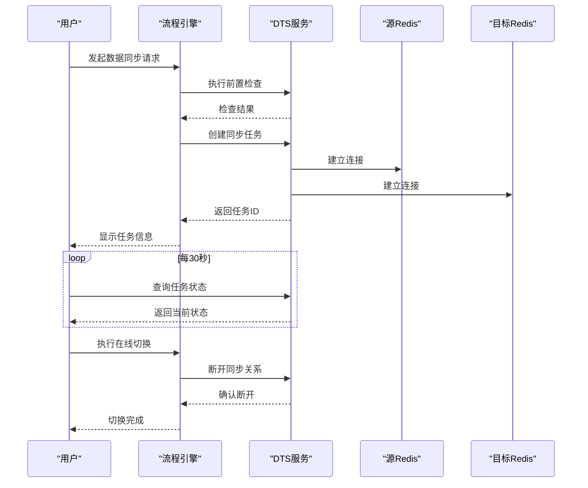
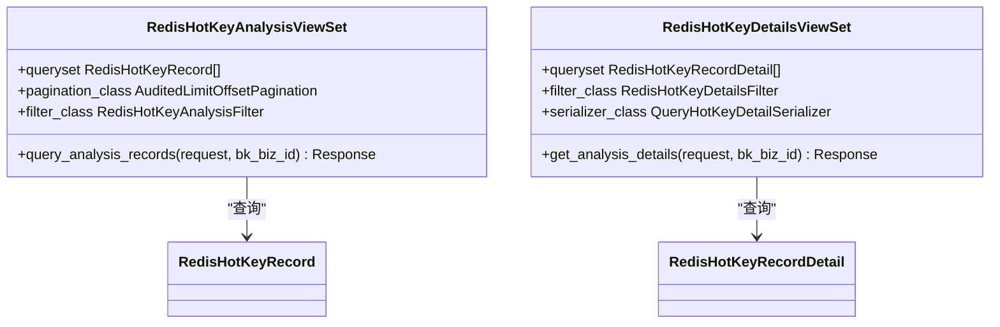
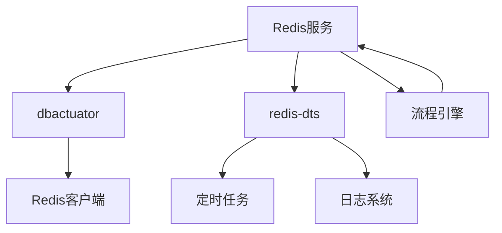

# Redis服务模块

<cite>
**本文档引用的文件**   
- [main.go](file://dbm-services/redis/db-tools/dbactuator/main.go)
- [main.go](file://dbm-services/redis/redis-dts/main.go)
- [redis_migrate_slots.go](file://dbm-services/redis/db-tools/dbactuator/pkg/atomjobs/atomredis/redis_migrate_slots.go)
- [redis_act_playload.py](file://dbm-ui/backend/flow/utils/redis/redis_act_playload.py)
- [redis.py](file://dbm-ui/backend/flow/engine/controller/redis.py)
- [views.py](file://dbm-ui/backend/db_services/redis/hot_key_analysis/views.py)
- [redis_dts.py](file://dbm-ui/backend/flow/plugins/components/collections/redis/redis_dts.py)
- [redis_cluster_data_copy.py](file://dbm-ui/backend/flow/engine/bamboo/scene/redis/redis_cluster_data_copy.py)
- [redis_slots_migrate.py](file://dbm-ui/backend/flow/engine/bamboo/scene/redis/redis_slots_migrate.py)
- [README.md](file://dbm-services/redis/redis-dts/README.md)
</cite>

## 目录
1. [简介](#简介)
2. [项目结构](#项目结构)
3. [核心组件](#核心组件)
4. [架构概述](#架构概述)
5. [详细组件分析](#详细组件分析)
6. [依赖分析](#依赖分析)
7. [性能考虑](#性能考虑)
8. [故障排除指南](#故障排除指南)
9. [结论](#结论)

## 简介
本文档深入解析Redis服务模块的业务逻辑，重点分析`db_services/redis`如何支持Redis实例管理、DTS数据同步、热Key分析、容量评估等高级功能。文档详细解释了其与`dbactuator`和`redis-dts`等后端工具的集成方式，并通过序列图展示Redis数据迁移任务的创建、监控和完成流程。同时，提供了Redis模块管理、Slots迁移等复杂操作的实现细节，并讨论了Redis服务的高可用保障和性能监控集成方案。

## 项目结构
Redis服务模块主要由两个核心部分组成：`dbactuator`和`redis-dts`。`dbactuator`负责执行具体的Redis操作原子任务，而`redis-dts`则专注于数据同步服务。前端UI通过`dbm-ui`中的`db_services/redis`模块与这些后端服务进行交互。

**图源**
- [redis.py](file://dbm-ui/backend/flow/engine/controller/redis.py#L282-L322)
- [main.go](file://dbm-services/redis/db-tools/dbactuator/main.go#L1-L13)

**节源**
- [redis.py](file://dbm-ui/backend/flow/engine/controller/redis.py#L282-L322)
- [main.go](file://dbm-services/redis/db-tools/dbactuator/main.go#L1-L13)

## 核心组件
Redis服务模块的核心功能包括实例管理、数据同步、热Key分析和容量评估。`dbactuator`提供了原子化的操作任务，如Slots迁移、集群管理等。`redis-dts`则实现了跨集群的数据同步功能，支持全量和增量数据复制。

**节源**
- [redis_migrate_slots.go](file://dbm-services/redis/db-tools/dbactuator/pkg/atomjobs/atomredis/redis_migrate_slots.go#L1-L200)
- [redis_dts.py](file://dbm-ui/backend/flow/plugins/components/collections/redis/redis_dts.py#L371-L531)

## 架构概述
Redis服务模块采用分层架构设计，前端UI通过API调用后端服务，后端服务再调用具体的执行器完成任务。`redis-dts`作为独立的服务进程，负责管理数据同步任务的生命周期。

**图源**
- [main.go](file://dbm-services/redis/redis-dts/main.go#L23-L99)
- [redis_cluster_data_copy.py](file://dbm-ui/backend/flow/engine/bamboo/scene/redis/redis_cluster_data_copy.py#L131-L882)

**节源**
- [main.go](file://dbm-services/redis/redis-dts/main.go#L23-L99)
- [redis_cluster_data_copy.py](file://dbm-ui/backend/flow/engine/bamboo/scene/redis/redis_cluster_data_copy.py#L131-L882)

## 详细组件分析

### Redis数据迁移分析
Redis数据迁移功能通过`ClusterMigrateSlots`结构体实现，支持并发和串行两种模式的Slot迁移。对于Redis Cluster，由于其不允许并发迁移Slot，系统会自动切换到串行模式执行。

#### Slots迁移实现

**图源**
- [redis_migrate_slots.go](file://dbm-services/redis/db-tools/dbactuator/pkg/atomjobs/atomredis/redis_migrate_slots.go#L380-L406)
- [redis_slots_migrate.py](file://dbm-ui/backend/flow/engine/bamboo/scene/redis/redis_slots_migrate.py#L109-L141)

**节源**
- [redis_migrate_slots.go](file://dbm-services/redis/db-tools/dbactuator/pkg/atomjobs/atomredis/redis_migrate_slots.go#L380-L406)
- [redis_slots_migrate.py](file://dbm-ui/backend/flow/engine/bamboo/scene/redis/redis_slots_migrate.py#L109-L141)

### DTS数据同步流程
DTS数据同步流程包括前置检查、任务创建、增量同步和最终切换等阶段。系统通过定时任务监控同步状态，确保数据一致性。

#### DTS同步序列图

**图源**
- [redis_dts.py](file://dbm-ui/backend/flow/plugins/components/collections/redis/redis_dts.py#L390-L531)
- [redis_cluster_data_copy.py](file://dbm-ui/backend/flow/engine/bamboo/scene/redis/redis_cluster_data_copy.py#L131-L882)

**节源**
- [redis_dts.py](file://dbm-ui/backend/flow/plugins/components/collections/redis/redis_dts.py#L390-L531)
- [redis_cluster_data_copy.py](file://dbm-ui/backend/flow/engine/bamboo/scene/redis/redis_cluster_data_copy.py#L131-L882)

### 热Key分析功能
热Key分析功能通过专门的视图集实现，提供热Key记录的查询和详情查看功能。系统会定期扫描Redis实例，识别访问频率高的Key。

**图源**
- [views.py](file://dbm-ui/backend/db_services/redis/hot_key_analysis/views.py#L36-L72)
- [redis_act_playload.py](file://dbm-ui/backend/flow/utils/redis/redis_act_playload.py#L2665-L2673)

**节源**
- [views.py](file://dbm-ui/backend/db_services/redis/hot_key_analysis/views.py#L36-L72)
- [redis_act_playload.py](file://dbm-ui/backend/flow/utils/redis/redis_act_playload.py#L2665-L2673)

## 依赖分析
Redis服务模块依赖多个核心组件，包括`dbactuator`用于执行原子任务，`redis-dts`用于数据同步，以及前端UI的流程引擎。

**图源**
- [main.go](file://dbm-services/redis/db-tools/dbactuator/main.go#L8)
- [main.go](file://dbm-services/redis/redis-dts/main.go#L11-L17)

**节源**
- [main.go](file://dbm-services/redis/db-tools/dbactuator/main.go#L8)
- [main.go](file://dbm-services/redis/redis-dts/main.go#L11-L17)

## 性能考虑
Redis服务模块在设计时充分考虑了性能因素。对于Slots迁移操作，系统会根据集群类型自动选择最优的执行模式。在DTS数据同步过程中，通过批量处理和并发执行来提高效率。热Key分析功能采用异步扫描机制，避免对生产环境造成影响。

## 故障排除指南
当Redis服务出现问题时，可以按照以下步骤进行排查：
1. 检查`dbactuator`日志，确认原子任务执行情况
2. 查看`redis-dts`服务状态，确认数据同步任务是否正常运行
3. 检查网络连接，确保源和目标Redis实例可达
4. 验证权限配置，确认有足够的操作权限
5. 查看系统资源使用情况，确保有足够的CPU和内存资源

**节源**
- [main.go](file://dbm-services/redis/redis-dts/main.go#L23-L99)
- [redis_migrate_slots.go](file://dbm-services/redis/db-tools/dbactuator/pkg/atomjobs/atomredis/redis_migrate_slots.go#L894-L933)

## 结论
Redis服务模块通过`dbactuator`和`redis-dts`两个核心组件，提供了完整的Redis实例管理和数据同步解决方案。系统采用分层架构设计，具有良好的可扩展性和稳定性。通过详细的错误处理机制和监控功能，确保了服务的高可用性。未来可以进一步优化并发处理能力，提高大规模数据迁移的效率。