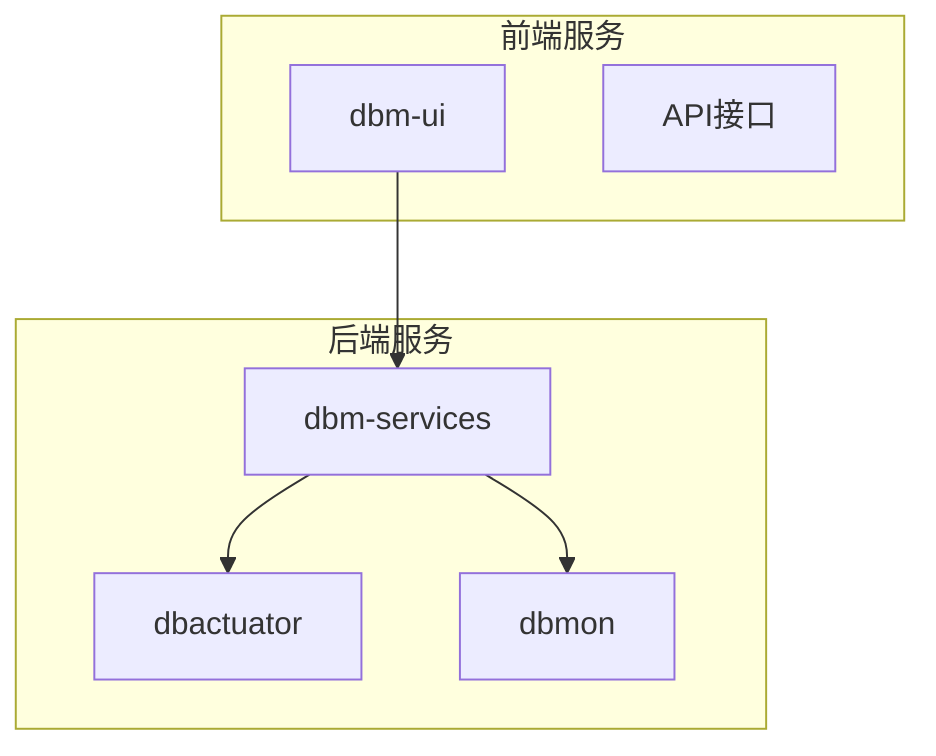
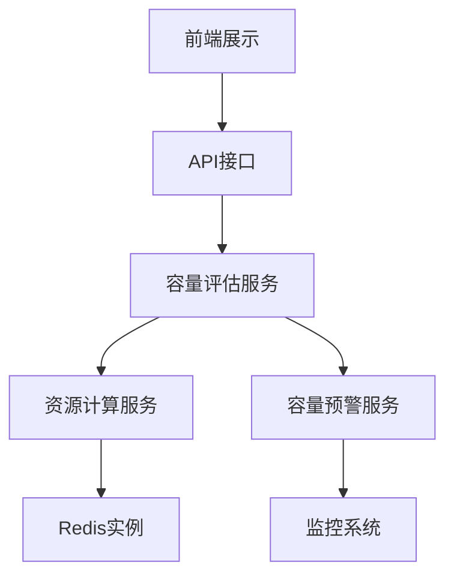
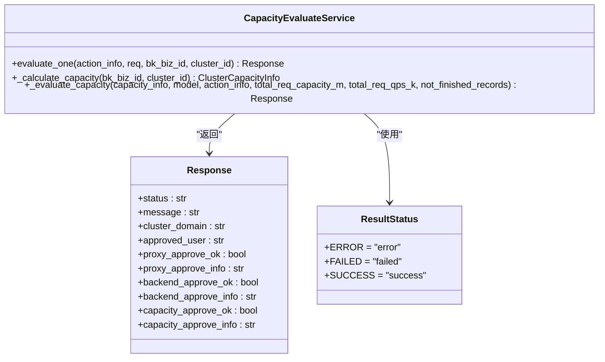
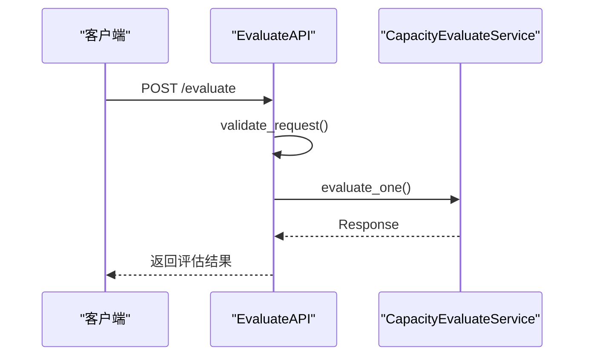
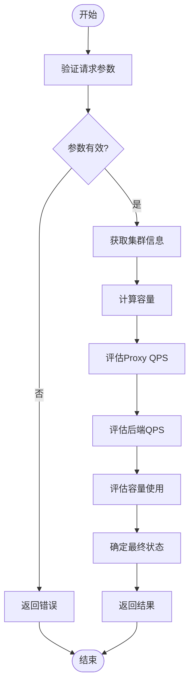
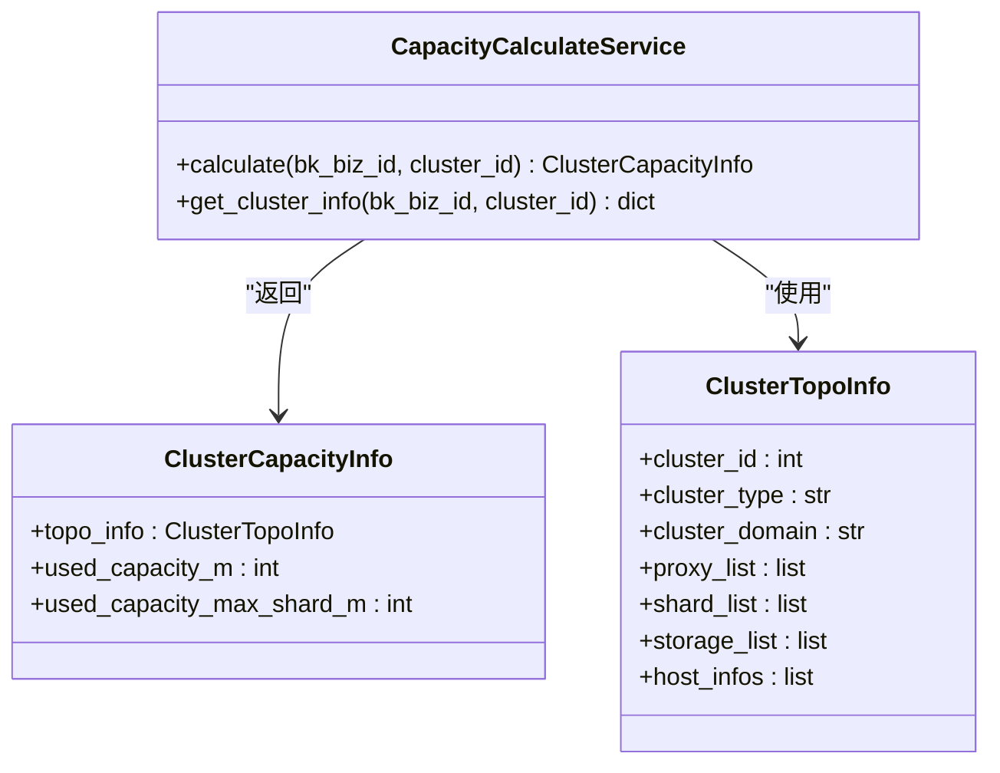
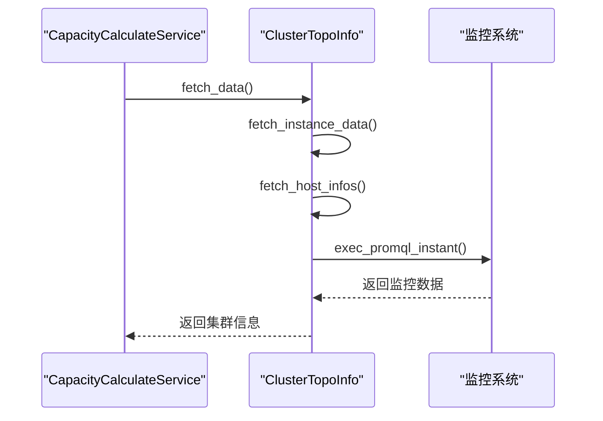
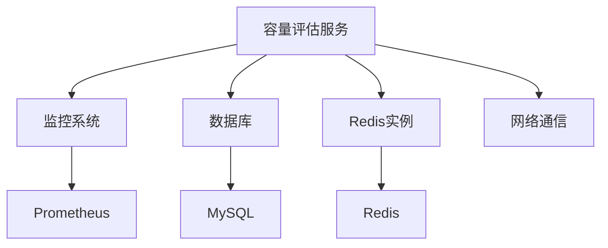

# 容量评估

<cite>
**本文档引用的文件**   
- [evaluate_api.py](file://dbm-ui/backend/db_services/redis/capacity_evaluate_service/api/evaluate_api.py)
- [evaluate_service.py](file://dbm-ui/backend/db_services/redis/capacity_evaluate_service/services/evaluate_service.py)
- [capacity_cal.py](file://dbm-ui/backend/db_services/redis/capacity_evaluate_service/services/capacity_cal.py)
- [cluster_topo_repo.py](file://dbm-ui/backend/db_services/redis/capacity_evaluate_service/repositories/cluster_topo_repo.py)
- [tb_capacity_evaluate.py](file://dbm-ui/backend/db_services/redis/capacity_evaluate_service/models/tb_capacity_evaluate.py)
- [keystat.go](file://dbm-services/redis/db-tools/dbactuator/pkg/atomjobs/atomsys/keystat.go)
- [keystat_report.go](file://dbm-services/redis/db-tools/dbactuator/pkg/keystat_report/keystat_report.go)
- [redisinfo.go](file://dbm-services/redis/db-tools/dbactuator/pkg/redisinfo/redisinfo.go)
- [info-memory.txt](file://dbm-services/redis/db-tools/dbactuator/pkg/redisinfo/resources/info-memory.txt)
</cite>

## 目录
1. [引言](#引言)
2. [项目结构](#项目结构)
3. [核心组件](#核心组件)
4. [架构概述](#架构概述)
5. [详细组件分析](#详细组件分析)
6. [依赖分析](#依赖分析)
7. [性能考虑](#性能考虑)
8. [故障排除指南](#故障排除指南)
9. [结论](#结论)

## 引言
本文档全面介绍Redis容量评估功能的设计与实现。系统基于历史数据增长趋势、内存使用率、QPS等指标，预测未来容量需求。分析`dbactuator`中与容量评估相关的组件，如资源计算、容量预警等。结合`db_services/redis/capacity`中的代码，解释前端如何展示容量评估结果，并提供扩容建议。讨论容量评估的准确性影响因素及优化方法，如数据采样频率、预测模型选择等。

## 项目结构
Redis容量评估功能主要分布在`dbm-ui`和`dbm-services`两个目录下。`dbm-ui`包含前端服务和API接口，`dbm-services`包含后台执行器和监控工具。核心功能集中在`dbm-ui/backend/db_services/redis/capacity_evaluate_service`和`dbm-services/redis/db-tools/dbactuator/pkg`目录中。

**图源**
- [evaluate_api.py](file://dbm-ui/backend/db_services/redis/capacity_evaluate_service/api/evaluate_api.py#L26-L147)
- [evaluate_service.py](file://dbm-ui/backend/db_services/redis/capacity_evaluate_service/services/evaluate_service.py#L110-L355)

**节源**
- [evaluate_api.py](file://dbm-ui/backend/db_services/redis/capacity_evaluate_service/api/evaluate_api.py#L1-L147)
- [evaluate_service.py](file://dbm-ui/backend/db_services/redis/capacity_evaluate_service/services/evaluate_service.py#L1-L355)

## 核心组件
容量评估功能的核心组件包括容量评估服务、资源计算服务、容量预警服务等。这些组件协同工作，实现对Redis集群的全面容量评估。

**节源**
- [evaluate_service.py](file://dbm-ui/backend/db_services/redis/capacity_evaluate_service/services/evaluate_service.py#L110-L355)
- [capacity_cal.py](file://dbm-ui/backend/db_services/redis/capacity_evaluate_service/services/capacity_cal.py#L22-L57)

## 架构概述
系统架构分为前端展示层、API接口层、服务层和数据采集层。前端展示层负责用户交互，API接口层提供RESTful接口，服务层实现核心业务逻辑，数据采集层从Redis实例和监控系统获取数据。

**图源**
- [evaluate_service.py](file://dbm-ui/backend/db_services/redis/capacity_evaluate_service/services/evaluate_service.py#L110-L355)
- [capacity_cal.py](file://dbm-ui/backend/db_services/redis/capacity_evaluate_service/services/capacity_cal.py#L22-L57)

## 详细组件分析
### 容量评估服务分析
容量评估服务是整个系统的核心，负责协调各个组件完成容量评估任务。

#### 对象导向组件

**图源**
- [evaluate_service.py](file://dbm-ui/backend/db_services/redis/capacity_evaluate_service/services/evaluate_service.py#L110-L355)

#### API服务组件

**图源**
- [evaluate_api.py](file://dbm-ui/backend/db_services/redis/capacity_evaluate_service/api/evaluate_api.py#L26-L147)
- [evaluate_service.py](file://dbm-ui/backend/db_services/redis/capacity_evaluate_service/services/evaluate_service.py#L110-L355)

#### 复杂逻辑组件

**图源**
- [evaluate_service.py](file://dbm-ui/backend/db_services/redis/capacity_evaluate_service/services/evaluate_service.py#L110-L355)

**节源**
- [evaluate_service.py](file://dbm-ui/backend/db_services/redis/capacity_evaluate_service/services/evaluate_service.py#L1-L355)
- [evaluate_api.py](file://dbm-ui/backend/db_services/redis/capacity_evaluate_service/api/evaluate_api.py#L1-L147)

### 资源计算服务分析
资源计算服务负责从Redis实例和监控系统获取实际的资源使用情况。

#### 对象导向组件

**图源**
- [capacity_cal.py](file://dbm-ui/backend/db_services/redis/capacity_evaluate_service/services/capacity_cal.py#L22-L57)
- [cluster_topo_repo.py](file://dbm-ui/backend/db_services/redis/capacity_evaluate_service/repositories/cluster_topo_repo.py#L50-L473)

#### 数据采集流程

**图源**
- [capacity_cal.py](file://dbm-ui/backend/db_services/redis/capacity_evaluate_service/services/capacity_cal.py#L22-L57)
- [cluster_topo_repo.py](file://dbm-ui/backend/db_services/redis/capacity_evaluate_service/repositories/cluster_topo_repo.py#L50-L473)

**节源**
- [capacity_cal.py](file://dbm-ui/backend/db_services/redis/capacity_evaluate_service/services/capacity_cal.py#L1-L57)
- [cluster_topo_repo.py](file://dbm-ui/backend/db_services/redis/capacity_evaluate_service/repositories/cluster_topo_repo.py#L1-L473)

## 依赖分析
系统依赖于多个外部组件和内部模块，包括监控系统、数据库、网络通信等。

**图源**
- [cluster_topo_repo.py](file://dbm-ui/backend/db_services/redis/capacity_evaluate_service/repositories/cluster_topo_repo.py#L18-L473)
- [evaluate_service.py](file://dbm-ui/backend/db_services/redis/capacity_evaluate_service/services/evaluate_service.py#L19-L28)

**节源**
- [cluster_topo_repo.py](file://dbm-ui/backend/db_services/redis/capacity_evaluate_service/repositories/cluster_topo_repo.py#L1-L473)
- [evaluate_service.py](file://dbm-ui/backend/db_services/redis/capacity_evaluate_service/services/evaluate_service.py#L1-L355)

## 性能考虑
容量评估功能在设计时充分考虑了性能因素，包括数据采样频率、查询优化、并发处理等。

- **数据采样频率**：系统采用5分钟的采样间隔，平衡了数据准确性和系统负载。
- **查询优化**：使用PromQL进行高效的数据查询，减少网络传输和处理时间。
- **并发处理**：支持并发评估多个集群，提高整体处理效率。
- **缓存机制**：对频繁访问的数据进行缓存，减少重复查询。

## 故障排除指南
### 常见问题及解决方案
1. **评估失败**：检查Redis实例是否在线，监控数据是否正常采集。
2. **数据不准确**：确认采样频率设置是否合理，检查监控系统配置。
3. **性能瓶颈**：优化查询语句，增加缓存，调整并发数。
4. **权限问题**：确保服务账户具有足够的权限访问Redis实例和监控系统。

### 调试工具
- **日志分析**：查看服务日志，定位具体错误信息。
- **监控仪表盘**：使用Grafana等工具查看系统运行状态。
- **API测试**：使用Postman等工具测试API接口。

**节源**
- [evaluate_service.py](file://dbm-ui/backend/db_services/redis/capacity_evaluate_service/services/evaluate_service.py#L138-L141)
- [cluster_topo_repo.py](file://dbm-ui/backend/db_services/redis/capacity_evaluate_service/repositories/cluster_topo_repo.py#L468-L472)

## 结论
Redis容量评估功能通过集成多个组件，实现了对Redis集群的全面容量评估。系统基于历史数据增长趋势、内存使用率、QPS等指标，预测未来容量需求，为运维人员提供科学的扩容建议。通过合理的架构设计和性能优化，系统能够高效、准确地完成容量评估任务，保障Redis集群的稳定运行。