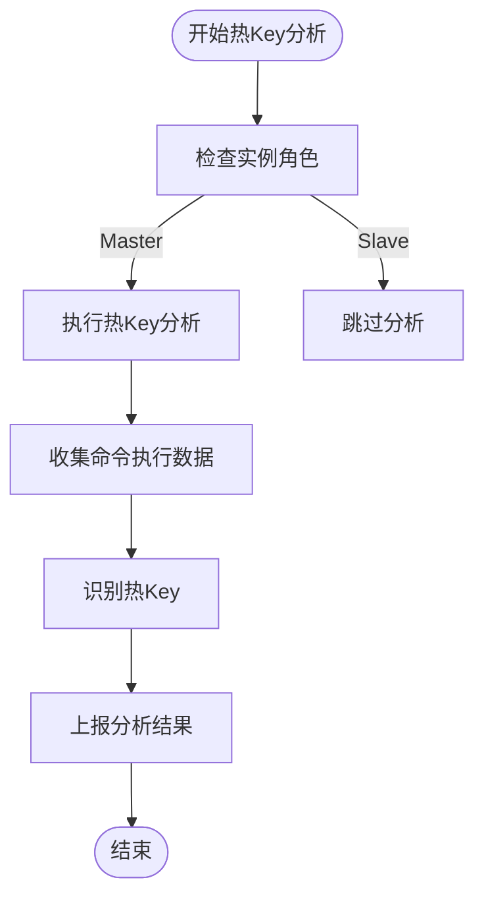
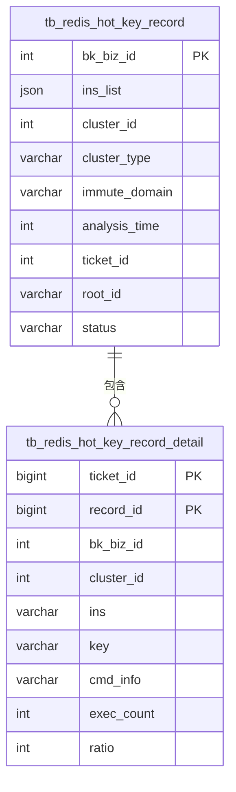
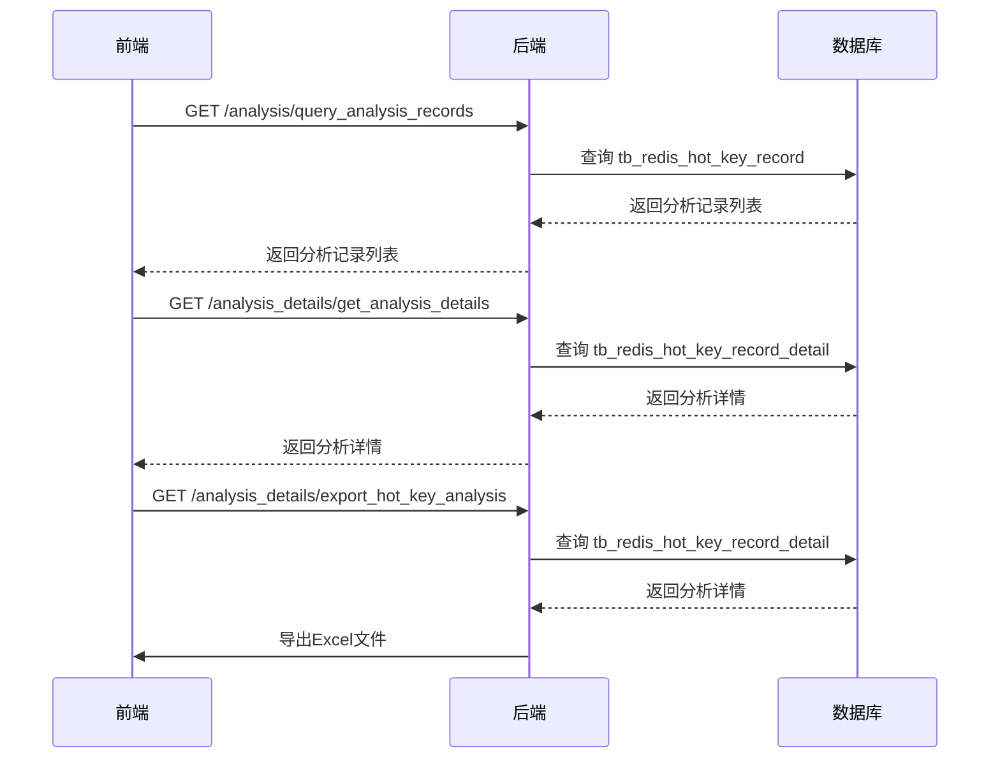

# 热Key分析

<cite>
**本文档引用的文件**   
- [task.go](file://dbm-services/redis/db-tools/dbmon/pkg/keylifecycle/task.go)
- [hotkey_analysis.go](file://dbm-services/redis/db-tools/dbactuator/pkg/atomjobs/atomsys/hotkey_analysis.go)
- [redis_hot_key.py](file://dbm-ui/backend/db_services/redis/hot_key_analysis/models/redis_hot_key.py)
- [views.py](file://dbm-ui/backend/db_services/redis/hot_key_analysis/views.py)
- [serializers.py](file://dbm-ui/backend/db_services/redis/hot_key_analysis/serializers.py)
- [filters.py](file://dbm-ui/backend/db_services/redis/hot_key_analysis/filters.py)
- [urls.py](file://dbm-ui/backend/db_services/redis/hot_key_analysis/urls.py)
- [keystat.go](file://dbm-services/redis/db-tools/dbmon/config/keystat.go)
- [config.go](file://dbm-services/redis/db-tools/dbmon/config/config.go)
</cite>

## 目录
1. [引言](#引言)
2. [热Key分析技术实现](#热key分析技术实现)
3. [分析结果存储结构](#分析结果存储结构)
4. [前端API调用与可视化](#前端api调用与可视化)
5. [热Key对Redis性能的影响及应对策略](#热key对redis性能的影响及应对策略)
6. [告警机制](#告警机制)

## 引言
热Key分析是Redis性能监控的重要组成部分，用于识别访问频率异常高的Key，防止因单个Key的高并发访问导致Redis实例性能下降甚至崩溃。本文档详细阐述了`dbmon`组件如何通过采集Redis实例的命令执行频率、内存使用情况等指标来识别访问热点Key，并说明热Key分析结果的存储结构、展示方式以及告警机制。

## 热Key分析技术实现

`dbmon`组件通过`hotKeyWithMonitor`方法实现热Key分析。该方法在`task.go`文件中定义，主要逻辑如下：

1. **初始化分析任务**：`dbmon`组件首先会初始化一个热Key分析任务，该任务会遍历所有配置的Redis实例。
2. **角色判断**：对于每个Redis实例，`dbmon`会判断其角色（master或slave）。热Key分析仅在master实例上执行，因为master实例处理所有的写操作，能够更准确地反映Key的访问模式。
3. **执行热Key分析**：`dbmon`使用`hotKeyWithMonitor`方法对master实例进行热Key分析。该方法会调用`TendisKeyLifecycleBin`工具的`hotkeys`命令，通过监控Redis实例的命令执行情况来识别热Key。
4. **结果上报**：分析完成后，`dbmon`会将结果通过`sendAndReport`方法上报给指定的报告系统。



**Diagram sources**
- [task.go](file://dbm-services/redis/db-tools/dbmon/pkg/keylifecycle/task.go#L82-L102)

**Section sources**
- [task.go](file://dbm-services/redis/db-tools/dbmon/pkg/keylifecycle/task.go#L82-L102)

## 分析结果存储结构

热Key分析结果存储在两个数据库表中：`tb_redis_hot_key_record`和`tb_redis_hot_key_record_detail`。

- **tb_redis_hot_key_record**：存储每次热Key分析的基本信息，包括业务ID、实例列表、集群ID、分析时长、关联单据ID等。
- **tb_redis_hot_key_record_detail**：存储每次热Key分析的详细信息，包括具体实例、热Key、执行命令、执行次数和执行占比等。



**Diagram sources**
- [redis_hot_key.py](file://dbm-ui/backend/db_services/redis/hot_key_analysis/models/redis_hot_key.py#L23-L64)

**Section sources**
- [redis_hot_key.py](file://dbm-ui/backend/db_services/redis/hot_key_analysis/models/redis_hot_key.py#L23-L64)

## 前端API调用与可视化

前端通过调用后端API获取热Key数据，并提供可视化展示。主要API包括：

- **query_analysis_records**：获取热Key分析记录列表。
- **get_analysis_details**：获取指定分析记录的详细信息。
- **export_hot_key_analysis**：导出热Key分析记录。

前端通过`RedisHotKeyAnalysisViewSet`和`RedisHotKeyDetailsViewSet`两个视图集来处理这些API请求。`RedisHotKeyAnalysisViewSet`用于获取分析记录列表，`RedisHotKeyDetailsViewSet`用于获取分析记录详情和导出数据。



**Diagram sources**
- [views.py](file://dbm-ui/backend/db_services/redis/hot_key_analysis/views.py#L36-L124)
- [urls.py](file://dbm-ui/backend/db_services/redis/hot_key_analysis/urls.py#L1-L23)

**Section sources**
- [views.py](file://dbm-ui/backend/db_services/redis/hot_key_analysis/views.py#L36-L124)
- [urls.py](file://dbm-ui/backend/db_services/redis/hot_key_analysis/urls.py#L1-L23)

## 热Key对Redis性能的影响及应对策略

热Key对Redis性能的影响主要体现在以下几个方面：

1. **CPU使用率升高**：频繁访问的热Key会导致Redis实例的CPU使用率升高，影响其他操作的执行效率。
2. **内存压力增大**：热Key通常伴随着大量的数据读写，会增加Redis实例的内存压力。
3. **网络带宽占用**：热Key的频繁访问会占用大量的网络带宽，影响其他客户端的连接质量。

应对策略包括：

- **Key拆分**：将大Key拆分为多个小Key，分散访问压力。
- **缓存穿透防护**：通过布隆过滤器等技术防止缓存穿透，减少对后端数据库的直接访问。
- **限流**：对访问频率过高的Key进行限流，防止其影响整个Redis实例的性能。

## 告警机制

`dbmon`组件通过配置文件中的`ConfRedisKeyLifeCycle`结构体来配置热Key分析的告警机制。告警机制主要包括：

- **分析频率**：通过`Cron`字段配置热Key分析的执行频率。
- **分析时长**：通过`HotKeyConf.Duration`字段配置每次分析的持续时间。
- **结果上报**：分析结果通过`sendAndReport`方法上报给指定的报告系统，报告系统可以根据配置的规则触发告警。

```mermaid
flowchart TD
Start([开始] --> ConfigAnalysis["配置分析参数"]
ConfigAnalysis --> SetCron["设置Cron表达式"]
SetCron --> SetDuration["设置分析时长"]
SetDuration --> ExecuteAnalysis["执行分析"]
ExecuteAnalysis --> CheckResults["检查分析结果"]
CheckResults --> |发现热Key| TriggerAlert["触发告警"]
CheckResults --> |未发现热Key| End([结束])
TriggerAlert --> SendReport["发送告警报告"]
SendReport --> End
```

**Diagram sources**
- [config.go](file://dbm-services/redis/db-tools/dbmon/config/config.go#L56-L62)
- [keystat.go](file://dbm-services/redis/db-tools/dbmon/config/keystat.go#L4-L7)

**Section sources**
- [config.go](file://dbm-services/redis/db-tools/dbmon/config/config.go#L56-L62)
- [keystat.go](file://dbm-services/redis/db-tools/dbmon/config/keystat.go#L4-L7)